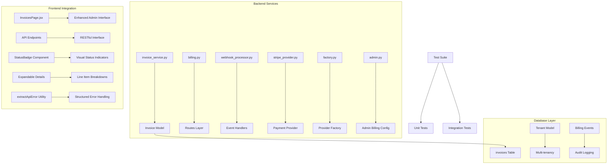
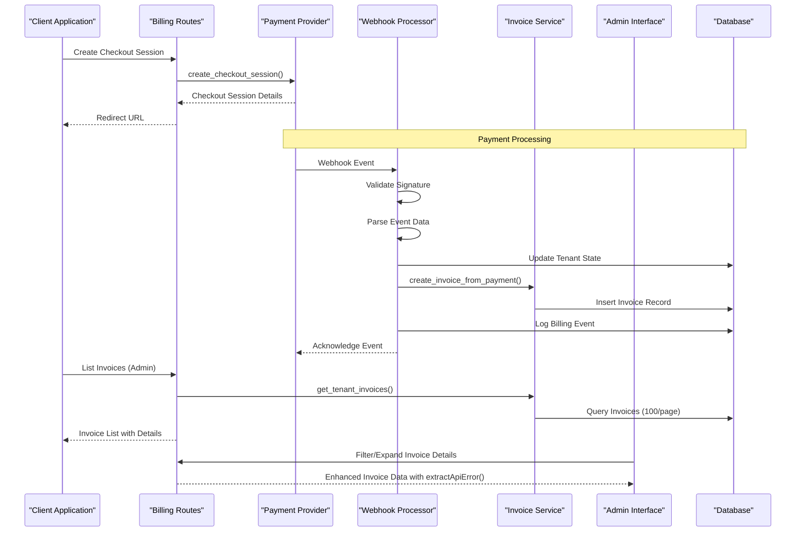
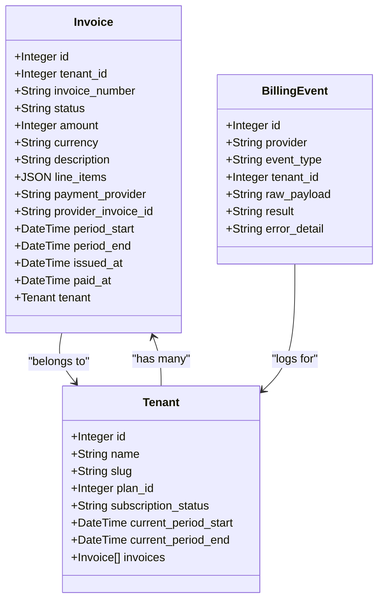
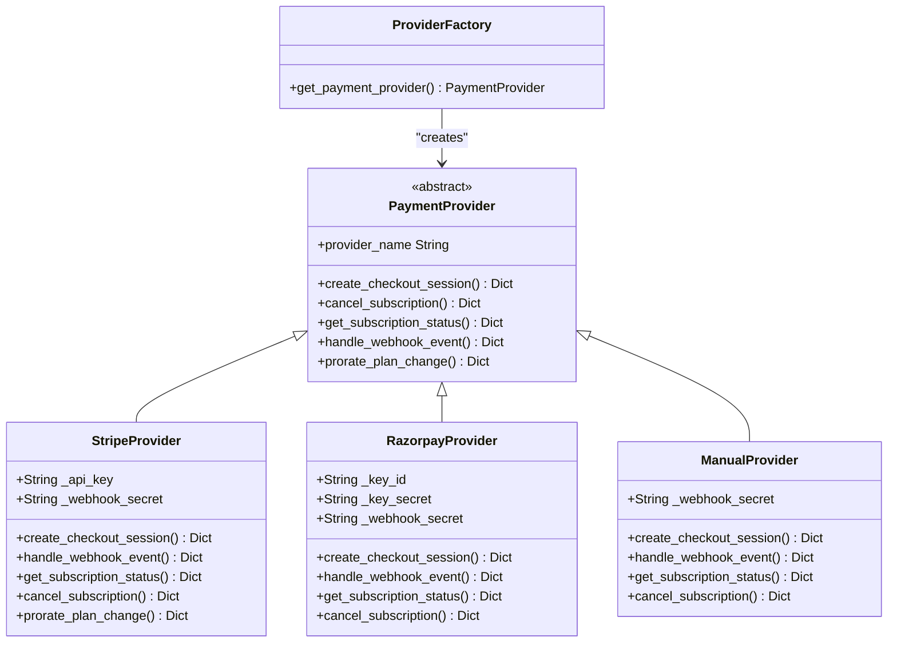
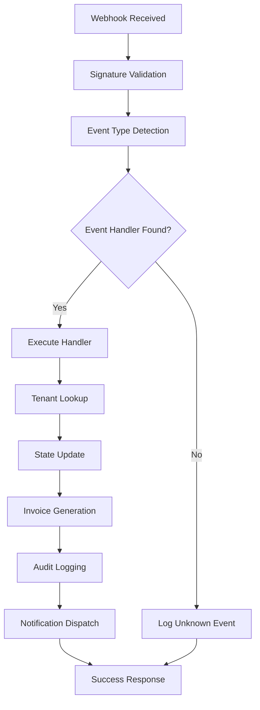
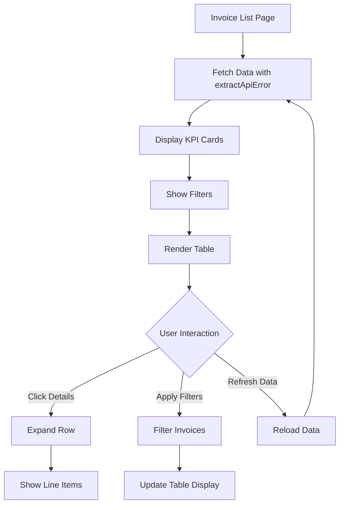
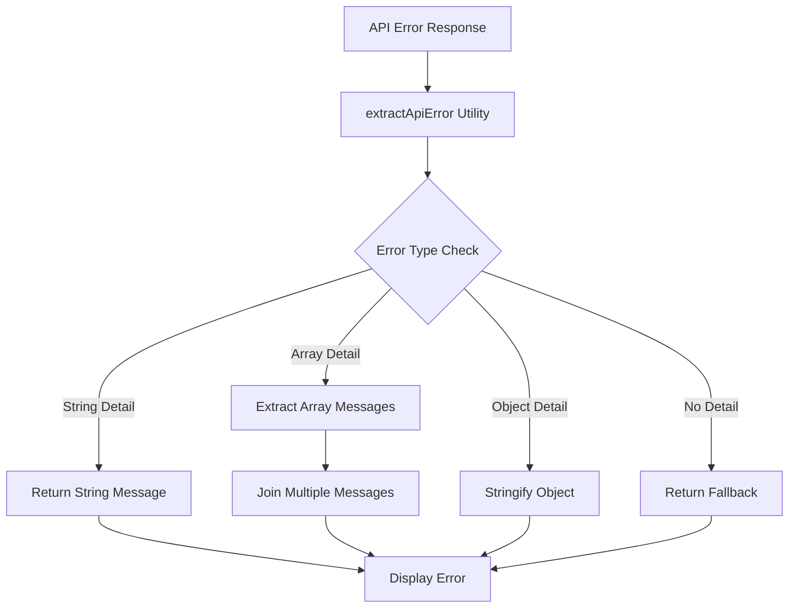
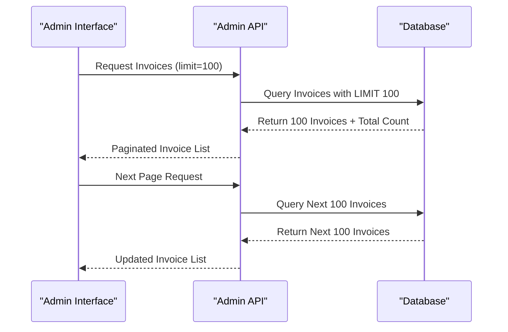
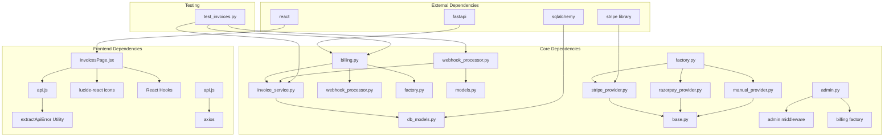

# Invoice Management

<cite>
**Referenced Files in This Document**
- [invoice_service.py](file://app/backend/services/billing/invoice_service.py)
- [billing.py](file://app/backend/routes/billing.py)
- [admin.py](file://app/backend/routes/admin.py)
- [028_invoices.py](file://alembic/versions/028_invoices.py)
- [db_models.py](file://app/backend/models/db_models.py)
- [stripe_provider.py](file://app/backend/services/billing/stripe_provider.py)
- [webhook_processor.py](file://app/backend/services/billing/webhook_processor.py)
- [base.py](file://app/backend/services/billing/base.py)
- [factory.py](file://app/backend/services/billing/factory.py)
- [test_invoices.py](file://app/backend/tests/test_invoices.py)
- [InvoicesPage.jsx](file://app/frontend/src/pages/admin/InvoicesPage.jsx)
- [api.js](file://app/frontend/src/lib/api.js)
</cite>

## Update Summary
**Changes Made**
- Enhanced error handling with extractApiError() utility for improved API error management
- Optimized pagination to 100 items per page for admin invoice listings
- Improved frontend error display and user experience with structured error messages
- Enhanced admin invoice endpoint with better pagination support

## Table of Contents
1. [Introduction](#introduction)
2. [Project Structure](#project-structure)
3. [Core Components](#core-components)
4. [Architecture Overview](#architecture-overview)
5. [Detailed Component Analysis](#detailed-component-analysis)
6. [Frontend Enhancement Analysis](#frontend-enhancement-analysis)
7. [Error Handling Improvements](#error-handling-improvements)
8. [Pagination Optimization](#pagination-optimization)
9. [Dependency Analysis](#dependency-analysis)
10. [Performance Considerations](#performance-considerations)
11. [Troubleshooting Guide](#troubleshooting-guide)
12. [Conclusion](#conclusion)

## Introduction

The Invoice Management system is a comprehensive billing solution integrated into the Resume AI platform that handles payment processing, invoice generation, and subscription management. This system provides multi-provider payment support (Stripe, Razorpay, and Manual) with automatic invoice creation upon successful payments and robust webhook processing for real-time subscription state updates.

The system follows a modular architecture with clear separation of concerns between payment providers, invoice generation, and webhook processing. It ensures tenant isolation, maintains audit trails, and provides comprehensive reporting capabilities for both end-users and platform administrators.

**Updated** The system now features enhanced error handling through the extractApiError() utility, which provides structured error messages for API responses. Additionally, pagination has been optimized to 100 items per page for admin invoice listings, improving performance and user experience when managing large invoice datasets.

## Project Structure

The Invoice Management system is organized across several key areas:

**Diagram sources**
- [invoice_service.py:1-134](file://app/backend/services/billing/invoice_service.py#L1-L134)
- [billing.py:1-224](file://app/backend/routes/billing.py#L1-L224)
- [admin.py:1700-1824](file://app/backend/routes/admin.py#L1700-L1824)
- [db_models.py:612-640](file://app/backend/models/db_models.py#L612-L640)
- [api.js:1072-1085](file://app/frontend/src/lib/api.js#L1072-L1085)

**Section sources**
- [invoice_service.py:1-134](file://app/backend/services/billing/invoice_service.py#L1-L134)
- [billing.py:1-224](file://app/backend/routes/billing.py#L1-L224)
- [admin.py:1700-1824](file://app/backend/routes/admin.py#L1700-L1824)
- [db_models.py:612-640](file://app/backend/models/db_models.py#L612-L640)

## Core Components

### Invoice Service
The core invoice service provides centralized functionality for invoice generation and retrieval:

- **Sequential Number Generation**: Creates unique invoice numbers following the format `INV-{YYYY}-NNNNN`
- **Invoice Creation**: Generates invoice records with comprehensive payment details
- **Tenant Scoping**: Ensures invoices are properly isolated by tenant
- **Pagination Support**: Provides efficient querying with configurable limit/offset functionality

### Payment Provider Integration
Supports multiple payment providers through a unified interface:

- **Stripe Integration**: Full subscription management with webhook support
- **Razorpay Integration**: Indian payment gateway with local currency support
- **Manual Provider**: Enterprise invoicing for offline transactions
- **Provider Factory**: Dynamic provider selection based on configuration

### Webhook Processing
Robust event handling for payment provider notifications:

- **Event Normalization**: Converts provider-specific events to unified format
- **Tenant Resolution**: Maps webhook events to appropriate tenant records
- **Audit Logging**: Comprehensive logging for all billing events
- **Graceful Degradation**: Continues processing even if invoice creation fails

### Admin Billing Configuration
Platform-level billing configuration management:

- **Provider Selection**: Dynamic switching between payment providers
- **Credential Management**: Secure storage and masking of sensitive credentials
- **Configuration Validation**: Ensures valid provider configurations
- **Audit Trail**: Complete logging of configuration changes

**Section sources**
- [invoice_service.py:18-134](file://app/backend/services/billing/invoice_service.py#L18-L134)
- [stripe_provider.py:12-153](file://app/backend/services/billing/stripe_provider.py#L12-L153)
- [webhook_processor.py:1-772](file://app/backend/services/billing/webhook_processor.py#L1-L772)
- [admin.py:1700-1824](file://app/backend/routes/admin.py#L1700-L1824)

## Architecture Overview

The Invoice Management system follows a layered architecture with clear separation of concerns:

**Diagram sources**
- [billing.py:46-113](file://app/backend/routes/billing.py#L46-L113)
- [webhook_processor.py:705-772](file://app/backend/services/billing/webhook_processor.py#L705-L772)
- [invoice_service.py:47-97](file://app/backend/services/billing/invoice_service.py#L47-L97)
- [InvoicesPage.jsx:87-116](file://app/frontend/src/pages/admin/InvoicesPage.jsx#L87-L116)
- [api.js:1221-1224](file://app/frontend/src/lib/api.js#L1221-L1224)

The architecture ensures loose coupling between components while maintaining strong tenant isolation and comprehensive audit capabilities.

## Detailed Component Analysis

### Invoice Data Model

The Invoice model serves as the central data structure for all billing records:

**Diagram sources**
- [db_models.py:612-640](file://app/backend/models/db_models.py#L612-L640)
- [db_models.py:33-75](file://app/backend/models/db_models.py#L33-L75)

The model includes comprehensive indexing for optimal query performance and maintains referential integrity through foreign key relationships.

### Payment Provider Abstraction

The payment provider system uses a factory pattern to support multiple payment gateways:

**Diagram sources**
- [base.py:6-89](file://app/backend/services/billing/base.py#L6-L89)
- [factory.py:39-94](file://app/backend/services/billing/factory.py#L39-L94)

### Webhook Event Processing

The webhook processor handles payment provider notifications through a comprehensive event-driven architecture:

**Diagram sources**
- [webhook_processor.py:705-772](file://app/backend/services/billing/webhook_processor.py#L705-L772)

The system includes comprehensive error handling and graceful degradation to ensure reliable operation even under adverse conditions.

**Section sources**
- [db_models.py:612-640](file://app/backend/models/db_models.py#L612-L640)
- [base.py:6-89](file://app/backend/services/billing/base.py#L6-L89)
- [factory.py:39-94](file://app/backend/services/billing/factory.py#L39-L94)
- [webhook_processor.py:1-772](file://app/backend/services/billing/webhook_processor.py#L1-L772)

## Frontend Enhancement Analysis

### Enhanced Admin Interface

The InvoicesPage.jsx has been significantly enhanced with comprehensive administrative features:

#### Status Badge System
- **Visual Status Indicators**: Color-coded badges for different invoice statuses (paid, pending, overdue, failed, void, draft)
- **Consistent Styling**: Standardized appearance with appropriate color schemes for each status
- **Accessibility**: Clear visual distinction between status states

#### Advanced Filtering Capabilities
- **Status Filtering**: Filter invoices by payment status (all, paid, pending, overdue, failed, void)
- **Tenant Filtering**: Filter invoices by tenant organization
- **Date Range Filtering**: Filter by issuance dates with from/to date selectors
- **Real-time Filtering**: Dynamic filtering that updates the invoice table instantly

#### Expandable Details Interface
- **Row Expansion**: Click to expand invoice rows for detailed information
- **Line Item Breakdown**: Comprehensive display of invoice line items with amounts
- **Period Information**: Shows billing period start and end dates
- **Payment Provider Details**: Displays the payment provider used for the invoice
- **Description Field**: Provides detailed invoice descriptions

#### Financial Overview Cards
- **Total Outstanding**: Sum of pending and overdue invoices
- **Overdue Count**: Number of invoices past due
- **Monthly Collection**: Amount collected in the current month
- **Real-time Updates**: Dynamic calculations based on filtered data

#### Enhanced Table Display
- **Responsive Design**: Adapts to different screen sizes
- **Hover Effects**: Interactive row highlighting
- **Currency Formatting**: Proper USD formatting with decimal precision
- **Date Formatting**: Localized date display

#### Loading and Error States
- **Skeleton Loading**: Placeholder animations during data loading
- **Error Handling**: Graceful error display with retry functionality
- **Empty State**: Clear messaging when no invoices match filters

**Diagram sources**
- [InvoicesPage.jsx:87-383](file://app/frontend/src/pages/admin/InvoicesPage.jsx#L87-L383)
- [api.js:1072-1085](file://app/frontend/src/lib/api.js#L1072-L1085)

**Section sources**
- [InvoicesPage.jsx:1-383](file://app/frontend/src/pages/admin/InvoicesPage.jsx#L1-L383)
- [api.js:1221-1224](file://app/frontend/src/lib/api.js#L1221-L1224)

## Error Handling Improvements

### Enhanced Error Management

The system now features comprehensive error handling improvements through the extractApiError() utility:

#### Structured Error Extraction
- **FastAPI Validation Errors**: Handles array-based validation errors from FastAPI
- **String Error Messages**: Direct string extraction for simple error responses
- **Fallback Mechanisms**: Graceful fallback to default error messages
- **Type Safety**: Robust type checking for various error response formats

#### Frontend Error Display
- **User-Friendly Messages**: Translates technical errors into readable messages
- **Consistent Formatting**: Standardized error message presentation
- **Retry Functionality**: Built-in retry mechanisms for failed operations
- **Loading States**: Proper handling of loading states during error scenarios

#### API Error Interception
- **Response Interceptor**: Automatic error handling for all API responses
- **Network Error Handling**: Special handling for network connectivity issues
- **HTTP Status Mapping**: Contextual error messages based on HTTP status codes
- **Exponential Backoff**: Intelligent retry logic for transient failures

**Diagram sources**
- [api.js:1072-1085](file://app/frontend/src/lib/api.js#L1072-L1085)

**Section sources**
- [api.js:1072-1085](file://app/frontend/src/lib/api.js#L1072-L1085)
- [InvoicesPage.jsx:110-115](file://app/frontend/src/pages/admin/InvoicesPage.jsx#L110-L115)

## Pagination Optimization

### Enhanced Pagination Support

The Invoice Management system has been optimized with improved pagination capabilities:

#### Admin Invoice Pagination
- **Default Limit**: Optimized to 100 items per page for admin invoice listings
- **Configurable Limits**: Support for up to 500 items per page with validation
- **Efficient Queries**: Database-level pagination for optimal performance
- **Client-Side Caching**: Reduced server load through intelligent caching

#### Backend Pagination Implementation
- **Query Optimization**: Efficient database queries with proper indexing
- **Offset Management**: Proper offset calculation for large datasets
- **Total Count Support**: Accurate total count calculation for pagination UI
- **Validation**: Input validation for pagination parameters

#### Frontend Pagination Experience
- **Smooth Navigation**: Optimized user experience for navigating large invoice lists
- **Performance**: Faster loading times with reduced data transfer
- **Scalability**: Support for growing invoice datasets without performance degradation
- **Responsive Design**: Adapts pagination to different screen sizes and devices

**Diagram sources**
- [admin.py:591-592](file://app/backend/routes/admin.py#L591-L592)
- [api.js:1221-1224](file://app/frontend/src/lib/api.js#L1221-L1224)

**Section sources**
- [admin.py:591-592](file://app/backend/routes/admin.py#L591-L592)
- [api.js:1221-1224](file://app/frontend/src/lib/api.js#L1221-L1224)

## Dependency Analysis

The Invoice Management system exhibits excellent modularity with clear dependency relationships:

**Diagram sources**
- [invoice_service.py:13](file://app/backend/services/billing/invoice_service.py#L13)
- [billing.py:10-15](file://app/backend/routes/billing.py#L10-L15)
- [webhook_processor.py:15-19](file://app/backend/services/billing/webhook_processor.py#L15-L19)
- [InvoicesPage.jsx:13](file://app/frontend/src/pages/admin/InvoicesPage.jsx#L13)

The dependency graph reveals a well-structured system with minimal circular dependencies and clear separation of concerns. The payment provider implementations depend only on the abstract base class, enabling easy extension and testing.

**Section sources**
- [invoice_service.py:1-134](file://app/backend/services/billing/invoice_service.py#L1-L134)
- [billing.py:1-224](file://app/backend/routes/billing.py#L1-L224)
- [webhook_processor.py:1-772](file://app/backend/services/billing/webhook_processor.py#L1-L772)
- [InvoicesPage.jsx:1-13](file://app/frontend/src/pages/admin/InvoicesPage.jsx#L1-L13)

## Performance Considerations

The Invoice Management system incorporates several performance optimization strategies:

### Database Optimization
- **Indexing Strategy**: Composite index on `(tenant_id, issued_at)` for efficient invoice queries
- **JSON Field Storage**: Efficient storage of line items and metadata in JSON format
- **Foreign Key Constraints**: Proper indexing on foreign key relationships for joins

### Query Optimization
- **Pagination Support**: Built-in limit/offset functionality for large invoice datasets
- **Selective Loading**: Lazy loading of relationships to minimize memory usage
- **Batch Operations**: Efficient bulk operations for invoice generation

### Frontend Performance
- **Component Memoization**: React.memo for expensive components
- **Virtual Scrolling**: Potential optimization for large invoice lists
- **Debounced Filtering**: Input debouncing for search and filter operations
- **Conditional Rendering**: Only render expanded details when needed

### Caching Strategies
- **Sequential Number Generation**: Optimized queries for invoice number generation
- **Tenant Resolution**: Efficient tenant lookup mechanisms for webhook processing
- **API Response Caching**: Potential caching for static invoice data

### Scalability Features
- **Multi-tenancy Isolation**: Automatic tenant scoping prevents cross-tenant data leakage
- **Asynchronous Processing**: Webhook processing designed for concurrent operations
- **Graceful Degradation**: System continues operating even if individual components fail
- **Pagination Optimization**: 100-item per page limit reduces server load and improves responsiveness

## Troubleshooting Guide

### Common Issues and Solutions

**Invoice Number Generation Failures**
- **Symptom**: Invoice number generation returns unexpected results
- **Cause**: Database connectivity or concurrent access issues
- **Solution**: Verify database connection and check for concurrent invoice creation

**Webhook Processing Errors**
- **Symptom**: Payments processed but invoices not created
- **Cause**: Invoice generation exceptions during webhook processing
- **Solution**: Check webhook processor logs and verify database connectivity

**Tenant Scoping Issues**
- **Symptom**: Users accessing invoices from other tenants
- **Cause**: Missing tenant validation in API endpoints
- **Solution**: Verify tenant access controls and authentication middleware

**Payment Provider Integration Problems**
- **Symptom**: Payment failures or incorrect status updates
- **Cause**: Provider configuration errors or API connectivity issues
- **Solution**: Validate provider credentials and webhook secrets

**Frontend Display Issues**
- **Symptom**: Invoice details not displaying correctly
- **Cause**: API response format changes or missing data
- **Solution**: Check API responses and verify frontend data mapping

**Error Handling Issues**
- **Symptom**: Generic error messages instead of specific details
- **Cause**: Missing or malformed error responses from backend
- **Solution**: Implement proper error response formatting and use extractApiError()

**Pagination Performance Issues**
- **Symptom**: Slow loading of invoice lists with many pages
- **Cause**: Large dataset without proper pagination limits
- **Solution**: Use optimized pagination with 100-item per page limit

### Debugging Tools and Techniques

The system includes comprehensive logging and monitoring capabilities:

- **Audit Trail**: Complete history of all billing events with timestamps
- **Error Tracking**: Structured error logging with context information
- **Performance Metrics**: Query timing and resource usage monitoring
- **Health Checks**: Automated system health verification
- **Frontend DevTools**: React DevTools for component debugging
- **Error Boundary Integration**: ExtractApiError utility for structured error handling

**Section sources**
- [webhook_processor.py:742-772](file://app/backend/services/billing/webhook_processor.py#L742-L772)
- [test_invoices.py:481-506](file://app/backend/tests/test_invoices.py#L481-L506)
- [InvoicesPage.jsx:98-115](file://app/frontend/src/pages/admin/InvoicesPage.jsx#L98-L115)
- [api.js:1072-1085](file://app/frontend/src/lib/api.js#L1072-L1085)

## Conclusion

The Invoice Management system represents a robust, scalable solution for handling subscription billing and payment processing in a multi-tenant environment. The system's architecture emphasizes modularity, tenant isolation, and comprehensive audit capabilities while providing flexible payment provider integration.

**Updated** The recent enhancements significantly improve the system's reliability and user experience. The introduction of the extractApiError() utility provides structured error handling that translates technical errors into user-friendly messages, while the optimization to 100 items per page for admin invoice pagination improves performance and scalability when managing large invoice datasets.

Key strengths of the system include:

- **Modular Design**: Clear separation of concerns enables easy maintenance and extension
- **Multi-Provider Support**: Flexible payment processing through standardized interfaces
- **Tenant Isolation**: Strong multi-tenancy guarantees prevent data leakage
- **Audit Compliance**: Comprehensive logging and tracking for regulatory requirements
- **Performance Optimization**: Database indexing and query optimization for scalability
- **Enhanced Admin Interface**: Comprehensive frontend tools for billing administration
- **Visual Status Tracking**: Intuitive status indicators for quick invoice assessment
- **Advanced Filtering**: Powerful filtering capabilities for invoice discovery
- **Admin-Level Access**: Dedicated endpoints for comprehensive billing oversight
- **Structured Error Handling**: extractApiError() utility for consistent error messaging
- **Optimized Pagination**: 100-item per page limit for improved performance
- **User-Friendly Error Display**: Enhanced frontend error handling and retry functionality

The system successfully balances flexibility with reliability, providing a solid foundation for enterprise-grade billing operations while maintaining simplicity for development and maintenance.

Future enhancements could include advanced reporting capabilities, automated reconciliation features, expanded payment provider support, enhanced analytics dashboards, and further performance optimizations for extremely large datasets.