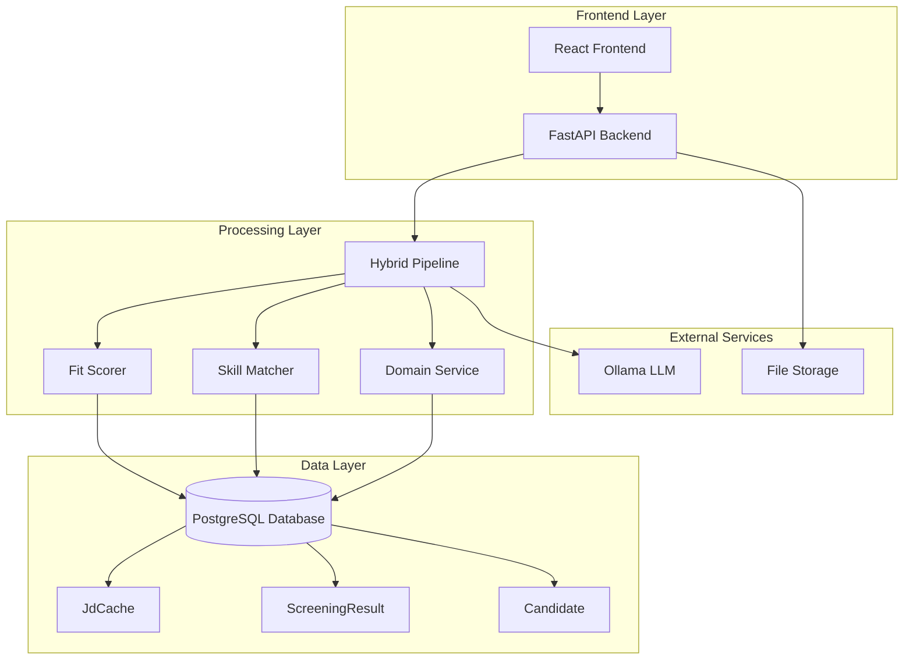
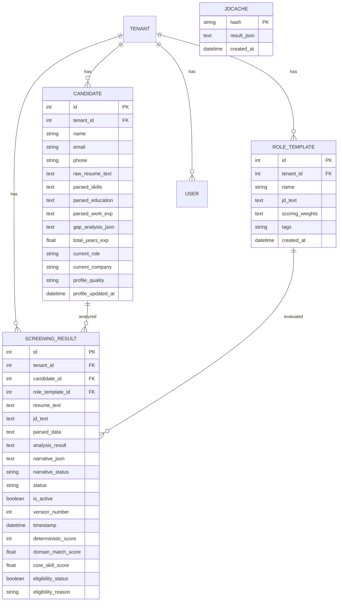
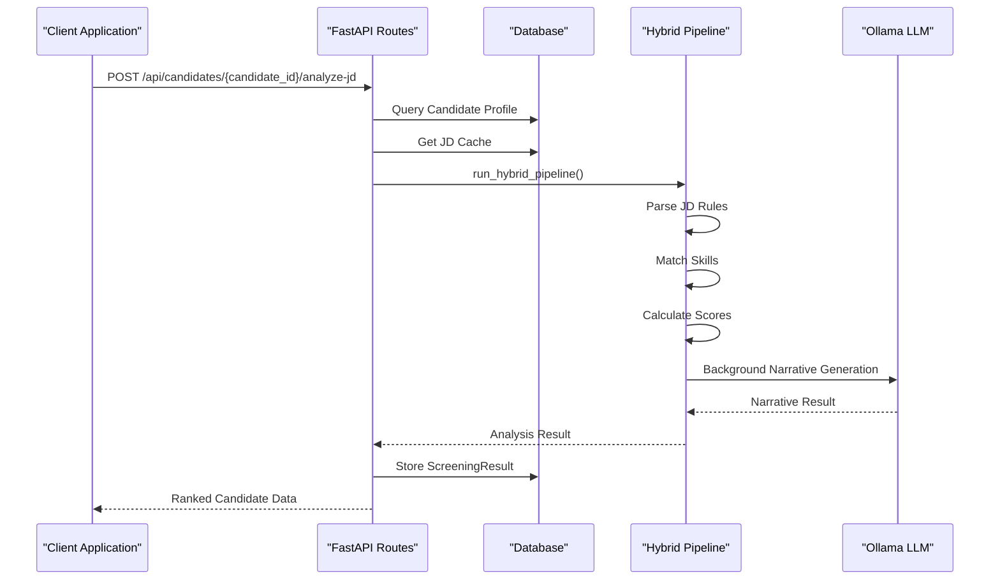
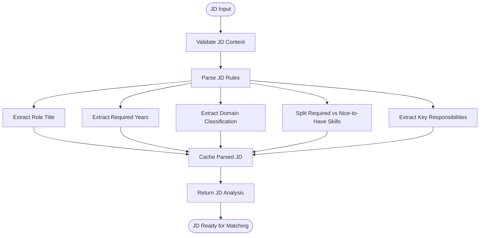
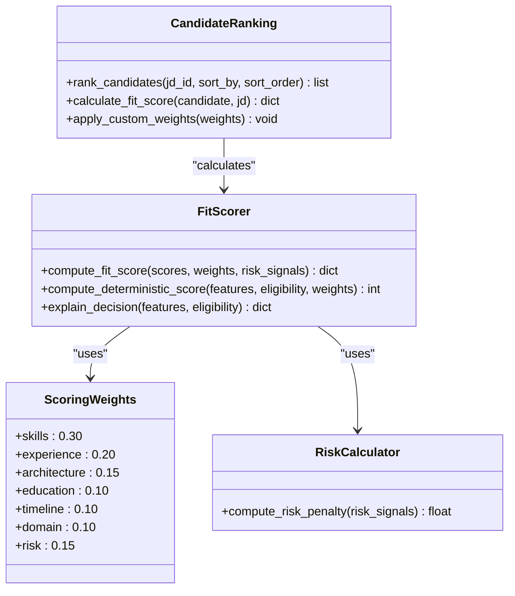
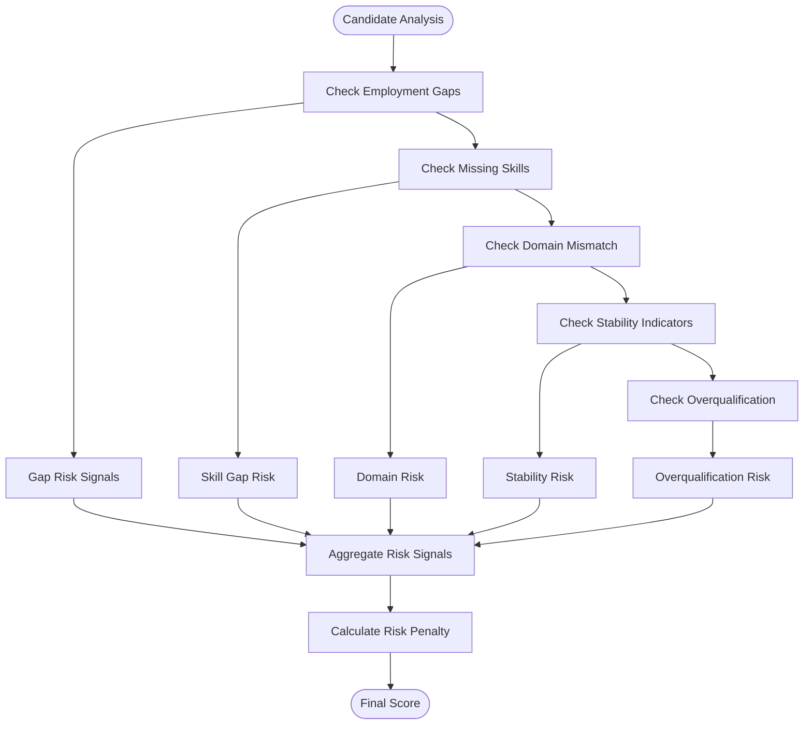
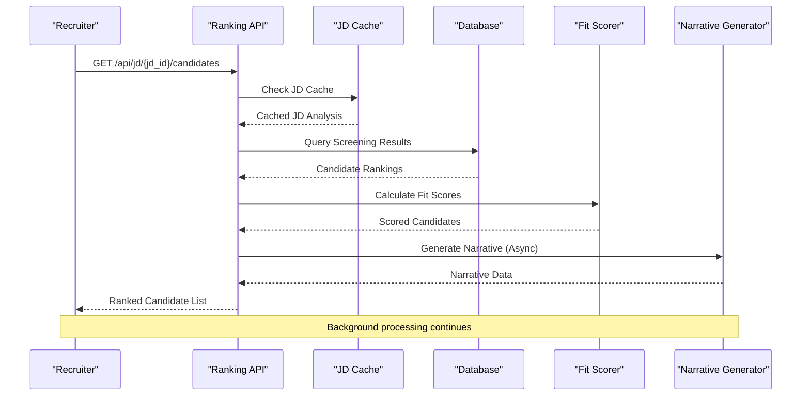
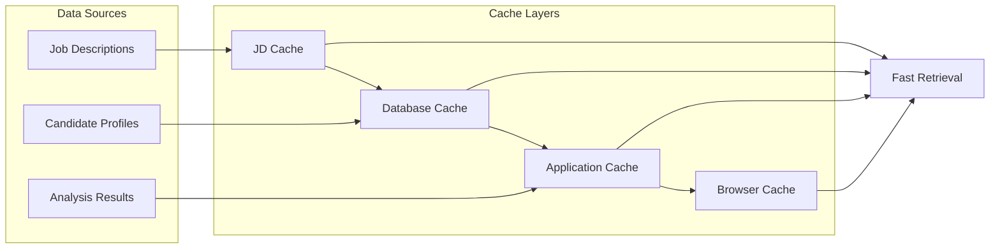

# JD Candidate Ranking

<cite>
**Referenced Files in This Document**
- [main.py](file://app/backend/main.py)
- [candidates.py](file://app/backend/routes/candidates.py)
- [jd_url.py](file://app/backend/routes/jd_url.py)
- [hybrid_pipeline.py](file://app/backend/services/hybrid_pipeline.py)
- [fit_scorer.py](file://app/backend/services/fit_scorer.py)
- [constants.py](file://app/backend/services/constants.py)
- [db_models.py](file://app/backend/models/db_models.py)
- [analyze.py](file://app/backend/routes/analyze.py)
</cite>

## Table of Contents
1. [Introduction](#introduction)
2. [System Architecture](#system-architecture)
3. [Core Components](#core-components)
4. [JD Candidate Ranking Implementation](#jd-candidate-ranking-implementation)
5. [Scoring and Ranking Algorithm](#scoring-and-ranking-algorithm)
6. [Data Flow and Processing](#data-flow-and-processing)
7. [Performance Considerations](#performance-considerations)
8. [Integration Points](#integration-points)
9. [Troubleshooting Guide](#troubleshooting-guide)
10. [Conclusion](#conclusion)

## Introduction

The JD Candidate Ranking system in Resume AI by ThetaLogics provides intelligent matching between job descriptions and candidate profiles. This system enables recruiters to efficiently screen candidates by automatically calculating fit scores and generating ranked lists based on multiple criteria including skills, experience, education, and domain expertise.

The system combines deterministic Python-based scoring with AI-powered narrative analysis to provide comprehensive candidate evaluation. It supports real-time ranking of candidates against specific job descriptions with customizable weighting schemes and background processing for enhanced user experience.

## System Architecture

The JD Candidate Ranking system follows a modular architecture with clear separation of concerns:



**Diagram sources**
- [main.py:325-393](file://app/backend/main.py#L325-L393)
- [hybrid_pipeline.py:1-50](file://app/backend/services/hybrid_pipeline.py#L1-L50)

The architecture consists of several key layers:

- **Frontend Interface**: React-based user interface for candidate management and ranking
- **API Layer**: FastAPI endpoints for job description processing and candidate ranking
- **Processing Engine**: Hybrid pipeline combining deterministic scoring with AI analysis
- **Data Management**: PostgreSQL database with caching mechanisms for performance
- **External Integrations**: Ollama for AI-powered narrative generation

## Core Components

### Database Schema

The system uses a comprehensive database schema designed for multi-tenant operations and efficient candidate management:



**Diagram sources**
- [db_models.py:102-171](file://app/backend/models/db_models.py#L102-L171)
- [db_models.py:295-302](file://app/backend/models/db_models.py#L295-L302)

### Candidate Management Routes

The system provides comprehensive candidate management capabilities through dedicated API routes:



**Diagram sources**
- [candidates.py:362-512](file://app/backend/routes/candidates.py#L362-L512)
- [analyze.py:569-800](file://app/backend/routes/analyze.py#L569-L800)

**Section sources**
- [candidates.py:28-512](file://app/backend/routes/candidates.py#L28-L512)
- [db_models.py:102-171](file://app/backend/models/db_models.py#L102-L171)

## JD Candidate Ranking Implementation

### Job Description Processing

The system processes job descriptions through a sophisticated parsing mechanism that extracts key requirements and characteristics:



**Diagram sources**
- [hybrid_pipeline.py:234-326](file://app/backend/services/hybrid_pipeline.py#L234-L326)
- [analyze.py:150-169](file://app/backend/routes/analyze.py#L150-L169)

### Candidate Profile Building

The system constructs comprehensive candidate profiles from parsed resume data:

| Profile Component | Data Source | Purpose |
|------------------|-------------|---------|
| Contact Information | Parser output | Basic identification |
| Structured Skills | Parser output | High-confidence matches |
| Text-Scanned Skills | Raw text analysis | Low-confidence matches |
| Education | Parser output | Academic qualifications |
| Work Experience | Parser output | Professional background |
| Gap Analysis | Timeline analysis | Employment patterns |

**Section sources**
- [hybrid_pipeline.py:360-425](file://app/backend/services/hybrid_pipeline.py#L360-L425)
- [candidates.py:398-437](file://app/backend/routes/candidates.py#L398-L437)

### Ranking Algorithm

The candidate ranking system employs a multi-dimensional scoring approach:



**Diagram sources**
- [fit_scorer.py:12-114](file://app/backend/services/fit_scorer.py#L12-L114)
- [constants.py:32-42](file://app/backend/services/constants.py#L32-L42)

**Section sources**
- [fit_scorer.py:12-231](file://app/backend/services/fit_scorer.py#L12-L231)
- [constants.py:32-42](file://app/backend/services/constants.py#L32-L42)

## Scoring and Ranking Algorithm

### Deterministic Scoring Components

The system calculates fit scores using multiple scoring components:

| Component | Weight | Calculation Method | Purpose |
|-----------|--------|-------------------|---------|
| Skill Match | 0.30 | Percentage of matched required skills | Technical competency alignment |
| Experience | 0.20 | Years vs required years ratio | Professional background fit |
| Architecture | 0.15 | System design and leadership indicators | Seniority and capability |
| Education | 0.10 | Highest degree and field relevance | Academic qualifications |
| Timeline | 0.10 | Gap analysis and stability metrics | Career progression |
| Domain | 0.10 | Domain keyword matching | Industry expertise |
| Risk Penalty | 0.15 | Computed from risk signals | Quality and reliability |

### Risk Signal Detection

The system identifies potential red flags that impact candidate rankings:



**Diagram sources**
- [fit_scorer.py:40-74](file://app/backend/services/fit_scorer.py#L40-L74)

### Recommendation Thresholds

The system uses standardized thresholds for candidate recommendations:

| Recommendation | Minimum Score | Risk Level | Description |
|----------------|---------------|------------|-------------|
| Shortlist | 72+ | Low | Strong fit, ready for interview |
| Consider | 45-71 | Medium | Moderate fit, requires review |
| Reject | 0-44 | High | Significant gaps or risks |

**Section sources**
- [fit_scorer.py:88-97](file://app/backend/services/fit_scorer.py#L88-L97)
- [constants.py:9-14](file://app/backend/services/constants.py#L9-L14)

## Data Flow and Processing

### End-to-End Candidate Ranking Process



**Diagram sources**
- [candidates.py:575-668](file://app/backend/routes/candidates.py#L575-L668)
- [hybrid_pipeline.py:685-800](file://app/backend/services/hybrid_pipeline.py#L685-L800)

### Real-Time Ranking Features

The system provides dynamic ranking capabilities:

| Feature | Implementation | Benefits |
|---------|----------------|----------|
| Live Sorting | Client-side sorting by fit_score, name, date | Flexible candidate evaluation |
| Status Filtering | Filter by pending, shortlisted, rejected | Workflow integration |
| Bulk Operations | Bulk status updates for multiple candidates | Efficient team coordination |
| Custom Weights | Dynamic weight adjustment per JD | Role-specific optimization |

**Section sources**
- [candidates.py:575-721](file://app/backend/routes/candidates.py#L575-L721)

## Performance Considerations

### Caching Strategy

The system implements multiple caching layers to optimize performance:



**Diagram sources**
- [analyze.py:150-169](file://app/backend/routes/analyze.py#L150-L169)

### Background Processing

The system uses asynchronous processing for heavy computations:

- **Narrative Generation**: LLM processing runs in background threads
- **Batch Operations**: Multiple candidates processed concurrently
- **Cache Updates**: Automatic cache invalidation and refresh
- **Cleanup Tasks**: Regular maintenance of expired records

### Scalability Features

| Feature | Implementation | Benefit |
|---------|----------------|---------|
| Connection Pooling | SQLAlchemy session management | Efficient database utilization |
| Async Processing | asyncio for I/O-bound tasks | Improved throughput |
| Semaphore Control | Concurrency limits | Resource protection |
| Memory Management | Proper cleanup and contextvars | Stable operation |

**Section sources**
- [main.py:246-323](file://app/backend/main.py#L246-L323)
- [analyze.py:133-135](file://app/backend/routes/analyze.py#L133-L135)

## Integration Points

### External Service Integrations

The system integrates with several external services:

```mermaid
graph TB
subgraph "External Services"
Ollama[Ollama LLM Service]
Stripe[Billing Provider]
Cloud[Cloud Storage]
Analytics[Analytics Platform]
end
subgraph "Internal Systems"
API[FastAPI Backend]
DB[(PostgreSQL Database)]
Cache[(Redis/Memory Cache)]
end
Ollama <- --> API
Stripe <- --> API
Cloud <- --> API
Analytics <- --> API
API --> DB
API --> Cache
```

**Diagram sources**
- [main.py:164-202](file://app/backend/main.py#L164-L202)

### API Endpoints for Ranking

The system exposes comprehensive APIs for candidate ranking:

| Endpoint | Method | Description | Response |
|----------|--------|-------------|----------|
| `/api/jd/{jd_id}/candidates` | GET | Retrieve ranked candidates | Array of candidates with scores |
| `/api/jd/{jd_id}/shortlist` | POST | Bulk status updates | Count of updated records |
| `/api/candidates/{candidate_id}/analyze-jd` | POST | Re-analyze against new JD | Updated ranking data |
| `/api/jd/extract-url` | POST | Extract JD from URL | JD text content |

**Section sources**
- [candidates.py:575-721](file://app/backend/routes/candidates.py#L575-L721)
- [jd_url.py:16-30](file://app/backend/routes/jd_url.py#L16-L30)

## Troubleshooting Guide

### Common Issues and Solutions

| Issue | Symptoms | Solution |
|-------|----------|----------|
| Slow Ranking Performance | Long response times | Check cache configuration, optimize queries |
| Inaccurate Fit Scores | Misleading rankings | Review scoring weights, validate skill matching |
| LLM Generation Failures | Missing narrative data | Verify Ollama service availability, check timeouts |
| Duplicate Candidates | Multiple entries for same candidate | Review deduplication logic, check hash calculations |
| Memory Leaks | Increasing memory usage | Monitor background tasks, check proper cleanup |

### Monitoring and Logging

The system provides comprehensive logging for troubleshooting:

- **Structured JSON Logging**: Consistent log format for all operations
- **Request Correlation**: Unique IDs for tracking requests across services
- **Performance Metrics**: Timing information for critical operations
- **Error Tracking**: Detailed exception information with context

**Section sources**
- [main.py:18-44](file://app/backend/main.py#L18-L44)
- [main.py:46-56](file://app/backend/main.py#L46-L56)

## Conclusion

The JD Candidate Ranking system in Resume AI by ThetaLogics provides a comprehensive solution for intelligent candidate screening. By combining deterministic scoring algorithms with AI-powered analysis, the system delivers accurate and actionable candidate rankings that help recruiters make informed hiring decisions.

Key strengths of the system include:

- **Multi-dimensional Scoring**: Comprehensive evaluation across skills, experience, and domain expertise
- **Flexible Weighting**: Customizable scoring weights per job description
- **Real-time Processing**: Fast ranking with background LLM generation
- **Scalable Architecture**: Optimized for performance and reliability
- **Rich Analytics**: Detailed insights into candidate fit and recommendations

The system's modular design and extensive caching strategy ensure optimal performance while maintaining flexibility for future enhancements and integrations.