# Onboarding and User Experience

<cite>
**Referenced Files in This Document**
- [onboarding.py](file://app/backend/routes/onboarding.py)
- [OnboardingWizard.jsx](file://app/frontend/src/components/OnboardingWizard.jsx)
- [OnboardingContext.jsx](file://app/frontend/src/contexts/OnboardingContext.jsx)
- [GettingStarted.jsx](file://app/frontend/src/components/GettingStarted.jsx)
- [App.jsx](file://app/frontend/src/App.jsx)
- [api.js](file://app/frontend/src/lib/api.js)
- [RegisterPage.jsx](file://app/frontend/src/pages/RegisterPage.jsx)
- [LoginPage.jsx](file://app/frontend/src/pages/LoginPage.jsx)
- [feature_flag_service.py](file://app/backend/services/feature_flag_service.py)
- [db_models.py](file://app/backend/models/db_models.py)
- [031_onboarding_flag.py](file://alembic/versions/031_onboarding_flag.py)
- [test_onboarding.py](file://app/backend/tests/test_onboarding.py)
</cite>

## Table of Contents
1. [Introduction](#introduction)
2. [Onboarding Architecture Overview](#onboarding-architecture-overview)
3. [Backend Onboarding Implementation](#backend-onboarding-implementation)
4. [Frontend Onboarding Experience](#frontend-onboarding-experience)
5. [Getting Started Checklist](#getting-started-checklist)
6. [User Registration and Login Flow](#user-registration-and-login-flow)
7. [Feature Flags and Personalization](#feature-flags-and-personalization)
8. [Data Persistence and State Management](#data-persistence-and-state-management)
9. [Integration Points](#integration-points)
10. [Performance Considerations](#performance-considerations)
11. [Troubleshooting Guide](#troubleshooting-guide)
12. [Conclusion](#conclusion)

## Introduction

The Onboarding and User Experience system in ARIA (AI Resume Intelligence) is designed to provide a seamless, guided setup process for new users while maintaining a smooth transition into the core recruitment workflow. This system encompasses both the backend onboarding endpoints and the frontend wizard experience, creating a cohesive journey from registration to productive use of the platform.

The onboarding system focuses on three key areas: user registration and authentication, organizational setup, and feature discovery through interactive tutorials. It ensures that new users can quickly understand the platform's capabilities and begin using core features effectively.

## Onboarding Architecture Overview

The onboarding system follows a multi-layered architecture that separates concerns between authentication, data persistence, and user interface presentation.

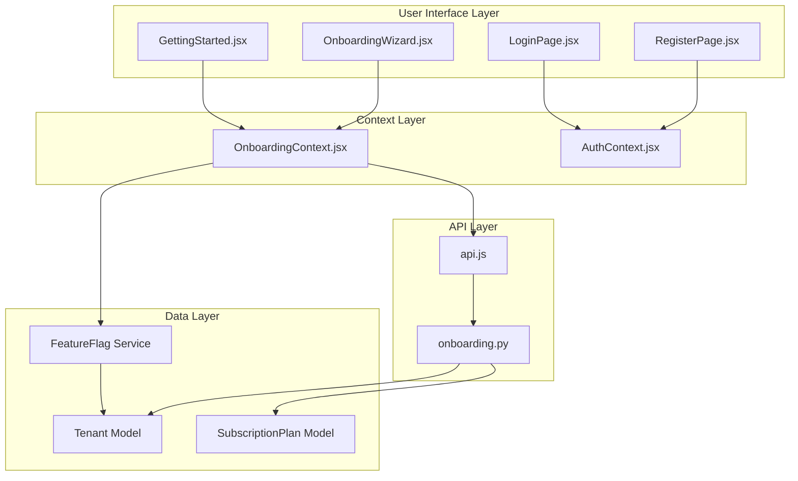

**Diagram sources**
- [OnboardingWizard.jsx:511-589](file://app/frontend/src/components/OnboardingWizard.jsx#L511-L589)
- [OnboardingContext.jsx:35-163](file://app/frontend/src/contexts/OnboardingContext.jsx#L35-L163)
- [api.js:1221-1244](file://app/frontend/src/lib/api.js#L1221-L1244)
- [onboarding.py:11-151](file://app/backend/routes/onboarding.py#L11-L151)

The architecture ensures clean separation of concerns with the frontend handling user interactions and state management, while the backend manages data persistence and business logic validation.

## Backend Onboarding Implementation

The backend onboarding implementation consists of four primary endpoints that manage the user's progression through the setup process.

### Status Endpoint

The status endpoint provides comprehensive information about the current onboarding state, including completion status and step completion indicators.

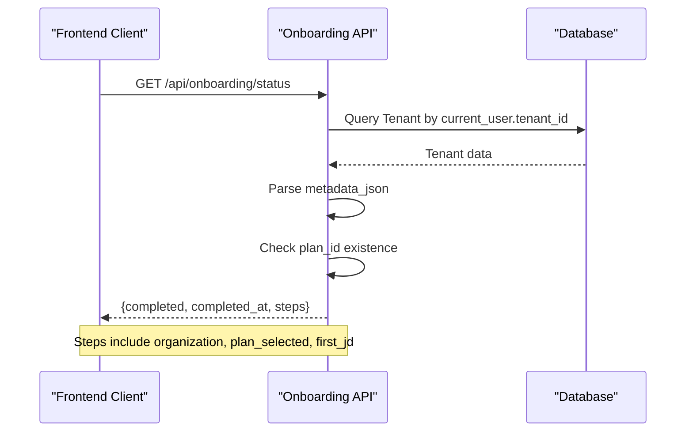

**Diagram sources**
- [onboarding.py:27-53](file://app/backend/routes/onboarding.py#L27-L53)

### Organization Setup Endpoint

The organization setup endpoint handles company information collection and metadata updates.

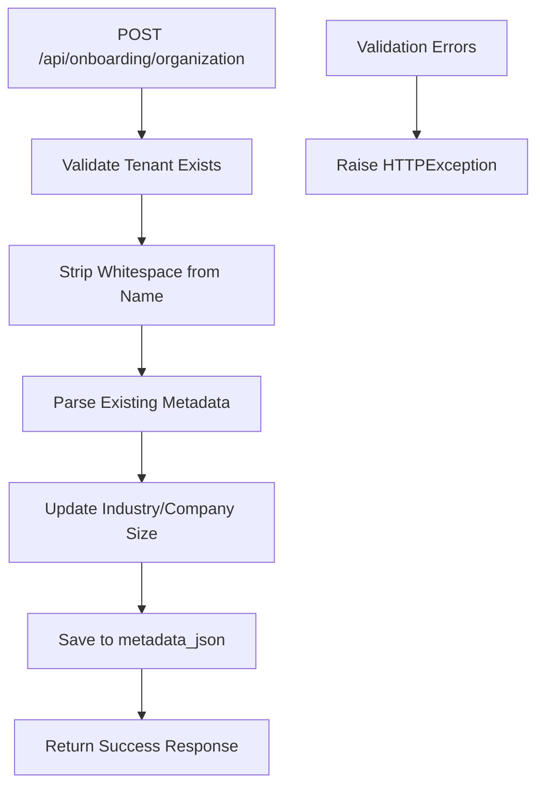

**Diagram sources**
- [onboarding.py:56-92](file://app/backend/routes/onboarding.py#L56-L92)

### Plan Selection Endpoint

The plan selection endpoint manages subscription plan assignment during onboarding.

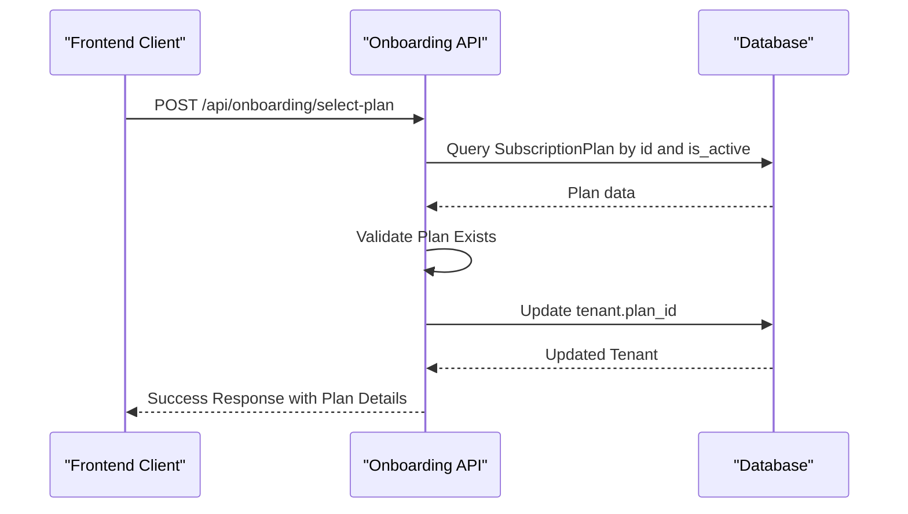

**Diagram sources**
- [onboarding.py:95-128](file://app/backend/routes/onboarding.py#L95-L128)

### Completion Endpoint

The completion endpoint marks the onboarding process as finished and triggers the transition to the main application.

**Section sources**
- [onboarding.py:131-151](file://app/backend/routes/onboarding.py#L131-L151)

## Frontend Onboarding Experience

The frontend onboarding experience is built around a comprehensive wizard component that guides users through four distinct steps.

### Wizard Structure and Navigation

The OnboardingWizard component implements a sophisticated multi-step navigation system with progress tracking and state management.

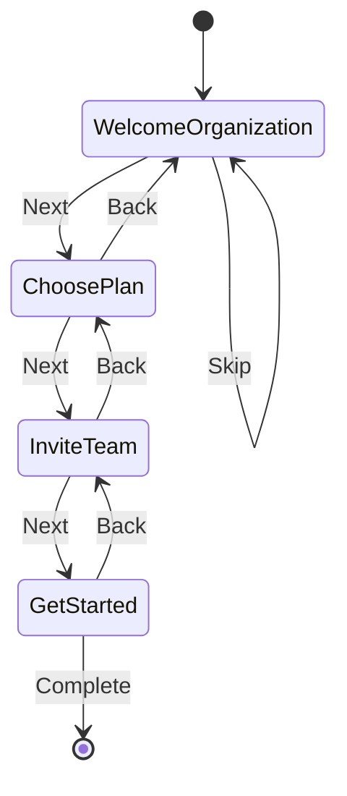

**Diagram sources**
- [OnboardingWizard.jsx:511-589](file://app/frontend/src/components/OnboardingWizard.jsx#L511-L589)

### Step Components

Each step in the wizard is implemented as a specialized component with its own validation logic and user feedback mechanisms.

#### Step 1: Welcome and Organization
- Collects company name, industry, and company size
- Implements real-time validation and error handling
- Provides loading states during API calls

#### Step 2: Plan Selection
- Dynamically loads available subscription plans
- Auto-selects free plan as default
- Handles plan selection with visual feedback

#### Step 3: Team Invitation
- Collects team member email addresses
- Stores data in localStorage for later processing
- Provides flexible email field management

#### Step 4: Get Started
- Offers immediate access to platform features
- Provides option to explore sample data
- Handles onboarding completion

**Section sources**
- [OnboardingWizard.jsx:54-507](file://app/frontend/src/components/OnboardingWizard.jsx#L54-L507)

## Getting Started Checklist

Beyond the initial wizard, the system includes a persistent getting started checklist that helps users discover key platform features over time.

### Checklist Architecture

The GettingStarted component provides a structured approach to feature discovery with completion tracking and visual feedback.

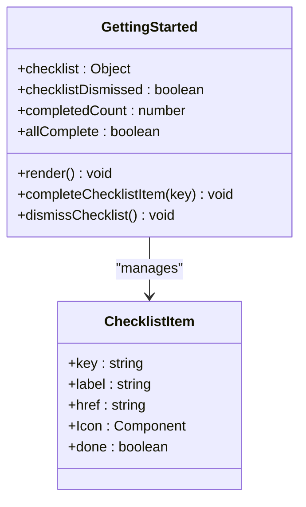

**Diagram sources**
- [GettingStarted.jsx:19-129](file://app/frontend/src/components/GettingStarted.jsx#L19-L129)

### Checklist Items

The checklist includes five essential actions for new users:

1. **Create your first job** - Navigate to JD Library
2. **Analyze a resume** - Go to Analyze page
3. **Shortlist a candidate** - Visit Candidates page
4. **Invite a team member** - Access Team settings
5. **Share with hiring manager** - Return to JD Library

**Section sources**
- [GettingStarted.jsx:9-15](file://app/frontend/src/components/GettingStarted.jsx#L9-L15)

## User Registration and Login Flow

The authentication system provides streamlined registration and login experiences tailored for the onboarding process.

### Registration Flow

The registration process captures essential information while maintaining security standards.

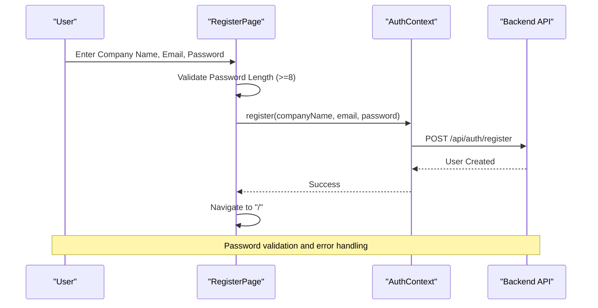

**Diagram sources**
- [RegisterPage.jsx:16-32](file://app/frontend/src/pages/RegisterPage.jsx#L16-L32)

### Login Flow with SSO Integration

The login system supports both traditional authentication and Single Sign-On (SSO) for enterprise environments.

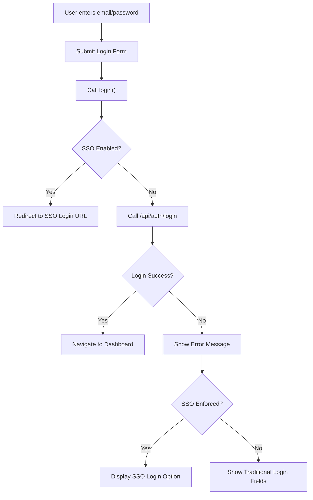

**Diagram sources**
- [LoginPage.jsx:39-61](file://app/frontend/src/pages/LoginPage.jsx#L39-L61)

**Section sources**
- [RegisterPage.jsx:1-143](file://app/frontend/src/pages/RegisterPage.jsx#L1-L143)
- [LoginPage.jsx:1-211](file://app/frontend/src/pages/LoginPage.jsx#L1-L211)

## Feature Flags and Personalization

The system incorporates a sophisticated feature flag mechanism that allows for dynamic feature availability and personalization based on tenant subscriptions and configurations.

### Feature Flag Resolution Logic

The feature flag service implements a hierarchical resolution system:

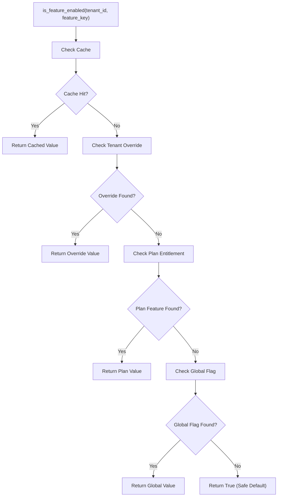

**Diagram sources**
- [feature_flag_service.py:46-94](file://app/backend/services/feature_flag_service.py#L46-L94)

### Tenant-Specific Overrides

The system supports granular control over feature availability through tenant-specific overrides, allowing administrators to enable or disable features for individual organizations.

**Section sources**
- [feature_flag_service.py:1-135](file://app/backend/services/feature_flag_service.py#L1-L135)

## Data Persistence and State Management

The onboarding system implements robust state management across multiple layers to ensure reliability and user experience continuity.

### Local Storage Strategy

Both the onboarding wizard and getting started checklist utilize localStorage for persistence across browser sessions.

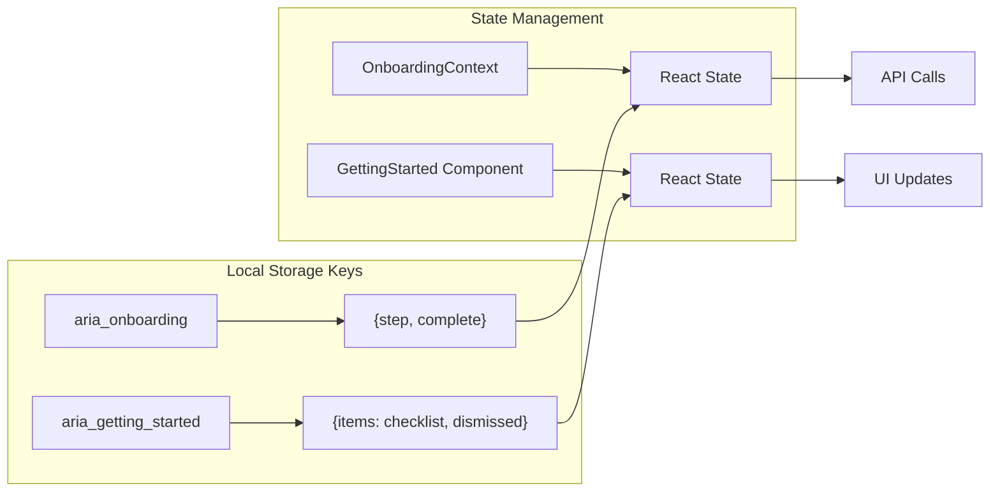

**Diagram sources**
- [OnboardingContext.jsx:7-33](file://app/frontend/src/contexts/OnboardingContext.jsx#L7-L33)

### Backend Data Model

The onboarding state is persisted in the database through the Tenant model with dedicated fields for completion tracking.

**Section sources**
- [OnboardingContext.jsx:35-163](file://app/frontend/src/contexts/OnboardingContext.jsx#L35-L163)
- [db_models.py:61-63](file://app/backend/models/db_models.py#L61-L63)
- [031_onboarding_flag.py:13-20](file://alembic/versions/031_onboarding_flag.py#L13-L20)

## Integration Points

The onboarding system integrates with several key platform components to provide a seamless user experience.

### API Integration

The frontend communicates with backend endpoints through a centralized API client that handles authentication, error handling, and retry logic.

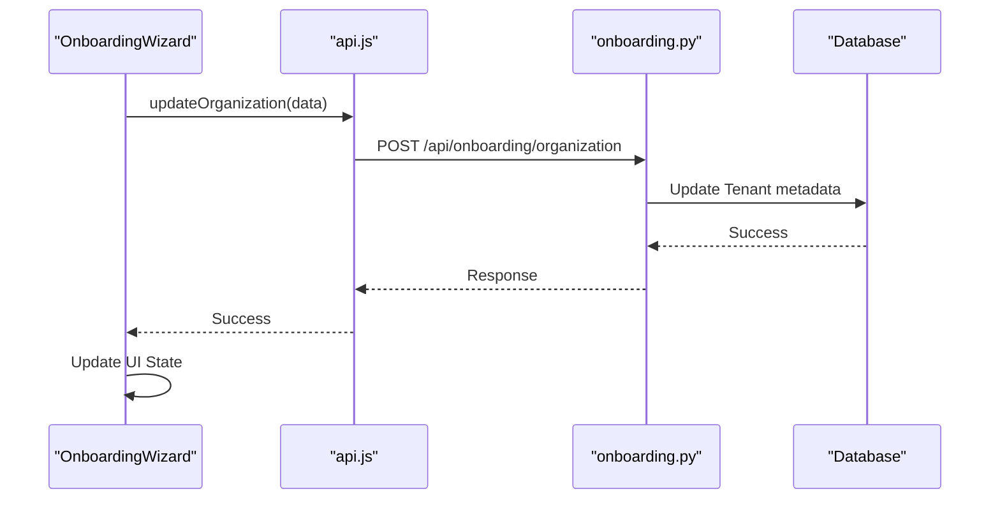

**Diagram sources**
- [api.js:1231-1234](file://app/frontend/src/lib/api.js#L1231-L1234)
- [onboarding.py:56-92](file://app/backend/routes/onboarding.py#L56-L92)

### Route Protection

The application implements route protection that ensures users complete onboarding before accessing core features.

**Section sources**
- [App.jsx:63-82](file://app/frontend/src/App.jsx#L63-L82)
- [api.js:1226-1229](file://app/frontend/src/lib/api.js#L1226-L1229)

## Performance Considerations

The onboarding system is designed with several performance optimizations to ensure smooth user experience.

### Caching Strategy

The feature flag service implements an in-memory cache with TTL (Time-To-Live) to reduce database queries and improve response times.

### Progressive Loading

The wizard implements progressive loading patterns with skeleton screens and loading states to maintain responsiveness during data operations.

### State Optimization

Both frontend and backend state management minimize unnecessary re-renders and optimize data fetching through intelligent caching and debouncing.

## Troubleshooting Guide

Common issues and their resolutions during the onboarding process:

### Authentication Issues
- **Problem**: Users cannot log in after registration
- **Solution**: Clear browser cookies and cache, verify email verification status

### Onboarding Stuck States
- **Problem**: Wizard appears stuck on a particular step
- **Solution**: Check network connectivity, clear localStorage data, refresh browser

### Feature Availability Problems
- **Problem**: Expected features not visible
- **Solution**: Verify subscription plan level, check feature flag overrides, contact support

### Data Persistence Issues
- **Problem**: Onboarding progress not saved
- **Solution**: Enable localStorage in browser settings, check for browser extensions blocking storage

**Section sources**
- [test_onboarding.py:32-94](file://app/backend/tests/test_onboarding.py#L32-L94)

## Conclusion

The ARIA onboarding and user experience system represents a comprehensive approach to guiding new users through the platform setup process while maintaining flexibility and scalability. The system successfully balances user-friendly onboarding with robust backend validation and state management.

Key strengths of the implementation include:

- **Seamless User Experience**: Four-step wizard with intuitive navigation and clear progress indication
- **Robust State Management**: Dual-layer persistence (localStorage + database) ensuring continuity
- **Flexible Architecture**: Modular design allowing easy extension and modification
- **Enterprise Ready**: SSO integration, feature flags, and subscription-based personalization
- **Performance Optimized**: Caching strategies and progressive loading for responsive experience

The system provides a solid foundation for user engagement while maintaining the technical excellence required for a production-grade SaaS platform. Future enhancements could include additional onboarding customization options, expanded feature discovery mechanisms, and enhanced analytics for onboarding effectiveness tracking.