# Page Structure

<cite>
**Referenced Files in This Document**
- [App.jsx](file://app/frontend/src/App.jsx)
- [ProtectedRoute.jsx](file://app/frontend/src/components/ProtectedRoute.jsx)
- [AppShell.jsx](file://app/frontend/src/components/AppShell.jsx)
- [Dashboard.jsx](file://app/frontend/src/pages/Dashboard.jsx)
- [CandidatesPage.jsx](file://app/frontend/src/pages/CandidatesPage.jsx)
- [ReportPage.jsx](file://app/frontend/src/pages/ReportPage.jsx)
- [ComparePage.jsx](file://app/frontend/src/pages/ComparePage.jsx)
- [BatchPage.jsx](file://app/frontend/src/pages/BatchPage.jsx)
- [TemplatesPage.jsx](file://app/frontend/src/pages/TemplatesPage.jsx)
- [TeamPage.jsx](file://app/frontend/src/pages/TeamPage.jsx)
- [TranscriptPage.jsx](file://app/frontend/src/pages/TranscriptPage.jsx)
- [VideoPage.jsx](file://app/frontend/src/pages/VideoPage.jsx)
- [SettingsPage.jsx](file://app/frontend/src/pages/SettingsPage.jsx)
- [LoginPage.jsx](file://app/frontend/src/pages/LoginPage.jsx)
- [RegisterPage.jsx](file://app/frontend/src/pages/RegisterPage.jsx)
- [AnalyzePage.jsx](file://app/frontend/src/pages/AnalyzePage.jsx)
</cite>

## Update Summary
**Changes Made**
- Enhanced AnalyzePage documentation to include IndexedDB-based file-mode JD caching functionality
- Added comprehensive IndexedDB helper functions documentation (openJdDB, storeJdFile, getJdFile, clearJdFile)
- Updated AnalyzePage section to cover automatic loading of cached JD files when users return to analyze page with file mode enabled
- Enhanced session storage integration documentation to include IndexedDB fallback mechanisms
- Updated troubleshooting guide to include IndexedDB error handling

## Table of Contents
1. [Introduction](#introduction)
2. [Project Structure](#project-structure)
3. [Core Components](#core-components)
4. [Architecture Overview](#architecture-overview)
5. [Detailed Component Analysis](#detailed-component-analysis)
6. [Dependency Analysis](#dependency-analysis)
7. [Performance Considerations](#performance-considerations)
8. [Troubleshooting Guide](#troubleshooting-guide)
9. [Conclusion](#conclusion)
10. [Appendices](#appendices)

## Introduction
This document describes the page structure and behavior of Resume AI's React frontend. It explains the purpose, layout, data flows, state management integration, navigation, route protection, loading/error handling, and responsive design for each page. It also provides guidelines for adding new pages and extending existing ones.

## Project Structure
The frontend is organized around a routing shell with protected routes and a shared layout. Pages are grouped under src/pages and are lazily loaded via React Suspense. Authentication and subscription state are provided globally.

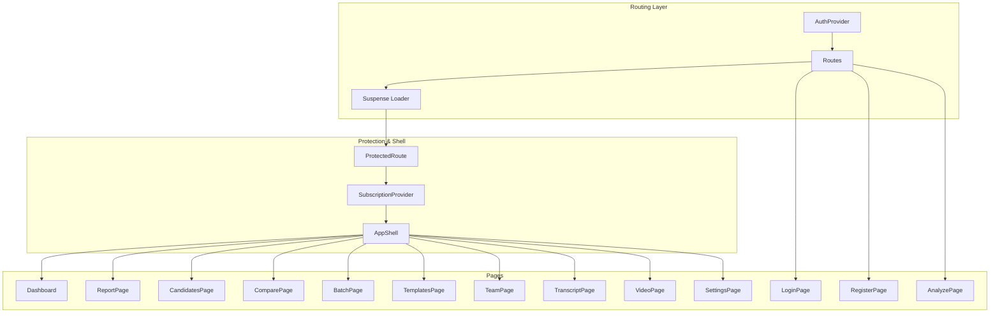

**Diagram sources**
- [App.jsx:39-61](file://app/frontend/src/App.jsx#L39-L61)
- [ProtectedRoute.jsx:4-23](file://app/frontend/src/components/ProtectedRoute.jsx#L4-L23)
- [AppShell.jsx:3-12](file://app/frontend/src/components/AppShell.jsx#L3-L12)

**Section sources**
- [App.jsx:1-64](file://app/frontend/src/App.jsx#L1-L64)

## Core Components
- Routing and Protection
  - Routes define page endpoints and lazy-load each page.
  - ProtectedRoute enforces authentication and guards against unauthenticated access.
  - AppShell provides a shared header and container for page content.
- Global Providers
  - AuthProvider supplies authentication state.
  - SubscriptionProvider exposes usage and plan data to pages.
- Page Composition
  - Each page is a self-contained component with its own state, effects, and UI.
  - Pages integrate with shared components (e.g., forms, cards) and APIs.

**Section sources**
- [App.jsx:39-61](file://app/frontend/src/App.jsx#L39-L61)
- [ProtectedRoute.jsx:4-23](file://app/frontend/src/components/ProtectedRoute.jsx#L4-L23)
- [AppShell.jsx:3-12](file://app/frontend/src/components/AppShell.jsx#L3-L12)

## Architecture Overview
The application uses a layered architecture:
- Presentation layer: Pages and shared components.
- State layer: Auth and subscription providers.
- Navigation layer: React Router with protected routes.
- Data layer: API client functions imported per page.

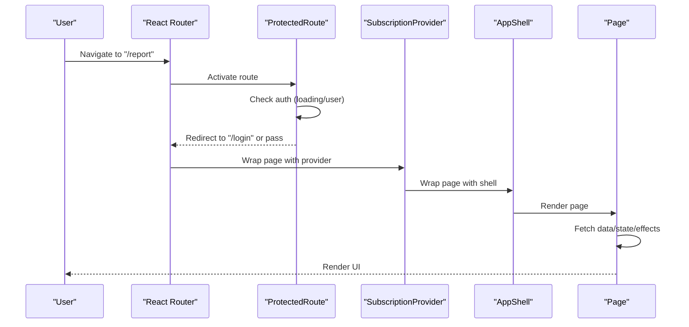

**Diagram sources**
- [App.jsx:39-61](file://app/frontend/src/App.jsx#L39-L61)
- [ProtectedRoute.jsx:4-23](file://app/frontend/src/components/ProtectedRoute.jsx#L4-L23)
- [AppShell.jsx:3-12](file://app/frontend/src/components/AppShell.jsx#L3-L12)

## Detailed Component Analysis

### Dashboard
- Purpose: Primary entry for resume and job description analysis with real-time pipeline progress.
- Layout:
  - Left: UploadForm for resume/job description, optional scoring weights.
  - Right: Desktop-only agent progress panel; mobile shows the same panel below the form.
  - Usage banner displays monthly usage and limits.
- Data fetching:
  - Uses analyzeResumeStream with streaming callbacks to update stage completion.
  - Navigates to ReportPage with analysis result on success.
- State management:
  - Tracks selected files, job description, scoring weights, loading/error, and completed stages.
  - Computes active stages based on completion set.
- Navigation:
  - Back to Dashboard after viewing a report.
- Responsive:
  - Progress panel adapts to desktop/mobile breakpoints.
- Loading/Error:
  - Spinner during analysis; error message shown if missing inputs or service issues.
- Animations:
  - Uses card-animate class for entrance animations.

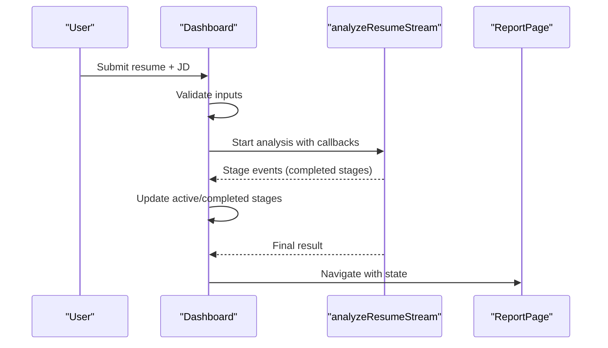

**Diagram sources**
- [Dashboard.jsx:204-275](file://app/frontend/src/pages/Dashboard.jsx#L204-L275)

**Section sources**
- [Dashboard.jsx:1-330](file://app/frontend/src/pages/Dashboard.jsx#L1-L330)

### CandidatesPage
- Purpose: Browse and filter candidates, view historical applications, and open detailed reports.
- Layout:
  - Search form with pagination.
  - Candidates table with best score and recommendation badges.
  - Detail modal for a candidate's application history.
- Data fetching:
  - getCandidates with search, page, and page_size.
  - getCandidate for detail modal.
- State management:
  - Tracks search term, page, loading, and selected candidate.
- Navigation:
  - Click "View" on a row or history item navigates to ReportPage.
- Loading/Error:
  - Spinner while loading; empty state with call-to-action.
- Animations:
  - card-animate for entrance.

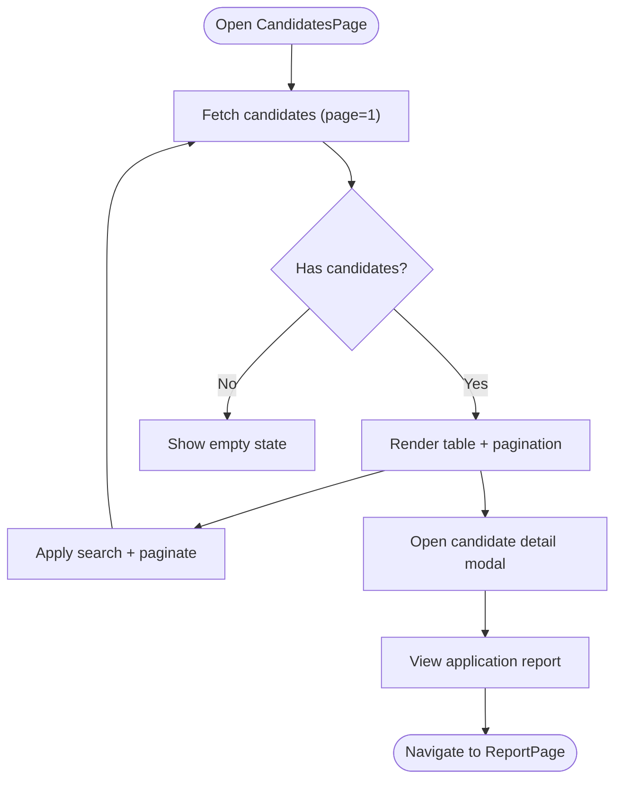

**Diagram sources**
- [CandidatesPage.jsx:77-203](file://app/frontend/src/pages/CandidatesPage.jsx#L77-L203)

**Section sources**
- [CandidatesPage.jsx:1-204](file://app/frontend/src/pages/CandidatesPage.jsx#L1-L204)

### ReportPage
- Purpose: Present a detailed screening report with score visualization, narrative, and actions.
- Layout:
  - Left sidebar: back button, candidate name editor, score gauge, training label controls, **Analyze Another Resume** feature.
  - Right panel: sticky action bar (share/download), scrollable content (ResultCard, Timeline).
- Data fetching:
  - Resolves result from location.state or sessionStorage via report id.
  - updateCandidateName, labelTrainingExample, updateResultStatus for inline edits and labeling.
  - Loads active JD context from sessionStorage for "Analyze Another Resume" feature.
- State management:
  - Tracks copied state, label status/loading/done, resolves candidate name, and JD context.
- Navigation:
  - Back to Dashboard; view individual results from Compare or Candidates.
  - Navigate to AnalyzePage with pre-filled JD context when "Analyze Another Resume" is clicked.
- Loading/Error:
  - Redirects to Dashboard if no result found.
- Print:
  - Dedicated print header and styles.

**Updated** Enhanced with IndexedDB-based file-mode JD caching support for seamless cross-session JD file persistence

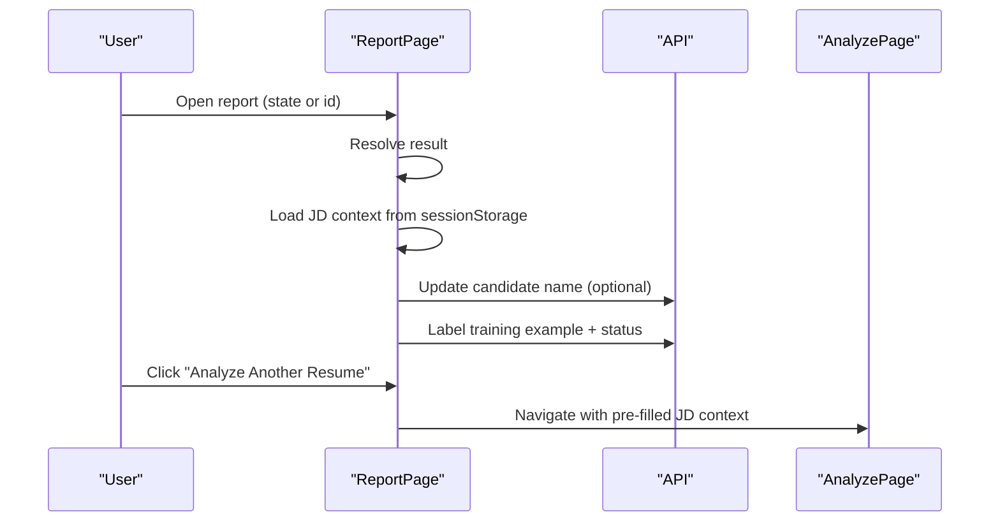

**Diagram sources**
- [ReportPage.jsx:82-151](file://app/frontend/src/pages/ReportPage.jsx#L82-L151)
- [ReportPage.jsx:421-440](file://app/frontend/src/pages/ReportPage.jsx#L421-L440)
- [AnalyzePage.jsx:279-286](file://app/frontend/src/pages/AnalyzePage.jsx#L279-L286)

**Section sources**
- [ReportPage.jsx:1-554](file://app/frontend/src/pages/ReportPage.jsx#L1-L554)

### ComparePage
- Purpose: Compare up to five candidate results side-by-side.
- Layout:
  - Selector: choose results from history; shows selected count and error feedback.
  - Comparison table: fit score, recommendation, skill match, experience, education, stability, risk level.
  - Action buttons: new comparison, export CSV.
- Data fetching:
  - getHistory for selectable results.
  - compareResults for pairwise comparison.
  - exportCsv for selected ids.
- State management:
  - Tracks selected ids, loading, error, and comparison result.
- Navigation:
  - View individual report from actions.
- Loading/Error:
  - Spinner while loading history; error messages on failures.

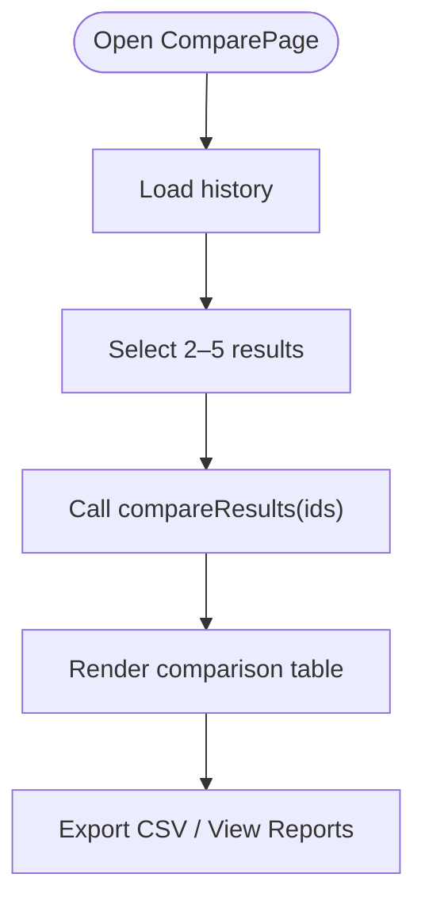

**Diagram sources**
- [ComparePage.jsx:20-54](file://app/frontend/src/pages/ComparePage.jsx#L20-L54)

**Section sources**
- [ComparePage.jsx:1-230](file://app/frontend/src/pages/ComparePage.jsx#L1-L230)

### BatchPage
- Purpose: Bulk analyze resumes against a single job description with ranked shortlist.
- Layout:
  - Drag-and-drop resume uploads (up to plan limit).
  - Job description text area with saved JD picker and save button.
  - Usage banner indicating remaining analyses.
  - Results table with rank, file, score, recommendation, risk, actions.
- Data fetching:
  - analyzeBatch for batch analysis.
  - exportCsv/exportExcel for selected/all ids.
  - getTemplates/createTemplate for JD templates.
  - useUsageCheck/useSubscription for usage gating.
- State management:
  - Tracks files, JD text, loading, results, selected ids, saved JDs.
- Navigation:
  - View individual report; manage templates; upgrade from usage banner.
- Loading/Error:
  - Spinner during analysis; validation errors surfaced.

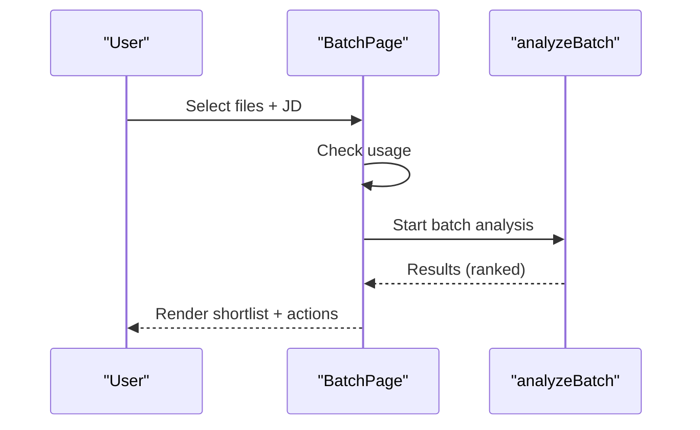

**Diagram sources**
- [BatchPage.jsx:27-121](file://app/frontend/src/pages/BatchPage.jsx#L27-L121)

**Section sources**
- [BatchPage.jsx:1-431](file://app/frontend/src/pages/BatchPage.jsx#L1-L431)

### TemplatesPage
- Purpose: Manage reusable job description templates for quick selection.
- Layout:
  - Grid of template cards with tags and actions.
  - Modal for creating/editing templates.
- Data fetching:
  - getTemplates, createTemplate, updateTemplate, deleteTemplate.
- State management:
  - Tracks templates, modal open/editing state.
- Navigation:
  - Use template to prefill Dashboard.
- Loading/Error:
  - Spinner while loading; empty state with call-to-action.

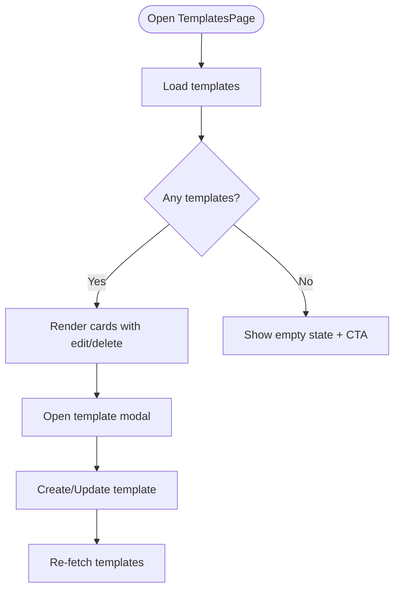

**Diagram sources**
- [TemplatesPage.jsx:82-107](file://app/frontend/src/pages/TemplatesPage.jsx#L82-L107)

**Section sources**
- [TemplatesPage.jsx:1-195](file://app/frontend/src/pages/TemplatesPage.jsx#L1-L195)

### TeamPage
- Purpose: Manage team members and AI training status.
- Layout:
  - Team members list with roles.
  - Invite member modal (admin-only).
  - Training dashboard: labeled count, model status, train button.
- Data fetching:
  - getTeamMembers, inviteTeamMember, getTrainingStatus, startTraining.
- State management:
  - Tracks members, invite modal visibility, training status.
- Navigation:
  - Manage team members from Settings.
- Loading/Error:
  - Spinners and error messaging for invites/training.

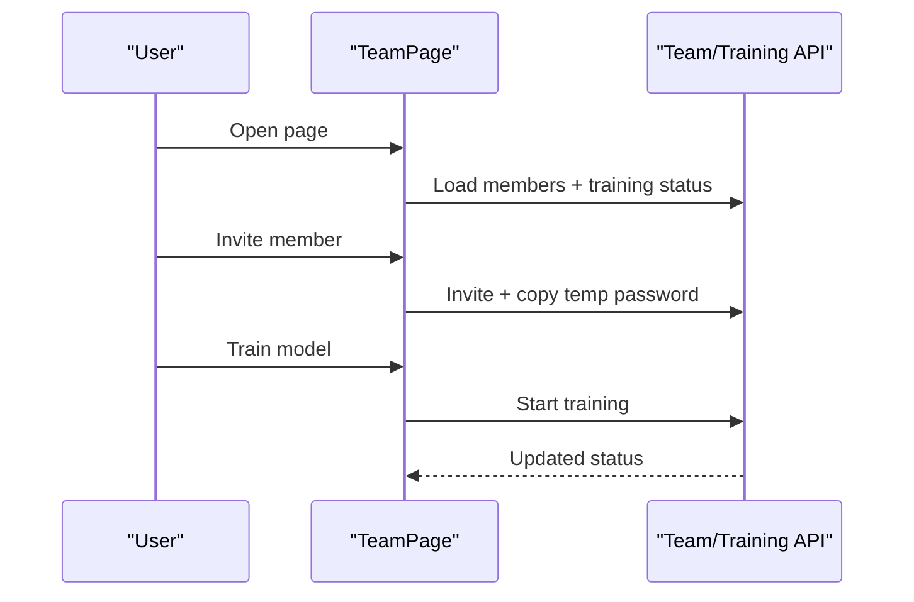

**Diagram sources**
- [TeamPage.jsx:177-256](file://app/frontend/src/pages/TeamPage.jsx#L177-L256)

**Section sources**
- [TeamPage.jsx:1-257](file://app/frontend/src/pages/TeamPage.jsx#L1-L257)

### TranscriptPage
- Purpose: Analyze interview transcripts from supported platforms or uploaded files.
- Layout:
  - Step 1: Select candidate, job description template, platform.
  - Step 2: Upload file or paste text; toggle modes.
  - Step 3: Results panel with scores, alignment, strengths, areas, bias note.
  - History panel toggled separately.
- Data fetching:
  - getCandidates/getTemplates for metadata.
  - analyzeTranscript for analysis.
  - getTranscriptAnalyses for history.
- State management:
  - Tracks step, files/text, platform, loading, result, error, history.
- Navigation:
  - View history items as reports; reset to step 1.
- Loading/Error:
  - Spinner during analysis; validation feedback.

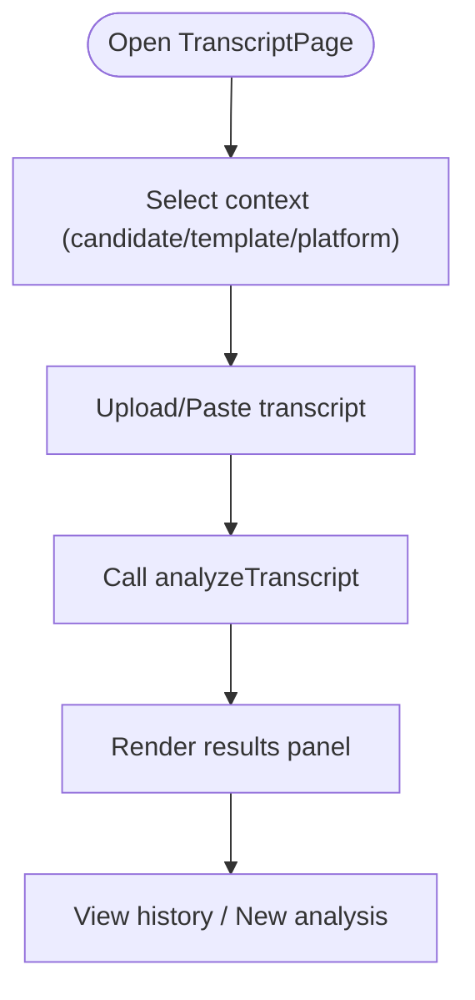

**Diagram sources**
- [TranscriptPage.jsx:59-181](file://app/frontend/src/pages/TranscriptPage.jsx#L59-L181)

**Section sources**
- [TranscriptPage.jsx:1-632](file://app/frontend/src/pages/TranscriptPage.jsx#L1-L632)

### VideoPage
- Purpose: Upload or analyze videos from URLs; provides communication and malpractice insights.
- Layout:
  - Toggle between upload and URL input.
  - File dropzone with progress; URL input with platform detection.
  - Processing steps with progress bar.
  - Results panel: malpractice assessment, communication scores, strengths/phrases/red flags, transcript.
- Data fetching:
  - analyzeVideoFromUrl for URL-based analysis.
  - getCandidates for optional candidate linking.
- State management:
  - Tracks input mode, file/url, progress, active step, result, error.
- Navigation:
  - Reset to start; view results.
- Loading/Error:
  - XHR progress; spinner; error messages.

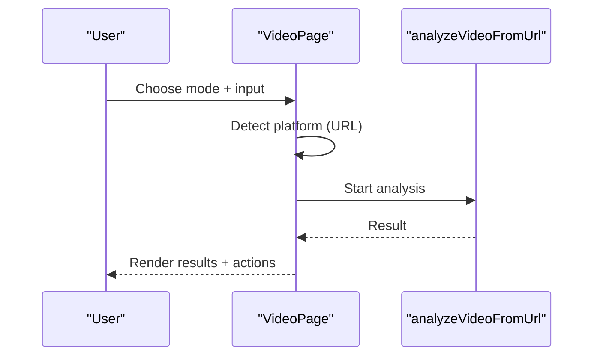

**Diagram sources**
- [VideoPage.jsx:508-611](file://app/frontend/src/pages/VideoPage.jsx#L508-L611)

**Section sources**
- [VideoPage.jsx:1-809](file://app/frontend/src/pages/VideoPage.jsx#L1-L809)

### SettingsPage
- Purpose: Manage account, subscription, notifications, and security.
- Layout:
  - Tabs: Subscription, Team & Access, Notifications, Security.
  - Subscription: current plan, usage stats, features, admin controls.
  - Team & Access: organization info, API key availability.
  - Notifications: email preferences.
  - Security: password change prompt, delete account.
- Data fetching:
  - useSubscription for plan/usage; adminResetUsage/adminChangePlan for admin controls.
- State management:
  - Tracks active tab, profile preferences, saving/loading states.
- Navigation:
  - Manage team from Settings; navigate to TeamPage.
- Loading/Error:
  - Retry subscription fetch; admin loading states.

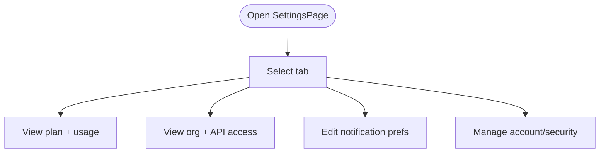

**Diagram sources**
- [SettingsPage.jsx:85-595](file://app/frontend/src/pages/SettingsPage.jsx#L85-L595)

**Section sources**
- [SettingsPage.jsx:1-596](file://app/frontend/src/pages/SettingsPage.jsx#L1-L596)

### AnalyzePage
- Purpose: Complete 3-step analysis workflow with job description, scoring weights, and resume upload.
- Layout:
  - Step 1: Job Description (text, file, or URL extraction).
  - Step 2: Scoring Weights with AI suggestions.
  - Step 3: Resume upload with drag-and-drop.
  - Results area with streaming progress and batch analysis.
- Data fetching:
  - analyzeResumeStream for single analysis.
  - analyzeBatchStream for batch analysis with streaming callbacks.
  - createTemplate for saving job descriptions.
- State management:
  - Tracks current step, JD context, weights, files, streaming results.
- Navigation:
  - Progress through steps; navigate to ReportPage on completion.
  - Store JD context in sessionStorage for "Analyze Another Resume" feature.
- Loading/Error:
  - Spinner during analysis; validation errors surfaced.
- Session Storage:
  - Stores active JD context for cross-page continuity.
- IndexedDB Integration:
  - **Enhanced** with IndexedDB-based file-mode JD caching for persistent storage across browser sessions.
  - **New** IndexedDB helper functions: openJdDB, storeJdFile, getJdFile, clearJdFile.
  - **New** Automatic loading of cached JD files when users return to analyze page with file mode enabled.
  - **New** Seamless fallback between sessionStorage and IndexedDB for JD context persistence.

**Updated** Enhanced with IndexedDB-based file-mode JD caching functionality for persistent storage across browser sessions

**Section sources**
- [AnalyzePage.jsx:1-1004](file://app/frontend/src/pages/AnalyzePage.jsx#L1-L1004)

### LoginPage and RegisterPage
- Purpose: Authentication entry points.
- Layout:
  - Login: email/password with reveal toggle; submit to AuthContext.login.
  - Register: company name, email, password; submit to AuthContext.register.
- Navigation:
  - Successful login/register redirects to Dashboard.

**Section sources**
- [LoginPage.jsx:1-121](file://app/frontend/src/pages/LoginPage.jsx#L1-L121)
- [RegisterPage.jsx:1-143](file://app/frontend/src/pages/RegisterPage.jsx#L1-L143)

## Dependency Analysis
- Routing and Protection
  - App.jsx defines all routes and wraps pages in ProtectedRoute and AppShell.
  - ProtectedRoute depends on AuthContext for user state.
- Shared Layout
  - AppShell provides NavBar and a scrollable content area for all pages.
- Provider Chain
  - Pages consume AuthProvider and SubscriptionProvider via App.jsx.
- Page-to-API Contracts
  - Each page imports and calls specific API functions (e.g., Dashboard uses analyzeResumeStream; BatchPage uses analyzeBatch).
- Cross-Page Navigation
  - Pages navigate among themselves using react-router-dom and state passing (e.g., Dashboard to ReportPage, CandidatesPage to ReportPage).
- Session Storage Integration
  - AnalyzePage stores JD context in sessionStorage for cross-page continuity.
  - ReportPage retrieves JD context from sessionStorage to enable "Analyze Another Resume" feature.
- IndexedDB Integration
  - **New** AnalyzePage uses IndexedDB for persistent JD file caching across browser sessions.
  - **New** Seamless fallback between sessionStorage and IndexedDB for JD context persistence.

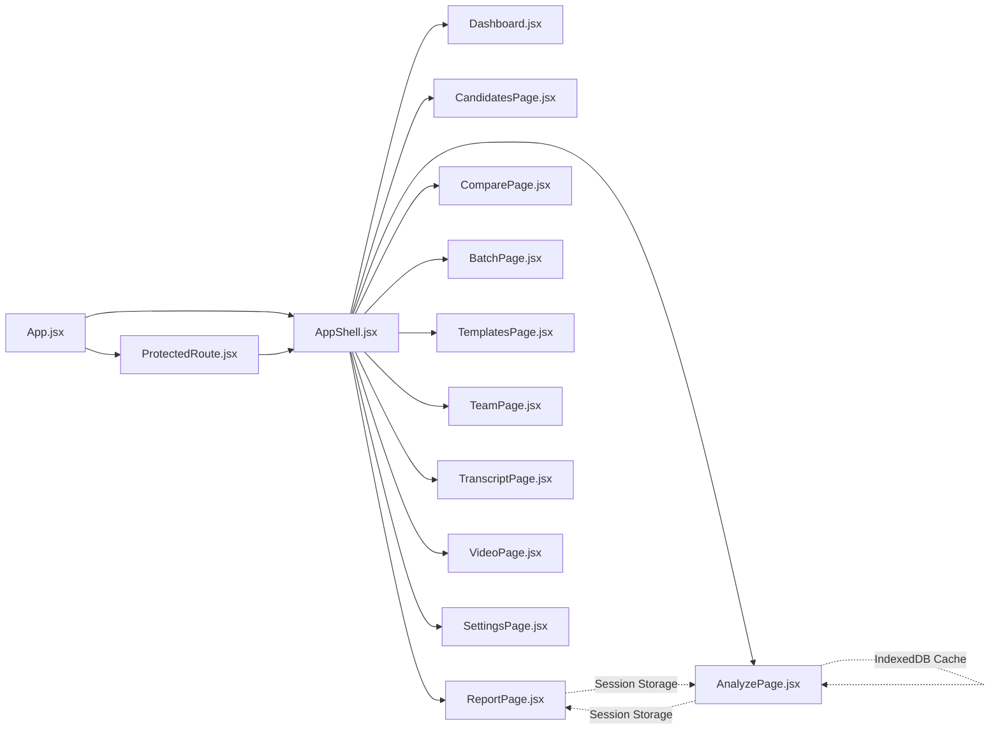

**Diagram sources**
- [App.jsx:39-61](file://app/frontend/src/App.jsx#L39-L61)
- [ProtectedRoute.jsx:4-23](file://app/frontend/src/components/ProtectedRoute.jsx#L4-L23)
- [AppShell.jsx:3-12](file://app/frontend/src/components/AppShell.jsx#L3-L12)

**Section sources**
- [App.jsx:39-61](file://app/frontend/src/App.jsx#L39-L61)

## Performance Considerations
- Lazy loading: Pages are lazy-loaded via React.lazy and Suspense to reduce initial bundle size.
- Conditional rendering: Pages hide heavy panels (e.g., progress) until needed.
- Pagination: Candidates and Batch results use pagination to limit DOM size.
- Usage checks: BatchPage validates usage before starting analysis to avoid unnecessary requests.
- Session Storage Optimization: ReportPage efficiently loads JD context from sessionStorage without blocking UI.
- IndexedDB Performance:
  - **New** IndexedDB operations are asynchronous and non-blocking, preventing UI freezes.
  - **New** Database initialization occurs only when needed, minimizing startup overhead.
  - **New** File caching uses efficient object store operations for minimal memory footprint.
- Recommendations:
  - Defer non-critical data fetching (e.g., templates/history) until needed.
  - Use virtualized lists for very large datasets.
  - Debounce search inputs where applicable.
  - Implement proper error handling for sessionStorage and IndexedDB operations.
  - Consider IndexedDB quota management for large file caching scenarios.

## Troubleshooting Guide
- Authentication issues
  - ProtectedRoute shows a loader while checking auth; redirects to LoginPage if not authenticated.
- Network errors
  - Pages surface error messages from API responses; retry or check service connectivity.
- Missing data
  - ReportPage redirects to Dashboard if no result found; ensure state/session storage is present.
  - "Analyze Another Resume" feature requires valid JD context in sessionStorage.
- Usage limits
  - BatchPage and SettingsPage display remaining analyses and prompts to upgrade.
- Video analysis
  - VideoPage uses XHR with progress; abort on reset and handle network errors gracefully.
- Session Storage Issues
  - ReportPage gracefully handles invalid or corrupted sessionStorage data.
  - AnalyzePage ensures proper JSON parsing before storing JD context.
- IndexedDB Issues:
  - **New** IndexedDB operations are wrapped in try-catch blocks to prevent application crashes.
  - **New** Database initialization errors are handled gracefully with fallback to sessionStorage.
  - **New** File caching operations fail silently to maintain application stability.
  - **New** Users with IndexedDB disabled or quota exceeded automatically fall back to sessionStorage.
- Cross-Browser Compatibility:
  - **New** IndexedDB is supported in all modern browsers; fallback mechanisms ensure consistent behavior.
  - **New** File mode JD caching works across different browser sessions and tabs.

**Section sources**
- [ProtectedRoute.jsx:4-23](file://app/frontend/src/components/ProtectedRoute.jsx#L4-L23)
- [ReportPage.jsx:99-118](file://app/frontend/src/pages/ReportPage.jsx#L99-L118)
- [ReportPage.jsx:112-120](file://app/frontend/src/pages/ReportPage.jsx#L112-L120)
- [AnalyzePage.jsx:279-286](file://app/frontend/src/pages/AnalyzePage.jsx#L279-L286)
- [BatchPage.jsx:89-121](file://app/frontend/src/pages/BatchPage.jsx#L89-L121)
- [VideoPage.jsx:542-610](file://app/frontend/src/pages/VideoPage.jsx#L542-L610)

## Conclusion
The Resume AI frontend organizes pages around a clean routing and protection layer, with shared providers and layout. Each page encapsulates its data fetching, state, and navigation, while leveraging common components and responsive patterns. The architecture supports scalability and maintainability, with clear separation of concerns and predictable data flows. Recent enhancements include improved session storage integration for seamless user workflows and cross-page continuity, along with the addition of IndexedDB-based file-mode JD caching functionality for persistent storage across browser sessions.

## Appendices

### Route Protection Mechanisms
- ProtectedRoute blocks unauthenticated users and shows a loader while resolving auth state.
- AppShell wraps pages with providers for authentication and subscription data.

**Section sources**
- [ProtectedRoute.jsx:4-23](file://app/frontend/src/components/ProtectedRoute.jsx#L4-L23)
- [App.jsx:29-37](file://app/frontend/src/App.jsx#L29-L37)

### Adding a New Page
- Create a new file under src/pages/NewPage.jsx.
- Define the page component with its own state, effects, and UI.
- Import the page in App.jsx and add a route under Routes.
- Wrap the route with Shell to inherit providers and AppShell.
- Optionally add a navigation item in NavBar.

**Section sources**
- [App.jsx:8-19](file://app/frontend/src/App.jsx#L8-L19)
- [App.jsx:46-56](file://app/frontend/src/App.jsx#L46-L56)

### Extending Existing Pages
- Introduce new state fields and effects for data fetching.
- Add UI sections and integrate with shared components.
- Respect route protection and provider chain.
- Keep loading/error states explicit and user-friendly.
- Implement proper session storage integration when enabling cross-page features.
- Consider IndexedDB integration for persistent data storage when appropriate.

### Session Storage Integration Patterns
- Store context data in sessionStorage with structured keys (e.g., `aria_active_jd`, `report_${id}`).
- Implement proper JSON parsing with error handling.
- Provide graceful fallbacks when sessionStorage data is unavailable or corrupted.
- Use sessionStorage for temporary context that enhances user workflow continuity.

**Section sources**
- [AnalyzePage.jsx:279-286](file://app/frontend/src/pages/AnalyzePage.jsx#L279-L286)
- [ReportPage.jsx:112-120](file://app/frontend/src/pages/ReportPage.jsx#L112-L120)
- [ReportPage.jsx:133-142](file://app/frontend/src/pages/ReportPage.jsx#L133-L142)
- [ReportPage.jsx:224-231](file://app/frontend/src/pages/ReportPage.jsx#L224-L231)

### IndexedDB Integration Patterns
- **New** Use IndexedDB for persistent storage of large files and complex data structures.
- **New** Implement helper functions (openJdDB, storeJdFile, getJdFile, clearJdFile) for consistent database operations.
- **New** Provide graceful fallback mechanisms when IndexedDB is unavailable or fails.
- **New** Use asynchronous operations to prevent UI blocking and maintain application responsiveness.
- **New** Implement proper error handling and logging for database operations.

**Section sources**
- [AnalyzePage.jsx:30-80](file://app/frontend/src/pages/AnalyzePage.jsx#L30-L80)
- [AnalyzePage.jsx:193-210](file://app/frontend/src/pages/AnalyzePage.jsx#L193-L210)
- [AnalyzePage.jsx:359-369](file://app/frontend/src/pages/AnalyzePage.jsx#L359-L369)