# Enhanced Resume Text Rendering Component

<cite>
**Referenced Files in This Document**
- [ReportPage.jsx](file://app/frontend/src/pages/ReportPage.jsx)
- [StreamingText.jsx](file://app/frontend/src/components/StreamingText.jsx)
- [VoiceScreeningPage.jsx](file://app/frontend/src/pages/VoiceScreeningPage.jsx)
- [VoiceScheduleModal.jsx](file://app/frontend/src/components/VoiceScheduleModal.jsx)
- [parser_service.py](file://app/backend/services/parser_service.py)
- [hybrid_pipeline.py](file://app/backend/services/hybrid_pipeline.py)
- [test_parser_service.py](file://app/backend/tests/test_parser_service.py)
</cite>

## Update Summary
**Changes Made**
- Added new voice screening integration points with Schedule Voice Screen buttons in both floating action bar and sticky header
- Enhanced sharing functionality with permanent URLs for saved reports replacing previous session-only sharing mechanism
- Integrated voice screening scheduling workflow with report page actions
- Updated report sharing system to support both permanent and temporary sharing modes

## Table of Contents
1. [Introduction](#introduction)
2. [Project Structure](#project-structure)
3. [Core Components](#core-components)
4. [Architecture Overview](#architecture-overview)
5. [Detailed Component Analysis](#detailed-component-analysis)
6. [Voice Screening Integration](#voice-screening-integration)
7. [Enhanced Sharing System](#enhanced-sharing-system)
8. [Dependency Analysis](#dependency-analysis)
9. [Performance Considerations](#performance-considerations)
10. [Troubleshooting Guide](#troubleshooting-guide)
11. [Conclusion](#conclusion)

## Introduction
The Enhanced Resume Text Rendering Component is a sophisticated front-end solution designed to transform raw, unstructured resume text into a professionally formatted, readable HTML presentation. This component serves as a bridge between the backend's resume parsing capabilities and the user interface, providing recruiters and hiring managers with an intuitive way to review candidate information.

The component operates on plain text resumes extracted from various file formats (PDF, DOCX, RTF, ODT) and applies intelligent formatting rules to create a structured, visually appealing representation that maintains readability while enhancing information hierarchy and presentation quality.

**Updated** Added comprehensive voice screening integration and enhanced sharing functionality for seamless candidate assessment workflows.

## Project Structure
The Enhanced Resume Text Rendering Component is integrated within the broader Resume AI platform, which consists of:

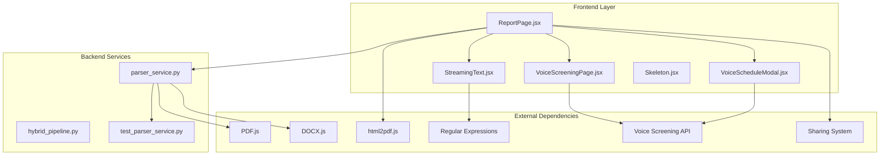

**Diagram sources**
- [ReportPage.jsx:1-1192](file://app/frontend/src/pages/ReportPage.jsx#L1-L1192)
- [parser_service.py:1-2200](file://app/backend/services/parser_service.py#L1-L2200)
- [VoiceScreeningPage.jsx:147-329](file://app/frontend/src/pages/VoiceScreeningPage.jsx#L147-L329)
- [VoiceScheduleModal.jsx:240-257](file://app/frontend/src/components/VoiceScheduleModal.jsx#L240-L257)

The component follows a modular architecture where the frontend handles presentation logic while the backend manages text extraction and parsing. This separation ensures maintainability and allows for independent optimization of each layer.

**Section sources**
- [ReportPage.jsx:1-1192](file://app/frontend/src/pages/ReportPage.jsx#L1-L1192)
- [parser_service.py:1-2200](file://app/backend/services/parser_service.py#L1-L2200)
- [VoiceScreeningPage.jsx:147-329](file://app/frontend/src/pages/VoiceScreeningPage.jsx#L147-L329)
- [VoiceScheduleModal.jsx:240-257](file://app/frontend/src/components/VoiceScheduleModal.jsx#L240-L257)

## Core Components

### ResumeTextRenderer Function
The core of the enhanced rendering system is the `ResumeTextRenderer` function located in `ReportPage.jsx`. This component transforms raw resume text into structured HTML elements using sophisticated pattern recognition and formatting logic.

The renderer employs three primary regular expressions to identify different content types:
- **SECTION_RE**: Identifies section headers (ALL CAPS lines with optional colons)
- **BULLET_RE**: Detects bullet-point markers (various Unicode bullet characters)
- **DATE_RE**: Recognizes employment date patterns

**Section sources**
- [ReportPage.jsx:25-139](file://app/frontend/src/pages/ReportPage.jsx#L25-L139)

### StreamingText Component
The `StreamingText` component provides dynamic text display capabilities for real-time content updates. This component supports progressive text revelation with configurable speeds and streaming modes, essential for displaying AI-generated narrative content during real-time analysis.

**Section sources**
- [StreamingText.jsx:1-73](file://app/frontend/src/components/StreamingText.jsx#L1-L73)

### Backend Parser Integration
The backend `parser_service.py` provides comprehensive text extraction from multiple document formats, supporting:
- PDF documents via pdfplumber
- Microsoft Word documents (.docx)
- Rich Text Format (.rtf)
- OpenDocument Text (.odt)
- Plain text files with various encodings

**Section sources**
- [parser_service.py:16-52](file://app/backend/services/parser_service.py#L16-L52)
- [parser_service.py:863-875](file://app/backend/services/parser_service.py#L863-L875)

## Architecture Overview

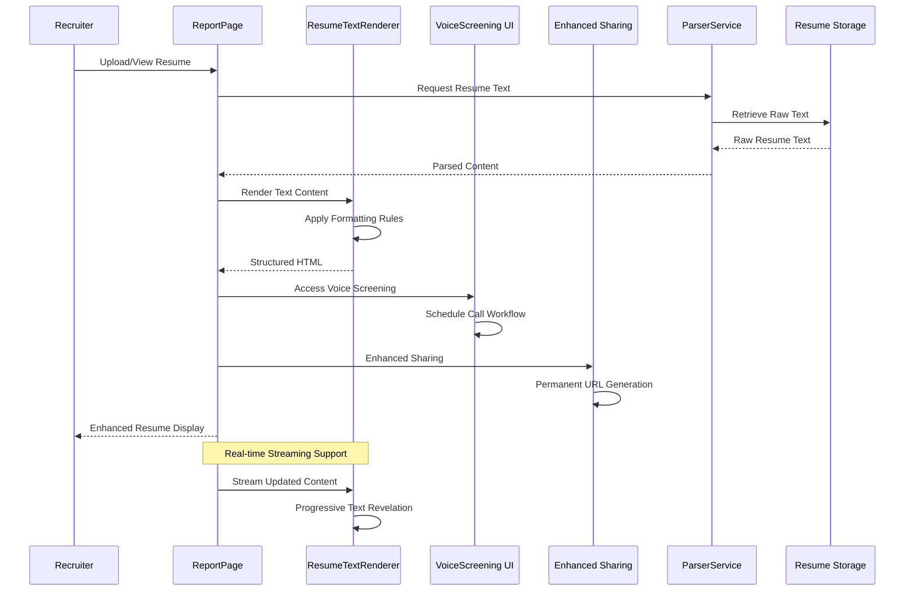

**Diagram sources**
- [ReportPage.jsx:398-432](file://app/frontend/src/pages/ReportPage.jsx#L398-L432)
- [parser_service.py:863-875](file://app/backend/services/parser_service.py#L863-L875)
- [VoiceScreeningPage.jsx:248-266](file://app/frontend/src/pages/VoiceScreeningPage.jsx#L248-L266)
- [ReportPage.jsx:482-498](file://app/frontend/src/pages/ReportPage.jsx#L482-L498)

The architecture implements a reactive pattern where the frontend component responds to data changes and applies formatting transformations in real-time. The system supports both static content rendering and dynamic streaming updates for AI-generated analysis results. Enhanced integration with voice screening and sharing systems provides comprehensive candidate assessment workflows.

## Detailed Component Analysis

### ResumeTextRenderer Implementation

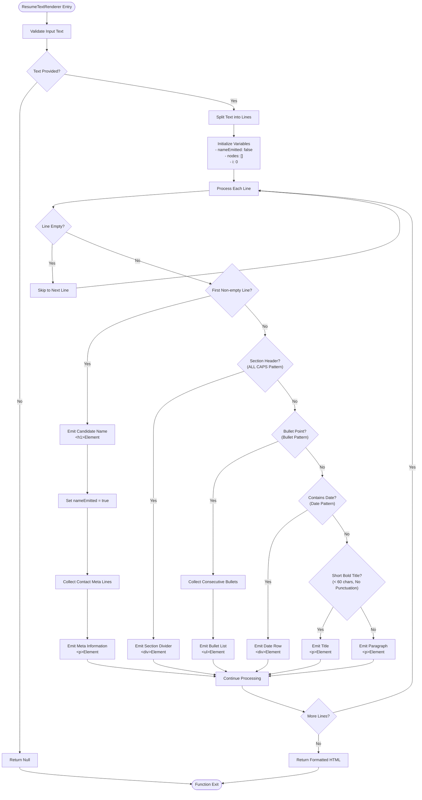

**Diagram sources**
- [ReportPage.jsx:25-139](file://app/frontend/src/pages/ReportPage.jsx#L25-L139)

The rendering algorithm processes resume text through a series of intelligent detection mechanisms:

1. **Name Detection**: Automatically identifies the first meaningful line as the candidate's name
2. **Contact Information**: Collects subsequent short lines as contact details
3. **Section Headers**: Recognizes ALL CAPS section headings with proper formatting
4. **Bullet Points**: Groups consecutive bullet items into organized lists
5. **Date Recognition**: Formats employment date ranges appropriately
6. **Title Identification**: Detects company/role titles based on formatting patterns
7. **Paragraph Formatting**: Handles standard text content with appropriate styling

**Section sources**
- [ReportPage.jsx:25-139](file://app/frontend/src/pages/ReportPage.jsx#L25-L139)

### Backend Text Extraction Pipeline

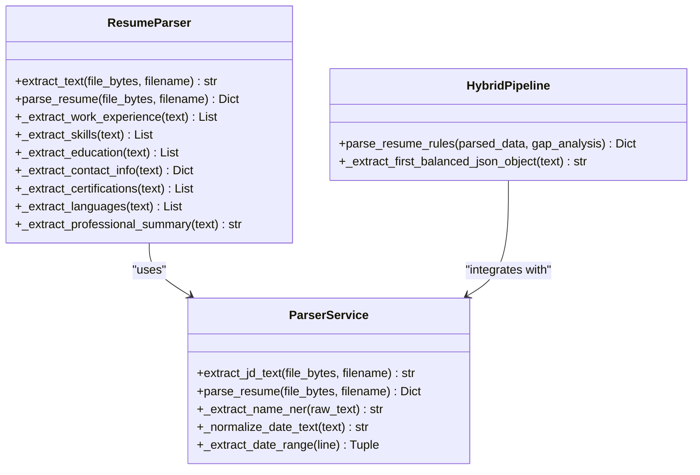

**Diagram sources**
- [parser_service.py:863-875](file://app/backend/services/parser_service.py#L863-L875)
- [hybrid_pipeline.py:402-416](file://app/backend/services/hybrid_pipeline.py#L402-L416)

The backend service provides robust text extraction capabilities through multiple format support and intelligent parsing algorithms. The system handles various document formats while maintaining consistency in extracted content structure.

**Section sources**
- [parser_service.py:16-52](file://app/backend/services/parser_service.py#L16-L52)
- [parser_service.py:863-875](file://app/backend/services/parser_service.py#L863-L875)

### Streaming Text Display System

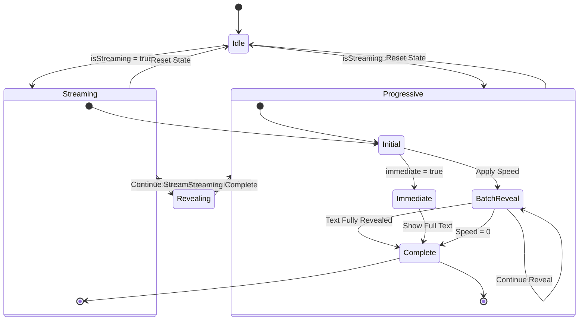

**Diagram sources**
- [StreamingText.jsx:23-60](file://app/frontend/src/components/StreamingText.jsx#L23-L60)

The streaming text component implements a sophisticated animation system that provides visual feedback during content loading and real-time updates. The component supports both immediate display and progressive revelation modes, allowing for flexible user experience customization.

**Section sources**
- [StreamingText.jsx:1-73](file://app/frontend/src/components/StreamingText.jsx#L1-L73)

## Voice Screening Integration

**Updated** The system now includes comprehensive voice screening integration with multiple access points throughout the interface.

### Voice Screening Access Points

The voice screening functionality is accessible through two primary integration points:

#### Floating Action Bar Integration
The main floating action bar in the report page provides direct access to voice screening capabilities:

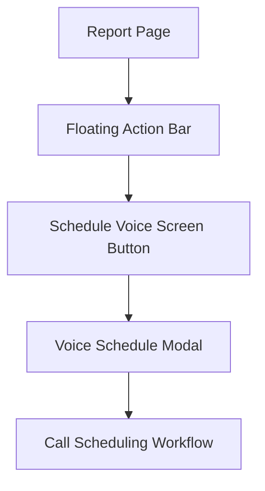

**Diagram sources**
- [ReportPage.jsx:943-1022](file://app/frontend/src/pages/ReportPage.jsx#L943-L1022)
- [VoiceScheduleModal.jsx:240-257](file://app/frontend/src/components/VoiceScheduleModal.jsx#L240-L257)

#### Sticky Header Integration  
The sticky header also provides voice screening access for quick scheduling:

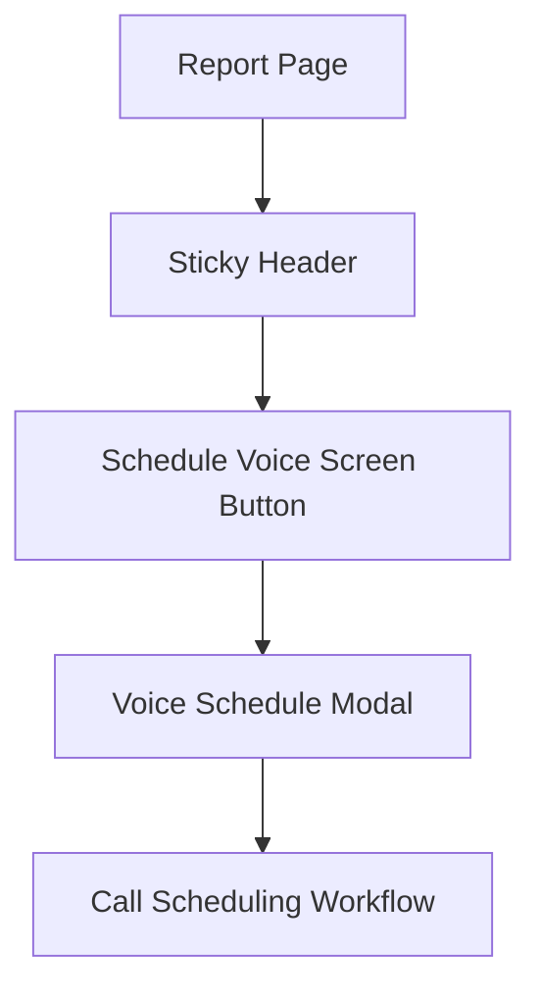

**Diagram sources**
- [ReportPage.jsx:944-955](file://app/frontend/src/pages/ReportPage.jsx#L944-L955)
- [VoiceScheduleModal.jsx:240-257](file://app/frontend/src/components/VoiceScheduleModal.jsx#L240-L257)

### Voice Screening Page Integration

The dedicated voice screening page provides comprehensive call management:

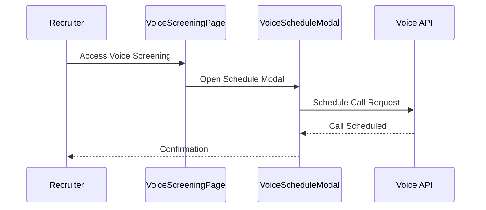

**Diagram sources**
- [VoiceScreeningPage.jsx:147-329](file://app/frontend/src/pages/VoiceScreeningPage.jsx#L147-L329)
- [VoiceScheduleModal.jsx:240-257](file://app/frontend/src/components/VoiceScheduleModal.jsx#L240-L257)

**Section sources**
- [ReportPage.jsx:943-1022](file://app/frontend/src/pages/ReportPage.jsx#L943-L1022)
- [ReportPage.jsx:944-955](file://app/frontend/src/pages/ReportPage.jsx#L944-L955)
- [VoiceScreeningPage.jsx:147-329](file://app/frontend/src/pages/VoiceScreeningPage.jsx#L147-L329)
- [VoiceScheduleModal.jsx:240-257](file://app/frontend/src/components/VoiceScheduleModal.jsx#L240-L257)

## Enhanced Sharing System

**Updated** The sharing functionality has been significantly enhanced with permanent URL generation for saved reports, replacing the previous session-only sharing mechanism.

### Permanent URL Generation

The enhanced sharing system provides two distinct sharing modes:

#### Saved Reports (Permanent URLs)
For reports with persistent identifiers, the system generates permanent URLs accessible to authorized users:

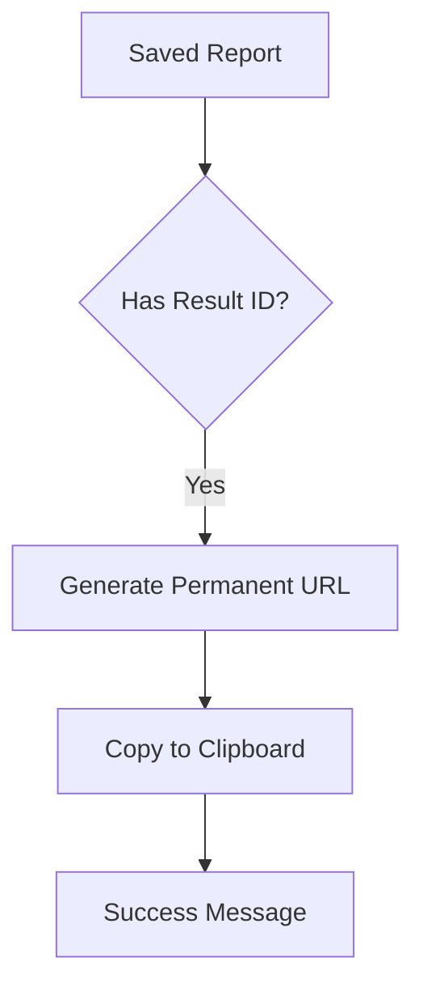

**Diagram sources**
- [ReportPage.jsx:482-498](file://app/frontend/src/pages/ReportPage.jsx#L482-L498)

#### Temporary Reports (Session-based)
For unsaved or temporary reports, the system creates session-specific URLs using unique identifiers:

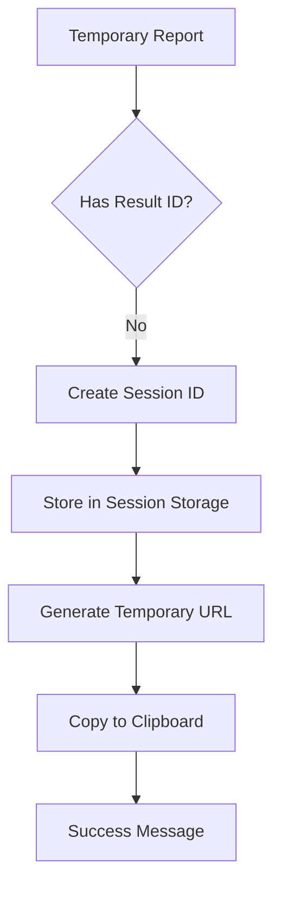

**Diagram sources**
- [ReportPage.jsx:482-498](file://app/frontend/src/pages/ReportPage.jsx#L482-L498)

### Sharing Workflow Integration

The enhanced sharing system integrates seamlessly with the report interface:

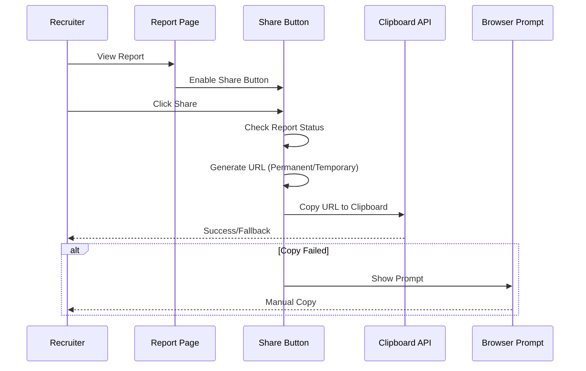

**Diagram sources**
- [ReportPage.jsx:482-498](file://app/frontend/src/pages/ReportPage.jsx#L482-L498)

**Section sources**
- [ReportPage.jsx:482-498](file://app/frontend/src/pages/ReportPage.jsx#L482-L498)

## Dependency Analysis

The Enhanced Resume Text Rendering Component exhibits strong internal cohesion and loose coupling with external systems:

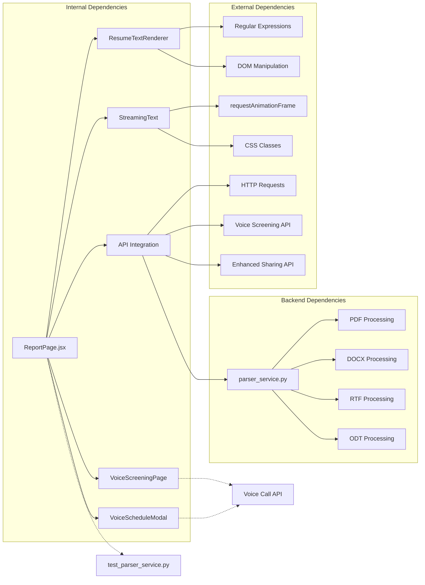

**Diagram sources**
- [ReportPage.jsx:13-19](file://app/frontend/src/pages/ReportPage.jsx#L13-L19)
- [parser_service.py:16-52](file://app/backend/services/parser_service.py#L16-L52)
- [VoiceScreeningPage.jsx:147-160](file://app/frontend/src/pages/VoiceScreeningPage.jsx#L147-L160)
- [VoiceScheduleModal.jsx:240-257](file://app/frontend/src/components/VoiceScheduleModal.jsx#L240-L257)

The component maintains minimal external dependencies, relying primarily on React's built-in capabilities and standard web APIs. This design choice enhances portability and reduces maintenance overhead.

**Section sources**
- [ReportPage.jsx:13-19](file://app/frontend/src/pages/ReportPage.jsx#L13-L19)
- [parser_service.py:16-52](file://app/backend/services/parser_service.py#L16-L52)
- [VoiceScreeningPage.jsx:147-160](file://app/frontend/src/pages/VoiceScreeningPage.jsx#L147-L160)
- [VoiceScheduleModal.jsx:240-257](file://app/frontend/src/components/VoiceScheduleModal.jsx#L240-L257)

## Performance Considerations

The Enhanced Resume Text Rendering Component is optimized for performance through several key strategies:

### Memory Management
- **Efficient Pattern Matching**: Uses compiled regular expressions to minimize computational overhead
- **Incremental Processing**: Processes text line-by-line rather than loading entire documents into memory
- **DOM Element Reuse**: Leverages React's virtual DOM for efficient rendering updates
- **Voice Modal Optimization**: Implements lazy loading for voice scheduling components

### Rendering Optimization
- **Batch Updates**: Groups related DOM manipulations to reduce reflow operations
- **Conditional Rendering**: Only renders content when data is available and valid
- **CSS Class Optimization**: Uses Tailwind CSS utility classes for compact, cacheable styles
- **Voice UI Debouncing**: Implements debounced rendering for voice scheduling interfaces

### Asynchronous Operations
- **Non-blocking Processing**: Text formatting occurs outside the main rendering thread
- **Stream-friendly Design**: Supports progressive content display without blocking user interactions
- **Enhanced Sharing Caching**: Implements caching for frequently accessed shared URLs
- **Voice API Optimization**: Uses request batching for voice screening operations

## Troubleshooting Guide

### Common Issues and Solutions

**Issue**: Resume text not displaying properly
- **Cause**: Malformed text formatting or unsupported characters
- **Solution**: Verify text encoding and check for special characters that might interfere with pattern matching

**Issue**: Section headers not recognized
- **Cause**: Non-standard section naming or formatting inconsistencies
- **Solution**: Ensure section headers follow the ALL CAPS pattern with optional colons

**Issue**: Bullet points not grouped correctly
- **Cause**: Inconsistent bullet character usage or spacing issues
- **Solution**: Standardize bullet character usage and ensure consistent indentation

**Issue**: Streaming text animation not working
- **Cause**: Animation frame throttling or component unmounting
- **Solution**: Check for proper cleanup of animation frames and component lifecycle management

**Issue**: Voice screening button not accessible
- **Cause**: Missing candidate ID or authentication issues
- **Solution**: Verify candidate association and ensure proper user permissions

**Issue**: Share button disabled
- **Cause**: Report not fully generated or network connectivity issues
- **Solution**: Wait for report completion or check network connection before attempting to share

**Issue**: Voice scheduling modal not opening
- **Cause**: Voice API service unavailability or browser compatibility issues
- **Solution**: Check voice screening service status and ensure browser supports required APIs

**Section sources**
- [ReportPage.jsx:25-139](file://app/frontend/src/pages/ReportPage.jsx#L25-L139)
- [StreamingText.jsx:23-60](file://app/frontend/src/components/StreamingText.jsx#L23-L60)
- [VoiceScreeningPage.jsx:248-266](file://app/frontend/src/pages/VoiceScreeningPage.jsx#L248-L266)
- [ReportPage.jsx:482-498](file://app/frontend/src/pages/ReportPage.jsx#L482-L498)

## Conclusion

The Enhanced Resume Text Rendering Component represents a sophisticated solution for transforming raw resume text into professional, readable presentations. Through intelligent pattern recognition, robust backend integration, and responsive frontend design, the component delivers a superior user experience for recruiting professionals.

**Updated** The recent enhancements significantly expand the component's capabilities through comprehensive voice screening integration and enhanced sharing functionality. The addition of voice screening access points in both floating action bars and sticky headers provides seamless candidate assessment workflows, while the permanent URL sharing system ensures reports remain accessible beyond session boundaries.

The system's modular architecture ensures maintainability and scalability, while its performance optimizations provide smooth user interactions even with large documents. The integration with the broader Resume AI platform demonstrates the component's role as a critical interface between automated parsing capabilities and human-readable presentation formats.

Future enhancements could include support for additional document formats, improved accessibility features, enhanced customization options for different recruiting workflows, and expanded voice screening analytics integration.