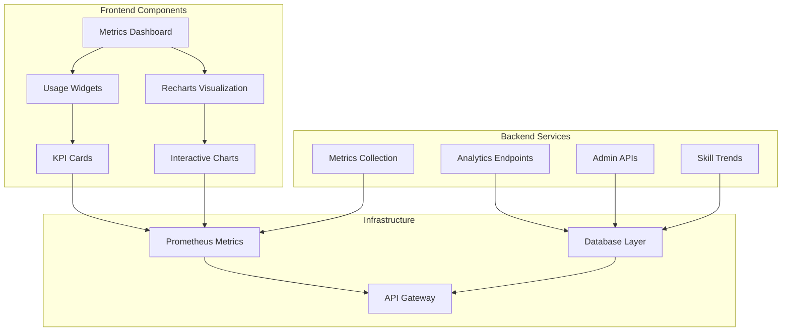
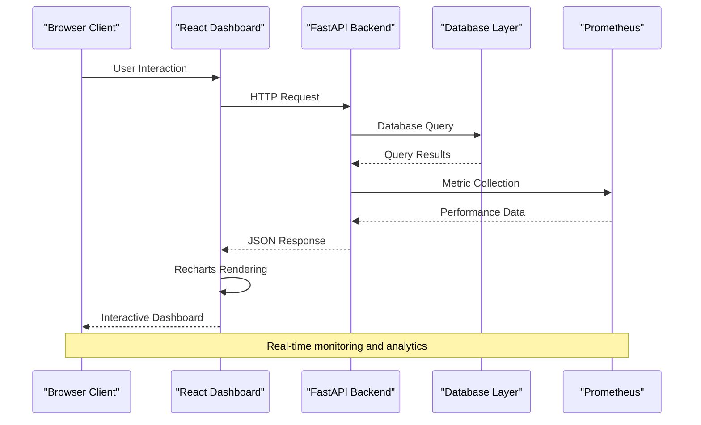
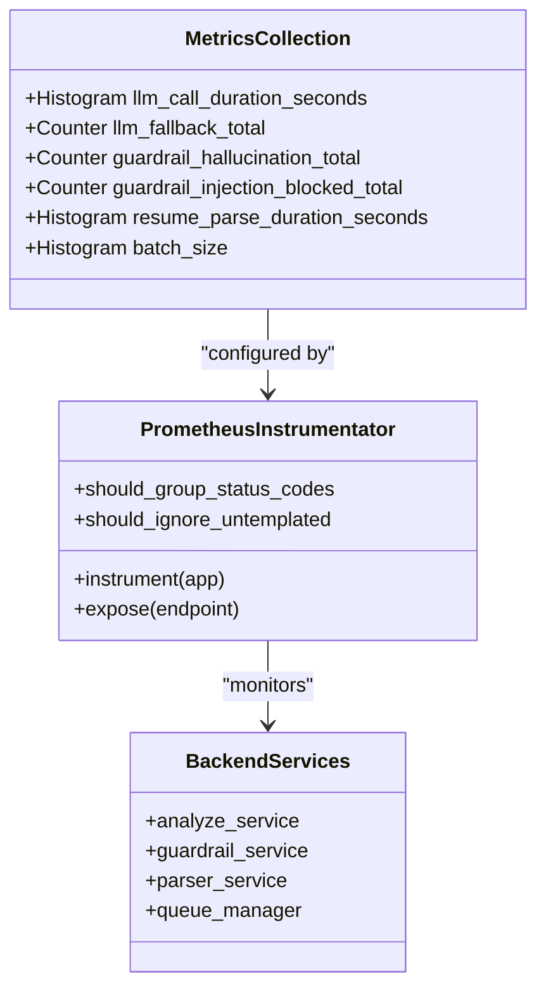
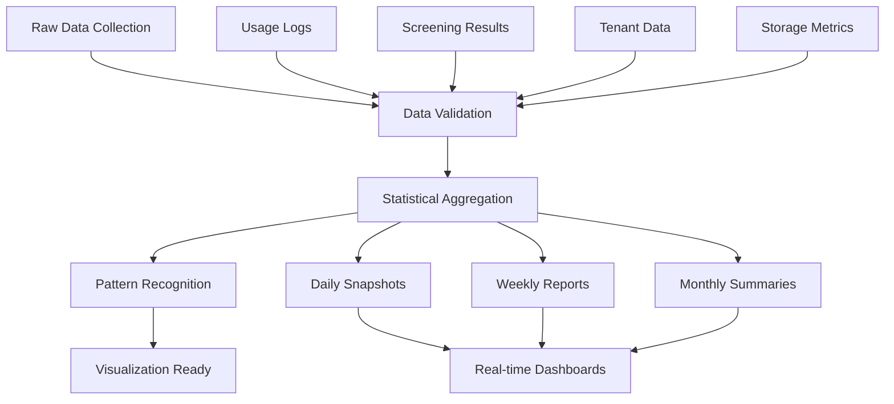
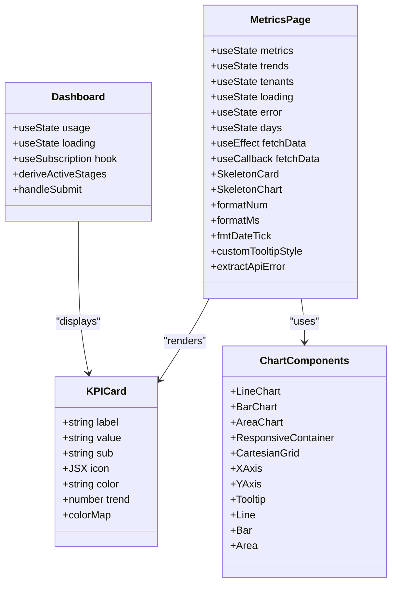
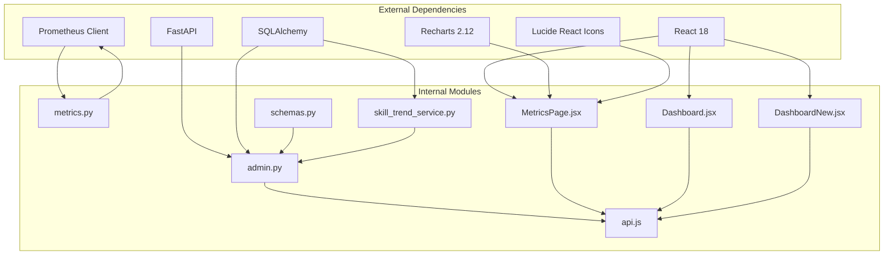

# Platform Metrics Dashboard

<cite>
**Referenced Files in This Document**
- [metrics.py](file://app/backend/services/metrics.py)
- [admin.py](file://app/backend/routes/admin.py)
- [api.js](file://app/frontend/src/lib/api.js)
- [MetricsPage.jsx](file://app/frontend/src/pages/admin/MetricsPage.jsx)
- [Dashboard.jsx](file://app/frontend/src/pages/Dashboard.jsx)
- [DashboardNew.jsx](file://app/frontend/src/pages/DashboardNew.jsx)
- [schemas.py](file://app/backend/models/schemas.py)
- [skill_trend_service.py](file://app/backend/services/skill_trend_service.py)
- [main.py](file://app/backend/main.py)
- [test_admin_metrics.py](file://app/backend/tests/test_admin_metrics.py)
</cite>

## Update Summary
**Changes Made**
- Enhanced error handling section to document the new extractApiError() utility function
- Updated pagination configuration to reflect the 100-item per page limit for tenant listing
- Added troubleshooting guidance for enhanced error handling
- Updated frontend error handling implementation details

## Table of Contents
1. [Introduction](#introduction)
2. [Project Structure](#project-structure)
3. [Core Components](#core-components)
4. [Architecture Overview](#architecture-overview)
5. [Detailed Component Analysis](#detailed-component-analysis)
6. [Interactive Data Visualization](#interactive-data-visualization)
7. [Enhanced Error Handling](#enhanced-error-handling)
8. [Pagination Optimization](#pagination-optimization)
9. [Dependency Analysis](#dependency-analysis)
10. [Performance Considerations](#performance-considerations)
11. [Troubleshooting Guide](#troubleshooting-guide)
12. [Conclusion](#conclusion)

## Introduction
The Platform Metrics Dashboard is a comprehensive analytics solution for the Resume AI by ThetaLogics platform. It provides real-time visibility into platform-wide operations, tenant usage patterns, and key performance indicators. The dashboard combines backend metrics collection, advanced analytics endpoints, and a modern frontend interface featuring sophisticated Recharts-based data visualization to deliver actionable insights for platform administrators and stakeholders.

The system tracks critical metrics including tenant engagement, analysis volumes, storage utilization, revenue indicators, and operational health. It leverages Prometheus metrics for infrastructure monitoring and custom analytics endpoints for business intelligence, providing both granular operational data and high-level strategic insights through interactive chart components.

## Project Structure
The Platform Metrics Dashboard follows a modular architecture with clear separation between backend services, frontend components, and supporting infrastructure:

**Diagram sources**
- [main.py:350-358](file://app/backend/main.py#L350-L358)
- [metrics.py:1-76](file://app/backend/services/metrics.py#L1-L76)
- [admin.py:1439-1500](file://app/backend/routes/admin.py#L1439-L1500)

**Section sources**
- [main.py:343-428](file://app/backend/main.py#L343-L428)
- [metrics.py:1-76](file://app/backend/services/metrics.py#L1-L76)
- [admin.py:1439-1500](file://app/backend/routes/admin.py#L1439-L1500)

## Core Components

### Backend Metrics Infrastructure
The metrics system is built around Prometheus integration and custom metric definitions:

**Custom Metrics Categories:**
- **LLM Operations Metrics**: Track language model performance and reliability
- **Guardrail Compliance Metrics**: Monitor AI safety and quality controls
- **Resume Processing Metrics**: Measure parsing efficiency and throughput
- **Batch Operation Metrics**: Track bulk analysis performance

**Section sources**
- [metrics.py:10-76](file://app/backend/services/metrics.py#L10-L76)

### Admin Platform Metrics
Platform-wide administrative metrics provide strategic insights:

**Metrics Overview Endpoint**: `/api/admin/metrics/overview`
- Tenant distribution analysis
- Usage pattern tracking
- Revenue estimation
- Storage utilization
- Plan distribution

**Usage Trends Endpoint**: `/api/admin/metrics/usage-trends`
- Historical analysis volume tracking
- User activity patterns
- Customizable time ranges

**Section sources**
- [admin.py:1439-1516](file://app/backend/routes/admin.py#L1439-L1516)
- [admin.py:1519-1553](file://app/backend/routes/admin.py#L1519-L1553)

### Frontend Dashboard Implementation
The React-based frontend delivers interactive visualizations using Recharts:

**MetricsPage Component**: Advanced administrative dashboard with comprehensive analytics interface
- Multi-dimensional KPI cards with trend indicators
- Interactive time-series charts using Recharts
- Tenant comparison tables with sortable columns
- Real-time data refresh capabilities with loading states
- Responsive design with skeleton loaders
- Custom tooltip styling and formatting
- **Updated**: Enhanced error handling with extractApiError() utility

**Dashboard Components**: Multiple dashboard implementations
- Primary user interface with usage tracking
- Advanced dashboard with pipeline visualization
- Activity feed and analytics integration

**Section sources**
- [MetricsPage.jsx:109-432](file://app/frontend/src/pages/admin/MetricsPage.jsx#L109-L432)
- [Dashboard.jsx:204-335](file://app/frontend/src/pages/Dashboard.jsx#L204-L335)
- [DashboardNew.jsx:182-740](file://app/frontend/src/pages/DashboardNew.jsx#L182-L740)

## Architecture Overview

The Platform Metrics Dashboard employs a distributed architecture with clear separation of concerns and sophisticated data visualization:

**Diagram sources**
- [main.py:350-358](file://app/backend/main.py#L350-L358)
- [api.js:1-800](file://app/frontend/src/lib/api.js#L1-L800)

The architecture supports both synchronous and asynchronous data processing, with Prometheus metrics providing infrastructure-level monitoring alongside application-specific analytics. The new Recharts-based frontend adds sophisticated visualization capabilities for enhanced data interpretation.

**Section sources**
- [main.py:343-428](file://app/backend/main.py#L343-L428)
- [api.js:1-800](file://app/frontend/src/lib/api.js#L1-L800)

## Detailed Component Analysis

### Prometheus Metrics Integration
The backend integrates with Prometheus for comprehensive infrastructure monitoring:

**Diagram sources**
- [metrics.py:10-76](file://app/backend/services/metrics.py#L10-L76)
- [main.py:350-358](file://app/backend/main.py#L350-L358)

The metrics system captures critical performance indicators including LLM call durations, fallback occurrences, and parsing efficiency. These metrics inform capacity planning and performance optimization decisions.

**Section sources**
- [metrics.py:10-76](file://app/backend/services/metrics.py#L10-L76)
- [main.py:350-358](file://app/backend/main.py#L350-L358)

### Analytics Data Processing Pipeline
The analytics system processes data through multiple stages:

**Diagram sources**
- [admin.py:1439-1516](file://app/backend/routes/admin.py#L1439-L1516)
- [skill_trend_service.py:32-164](file://app/backend/services/skill_trend_service.py#L32-L164)

The pipeline handles diverse data sources including usage logs, screening results, and tenant information, transforming raw data into meaningful business insights.

**Section sources**
- [admin.py:1439-1516](file://app/backend/routes/admin.py#L1439-L1516)
- [skill_trend_service.py:32-164](file://app/backend/services/skill_trend_service.py#L32-L164)

### Frontend Dashboard Components
The React-based frontend provides interactive data visualization with sophisticated chart components:

**Diagram sources**
- [MetricsPage.jsx:109-432](file://app/frontend/src/pages/admin/MetricsPage.jsx#L109-L432)
- [Dashboard.jsx:204-335](file://app/frontend/src/pages/Dashboard.jsx#L204-L335)
- [DashboardNew.jsx:182-740](file://app/frontend/src/pages/DashboardNew.jsx#L182-L740)

The frontend components utilize React hooks for state management and Recharts for sophisticated data visualization, providing responsive and interactive user experiences with comprehensive charting capabilities.

**Section sources**
- [MetricsPage.jsx:109-432](file://app/frontend/src/pages/admin/MetricsPage.jsx#L109-L432)
- [Dashboard.jsx:204-335](file://app/frontend/src/pages/Dashboard.jsx#L204-L335)
- [DashboardNew.jsx:182-740](file://app/frontend/src/pages/DashboardNew.jsx#L182-L740)

## Interactive Data Visualization

The MetricsPage.jsx introduces a comprehensive Recharts-based analytics interface with sophisticated interactive visualizations:

### Chart Components and Data Visualization
The dashboard implements four distinct chart types for comprehensive data representation:

**Line Chart - Analyses per Day**
- Monotone line visualization for time-series analysis trends
- Responsive container with dynamic sizing
- Custom tooltip with formatted date labels
- Smooth curve interpolation for better readability

**Bar Chart - Active Users per Day**
- Vertical bar visualization for daily user activity
- Gradient styling with brand-specific colors
- Rounded bar tops for modern aesthetic
- Hover interaction with active dots

**Area Chart - Storage Usage Trend**
- Gradient-filled area chart for storage consumption
- Linear gradient definition for visual depth
- Unit labeling for gigabyte measurements
- Smooth monotone interpolation

**Table Component - Top Activity Tenants**
- Sortable table with ranking system
- Responsive design with horizontal scrolling
- Hover effects for improved user experience
- Comprehensive tenant information display

### Interactive Features
The visualization system includes advanced interactive capabilities:

**Time Range Selection**
- Configurable time ranges (7, 30, 90, 365 days)
- Dynamic data fetching based on selection
- State management for time period persistence

**Loading States and Skeleton Screens**
- Skeleton card placeholders during data loading
- Skeleton chart placeholders for complex visualizations
- Pulse animations for improved perceived performance

**Error Handling and Retry Mechanisms**
- Comprehensive error state management
- Retry button for failed data fetches
- User-friendly error messaging
- **Updated**: Enhanced error handling with extractApiError() utility

**Custom Styling and Theming**
- Brand-consistent color schemes
- Custom tooltip styling with branded appearance
- Responsive design for all screen sizes
- Modern glass-morphism UI elements

**Section sources**
- [MetricsPage.jsx:139-432](file://app/frontend/src/pages/admin/MetricsPage.jsx#L139-L432)

## Enhanced Error Handling

The Platform Metrics Dashboard now features comprehensive error handling through the extractApiError() utility function, providing robust error management across all API interactions:

### extractApiError() Utility Function
The new extractApiError() function provides intelligent error message extraction from API responses:

**Error Message Extraction Logic:**
- Handles string-based error messages directly
- Processes array-based validation errors from FastAPI
- Extracts individual error messages with fallback handling
- Provides user-friendly fallback messages when API details are unavailable

**Integration Points:**
- Used in MetricsPage.jsx for tenant data fetching errors
- Applied consistently across all admin dashboard components
- Supports both direct API errors and validation failures
- Maintains backward compatibility with existing error handling

**Enhanced Error Display:**
- Prevents React crashes from malformed error objects
- Provides clear, actionable feedback to users
- Supports internationalization through consistent message formats
- Integrates with the dashboard's retry mechanisms

**Section sources**
- [api.js:1072-1085](file://app/frontend/src/lib/api.js#L1072-L1085)
- [MetricsPage.jsx:130-135](file://app/frontend/src/pages/admin/MetricsPage.jsx#L130-L135)

## Pagination Optimization

The backend has been optimized with enhanced pagination limits to improve performance and user experience:

### Tenant Listing Pagination
The tenant listing endpoint now supports larger page sizes for improved efficiency:

**Pagination Configuration:**
- Maximum page size increased to 100 items per page
- Backward compatible with existing 20-item default
- Range validation ensures safe limits (1-100 items)
- Optimized database queries for larger result sets

**Endpoint Behavior:**
- `/api/admin/tenants` endpoint respects per_page parameter
- Maintains efficient OFFSET/LIMIT queries for large datasets
- Preserves sorting and filtering capabilities with pagination
- Returns comprehensive pagination metadata (total, pages, per_page)

**Performance Benefits:**
- Reduced API round trips for large tenant lists
- Improved dashboard responsiveness with fewer reloads
- Better user experience for administrative tasks
- Optimized database resource utilization

**Section sources**
- [admin.py:202-204](file://app/backend/routes/admin.py#L202-L204)

## Dependency Analysis

The Platform Metrics Dashboard exhibits well-structured dependencies with clear separation of concerns and enhanced visualization capabilities:

**Diagram sources**
- [metrics.py:8](file://app/backend/services/metrics.py#L8)
- [admin.py:11](file://app/backend/routes/admin.py#L11)
- [MetricsPage.jsx:1-26](file://app/frontend/src/pages/admin/MetricsPage.jsx#L1-L26)
- [Dashboard.jsx:5](file://app/frontend/src/pages/Dashboard.jsx#L5)
- [DashboardNew.jsx:1-16](file://app/frontend/src/pages/DashboardNew.jsx#L1-L16)

The dependency graph reveals a clean architecture where external libraries like Recharts and Lucide React enhance functionality without creating tight coupling. The new Recharts integration provides sophisticated visualization capabilities while maintaining the existing modular structure.

**Section sources**
- [metrics.py:8](file://app/backend/services/metrics.py#L8)
- [admin.py:11](file://app/backend/routes/admin.py#L11)

## Performance Considerations

The Platform Metrics Dashboard is designed with several performance optimization strategies, enhanced by the new Recharts-based visualization and improved error handling:

### Database Query Optimization
- **Efficient Filtering**: Queries use appropriate WHERE clauses and indexes
- **Aggregation Functions**: SUM and COUNT operations minimize data transfer
- **Pagination Support**: Large datasets are processed in chunks with optimized limits
- **Connection Pooling**: Database connections are managed efficiently

### Caching Strategies
- **Client-side Caching**: React components cache frequently accessed data
- **Server-side Aggregation**: Pre-computed metrics reduce real-time calculation overhead
- **Time-based Expiration**: Data freshness is balanced with performance needs
- **Chart Data Caching**: Visualization data is cached to prevent unnecessary re-rendering

### Scalability Features
- **Asynchronous Processing**: Long-running analytics computations use background tasks
- **Rate Limiting**: API endpoints implement request throttling
- **Resource Management**: Memory and CPU usage are monitored and controlled
- **Chart Optimization**: Recharts components are optimized for large datasets
- **Error Handling Optimization**: extractApiError() reduces error processing overhead

### Visualization Performance
- **Responsive Containers**: Charts adapt to container size changes efficiently
- **Lazy Loading**: Complex charts are loaded only when needed
- **Data Chunking**: Large datasets are processed in manageable chunks
- **Animation Control**: Chart animations can be disabled for performance-critical scenarios

## Troubleshooting Guide

### Common Issues and Solutions

**Metrics Not Updating**
- Verify Prometheus service availability
- Check metric endpoint accessibility
- Review backend logging for errors

**Slow Dashboard Performance**
- Monitor database query execution times
- Check network latency between frontend and backend
- Validate chart rendering performance
- **Updated**: Check Recharts performance with large datasets
- **Updated**: Monitor memory usage during chart rendering
- **Updated**: Verify extractApiError() performance with complex error objects

**Data Inconsistencies**
- Confirm data synchronization between systems
- Verify time zone handling in date calculations
- Check for concurrent modification conflicts

**Authentication Problems**
- Validate CSRF token handling
- Check session management
- Review CORS configuration

**Chart Rendering Issues**
- **New**: Verify Recharts library version compatibility
- **New**: Check browser support for SVG rendering
- **New**: Monitor chart container dimensions
- **New**: Validate data format for Recharts components

**Error Handling Issues**
- **New**: Verify extractApiError() function is properly imported
- **New**: Check error object structure for API responses
- **New**: Validate fallback message handling for empty error details
- **New**: Monitor error propagation in Promise.all chains

**Pagination Problems**
- **New**: Verify per_page parameter respects 100-item limit
- **New**: Check OFFSET/LIMIT query generation for large page sizes
- **New**: Validate pagination metadata accuracy
- **New**: Monitor database performance with larger result sets

**Section sources**
- [test_admin_metrics.py:27-159](file://app/backend/tests/test_admin_metrics.py#L27-L159)

## Conclusion

The Platform Metrics Dashboard represents a sophisticated analytics solution that successfully combines real-time monitoring with comprehensive business intelligence. The recent enhancements with Recharts-based visualization, improved error handling through extractApiError(), and optimized pagination significantly improve the dashboard's analytical capabilities and user experience.

Key strengths include comprehensive Prometheus integration, flexible analytics endpoints, sophisticated interactive frontend visualizations, robust error handling, and efficient pagination. The dashboard effectively balances performance requirements with feature richness, making it suitable for both operational monitoring and strategic decision-making.

The new enhancements provide:
- **Enhanced Data Visualization**: Sophisticated chart components for better data interpretation
- **Improved User Experience**: Interactive and responsive visualizations with smooth animations
- **Better Performance**: Optimized rendering for large datasets and complex visualizations
- **Modern Design**: Contemporary UI with brand-consistent styling and responsive layouts
- **Robust Error Handling**: Intelligent error message extraction preventing UI crashes
- **Optimized Pagination**: Efficient handling of large datasets with configurable limits
- **Enhanced Reliability**: Comprehensive error handling and retry mechanisms

Future enhancements could include expanded real-time streaming capabilities, advanced predictive analytics, enhanced customization options for different user roles, integration of additional chart types for more specialized analytics use cases, and further performance optimizations for extremely large datasets.