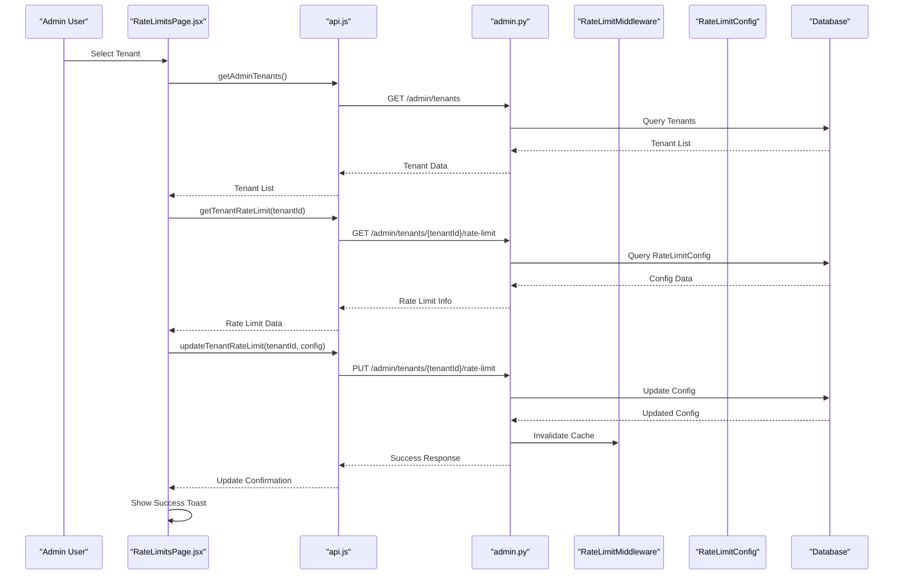
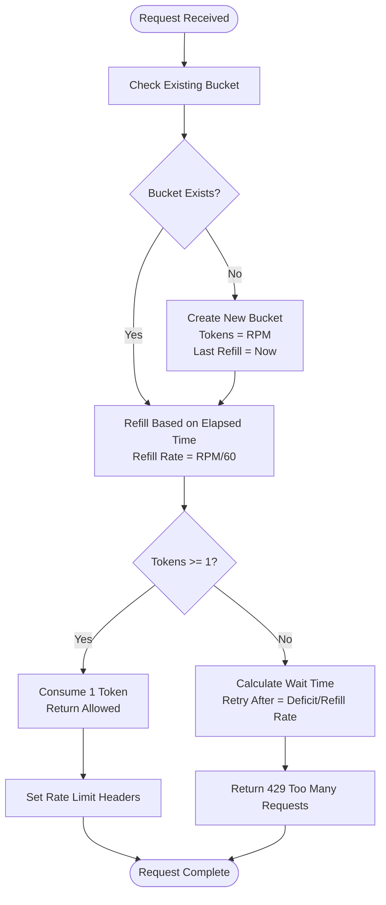
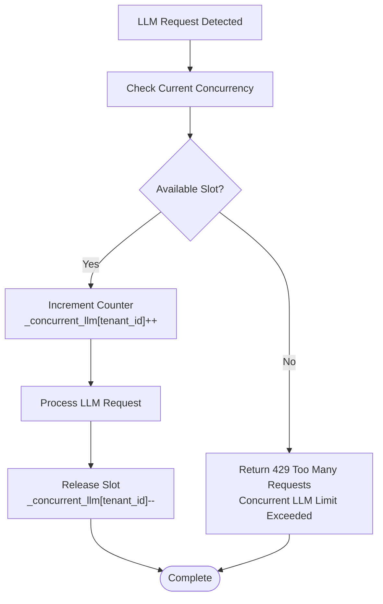
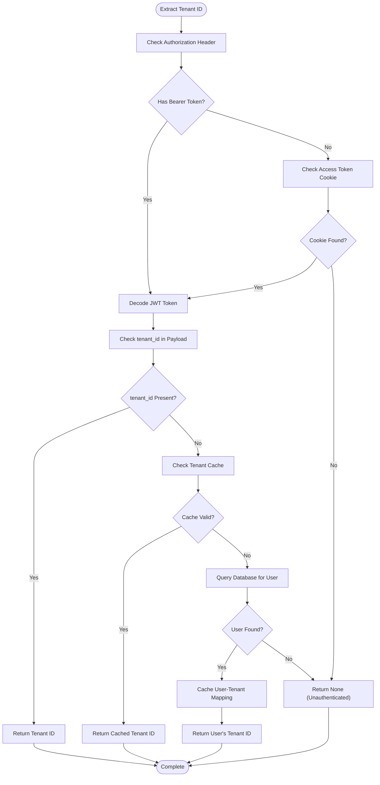
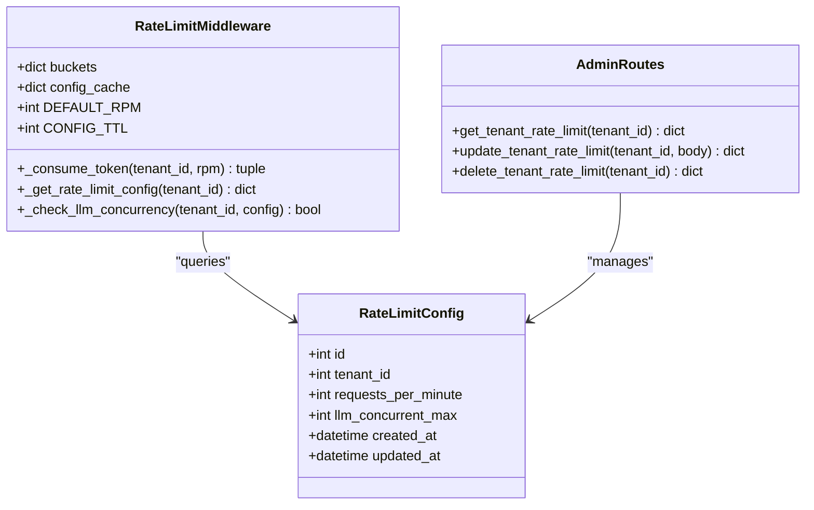
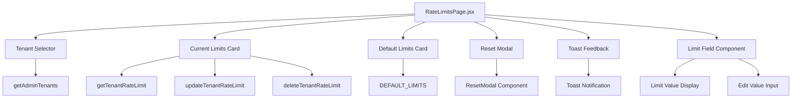
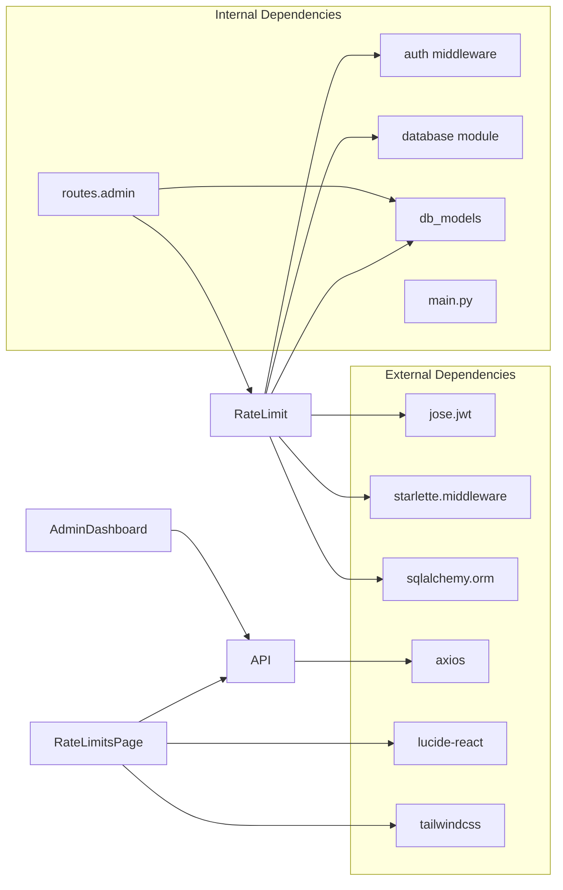

# Rate Limit Management

<cite>
**Referenced Files in This Document**
- [rate_limit.py](file://app/backend/middleware/rate_limit.py)
- [main.py](file://app/backend/main.py)
- [db_models.py](file://app/backend/models/db_models.py)
- [admin.py](file://app/backend/routes/admin.py)
- [test_rate_limiting.py](file://app/backend/tests/test_rate_limiting.py)
- [RateLimitsPage.jsx](file://app/frontend/src/pages/admin/RateLimitsPage.jsx)
- [api.js](file://app/frontend/src/lib/api.js)
- [AdminDashboardPage.jsx](file://app/frontend/src/pages/AdminDashboardPage.jsx)
</cite>

## Update Summary
**Changes Made**
- Updated frontend implementation section to reflect the sophisticated RateLimitsPage.jsx with comprehensive per-tenant rate limit editing capabilities
- Added detailed analysis of the new admin interface with plan defaults comparison and real-time configuration adjustments
- Enhanced backend API integration documentation with new rate limit management endpoints
- Updated architecture diagrams to show the complete admin interface workflow
- Added new section on frontend admin controls and user experience features
- Documented the new ResetModal component and toast notification system
- Added comprehensive comparison view between current and default limits

## Table of Contents
1. [Introduction](#introduction)
2. [Project Structure](#project-structure)
3. [Core Components](#core-components)
4. [Architecture Overview](#architecture-overview)
5. [Detailed Component Analysis](#detailed-component-analysis)
6. [Frontend Implementation](#frontend-implementation)
7. [Backend API Integration](#backend-api-integration)
8. [Dependency Analysis](#dependency-analysis)
9. [Performance Considerations](#performance-considerations)
10. [Troubleshooting Guide](#troubleshooting-guide)
11. [Conclusion](#conclusion)

## Introduction

Rate Limit Management is a critical system component in the Resume AI platform that provides per-tenant request throttling and LLM concurrency control. This system ensures fair resource allocation across multiple tenants while preventing abuse and maintaining system stability. The implementation uses an in-memory token bucket algorithm combined with database-backed configuration management.

The rate limiting system operates at two levels: traditional request rate limiting using token buckets and specialized LLM concurrency limiting to prevent system overload during AI processing operations. The system now features a comprehensive admin interface that allows platform administrators to manage rate limits with real-time configuration adjustments and plan defaults comparison.

**Updated** The RateLimitsPage.jsx has been transformed into a sophisticated per-tenant rate limit editing system with advanced features including real-time configuration editing, plan defaults comparison, and comprehensive user experience enhancements.

## Project Structure

The rate limiting system is distributed across several key components with enhanced frontend administration capabilities:

```mermaid
graph TB
subgraph "Frontend Admin Interface"
RLP[RateLimitsPage.jsx]
ADP[AdminDashboardPage.jsx]
API[api.js]
END[Rate Limit Endpoints]
RESET[ResetModal Component]
TOAST[Toast Component]
LIMITFIELD[LimitField Component]
END
subgraph "Middleware Layer"
RL[RateLimitMiddleware]
WH[Whitelist Handler]
TL[Token Limiter]
CL[Concurrency Limiter]
END
subgraph "Configuration Layer"
RC[RateLimitConfig Model]
AC[Admin Routes]
FC[Frontend Admin UI]
END
subgraph "Infrastructure"
DB[(Database)]
TM[Tenant Manager]
JWT[JWT Decoder]
END
RLP --> API
ADP --> END
API --> AC
RL --> WH
RL --> TL
RL --> CL
RL --> RC
AC --> RC
FC --> AC
RC --> DB
TL --> DB
CL --> DB
RL --> JWT
RL --> TM
```

**Diagram sources**
- [RateLimitsPage.jsx:126-440](file://app/frontend/src/pages/admin/RateLimitsPage.jsx#L126-L440)
- [admin.py:2631-2768](file://app/backend/routes/admin.py#L2631-L2768)
- [api.js:1433-1454](file://app/frontend/src/lib/api.js#L1433-L1454)

**Section sources**
- [rate_limit.py:1-244](file://app/backend/middleware/rate_limit.py#L1-L244)
- [main.py:391-394](file://app/backend/main.py#L391-L394)

## Core Components

### RateLimitMiddleware Class

The central component that implements the token bucket algorithm with per-tenant isolation:

**Key Features:**
- Token bucket rate limiting with configurable RPM (Requests Per Minute)
- Whitelist system for unauthenticated and public endpoints
- JWT-based tenant identification
- Database-backed configuration caching
- LLM-specific concurrency limiting

**Section sources**
- [rate_limit.py:26-243](file://app/backend/middleware/rate_limit.py#L26-L243)

### RateLimitConfig Model

Database model that stores per-tenant rate limiting configurations:

**Fields:**
- `requests_per_minute`: Primary rate limiting parameter (default: 60)
- `llm_concurrent_max`: Maximum concurrent LLM operations (default: 2)
- `tenant_id`: Foreign key linking to tenant
- Timestamps for creation and updates

**Section sources**
- [db_models.py:479-488](file://app/backend/models/db_models.py#L479-L488)

### Admin Configuration Interface

Provides platform administrators with tools to manage rate limits:

**Endpoints:**
- GET `/tenants/{tenant_id}/rate-limit` - Retrieve current configuration
- PUT `/tenants/{tenant_id}/rate-limit` - Update configuration
- DELETE `/tenants/{tenant_id}/rate-limit` - Reset to defaults
- GET `/rate-limits` - List all configurations

**Section sources**
- [admin.py:2631-2768](file://app/backend/routes/admin.py#L2631-L2768)

## Architecture Overview

The rate limiting system follows a layered architecture with clear separation of concerns and comprehensive admin interface:



**Diagram sources**
- [RateLimitsPage.jsx:144-220](file://app/frontend/src/pages/admin/RateLimitsPage.jsx#L144-L220)
- [api.js:1439-1454](file://app/frontend/src/lib/api.js#L1439-L1454)
- [admin.py:2631-2768](file://app/backend/routes/admin.py#L2631-L2768)

## Detailed Component Analysis

### Token Bucket Implementation

The token bucket algorithm provides smooth rate limiting with burst capacity:



**Diagram sources**
- [rate_limit.py:135-156](file://app/backend/middleware/rate_limit.py#L135-L156)

**Key Algorithm Details:**
- **Default Rate**: 60 requests per minute
- **Burst Capacity**: Equal to RPM (full bucket initially)
- **Refill Mechanism**: Linear refill based on elapsed time
- **Precision**: Tokens stored as floating-point for fractional consumption

**Section sources**
- [rate_limit.py:132-156](file://app/backend/middleware/rate_limit.py#L132-L156)

### LLM Concurrency Control

Specialized handling for AI-intensive operations:



**Diagram sources**
- [rate_limit.py:179-191](file://app/backend/middleware/rate_limit.py#L179-L191)

**Supported LLM Endpoints:**
- `/api/analyze`
- `/api/analyze/stream`
- `/api/analyze/batch`
- `/api/analyze/batch-chunked`
- `/api/analyze/batch-stream`
- `/api/analyze/suggest-weights`
- `/api/transcript/analyze`
- Dynamic path: `/api/analyze/{id}/rescore`

**Section sources**
- [rate_limit.py:158-191](file://app/backend/middleware/rate_limit.py#L158-L191)

### Tenant Identification System

Multi-layered approach to resolve tenant context:



**Diagram sources**
- [rate_limit.py:58-103](file://app/backend/middleware/rate_limit.py#L58-L103)

**Cache Strategy:**
- **Cache TTL**: 5 minutes
- **Cache Type**: In-memory dictionary `_tenant_cache`
- **Fallback**: Database query for user resolution

**Section sources**
- [rate_limit.py:19-20](file://app/backend/middleware/rate_limit.py#L19-L20)
- [rate_limit.py:58-103](file://app/backend/middleware/rate_limit.py#L58-L103)

### Configuration Management

Centralized configuration system with caching:



**Diagram sources**
- [rate_limit.py:26-48](file://app/backend/middleware/rate_limit.py#L26-L48)
- [db_models.py:479-488](file://app/backend/models/db_models.py#L479-L488)
- [admin.py:2631-2768](file://app/backend/routes/admin.py#L2631-L2768)

**Configuration Caching:**
- **Cache TTL**: 60 seconds
- **Cache Type**: Dictionary with timestamp validation
- **Invalidation**: Manual invalidation on configuration changes

**Section sources**
- [rate_limit.py:105-130](file://app/backend/middleware/rate_limit.py#L105-L130)
- [admin.py:2712-2715](file://app/backend/routes/admin.py#L2712-L2715)

## Frontend Implementation

### RateLimitsPage.jsx - Sophisticated Admin Interface

**Updated** The RateLimitsPage.jsx has been transformed into a comprehensive per-tenant rate limit editing system with advanced real-time configuration capabilities and plan defaults comparison.

The RateLimitsPage.jsx provides a sophisticated admin interface for per-tenant rate limit management with the following key features:

**Enhanced Tenant Management:**
- **Tenant Selection**: Dropdown with 200+ tenant options with pagination support
- **Real-time Editing**: Direct inline editing of rate limits with immediate validation
- **Plan Defaults Comparison**: Side-by-side comparison with plan defaults
- **Visual Feedback**: Comprehensive toast notifications and loading states
- **Reset Functionality**: Secure reset to plan defaults with confirmation modal
- **Audit Trail**: Last updated timestamps and configuration history

**Advanced Component Architecture:**



**Diagram sources**
- [RateLimitsPage.jsx:126-440](file://app/frontend/src/pages/admin/RateLimitsPage.jsx#L126-L440)

**Real-time Configuration Features:**
- **Requests per Minute**: Editable numeric field with validation (min: 1)
- **LLM Concurrency Limit**: Editable numeric field with validation (min: 1)
- **Status Indicators**: Visual distinction between custom and default configurations
- **Comparison View**: Real-time comparison with plan defaults
- **Inline Editing**: Direct field modification with immediate feedback

**Enhanced User Experience:**
- **Loading States**: Skeleton loaders for smooth user experience
- **Error Handling**: Comprehensive error messages with retry functionality
- **Success Feedback**: Toast notifications for all actions
- **Confirmation Modals**: Safe reset operations with user confirmation
- **Responsive Design**: Mobile-friendly interface with Tailwind CSS

**Section sources**
- [RateLimitsPage.jsx:126-440](file://app/frontend/src/pages/admin/RateLimitsPage.jsx#L126-L440)

### ResetModal Component

**New** A dedicated modal component for secure rate limit reset operations:

**Features:**
- **Confirmation Dialog**: Prevents accidental resets
- **Visual Warning**: Amber color scheme for danger state
- **Tenant Context**: Displays tenant name for confirmation
- **Error Handling**: Comprehensive error messaging
- **Loading States**: Disabled button during reset operation

**Section sources**
- [RateLimitsPage.jsx:69-123](file://app/frontend/src/pages/admin/RateLimitsPage.jsx#L69-L123)

### Toast Notification System

**New** A comprehensive toast notification system for user feedback:

**Features:**
- **Automatic Dismissal**: 3.5 second timeout
- **Color-coded Messages**: Green for success, red for errors
- **Type Safety**: Success/error type differentiation
- **Cleanup**: Proper timeout cleanup

**Section sources**
- [RateLimitsPage.jsx:27-40](file://app/frontend/src/pages/admin/RateLimitsPage.jsx#L27-L40)

### LimitField Component

**New** A reusable component for displaying and editing rate limit values:

**Features:**
- **Conditional Rendering**: Edit mode vs display mode
- **Input Validation**: Minimum value enforcement
- **Unit Display**: Automatic unit labeling
- **Styling**: Consistent design system integration

**Section sources**
- [RateLimitsPage.jsx:43-66](file://app/frontend/src/pages/admin/RateLimitsPage.jsx#L43-L66)

### AdminDashboardPage.jsx - Rate Limits Tab

The AdminDashboardPage.jsx includes a dedicated tab for bulk rate limit management:

**Features:**
- **Search Functionality**: Filter tenants by name or slug
- **Pagination Support**: Navigate through large tenant lists
- **Bulk Operations**: Manage rate limits across multiple tenants
- **Audit Logging**: Track all rate limit changes

**Section sources**
- [AdminDashboardPage.jsx:863-883](file://app/frontend/src/pages/AdminDashboardPage.jsx#L863-L883)
- [AdminDashboardPage.jsx:1539-1681](file://app/frontend/src/pages/AdminDashboardPage.jsx#L1539-L1681)

## Backend API Integration

### Frontend API Functions

**Updated** The frontend integrates with comprehensive backend endpoints for rate limit management:

**API Functions:**
- `getAdminTenants(params)`: Fetch tenant list with pagination
- `getTenantRateLimit(tenantId)`: Get current rate limit configuration
- `updateTenantRateLimit(tenantId, data)`: Update rate limit configuration
- `deleteTenantRateLimit(tenantId)`: Reset to plan defaults

**Enhanced Implementation Details:**
- **Error Handling**: Comprehensive error handling with user-friendly messages
- **Authentication**: Automatic CSRF token injection for state-changing requests
- **Retry Logic**: Automatic retry for transient network errors
- **Loading States**: Proper loading indicators during API calls
- **Audit Logging**: Full audit trail for all configuration changes

**Section sources**
- [api.js:1433-1454](file://app/frontend/src/lib/api.js#L1433-L1454)

### Backend Route Endpoints

**Updated** The backend provides RESTful endpoints for comprehensive rate limit management:

**Endpoints:**
- `GET /admin/tenants/{tenant_id}/rate-limit`: Retrieve tenant rate limit
- `PUT /admin/tenants/{tenant_id}/rate-limit`: Update tenant rate limit
- `DELETE /admin/tenants/{tenant_id}/rate-limit`: Reset to defaults
- `GET /admin/rate-limits`: List all rate limit configurations

**Enhanced Validation and Security:**
- Input validation for minimum values (>= 1)
- Platform admin authentication required
- Audit logging for all configuration changes
- Cache invalidation on updates
- Comprehensive error responses

**Section sources**
- [admin.py:2631-2768](file://app/backend/routes/admin.py#L2631-L2768)

## Dependency Analysis

The rate limiting system has minimal external dependencies but integrates with several core systems:



**Diagram sources**
- [rate_limit.py:8-15](file://app/backend/middleware/rate_limit.py#L8-L15)
- [main.py:61-61](file://app/backend/main.py#L61-L61)
- [RateLimitsPage.jsx:1-18](file://app/frontend/src/pages/admin/RateLimitsPage.jsx#L1-L18)

**Key Dependencies:**
- **JWT Library**: Token decoding and validation
- **Starlette**: Base middleware framework
- **SQLAlchemy**: Database ORM operations
- **Axios**: HTTP client for frontend-backend communication
- **Lucide React**: Icon library for UI components
- **Tailwind CSS**: Styling framework

**Section sources**
- [rate_limit.py:8-15](file://app/backend/middleware/rate_limit.py#L8-L15)
- [main.py:61-61](file://app/backend/main.py#L61-L61)

## Performance Considerations

### Memory Usage Patterns

The system maintains in-memory state that scales linearly with tenant count:

- **Token Buckets**: ~24 bytes per tenant (dictionary with float values)
- **Config Cache**: ~40 bytes per tenant (dictionary with integer and float)
- **Tenant Cache**: ~16 bytes per user (integer and float)
- **Concurrency Counters**: ~8 bytes per tenant (integer)

### Frontend Performance Optimizations

**React Optimizations:**
- **useCallback**: Memoized API calls to prevent unnecessary re-renders
- **useState**: Efficient state management for form inputs
- **useEffect**: Proper cleanup and dependency management
- **Skeleton Loading**: Smooth loading states during data fetching

**API Performance:**
- **Pagination**: Up to 200 tenants per page for efficient loading
- **Caching**: Local state caching for tenant selections
- **Debouncing**: Input debouncing for search functionality

### Concurrency Handling

Thread-safe operations using locks:
- **Bucket Lock**: Protects token bucket modifications
- **Config Cache Lock**: Ensures atomic cache updates
- **Tenant Cache Lock**: Prevents race conditions in tenant resolution

### Scalability Limitations

**Current Architecture:**
- **Single Process**: In-memory state not shared across processes
- **No Persistence**: Configuration changes lost on restart
- **Limited Monitoring**: Basic rate limit headers only

**Recommended Improvements:**
- Redis-based persistence for state sharing
- Centralized configuration storage
- Enhanced metrics collection
- Distributed locking mechanisms

## Troubleshooting Guide

### Common Issues and Solutions

**Issue: Requests Still Being Rate Limited After Configuration Changes**

**Symptoms:** Updated rate limits not taking effect immediately

**Root Cause:** Configuration cache TTL (60 seconds)

**Solution:** Wait for cache expiration or manually invalidate cache

**Section sources**
- [rate_limit.py:129-130](file://app/backend/middleware/rate_limit.py#L129-L130)

**Issue: 429 Errors During LLM Operations**

**Symptoms:** Concurrent LLM requests failing with 429 status

**Root Cause:** LLM concurrency limit exceeded

**Solution:** Increase `llm_concurrent_max` in rate limit configuration

**Section sources**
- [rate_limit.py:179-191](file://app/backend/middleware/rate_limit.py#L179-L191)

**Issue: Unauthenticated Requests Not Rate Limited**

**Symptoms:** Anonymous requests bypassing rate limits

**Root Cause:** Missing Authorization header or invalid token

**Solution:** Ensure proper authentication headers are included

**Section sources**
- [rate_limit.py:67-76](file://app/backend/middleware/rate_limit.py#L67-L76)

**Issue: Rate Limits Page Not Loading Tenants**

**Symptoms:** Empty tenant dropdown or loading spinner stuck

**Root Cause:** API connectivity issues or authentication problems

**Solution:** Check network connectivity, verify admin permissions, retry operation

**Section sources**
- [RateLimitsPage.jsx:144-160](file://app/frontend/src/pages/admin/RateLimitsPage.jsx#L144-L160)

**Issue: Toast Notifications Not Appearing**

**Symptoms:** No feedback after save/reset operations

**Root Cause:** Toast state not being managed properly

**Solution:** Check toast state management and useEffect cleanup

**Section sources**
- [RateLimitsPage.jsx:196-208](file://app/frontend/src/pages/admin/RateLimitsPage.jsx#L196-L208)

### Testing and Validation

The system includes comprehensive test coverage:

**Test Coverage Areas:**
- Whitelisted paths bypass rate limiting
- Normal requests under configured limits succeed
- Rate limit exhaustion returns 429 status
- Retry-After header presence verified
- Unauthenticated requests pass through

**Section sources**
- [test_rate_limiting.py:17-85](file://app/backend/tests/test_rate_limiting.py#L17-L85)

## Conclusion

The Rate Limit Management system provides robust, per-tenant request throttling with specialized LLM concurrency control and comprehensive admin interface capabilities. The implementation balances simplicity with effectiveness, using proven algorithms (token bucket) and clear separation of concerns.

**Enhanced Frontend Capabilities:**
- **Real-time Configuration**: Direct editing with immediate feedback
- **Plan Defaults Comparison**: Visual comparison with baseline limits
- **Comprehensive Admin Tools**: Dedicated interface for tenant management
- **User Experience**: Intuitive interface with loading states and error handling
- **Advanced Components**: Reusable components for consistent UX
- **Toast Notifications**: Immediate feedback for all user actions
- **Reset Confirmation**: Secure operations with user confirmation

**Backend Strengths:**
- Clear per-tenant isolation
- Efficient token bucket algorithm
- Comprehensive whitelisting
- Database-backed configuration
- Admin-friendly management interface
- Audit logging for all changes

**Areas for Enhancement:**
- Distributed state persistence
- Enhanced monitoring and metrics
- Dynamic configuration reloading
- More granular endpoint-level controls
- Advanced analytics and reporting

The system successfully prevents abuse while maintaining good user experience through burst capacity and reasonable default limits. The modular design allows for easy extension and customization as the platform evolves, with the new RateLimitsPage.jsx providing a comprehensive solution for per-tenant rate limit management with real-time configuration adjustments and plan defaults comparison.

**Updated** The sophisticated RateLimitsPage.jsx transforms the rate limit management experience from basic configuration to an advanced, real-time editing interface with comprehensive comparison capabilities and user-friendly administrative tools.