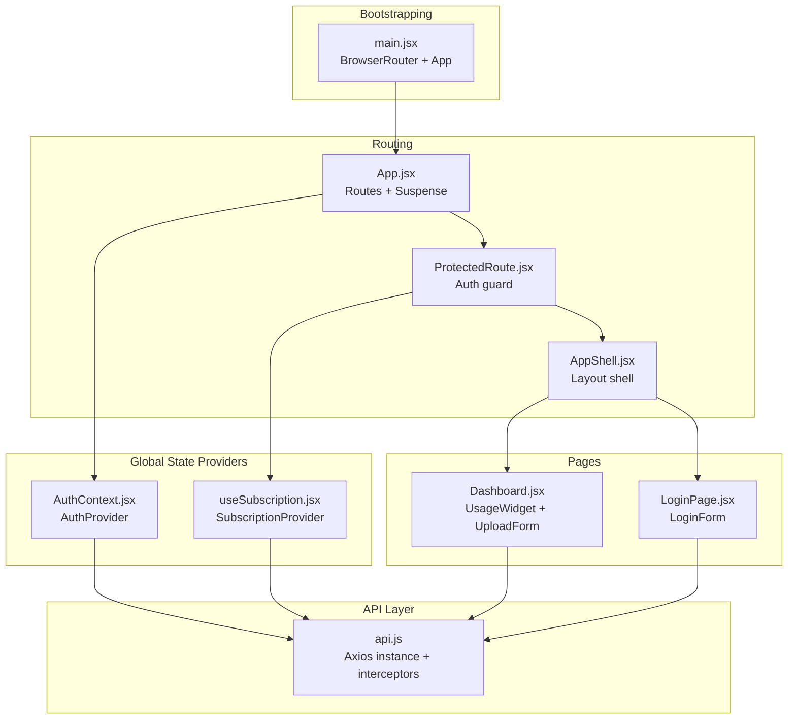
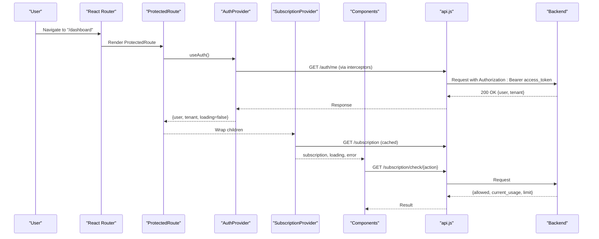
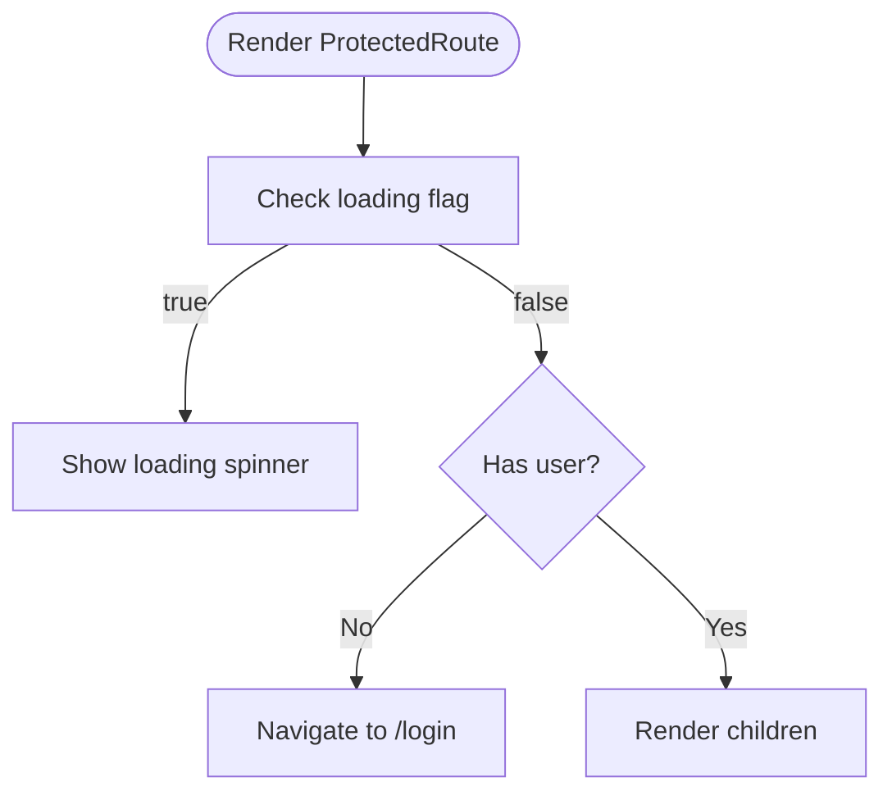
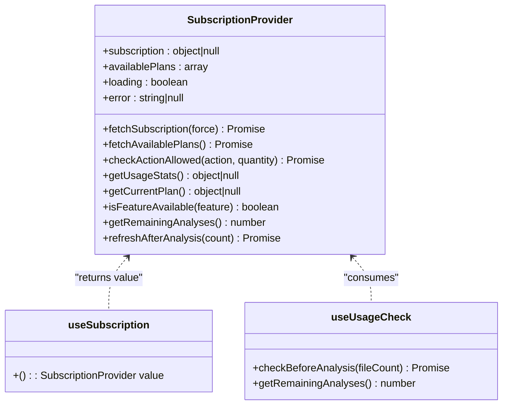
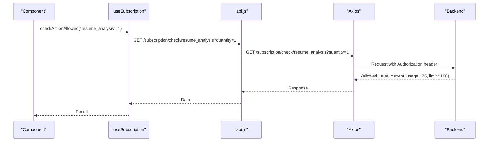
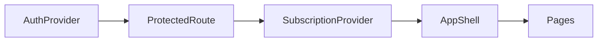
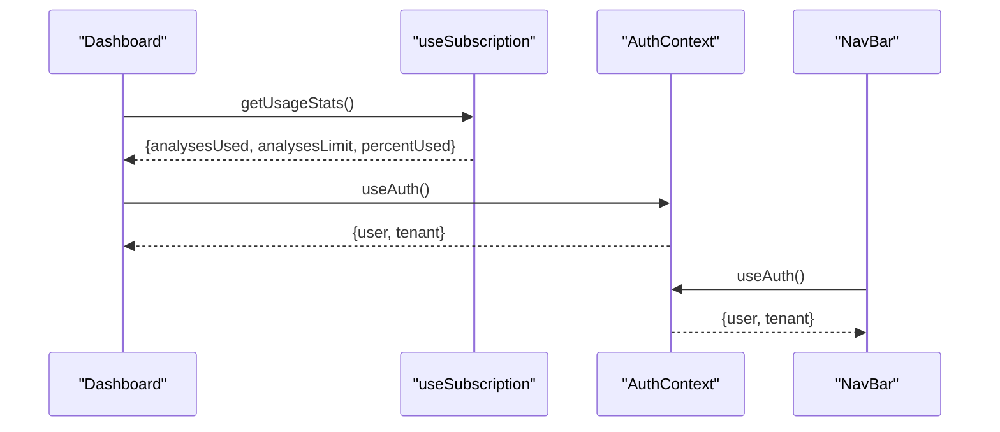
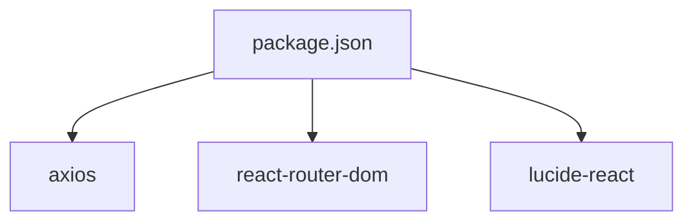

# State Management

<cite>
**Referenced Files in This Document**
- [AuthContext.jsx](file://app/frontend/src/contexts/AuthContext.jsx)
- [useSubscription.jsx](file://app/frontend/src/hooks/useSubscription.jsx)
- [api.js](file://app/frontend/src/lib/api.js)
- [App.jsx](file://app/frontend/src/App.jsx)
- [main.jsx](file://app/frontend/src/main.jsx)
- [ProtectedRoute.jsx](file://app/frontend/src/components/ProtectedRoute.jsx)
- [NavBar.jsx](file://app/frontend/src/components/NavBar.jsx)
- [Dashboard.jsx](file://app/frontend/src/pages/Dashboard.jsx)
- [LoginPage.jsx](file://app/frontend/src/pages/LoginPage.jsx)
- [AppShell.jsx](file://app/frontend/src/components/AppShell.jsx)
- [useSubscription.test.jsx](file://app/frontend/src/hooks/__tests__/useSubscription.test.jsx)
- [api.test.js](file://app/frontend/src/__tests__/api.test.js)
- [package.json](file://app/frontend/package.json)
</cite>

## Table of Contents
1. [Introduction](#introduction)
2. [Project Structure](#project-structure)
3. [Core Components](#core-components)
4. [Architecture Overview](#architecture-overview)
5. [Detailed Component Analysis](#detailed-component-analysis)
6. [Dependency Analysis](#dependency-analysis)
7. [Performance Considerations](#performance-considerations)
8. [Troubleshooting Guide](#troubleshooting-guide)
9. [Conclusion](#conclusion)
10. [Appendices](#appendices)

## Introduction
This document explains the frontend state management architecture for Resume AI. It focuses on:
- Authentication context pattern using AuthContext for user sessions, JWT token handling, and protected route access
- Subscription management hook useSubscription for usage limits, billing status, feature access control, and optimistic updates
- Centralized API client library api.js for HTTP requests, automatic token injection, refresh logic, and response transformations
- Provider composition patterns, state update mechanisms, and data persistence strategies
- Synchronization between components, loading/error states, integration with React hooks, performance optimizations, and memory leak prevention
- Guidelines for extending state management with new contexts and custom hooks

## Project Structure
The frontend is a React application bootstrapped with Vite and uses React Router for navigation. Providers wrap the routing tree to supply global state to components.



**Diagram sources**
- [main.jsx:1-14](file://app/frontend/src/main.jsx#L1-L14)
- [App.jsx:1-64](file://app/frontend/src/App.jsx#L1-L64)
- [ProtectedRoute.jsx:1-24](file://app/frontend/src/components/ProtectedRoute.jsx#L1-L24)
- [AppShell.jsx:1-13](file://app/frontend/src/components/AppShell.jsx#L1-L13)
- [AuthContext.jsx:1-70](file://app/frontend/src/contexts/AuthContext.jsx#L1-L70)
- [useSubscription.jsx:1-186](file://app/frontend/src/hooks/useSubscription.jsx#L1-L186)
- [Dashboard.jsx:1-330](file://app/frontend/src/pages/Dashboard.jsx#L1-L330)
- [LoginPage.jsx:1-121](file://app/frontend/src/pages/LoginPage.jsx#L1-L121)
- [api.js:1-395](file://app/frontend/src/lib/api.js#L1-L395)

**Section sources**
- [main.jsx:1-14](file://app/frontend/src/main.jsx#L1-L14)
- [App.jsx:1-64](file://app/frontend/src/App.jsx#L1-L64)

## Core Components
- AuthContext: Manages user, tenant, and loading state; persists tokens in localStorage; exposes login, register, and logout actions; auto-fetches user on app load.
- useSubscription: Centralizes subscription and usage state; caches subscription data; provides feature checks, usage stats, and optimistic refresh after analysis.
- api.js: Axios instance with request/response interceptors for JWT injection and automatic token refresh; exports typed functions for all backend endpoints.

Key behaviors:
- Token persistence: access_token and refresh_token stored in localStorage; AuthContext clears both on failures.
- Automatic token refresh: api.js interceptors detect 401 and attempt refresh using refresh_token.
- Protected routes: ProtectedRoute enforces authentication and shows a loader while AuthContext resolves initial state.
- Optimistic updates: useSubscription updates usage immediately upon analysis and later syncs with server.

**Section sources**
- [AuthContext.jsx:1-70](file://app/frontend/src/contexts/AuthContext.jsx#L1-L70)
- [useSubscription.jsx:1-186](file://app/frontend/src/hooks/useSubscription.jsx#L1-L186)
- [api.js:1-43](file://app/frontend/src/lib/api.js#L1-L43)

## Architecture Overview
The state management follows a layered pattern:
- Providers supply global state to the routing tree
- Components consume hooks to access and mutate state
- API client encapsulates HTTP concerns and token lifecycle
- Interceptors handle cross-cutting concerns like auth and retries



**Diagram sources**
- [ProtectedRoute.jsx:1-24](file://app/frontend/src/components/ProtectedRoute.jsx#L1-L24)
- [AuthContext.jsx:11-31](file://app/frontend/src/contexts/AuthContext.jsx#L11-L31)
- [api.js:9-43](file://app/frontend/src/lib/api.js#L9-L43)
- [useSubscription.jsx:13-33](file://app/frontend/src/hooks/useSubscription.jsx#L13-L33)

## Detailed Component Analysis

### Authentication Context Pattern (AuthContext)
AuthContext manages:
- user: logged-in user profile
- tenant: tenant metadata
- loading: initialization state during token validation
- login, register, logout: actions that persist tokens and update state

Implementation highlights:
- Token retrieval on mount and API calls to /auth/me
- On failure, removes tokens and resets state
- Exposes useAuth hook with runtime guard to prevent misuse outside provider

```mermaid
classDiagram
class AuthProvider {
+user : object|null
+tenant : object|null
+loading : boolean
+login(email, password) Promise
+register(companyName, email, password) Promise
+logout() void
+loadUser() Promise
}
class useAuth {
+() : {user, tenant, loading, login, register, logout}
}
AuthProvider <.. useAuth : "returns value"
```

**Diagram sources**
- [AuthContext.jsx:6-63](file://app/frontend/src/contexts/AuthContext.jsx#L6-L63)

**Section sources**
- [AuthContext.jsx:1-70](file://app/frontend/src/contexts/AuthContext.jsx#L1-L70)

### Protected Route Access Control
ProtectedRoute:
- Reads user and loading from AuthContext
- Shows a loading spinner while resolving
- Redirects unauthenticated users to /login



**Diagram sources**
- [ProtectedRoute.jsx:4-23](file://app/frontend/src/components/ProtectedRoute.jsx#L4-L23)

**Section sources**
- [ProtectedRoute.jsx:1-24](file://app/frontend/src/components/ProtectedRoute.jsx#L1-L24)

### Subscription Management Hook (useSubscription)
useSubscription centralizes:
- subscription: current plan and usage
- availablePlans: plan catalog
- loading, error: state for async operations
- caching: 30-second cache for subscription data
- feature checks: isFeatureAvailable
- usage helpers: getUsageStats, getRemainingAnalyses
- optimistic refresh: refreshAfterAnalysis
- usage pre-check: useUsageCheck



**Diagram sources**
- [useSubscription.jsx:6-150](file://app/frontend/src/hooks/useSubscription.jsx#L6-L150)

**Section sources**
- [useSubscription.jsx:1-186](file://app/frontend/src/hooks/useSubscription.jsx#L1-L186)

### API Client Library (api.js)
api.js:
- Creates Axios instance with base URL from environment
- Request interceptor attaches Authorization: Bearer access_token
- Response interceptor handles 401 by refreshing token via refresh_token
- Provides typed functions for all backend endpoints
- Supports streaming analysis via fetch for SSE



**Diagram sources**
- [useSubscription.jsx:46-55](file://app/frontend/src/hooks/useSubscription.jsx#L46-L55)
- [api.js:362-375](file://app/frontend/src/lib/api.js#L362-L375)

**Section sources**
- [api.js:1-395](file://app/frontend/src/lib/api.js#L1-L395)

### Provider Composition Patterns
App.jsx composes providers around routes:
- AuthProvider wraps the entire app
- ProtectedRoute wraps pages that require authentication
- SubscriptionProvider wraps the layout shell



**Diagram sources**
- [App.jsx:29-37](file://app/frontend/src/App.jsx#L29-L37)
- [App.jsx:39-61](file://app/frontend/src/App.jsx#L39-L61)

**Section sources**
- [App.jsx:1-64](file://app/frontend/src/App.jsx#L1-L64)

### State Update Mechanisms and Data Persistence
- AuthContext persists tokens in localStorage and clears them on logout or auth failure.
- useSubscription caches subscription data for 30 seconds and exposes force refresh.
- Optimistic updates: refreshAfterAnalysis updates local usage immediately, then refetches after a delay.
- Loading and error states are managed per hook/provider to avoid blocking UI.

**Section sources**
- [AuthContext.jsx:51-56](file://app/frontend/src/contexts/AuthContext.jsx#L51-L56)
- [useSubscription.jsx:13-33](file://app/frontend/src/hooks/useSubscription.jsx#L13-L33)
- [useSubscription.jsx:109-128](file://app/frontend/src/hooks/useSubscription.jsx#L109-L128)

### State Synchronization Between Components
- Dashboard consumes useSubscription to display usage and reacts to optimistic updates.
- NavBar reads user and tenant from AuthContext to render user menu and tenant badge.
- ProtectedRoute ensures only authenticated users reach protected pages.



**Diagram sources**
- [Dashboard.jsx:163-200](file://app/frontend/src/pages/Dashboard.jsx#L163-L200)
- [Dashboard.jsx:204-330](file://app/frontend/src/pages/Dashboard.jsx#L204-L330)
- [NavBar.jsx:17-18](file://app/frontend/src/components/NavBar.jsx#L17-L18)

**Section sources**
- [Dashboard.jsx:1-330](file://app/frontend/src/pages/Dashboard.jsx#L1-L330)
- [NavBar.jsx:1-117](file://app/frontend/src/components/NavBar.jsx#L1-L117)

### Loading State Management and Error Handling
- AuthContext sets loading during initial token validation; ProtectedRoute renders a spinner until loading is false.
- useSubscription manages loading and error states for subscription and plan fetching; provides graceful fallbacks.
- api.js handles 401 by refreshing tokens; on failure, clears tokens and navigates to /login.

**Section sources**
- [ProtectedRoute.jsx:7-16](file://app/frontend/src/components/ProtectedRoute.jsx#L7-L16)
- [useSubscription.jsx:13-33](file://app/frontend/src/hooks/useSubscription.jsx#L13-L33)
- [api.js:19-43](file://app/frontend/src/lib/api.js#L19-L43)

### Integration with React Hooks Patterns
- Custom hooks encapsulate stateful logic: useAuth, useSubscription, useUsageCheck.
- useCallback is used to memoize callbacks and reduce re-renders.
- useEffect initializes data fetching on mount and performs cleanup implicitly via React’s lifecycle.

**Section sources**
- [AuthContext.jsx:11-31](file://app/frontend/src/contexts/AuthContext.jsx#L11-L31)
- [useSubscription.jsx:103-106](file://app/frontend/src/hooks/useSubscription.jsx#L103-L106)

### Performance Optimization Techniques
- Caching: useSubscription caches subscription for 30 seconds to minimize network calls.
- Optimistic UI: Immediate usage updates improve perceived responsiveness; server sync follows shortly after.
- Memoization: useCallback prevents unnecessary prop changes and re-renders.
- Lazy loading: Routes are lazy-loaded with Suspense for faster initial load.

**Section sources**
- [useSubscription.jsx:13-33](file://app/frontend/src/hooks/useSubscription.jsx#L13-L33)
- [useSubscription.jsx:109-128](file://app/frontend/src/hooks/useSubscription.jsx#L109-L128)
- [App.jsx:21-27](file://app/frontend/src/App.jsx#L21-L27)

### Memory Leak Prevention
- No explicit subscriptions to external events are held in AuthContext or useSubscription; cleanup is implicit.
- Components rely on React’s built-in cleanup for effects and event handlers.
- API client uses Axios interceptors; no manual listener registration requires cleanup here.

[No sources needed since this section provides general guidance]

## Dependency Analysis
External dependencies relevant to state management:
- axios: HTTP client with interceptors for auth and refresh
- react-router-dom: Routing and navigation
- lucide-react: Icons used in UI components



**Diagram sources**
- [package.json:14-22](file://app/frontend/package.json#L14-L22)

**Section sources**
- [package.json:1-41](file://app/frontend/package.json#L1-L41)

## Performance Considerations
- Prefer cached subscription data for frequent reads; use force refresh sparingly.
- Use optimistic updates for immediate feedback; schedule server sync with a small delay to avoid thrashing.
- Keep hooks pure and memoized; avoid heavy computations inside render.
- Use lazy loading and Suspense to defer expensive components.

[No sources needed since this section provides general guidance]

## Troubleshooting Guide
Common issues and resolutions:
- Authentication loop after refresh: Verify that api.js interceptors are attaching Authorization headers and that refresh_token is present in localStorage.
- Protected route stuck on loading: Ensure AuthContext completes loadUser on mount and that ProtectedRoute receives user state.
- Usage checks failing: useSubscription implements fail-closed behavior; confirm server-side check endpoint availability and network connectivity.
- Export/download not triggering: Confirm blob handling and anchor element creation in api.js export functions.

**Section sources**
- [api.js:9-43](file://app/frontend/src/lib/api.js#L9-L43)
- [ProtectedRoute.jsx:7-16](file://app/frontend/src/components/ProtectedRoute.jsx#L7-L16)
- [useSubscription.jsx:46-55](file://app/frontend/src/hooks/useSubscription.jsx#L46-L55)
- [api.test.js:74-127](file://app/frontend/src/__tests__/api.test.js#L74-L127)

## Conclusion
Resume AI’s frontend employs a clean separation of concerns:
- AuthContext manages user and token lifecycle
- useSubscription centralizes billing and usage logic with caching and optimistic updates
- api.js encapsulates HTTP concerns with interceptors for robust auth and error handling
- Provider composition ensures predictable state access across the app

This design enables scalable extension with new contexts and hooks while maintaining performance and reliability.

## Appendices

### Extending State Management with New Contexts and Custom Hooks
Guidelines:
- Encapsulate domain-specific state in dedicated contexts (e.g., BillingContext, TeamContext).
- Expose a Provider component and a corresponding hook that throws if used outside the provider.
- Use useCallback for callbacks and useMemo for derived data to optimize re-renders.
- Implement caching and optimistic updates for interactive features.
- Add comprehensive tests mirroring existing patterns (see useSubscription and api tests).

**Section sources**
- [useSubscription.test.jsx:83-115](file://app/frontend/src/hooks/__tests__/useSubscription.test.jsx#L83-L115)
- [api.test.js:68-264](file://app/frontend/src/__tests__/api.test.js#L68-L264)