# Styling and Theming

<cite>
**Referenced Files in This Document**
- [tailwind.config.js](file://app/frontend/tailwind.config.js)
- [postcss.config.js](file://app/frontend/postcss.config.js)
- [index.css](file://app/frontend/src/index.css)
- [package.json](file://app/frontend/package.json)
- [vite.config.js](file://app/frontend/vite.config.js)
- [App.jsx](file://app/frontend/src/App.jsx)
- [AppShell.jsx](file://app/frontend/src/components/AppShell.jsx)
- [NavBar.jsx](file://app/frontend/src/components/NavBar.jsx)
- [UploadForm.jsx](file://app/frontend/src/components/UploadForm.jsx)
- [Dashboard.jsx](file://app/frontend/src/pages/Dashboard.jsx)
- [ResultCard.jsx](file://app/frontend/src/components/ResultCard.jsx)
- [SkillsRadar.jsx](file://app/frontend/src/components/SkillsRadar.jsx)
- [ScoreGauge.jsx](file://app/frontend/src/components/ScoreGauge.jsx)
- [Timeline.jsx](file://app/frontend/src/components/Timeline.jsx)
- [LoginPage.jsx](file://app/frontend/src/pages/LoginPage.jsx)
</cite>

## Table of Contents
1. [Introduction](#introduction)
2. [Project Structure](#project-structure)
3. [Core Components](#core-components)
4. [Architecture Overview](#architecture-overview)
5. [Detailed Component Analysis](#detailed-component-analysis)
6. [Dependency Analysis](#dependency-analysis)
7. [Performance Considerations](#performance-considerations)
8. [Troubleshooting Guide](#troubleshooting-guide)
9. [Conclusion](#conclusion)
10. [Appendices](#appendices)

## Introduction
This document describes the frontend design system for Resume AI’s React application, focusing on TailwindCSS configuration, PostCSS processing, global styles, component styling patterns, animations, and build integration. It also outlines theme customization, dark mode readiness, accessibility considerations, and guidelines for extending the design system consistently.

## Project Structure
The frontend is organized around a utility-first TailwindCSS approach with a small set of global styles and component-specific Tailwind classes. Build and processing are handled via Vite and PostCSS with Tailwind and Autoprefixer plugins.

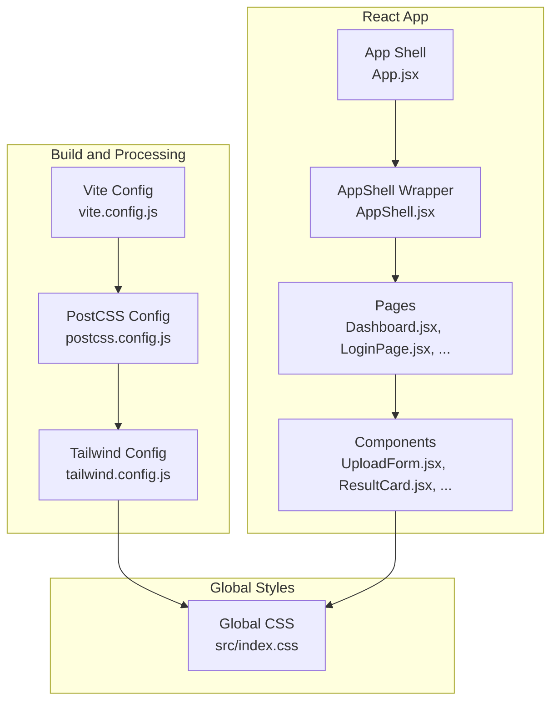

**Diagram sources**
- [vite.config.js:1-26](file://app/frontend/vite.config.js#L1-L26)
- [postcss.config.js:1-7](file://app/frontend/postcss.config.js#L1-L7)
- [tailwind.config.js:1-67](file://app/frontend/tailwind.config.js#L1-L67)
- [index.css:1-161](file://app/frontend/src/index.css#L1-L161)
- [App.jsx:1-64](file://app/frontend/src/App.jsx#L1-L64)
- [AppShell.jsx:1-13](file://app/frontend/src/components/AppShell.jsx#L1-L13)
- [Dashboard.jsx:1-330](file://app/frontend/src/pages/Dashboard.jsx#L1-L330)
- [UploadForm.jsx:1-484](file://app/frontend/src/components/UploadForm.jsx#L1-L484)
- [ResultCard.jsx:1-627](file://app/frontend/src/components/ResultCard.jsx#L1-L627)

**Section sources**
- [vite.config.js:1-26](file://app/frontend/vite.config.js#L1-L26)
- [postcss.config.js:1-7](file://app/frontend/postcss.config.js#L1-L7)
- [tailwind.config.js:1-67](file://app/frontend/tailwind.config.js#L1-L67)
- [index.css:1-161](file://app/frontend/src/index.css#L1-L161)
- [App.jsx:1-64](file://app/frontend/src/App.jsx#L1-L64)

## Core Components
- TailwindCSS configuration extends colors, fonts, shadows, gradients, animations, and keyframes. It introduces brand and surface palettes, Inter as the primary font, brand-specific shadows, gradient backgrounds, and reusable animations.
- Global CSS defines base styles, root font family, scrollbar styling, background orbs, and component-level utilities such as branded buttons, gradient text, and print/PDF overrides.
- PostCSS pipeline enables Tailwind directives and autoprefixing for cross-browser compatibility.
- Vite config integrates React plugin and sets dev/proxy/build options.

Key configuration highlights:
- Colors: brand palette (50–900), surface, and slate palette.
- Typography: Inter font stack.
- Shadows: brand-sm, brand, brand-lg, brand-xl.
- Gradients: gradient-brand.
- Animations: shimmer, fade-up, spin-slow.
- Keyframes: shimmer, fadeInUp.

**Section sources**
- [tailwind.config.js:1-67](file://app/frontend/tailwind.config.js#L1-L67)
- [index.css:1-161](file://app/frontend/src/index.css#L1-L161)
- [postcss.config.js:1-7](file://app/frontend/postcss.config.js#L1-L7)
- [package.json:1-41](file://app/frontend/package.json#L1-L41)
- [vite.config.js:1-26](file://app/frontend/vite.config.js#L1-L26)

## Architecture Overview
The styling architecture follows a strict utility-first pattern:
- Global base styles and utilities are defined in index.css.
- Tailwind utilities are applied directly in JSX components.
- Animations and transitions are driven by Tailwind utilities and custom keyframes.
- Dark mode is not explicitly configured; the current theme is light-focused.

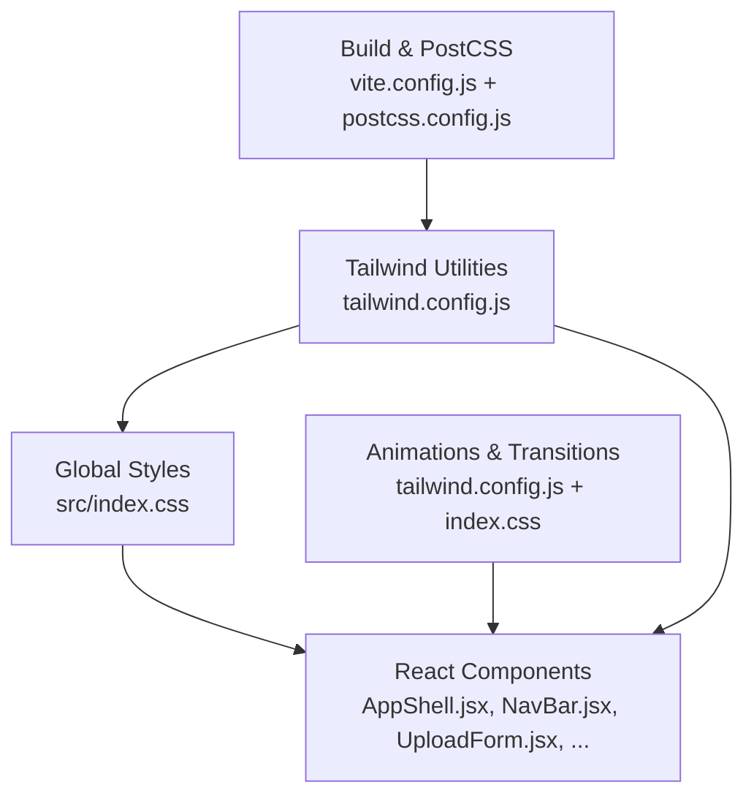

**Diagram sources**
- [tailwind.config.js:1-67](file://app/frontend/tailwind.config.js#L1-L67)
- [index.css:1-161](file://app/frontend/src/index.css#L1-L161)
- [AppShell.jsx:1-13](file://app/frontend/src/components/AppShell.jsx#L1-L13)
- [NavBar.jsx:1-117](file://app/frontend/src/components/NavBar.jsx#L1-L117)
- [UploadForm.jsx:1-484](file://app/frontend/src/components/UploadForm.jsx#L1-L484)
- [vite.config.js:1-26](file://app/frontend/vite.config.js#L1-L26)
- [postcss.config.js:1-7](file://app/frontend/postcss.config.js#L1-L7)

## Detailed Component Analysis

### TailwindCSS Configuration
- Extends colors with brand and surface palettes, plus slate palette.
- Adds Inter as the primary sans font.
- Introduces brand-specific shadows and a gradient-brand background.
- Defines animations (shimmer, fade-up, spin-slow) and keyframes for shimmer and fadeInUp.
- No responsive breakpoint customization is present; defaults apply.

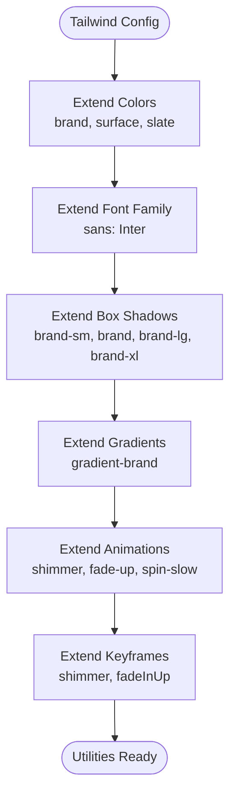

**Diagram sources**
- [tailwind.config.js:1-67](file://app/frontend/tailwind.config.js#L1-L67)

**Section sources**
- [tailwind.config.js:1-67](file://app/frontend/tailwind.config.js#L1-L67)

### Global Styles and Base Layer
- Imports Inter font and applies base root styles including font-family, line-height, and smoothing.
- Sets :root color-scheme to light.
- Defines background orbs via ::before and ::after on body.
- Provides custom scrollbar styling.
- Declares branded button styles (.btn-brand), gradient text (.text-gradient), card animation (.card-animate), focus accent colors for inputs, range/slider accent color, and print/PDF overrides.

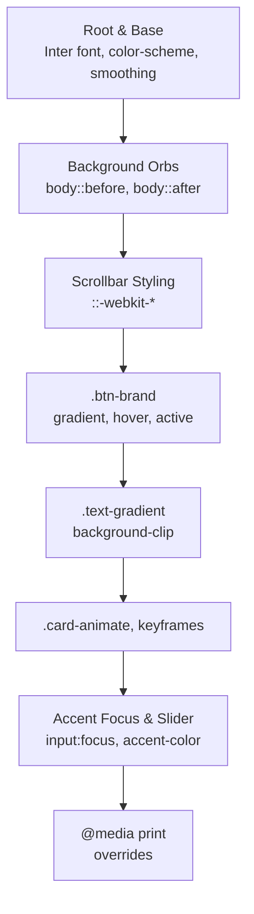

**Diagram sources**
- [index.css:1-161](file://app/frontend/src/index.css#L1-L161)

**Section sources**
- [index.css:1-161](file://app/frontend/src/index.css#L1-L161)

### Navigation Bar Styling Patterns
- Uses backdrop blur and brand borders for modern glass-like effect.
- Active nav item state uses brand-50 background and brand-600 underline indicator.
- User menu leverages brand-50 hover states and brand-lg shadow.
- Consistent use of brand-*, slate-*, and ring utilities for color and border tokens.

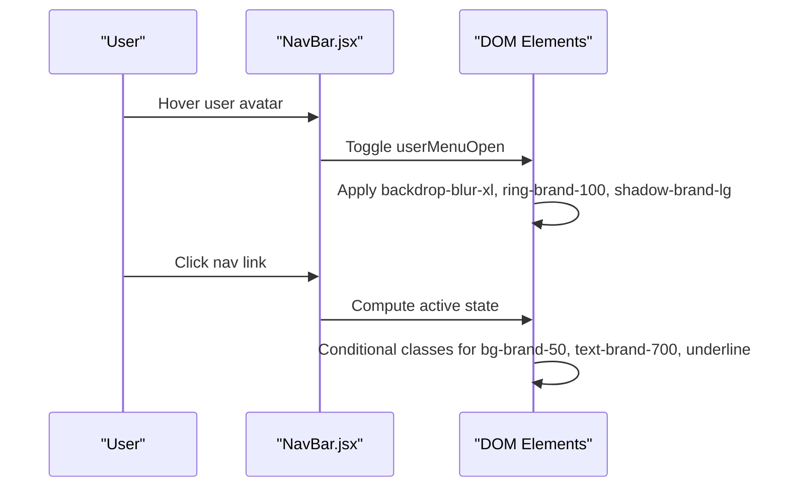

**Diagram sources**
- [NavBar.jsx:1-117](file://app/frontend/src/components/NavBar.jsx#L1-L117)

**Section sources**
- [NavBar.jsx:1-117](file://app/frontend/src/components/NavBar.jsx#L1-L117)

### Upload Form and Interactive States
- Drag-and-drop areas toggle brand-50/brand-200 states based on drag activity.
- Focus states use ring-brand-500 with smooth transitions.
- Branded submit button uses btn-brand and shadow-brand utilities.
- Weights panel toggles visibility and applies brand-50/brand-600 accents.
- Error banners use red-50/red-200 with icons for clarity.

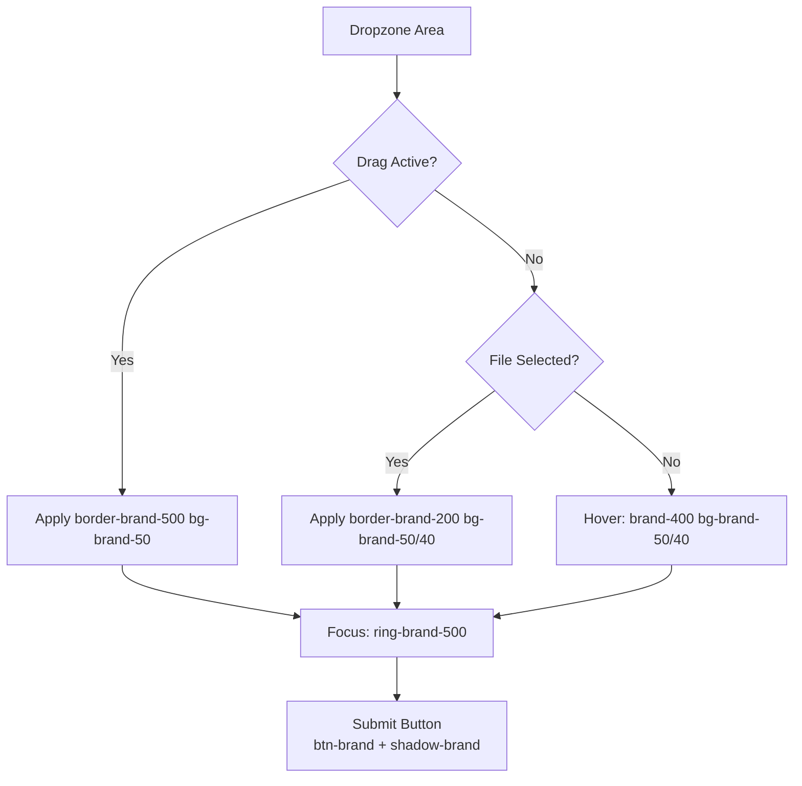

**Diagram sources**
- [UploadForm.jsx:1-484](file://app/frontend/src/components/UploadForm.jsx#L1-L484)

**Section sources**
- [UploadForm.jsx:1-484](file://app/frontend/src/components/UploadForm.jsx#L1-L484)

### Dashboard Progress Panels and Cards
- Uses brand-50/green-50 ring/color tokens to indicate stage completion.
- Animated cards leverage .card-animate and spinner utilities.
- Feature cards inside the dashboard use brand-50 backgrounds and brand-600 accents.

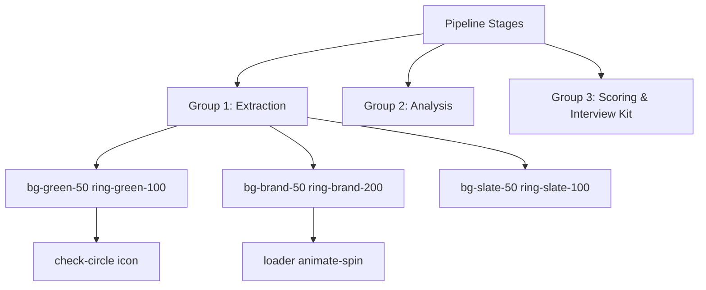

**Diagram sources**
- [Dashboard.jsx:1-330](file://app/frontend/src/pages/Dashboard.jsx#L1-L330)

**Section sources**
- [Dashboard.jsx:1-330](file://app/frontend/src/pages/Dashboard.jsx#L1-L330)

### Result Card and Skill Visualization
- ResultCard uses brand-50 backgrounds, brand-100 rings, and brand shadows for depth.
- Skill bars and radar charts rely on brand-*, green-*, red-*, amber-*, and teal- color tokens.
- Collapsible sections use brand-50 rings and brand-600 accents for icons.
- Email modal and interview kit tabs apply brand-600 for active states.

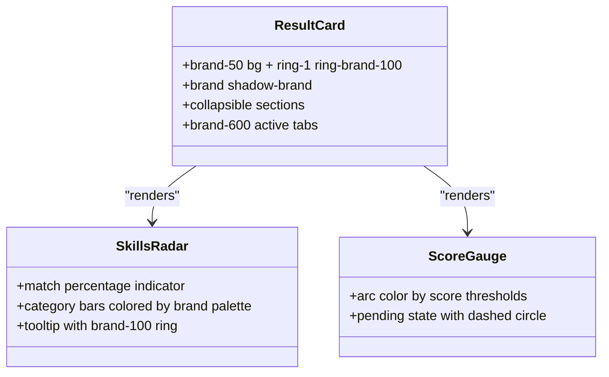

**Diagram sources**
- [ResultCard.jsx:1-627](file://app/frontend/src/components/ResultCard.jsx#L1-L627)
- [SkillsRadar.jsx:1-261](file://app/frontend/src/components/SkillsRadar.jsx#L1-L261)
- [ScoreGauge.jsx:1-97](file://app/frontend/src/components/ScoreGauge.jsx#L1-L97)

**Section sources**
- [ResultCard.jsx:1-627](file://app/frontend/src/components/ResultCard.jsx#L1-L627)
- [SkillsRadar.jsx:1-261](file://app/frontend/src/components/SkillsRadar.jsx#L1-L261)
- [ScoreGauge.jsx:1-97](file://app/frontend/src/components/ScoreGauge.jsx#L1-L97)

### Login Page and Form Tokens
- Login card uses brand-50 ring and brand-600 gradient accents.
- Input focus uses ring-brand-500 with transition-shadow.
- Branded submit button uses btn-brand and shadow-brand.

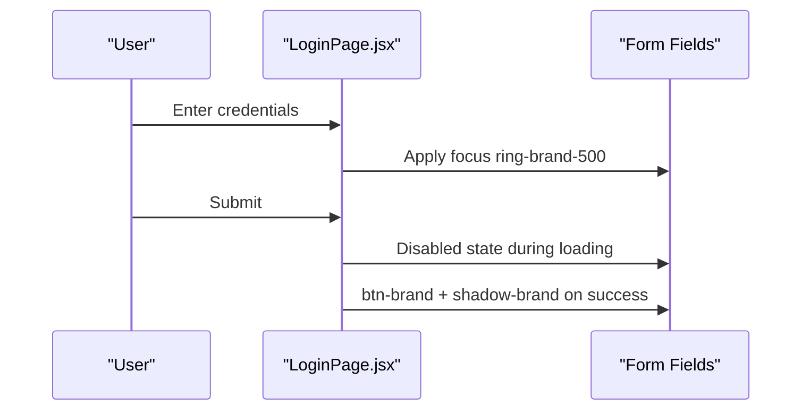

**Diagram sources**
- [LoginPage.jsx:1-121](file://app/frontend/src/pages/LoginPage.jsx#L1-L121)

**Section sources**
- [LoginPage.jsx:1-121](file://app/frontend/src/pages/LoginPage.jsx#L1-L121)

### Animation Systems and Transitions
- Tailwind animations: shimmer, fade-up, spin-slow.
- Keyframes: shimmer and fadeInUp defined in Tailwind config and global CSS.
- Component usage: .card-animate on result cards, spinner on buttons, brand shadows for elevation.

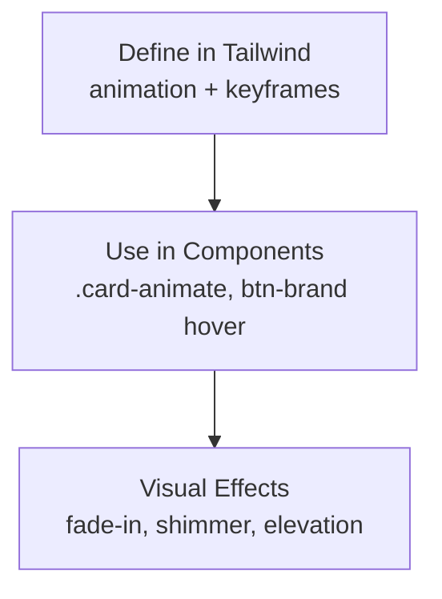

**Diagram sources**
- [tailwind.config.js:48-62](file://app/frontend/tailwind.config.js#L48-L62)
- [index.css:83-91](file://app/frontend/src/index.css#L83-L91)
- [UploadForm.jsx:460-479](file://app/frontend/src/components/UploadForm.jsx#L460-L479)

**Section sources**
- [tailwind.config.js:48-62](file://app/frontend/tailwind.config.js#L48-L62)
- [index.css:83-91](file://app/frontend/src/index.css#L83-L91)
- [UploadForm.jsx:460-479](file://app/frontend/src/components/UploadForm.jsx#L460-L479)

### Accessibility and Print/PDF
- Root color-scheme set to light.
- Focus states use ring-brand-500 for keyboard navigation.
- Print media queries override backgrounds, remove blur, adjust shadows, and ensure readable text.

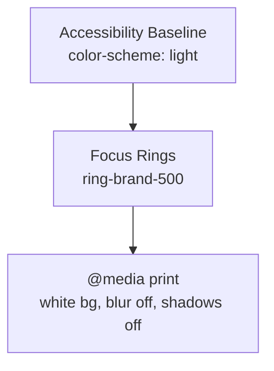

**Diagram sources**
- [index.css:7-16](file://app/frontend/src/index.css#L7-L16)
- [index.css:137-160](file://app/frontend/src/index.css#L137-L160)

**Section sources**
- [index.css:7-16](file://app/frontend/src/index.css#L7-L16)
- [index.css:137-160](file://app/frontend/src/index.css#L137-L160)

## Dependency Analysis
- TailwindCSS is the single source of truth for design tokens (colors, shadows, gradients, animations).
- PostCSS processes Tailwind directives and autoprefixes output.
- Vite compiles the React app and serves assets.
- Global CSS augments Tailwind utilities with brand-specific components and print styles.

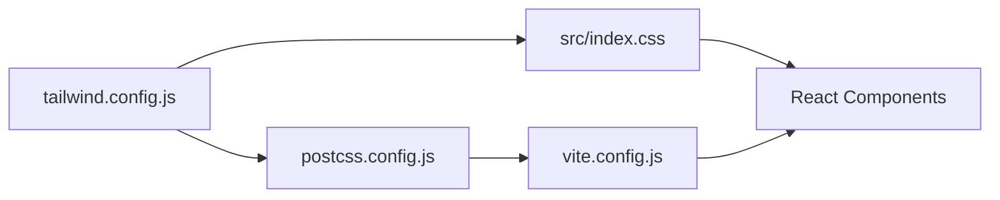

**Diagram sources**
- [tailwind.config.js:1-67](file://app/frontend/tailwind.config.js#L1-L67)
- [postcss.config.js:1-7](file://app/frontend/postcss.config.js#L1-L7)
- [vite.config.js:1-26](file://app/frontend/vite.config.js#L1-L26)
- [index.css:1-161](file://app/frontend/src/index.css#L1-L161)

**Section sources**
- [tailwind.config.js:1-67](file://app/frontend/tailwind.config.js#L1-L67)
- [postcss.config.js:1-7](file://app/frontend/postcss.config.js#L1-L7)
- [vite.config.js:1-26](file://app/frontend/vite.config.js#L1-L26)
- [index.css:1-161](file://app/frontend/src/index.css#L1-L161)

## Performance Considerations
- Utility-first approach minimizes CSS bundle size by generating only used classes.
- Autoprefixer ensures modern CSS compatibility without manual vendor prefixes.
- Global CSS is minimal; most styling is composed via Tailwind utilities.
- Consider enabling PurgeCSS in production builds to remove unused styles (Tailwind’s default behavior in production).
- Keep animations lightweight (shadows, transforms) and avoid excessive keyframe complexity.

## Troubleshooting Guide
- If brand utilities are missing, verify Tailwind content paths and ensure the config is loaded by the build.
- If animations do not play, confirm animation utilities and keyframes are defined and imported.
- If focus rings are not visible, ensure ring utilities are applied and color-scheme matches the intended theme.
- For print/PDF issues, review @media print rules and confirm they override background and blur effects.

**Section sources**
- [tailwind.config.js:3-6](file://app/frontend/tailwind.config.js#L3-L6)
- [index.css:83-91](file://app/frontend/src/index.css#L83-L91)
- [index.css:137-160](file://app/frontend/src/index.css#L137-L160)

## Conclusion
Resume AI’s frontend design system centers on a clean, utility-first TailwindCSS configuration with brand-consistent tokens, global enhancements, and component-level composition. The current theme is light-focused, with room to introduce dark mode by extending color scales and adjusting global variables. The build pipeline integrates Tailwind and PostCSS seamlessly via Vite, supporting rapid iteration and maintainable styling.

## Appendices

### Theme Customization Options
- Extend colors in Tailwind config to add dark mode variants for brand and surface palettes.
- Add a color-scheme toggle in global CSS or a theme context to switch :root variables and component classes.
- Introduce dark-specific ring and text color utilities for interactive states.

**Section sources**
- [tailwind.config.js:7-35](file://app/frontend/tailwind.config.js#L7-L35)
- [index.css:7-16](file://app/frontend/src/index.css#L7-L16)

### Dark Mode Implementation
- Extend Tailwind colors with dark variants under a new palette (e.g., brand-dark, surface-dark).
- Add a theme provider that switches :root color-scheme and component ring/text classes.
- Ensure print/PDF media queries adapt to dark backgrounds if needed.

[No sources needed since this section provides general guidance]

### Maintaining Design Consistency
- Prefer Tailwind utilities over ad-hoc CSS for consistent spacing, colors, and typography.
- Centralize brand tokens in Tailwind config; avoid hardcoding hex values in components.
- Use shared components (e.g., buttons, badges) to enforce uniform styles.

[No sources needed since this section provides general guidance]

### Extending the Design System
- Add new utilities in Tailwind config (colors, shadows, animation) and import them globally.
- Create reusable component wrappers that encapsulate common class combinations.
- Document component APIs with consistent prop-driven styling (e.g., size, variant).

[No sources needed since this section provides general guidance]