# User Management

<cite>
**Referenced Files in This Document**
- [db_models.py](file://app/backend/models/db_models.py)
- [schemas.py](file://app/backend/models/schemas.py)
- [auth.py](file://app/backend/middleware/auth.py)
- [auth_routes.py](file://app/backend/routes/auth.py)
- [team_routes.py](file://app/backend/routes/team.py)
- [admin_routes.py](file://app/backend/routes/admin.py)
- [UsersPage.jsx](file://app/frontend/src/pages/admin/UsersPage.jsx)
- [SlideOutPanel.jsx](file://app/frontend/src/components/admin/SlideOutPanel.jsx)
- [TenantDetailPage.jsx](file://app/frontend/src/pages/admin/TenantDetailPage.jsx)
- [AuthContext.jsx](file://app/frontend/src/contexts/AuthContext.jsx)
- [api.js](file://app/frontend/src/lib/api.js)
- [PlanFeaturesPage.jsx](file://app/frontend/src/pages/admin/PlanFeaturesPage.jsx)
- [BillingSettingsPage.jsx](file://app/frontend/src/pages/admin/BillingSettingsPage.jsx)
- [PlanManagementPage.jsx](file://app/frontend/src/pages/admin/PlanManagementPage.jsx)
</cite>

## Update Summary
**Changes Made**
- Enhanced administrative user experience with new inline toggle controls for user status management
- Introduced comprehensive slide-out panel system for detailed user and tenant management
- Added inline toggle controls for feature flag management across the platform
- Implemented comprehensive tenant management actions including plan assignment and billing configuration
- Enhanced error handling with extractApiError() utility function throughout the admin interface
- Updated pagination implementation to 20 items per page for improved performance
- Added comprehensive tenant detail view with plan management, usage adjustment, and billing configuration

## Table of Contents
1. [Introduction](#introduction)
2. [System Architecture](#system-architecture)
3. [Core Components](#core-components)
4. [Authentication and Authorization](#authentication-and-authorization)
5. [User Management Features](#user-management-features)
6. [Advanced User Management Capabilities](#advanced-user-management-capabilities)
7. [Tenant Management System](#tenant-management-system)
8. [Multi-Tenant Architecture](#multi-tenant-architecture)
9. [Security Implementation](#security-implementation)
10. [Frontend Integration](#frontend-integration)
11. [API Endpoints](#api-endpoints)
12. [Best Practices and Guidelines](#best-practices-and-guidelines)

## Introduction

The User Management system in Resume AI by ThetaLogics provides comprehensive user lifecycle management across a multi-tenant SaaS platform. This system handles user authentication, authorization, tenant membership management, and administrative oversight capabilities. The platform serves as an AI-powered resume analysis and candidate screening solution, requiring robust user management to support both individual users within organizations and platform administrators.

The system is built on a modern tech stack featuring FastAPI for the backend, React for the frontend, PostgreSQL for data persistence, and JWT-based authentication with comprehensive security measures including rate limiting, CSRF protection, and token revocation.

## System Architecture

The User Management system follows a layered architecture with clear separation of concerns:

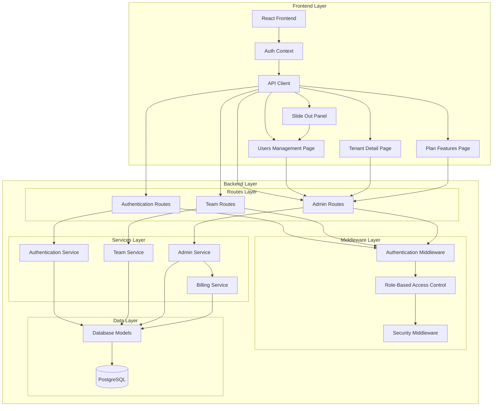

**Diagram sources**
- [auth_routes.py:1-517](file://app/backend/routes/auth.py#L1-L517)
- [team_routes.py:1-295](file://app/backend/routes/team.py#L1-L295)
- [admin_routes.py:1-800](file://app/backend/routes/admin.py#L1-L800)

## Core Components

### Database Model Architecture

The user management system is built around several core database models that define the relationships and constraints:

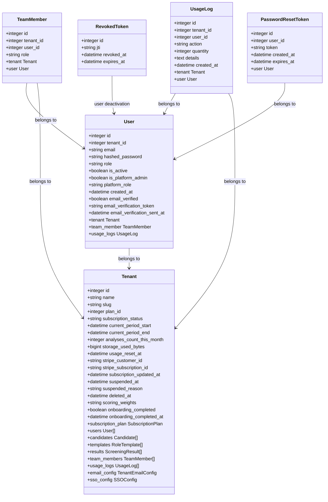

**Diagram sources**
- [db_models.py:77-124](file://app/backend/models/db_models.py#L77-L124)
- [db_models.py:33-75](file://app/backend/models/db_models.py#L33-L75)
- [db_models.py:267-277](file://app/backend/models/db_models.py#L267-L277)
- [db_models.py:110-124](file://app/backend/models/db_models.py#L110-L124)
- [db_models.py:396-415](file://app/backend/models/db_models.py#L396-L415)

### Authentication Schema Definitions

The system uses Pydantic models for request/response validation:

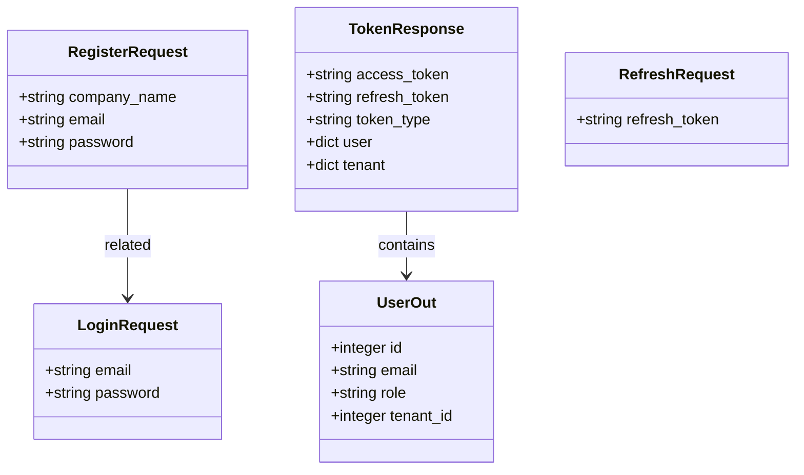

**Diagram sources**
- [schemas.py:237-268](file://app/backend/models/schemas.py#L237-L268)
- [schemas.py:248-254](file://app/backend/models/schemas.py#L248-L254)

**Section sources**
- [db_models.py:77-124](file://app/backend/models/db_models.py#L77-L124)
- [schemas.py:237-268](file://app/backend/models/schemas.py#L237-L268)

## Authentication and Authorization

### JWT-Based Authentication Flow

The authentication system implements a comprehensive JWT-based security model with multiple layers of protection:

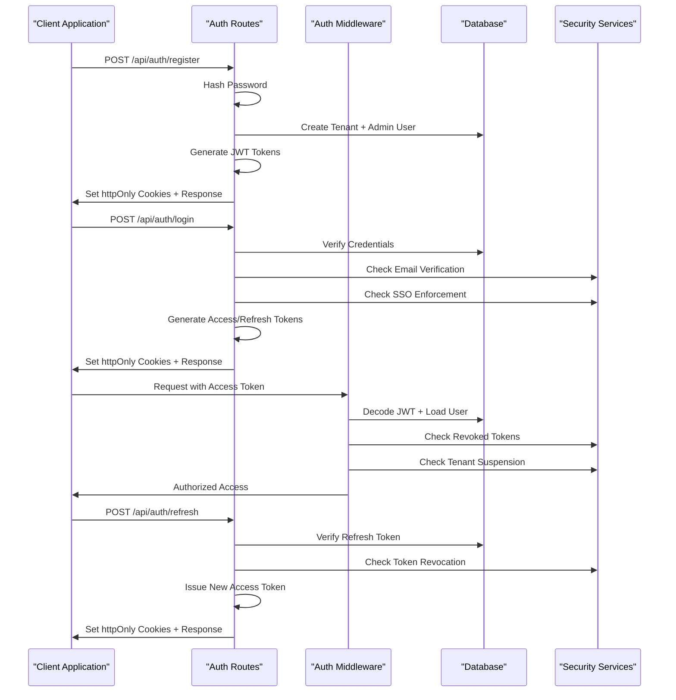

**Diagram sources**
- [auth_routes.py:175-250](file://app/backend/routes/auth.py#L175-L250)
- [auth_routes.py:264-315](file://app/backend/routes/auth.py#L264-L315)
- [auth_routes.py:317-367](file://app/backend/routes/auth.py#L317-L367)
- [auth.py:57-145](file://app/backend/middleware/auth.py#L57-L145)

### Role-Based Access Control

The system implements a hierarchical role-based access control (RBAC) system:

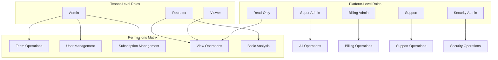

**Diagram sources**
- [auth.py:176-229](file://app/backend/middleware/auth.py#L176-L229)
- [team_routes.py:68-94](file://app/backend/routes/team.py#L68-L94)

**Section sources**
- [auth_routes.py:175-367](file://app/backend/routes/auth.py#L175-L367)
- [auth.py:176-229](file://app/backend/middleware/auth.py#L176-L229)

## User Management Features

### Team Member Management

The system provides comprehensive team member management capabilities:

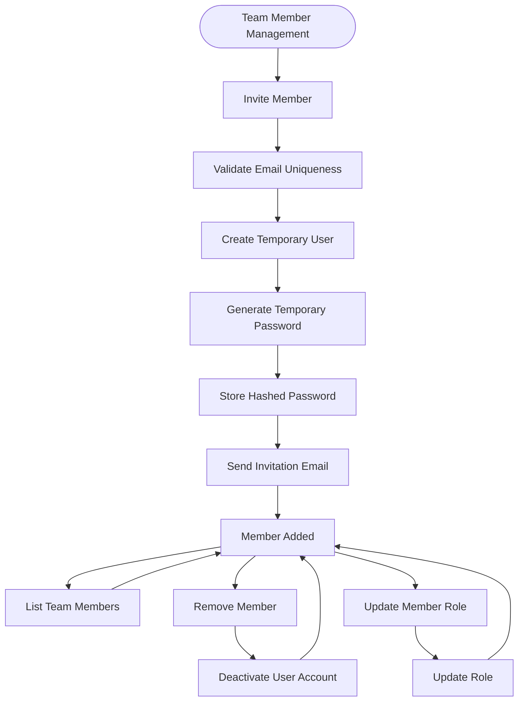

**Diagram sources**
- [team_routes.py:68-114](file://app/backend/routes/team.py#L68-L114)
- [team_routes.py:52-65](file://app/backend/routes/team.py#L52-L65)

### Administrative User Management

Platform administrators have extensive capabilities for managing users across tenants:

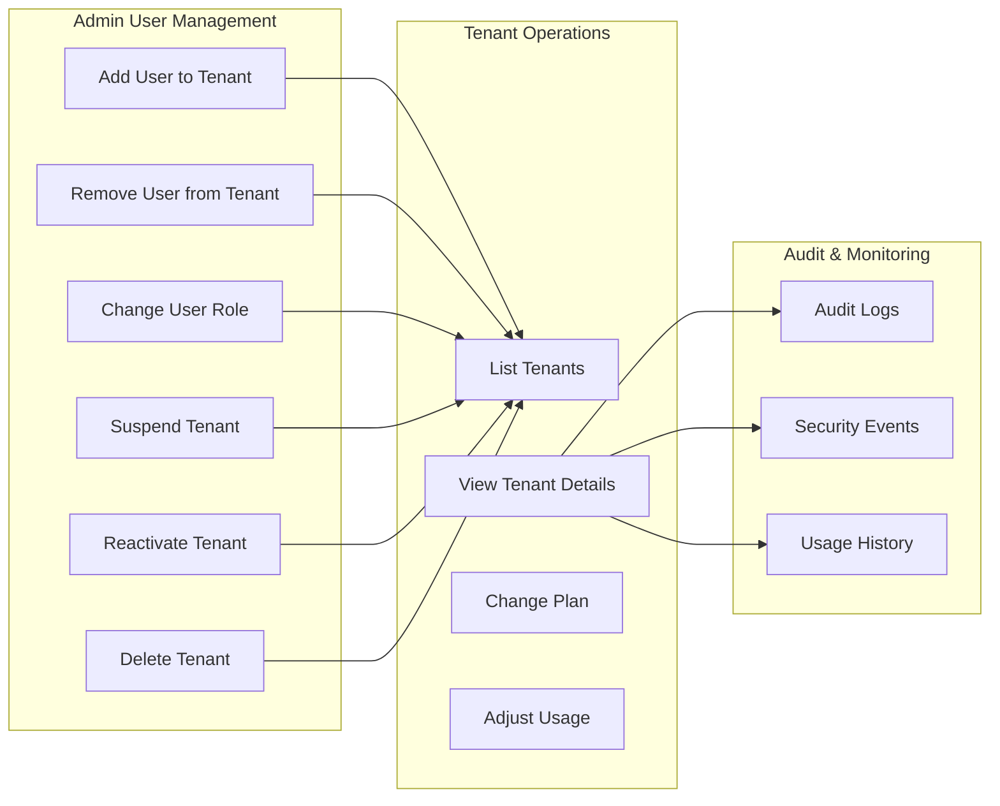

**Diagram sources**
- [admin_routes.py:201-276](file://app/backend/routes/admin.py#L201-L276)
- [admin_routes.py:281-363](file://app/backend/routes/admin.py#L281-L363)
- [admin_routes.py:367-434](file://app/backend/routes/admin.py#L367-L434)

**Section sources**
- [team_routes.py:68-114](file://app/backend/routes/team.py#L68-L114)
- [admin_routes.py:201-434](file://app/backend/routes/admin.py#L201-L434)

## Advanced User Management Capabilities

### Enhanced User Management Interface with Inline Toggle Controls

The UsersPage.jsx component provides a sophisticated user management interface with advanced filtering, sorting, and comprehensive inline toggle controls for user status management:

```mermaid
graph TB
subgraph "Enhanced User Management Interface"
UsersPage[UsersPage Component]
TenantSelector[Tenant Selector]
UserFilters[Advanced Filters]
UserTable[User Table with Inline Toggle Controls]
BulkActions[Bulk Action Controls]
SlideOutPanel[Slide Out Panel System]
InlineToggle[Inline Toggle Controls]
End
subgraph "User Operations"
AddUser[Add User Modal]
ChangeRole[Change Role Modal]
RemoveUser[Remove User Action]
InlineToggle --> UserStatusToggle[User Status Toggle]
InlineToggle --> UserRoleToggle[User Role Toggle]
end
subgraph "Data Management"
Pagination[Pagination Controls - 20 per page]
Search[Search Functionality]
Export[Export Capabilities]
end
UsersPage --> TenantSelector
UsersPage --> UserFilters
UsersPage --> UserTable
UsersPage --> BulkActions
UsersPage --> SlideOutPanel
UserTable --> InlineToggle
InlineToggle --> UserStatusToggle
InlineToggle --> UserRoleToggle
UserFilters --> Search
UserFilters --> Pagination
BulkActions --> Export
```

**Diagram sources**
- [UsersPage.jsx:295-649](file://app/frontend/src/pages/admin/UsersPage.jsx#L295-L649)
- [UsersPage.jsx:176-192](file://app/frontend/src/pages/admin/UsersPage.jsx#L176-L192)

### Comprehensive Slide-Out Panel System

The system now implements a comprehensive slide-out panel system for detailed user and tenant management:

```mermaid
graph TB
subgraph "Slide-Out Panel System"
SlideOutPanel[SlideOutPanel Component]
UserSlideOut[User Slide-Out Panel]
TenantDetailPanel[Tenant Detail Panel]
ActionPanel[Action Panel]
ProfileSection[Profile Section]
ActionsSection[Actions Section]
ActivityLog[Activity Log Section]
end
subgraph "Panel Features"
Overlay[Overlay Background]
Header[Panel Header]
CloseButton[Close Button]
Content[Panel Content]
WidthControl[Width Control - w-[480px]]
Transition[Smooth Transitions]
end
SlideOutPanel --> UserSlideOut
SlideOutPanel --> TenantDetailPanel
SlideOutPanel --> ActionPanel
UserSlideOut --> ProfileSection
UserSlideOut --> ActionsSection
UserSlideOut --> ActivityLog
SlideOutPanel --> Overlay
SlideOutPanel --> Header
SlideOutPanel --> CloseButton
SlideOutPanel --> Content
SlideOutPanel --> WidthControl
SlideOutPanel --> Transition
```

**Diagram sources**
- [SlideOutPanel.jsx:1-38](file://app/frontend/src/components/admin/SlideOutPanel.jsx#L1-L38)
- [UsersPage.jsx:195-321](file://app/frontend/src/pages/admin/UsersPage.jsx#L195-L321)

### Inline Toggle Controls for Feature Flag Management

The system provides inline toggle controls for comprehensive feature flag management across the platform:

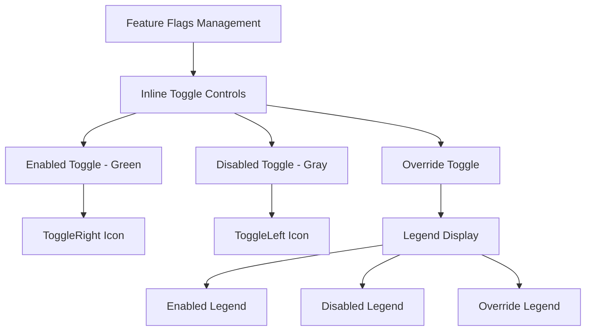

**Diagram sources**
- [PlanFeaturesPage.jsx:162-204](file://app/frontend/src/pages/admin/PlanFeaturesPage.jsx#L162-L204)

### Enhanced Error Handling with extractApiError()

The system now implements comprehensive error handling using the extractApiError() utility function:

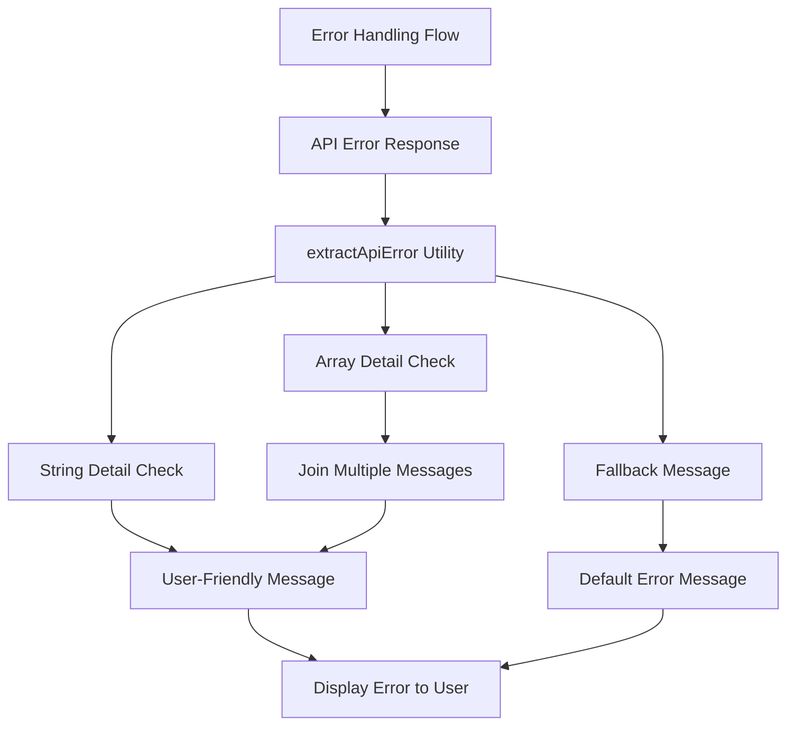

**Diagram sources**
- [api.js:1077-1085](file://app/frontend/src/lib/api.js#L1077-L1085)

### Optimized Pagination Implementation

The system now implements optimized pagination with 20 items per page for improved performance:

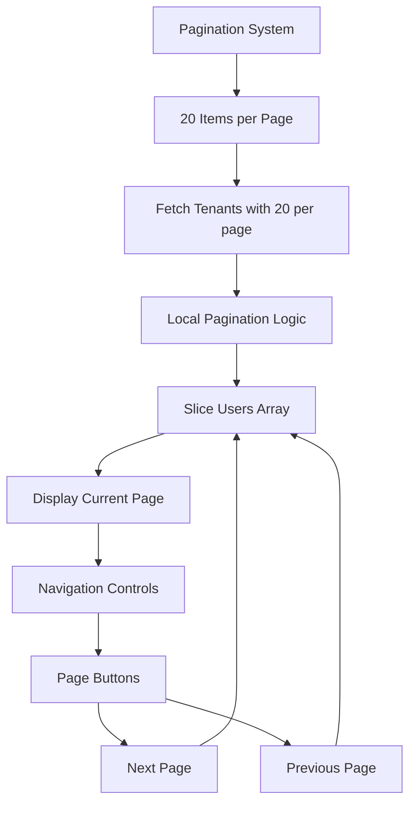

**Diagram sources**
- [UsersPage.jsx:32](file://app/frontend/src/pages/admin/UsersPage.jsx#L32)
- [UsersPage.jsx:485](file://app/frontend/src/pages/admin/UsersPage.jsx#L485)

### Advanced Filtering and Search

The system implements comprehensive filtering capabilities with sophisticated search functionality:

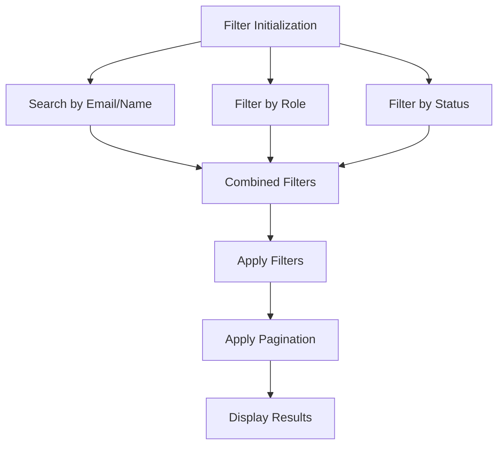

**Diagram sources**
- [UsersPage.jsx:476-483](file://app/frontend/src/pages/admin/UsersPage.jsx#L476-L483)

### Role Assignment Controls

The system provides granular role assignment with platform-level and tenant-level permissions:

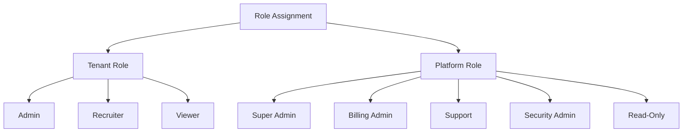

**Diagram sources**
- [UsersPage.jsx:34-40](file://app/frontend/src/pages/admin/UsersPage.jsx#L34-L40)

### User Status Management with Inline Toggle Controls

The system implements comprehensive user status management with activation/deactivation capabilities through inline toggle controls:

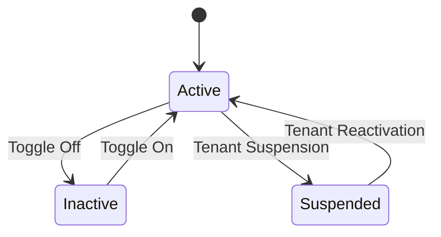

**Diagram sources**
- [UsersPage.jsx:698-701](file://app/frontend/src/pages/admin/UsersPage.jsx#L698-L701)

**Section sources**
- [UsersPage.jsx:295-649](file://app/frontend/src/pages/admin/UsersPage.jsx#L295-L649)
- [SlideOutPanel.jsx:1-38](file://app/frontend/src/components/admin/SlideOutPanel.jsx#L1-L38)
- [PlanFeaturesPage.jsx:162-204](file://app/frontend/src/pages/admin/PlanFeaturesPage.jsx#L162-L204)
- [api.js:1077-1085](file://app/frontend/src/lib/api.js#L1077-L1085)

## Tenant Management System

### Comprehensive Tenant Detail Management

The TenantDetailPage.jsx provides a comprehensive tenant management interface with detailed information and management capabilities:

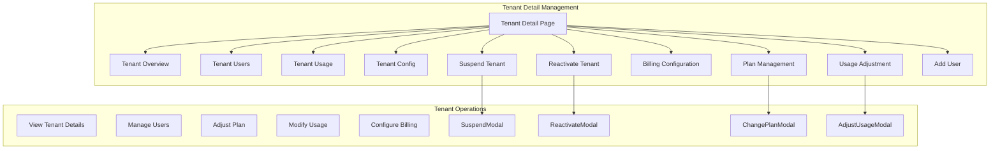

**Diagram sources**
- [TenantDetailPage.jsx:384-632](file://app/frontend/src/pages/admin/TenantDetailPage.jsx#L384-L632)

### Tenant Plan Management

The system provides comprehensive plan management capabilities with detailed configuration options:

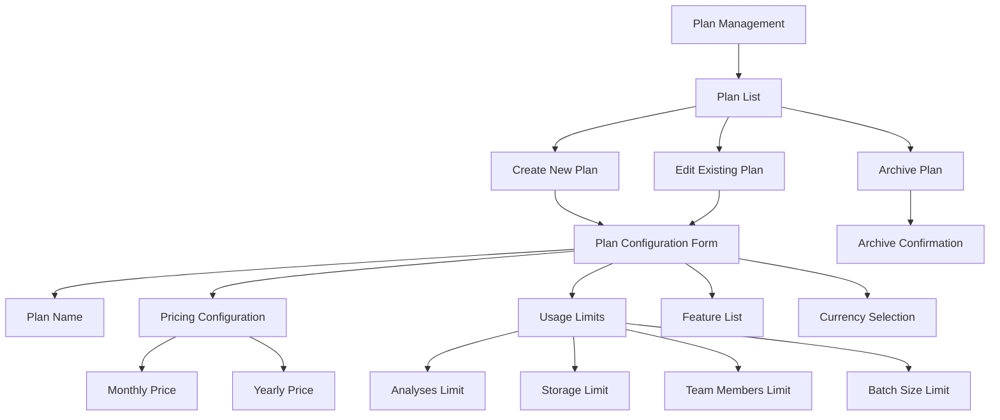

**Diagram sources**
- [PlanManagementPage.jsx:127-200](file://app/frontend/src/pages/admin/PlanManagementPage.jsx#L127-L200)

### Billing Configuration and Management

The system provides comprehensive billing configuration and management capabilities:

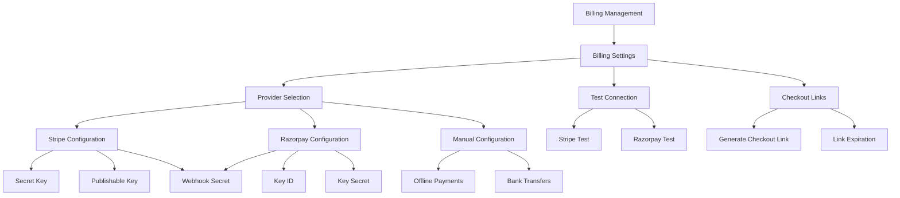

**Diagram sources**
- [BillingSettingsPage.jsx:114-200](file://app/frontend/src/pages/admin/BillingSettingsPage.jsx#L114-L200)

### Tenant Usage Management

The system provides comprehensive tenant usage management with detailed analytics and adjustment capabilities:

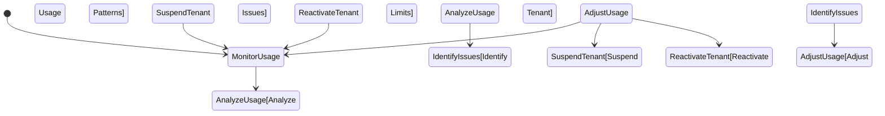

**Diagram sources**
- [TenantDetailPage.jsx:576-608](file://app/frontend/src/pages/admin/TenantDetailPage.jsx#L576-L608)

**Section sources**
- [TenantDetailPage.jsx:384-632](file://app/frontend/src/pages/admin/TenantDetailPage.jsx#L384-L632)
- [PlanManagementPage.jsx:127-200](file://app/frontend/src/pages/admin/PlanManagementPage.jsx#L127-L200)
- [BillingSettingsPage.jsx:114-200](file://app/frontend/src/pages/admin/BillingSettingsPage.jsx#L114-L200)

## Multi-Tenant Architecture

### Tenant Isolation and Data Segregation

The multi-tenant architecture ensures complete isolation between organizations:

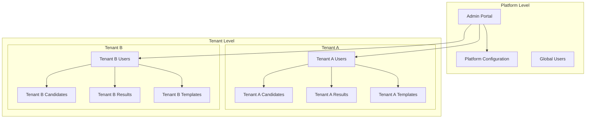

**Diagram sources**
- [db_models.py:33-75](file://app/backend/models/db_models.py#L33-L75)
- [db_models.py:77-124](file://app/backend/models/db_models.py#L77-L124)

### Tenant Subscription Management

The system manages tenant subscriptions with comprehensive billing and usage tracking:

```mermaid
stateDiagram-v2
[*] --> Active
Active --> Trialing : Start Trial
Active --> Suspended : Payment Failure
Active --> Cancelled : User Cancellation
Trialing --> Active : Payment Successful
Trialing --> Cancelled : Trial Expired
Suspended --> Active : Payment Successful
Suspended --> Cancelled : Payment Failed
Cancelled --> [*]
Active --> UsageCheck : Monthly Check
UsageCheck --> Active : Within Limits
UsageCheck --> PastDue : Exceeded Limits
PastDue --> Suspended : Payment Failure
PastDue --> Active : Payment Successful
```

**Diagram sources**
- [db_models.py:42-57](file://app/backend/models/db_models.py#L42-L57)
- [admin_routes.py:367-434](file://app/backend/routes/admin.py#L367-L434)

**Section sources**
- [db_models.py:33-75](file://app/backend/models/db_models.py#L33-L75)
- [admin_routes.py:367-434](file://app/backend/routes/admin.py#L367-L434)

## Security Implementation

### Comprehensive Security Measures

The system implements multiple layers of security:

```mermaid
graph TB
subgraph "Authentication Security"
JWT[JWT Tokens]
CSRF[CSRF Protection]
RateLimit[Rate Limiting]
TokenRevocation[Token Revocation]
end
subgraph "Data Security"
Encryption[Password Hashing]
SSL[HTTPS Only]
InputValidation[Input Validation]
SQLInjection[SQL Injection Prevention]
end
subgraph "Access Control"
RBAC[Role-Based Access Control]
TenantIsolation[Tenant Isolation]
PlatformAdmin[Platform Admin]
Impersonation[Impersonation Support]
end
subgraph "Audit & Monitoring"
AuditLogs[Audit Logging]
SecurityEvents[Security Events]
SuspiciousActivity[Suspicious Activity Detection]
end
JWT --> CSRF
CSRF --> RateLimit
RateLimit --> TokenRevocation
Encryption --> SSL
SSL --> InputValidation
InputValidation --> SQLInjection
RBAC --> TenantIsolation
TenantIsolation --> PlatformAdmin
PlatformAdmin --> Impersonation
AuditLogs --> SecurityEvents
SecurityEvents --> SuspiciousActivity
```

**Diagram sources**
- [auth_routes.py:43-75](file://app/backend/routes/auth.py#L43-L75)
- [auth_routes.py:264-315](file://app/backend/routes/auth.py#L264-L315)
- [auth.py:182-229](file://app/backend/middleware/auth.py#L182-L229)

### Security Event Tracking

The system maintains comprehensive security event logs:

```mermaid
sequenceDiagram
participant User as "User Action"
participant Security as "Security Service"
participant Audit as "Audit Service"
participant DB as "Database"
User->>Security : Login Attempt
Security->>Security : Validate Credentials
Security->>Security : Check Rate Limits
Security->>Security : Check Suspicious Activity
alt Valid Login
Security->>Audit : Record Login Success
Audit->>DB : Log Success Event
else Invalid Login
Security->>Audit : Record Login Failure
Audit->>DB : Log Failure Event
Security->>Security : Check Brute Force
Security->>Audit : Record Suspicious Activity
end
User->>Security : Token Refresh
Security->>Security : Verify Token
Security->>Security : Check Revoked Tokens
Security->>Audit : Log Refresh Event
```

**Diagram sources**
- [auth_routes.py:277-315](file://app/backend/routes/auth.py#L277-L315)
- [auth_routes.py:317-367](file://app/backend/routes/auth.py#L317-L367)

**Section sources**
- [auth_routes.py:43-75](file://app/backend/routes/auth.py#L43-L75)
- [auth_routes.py:264-367](file://app/backend/routes/auth.py#L264-L367)
- [auth.py:182-229](file://app/backend/middleware/auth.py#L182-L229)

## Frontend Integration

### React-Based User Interface

The frontend provides a comprehensive user management interface with advanced functionality:

```mermaid
graph TB
subgraph "Admin Interface"
UsersPage[Users Management Page]
TenantsPage[Tenants Management Page]
TenantDetailPage[Tenant Detail Page]
AdminLayout[Admin Layout]
SlideOutPanel[Slide Out Panel]
PlanFeaturesPage[Plan Features Page]
BillingSettingsPage[Billing Settings Page]
PlanManagementPage[Plan Management Page]
end
subgraph "Components"
UserTable[User Table Component]
AddUserModal[Add User Modal]
ChangeRoleModal[Change Role Modal]
TenantSelector[Tenant Selector]
UserFilters[User Filters]
RoleBadge[Role Badge Component]
StatusBadge[Status Badge Component]
RowActions[Row Actions Dropdown]
Toast[Toast Notifications]
InlineToggle[Inline Toggle Component]
SlideOutPanel --> UserSlideOut[User Slide Out]
SlideOutPanel --> TenantDetailPanel[Tenant Detail Panel]
end
subgraph "State Management"
AuthContext[Auth Context]
ToastNotifications[Toast Notifications]
LoadingStates[Loading States]
PaginationStates[Pagination States]
FilterStates[Filter States]
end
UsersPage --> UserTable
UsersPage --> AddUserModal
UsersPage --> ChangeRoleModal
UsersPage --> UserFilters
UsersPage --> RoleBadge
UsersPage --> StatusBadge
UsersPage --> RowActions
UsersPage --> InlineToggle
UsersPage --> SlideOutPanel
TenantDetailPage --> SlideOutPanel
PlanFeaturesPage --> InlineToggle
BillingSettingsPage --> SlideOutPanel
PlanManagementPage --> SlideOutPanel
AuthContext --> UsersPage
AuthContext --> TenantsPage
AuthContext --> TenantDetailPage
AuthContext --> PlanFeaturesPage
AuthContext --> BillingSettingsPage
AuthContext --> PlanManagementPage
ToastNotifications --> UsersPage
LoadingStates --> UsersPage
PaginationStates --> UsersPage
FilterStates --> UsersPage
```

**Diagram sources**
- [UsersPage.jsx:295-649](file://app/frontend/src/pages/admin/UsersPage.jsx#L295-L649)
- [AuthContext.jsx:1-112](file://app/frontend/src/contexts/AuthContext.jsx#L1-L112)
- [SlideOutPanel.jsx:1-38](file://app/frontend/src/components/admin/SlideOutPanel.jsx#L1-L38)

### Advanced Component Architecture

The UsersPage component implements a sophisticated component architecture with inline toggle controls:

```mermaid
classDiagram
class UsersPage {
+tenants : array
+selectedTenantId : string
+users : array
+loading : boolean
+error : string
+filters : object
+pagination : object
+modals : object
+slideOutUser : object
+PER_PAGE : 20
+fetchTenants()
+fetchUsers()
+handleRowAction()
+handleSearchSubmit()
}
class SlideOutPanel {
+isOpen : boolean
+onClose : function
+title : string
+children : element
+width : string
}
class UserSlideOut {
+user : object
+tenantName : string
+onClose : function
+onAction : function
+handleResetPassword()
+handleRemoveFromTenant()
+handleSendInvite()
}
class ToggleSwitch {
+checked : boolean
+onChange : function
+render()
}
class AddUserModal {
+email : string
+role : string
+saving : boolean
+error : string
+handleSubmit()
}
class ChangeRoleModal {
+role : string
+saving : boolean
+error : string
+handleSubmit()
}
UsersPage --> SlideOutPanel
UsersPage --> UserSlideOut
UsersPage --> ToggleSwitch
UsersPage --> AddUserModal
UsersPage --> ChangeRoleModal
SlideOutPanel --> UserSlideOut
```

**Diagram sources**
- [UsersPage.jsx:402-782](file://app/frontend/src/pages/admin/UsersPage.jsx#L402-L782)
- [SlideOutPanel.jsx:3](file://app/frontend/src/components/admin/SlideOutPanel.jsx#L3)
- [UsersPage.jsx:195-321](file://app/frontend/src/pages/admin/UsersPage.jsx#L195-L321)
- [UsersPage.jsx:176-192](file://app/frontend/src/pages/admin/UsersPage.jsx#L176-L192)
- [UsersPage.jsx:93-174](file://app/frontend/src/pages/admin/UsersPage.jsx#L93-L174)
- [UsersPage.jsx:324-399](file://app/frontend/src/pages/admin/UsersPage.jsx#L324-L399)

### Enhanced API Integration Patterns

The frontend integrates with backend APIs through a centralized API client with comprehensive error handling and optimized pagination:

```mermaid
sequenceDiagram
participant UI as "React Component"
participant API as "API Client"
participant Auth as "Auth Service"
participant Backend as "FastAPI Backend"
UI->>API : getAdminTenants({per_page : 20})
API->>Auth : Check Authentication
Auth->>Auth : Validate Access Token
Auth->>API : Token Refresh if Needed
API->>Backend : GET /api/admin/tenants?page=1&per_page=20
Backend->>Backend : RBAC Check
Backend->>Backend : Load Data with Pagination
Backend->>API : Return JSON Response with Pagination
API->>UI : Process Response with extractApiError()
UI->>API : addUserToTenant()
API->>Auth : Add CSRF Token
API->>Backend : POST /api/admin/tenants/{id}/users
Backend->>Backend : Validate Request
Backend->>Backend : Create User
Backend->>API : Return Success
API->>UI : Update UI State with Error Handling
UI->>API : removeUserFromTenant()
API->>Auth : Add CSRF Token
API->>Backend : DELETE /api/admin/tenants/{id}/users/{userId}
Backend->>Backend : Validate Request
Backend->>Backend : Deactivate User
Backend->>API : Return Success
API->>UI : Update UI State with extractApiError()
UI->>API : getAdminTenantDetail()
API->>Backend : GET /api/admin/tenants/{id}
Backend->>Backend : Load Tenant Detail
Backend->>API : Return Tenant Data
API->>UI : Update UI State with SlideOutPanel
```

**Diagram sources**
- [UsersPage.jsx:427-466](file://app/frontend/src/pages/admin/UsersPage.jsx#L427-L466)
- [api.js:1-140](file://app/frontend/src/lib/api.js#L1-L140)
- [api.js:1077-1085](file://app/frontend/src/lib/api.js#L1077-L1085)

### User-Friendly Error Messaging

The system implements comprehensive user-friendly error messaging through the getUserFriendlyError() function:

```mermaid
flowchart TD
ErrorDetection[Error Detection] --> NetworkError[Network Error]
ErrorDetection --> HttpError[HTTP Error]
NetworkError --> NetworkMessage[Network Error Message]
HttpError --> StatusCheck[Check HTTP Status]
StatusCheck --> FourHundred[4xx Error Mapping]
StatusCheck --> FiveHundred[5xx Error Mapping]
FourHundred --> FourHundredMessage[Specific 4xx Message]
FiveHundred --> FiveHundredMessage[Specific 5xx Message]
NetworkMessage --> DisplayError[Display Error]
FourHundredMessage --> DisplayError
FiveHundredMessage --> DisplayError
```

**Diagram sources**
- [api.js:1046-1068](file://app/frontend/src/lib/api.js#L1046-L1068)

**Section sources**
- [UsersPage.jsx:295-649](file://app/frontend/src/pages/admin/UsersPage.jsx#L295-L649)
- [SlideOutPanel.jsx:1-38](file://app/frontend/src/components/admin/SlideOutPanel.jsx#L1-L38)
- [AuthContext.jsx:1-112](file://app/frontend/src/contexts/AuthContext.jsx#L1-L112)
- [api.js:1-140](file://app/frontend/src/lib/api.js#L1-L140)
- [api.js:1046-1085](file://app/frontend/src/lib/api.js#L1046-L1085)

## API Endpoints

### Authentication Endpoints

The system provides comprehensive authentication endpoints:

| Endpoint | Method | Description | Authentication |
|----------|--------|-------------|----------------|
| `/api/auth/register` | POST | Register new user and tenant | None |
| `/api/auth/verify-email/{token}` | GET | Verify user email address | None |
| `/api/auth/login` | POST | User login | None |
| `/api/auth/refresh` | POST | Refresh access token | None |
| `/api/auth/me` | GET | Get current user info | JWT Required |
| `/api/auth/logout` | POST | Logout user | JWT Required |
| `/api/auth/forgot-password` | POST | Request password reset | None |
| `/api/auth/reset-password` | POST | Reset user password | None |

### Team Management Endpoints

| Endpoint | Method | Description | Authentication |
|----------|--------|-------------|----------------|
| `/api/team` | GET | List team members | JWT Required |
| `/api/invites` | POST | Invite team member | Admin Required |
| `/api/team/{user_id}` | DELETE | Remove team member | Admin Required |
| `/api/team/profiles` | POST | Create team profile | JWT Required |
| `/api/team/profiles` | GET | List team profiles | JWT Required |
| `/api/team/profiles/{profile_id}` | PUT | Update team profile | JWT Required |
| `/api/team/profiles/{profile_id}` | DELETE | Delete team profile | JWT Required |
| `/api/team/profiles/{profile_id}/gap-analysis` | GET | Calculate skill gaps | JWT Required |

### Admin Management Endpoints

| Endpoint | Method | Description | Authentication |
|----------|--------|-------------|----------------|
| `/api/admin/tenants` | GET | List all tenants | Platform Admin |
| `/api/admin/tenants/{tenant_id}` | GET | Get tenant details | Platform Admin |
| `/api/admin/tenants` | POST | Create tenant | Super Admin |
| `/api/admin/tenants/{tenant_id}` | PUT | Update tenant | Platform Admin |
| `/api/admin/tenants/{tenant_id}` | DELETE | Delete tenant | Super Admin |
| `/api/admin/tenants/{tenant_id}/suspend` | POST | Suspend tenant | Platform Admin |
| `/api/admin/tenants/{tenant_id}/reactivate` | POST | Reactivate tenant | Platform Admin |
| `/api/admin/tenants/{tenant_id}/change-plan` | POST | Change tenant plan | Platform Admin |
| `/api/admin/tenants/{tenant_id}/adjust-usage` | POST | Adjust usage | Platform Admin |
| `/api/admin/tenants/{tenant_id}/usage-history` | GET | Get usage history | Platform Admin |
| `/api/admin/tenants/{tenant_id}/users` | POST | Add user to tenant | Platform Admin |
| `/api/admin/tenants/{tenant_id}/users` | GET | List tenant users | Platform Admin |
| `/api/admin/tenants/{tenant_id}/users/{user_id}` | DELETE | Remove user from tenant (deactivate) | Platform Admin |

### Tenant User Management Endpoints

| Endpoint | Method | Description | Authentication |
|----------|--------|-------------|----------------|
| `/api/admin/tenants/{tenant_id}/users` | POST | Add user to tenant or create new user | Platform Admin |
| `/api/admin/tenants/{tenant_id}/users/{user_id}` | DELETE | Remove user from tenant (deactivate) | Platform Admin |

### Billing Management Endpoints

| Endpoint | Method | Description | Authentication |
|----------|--------|-------------|----------------|
| `/api/admin/billing/settings` | GET | Get billing settings | Platform Admin |
| `/api/admin/billing/settings` | PUT | Update billing settings | Platform Admin |
| `/api/admin/billing/test-connection` | POST | Test billing connection | Platform Admin |
| `/api/admin/billing/generate-checkout-link` | POST | Generate checkout link | Platform Admin |
| `/api/admin/billing/invoices` | GET | List invoices | Platform Admin |

### Plan Management Endpoints

| Endpoint | Method | Description | Authentication |
|----------|--------|-------------|----------------|
| `/api/admin/plans` | GET | List all plans | Platform Admin |
| `/api/admin/plans` | POST | Create new plan | Super Admin |
| `/api/admin/plans/{plan_id}` | PUT | Update plan | Super Admin |
| `/api/admin/plans/{plan_id}` | DELETE | Archive plan | Super Admin |
| `/api/admin/plans/{plan_id}/features` | GET | Get plan features | Platform Admin |

**Section sources**
- [auth_routes.py:175-517](file://app/backend/routes/auth.py#L175-L517)
- [team_routes.py:52-295](file://app/backend/routes/team.py#L52-L295)
- [admin_routes.py:201-800](file://app/backend/routes/admin.py#L201-L800)

## Best Practices and Guidelines

### Security Best Practices

1. **Token Management**: All authentication tokens are stored as httpOnly cookies to prevent XSS attacks
2. **CSRF Protection**: CSRF tokens are automatically attached to state-changing requests
3. **Rate Limiting**: Built-in rate limiting prevents brute force attacks
4. **Input Validation**: All user inputs are validated using Pydantic models
5. **Tenant Isolation**: Database queries always include tenant filtering

### User Experience Guidelines

1. **Progressive Enhancement**: Frontend gracefully handles authentication state changes
2. **Loading States**: Comprehensive loading states improve user experience
3. **Enhanced Error Handling**: Clear error messages with extractApiError() guide users through recovery
4. **Accessibility**: Components follow accessibility guidelines
5. **Responsive Design**: Interface works across all device sizes
6. **Advanced Filtering**: Sophisticated filtering reduces cognitive load
7. **Bulk Operations**: Efficient bulk actions for administrative tasks
8. **Optimized Pagination**: 20 items per page improves performance for large datasets
9. **Inline Toggle Controls**: Intuitive inline controls for quick user status management
10. **Slide-Out Panels**: Non-intrusive panels provide detailed information without navigation disruption
11. **Comprehensive Feature Flags**: Inline toggle controls enable granular feature management

### Performance Considerations

1. **Database Indexing**: Strategic indexing on frequently queried fields
2. **Optimized Pagination**: 20 items per page reduces API calls for large datasets
3. **Caching**: JWT token validation results are cached
4. **Connection Pooling**: Database connections are pooled for efficiency
5. **Lazy Loading**: Frontend components use lazy loading for optimal performance
6. **Component Optimization**: React.memo and useCallback for performance optimization
7. **Error Handling Optimization**: extractApiError() prevents crashes from complex error responses
8. **Slide-Out Panel Optimization**: Smooth transitions and efficient rendering

### Maintenance and Monitoring

1. **Audit Logging**: All administrative actions are logged
2. **Health Checks**: Regular health checks monitor system status
3. **Enhanced Error Tracking**: Comprehensive error tracking with user-friendly messages
4. **Performance Metrics**: System performance metrics collection
5. **Security Audits**: Regular security audits and vulnerability assessments
6. **User Management Analytics**: Track user engagement and system usage patterns
7. **Tenant Usage Analytics**: Monitor usage patterns and identify potential issues
8. **Billing Integration Testing**: Regular testing of billing provider connections

This comprehensive user management system provides a robust foundation for the Resume AI platform, supporting both individual user needs and enterprise-scale tenant management with strong security guarantees and excellent user experience. The enhanced administrative user experience with inline toggle controls, slide-out panel system, and comprehensive tenant management actions including plan assignment and billing configuration significantly improves operational efficiency and user satisfaction across the platform.