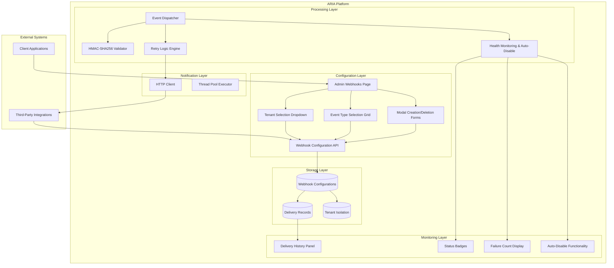
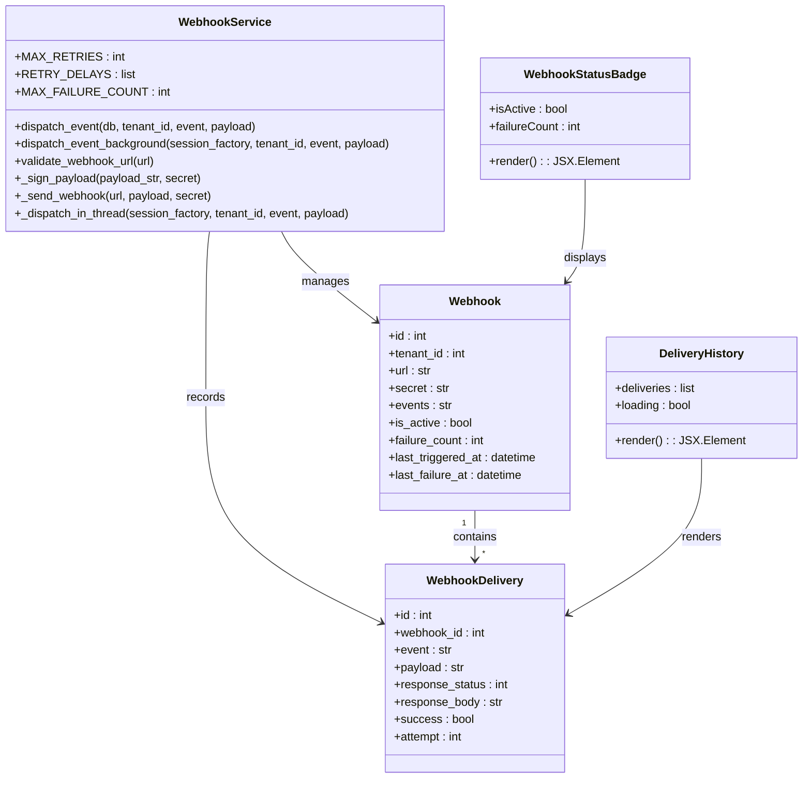
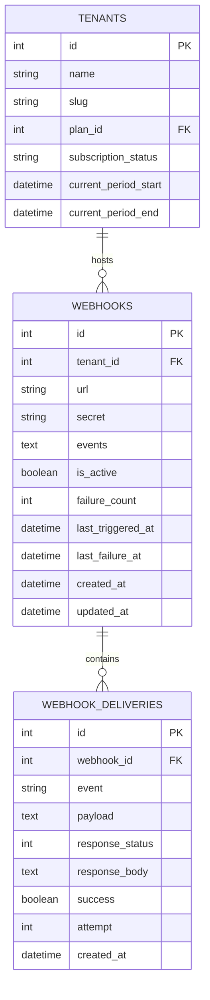
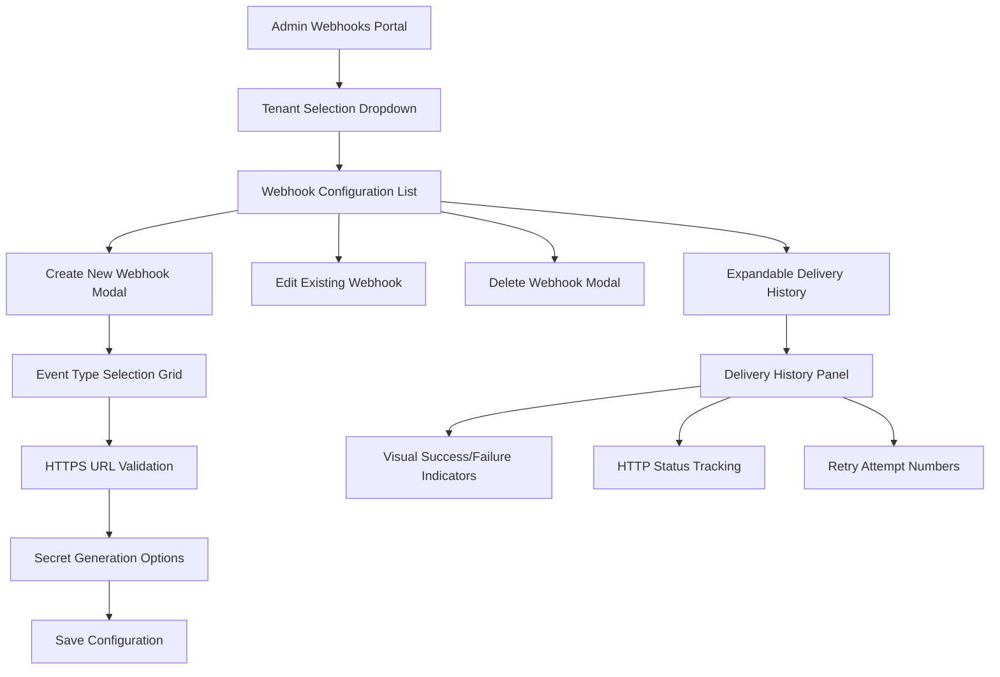
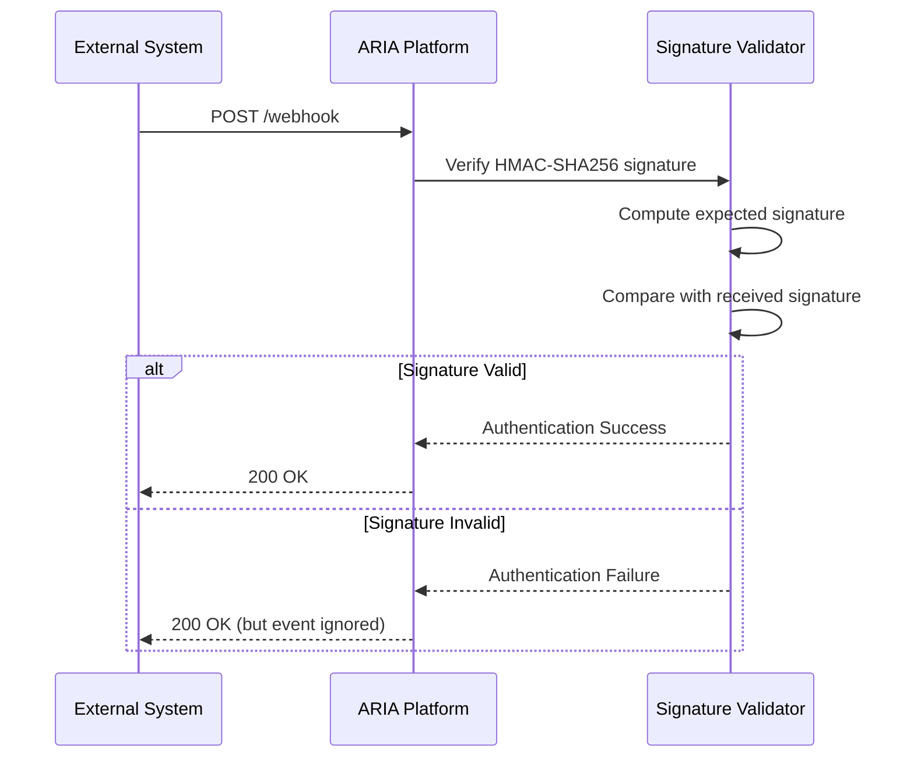
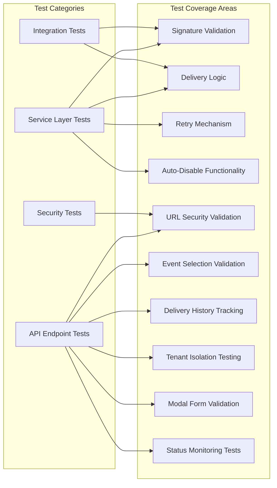

# Webhook Configuration

<cite>
**Referenced Files in This Document**
- [webhook_docs.py](file://app/backend/routes/webhook_docs.py)
- [webhook_service.py](file://app/backend/services/webhook_service.py)
- [013_webhooks_and_notifications.py](file://alembic/versions/013_webhooks_and_notifications.py)
- [WebhooksPage.jsx](file://app/frontend/src/pages/admin/WebhooksPage.jsx)
- [test_webhooks.py](file://app/backend/tests/test_webhooks.py)
- [test_billing_webhooks.py](file://app/backend/tests/test_billing_webhooks.py)
- [db_models.py](file://app/backend/models/db_models.py)
- [webhook_processor.py](file://app/backend/services/billing/webhook_processor.py)
- [main.py](file://app/backend/main.py)
- [api.js](file://app/frontend/src/lib/api.js)
- [admin.py](file://app/backend/routes/admin.py)
</cite>

## Update Summary
**Changes Made**
- Enhanced WebhooksPage.jsx with comprehensive per-tenant management capabilities
- Added sophisticated event selection with wildcard support and individual event filtering
- Implemented delivery history tracking with visual indicators and expandable panels
- Integrated modal dialogs for webhook creation and deletion with form validation
- Introduced status badges for webhook health monitoring with auto-disable functionality
- Added tenant selection dropdown for multi-tenant administration with contextual actions
- Enhanced backend API endpoints for tenant-specific webhook management
- Improved frontend API integration with comprehensive error handling and loading states

## Table of Contents
1. [Introduction](#introduction)
2. [System Architecture](#system-architecture)
3. [Core Components](#core-components)
4. [Database Schema](#database-schema)
5. [Frontend Administration](#frontend-administration)
6. [Event Types and Payloads](#event-types-and-payloads)
7. [Security and Validation](#security-and-validation)
8. [Testing Strategy](#testing-strategy)
9. [Deployment and Configuration](#deployment-and-configuration)
10. [Troubleshooting Guide](#troubleshooting-guide)

## Introduction

The Webhook Configuration system in ARIA provides a comprehensive event-driven architecture for notifying external systems about important platform events. This system enables real-time integration with third-party applications, allowing subscribers to receive automated updates about tenant activities, billing events, and system notifications.

The webhook system consists of three main components: a tenant-facing configuration interface, a robust delivery service with retry logic and security validation, and comprehensive event type definitions with HMAC-SHA256 signature verification.

**Updated** The system now features enhanced per-tenant management with comprehensive event selection capabilities, delivery history tracking, and advanced monitoring tools. The WebhooksPage.jsx has been significantly expanded to provide a complete administrative interface for managing webhooks across multiple tenants.

## System Architecture

The webhook system follows a multi-layered architecture designed for reliability, security, and scalability:



**Diagram sources**
- [webhook_service.py:1-186](file://app/backend/services/webhook_service.py#L1-L186)
- [WebhooksPage.jsx:1-594](file://app/frontend/src/pages/admin/WebhooksPage.jsx#L1-L594)
- [db_models.py:491-525](file://app/backend/models/db_models.py#L491-L525)
- [admin.py:1556-1660](file://app/backend/routes/admin.py#L1556-L1660)

## Core Components

### Webhook Service Engine

The core webhook service provides the foundation for event dispatch and delivery management:



**Diagram sources**
- [webhook_service.py:1-186](file://app/backend/services/webhook_service.py#L1-L186)
- [db_models.py:491-525](file://app/backend/models/db_models.py#L491-L525)
- [WebhooksPage.jsx:42-50](file://app/frontend/src/pages/admin/WebhooksPage.jsx#L42-L50)
- [WebhooksPage.jsx:286-326](file://app/frontend/src/pages/admin/WebhooksPage.jsx#L286-L326)

**Section sources**
- [webhook_service.py:1-186](file://app/backend/services/webhook_service.py#L1-L186)

### Event Type Registry

The system maintains a comprehensive registry of supported event types with detailed descriptions and example payloads:

| Event Category | Event Type | Description |
|---|---|---|
| Subscription Management | `subscription.changed` | Fired when tenant subscription plan or status changes |
| Usage Monitoring | `usage.threshold_reached` | Fired when tenant reaches usage quota thresholds |
| Billing Operations | `dunning.started` | Fired when payment fails and dunning retry process begins |
| Billing Operations | `dunning.resolved` | Fired when dunning is resolved after successful payment |
| Billing Operations | `dunning.exhausted` | Fired when all dunning retries are exhausted |
| Account Management | `tenant.suspended` | Fired when tenant account is suspended |
| Account Management | `tenant.reactivated` | Fired when suspended tenant is reactivated |

**Section sources**
- [webhook_docs.py:12-74](file://app/backend/routes/webhook_docs.py#L12-L74)

## Database Schema

The webhook system utilizes a normalized database schema designed for efficient storage and retrieval of webhook configurations and delivery history:



**Diagram sources**
- [db_models.py:491-525](file://app/backend/models/db_models.py#L491-L525)
- [013_webhooks_and_notifications.py:40-88](file://alembic/versions/013_webhooks_and_notifications.py#L40-L88)

**Section sources**
- [db_models.py:491-525](file://app/backend/models/db_models.py#L491-L525)
- [013_webhooks_and_notifications.py:36-136](file://alembic/versions/013_webhooks_and_notifications.py#L36-L136)

## Frontend Administration

**Updated** The administrative interface now provides comprehensive per-tenant webhook management with advanced features and enhanced user experience:



**Diagram sources**
- [WebhooksPage.jsx:329-594](file://app/frontend/src/pages/admin/WebhooksPage.jsx#L329-L594)

### Enhanced Tenant Management

The new interface features comprehensive tenant selection with dropdown navigation and per-tenant webhook isolation:

- **Tenant Selection**: Dropdown menu for choosing between multiple tenants with loading states and error handling
- **Per-Tenant Isolation**: Webhooks are managed separately for each tenant with automatic context switching
- **Contextual Actions**: Create button only appears when tenant is selected, preventing accidental operations
- **Tenant Loading States**: Skeleton loaders during tenant data fetching for improved user experience

### Advanced Event Selection

The webhook creation process now includes sophisticated event filtering with comprehensive validation:

- **Wildcard Support**: `*` selects all available events with immediate validation feedback
- **Individual Event Selection**: Checkbox grid with event descriptions and usage context
- **Real-time Validation**: Form prevents submission without event selection and provides immediate feedback
- **Event Grid Layout**: Responsive grid layout with hover effects and visual feedback
- **Event Descriptions**: Each event displays its purpose and usage context for better understanding

### Delivery History Visualization

Comprehensive delivery tracking with sophisticated visual indicators and interactive panels:

- **Expandable Panels**: Click to reveal detailed delivery history with smooth animations
- **Success/Failure Icons**: Green check for successful deliveries, red X for failures with visual distinction
- **Timestamp Display**: Shows when deliveries occurred with localized formatting
- **HTTP Status Codes**: Displays response codes for debugging and troubleshooting
- **Attempt Numbers**: Tracks retry attempts for failed deliveries with clear numbering
- **Loading States**: Skeleton loaders during delivery history fetching
- **Empty State Handling**: Friendly messages when no delivery history exists

### Status Monitoring

Real-time webhook health monitoring with comprehensive status indicators:

- **Active Status**: Green badge for operational webhooks with "Active" label
- **Failing Status**: Red badge for webhooks with excessive failures (more than 3) with "Failing" label
- **Disabled Status**: Gray badge for manually disabled webhooks with "Disabled" label
- **Failure Count Display**: Shows total failure count for quick assessment and prioritization
- **Last Triggered Display**: Shows when webhooks were last triggered for monitoring purposes
- **Dynamic Status Updates**: Real-time status updates based on webhook performance

### Modal Dialog System

Enhanced modal dialogs with comprehensive form validation and user feedback:

- **Create Webhook Modal**: Full-featured modal with URL validation, secret generation, and event selection
- **Delete Confirmation Modal**: Secure confirmation dialog with error handling and loading states
- **Form Validation**: Real-time validation with immediate error feedback
- **Secret Generation**: Automatic secret generation with manual override option
- **Loading States**: Disabled states during API operations with spinner indicators
- **Error Handling**: Comprehensive error display with user-friendly messages

**Section sources**
- [WebhooksPage.jsx:1-594](file://app/frontend/src/pages/admin/WebhooksPage.jsx#L1-L594)

## Event Types and Payloads

### Subscription Changed Event

The most critical event type notifies subscribers about subscription status changes:

**Payload Structure:**
```json
{
  "event": "subscription.changed",
  "timestamp": "2026-01-15T10:30:00Z",
  "tenant_id": 123,
  "data": {
    "subscription_status": "active",
    "changed_at": "2026-01-15T10:30:00Z"
  }
}
```

**Section sources**
- [webhook_docs.py:14-21](file://app/backend/routes/webhook_docs.py#L14-L21)
- [webhook_processor.py:97-111](file://app/backend/services/billing/webhook_processor.py#L97-L111)

### Usage Threshold Reached Event

Monitors tenant usage against configured quotas:

**Payload Structure:**
```json
{
  "event": "usage.threshold_reached",
  "timestamp": "2026-01-15T10:30:00Z",
  "tenant_id": 123,
  "data": {
    "metric": "analyses_per_month",
    "threshold_percent": 80,
    "current_value": 80,
    "limit": 100
  }
}
```

**Section sources**
- [webhook_docs.py:24-32](file://app/backend/routes/webhook_docs.py#L24-L32)

### Dunning Process Events

Handles payment retry workflows with comprehensive status tracking:

**Dunning Started Payload:**
```json
{
  "event": "dunning.started",
  "timestamp": "2026-01-15T10:30:00Z",
  "tenant_id": 123,
  "data": {
    "failure_reason": "card_declined",
    "retry_count": 1
  }
}
```

**Dunning Resolved Payload:**
```json
{
  "event": "dunning.resolved",
  "timestamp": "2026-01-15T10:30:00Z",
  "tenant_id": 123,
  "data": {
    "resolved_at": "2026-01-15T10:30:00Z"
  }
}
```

**Section sources**
- [webhook_docs.py:35-58](file://app/backend/routes/webhook_docs.py#L35-L58)

## Security and Validation

### HMAC-SHA256 Signature Verification

All webhook deliveries include cryptographic signature verification to ensure message authenticity:



**Diagram sources**
- [webhook_service.py:21-23](file://app/backend/services/webhook_service.py#L21-L23)

**Section sources**
- [webhook_service.py:21-23](file://app/backend/services/webhook_service.py#L21-L23)
- [webhook_docs.py:76-84](file://app/backend/routes/webhook_docs.py#L76-L84)

### URL Validation and Security

The system enforces strict URL validation policies to prevent security vulnerabilities:

**Validation Rules:**
- Only HTTPS URLs are permitted
- Localhost URLs (localhost, 127.0.0.1, ::1) are blocked
- Private IP ranges are prohibited
- Reserved IP addresses are rejected
- Malformed URLs trigger validation failures

**Section sources**
- [webhook_service.py:160-186](file://app/backend/services/webhook_service.py#L160-L186)

## Testing Strategy

### Unit Testing Framework

The webhook system includes comprehensive test coverage ensuring reliability and correctness:



**Diagram sources**
- [test_webhooks.py:1-340](file://app/backend/tests/test_webhooks.py#L1-L340)
- [test_billing_webhooks.py:1-703](file://app/backend/tests/test_billing_webhooks.py#L1-L703)

**Section sources**
- [test_webhooks.py:1-340](file://app/backend/tests/test_webhooks.py#L1-L340)
- [test_billing_webhooks.py:1-703](file://app/backend/tests/test_billing_webhooks.py#L1-L703)

### Key Test Scenarios

| Test Category | Coverage Area | Test Methods |
|---|---|---|
| HMAC Signature | Deterministic signature generation | `_sign_payload` validation |
| Service Dispatch | Event filtering and delivery | Matching/non-matching events |
| Retry Logic | Failure handling and retry mechanism | MAX_RETRIES configuration |
| Auto-Disable | Consecutive failure detection | MAX_FAILURE_COUNT threshold |
| URL Validation | Security policy enforcement | HTTPS and IP validation |
| Event Selection | Multi-select validation | Wildcard and individual event selection |
| Delivery History | Visual indicator testing | Success/failure icon rendering |
| Tenant Isolation | Per-tenant data separation | Cross-tenant webhook isolation |
| Modal Validation | Form validation and error handling | URL validation, event selection |
| Status Monitoring | Health status calculation | Active/failing/disabled states |
| Billing Integration | Provider-specific event handling | Stripe, Razorpay, Manual providers |

**Section sources**
- [test_webhooks.py:44-61](file://app/backend/tests/test_webhooks.py#L44-L61)
- [test_webhooks.py:65-112](file://app/backend/tests/test_webhooks.py#L65-L112)
- [test_webhooks.py:176-198](file://app/backend/tests/test_webhooks.py#L176-L198)

## Deployment and Configuration

### Database Migration Management

The webhook system relies on Alembic migrations for schema management:

**Migration Features:**
- Atomic table creation for webhooks and webhook_deliveries
- Proper indexing for performance optimization
- Foreign key constraints for referential integrity
- Downgrade support for rollback scenarios
- Idempotent operations for safe repeated execution

**Section sources**
- [013_webhooks_and_notifications.py:36-136](file://alembic/versions/013_webhooks_and_notifications.py#L36-L136)

### API Integration Points

The webhook system integrates seamlessly with the main application through FastAPI routing:

**Integration Components:**
- Centralized router configuration in main application
- Modular route organization for maintainability
- Middleware integration for security and validation
- Background task execution for non-blocking operations

**Backend API Endpoints:**
- `GET /api/admin/tenants/{tenant_id}/webhooks` - List tenant webhooks
- `POST /api/admin/tenants/{tenant_id}/webhooks` - Create tenant webhook
- `DELETE /api/admin/tenants/{tenant_id}/webhooks/{webhook_id}` - Delete tenant webhook
- `GET /api/admin/tenants/{tenant_id}/webhooks/{webhook_id}/deliveries` - Get webhook deliveries

**Section sources**
- [main.py:427](file://app/backend/main.py#L427)
- [main.py:83](file://app/backend/main.py#L83)
- [admin.py:1556-1660](file://app/backend/routes/admin.py#L1556-L1660)

## Troubleshooting Guide

### Common Issues and Solutions

| Issue Category | Symptoms | Solution Steps |
|---|---|---|
| Delivery Failures | Webhook not reaching destination | Check URL validation, network connectivity, firewall rules, verify webhook is active |
| Signature Verification | Events being rejected | Verify shared secret configuration, check HMAC-SHA256 computation, validate signature header |
| Auto-Disable Activation | Webhook temporarily disabled | Review failure logs, address underlying issues, manually re-enable after fixing problems |
| Performance Degradation | Slow delivery times | Monitor retry patterns, optimize external endpoint performance, check webhook status |
| Authentication Problems | 401/403 errors | Verify HMAC-SHA256 configuration, check secret synchronization, validate signature computation |
| Storage Issues | Missing delivery records | Check database connectivity, review migration status, verify webhook is properly configured |
| Event Filtering Issues | Wrong events firing | Verify event selection in webhook configuration, check wildcard vs specific event settings |
| Tenant Isolation Problems | Cross-tenant webhook access | Check tenant selection dropdown and permissions, verify tenant context is correct |
| Delivery History Not Loading | Empty delivery panel | Verify webhook expansion and API connectivity, check tenant selection |
| Modal Form Errors | Validation failures | Check URL format, event selection, secret generation, verify form inputs are correct |
| Status Display Issues | Incorrect status badges | Check webhook failure counts, verify auto-disable thresholds, review status calculation logic |

### Monitoring and Debugging

**Key Metrics to Monitor:**
- Delivery success rates by webhook endpoint and tenant
- Average delivery latency per tenant
- Retry attempt distribution across webhooks
- Auto-disable activation frequency by tenant
- Signature verification failure rates
- Event selection accuracy across tenants
- Delivery history refresh intervals
- Tenant selection performance
- Modal form validation success rates

**Diagnostic Commands:**
- Check webhook configuration status for specific tenant
- Review recent delivery attempts with detailed error information
- Monitor retry queue depth and distribution
- Validate external endpoint availability and response times
- Audit security logs for signature validation failures
- Verify tenant isolation boundaries and permissions
- Test event selection filtering logic and wildcard matching
- Validate modal form validation and error handling
- Check status badge calculation and auto-disable logic

**Section sources**
- [webhook_service.py:114-130](file://app/backend/services/webhook_service.py#L114-L130)
- [test_webhooks.py:146-198](file://app/backend/tests/test_webhooks.py#L146-L198)