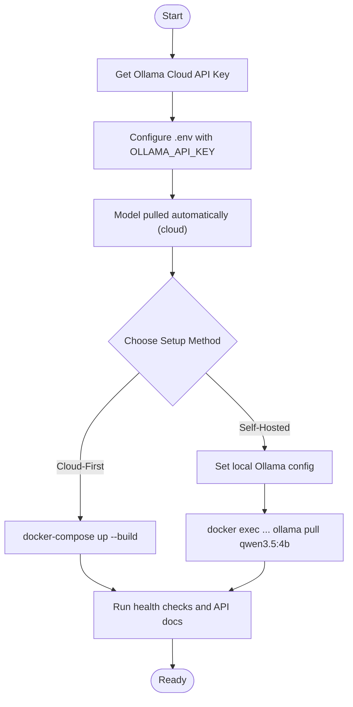

# Getting Started

<cite>
**Referenced Files in This Document**
- [README.md](file://README.md)
- [requirements.txt](file://requirements.txt)
- [package.json](file://app/frontend/package.json)
- [docker-compose.yml](file://docker-compose.yml)
- [docker-compose.prod.yml](file://docker-compose.prod.yml)
- [app/backend/main.py](file://app/backend/main.py)
- [app/backend/Dockerfile](file://app/backend/Dockerfile)
- [app/frontend/Dockerfile](file://app/frontend/Dockerfile)
- [app/backend/scripts/docker-entrypoint.sh](file://app/backend/scripts/docker-entrypoint.sh)
- [app/backend/scripts/wait_for_ollama.py](file://app/backend/scripts/wait_for_om/wait_for_ollama.py)
- [app/backend/services/llm_service.py](file://app/backend/services/llm_service.py)
- [app/nginx/nginx.conf](file://app/nginx/nginx.conf)
- [scripts/README.md](file://scripts/README.md)
- [ollama/setup-recruiter-model.sh](file://ollama/setup-recruiter-model.sh)
</cite>

## Update Summary
**Changes Made**
- Updated cloud-first setup instructions with Ollama Cloud as default configuration
- Added comprehensive environment configuration examples for both cloud and local deployment
- Enhanced guidance for Ollama Cloud API key setup and authentication
- Updated Docker Compose configurations to reflect cloud-first architecture
- Added troubleshooting guidance for cloud vs local deployment scenarios
- Revised workflow diagrams to show cloud deployment options

## Table of Contents
1. [Introduction](#introduction)
2. [Prerequisites](#prerequisites)
3. [Cloud-First Setup with Ollama Cloud](#cloud-first-setup-with-ollama-cloud)
4. [Local Ollama Setup (Self-Hosted)](#local-ollama-setup-self-hosted)
5. [Docker-Based Local Development](#docker-based-local-development)
6. [Environment Configuration](#environment-configuration)
7. [Development vs Production Environments](#development-vs-production-environments)
8. [Workflow: From Ollama Cloud to Running Locally](#workflow-from-ollama-cloud-to-running-locally)
9. [Verification Steps](#verification-steps)
10. [Troubleshooting Guide](#troubleshooting-guide)
11. [Conclusion](#conclusion)

## Introduction
This guide helps you set up Resume AI by ThetaLogics locally using the cloud-first approach with Ollama Cloud as the default option. You can choose between Ollama Cloud for instant setup or self-hosted Ollama for full data privacy. The platform runs entirely on your infrastructure with local LLM inference via Ollama, supporting both cloud and local deployment modes while maintaining backward compatibility.

## Prerequisites
- Docker 24.0+ and Docker Compose
- Ollama Cloud API key (required for cloud-first setup)
- Git

**Note:** Ollama Cloud is the default and recommended starting point. For self-hosted Ollama, see the Local Ollama section below.

**Section sources**
- [README.md:200-207](file://README.md#L200-L207)

## Cloud-First Setup with Ollama Cloud
The easiest way to get started is using Ollama Cloud, which provides instant access to powerful AI models without local hardware requirements.

### Step 1: Get Your Ollama Cloud API Key
1. Visit [ollama.com/settings/keys](https://ollama.com/settings/keys)
2. Generate a new API key
3. Copy the key for later use

### Step 2: Configure Environment Variables
```bash
# Copy the environment template
cp .env.example .env

# Edit .env and set your OLLAMA_API_KEY
OLLAMA_API_KEY=your_api_key_here
```

### Step 3: Start the Application
```bash
docker-compose up --build
```

**Important:** The local Ollama container will still start but won't be used. To disable it entirely, see the Production with Ollama Cloud section.

**Section sources**
- [README.md:208-224](file://README.md#L208-L224)
- [docker-compose.yml:61-75](file://docker-compose.yml#L61-L75)

## Local Ollama Setup (Self-Hosted)
For full data privacy and custom model training, deploy with self-hosted Ollama.

### Step 1: Update Environment Configuration
```bash
# Set local Ollama configuration
OLLAMA_BASE_URL=http://ollama:11434
OLLAMA_MODEL=qwen3.5:4b
OLLAMA_FAST_MODEL=qwen3.5:4b
LLM_NARRATIVE_TIMEOUT=180
# OLLAMA_API_KEY can be left empty for local
```

### Step 2: Pull the Required Model
```bash
# Pull the model into the running Ollama container
docker exec -it resume-screener-ollama ollama pull qwen3.5:4b
```

### Step 3: Restart Services
```bash
docker-compose up --build
```

**Requirements for Local Ollama:**
- 8GB+ RAM available for Docker
- GPU recommended (CPU inference supported but slower)

**Section sources**
- [README.md:225-261](file://README.md#L225-L261)
- [docker-compose.yml:24-51](file://docker-compose.yml#L24-L51)

## Docker-Based Local Development
Use Docker Compose to run all services together with the cloud-first configuration.

### Start the Stack
```bash
# Build and start all services
docker-compose up --build
```

### Services Overview
- Postgres database (development)
- Ollama Cloud (default) with API key authentication
- Backend service (FastAPI) with automatic cloud detection
- Frontend service (React) served by Nginx
- Nginx reverse proxy

**Section sources**
- [docker-compose.yml:5-108](file://docker-compose.yml#L5-L108)

## Environment Configuration
Configure environment variables for both cloud and local deployment scenarios.

### Required Environment Variables
| Variable | Description | Example |
|----------|-------------|---------|
| `OLLAMA_API_KEY` | Ollama Cloud API key (required for cloud) | `ollama_xxxxxxxxxxxxxxxx` |
| `OLLAMA_BASE_URL` | Ollama API endpoint | `https://ollama.com` or `http://ollama:11434` |
| `OLLAMA_MODEL` | Primary LLM model | `qwen3-coder:480b-cloud` or `qwen3.5:4b` |
| `OLLAMA_FAST_MODEL` | Fallback fast model | `qwen3-coder:480b-cloud` or `qwen3.5:4b` |
| `DATABASE_URL` | PostgreSQL connection string | `postgresql://aria:password@db:5432/aria_db` |
| `JWT_SECRET_KEY` | Secret for JWT signing | Generate with `openssl rand -hex 32` |

### Optional Environment Variables
| Variable | Default | Description |
|----------|---------|-------------|
| `CORS_ORIGINS` | `http://localhost,http://localhost:80` | Allowed CORS origins |
| `OLLAMA_STARTUP_REQUIRED` | `1` | Wait for Ollama on startup (auto-skipped for cloud) |
| `LLM_NARRATIVE_TIMEOUT` | `300` | LLM generation timeout (seconds) |
| `ENVIRONMENT` | `development` | Runtime environment |

**Section sources**
- [README.md:392-430](file://README.md#L392-L430)
- [docker-compose.yml:61-75](file://docker-compose.yml#L61-L75)
- [docker-compose.prod.yml:85-101](file://docker-compose.prod.yml#L85-L101)

## Development vs Production Environments
### Development Environment (Cloud-First)
- Uses Ollama Cloud by default with API key authentication
- Automatic cloud detection and startup skipping
- SQLite for development (in backend Dockerfile)
- Relaxed CORS for local development
- Port 80 exposed for local access

### Production Environment (Cloud-First)
- Uses Ollama Cloud with optimized settings
- Production-ready PostgreSQL with resource limits
- Dedicated warmup service for model loading
- Health checks and resource constraints
- SSL termination with Certbot

**Section sources**
- [docker-compose.yml:73-73](file://docker-compose.yml#L73-L73)
- [docker-compose.prod.yml:85-119](file://docker-compose.prod.yml#L85-L119)
- [app/backend/Dockerfile:41-42](file://app/backend/Dockerfile#L41-L42)

## Workflow: From Ollama Cloud to Running Locally
Follow this end-to-end process to get the system running with cloud-first architecture.



**Diagram sources**
- [README.md:208-224](file://README.md#L208-L224)
- [docker-compose.yml:61-75](file://docker-compose.yml#L61-L75)

## Verification Steps
Ensure everything is working correctly after setup.

### Health Checks
- Call the backend health endpoint to verify service connectivity
- Use the LLM status endpoint to confirm model readiness
- Check Ollama Cloud connectivity and model availability

### API Documentation
- Visit the API docs endpoint to explore available endpoints
- Test authentication endpoints for proper JWT handling

### Local Access
- Confirm frontend at http://localhost:80
- Verify backend API at http://localhost:8080
- Access health endpoints for monitoring

**Section sources**
- [app/backend/main.py:354-460](file://app/backend/main.py#L354-L460)
- [README.md:279-287](file://README.md#L279-L287)

## Troubleshooting Guide
Common issues and resolutions during cloud-first setup.

### Ollama Cloud Issues
- **API Key Invalid**: Generate a new API key from [ollama.com/settings/keys](https://ollama.com/settings/keys)
- **Cloud Connectivity**: Check network connectivity and firewall settings
- **Rate Limiting**: Monitor API usage and consider upgrading plan if needed

### Local Ollama Issues
- **Model Not Found**: Pull the model using `docker exec ... ollama pull qwen3.5:4b`
- **Cold Starts**: Use the warmup service or pre-load models into RAM
- **GPU Memory**: Ensure sufficient VRAM for model loading

### General Issues
- **Port Conflicts**: Change port mappings in docker-compose.yml if ports 80/443 are busy
- **Database Locks**: Restart services if experiencing SQLite concurrency issues
- **SSL Certificates**: Use Certbot for production deployments or disable SSL for development

**Section sources**
- [README.md:337-362](file://README.md#L337-L362)
- [docker-compose.yml:24-51](file://docker-compose.yml#L24-L51)
- [docker-compose.prod.yml:221-229](file://docker-compose.prod.yml#L221-L229)

## Conclusion
You now have flexible deployment options for Resume AI:

### Cloud-First Option (Recommended)
- **Instant Setup**: No local hardware required
- **Automatic Model Management**: Models handled by Ollama Cloud
- **Scalable Performance**: Cloud infrastructure handles scaling
- **Easy Maintenance**: No local model management

### Self-Hosted Option
- **Full Data Privacy**: All data stays on your infrastructure
- **Custom Model Training**: Support for Modelfile fine-tuning
- **Complete Control**: Full customization of deployment
- **Resource Requirements**: GPU/CPU resources needed

Choose the cloud-first setup for immediate productivity, or self-hosted Ollama for maximum data privacy and customization. Both approaches maintain full backward compatibility and support the same feature set.

**Section sources**
- [README.md:249-261](file://README.md#L249-L261)
- [app/backend/services/llm_service.py:15-33](file://app/backend/services/llm_service.py#L15-L33)