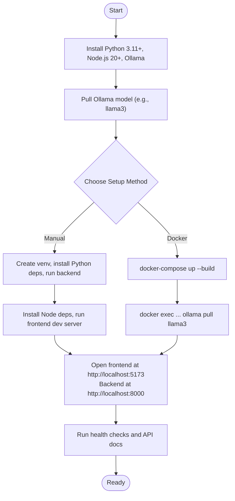

# Getting Started

<cite>
**Referenced Files in This Document**
- [README.md](file://README.md)
- [requirements.txt](file://requirements.txt)
- [package.json](file://app/frontend/package.json)
- [docker-compose.yml](file://docker-compose.yml)
- [docker-compose.prod.yml](file://docker-compose.prod.yml)
- [app/backend/main.py](file://app/backend/main.py)
- [app/backend/Dockerfile](file://app/backend/Dockerfile)
- [app/frontend/Dockerfile](file://app/frontend/Dockerfile)
- [app/backend/scripts/docker-entrypoint.sh](file://app/backend/scripts/docker-entrypoint.sh)
- [app/backend/scripts/wait_for_ollama.py](file://app/backend/scripts/wait_for_ollama.py)
- [app/nginx/nginx.conf](file://app/nginx/nginx.conf)
- [scripts/README.md](file://scripts/README.md)
- [ollama/setup-recruiter-model.sh](file://ollama/setup-recruiter-model.sh)
</cite>

## Table of Contents
1. [Introduction](#introduction)
2. [Prerequisites](#prerequisites)
3. [Local Development Setup](#local-development-setup)
4. [Docker-Based Local Development](#docker-based-local-development)
5. [Environment Configuration](#environment-configuration)
6. [Development vs Production Environments](#development-vs-production-environments)
7. [Workflow: From Ollama Model to Running Locally](#workflow-from-ollama-model-to-running-locally)
8. [Verification Steps](#verification-steps)
9. [Troubleshooting Guide](#troubleshooting-guide)
10. [Conclusion](#conclusion)

## Introduction
This guide helps you set up Resume AI by ThetaLogics locally, either manually or with Docker. You will install prerequisites, configure environment variables, install dependencies, and run the backend, frontend, and Ollama services. It also explains the differences between development and production environments and provides troubleshooting tips.

## Prerequisites
- Python 3.11+
- Node.js 20+
- Ollama (install from https://ollama.com)

These are required for both manual and Docker setups.

**Section sources**
- [README.md:56-65](file://README.md#L56-L65)

## Local Development Setup
Follow these steps to run the app without Docker.

### Step 1: Start Ollama
- Pull and start the Ollama service.
- After pulling the model, keep Ollama running in the background.

**Section sources**
- [README.md:61-65](file://README.md#L61-L65)

### Step 2: Backend Setup
- Create a Python virtual environment and activate it.
- Install Python dependencies from the requirements file.
- Navigate to the backend directory and run the FastAPI server with hot reload on port 8000.

**Section sources**
- [README.md:67-79](file://README.md#L67-L79)
- [requirements.txt:1-48](file://requirements.txt#L1-L48)

### Step 3: Frontend Setup
- Install Node.js dependencies.
- Start the frontend development server.

**Section sources**
- [README.md:81-86](file://README.md#L81-L86)
- [package.json:1-41](file://app/frontend/package.json#L1-L41)

### Step 4: Access the Application
- Open the frontend at http://localhost:5173.
- The backend API is available at http://localhost:8000.
- API docs are at http://localhost:8000/docs.

**Section sources**
- [README.md:88-91](file://README.md#L88-L91)

## Docker-Based Local Development
Use Docker Compose to run all services together.

### Start the Stack
- Build and start all services defined in the compose file.
- Pull the model inside the running Ollama container.

**Section sources**
- [README.md:95-107](file://README.md#L95-L107)
- [docker-compose.yml:101-105](file://docker-compose.yml#L101-L105)

### Services Overview
- Postgres database
- Ollama with configurable environment variables
- Backend service (FastAPI)
- Frontend service (built and served by Nginx)
- Nginx reverse proxy

**Section sources**
- [docker-compose.yml:5-101](file://docker-compose.yml#L5-L101)

## Environment Configuration
Configure environment variables for both manual and Docker setups.

### Backend Environment Variables
Key variables used by the backend include:
- OLLAMA_BASE_URL: Address of the Ollama service.
- OLLAMA_MODEL: The model used for analysis.
- OLLAMA_FAST_MODEL: The model used for faster tasks.
- DATABASE_URL: Connection string for the database.
- JWT_SECRET_KEY: Secret key for JWT tokens.
- ENVIRONMENT: Set to development or production.
- LLM_NARRATIVE_TIMEOUT: Timeout for narrative LLM calls.
- OLLAMA_STARTUP_REQUIRED: Whether to wait for Ollama readiness at startup.

These are set in the Docker Compose file for local development and in the production compose file for production.

**Section sources**
- [docker-compose.yml:59-69](file://docker-compose.yml#L59-L69)
- [docker-compose.yml:60-63](file://docker-compose.yml#L60-L63)
- [docker-compose.yml:65-67](file://docker-compose.yml#L65-L67)
- [docker-compose.yml:68-69](file://docker-compose.yml#L68-L69)
- [docker-compose.prod.yml:81-95](file://docker-compose.prod.yml#L81-L95)
- [app/backend/main.py:104-147](file://app/backend/main.py#L104-L147)

### Frontend Environment
- The frontend is built and served by Nginx in the Docker setup.
- For local development, the frontend runs independently on port 5173.

**Section sources**
- [app/frontend/Dockerfile:1-26](file://app/frontend/Dockerfile#L1-L26)
- [app/nginx/nginx.conf:9-36](file://app/nginx/nginx.conf#L9-L36)

### Backend Entrypoint and Startup Checks
- The backend entrypoint applies database migrations when using PostgreSQL and waits for Ollama readiness if configured.
- The backend performs startup checks to verify database connectivity, skills registry, and Ollama availability.

**Section sources**
- [app/backend/scripts/docker-entrypoint.sh:4-18](file://app/backend/scripts/docker-entrypoint.sh#L4-L18)
- [app/backend/main.py:68-149](file://app/backend/main.py#L68-L149)

## Development vs Production Environments
- Development environment:
  - Uses SQLite by default in the backend Dockerfile.
  - Sets ENVIRONMENT to development.
  - Relaxed CORS for local development.
  - Ports exposed for local access.

- Production environment:
  - Uses PostgreSQL with tuned settings.
  - Uses gemma4 models and sets OLLAMA_MODEL and OLLAMA_FAST_MODEL accordingly.
  - Sets ENVIRONMENT to production.
  - Includes health checks, resource limits, and a dedicated warmup service.

**Section sources**
- [app/backend/Dockerfile:29-32](file://app/backend/Dockerfile#L29-L32)
- [docker-compose.yml:67-67](file://docker-compose.yml#L67-L67)
- [docker-compose.yml:189-190](file://app/backend/main.py#L189-L190)
- [docker-compose.prod.yml:22-33](file://docker-compose.prod.yml#L22-L33)
- [docker-compose.prod.yml:85-85](file://docker-compose.prod.yml#L85-L85)
- [docker-compose.prod.yml:91-91](file://docker-compose.prod.yml#L91-L91)
- [docker-compose.prod.yml:107-112](file://docker-compose.prod.yml#L107-L112)

## Workflow: From Ollama Model to Running Locally
Follow this end-to-end process to get the system running.

**Diagram sources**
- [README.md:56-107](file://README.md#L56-L107)
- [docker-compose.yml:101-105](file://docker-compose.yml#L101-L105)

## Verification Steps
Ensure everything is working correctly after setup.

- Health checks:
  - Call the backend health endpoint to verify database and Ollama connectivity.
  - Use the LLM status endpoint to confirm model readiness.

- API documentation:
  - Visit the API docs endpoint to explore available endpoints.

- Local access:
  - Confirm frontend and backend are reachable at the expected URLs.

**Section sources**
- [app/backend/main.py:228-259](file://app/backend/main.py#L228-L259)
- [app/backend/main.py:262-326](file://app/backend/main.py#L262-L326)
- [README.md:88-91](file://README.md#L88-L91)

## Troubleshooting Guide
Common issues and resolutions during setup.

- Ollama not responding:
  - Check container logs and pull the model if missing.

- Database locked errors:
  - SQLite does not support concurrent writes; restart the backend container.

- SSL certificate issues:
  - Renew certificates and restart Nginx.

- Deploy failures:
  - Review GitHub Actions logs for Docker Hub token, SSH keys, and firewall issues.

- Model not pulled or not hot:
  - Ensure the model is pulled and warmed in the Ollama container.

**Section sources**
- [README.md:337-362](file://README.md#L337-L362)
- [docker-compose.yml:27-32](file://docker-compose.yml#L27-L32)
- [docker-compose.prod.yml:66-71](file://docker-compose.prod.yml#L66-L71)

## Conclusion
You now have two paths to run Resume AI locally:
- Manual setup: Python virtual environment, Node.js, and Docker Compose.
- Docker-based setup: All services orchestrated via Docker Compose.

Follow the workflow and verification steps to ensure a smooth onboarding experience. For production, refer to the production deployment steps and environment configuration.