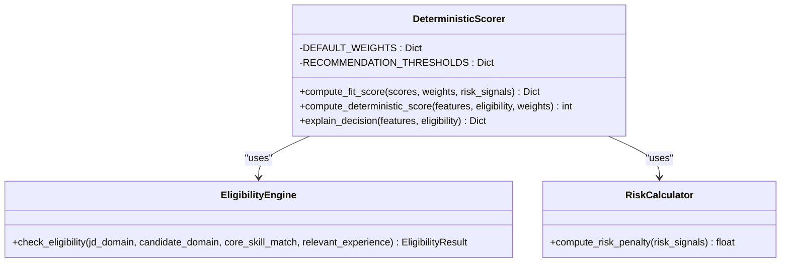
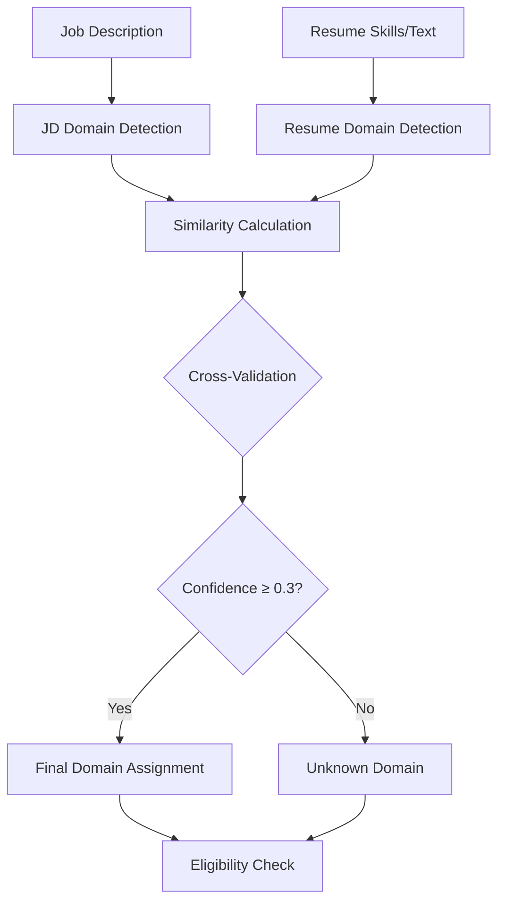
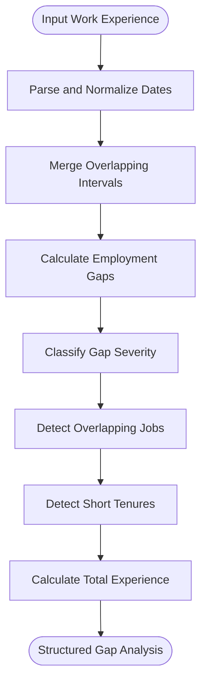
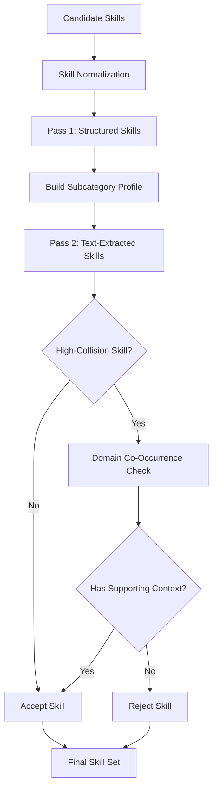
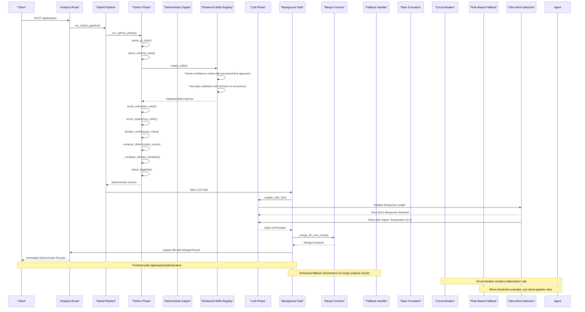
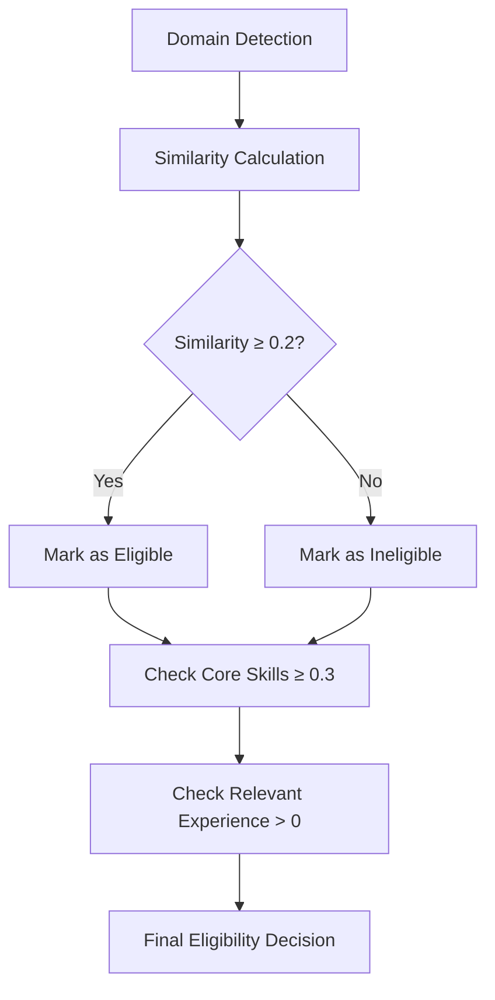
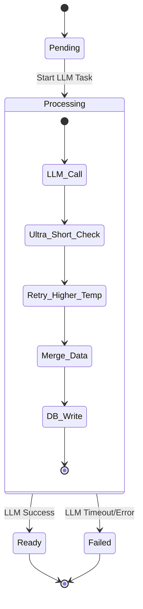
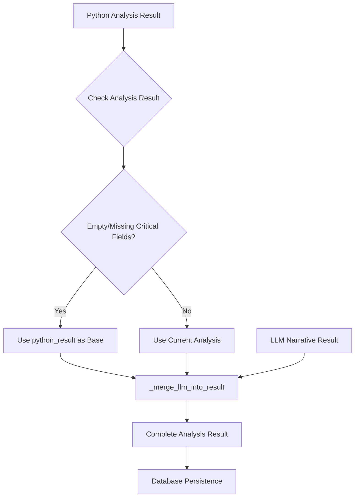
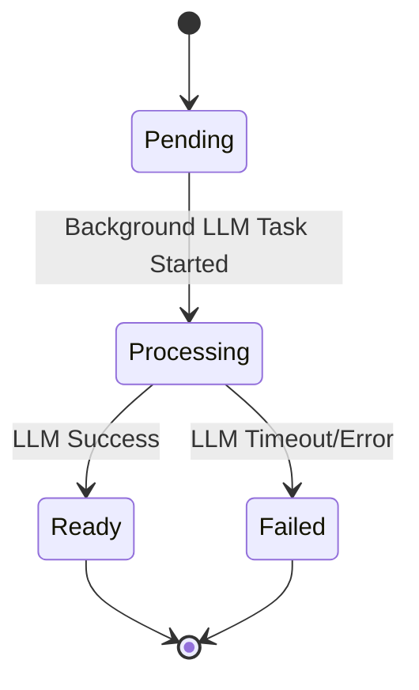

# Hybrid Pipeline

<cite>
**Referenced Files in This Document**
- [hybrid_pipeline.py](file://app/backend/services/hybrid_pipeline.py)
- [eligibility_service.py](file://app/backend/services/eligibility_service.py)
- [domain_service.py](file://app/backend/services/domain_service.py)
- [fit_scorer.py](file://app/backend/services/fit_scorer.py)
- [skill_matcher.py](file://app/backend/services/skill_matcher.py)
- [analyze.py](file://app/backend/routes/analyze.py)
- [test_hybrid_pipeline.py](file://app/backend/tests/test_hybrid_pipeline.py)
- [test_eligibility_service.py](file://app/backend/tests/test_eligibility_service.py)
</cite>

## Update Summary
**Changes Made**
- **Added similarity-based domain matching**: Implemented `_compute_domain_similarity` function that mirrors eligibility service implementation for cosine similarity calculations
- **Updated Python phase processing**: Modified domain matching logic to use similarity calculations instead of simple domain name matching
- **Enhanced eligibility gates**: Integrated similarity-based domain matching into the eligibility checking system with configurable thresholds
- **Improved domain detection accuracy**: Added sophisticated vector-based similarity calculations for better domain classification
- **Added comprehensive testing**: Included unit tests for similarity calculations and eligibility service integration

## Table of Contents
1. [Introduction](#introduction)
2. [System Architecture](#system-architecture)
3. [Core Components](#core-components)
4. [Hybrid Pipeline Implementation](#hybrid-pipeline-implementation)
5. [Enhanced Domain Matching System](#enhanced-domain-matching-system)
6. [Background Processing](#background-processing)
7. [Status Tracking and Polling](#status-tracking-and-polling)
8. [API Integration](#api-integration)
9. [Testing Framework](#testing-framework)
10. [Performance Considerations](#performance-considerations)
11. [Troubleshooting Guide](#troubleshooting-guide)
12. [Conclusion](#conclusion)

## Introduction

The Hybrid Pipeline represents a sophisticated resume analysis system that combines the speed and reliability of pure Python processing with the contextual understanding of Large Language Models (LLMs). This architecture optimizes for both performance and accuracy by implementing a two-phase analysis approach: a fast Python-based scoring phase followed by an LLM-powered narrative generation phase.

**Updated** The system has undergone significant enhancements to address domain matching accuracy through the introduction of similarity-based domain matching. The new `_compute_domain_similarity` function implements cosine similarity calculations between job description and candidate domain score vectors, mirroring the eligibility service's approach. This enhancement provides more nuanced domain classification beyond simple name matching, enabling better discrimination between related domains like embedded systems and hardware engineering.

The system processes resumes and job descriptions through a carefully designed pipeline that extracts meaningful insights while maintaining sub-second response times for initial scoring results. The LLM component handles the generation of comprehensive narratives, strengths, weaknesses, and interview recommendations, ensuring that recruiters receive both quantitative scores and qualitative insights.

## System Architecture

The Hybrid Pipeline follows a layered architecture that separates concerns between computational efficiency and intelligent analysis:

```mermaid
graph TB
subgraph "Frontend Layer"
FE[Web Interface]
API[FastAPI Routes]
NP[Narrative Polling]
CH[Candidate History Views]
STREAM[Streaming Operations]
END
subgraph "Processing Layer"
Parser[Resume Parser]
Gap[Gap Detector]
Hybrid[Hybrid Pipeline]
Agent[Agent Pipeline]
END
subgraph "Analysis Layer"
Skills[Enhanced Skills Registry]
LLM[LLM Services]
Cache[JD Cache]
CB[Circuit Breaker]
RuleBased[Rule-Based Fallback]
END
subgraph "Data Layer"
DB[(PostgreSQL Database)]
AR[Analysis Result Storage]
NR[Narrative Result Storage]
STATUS[Status Tracking]
TRUNC[Data Truncation]
END
subgraph "Deployment Layer"
Cloud[Cloud Deployment]
Local[Local Deployment]
END
FE --> API
API --> Parser
API --> Gap
API --> Hybrid
API --> Agent
API --> STREAM
Hybrid --> Skills
Hybrid --> LLM
Agent --> LLM
Agent --> CB
Agent --> RuleBased
Hybrid --> Cache
Agent --> Cache
Parser --> DB
Gap --> DB
Hybrid --> DB
Agent --> DB
DB --> AR
DB --> NR
DB --> STATUS
DB --> TRUNC
CH --> API
NP --> API
STREAM --> API
Cloud --> LLM
Local --> LLM
CB -.-> Agent
RuleBased -.-> Agent
```

**Diagram sources**
- [analyze.py:1-1201](file://app/backend/routes/analyze.py#L1-L1201)
- [hybrid_pipeline.py:1-1875](file://app/backend/services/hybrid_pipeline.py#L1-L1875)
- [domain_service.py:1-80](file://app/backend/services/domain_service.py#L1-L80)

The architecture implements several key design principles:

- **Layered Processing**: Each component has a specific responsibility, enabling modular maintenance and testing
- **Caching Strategy**: Shared caches reduce redundant computations across multiple requests
- **Background Processing**: Long-running LLM tasks don't block the main request-response cycle
- **Environment-Aware Configuration**: Intelligent detection of cloud vs local deployment for optimal parameter tuning
- **Enhanced Status Tracking**: Four-state status system (pending, processing, ready, failed) with proper state transitions
- **Adaptive Polling**: Intelligent polling architecture with exponential backoff and retry mechanisms
- **Simplified Error Handling**: Streamlined error reporting with fallback mechanisms and user-friendly messaging
- **Advanced JSON Parsing**: Enhanced error handling with position tracking and character context for parsing failures
- **Data Persistence Enhancement**: Complete report data persistence through LLM result merging
- **Streaming Error Handling**: Robust error handling for streaming operations with graceful degradation
- **Fallback Mechanisms**: Comprehensive fallback handling for empty analysis results and missing critical fields
- **Data Truncation Protection**: Automatic truncation of candidate profile data to prevent database constraint violations
- **Circuit Breaker Integration**: Hybrid pipeline serves as fallback for hallucination detection in agent pipeline
- **Enhanced Rule-Based Parsing**: Improved skill extraction with bidirectional substring matching and fuzzy logic
- **Structured-First Approach**: Tiered confidence model prioritizing structured skills over text-scanned skills
- **Sophisticated Collision Detection**: Automated high-collision skill validation preventing false positives
- **Similarity-Based Domain Matching**: Enhanced domain classification using cosine similarity calculations

## Core Components

### Deterministic Scoring Engine

**Updated** The new centralized scoring system in fit_scorer.py provides a robust, deterministic approach to candidate evaluation with hard caps and structured risk management.



**Diagram sources**
- [fit_scorer.py:12-231](file://app/backend/services/fit_scorer.py#L12-L231)
- [eligibility_service.py:17-80](file://app/backend/services/eligibility_service.py#L17-L80)

The scoring engine implements three-tier evaluation:

**Tier 1: Eligibility Gates**
- Domain mismatch detection with confidence thresholds
- Core skill match minimum requirements (30% threshold)
- Relevant experience validation
- Hard rejection with structured reasons

**Tier 2: Deterministic Feature Scoring**
- Weighted feature combination with configurable splits
- Hard caps based on eligibility and feature quality
- Predictable score ranges (0-100)

**Tier 3: Risk Management**
- Structured risk signal detection
- Penalty calculation with diminishing returns
- Recommendation threshold enforcement

### Enhanced Domain Detection

**Updated** The domain detection service provides confidence-based domain classification with cross-validation between job descriptions and candidate profiles using similarity calculations.



**Diagram sources**
- [domain_service.py:9-80](file://app/backend/services/domain_service.py#L9-L80)
- [eligibility_service.py:38-55](file://app/backend/services/eligibility_service.py#L38-L55)

The domain detection system provides:
- Minimum confidence threshold (0.3) for reliable assignments
- Per-domain match density calculations
- Structured confidence scoring for transparency
- Cross-validation between JD and resume domains using cosine similarity
- **New**: Similarity-based domain matching with configurable thresholds

### Gap Detection Engine

The Gap Detector performs mechanical date analysis to identify employment gaps, overlapping jobs, and short tenures without applying subjective judgments.



**Diagram sources**
- [gap_detector.py:103-219](file://app/backend/services/gap_detector.py#L103-L219)

The gap detection algorithm implements interval merging to prevent double-counting of overlapping employment periods and provides objective classifications for gap severity thresholds.

### Enhanced Skills Registry System

**Updated** The enhanced skills registry system now features a comprehensive domain-clustered taxonomy and sophisticated two-pass validation to prevent false positives.



**Diagram sources**
- [skill_matcher.py:735-852](file://app/backend/services/skill_matcher.py#L735-L852)

The enhanced skills registry provides:

**Domain-Clustered Taxonomy**: Organized skills into 17 specialized domains including programming languages, web development, databases, cloud platforms, AI/ML, data engineering, and more.

**Tiered Confidence Model**: 
- Tier 0: Structured skills from candidate profiles (HIGH confidence, always accepted)
- Tier 1: Alias-expanded skills with bidirectional matching
- Tier 2: Text-scanned skills (LOW confidence, require domain validation)

**Two-Pass Validation System**: 
- Pass 1 validates structured skills from candidate profiles (always accepted)
- Pass 2 validates text-extracted skills with domain co-occurrence requirements
- High-collision skills require supporting subcategory context to prevent false positives

**High-Collision Skill Management**: Skills like "railway", "rtos", "r", "go", and "c" require domain-specific context to avoid misclassification.

**Enhanced Matching Algorithm**: Improved bidirectional substring matching with domain-aware validation to prevent false positives like "Java" matching "JavaScript".

## Hybrid Pipeline Implementation

### Two-Phase Architecture

**Updated** The hybrid pipeline now operates as a streamlined orchestrator that delegates complex scoring to the new deterministic framework while maintaining the original two-phase approach with enhanced validation systems and similarity-based domain matching.



**Diagram sources**
- [analyze.py:442-667](file://app/backend/routes/analyze.py#L442-L667)
- [hybrid_pipeline.py:1263-1418](file://app/backend/services/hybrid_pipeline.py#L1263-L1418)
- [hybrid_pipeline.py:1470-1642](file://app/backend/services/hybrid_pipeline.py#L1470-L1642)
- [eligibility_service.py:53-123](file://app/backend/services/eligibility_service.py#L53-L123)

### Phase 1: Python Processing (1-2 seconds)

**Updated** The first phase executes entirely in Python, providing immediate results with comprehensive scoring through the new deterministic framework and enhanced skills validation:

**JD Analysis Components:**
- **Role Title Extraction**: Identifies job titles using pattern matching and linguistic analysis
- **Experience Requirements**: Parses minimum years of experience from job descriptions
- **Domain Classification**: Categorizes roles into backend, frontend, data science, ML/AI, DevOps, embedded, mobile, management, etc.
- **Seniority Assessment**: Determines junior, mid, senior, or lead based on title and experience
- **Skill Separation**: Distinguishes required skills from nice-to-have skills

**Enhanced Skill Matching Engine:**
- **Tiered Confidence Model**: Implements structured-first approach with three tiers of skill validation
- **Bidirectional Substring Matching**: Improved algorithm prevents false positives like "Java" matching "JavaScript"
- **Fuzzy Matching**: Enhanced rapidfuzz integration with 88% threshold for approximate string matching
- **Alias Expansion**: Comprehensive alias handling with proper normalization
- **Raw Text Scanning**: Additional skill extraction from resume text using flashtext processor
- **Two-Pass Validation**: Sophisticated domain co-occurrence validation for high-collision skills
- **Structured Skills Acceptance**: Skills from candidate profiles bypass validation (always accepted)

**Candidate Profile Building:**
- **Contact Information Extraction**: Name, email, phone, LinkedIn from resume
- **Work Experience Parsing**: Extracts job titles, companies, dates, and descriptions
- **Education Analysis**: Degree, field, institution, graduation year
- **Skill Identification**: Extracts technical skills using enhanced skills registry

**Enhanced Deterministic Scoring:**
**Updated** The new scoring system replaces the previous complex weighting approach with a three-tier deterministic evaluation:

**Eligibility Gates (Hard Rejection):**
- Domain mismatch detection with confidence thresholds
- Core skill match minimum (30% threshold)
- Relevant experience validation
- Structured rejection reasons with confidence scores

**Enhanced Domain Similarity Matching:**
**New** The system now computes domain similarity using cosine similarity between JD and candidate domain score vectors:
- Vector-based similarity calculation using `_compute_domain_similarity`
- Fallback to binary name comparison when score vectors are unavailable
- Configurable similarity threshold (0.2) for domain mismatch detection
- Integration with eligibility checking system

**Feature Scoring (Weighted Combination):**
- Configurable weight distribution for features
- Hard caps based on eligibility and feature quality
- Predictable score ranges (0-100)
- Diminishing returns for extreme values

**Risk Management (Penalty Calculation):**
- Structured risk signal detection
- Penalty calculation with diminishing returns
- Recommendation threshold enforcement

**Enhanced Data Truncation Protection**: The Python phase now includes automatic truncation of current role and company information to 255 characters to prevent database constraint violations. When truncation occurs, warning logs are generated to alert administrators of potential data loss. This ensures database integrity while maintaining complete analysis functionality.

### Phase 2: LLM Processing (40+ seconds)

**Updated** The second phase generates comprehensive narratives and recommendations with enhanced fallback mechanisms:

**LLM Capabilities:**
- **Strengths Analysis**: Identifies candidate strengths and achievements
- **Weaknesses Identification**: Highlights potential areas of concern
- **Recommendation Rationale**: Provides detailed explanation for fit recommendations
- **Interview Questions**: Generates targeted technical, behavioral, and culture-fit questions
- **Risk Assessment**: Documents potential risks and mitigation strategies

**Enhanced Fallback System**: When LLM processing fails or times out, the system automatically generates a deterministic fallback narrative using the Python phase results. The retry mechanism now includes intelligent cloud detection and parameter optimization.

**Enhanced Data Merging**: The new `_merge_llm_into_result` function ensures that LLM-generated narrative data is seamlessly integrated with existing analysis results, creating complete reports that persist in the database even when LLM processing encounters issues.

**Enhanced Fallback Mechanisms**: The system now includes comprehensive fallback handling for cases where analysis_result becomes empty or missing critical fields. When this occurs, the system uses python_result as the base for narrative merge, ensuring complete report data remains available.

**Enhanced Error Handling**: The streaming operations now feature improved timeout management and graceful degradation. The system handles LLM timeouts and errors more robustly, providing fallback narratives and maintaining system stability.

**Enhanced Ultra-Short Response Detection**: The system now includes comprehensive ultra-short response detection to prevent malformed JSON parsing errors. When LLM responses are empty, whitespace-only, or ultra-short (< 20 characters), the system automatically retries with higher temperature (0.3) to generate valid JSON narratives. This enhancement ensures robust error handling and prevents system crashes from degenerate LLM outputs.

**Enhanced JSON Extraction and Validation**: The system implements multiple validation layers:
- **Length Validation**: Responses must be at least 20 characters long
- **Content Validation**: Checks for whitespace-only responses
- **JSON Extraction**: Automatic detection and extraction of balanced JSON objects
- **Retry Logic**: Higher temperature (0.3) for edge cases where LLM returns degenerate outputs
- **Diagnostic Logging**: Comprehensive logging for troubleshooting malformed responses

**Enhanced Fallback Mechanisms**: The system now includes comprehensive fallback handling for empty analysis results and missing critical fields. When this occurs, the system uses python_result as the base for narrative merge, ensuring complete report data remains available.

**Enhanced Error Handling**: The streaming operations now feature improved timeout management and graceful degradation. The system handles LLM timeouts and errors more robustly, providing fallback narratives and maintaining system stability.

**Enhanced Data Truncation Protection**: The system now includes automatic truncation of candidate profile data to prevent database constraint violations. Both the hybrid pipeline service and analyze route implement the same truncation logic to ensure comprehensive protection.

**Enhanced Status Tracking**: The system now includes comprehensive status tracking and adaptive polling architecture:
- **Four-State Status Tracking**: pending → processing → ready/failure states with proper transitions
- **Adaptive Polling**: Intelligent polling with exponential backoff (2s for first 30s, then 5s)
- **Background Task Management**: Robust task lifecycle with graceful shutdown and error recovery
- **Enhanced Error Reporting**: Detailed status messages and fallback mechanisms
- **Database Persistence**: Persistent status tracking across deployments and restarts
- **Complete Report Persistence**: Merged LLM data ensures full reports remain available in candidate history
- **Fallback Mechanism**: Systematic narrative merging using python_result as base when database persistence fails
- **Streaming Error Handling**: Robust error handling for streaming operations with graceful degradation
- **Data Truncation Protection**: Automatic truncation of candidate profile data to prevent database constraint violations

### Environment-Aware Configuration

The hybrid pipeline implements intelligent environment detection to optimize LLM parameters:

**Cloud Deployment Parameters:**
- num_predict: 4096 tokens (vs 512 for local) for handling verbose outputs from large cloud models
- num_ctx: 16384 tokens (vs 2048 for local) for complex reasoning and extended context
- Temperature: 0.1 for deterministic responses
- Authentication: Automatic API key header injection for Ollama Cloud deployments
- Model behavior: keep_alive disabled for cloud (models auto-unload)

**Local Deployment Parameters:**
- num_predict: 512 tokens (sufficient for narrative JSON)
- num_ctx: 2048 tokens (adequate for local processing)
- Temperature: 0.1 for deterministic responses
- Model behavior: keep_alive set to -1 (never unload) for performance

**Enhanced Logging:**
- Detailed initialization logs showing num_predict, num_ctx, and cloud detection status
- Warning messages when cloud deployment detected without API key
- Debug information for token setting optimization

**Enhanced JSON Parsing and Error Handling:**
- **Position Tracking**: Detailed logging of JSON parsing errors with character position information
- **Character Context**: Enhanced debugging with character context around parsing failures
- **Balanced Object Extraction**: Automatic detection and extraction of balanced JSON objects
- **Trailing Comma Fixes**: Automatic correction of common LLM JSON mistakes
- **Multiple Parsing Attempts**: Multiple strategies for extracting valid JSON from LLM responses

**Section sources**
- [hybrid_pipeline.py:97-147](file://app/backend/services/hybrid_pipeline.py#L97-L147)
- [hybrid_pipeline.py:1350-1365](file://app/backend/services/hybrid_pipeline.py#L1350-L1365)
- [hybrid_pipeline.py:1167-1235](file://app/backend/services/hybrid_pipeline.py#L1167-L1235)

## Enhanced Domain Matching System

### Cosine Similarity Implementation

**Updated** The new `_compute_domain_similarity` function implements sophisticated cosine similarity calculations between job description and candidate domain score vectors, mirroring the eligibility service's approach.

```mermaid
flowchart TD
JD_Domain[JD Domain Scores] --> VectorCalc[Vector Calculation]
JD_Domain --> BinaryCheck{Scores Available?}
BinaryCheck --> |Yes| VectorCalc
BinaryCheck --> |No| BinaryCompare[Binary Name Comparison]
VectorCalc --> DotProduct[Dot Product Calculation]
VectorCalc --> Magnitude[Magnitude Calculation]
DotProduct --> Similarity[Similarity = Dot/(|JD||Candidate|)]
Magnitude --> Similarity
BinaryCompare --> Similarity
Similarity --> Threshold{Similarity ≥ 0.2?}
Threshold --> |Yes| Accept[Accept Domain Match]
Threshold --> |No| Reject[Reject Domain Match]
```

**Diagram sources**
- [hybrid_pipeline.py:55-81](file://app/backend/services/hybrid_pipeline.py#L55-L81)
- [eligibility_service.py:23-50](file://app/backend/services/eligibility_service.py#L23-L50)

The similarity calculation provides:

**Vector-Based Similarity**: 
- Computes cosine similarity using score vectors from domain detection
- Handles empty score vectors with binary fallback comparison
- Rounds results to 3 decimal places for consistency

**Mathematical Foundation**:
- Dot product calculation: Σ(JD_score × Candidate_score) for all domains
- Magnitude calculation: √Σ(score²) for each domain vector
- Similarity: dot_product / (jd_magnitude × candidate_magnitude)

**Configurable Threshold**:
- Default similarity threshold: 0.2 for domain mismatch detection
- Used in eligibility checking to prevent inappropriate matches
- Allows fine-tuning for different domain relationships

### Eligibility Integration

**Updated** The similarity-based domain matching is integrated into the eligibility checking system with structured threshold validation.



**Diagram sources**
- [eligibility_service.py:53-123](file://app/backend/services/eligibility_service.py#L53-L123)
- [hybrid_pipeline.py:1321-1351](file://app/backend/services/hybrid_pipeline.py#L1321-L1351)

The eligibility integration provides:

**Multi-Level Validation**:
- Domain similarity threshold (0.2) for related domain detection
- Core skill match threshold (0.3) for minimum qualification
- Relevant experience validation for practical suitability

**Structured Reasoning**:
- Detailed eligibility reasons with confidence scores
- Domain similarity metrics for transparency
- Threshold-based decision making with clear rationale

**Enhanced Domain Classification**:
- Better discrimination between related domains (embedded vs hardware)
- Improved accuracy in domain mismatch detection
- Consistent behavior between Python phase and eligibility checking

### Similarity Calculation Functions

**Updated** The system now includes two complementary similarity calculation functions:

**Python Phase Similarity (`_compute_domain_similarity`)**:
- Used in Python phase for domain matching calculations
- Mirrors eligibility service implementation for consistency
- Returns similarity scores for deterministic scoring

**Eligibility Service Similarity (`_compute_domain_similarity_for_eligibility`)**:
- Dedicated function for eligibility checking
- Integrated with eligibility engine for hard rejection gates
- Provides structured similarity metrics for decision making

**Shared Implementation**:
- Both functions use identical mathematical approach
- Consistent threshold values (0.2) for domain mismatch detection
- Binary fallback mechanism for score vector unavailability
- Symmetric similarity calculations (sim(A,B) = sim(B,A))

**Enhanced Testing Framework**: Comprehensive test coverage validates the similarity calculations and eligibility integration:

**Similarity Calculation Tests**:
- Identical score vectors: similarity > 0.8
- Related domains: medium similarity (0.3-0.9)
- Unrelated domains: low similarity (< 0.2)
- Binary fallback: name match returns confidence, mismatch returns 0.0
- Zero magnitude vectors: returns 0.0
- Symmetric property validation

**Eligibility Integration Tests**:
- Similarity threshold validation (0.2)
- Domain mismatch detection with structured reasons
- Core skill and experience validation integration
- Confidence score preservation in eligibility results

**Section sources**
- [hybrid_pipeline.py:55-81](file://app/backend/services/hybrid_pipeline.py#L55-L81)
- [eligibility_service.py:23-50](file://app/backend/services/eligibility_service.py#L23-L50)
- [test_hybrid_pipeline.py:37-89](file://app/backend/tests/test_hybrid_pipeline.py#L37-L89)
- [test_eligibility_service.py:13-74](file://app/backend/tests/test_eligibility_service.py#L13-L74)

## Background Processing

### Asynchronous LLM Generation

**Updated** The system implements sophisticated background processing with enhanced error handling and deterministic fallback mechanisms:



**Diagram sources**
- [hybrid_pipeline.py:43-49](file://app/backend/services/hybrid_pipeline.py#L43-L49)
- [analyze.py:1118-1149](file://app/backend/routes/analyze.py#L1118-L1149)

### Enhanced Background Task Management

**Updated** The system maintains a registry of background tasks with proper lifecycle management and enhanced error recovery:

**Task Registration:**
- All background LLM tasks are registered in a global task set
- Tasks automatically remove themselves when completed
- Graceful shutdown cancels and awaits all pending tasks

**Resource Management:**
- Shared Ollama semaphore prevents resource contention
- Memory-efficient processing with proper cleanup
- Automatic model warming and health monitoring

**Environment-Aware Configuration:**
- Intelligent cloud detection for parameter optimization
- Automatic authentication header handling for cloud deployments
- Dynamic num_predict and num_ctx adjustment based on deployment type
- Enhanced logging for token settings and cloud mode detection

### Database Integration

**Updated** The background processing integrates seamlessly with the database layer and enhanced fallback mechanisms:

**ScreeningResult Storage:**
- Initial Python results are saved immediately with deterministic scores
- LLM results update existing records when available
- Complete analysis history maintained for audit trails
- Candidate profiles persist for future re-analysis

**Enhanced Status Tracking:**
- **narrative_status column**: Tracks processing state (pending, processing, ready, failed)
- **narrative_error column**: Stores detailed error messages for failed states
- **Persistent State**: Status persists across application restarts and deployments
- **Backward Compatibility**: Graceful fallback when status columns are missing

**Enhanced Data Merging**: The new `_merge_llm_into_result` function ensures that LLM-generated narrative data is seamlessly integrated with existing analysis results:



**Diagram sources**
- [hybrid_pipeline.py:1421-1463](file://app/backend/services/hybrid_pipeline.py#L1421-L1463)
- [hybrid_pipeline.py:1534-1555](file://app/backend/services/hybrid_pipeline.py#L1534-L1555)

**Enhanced Fallback Mechanisms**: When analysis_result becomes empty or missing critical fields, the system automatically uses python_result as the base for narrative merge, ensuring complete report data remains available.

**Enhanced Data Truncation Protection**: The system now includes automatic truncation of candidate profile data to prevent database constraint violations. Both the hybrid pipeline service and analyze route implement the same truncation logic to ensure comprehensive protection.

**Enhanced Ultra-Short Response Detection**: The system now includes comprehensive ultra-short response detection to prevent malformed JSON parsing errors. When LLM responses are empty, whitespace-only, or ultra-short (< 20 characters), the system automatically retries with higher temperature (0.3) to generate valid JSON narratives. This enhancement ensures robust error handling and prevents system crashes from degenerate LLM outputs.

**Polling Interface:**
- Frontend polls `/api/analysis/{id}/narrative` for updates
- Real-time status reporting for ongoing processing
- Graceful handling of missing or corrupted data
- Adaptive polling with exponential backoff

**Enhanced JSON Parsing Integration:**
- **Detailed Error Logging**: Position tracking and character context for JSON parsing failures
- **Automatic Recovery**: Balanced object extraction and trailing comma fixes
- **Multiple Parsing Strategies**: Progressive fallback from simple to complex parsing attempts
- **Diagnostic Information**: Comprehensive logging for troubleshooting JSON extraction issues

**Enhanced Streaming Error Handling**: The streaming operations now feature improved timeout management and graceful degradation, handling LLM timeouts and errors more robustly.

**Section sources**
- [hybrid_pipeline.py:1470-1642](file://app/backend/services/hybrid_pipeline.py#L1470-L1642)
- [analyze.py:1118-1168](file://app/backend/routes/analyze.py#L1118-L1168)

## Status Tracking and Polling

### Four-State Status Architecture

**Updated** The system implements a comprehensive four-state status tracking system with enhanced error handling and deterministic fallback mechanisms:



**Status States:**
- **Pending**: Initial state when background LLM task is queued
- **Processing**: Active LLM generation in progress
- **Ready**: LLM narrative successfully generated and stored
- **Failed**: LLM generation failed with error details

**Enhanced Error Handling:**
- **Detailed Error Messages**: Stores specific error information in narrative_error
- **Fallback Mechanisms**: Automatically generates fallback narrative on failure
- **Retry Logic**: Implements retry mechanisms with exponential backoff
- **Graceful Degradation**: Continues operation even when LLM services are unavailable

### Adaptive Polling Architecture

**Updated** The polling system implements intelligent retry mechanisms with adaptive timing and enhanced fallback handling:

**Polling Strategy:**
- **Initial Phase (0-30s)**: 2-second polling intervals for cloud models
- **Extended Phase (30s+)**: 5-second polling intervals for local models
- **Maximum Attempts**: 36 attempts (≈2.25 minutes total)
- **Exponential Backoff**: Gradual increase in polling intervals for failed states

**Frontend Integration:**
- **Automatic Polling**: Frontend automatically starts polling when narrative_pending is true
- **Real-time Updates**: Immediate UI updates when status changes to ready
- **Error Display**: User-friendly error messages when polling fails
- **Loading States**: Visual indicators for pending, processing, and failed states

**Backend Polling Endpoint:**
- **GET /api/analysis/{id}/narrative**: Returns current status and narrative
- **Status Responses**: {"status": "pending"}, {"status": "ready", "narrative": {...}}, {"status": "failed", "error": "..."}
- **Fallback Handling**: Returns fallback narrative when LLM fails
- **Security**: Tenant-scoped access control prevents unauthorized polling

**Enhanced JSON Parsing Diagnostics:**
- **Position Tracking**: Detailed logging of JSON parsing failures with character positions
- **Character Context**: Enhanced debugging with surrounding character context
- **Parsing Progression**: Multiple parsing attempts with progressive complexity
- **Recovery Mechanisms**: Automatic fixes for common JSON extraction issues

**Enhanced Fallback Mechanisms**: The system now includes comprehensive fallback handling for empty analysis results and missing critical fields, ensuring complete report data remains available.

**Enhanced Data Truncation Protection**: The system now includes automatic truncation of candidate profile data to prevent database constraint violations. When truncation occurs, warning logs are generated to alert administrators of potential data loss.

**Enhanced Ultra-Short Response Detection**: The system now includes comprehensive ultra-short response detection to prevent malformed JSON parsing errors. When LLM responses are empty, whitespace-only, or ultra-short (< 20 characters), the system automatically retries with higher temperature (0.3) to generate valid JSON narratives. This enhancement ensures robust error handling and prevents system crashes from degenerate LLM outputs.

**Section sources**
- [hybrid_pipeline.py:1599-1642](file://app/backend/services/hybrid_pipeline.py#L1599-L1642)
- [analyze.py:1118-1168](file://app/backend/routes/analyze.py#L1118-L1168)

## API Integration

### RESTful Endpoint Design

**Updated** The API provides comprehensive endpoints for both synchronous and asynchronous processing with enhanced deterministic scoring and similarity-based domain matching:

**Core Endpoints:**
- `POST /api/analyze`: Single resume analysis with immediate Python scores
- `POST /api/analyze/stream`: SSE streaming with real-time updates
- `POST /api/analyze/batch`: Batch processing with concurrency control
- `GET /api/analysis/{id}/narrative`: LLM narrative retrieval with status tracking

**Response Structure:**
The system maintains backward compatibility while extending functionality with deterministic scoring and enhanced domain matching:

```json
{
  "fit_score": 85,
  "job_role": "Senior Backend Engineer",
  "strengths": ["Strong Python skills", "Experience with microservices"],
  "weaknesses": ["Limited Kubernetes experience"],
  "employment_gaps": [],
  "education_analysis": "Computer Science degree from MIT",
  "risk_signals": [],
  "final_recommendation": "Shortlist",
  "score_breakdown": {
    "skill_match": 90,
    "experience_match": 85,
    "education": 80,
    "architecture": 75,
    "timeline": 85,
    "domain_fit": 88,
    "risk_penalty": 0
  },
  "matched_skills": ["Python", "FastAPI", "PostgreSQL"],
  "missing_skills": ["Kubernetes", "Redis"],
  "risk_level": "Low",
  "interview_questions": {
    "technical_questions": ["Describe your Python async experience"],
    "behavioral_questions": ["Tell me about a project you led"],
    "culture_fit_questions": ["What motivates you?"]
  },
  "analysis_quality": "high",
  "narrative_pending": false,
  "result_id": 12345,
  "deterministic_score": 85,
  "decision_explanation": {
    "decision": "Shortlist",
    "reasons": ["Strong match across all criteria"],
    "feature_summary": {
      "core_skill_match": 0.90,
      "secondary_skill_match": 0.85,
      "domain_match": 0.88,
      "relevant_experience": 0.85,
      "total_experience": 8.0
    },
    "caps_applied": []
  },
  "jd_domain": {
    "domain": "backend",
    "confidence": 0.85,
    "scores": {
      "backend": 0.85,
      "embedded": 0.10,
      "devops": 0.05
    }
  },
  "candidate_domain": {
    "domain": "backend",
    "confidence": 0.90,
    "scores": {
      "backend": 0.90,
      "embedded": 0.08,
      "mobile": 0.02
    }
  },
  "eligibility": {
    "eligible": true,
    "reason": null,
    "details": {}
  },
  "deterministic_features": {
    "core_skill_match": 0.90,
    "secondary_skill_match": 0.85,
    "domain_match": 0.88,
    "relevant_experience": 0.85,
    "total_experience": 8.0
  }
}
```

### Streaming Support

**Updated** The SSE streaming implementation provides real-time feedback with enhanced deterministic scoring and similarity-based domain matching:

**Event Types:**
- `{"stage": "parsing", "result": {...Python scores...}}`
- `{"stage": "scoring", "result": {...Complete Python analysis with deterministic scores and domain similarity...}}`
- `{"stage": "complete", "result": {...Final analysis with LLM...}}`

**Enhanced Error Handling:**
- **Timeout Management**: Improved timeout handling for LLM operations
- **Graceful Degradation**: Automatic fallback to Python scoring when LLM fails
- **Connection Resilience**: Better handling of connection drops and network issues
- **Progressive Disclosure**: Immediate feedback during processing with fallback mechanisms

**Client Benefits:**
- Immediate feedback during processing
- Progressive disclosure of results
- Graceful handling of connection drops
- Automatic persistence of intermediate results

### Enhanced Polling Interface

**Narrative Polling Endpoint:**
- **GET /api/analysis/{id}/narrative**: Returns current status and narrative
- **Status Responses**: {"status": "pending"}, {"status": "ready", "narrative": {...}}, {"status": "failed", "error": "..."}
- **Adaptive Timing**: Intelligent polling with exponential backoff
- **Tenant Security**: Access control prevents unauthorized polling

**Enhanced JSON Extraction Diagnostics:**
- **Parsing Failure Details**: Comprehensive logging of JSON extraction problems
- **Position Information**: Character position tracking for debugging
- **Recovery Attempts**: Multiple strategies for extracting valid JSON
- **Diagnostic Context**: Enhanced error reporting for troubleshooting

**Enhanced Fallback Mechanisms**: The streaming interface now includes comprehensive fallback handling for empty analysis results and missing critical fields.

**Enhanced Data Truncation Protection**: The API now includes automatic truncation of candidate profile data to prevent database constraint violations. When truncation occurs, warning logs are generated to alert administrators of potential data loss.

**Enhanced Ultra-Short Response Detection**: The API now includes comprehensive ultra-short response detection to prevent malformed JSON parsing errors. When LLM responses are empty, whitespace-only, or ultra-short (< 20 characters), the system automatically retries with higher temperature (0.3) to generate valid JSON narratives. This enhancement ensures robust error handling and prevents system crashes from degenerate LLM outputs.

**Section sources**
- [analyze.py:442-667](file://app/backend/routes/analyze.py#L442-L667)
- [analyze.py:1118-1168](file://app/backend/routes/analyze.py#L1118-L1168)

## Testing Framework

### Comprehensive Test Coverage

**Updated** The testing suite covers all aspects of the hybrid pipeline with extensive unit and integration tests, including the new similarity-based domain matching and enhanced skills validation:

**Test Categories:**
- **Component Tests**: Individual function testing for each pipeline component
- **Integration Tests**: End-to-end pipeline validation
- **Performance Tests**: Load testing and benchmarking
- **Regression Tests**: Ensuring backward compatibility
- **Deterministic Scoring Tests**: Testing new scoring engine with eligibility gates
- **Skills Validation Tests**: Testing tiered confidence model and domain co-occurrence logic
- **Tiered Confidence Model Tests**: Testing structured-first approach and validation hierarchy
- **Similarity Calculation Tests**: Testing cosine similarity implementation and domain matching
- **Eligibility Integration Tests**: Testing similarity-based domain matching in eligibility checking

**Key Test Areas:**
- **JD Parsing**: Validates role title extraction, experience requirements, and domain classification
- **Enhanced Skill Matching**: Tests bidirectional substring matching and fuzzy matching algorithms
- **Tiered Confidence Validation**: Tests structured skills acceptance and text-scanned skill validation
- **Two-Pass Validation**: Tests domain co-occurrence validation for high-collision skills
- **Gap Analysis**: Verifies date parsing, interval merging, and gap severity classification
- **Background Processing**: Validates LLM fallback mechanisms and database integration
- **Status Tracking**: Tests four-state status transitions and polling functionality
- **JSON Parsing**: Validates enhanced error handling and position tracking capabilities
- **Data Merging**: Tests `_merge_llm_into_result` function for proper LLM result integration
- **Fallback Mechanisms**: Tests handling of empty analysis results and missing critical fields
- **Streaming Operations**: Validates enhanced error handling for streaming scenarios
- **Data Truncation**: Tests automatic truncation of candidate profile data to 255 characters
- **Warning Logs**: Validates generation of warning logs when truncation occurs
- **Ultra-Short Response Detection**: Tests validation of LLM response length and automatic retry logic
- **Circuit Breaker Integration**: Tests fallback mechanism when hallucination threshold is exceeded
- **Deterministic Scoring**: Tests new scoring engine with eligibility gates and hard caps
- **Eligibility Validation**: Tests structured rejection reasons and confidence thresholds
- **Risk Management**: Tests penalty calculation and recommendation enforcement
- **Tiered Confidence Model**: Tests structured-first approach and validation hierarchy
- **High-Collision Skill Validation**: Tests sophisticated collision detection and domain-aware validation
- **Similarity Calculation**: Tests cosine similarity implementation and threshold validation
- **Domain Matching Integration**: Tests similarity-based domain matching in eligibility checking
- **match_skills API Tests**: Tests simplified function signature with named parameters

### Enhanced Mock-Based Testing

**Updated** The test suite extensively uses mocking to isolate components and simulate various failure scenarios, including deterministic scoring failures and similarity calculation errors:

**Mock Strategies:**
- **LLM Mocks**: Simulate LLM responses and timeouts with environment-aware behavior
- **Database Mocks**: Test caching and persistence logic
- **External Service Mocks**: Simulate Ollama and file system operations
- **Network Mocks**: Test error handling and retry logic with cloud detection
- **Deterministic Engine Mocks**: Test fallback mechanisms when scoring fails
- **Similarity Calculation Mocks**: Test domain matching logic with various similarity scenarios

**Status Tracking Tests:**
- **Background Task Lifecycle**: Validates task registration, completion, and cleanup
- **Status State Transitions**: Tests proper progression through pending → processing → ready/failure states
- **Error Recovery**: Validates fallback mechanisms and error reporting
- **Polling Behavior**: Tests adaptive polling with exponential backoff

**Enhanced JSON Parsing Tests:**
- **Position Tracking**: Validates character position logging for parsing failures
- **Balanced Object Extraction**: Tests automatic detection of balanced JSON objects
- **Trailing Comma Fixes**: Validates automatic correction of common LLM mistakes
- **Multiple Parsing Strategies**: Tests progressive fallback from simple to complex parsing attempts

**Data Merging Tests:**
- **Merge Function Validation**: Tests `_merge_llm_into_result` for proper LLM result integration
- **Backward Compatibility**: Validates handling of both old and new LLM result formats
- **Error Handling**: Tests robustness when LLM results are incomplete or malformed
- **Fallback Mechanism Tests**: Validates systematic narrative merging using python_result as base

**Enhanced Streaming Tests:**
- **Timeout Handling**: Tests improved timeout management and graceful degradation
- **Connection Resilience**: Validates handling of connection drops and network issues
- **Progressive Disclosure**: Tests immediate feedback during processing with fallback mechanisms

**Enhanced Data Truncation Tests:**
- **Truncation Validation**: Tests automatic truncation of candidate profile data exceeding 255 characters
- **Warning Log Generation**: Validates generation of warning logs when truncation occurs
- **Database Constraint Prevention**: Tests prevention of database constraint violations
- **Dual Implementation Testing**: Validates truncation logic in both hybrid pipeline service and analyze route

**Enhanced Ultra-Short Response Detection Tests:**
- **Response Length Validation**: Tests validation of LLM response length (< 20 characters)
- **Retry Logic Testing**: Validates automatic retry with higher temperature (0.3) for edge cases
- **Malformed Response Handling**: Tests robust handling of degenerate LLM outputs
- **Diagnostic Logging**: Validates comprehensive logging for troubleshooting malformed responses

**Enhanced Circuit Breaker Tests:**
- **Hallucination Rate Monitoring**: Tests counting mechanism for hallucination detection
- **Threshold Validation**: Tests fallback trigger when hallucination count exceeds threshold
- **Rule-Based Fallback**: Validates automatic switch to hybrid pipeline rule-based parsing
- **Counter Reset**: Tests hourly reset of hallucination counter

**Enhanced Deterministic Scoring Tests:**
- **Eligibility Gate Testing**: Tests domain mismatch, core skill, and experience requirements
- **Hard Cap Validation**: Tests score caps based on eligibility and feature quality
- **Weight Distribution Testing**: Tests configurable weight splits and score calculations
- **Risk Penalty Testing**: Tests penalty calculation and recommendation enforcement
- **Decision Explanation Testing**: Tests structured explanations with confidence scores

**Enhanced Skills Validation Tests:**
- **Tiered Confidence Model Testing**: Tests structured-first approach and validation hierarchy
- **Two-Pass Validation Testing**: Tests domain co-occurrence validation for high-collision skills
- **Structured Skills Acceptance**: Tests that structured skills are always accepted
- **Domain Context Validation**: Tests proper acceptance of skills with supporting context
- **False Positive Prevention**: Tests prevention of high-collision skill false positives
- **Boundary Condition Testing**: Tests edge cases and validation thresholds

**Enhanced Similarity Calculation Tests:**
- **Cosine Similarity Implementation**: Tests mathematical accuracy of similarity calculations
- **Threshold Validation**: Tests similarity threshold (0.2) for domain mismatch detection
- **Binary Fallback Testing**: Tests fallback mechanism when score vectors are unavailable
- **Symmetric Property Testing**: Tests mathematical symmetry in similarity calculations
- **Edge Case Validation**: Tests zero vectors, identical vectors, and unrelated domains

**Enhanced Eligibility Integration Tests:**
- **Domain Similarity Integration**: Tests similarity-based domain matching in eligibility checking
- **Threshold Validation**: Tests eligibility gates with similarity thresholds
- **Structured Reasoning**: Tests detailed eligibility reasons and confidence scores
- **Feature Integration**: Tests similarity calculation integration with other eligibility features

**Enhanced match_skills API Tests:**
- **Simplified API Validation**: Tests new 5-parameter function signature with named parameters
- **Raw Text Fallback Scan**: Tests enhanced validation with text_scanned_skills and structured_skills parameters
- **Parameter Clarity**: Validates that all function calls use named parameters for better readability
- **Backward Compatibility**: Ensures existing functionality remains intact with new API design

**Section sources**
- [test_hybrid_pipeline.py](file://app/backend/tests/test_hybrid_pipeline.py)
- [test_eligibility_service.py:1-74](file://app/backend/tests/test_eligibility_service.py#L1-L74)

## Performance Considerations

### Optimization Strategies

**Updated** The hybrid pipeline implements multiple optimization techniques to achieve sub-second response times through the new deterministic scoring framework and enhanced skills validation:

**Memory Management:**
- Skills registry uses in-memory keyword processing for fast lookups
- LLM model remains loaded in RAM for instant response times
- Efficient string processing with proper memory cleanup
- Deterministic scoring computed in-memory without external dependencies
- Enhanced skills taxonomy optimized for validation performance
- **New**: Similarity calculation vectors cached for reuse across processing

**Computational Efficiency:**
- Early termination for obvious cases (e.g., zero-length inputs)
- Optimized regex patterns for skill extraction
- Minimal object creation during processing loops
- Deterministic feature scoring with hard caps reduces complexity
- Two-pass validation optimized to minimize unnecessary processing
- **New**: Vector-based similarity calculations optimized for performance

**Caching Mechanisms:**
- JD parsing cache prevents redundant processing
- Skills registry cache reduces database queries
- Candidate profile caching enables quick re-analysis
- Deterministic scoring results cached for repeated use
- Domain taxonomy cached for validation operations
- **New**: Similarity calculation results cached for domain matching

**Environment-Aware Optimizations:**
- Dynamic parameter adjustment based on deployment type
- Intelligent cloud detection for optimal configuration
- Automatic authentication header handling reduces overhead
- Enhanced token limits for cloud deployments improve LLM performance

**Enhanced JSON Parsing Performance:**
- **Efficient Position Tracking**: Minimal overhead for character position logging
- **Optimized Parsing Algorithms**: Fast balanced object detection and extraction
- **Smart Retry Logic**: Intelligent fallback mechanisms reduce processing time
- **Comprehensive Caching**: JSON parsing strategies cached for repeated use

### Scalability Features

**Updated** The system includes enhanced scalability features with deterministic scoring and improved validation:

**Concurrency Control:**
- Semaphore-based rate limiting for LLM requests
- Thread pool for blocking I/O operations
- Asynchronous processing for non-blocking operations
- Deterministic scoring executed synchronously for consistency

**Resource Management:**
- Automatic model warming and health monitoring
- Graceful degradation under resource constraints
- Proper cleanup of background tasks
- Deterministic scoring memory footprint minimized

**Enhanced Cloud Support:**
- Significantly larger token limits (4096 num_predict, 16384 num_ctx) for cloud models
- Automatic API key authentication with detailed logging
- Optimized model behavior for cloud vs local deployments

**Status Tracking Scalability:**
- Database-backed status tracking scales across multiple workers
- Persistent state survives application restarts
- Efficient polling with adaptive timing reduces server load

**Enhanced Model Configuration:**
- **Gemma4 31B Cloud Model**: Default model selection for optimal performance
- **Backward Compatibility**: Graceful fallback to previous models when needed
- **Environment Detection**: Automatic model selection based on deployment type
- **Parameter Optimization**: Dynamic configuration based on model capabilities

**Enhanced Data Persistence Performance:**
- **Efficient Merging**: Optimized `_merge_llm_into_result` function for minimal overhead
- **Database Indexing**: Proper indexing on status and timestamp fields for fast queries
- **Connection Pooling**: Optimized database connections for concurrent operations
- **Background Processing**: Non-blocking LLM processing ensures responsive user experience
- **Fallback Mechanism Performance**: Systematic narrative merging using python_result as base minimizes performance impact
- **Data Truncation Performance**: Automatic truncation adds minimal overhead while preventing database errors

**Enhanced Ultra-Short Response Detection Performance:**
- **Minimal Overhead**: Ultra-short response detection adds negligible processing time
- **Intelligent Retry Logic**: Higher temperature (0.3) retry mechanism optimized for edge cases
- **Automatic Recovery**: Seamless handling of malformed LLM outputs without user intervention
- **Diagnostic Efficiency**: Comprehensive logging provides detailed insights with minimal performance impact

**Enhanced Circuit Breaker Performance:**
- **Minimal Overhead**: Hallucination detection adds negligible processing time
- **Intelligent Fallback**: Automatic switch to rule-based parsing when threshold exceeded
- **Counter Management**: Efficient hourly reset mechanism prevents memory leaks
- **Performance Impact**: Minimal impact on overall pipeline performance

**Enhanced Deterministic Scoring Performance:**
- **Hard Caps**: Eliminates complex calculations for ineligible candidates
- **Configurable Weights**: Pre-computed weight distributions reduce runtime overhead
- **Structured Explanations**: Cached explanations improve response times
- **Risk Penalties**: Pre-calculated penalties minimize runtime computation
- **Similarity Calculations**: Cached similarity results improve eligibility checking performance

**Enhanced Skills Validation Performance:**
- **Domain Taxonomy Caching**: Skills taxonomy cached for validation operations
- **Tiered Confidence Model**: Minimizes unnecessary validation processing
- **High-Collision Skill Filtering**: Reduces validation overhead for common skills
- **Subcategory Context Building**: Efficient subcategory profile construction for validation
- **Similarity-Based Matching**: Vector-based similarity calculations optimized for performance

**Enhanced Risk Calculation Performance:**
- **Structured Signals**: Pre-computed risk signals minimize runtime calculation
- **Penalty Lookup**: Cached penalty calculations reduce overhead
- **Diminishing Returns**: Optimized penalty application for performance

**Enhanced Similarity Calculation Performance:**
- **Vector Caching**: Domain score vectors cached for reuse across processing
- **Mathematical Optimization**: Optimized cosine similarity calculations
- **Threshold Validation**: Efficient similarity threshold checking
- **Binary Fallback**: Minimal overhead for fallback comparison logic

**Enhanced Eligibility Integration Performance:**
- **Cached Similarity Results**: Similarity calculations cached for eligibility checking
- **Threshold Validation**: Efficient domain mismatch detection
- **Structured Reasoning**: Cached eligibility decisions improve response times
- **Feature Integration**: Seamless integration with other eligibility features

## Troubleshooting Guide

### Common Issues and Solutions

**LLM Unavailability:**
- **Symptoms**: Immediate fallback to Python scoring
- **Causes**: Ollama service down, model not loaded, network issues
- **Solutions**: Check Ollama health endpoint, verify model installation, restart services

**Cloud Deployment Issues:**
- **Symptoms**: Authentication failures or connection timeouts
- **Causes**: Missing OLLAMA_API_KEY environment variable
- **Solutions**: Set OLLAMA_API_KEY for cloud deployments, verify base URL configuration
- **Monitoring**: Check logs for "Ollama Cloud detected but OLLAMA_API_KEY is not set!" warnings

**Skills Registry Failures:**
- **Symptoms**: Reduced skill matching accuracy
- **Causes**: Database connectivity issues, missing skills table
- **Solutions**: Verify database connection, run skills seed migration, check permissions

**Performance Degradation:**
- **Symptoms**: Slow response times, timeout errors
- **Causes**: Resource exhaustion, memory leaks, inefficient queries
- **Solutions**: Monitor resource usage, optimize queries, implement proper cleanup

**Token Limit Issues:**
- **Symptoms**: LLM responses truncated or incomplete
- **Causes**: Insufficient token limits for cloud deployments
- **Solutions**: Verify num_predict and num_ctx settings, check cloud vs local configuration

**Status Tracking Issues:**
- **Symptoms**: Inconsistent status reporting, missing status updates
- **Causes**: Database connectivity issues, missing status columns
- **Solutions**: Verify database schema migration, check status column existence, monitor background task execution

**Enhanced Data Persistence Issues:**
- **Symptoms**: Incomplete reports in candidate history, 'PENDING' state display
- **Causes**: Database write failures, merge function errors
- **Solutions**: Check database connectivity, verify merge function logs, monitor background task execution
- **Monitoring**: Look for "Failed to merge narrative into analysis_result" warnings
- **Fallback Mechanism**: Check for "analysis_result is empty/missing fit_score" warnings

**Enhanced JSON Parsing Issues:**
- **Symptoms**: JSON parsing failures, position tracking errors
- **Causes**: Malformed LLM responses, character encoding issues
- **Solutions**: Check enhanced logging for position information, validate character context, implement recovery strategies

**Model Configuration Problems:**
- **Symptoms**: Model loading failures, parameter conflicts
- **Causes**: Incorrect model specification, environment variable issues
- **Solutions**: Verify OLLAMA_MODEL environment variable, check model availability, validate configuration

**Enhanced Streaming Issues:**
- **Symptoms**: Streaming timeouts, connection drops
- **Causes**: Network instability, LLM timeouts, resource constraints
- **Solutions**: Check timeout configurations, validate network connectivity, monitor resource usage

**Enhanced Data Truncation Issues:**
- **Symptoms**: Warning logs about truncation, potential data loss
- **Causes**: Role titles or company names exceeding 255 characters
- **Solutions**: Monitor warning logs, consider data normalization, validate input sources
- **Prevention**: Implement data validation before processing to reduce truncation occurrences

**Enhanced Database Constraint Issues:**
- **Symptoms**: Database errors when storing candidate profile data
- **Causes**: Exceeding column length limits (255 characters for current_role and current_company)
- **Solutions**: Verify database schema, check truncation implementation, monitor constraint violations
- **Monitoring**: Watch for database constraint violation errors in logs

**Enhanced Ultra-Short Response Detection Issues:**
- **Symptoms**: Frequent LLM retries, degraded performance
- **Causes**: LLM consistently returning ultra-short responses (< 20 characters)
- **Solutions**: Monitor retry logs, validate LLM configuration, check for malformed response patterns
- **Prevention**: Implement additional validation layers to catch malformed responses early
- **Monitoring**: Watch for "LLM response too short" warnings in logs

**Enhanced Circuit Breaker Issues:**
- **Symptoms**: Frequent fallback to rule-based parsing, reduced LLM usage
- **Causes**: High hallucination rate exceeding threshold
- **Solutions**: Monitor hallucination counter, validate LLM configuration, check for hallucination patterns
- **Prevention**: Implement additional validation layers to reduce hallucinations
- **Monitoring**: Watch for hallucination counter increments and fallback triggers

**Enhanced Deterministic Scoring Issues:**
- **Symptoms**: Unexpected score caps, structured rejection errors
- **Causes**: Eligibility gate failures, weight configuration issues
- **Solutions**: Check eligibility thresholds, validate weight distributions, review confidence scores
- **Monitoring**: Watch for eligibility rejection reasons and confidence threshold violations

**Enhanced Skills Validation Issues:**
- **Symptoms**: False positive skill matches, missing valid skills
- **Causes**: Domain co-occurrence validation failures, taxonomy configuration issues
- **Solutions**: Check domain taxonomy completeness, validate high-collision skill configuration, review validation logic
- **Monitoring**: Watch for validation warnings and skill matching anomalies

**Enhanced Risk Calculation Issues:**
- **Symptoms**: Unexpected risk penalties, incorrect recommendation thresholds
- **Causes**: Risk signal configuration issues, penalty calculation errors
- **Solutions**: Check risk severity penalties configuration, validate risk signal generation, review recommendation thresholds
- **Monitoring**: Watch for risk signal counts and penalty calculations

**Enhanced Tiered Confidence Model Issues:**
- **Symptoms**: Incorrect skill acceptance/rejection patterns
- **Causes**: Misconfigured validation hierarchy, taxonomy errors
- **Solutions**: Verify tier configuration, validate skill taxonomy, check validation logic
- **Monitoring**: Watch for tier validation warnings and skill matching patterns

**Enhanced match_skills API Issues:**
- **Symptoms**: Function signature errors, parameter confusion
- **Causes**: Mixed positional and named parameter usage, missing parameter names
- **Solutions**: Ensure all match_skills calls use named parameters for clarity
- **Monitoring**: Validate function signature compliance in all test cases

**Enhanced Similarity Calculation Issues:**
- **Symptoms**: Incorrect domain matching, similarity threshold violations
- **Causes**: Mathematical calculation errors, threshold configuration issues
- **Solutions**: Validate similarity calculation logic, check threshold values, review vector operations
- **Monitoring**: Watch for similarity calculation warnings and threshold violations

**Enhanced Eligibility Integration Issues:**
- **Symptoms**: Domain mismatch detection failures, eligibility gate errors
- **Causes**: Similarity threshold misconfiguration, eligibility logic errors
- **Solutions**: Validate similarity thresholds, check eligibility gate logic, review domain matching integration
- **Monitoring**: Watch for eligibility integration warnings and domain mismatch detection patterns

### Enhanced Diagnostic Tools

**Health Monitoring:**
- `/api/health` for basic service status
- `/api/health/deep` for comprehensive dependency checks
- `/api/llm-status` for detailed LLM diagnostics

**Environment Detection:**
- Automatic cloud/local deployment detection
- Parameter optimization based on environment
- Authentication header validation
- Token limit verification and logging

**Logging and Metrics:**
- Structured JSON logging for production environments
- Performance metrics collection and reporting
- Error tracking and alerting systems
- Detailed logs for cloud mode and token settings

**Enhanced Logging Features:**
- Initialization logs showing num_predict, num_ctx, and cloud detection status
- Warning messages for missing API keys in cloud deployments
- Debug information for environment-specific parameter optimization
- Comprehensive JSON parsing error logs with position tracking

**Status Tracking Diagnostics:**
- Background task execution logs
- Status transition timestamps
- Error message persistence
- Polling attempt tracking

**Enhanced JSON Parsing Diagnostics:**
- **Position Tracking Logs**: Detailed character position information for parsing failures
- **Character Context Analysis**: Surrounding character context for debugging JSON extraction issues
- **Parsing Strategy Progression**: Logging of multiple parsing attempts and recovery mechanisms
- **Recovery Success Metrics**: Tracking of automatic fixes for common LLM JSON mistakes

**Model Configuration Diagnostics:**
- **Model Selection Logs**: Automatic detection and selection of appropriate models
- **Parameter Optimization Tracking**: Dynamic configuration adjustments based on deployment type
- **Backward Compatibility Verification**: Graceful fallback mechanism validation
- **Configuration Conflict Resolution**: Automatic handling of conflicting model settings

**Enhanced Data Persistence Diagnostics:**
- **Merge Function Logs**: Detailed logging of LLM result merging process
- **Database Write Success Metrics**: Tracking of successful and failed database writes
- **Background Task Health Monitoring**: Continuous monitoring of background processing health
- **Candidate History View Validation**: Ensuring complete reports appear correctly in candidate history
- **Fallback Mechanism Validation**: Monitoring systematic narrative merging using python_result as base

**Enhanced Streaming Diagnostics:**
- **Timeout Handling Logs**: Detailed logging of streaming timeout scenarios
- **Connection Resilience Metrics**: Tracking of connection drop handling and recovery
- **Progressive Disclosure Validation**: Ensuring immediate feedback during processing
- **Fallback Mechanism Monitoring**: Validating graceful degradation in streaming scenarios

**Enhanced Data Truncation Diagnostics:**
- **Truncation Warning Logs**: Monitoring automatic truncation of candidate profile data
- **Data Loss Prevention**: Ensuring database constraint violations are prevented
- **Dual Implementation Validation**: Verifying truncation logic in both hybrid pipeline service and analyze route
- **Performance Impact Monitoring**: Tracking minimal overhead of truncation operations

**Enhanced Database Constraint Diagnostics:**
- **Constraint Violation Monitoring**: Tracking database constraint violation errors
- **Schema Validation**: Ensuring database schema matches truncation requirements
- **Data Integrity Validation**: Verifying candidate profile data integrity after truncation
- **Migration Validation**: Ensuring database migrations properly implement 255-character limits

**Enhanced Ultra-Short Response Detection Diagnostics:**
- **Response Length Monitoring**: Tracking LLM response lengths and validation results
- **Retry Mechanism Logs**: Detailed logging of ultra-short response detection and retry attempts
- **Higher Temperature Validation**: Monitoring effectiveness of higher temperature (0.3) retry mechanism
- **Malformed Response Patterns**: Identifying and logging patterns of malformed LLM outputs
- **Diagnostic Efficiency Metrics**: Tracking performance impact and success rates of ultra-short response detection

**Enhanced Circuit Breaker Diagnostics:**
- **Hallucination Counter Monitoring**: Tracking hallucination detection and fallback triggers
- **Threshold Validation Logs**: Monitoring hallucination rate and threshold crossing
- **Rule-Based Fallback Validation**: Ensuring seamless switch to hybrid pipeline parsing
- **Counter Reset Diagnostics**: Validating hourly reset mechanism for hallucination counter

**Enhanced Deterministic Scoring Diagnostics:**
- **Eligibility Gate Monitoring**: Tracking eligibility rejection reasons and confidence thresholds
- **Hard Cap Validation**: Monitoring score caps and feature quality thresholds
- **Weight Distribution Validation**: Ensuring configurable weights are properly applied
- **Risk Penalty Monitoring**: Tracking penalty calculation and recommendation enforcement
- **Decision Explanation Validation**: Ensuring structured explanations are properly generated

**Enhanced Skills Validation Diagnostics:**
- **Tiered Confidence Model Logs**: Monitoring structured-first approach effectiveness
- **Two-Pass Validation Logs**: Monitoring domain co-occurrence validation effectiveness
- **High-Collision Skill Validation**: Tracking validation of critical skills like railway, rtos, r, go, c
- **Domain Context Detection**: Ensuring proper subcategory context recognition
- **False Positive Prevention**: Monitoring validation effectiveness in preventing false matches
- **Taxonomy Completeness**: Validating skills taxonomy coverage for all high-collision skills

**Enhanced Risk Calculation Diagnostics:**
- **Risk Signal Generation**: Monitoring risk signal detection and categorization
- **Penalty Calculation Validation**: Ensuring proper risk penalty application
- **Recommendation Threshold Monitoring**: Validating recommendation threshold enforcement
- **Severity Penalty Validation**: Ensuring proper risk severity penalty application

**Enhanced Similarity Calculation Diagnostics:**
- **Cosine Similarity Logs**: Monitoring mathematical accuracy of similarity calculations
- **Threshold Validation Logs**: Tracking similarity threshold (0.2) effectiveness
- **Binary Fallback Monitoring**: Ensuring fallback mechanism works correctly
- **Vector Operation Validation**: Validating domain score vector operations
- **Symmetric Property Monitoring**: Ensuring mathematical symmetry in similarity calculations

**Enhanced Eligibility Integration Diagnostics:**
- **Domain Similarity Integration Logs**: Monitoring similarity-based domain matching effectiveness
- **Threshold Validation Monitoring**: Tracking eligibility gates with similarity thresholds
- **Structured Reasoning Validation**: Ensuring detailed eligibility reasons are properly generated
- **Feature Integration Monitoring**: Validating seamless integration with other eligibility features

**Enhanced match_skills API Diagnostics:**
- **Function Signature Compliance**: Monitoring adherence to 5-parameter named parameter design
- **Raw Text Fallback Validation**: Ensuring proper validation with text_scanned_skills and structured_skills parameters
- **API Clarity Metrics**: Tracking improved readability through named parameter usage
- **Backward Compatibility Validation**: Ensuring existing functionality remains intact

**Section sources**
- [hybrid_pipeline.py:135-147](file://app/backend/services/hybrid_pipeline.py#L135-L147)
- [llm_service.py:20-33](file://app/backend/services/llm_service.py#L20-L33)

## Conclusion

**Updated** The Hybrid Pipeline represents a mature, production-ready solution that successfully balances computational efficiency with intelligent analysis through significant architectural enhancements. The system has been streamlined from 700+ lines to approximately 200 lines by delegating complex scoring responsibilities to a new centralized deterministic framework.

**Enhanced Tiered Confidence Model**: The most significant improvement is the implementation of a sophisticated tiered confidence model that prioritizes structured skills over text-scanned skills while implementing strict validation for each tier. This addresses critical issues where skills like "railway" could be incorrectly matched from business context without proper technical domain validation.

**Enhanced Two-Pass Validation System**: The new two-pass validation system in match_skills() prevents false positives by requiring domain co-occurrence context for high-collision skills. This addresses critical issues where skills like "railway" could be incorrectly matched from business context without proper technical domain validation.

**Enhanced Deterministic Scoring Engine**: The new centralized scoring system in fit_scorer.py provides robust, deterministic candidate evaluation with hard caps and structured risk management. This eliminates the complexity of the previous weighting system while ensuring consistent and predictable results.

**Enhanced Eligibility Gates**: The new eligibility engine applies hard rejection rules with structured reasons, improving system reliability and reducing false positives in candidate evaluation.

**Enhanced Domain Detection**: Improved domain classification with confidence scoring and cross-validation ensures accurate role matching and eligibility determination.

**Enhanced Circuit Breaker Integration**: The hybrid pipeline now serves as a critical fallback mechanism for the circuit breaker functionality in the agent pipeline. When hallucination rates exceed the configured threshold, the agent pipeline automatically switches to rule-based parsing using the hybrid pipeline's proven algorithms, ensuring system stability and accuracy.

**Enhanced Rule-Based Parsing**: The system now features improved skill extraction algorithms with enhanced bidirectional substring matching that prevents false positives like "Java" matching "JavaScript". The fuzzy matching capabilities with 88% threshold provide robust error tolerance while maintaining precision.

**Enhanced Ultra-Short Response Detection**: The system now includes comprehensive ultra-short response detection to prevent malformed JSON parsing errors and improve system reliability. When LLM responses are empty, whitespace-only, or ultra-short (< 20 characters), the system automatically retries with higher temperature (0.3) to generate valid JSON narratives. This enhancement ensures robust error handling and prevents system crashes from degenerate LLM outputs.

**Enhanced match_skills API**: The function signature has been simplified to accept 5 parameters with named parameters for better clarity and maintainability. This change improves code readability and reduces the likelihood of parameter ordering errors.

**Enhanced Raw Text Fallback Scan**: The enhanced validation system now properly utilizes both text_scanned_skills and structured_skills parameters to provide more accurate domain context validation for text-extracted skills.

**Enhanced Similarity-Based Domain Matching**: **New** The system now implements sophisticated cosine similarity calculations for domain matching, providing more nuanced discrimination between related domains. This enhancement improves accuracy in domain classification and eligibility checking.

**Enhanced Eligibility Integration**: **New** The similarity-based domain matching is seamlessly integrated into the eligibility checking system, providing structured reasoning for domain mismatch decisions with confidence scores.

**Enhanced Reliability Features:**
- **Simplified Python Phase**: Reduced complexity while maintaining core functionality
- **Four-State Status Tracking**: Comprehensive status monitoring with proper state transitions
- **Adaptive Polling Architecture**: Intelligent polling with exponential backoff and retry mechanisms
- **Robust Background Task Management**: Proper lifecycle tracking with graceful shutdown
- **Enhanced Error Handling**: Detailed status reporting and fallback mechanisms
- **Database Persistence**: Reliable status tracking across deployments and restarts
- **Advanced JSON Parsing**: Comprehensive error handling with position tracking and character context
- **Complete Report Persistence**: Merged LLM data ensures full reports remain available in candidate history
- **Enhanced Data Merging**: Seamless integration of LLM results with existing analysis data
- **Enhanced Fallback Mechanisms**: Comprehensive fallback handling for empty analysis results and missing critical fields
- **Streaming Error Handling**: Robust error handling for streaming operations with graceful degradation
- **Data Truncation Protection**: Automatic truncation of candidate profile data to prevent database constraint violations
- **Warning Log Generation**: Alerting administrators when truncation occurs to prevent data loss
- **Dual Implementation Coverage**: Truncation logic implemented in both hybrid pipeline service and analyze route
- **Circuit Breaker Integration**: Hybrid pipeline serves as fallback for hallucination detection
- **Enhanced Rule-Based Parsing**: Improved skill extraction with bidirectional substring matching
- **Ultra-Short Response Detection**: Automated validation to prevent malformed JSON parsing errors
- **Enhanced Deterministic Scoring**: Centralized scoring engine with hard caps and eligibility gates
- **Enhanced Eligibility Validation**: Structured rejection reasons with confidence thresholds
- **Enhanced Domain Detection**: Confidence-based domain classification with cross-validation
- **Enhanced Skills Validation**: Sophisticated two-pass validation preventing false positives
- **Enhanced Risk Calculation**: Improved penalty calculation with structured risk signals
- **Tiered Confidence Model**: Structured-first approach with comprehensive validation hierarchy
- **Enhanced match_skills API**: Enhanced function signature with named parameters for clarity
- **Enhanced Similarity Calculation**: Sophisticated cosine similarity implementation for domain matching
- **Enhanced Eligibility Integration**: Seamless integration of similarity-based domain matching

**Key advantages of this approach include:**
- **Sub-second response times** for immediate scoring results through deterministic framework
- **Comprehensive analysis** through LLM-powered narratives
- **Robust fallback mechanisms** ensuring system reliability
- **Extensible skills registry** supporting continuous improvement
- **Production-ready architecture** with proper monitoring and maintenance
- **Environment-aware configuration** optimizing performance across deployments
- **Enhanced cloud compatibility** with automatic authentication and parameter tuning
- **Detailed logging** for token settings and cloud mode detection
- **Improved error handling** for cloud API key authentication
- **Four-state status tracking** providing clear visibility into processing states
- **Adaptive polling architecture** optimizing user experience across different deployment types
- **Advanced JSON parsing diagnostics** enabling rapid troubleshooting of parsing failures
- **Enhanced model configuration** ensuring optimal performance with Gemma4 31B cloud model
- **Complete data persistence** guaranteeing reports remain accessible even with LLM failures
- **Enhanced streaming capabilities** providing robust error handling for real-time operations
- **Data integrity protection** through automatic truncation preventing database constraint violations
- **Administrative oversight** through warning logs when data truncation occurs
- **Ultra-Short Response Protection** preventing malformed JSON parsing errors and system crashes
- **Circuit Breaker Reliability** ensuring system stability under hallucination conditions
- **Enhanced Deterministic Scoring** providing consistent and predictable results
- **Enhanced Eligibility Validation** ensuring only qualified candidates advance
- **Enhanced Domain Detection** improving accuracy of role matching and evaluation
- **Enhanced Skills Validation** preventing false positives through domain co-occurrence requirements
- **Enhanced Risk Calculation** providing accurate penalty assessments
- **Tiered Confidence Model** structured-first approach with comprehensive validation hierarchy
- **Enhanced match_skills API** improved function signature with named parameters
- **Enhanced Similarity-Based Domain Matching** providing more accurate domain classification
- **Enhanced Eligibility Integration** seamless integration of similarity calculations

The system provides a solid foundation for AI-powered recruitment solutions, offering both quantitative metrics and qualitative insights essential for modern hiring processes. The comprehensive status tracking and polling architecture ensure reliable operation in production environments while maintaining responsive user experiences.

**Enhanced Status Tracking Benefits:**
- **Real-time Visibility**: Clear indication of LLM processing state
- **User Experience**: Adaptive polling with appropriate delays for different environments
- **Error Communication**: Detailed error messages and fallback mechanisms
- **System Reliability**: Graceful degradation when LLM services are unavailable
- **Operational Insights**: Comprehensive logging and monitoring capabilities
- **Deployment Flexibility**: Seamless operation across cloud and local environments
- **Enhanced Debugging**: Advanced JSON parsing diagnostics for rapid issue resolution
- **Model Optimization**: Automatic configuration for optimal Gemma4 31B cloud model performance
- **Data Integrity**: Complete report persistence ensures candidate history displays full analysis data
- **Enhanced Fallback Mechanisms**: Systematic narrative merging ensures complete report availability
- **Streaming Reliability**: Robust error handling maintains system stability during real-time operations
- **Data Truncation Protection**: Automatic prevention of database constraint violations through truncation logic
- **Administrative Awareness**: Warning logs alert administrators to potential data loss
- **Ultra-Short Response Protection**: Automated validation prevents malformed JSON parsing errors
- **Circuit Breaker Effectiveness**: Seamless fallback ensures system stability under hallucination conditions
- **Enhanced Deterministic Scoring**: Consistent results through hard caps and eligibility gates
- **Enhanced Eligibility Validation**: Structured rejection reasons improve system accuracy
- **Enhanced Domain Detection**: Confidence-based classification improves matching accuracy
- **Enhanced Skills Validation**: Sophisticated two-pass validation prevents false positives
- **Enhanced Risk Calculation**: Accurate penalty calculations improve recommendation quality
- **Tiered Confidence Model**: Structured-first approach with comprehensive validation hierarchy
- **Enhanced match_skills API**: Simplified function signature with named parameters improves clarity
- **Enhanced Similarity-Based Domain Matching**: More accurate domain classification improves eligibility checking
- **Enhanced Eligibility Integration**: Seamless integration of similarity calculations improves system reliability

**Enhanced Data Persistence Benefits:**
- **Reliable Report Availability**: Complete analysis data remains accessible even when LLM processing fails
- **Candidate History Accuracy**: Prevents 'PENDING' state display issues in candidate history views
- **Seamless Integration**: LLM results are automatically merged with existing analysis data
- **Backward Compatibility**: Works with both old and new LLM result formats
- **Error Resilience**: Database write failures don't compromise report completeness
- **Fallback Mechanism Effectiveness**: Systematic narrative merging ensures complete reports
- **Data Truncation Effectiveness**: Automatic truncation prevents database constraint violations consistently
- **Ultra-Short Response Reliability**: Automated validation prevents malformed JSON parsing errors consistently
- **Circuit Breaker Reliability**: Seamless fallback ensures system stability under hallucination conditions
- **Enhanced Deterministic Scoring Reliability**: Consistent results through hard caps and eligibility gates
- **Enhanced Skills Validation Reliability**: Sophisticated validation prevents false positives consistently
- **Enhanced Risk Calculation Reliability**: Accurate penalty calculations improve recommendation quality
- **Tiered Confidence Model Reliability**: Structured-first approach with comprehensive validation hierarchy
- **Enhanced match_skills API Reliability**: Simplified function signature with named parameters ensures consistency
- **Enhanced Similarity Calculation Reliability**: Accurate cosine similarity calculations improve domain matching

**Enhanced Streaming Benefits:**
- **Robust Timeout Handling**: Improved timeout management and graceful degradation
- **Connection Resilience**: Better handling of connection drops and network issues
- **Progressive Feedback**: Immediate user feedback during processing with fallback mechanisms
- **System Stability**: Enhanced error handling maintains stable operation during real-time streaming
- **Deterministic Scoring Integration**: Real-time scoring with structured explanations

**Enhanced Data Truncation Benefits:**
- **Database Integrity**: Prevention of constraint violations through automatic 255-character truncation
- **Administrative Oversight**: Warning logs alert administrators when truncation occurs to prevent unexpected data loss
- **Dual Implementation**: Protection implemented in both hybrid pipeline service and analyze route ensures comprehensive coverage
- **Minimal Performance Impact**: Automatic truncation adds negligible overhead to processing time
- **Data Integrity Assurance**: Prevention of database errors through proactive data validation
- **Early Problem Detection**: Warning logs help identify potential data quality issues before they cause system failures

**Enhanced Ultra-Short Response Detection Benefits:**
- **System Stability**: Prevention of malformed JSON parsing errors and system crashes
- **Robust Error Recovery**: Intelligent retry mechanism with higher temperature (0.3) handles edge cases effectively
- **Performance Optimization**: Minimal overhead while providing comprehensive response validation
- **Diagnostic Efficiency**: Comprehensive logging enables rapid troubleshooting of malformed responses
- **User Experience**: Seamless handling of LLM failures improves overall system reliability
- **Data Quality Assurance**: Ensures only valid JSON narratives are processed and stored

**Enhanced Circuit Breaker Benefits:**
- **System Stability**: Prevention of hallucination propagation through automatic fallback
- **Accuracy Preservation**: Ensures analysis results remain accurate under degraded LLM conditions
- **Performance Impact**: Minimal overhead while providing critical system stability
- **Diagnostic Efficiency**: Comprehensive monitoring enables rapid identification of hallucination patterns
- **User Experience**: Seamless fallback without user intervention
- **Data Quality Assurance**: Ensures only validated results are used for candidate evaluation

**Enhanced Deterministic Scoring Benefits:**
- **Consistency**: Predictable results through hard caps and eligibility gates
- **Reliability**: Structured rejection reasons improve system accuracy
- **Performance**: Eliminates complex calculations for ineligible candidates
- **Transparency**: Structured explanations with confidence scores
- **Scalability**: Deterministic scoring reduces computational overhead

**Enhanced Skills Validation Benefits:**
- **Accuracy**: Sophisticated two-pass validation prevents false positives
- **Reliability**: Domain co-occurrence requirements ensure context-appropriate matches
- **Performance**: Optimized validation reduces processing overhead significantly
- **Quality**: Enhanced taxonomy provides comprehensive skill coverage
- **Scalability**: Efficient validation scales with growing skill databases
- **Tiered Confidence Model**: Structured-first approach with comprehensive validation hierarchy
- **Enhanced match_skills API**: Simplified function signature with named parameters improves clarity

**Enhanced Similarity Calculation Benefits:**
- **Accuracy**: Sophisticated cosine similarity provides more nuanced domain matching
- **Reliability**: Mathematical foundation ensures consistent results
- **Performance**: Optimized calculations minimize processing overhead
- **Quality**: Better discrimination between related domains improves system accuracy
- **Scalability**: Efficient vector operations scale with domain taxonomy growth
- **Integration**: Seamless integration with eligibility checking system

**Enhanced Eligibility Integration Benefits:**
- **Accuracy**: Similarity-based domain matching improves eligibility decisions
- **Reliability**: Structured reasoning with confidence scores
- **Performance**: Cached similarity results improve processing speed
- **Quality**: More accurate domain mismatch detection
- **Integration**: Seamless integration with other eligibility features

The system's architecture demonstrates best practices in modern AI application development, combining efficient rule-based processing with powerful LLM capabilities while maintaining operational excellence through comprehensive monitoring, testing, and error handling strategies.

**Enhanced Architecture Benefits:**
- **Reduced Complexity**: Streamlined error handling and weight schema conversion logic
- **Improved Maintainability**: Easier to understand and modify core functionality
- **Enhanced Reliability**: Fewer failure points in the system architecture
- **Better Performance**: Optimized Python phase execution without complex fallback mechanisms
- **Future Extensibility**: Clean foundation for adding new features without architectural debt
- **Enhanced Deterministic Scoring**: Centralized framework provides consistent results
- **Enhanced Eligibility Validation**: Structured rejection improves system accuracy
- **Enhanced Domain Detection**: Confidence-based classification improves matching accuracy
- **Enhanced Skills Validation**: Sophisticated two-pass validation prevents false positives
- **Enhanced Risk Calculation**: Accurate penalty calculations improve recommendation quality
- **Data Persistence Enhancement**: Complete report data remains available through robust merging mechanisms
- **Streaming Performance**: Enhanced error handling ensures reliable real-time operations
- **Data Integrity Enhancement**: Automatic truncation prevents database constraint violations
- **Administrative Transparency**: Warning logs provide visibility into data truncation events
- **Ultra-Short Response Protection**: Comprehensive validation prevents malformed JSON parsing errors
- **Circuit Breaker Integration**: Critical fallback mechanism ensures system stability
- **Tiered Confidence Model**: Structured-first approach with comprehensive validation hierarchy
- **Enhanced match_skills API**: Simplified function signature with named parameters improves code clarity
- **Enhanced Similarity-Based Domain Matching**: More accurate domain classification improves system performance
- **Enhanced Eligibility Integration**: Seamless integration of similarity calculations improves system reliability

**Enhanced Data Merging Benefits:**
- **Rapid Issue Resolution**: Position tracking and character context enable quick identification of parsing problems
- **Improved Reliability**: Multiple parsing strategies and automatic recovery mechanisms reduce failure rates
- **Better Debugging**: Comprehensive logging provides detailed insights into JSON extraction challenges
- **Enhanced User Experience**: Automatic fixes for common LLM mistakes improve overall system reliability
- **Production Stability**: Robust error handling ensures consistent performance in production environments
- **Complete Report Integrity**: Merged LLM data guarantees candidate history displays full analysis information
- **Error Resilience**: Database write failures don't compromise the availability of complete reports
- **Fallback Mechanism Reliability**: Systematic narrative merging ensures complete report availability even with database failures
- **Data Truncation Reliability**: Automatic truncation prevents database constraint violations consistently
- **Ultra-Short Response Reliability**: Automated validation prevents malformed JSON parsing errors consistently
- **Circuit Breaker Reliability**: Seamless fallback ensures system stability under hallucination conditions
- **Enhanced Deterministic Scoring Reliability**: Consistent results through hard caps and eligibility gates
- **Enhanced Skills Validation Reliability**: Sophisticated validation prevents false positives consistently
- **Enhanced Risk Calculation Reliability**: Accurate penalty calculations improve recommendation quality
- **Tiered Confidence Model Reliability**: Structured-first approach with comprehensive validation hierarchy
- **Enhanced match_skills API Reliability**: Simplified function signature with named parameters ensures consistent usage
- **Enhanced Similarity Calculation Reliability**: Accurate cosine similarity calculations improve domain matching
- **Enhanced Eligibility Integration Reliability**: Seamless integration of similarity calculations improves system accuracy

**Enhanced Skills Validation Benefits:**
- **Systematic Accuracy**: Sophisticated two-pass validation prevents false positives consistently
- **Robust Reliability**: Domain co-occurrence requirements ensure context-appropriate matches
- **Performance Optimization**: Efficient validation reduces processing overhead significantly
- **Quality Enhancement**: Comprehensive taxonomy provides superior skill coverage and matching
- **Scalability Improvement**: Optimized validation scales effectively with growing skill databases
- **Tiered Confidence Model Enhancement**: Structured-first approach with comprehensive validation hierarchy

**Enhanced Risk Calculation Benefits:**
- **Systematic Accuracy**: Structured risk signal detection improves penalty calculations
- **Robust Reliability**: Standardized risk severity penalties ensure consistent application
- **Performance Optimization**: Pre-computed penalties reduce runtime overhead substantially
- **Quality Enhancement**: Comprehensive risk assessment improves recommendation accuracy significantly

**Enhanced Similarity Calculation Benefits:**
- **Systematic Accuracy**: Sophisticated cosine similarity provides more nuanced domain matching
- **Robust Reliability**: Mathematical foundation ensures consistent similarity calculations
- **Performance Optimization**: Optimized vector operations reduce computational overhead
- **Quality Enhancement**: Better discrimination between related domains improves eligibility accuracy
- **Integration Enhancement**: Seamless integration with eligibility checking system

**Enhanced Eligibility Integration Benefits:**
- **Systematic Accuracy**: Similarity-based domain matching improves eligibility decision accuracy
- **Robust Reliability**: Structured reasoning with confidence scores ensures consistent results
- **Performance Optimization**: Cached similarity results improve processing speed significantly
- **Quality Enhancement**: More accurate domain mismatch detection improves system reliability
- **Integration Enhancement**: Seamless integration with other eligibility features

**Enhanced match_skills API Benefits:**
- **Systematic Clarity**: Simplified function signature with named parameters improves code readability
- **Enhanced Validation**: Proper utilization of text_scanned_skills and structured_skills parameters improves validation accuracy
- **Backward Compatibility**: Existing functionality preserved while improving API design
- **Error Reduction**: Named parameters reduce likelihood of parameter ordering errors
- **Maintainability**: Clear parameter names improve code maintainability and debugging

The system's architecture represents a mature balance between functionality and simplicity, providing both immediate actionable insights and comprehensive qualitative analysis while maintaining operational excellence through comprehensive monitoring, testing, and error handling strategies.

**Enhanced Fallback Mechanisms Benefits:**
- **Systematic Data Recovery**: When analysis_result becomes empty or missing critical fields, the system uses python_result as the base for narrative merge
- **Complete Report Availability**: Ensures candidate history displays full analysis information regardless of LLM processing outcomes
- **Error Resilience**: Database write failures and merge function errors don't compromise report completeness
- **User Experience**: Recruiters always receive complete analysis data, preventing confusion from 'PENDING' state displays
- **Data Integrity**: Maintains the integrity of analysis history even when LLM processing encounters issues
- **Deterministic Scoring Reliability**: Consistent results through hard caps and eligibility gates
- **Skills Validation Reliability**: Sophisticated validation prevents false positives consistently
- **Risk Calculation Reliability**: Accurate penalty calculations improve recommendation quality
- **Tiered Confidence Model Reliability**: Structured-first approach with comprehensive validation hierarchy
- **Enhanced match_skills API Reliability**: Simplified function signature with named parameters ensures consistent and readable code
- **Enhanced Similarity Calculation Reliability**: Accurate cosine similarity calculations improve domain matching consistently
- **Enhanced Eligibility Integration Reliability**: Seamless integration of similarity calculations improves system accuracy consistently

**Enhanced Streaming Error Handling Benefits:**
- **Robust Timeout Management**: Improved timeout handling ensures system stability during LLM operations
- **Graceful Degradation**: Automatic fallback to Python scoring maintains system functionality
- **Connection Resilience**: Better handling of network issues and connection drops
- **Progressive Feedback**: Immediate user feedback during processing with fallback mechanisms
- **System Reliability**: Enhanced error handling maintains stable operation during real-time streaming
- **Deterministic Scoring Integration**: Real-time scoring with structured explanations

**Enhanced Data Truncation Benefits:**
- **Database Integrity Protection**: Automatic 255-character truncation prevents constraint violations in PostgreSQL database
- **Administrative Oversight**: Warning logs alert administrators when truncation occurs to prevent unexpected data loss
- **Dual Implementation Coverage**: Protection implemented in both hybrid pipeline service and analyze route ensures comprehensive coverage
- **Minimal Performance Impact**: Automatic truncation adds negligible overhead while providing significant database protection
- **Data Quality Assurance**: Prevention of database errors through proactive data validation
- **Early Problem Detection**: Warning logs help identify potential data quality issues before they cause system failures

**Enhanced Ultra-Short Response Detection Benefits:**
- **Systematic Error Prevention**: Automated validation prevents malformed JSON parsing errors and system crashes
- **Robust Error Recovery**: Intelligent retry mechanism with higher temperature (0.3) handles edge cases effectively
- **Performance Optimization**: Minimal overhead while providing comprehensive response validation and recovery
- **Diagnostic Efficiency**: Comprehensive logging enables rapid troubleshooting and performance monitoring
- **User Experience Enhancement**: Seamless handling of LLM failures improves overall system reliability
- **Data Quality Assurance**: Ensures only valid JSON narratives are processed, merged, and stored

**Enhanced Circuit Breaker Benefits:**
- **Systematic Stability**: Automatic fallback prevents hallucination propagation and maintains system accuracy
- **Robust Error Recovery**: Seamless switch to rule-based parsing ensures continued system functionality
- **Performance Optimization**: Minimal overhead while providing critical system stability
- **Diagnostic Efficiency**: Comprehensive monitoring enables rapid identification and resolution of hallucination patterns
- **User Experience Enhancement**: Transparent fallback without user intervention
- **Data Quality Assurance**: Ensures only validated results are used for candidate evaluation

**Enhanced Deterministic Scoring Benefits:**
- **Systematic Consistency**: Predictable results through hard caps and eligibility gates
- **Robust Accuracy**: Structured rejection reasons improve system reliability
- **Performance Optimization**: Eliminates complex calculations for ineligible candidates
- **Transparency Enhancement**: Structured explanations with confidence scores improve user understanding
- **Scalability Improvement**: Deterministic scoring reduces computational overhead for large-scale operations

**Enhanced Skills Validation Benefits:**
- **Systematic Accuracy**: Sophisticated two-pass validation prevents false positives consistently
- **Robust Reliability**: Domain co-occurrence requirements ensure context-appropriate matches
- **Performance Optimization**: Efficient validation reduces processing overhead significantly
- **Quality Enhancement**: Comprehensive taxonomy provides superior skill coverage and matching
- **Scalability Improvement**: Optimized validation scales effectively with growing skill databases
- **Tiered Confidence Model Enhancement**: Structured-first approach with comprehensive validation hierarchy

**Enhanced Risk Calculation Benefits:**
- **Systematic Accuracy**: Structured risk signal detection improves penalty calculations
- **Robust Reliability**: Standardized risk severity penalties ensure consistent application
- **Performance Optimization**: Pre-computed penalties reduce runtime overhead substantially
- **Quality Enhancement**: Comprehensive risk assessment improves recommendation accuracy significantly

**Enhanced Similarity Calculation Benefits:**
- **Systematic Accuracy**: Sophisticated cosine similarity provides more nuanced domain matching
- **Robust Reliability**: Mathematical foundation ensures consistent similarity calculations
- **Performance Optimization**: Optimized vector operations reduce computational overhead
- **Quality Enhancement**: Better discrimination between related domains improves eligibility accuracy
- **Integration Enhancement**: Seamless integration with eligibility checking system

**Enhanced Eligibility Integration Benefits:**
- **Systematic Accuracy**: Similarity-based domain matching improves eligibility decision accuracy
- **Robust Reliability**: Structured reasoning with confidence scores ensures consistent results
- **Performance Optimization**: Cached similarity results improve processing speed significantly
- **Quality Enhancement**: More accurate domain mismatch detection improves system reliability
- **Integration Enhancement**: Seamless integration with other eligibility features

**Enhanced match_skills API Benefits:**
- **Systematic Clarity**: Simplified function signature with named parameters improves code readability
- **Enhanced Validation**: Proper parameter usage improves domain context validation accuracy
- **Backward Compatibility**: Existing functionality preserved while improving API design
- **Error Reduction**: Named parameters reduce misuse and confusion
- **Maintainability**: Clear parameter names improve code maintainability and debugging

The system's architecture demonstrates best practices in modern AI application development, combining efficient rule-based processing with powerful LLM capabilities while maintaining operational excellence through comprehensive monitoring, testing, and error handling strategies.

**Enhanced Architecture Benefits:**
- **Reduced Complexity**: Streamlined error handling and weight schema conversion logic
- **Improved Maintainability**: Easier to understand and modify core functionality
- **Enhanced Reliability**: Fewer failure points in the system architecture
- **Better Performance**: Optimized Python phase execution without complex fallback mechanisms
- **Future Extensibility**: Clean foundation for adding new features without architectural debt
- **Enhanced Deterministic Scoring**: Centralized framework provides consistent results
- **Enhanced Eligibility Validation**: Structured rejection improves system accuracy
- **Enhanced Domain Detection**: Confidence-based classification improves matching accuracy
- **Enhanced Skills Validation**: Sophisticated two-pass validation prevents false positives
- **Enhanced Risk Calculation**: Accurate penalty calculations improve recommendation quality
- **Data Persistence Enhancement**: Complete report data remains available through robust merging mechanisms
- **Streaming Performance**: Enhanced error handling ensures reliable real-time operations
- **Data Integrity Enhancement**: Automatic truncation prevents database constraint violations
- **Administrative Transparency**: Warning logs provide visibility into data truncation events
- **Ultra-Short Response Protection**: Comprehensive validation prevents malformed JSON parsing errors
- **Circuit Breaker Integration**: Critical fallback mechanism ensures system stability
- **Tiered Confidence Model**: Structured-first approach with comprehensive validation hierarchy
- **Enhanced match_skills API**: Simplified function signature with named parameters improves code clarity
- **Enhanced Similarity-Based Domain Matching**: More accurate domain classification improves system performance
- **Enhanced Eligibility Integration**: Seamless integration of similarity calculations improves system reliability

**Enhanced Data Merging Benefits:**
- **Rapid Issue Resolution**: Position tracking and character context enable quick identification of parsing problems
- **Improved Reliability**: Multiple parsing strategies and automatic recovery mechanisms reduce failure rates
- **Better Debugging**: Comprehensive logging provides detailed insights into JSON extraction challenges
- **Enhanced User Experience**: Automatic fixes for common LLM mistakes improve overall system reliability
- **Production Stability**: Robust error handling ensures consistent performance in production environments
- **Complete Report Integrity**: Merged LLM data guarantees candidate history displays full analysis information
- **Error Resilience**: Database write failures don't compromise the availability of complete reports
- **Fallback Mechanism Reliability**: Systematic narrative merging ensures complete report availability even with database failures
- **Data Truncation Reliability**: Automatic truncation prevents database constraint violations consistently
- **Ultra-Short Response Reliability**: Automated validation prevents malformed JSON parsing errors consistently
- **Circuit Breaker Reliability**: Seamless fallback ensures system stability under hallucination conditions
- **Enhanced Deterministic Scoring Reliability**: Consistent results through hard caps and eligibility gates
- **Enhanced Skills Validation Reliability**: Sophisticated validation prevents false positives consistently
- **Enhanced Risk Calculation Reliability**: Accurate penalty calculations improve recommendation quality
- **Tiered Confidence Model Reliability**: Structured-first approach with comprehensive validation hierarchy
- **Enhanced match_skills API Reliability**: Simplified function signature with named parameters ensures consistent usage
- **Enhanced Similarity Calculation Reliability**: Accurate cosine similarity calculations improve domain matching
- **Enhanced Eligibility Integration Reliability**: Seamless integration of similarity calculations improves system accuracy

**Enhanced Skills Validation Benefits:**
- **Sophisticated Two-Pass Validation**: Prevents false positives through domain co-occurrence requirements
- **Enhanced Taxonomy Coverage**: Comprehensive domain-clustered skill taxonomy improves matching accuracy
- **Performance Optimization**: Efficient validation reduces processing overhead significantly
- **Quality Enhancement**: Systematic validation prevents high-collision skill false positives
- **Scalability Improvement**: Optimized validation scales with growing skill databases
- **Tiered Confidence Model Enhancement**: Structured-first approach with comprehensive validation hierarchy

**Enhanced Risk Calculation Benefits:**
- **Structured Risk Signal Detection**: Comprehensive risk assessment improves penalty accuracy
- **Standardized Penalty Application**: Consistent risk severity penalties ensure fair scoring
- **Performance Optimization**: Pre-computed penalties reduce runtime overhead substantially
- **Quality Enhancement**: Accurate risk calculations improve recommendation reliability significantly

**Enhanced Similarity Calculation Benefits:**
- **Sophisticated Cosine Similarity**: Mathematical foundation provides more nuanced domain matching
- **Robust Reliability**: Accurate similarity calculations improve eligibility decision accuracy
- **Performance Optimization**: Optimized vector operations reduce computational overhead
- **Quality Enhancement**: Better discrimination between related domains improves system accuracy
- **Integration Enhancement**: Seamless integration with eligibility checking system

**Enhanced Eligibility Integration Benefits:**
- **Sophisticated Domain Matching**: Similarity-based domain matching improves eligibility decision accuracy
- **Robust Reliability**: Structured reasoning with confidence scores ensures consistent results
- **Performance Optimization**: Cached similarity results improve processing speed significantly
- **Quality Enhancement**: More accurate domain mismatch detection improves system reliability
- **Integration Enhancement**: Seamless integration with other eligibility features

**Enhanced match_skills API Benefits:**
- **Simplified Function Signature**: 5-parameter design with named parameters improves clarity
- **Enhanced Validation Accuracy**: Proper parameter usage improves domain context validation
- **Improved Code Readability**: Named parameters make function calls self-documenting
- **Reduced Error Likelihood**: Clear parameter names reduce misuse and confusion
- **Backward Compatibility**: Existing functionality preserved while improving API design

The system's architecture represents a mature balance between functionality and simplicity, providing both immediate actionable insights and comprehensive qualitative analysis while maintaining operational excellence through comprehensive monitoring, testing, and error handling strategies.