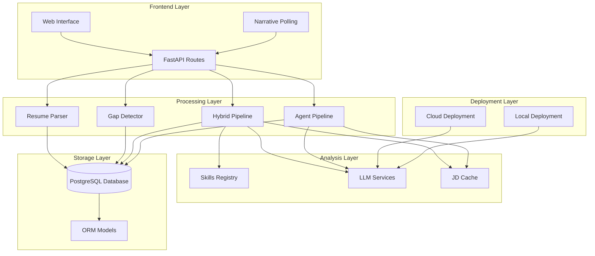
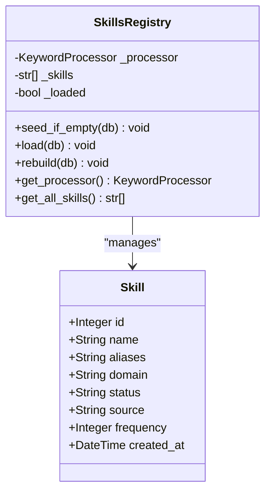
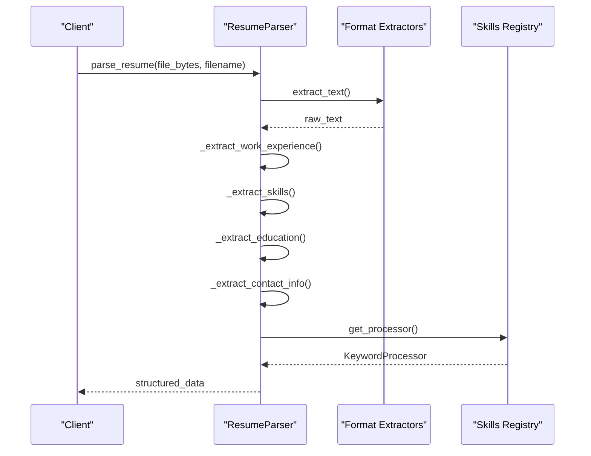
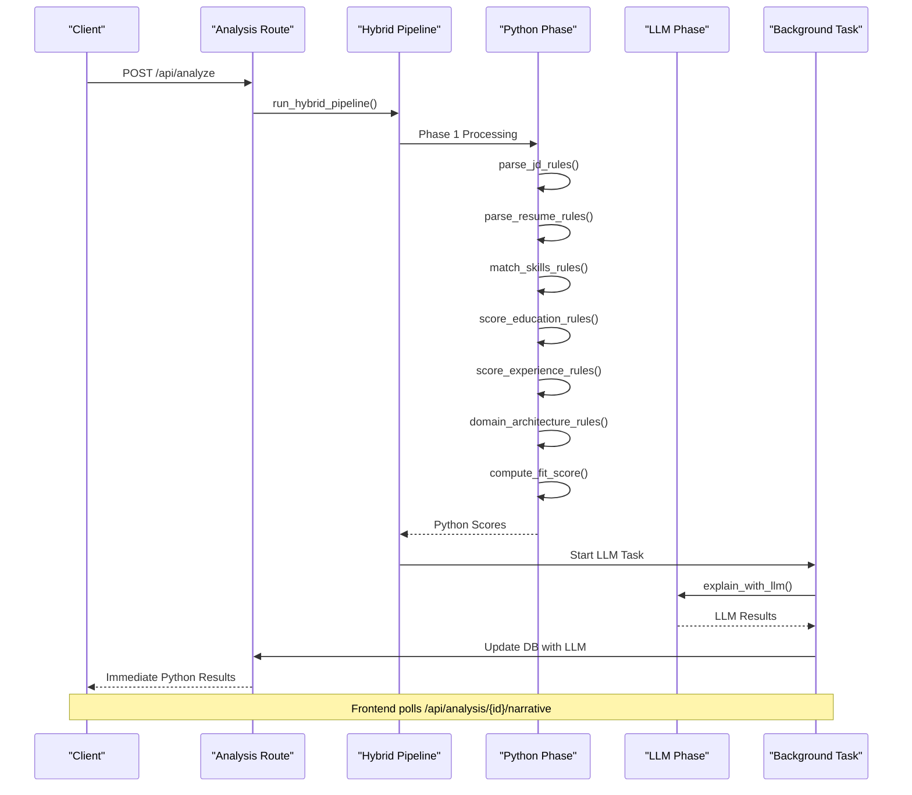
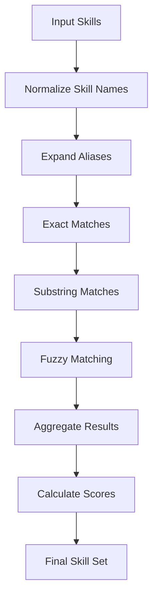
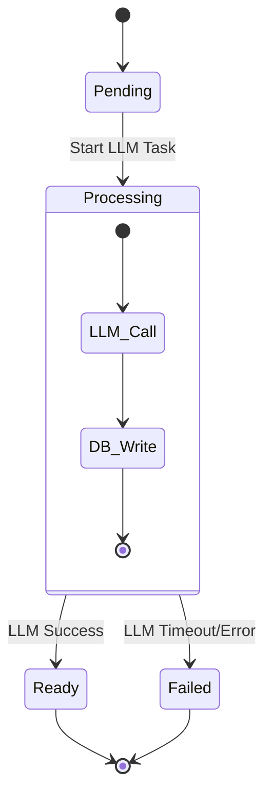
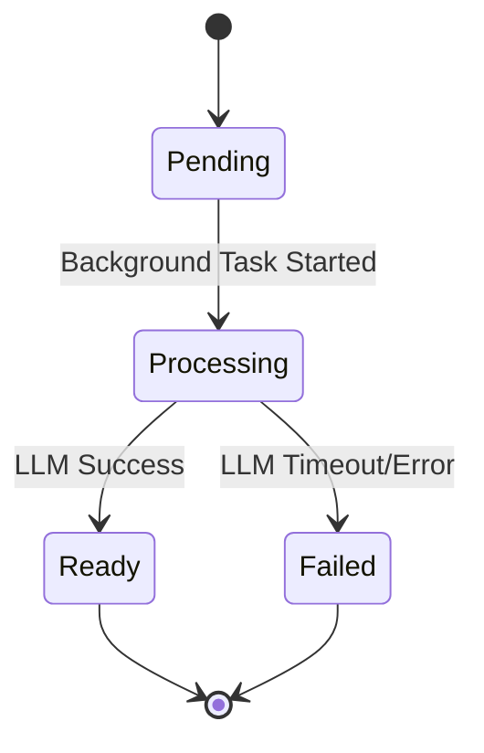

# Hybrid Pipeline

<cite>
**Referenced Files in This Document**
- [hybrid_pipeline.py](file://app/backend/services/hybrid_pipeline.py)
- [agent_pipeline.py](file://app/backend/services/agent_pipeline.py)
- [analysis_service.py](file://app/backend/services/analysis_service.py)
- [gap_detector.py](file://app/backend/services/gap_detector.py)
- [parser_service.py](file://app/backend/services/parser_service.py)
- [llm_service.py](file://app/backend/services/llm_service.py)
- [analyze.py](file://app/backend/routes/analyze.py)
- [main.py](file://app/backend/main.py)
- [db_models.py](file://app/backend/models/db_models.py)
- [test_hybrid_pipeline.py](file://app/backend/tests/test_hybrid_pipeline.py)
- [007_narrative_status.py](file://alembic/versions/007_narrative_status.py)
- [video_service.py](file://app/backend/services/video_service.py)
</cite>

## Update Summary
**Changes Made**
- Enhanced JSON parsing error handling with improved debugging capabilities including detailed position tracking and character context for parsing failures
- Added enhanced error reporting for LLM response processing and improved JSON extraction diagnostics
- Updated model configuration to use Gemma4 31B cloud model with backward compatibility maintained
- Implemented comprehensive JSON parsing with balanced brace detection and trailing comma fixes
- Added detailed logging for JSON parsing failures with position tracking
- Enhanced retry mechanisms with improved temperature handling for fallback scenarios

## Table of Contents
1. [Introduction](#introduction)
2. [System Architecture](#system-architecture)
3. [Core Components](#core-components)
4. [Hybrid Pipeline Implementation](#hybrid-pipeline-implementation)
5. [Skills Registry System](#skills-registry-system)
6. [Background Processing](#background-processing)
7. [Status Tracking and Polling](#status-tracking-and-polling)
8. [API Integration](#api-integration)
9. [Testing Framework](#testing-framework)
10. [Performance Considerations](#performance-considerations)
11. [Troubleshooting Guide](#troubleshooting-guide)
12. [Conclusion](#conclusion)

## Introduction

The Hybrid Pipeline represents a sophisticated resume analysis system that combines the speed and reliability of pure Python processing with the contextual understanding of Large Language Models (LLMs). This architecture optimizes for both performance and accuracy by implementing a two-phase analysis approach: a fast Python-based scoring phase followed by an LLM-powered narrative generation phase.

The system processes resumes and job descriptions through a carefully designed pipeline that extracts meaningful insights while maintaining sub-second response times for initial scoring results. The LLM component handles the generation of comprehensive narratives, strengths, weaknesses, and interview recommendations, ensuring that recruiters receive both quantitative scores and qualitative insights.

**Updated** Enhanced with intelligent cloud deployment detection, comprehensive status tracking, and adaptive polling architecture that provides four-state reliability with proper state transitions and enhanced user experience. The system now supports robust background task management with graceful shutdown capabilities and intelligent retry mechanisms. JSON parsing has been significantly enhanced with detailed error reporting and position tracking for improved debugging capabilities.

## System Architecture

The Hybrid Pipeline follows a layered architecture that separates concerns between computational efficiency and intelligent analysis:



**Diagram sources**
- [analyze.py:1-1169](file://app/backend/routes/analyze.py#L1-L1169)
- [hybrid_pipeline.py:1-2271](file://app/backend/services/hybrid_pipeline.py#L1-L2271)
- [agent_pipeline.py:1-650](file://app/backend/services/agent_pipeline.py#L1-L650)

The architecture implements several key design principles:

- **Layered Processing**: Each component has a specific responsibility, enabling modular maintenance and testing
- **Caching Strategy**: Shared caches reduce redundant computations across multiple requests
- **Background Processing**: Long-running LLM tasks don't block the main request-response cycle
- **Environment-Aware Configuration**: Intelligent detection of cloud vs local deployment for optimal parameter tuning
- **Enhanced Status Tracking**: Four-state status system (pending, processing, ready, failed) with proper state transitions
- **Adaptive Polling**: Intelligent polling architecture with exponential backoff and retry mechanisms
- **Graceful Error Handling**: Comprehensive error reporting with fallback mechanisms and user-friendly messaging
- **Advanced JSON Parsing**: Enhanced error handling with position tracking and character context for parsing failures

## Core Components

### Skills Registry System

The Skills Registry serves as the foundation for skill extraction and matching across the entire pipeline. It maintains a comprehensive database of technical skills with aliases and domain classifications.



**Diagram sources**
- [hybrid_pipeline.py:407-510](file://app/backend/services/hybrid_pipeline.py#L407-L510)
- [db_models.py:242-254](file://app/backend/models/db_models.py#L242-L254)

The system includes over 400 predefined skills spanning multiple domains including programming languages, frameworks, databases, cloud platforms, DevOps tools, AI/ML technologies, and more. Each skill can have multiple aliases to accommodate different naming conventions.

### Gap Detection Engine

The Gap Detector performs mechanical date analysis to identify employment gaps, overlapping jobs, and short tenures without applying subjective judgments.


**Diagram sources**
- [gap_detector.py:103-219](file://app/backend/services/gap_detector.py#L103-L219)

The gap detection algorithm implements interval merging to prevent double-counting of overlapping employment periods and provides objective classifications for gap severity thresholds.

### Resume Parser

The Resume Parser extracts structured information from various document formats using multiple extraction strategies:



**Diagram sources**
- [parser_service.py:242-663](file://app/backend/services/parser_service.py#L242-L663)

The parser supports multiple document formats including PDF, DOCX, DOC, TXT, RTF, HTML, and ODT, with fallback mechanisms for robust text extraction.

## Hybrid Pipeline Implementation

### Two-Phase Architecture

The Hybrid Pipeline implements a sophisticated two-phase approach that maximizes both speed and accuracy:



**Diagram sources**
- [analyze.py:442-667](file://app/backend/routes/analyze.py#L442-L667)
- [hybrid_pipeline.py:2040-2130](file://app/backend/services/hybrid_pipeline.py#L2040-L2130)

### Phase 1: Python Processing (1-2 seconds)

The first phase executes entirely in Python, providing immediate results with comprehensive scoring:

**JD Analysis Components:**
- **Role Title Extraction**: Identifies job titles using pattern matching and linguistic analysis
- **Experience Requirements**: Parses minimum years of experience from job descriptions
- **Domain Classification**: Categorizes roles into backend, frontend, data science, ML/AI, DevOps, embedded, mobile, management, etc.
- **Seniority Assessment**: Determines junior, mid, senior, or lead based on title and experience
- **Skill Separation**: Distinguishes required skills from nice-to-have skills

**Candidate Profile Building:**
- **Contact Information Extraction**: Name, email, phone, LinkedIn from resume
- **Work Experience Parsing**: Extracts job titles, companies, dates, and descriptions
- **Education Analysis**: Degree, field, institution, graduation year
- **Skill Identification**: Extracts technical skills using skills registry

**Matching and Scoring:**
- **Skill Matching**: Advanced matching with alias expansion and fuzzy matching
- **Education Scoring**: Evaluates educational relevance and quality
- **Experience Scoring**: Analyzes career progression and gap impact
- **Domain Fit**: Assesses technical domain alignment
- **Architecture Assessment**: Evaluates system design and leadership experience

### Phase 2: LLM Processing (40+ seconds)

The second phase generates comprehensive narratives and recommendations:

**LLM Capabilities:**
- **Strengths Analysis**: Identifies candidate strengths and achievements
- **Weaknesses Identification**: Highlights potential areas of concern
- **Recommendation Rationale**: Provides detailed explanation for fit recommendations
- **Interview Questions**: Generates targeted technical, behavioral, and culture-fit questions
- **Risk Assessment**: Documents potential risks and mitigation strategies

**Enhanced Fallback System:**
When LLM processing fails or times out, the system automatically generates a deterministic fallback narrative using the Python phase results. The retry mechanism now includes intelligent cloud detection and parameter optimization.

**Updated** Enhanced with comprehensive status tracking and adaptive polling architecture:
- **Four-State Status Tracking**: pending → processing → ready/failure states with proper transitions
- **Adaptive Polling**: Intelligent polling with exponential backoff (2s for first 30s, then 5s)
- **Background Task Management**: Robust task lifecycle with graceful shutdown and error recovery
- **Enhanced Error Reporting**: Detailed status messages and fallback mechanisms
- **Database Persistence**: Persistent status tracking across deployments and restarts

### Environment-Aware Configuration

The hybrid pipeline implements intelligent environment detection to optimize LLM parameters:

**Cloud Deployment Parameters:**
- num_predict: 4096 tokens (vs 512 for local) for handling verbose outputs from large cloud models
- num_ctx: 16384 tokens (vs 2048 for local) for complex reasoning and extended context
- Temperature: 0.1 for deterministic responses
- Authentication: Automatic API key header injection for Ollama Cloud deployments
- Model behavior: keep_alive disabled for cloud (models auto-unload)

**Local Deployment Parameters:**
- num_predict: 512 tokens (sufficient for narrative JSON)
- num_ctx: 2048 tokens (adequate for local processing)
- Temperature: 0.1 for deterministic responses
- Model behavior: keep_alive set to -1 (never unload) for performance

**Enhanced Logging:**
- Detailed initialization logs showing num_predict, num_ctx, and cloud detection status
- Warning messages when cloud deployment detected without API key
- Debug information for token setting optimization

**Enhanced JSON Parsing and Error Handling:**
- **Position Tracking**: Detailed logging of JSON parsing errors with character position information
- **Character Context**: Enhanced debugging with character context around parsing failures
- **Balanced Object Extraction**: Automatic detection and extraction of balanced JSON objects
- **Trailing Comma Fixes**: Automatic correction of common LLM JSON mistakes
- **Multiple Parsing Attempts**: Multiple strategies for extracting valid JSON from LLM responses

**Section sources**
- [hybrid_pipeline.py:97-147](file://app/backend/services/hybrid_pipeline.py#L97-L147)
- [hybrid_pipeline.py:1350-1365](file://app/backend/services/hybrid_pipeline.py#L1350-L1365)
- [hybrid_pipeline.py:1167-1235](file://app/backend/services/hybrid_pipeline.py#L1167-L1235)

## Skills Registry System

### Comprehensive Skill Database

The skills registry contains over 400 technical skills organized into specialized categories:

**Programming Languages:**
- Python, Java, JavaScript, TypeScript, C++, C#, Go, Rust, Swift, Ruby, PHP, R, MATLAB, Perl
- Haskell, Erlang, Elixir, Clojure, F#, Lua, Dart, Zig, Ada, Assembly, Bash, PowerShell

**Web Technologies:**
- React, Vue.js, Angular, Next.js, Nuxt.js, Svelte, Astro, Remix, Gatsby
- Node.js, Express.js, FastAPI, Django, Flask, Spring Boot, NestJS, Koa, Laravel

**Databases and Data Systems:**
- PostgreSQL, MySQL, SQLite, MongoDB, Redis, Elasticsearch, Cassandra, DynamoDB
- Snowflake, BigQuery, Redshift, ClickHouse, Supabase, Firestore

**Cloud and DevOps:**
- AWS, Google Cloud Platform, Microsoft Azure, DigitalOcean, Alibaba Cloud
- Docker, Kubernetes, Terraform, Ansible, Jenkins, GitHub Actions, GitLab CI

**AI/ML and Data Science:**
- Machine Learning, Deep Learning, Natural Language Processing, Computer Vision
- PyTorch, TensorFlow, Scikit-learn, Hugging Face, LangChain, LlamaIndex
- Apache Spark, Pandas, NumPy, Apache Kafka, Airflow, DBT

### Advanced Matching Algorithm

The skills matching system implements multiple layers of sophistication:



**Diagram sources**
- [hybrid_pipeline.py:731-800](file://app/backend/services/hybrid_pipeline.py#L731-L800)

The matching algorithm handles:
- **Exact matches**: Direct skill name matches
- **Alias expansion**: Recognizes variations like "js" for "javascript"
- **Substring matching**: Handles partial matches like "react" for "react native"
- **Fuzzy matching**: Uses rapidfuzz library for approximate string matching with 88% threshold

## Background Processing

### Asynchronous LLM Generation

The system implements sophisticated background processing to maintain responsive user experiences:



**Diagram sources**
- [hybrid_pipeline.py:43-49](file://app/backend/services/hybrid_pipeline.py#L43-L49)
- [analyze.py:1118-1149](file://app/backend/routes/analyze.py#L1118-L1149)

### Enhanced Background Task Management

The system maintains a registry of background tasks with proper lifecycle management:

**Task Registration:**
- All background LLM tasks are registered in a global task set
- Tasks automatically remove themselves when completed
- Graceful shutdown cancels and awaits all pending tasks

**Resource Management:**
- Shared Ollama semaphore prevents resource contention
- Memory-efficient processing with proper cleanup
- Automatic model warming and health monitoring

**Environment-Aware Configuration:**
- Intelligent cloud detection for parameter optimization
- Automatic authentication header handling for cloud deployments
- Dynamic num_predict and num_ctx adjustment based on deployment type
- Enhanced logging for token settings and cloud mode detection

### Database Integration

The background processing integrates seamlessly with the database layer:

**ScreeningResult Storage:**
- Initial Python results are saved immediately
- LLM results update existing records when available
- Complete analysis history maintained for audit trails
- Candidate profiles persist for future re-analysis

**Enhanced Status Tracking:**
- **narrative_status column**: Tracks processing state (pending, processing, ready, failed)
- **narrative_error column**: Stores detailed error messages for failed states
- **Persistent State**: Status persists across application restarts and deployments
- **Backward Compatibility**: Graceful fallback when status columns are missing

**Polling Interface:**
- Frontend polls `/api/analysis/{id}/narrative` for updates
- Real-time status reporting for ongoing processing
- Graceful handling of missing or corrupted data
- Adaptive polling with exponential backoff

**Enhanced JSON Parsing Integration:**
- **Detailed Error Logging**: Position tracking and character context for JSON parsing failures
- **Automatic Recovery**: Balanced object extraction and trailing comma fixes
- **Multiple Parsing Strategies**: Progressive fallback from simple to complex parsing attempts
- **Diagnostic Information**: Comprehensive logging for troubleshooting JSON extraction issues

**Section sources**
- [hybrid_pipeline.py:1896-2038](file://app/backend/services/hybrid_pipeline.py#L1896-L2038)
- [db_models.py:129-148](file://app/backend/models/db_models.py#L129-L148)

## Status Tracking and Polling

### Four-State Status Architecture

The system implements a comprehensive four-state status tracking system that provides clear visibility into the LLM narrative generation process:



**Status States:**
- **Pending**: Initial state when background LLM task is queued
- **Processing**: Active LLM generation in progress
- **Ready**: LLM narrative successfully generated and stored
- **Failed**: LLM generation failed with error details

**Enhanced Error Handling:**
- **Detailed Error Messages**: Stores specific error information in narrative_error
- **Fallback Mechanisms**: Automatically generates fallback narrative on failure
- **Retry Logic**: Implements retry mechanisms with exponential backoff
- **Graceful Degradation**: Continues operation even when LLM services are unavailable

### Adaptive Polling Architecture

The polling system implements intelligent retry mechanisms with adaptive timing:

**Polling Strategy:**
- **Initial Phase (0-30s)**: 2-second polling intervals for cloud models
- **Extended Phase (30s+)**: 5-second polling intervals for local models
- **Maximum Attempts**: 36 attempts (≈2.25 minutes total)
- **Exponential Backoff**: Gradual increase in polling intervals for failed states

**Frontend Integration:**
- **Automatic Polling**: Frontend automatically starts polling when narrative_pending is true
- **Real-time Updates**: Immediate UI updates when status changes to ready
- **Error Display**: User-friendly error messages when polling fails
- **Loading States**: Visual indicators for pending, processing, and failed states

**Backend Polling Endpoint:**
- **GET /api/analysis/{analysis_id}/narrative**: Returns current status and narrative
- **Status Responses**: {"status": "pending"}, {"status": "ready", "narrative": {...}}, {"status": "failed", "error": "..."}
- **Fallback Handling**: Returns fallback narrative when LLM fails
- **Security**: Tenant-scoped access control prevents unauthorized polling

**Enhanced JSON Parsing Diagnostics:**
- **Position Tracking**: Detailed logging of JSON parsing failures with character positions
- **Character Context**: Enhanced debugging with surrounding character context
- **Parsing Progression**: Multiple parsing attempts with progressive complexity
- **Recovery Mechanisms**: Automatic fixes for common JSON extraction issues

**Section sources**
- [hybrid_pipeline.py:1896-2038](file://app/backend/services/hybrid_pipeline.py#L1896-L2038)
- [analyze.py:1118-1168](file://app/backend/routes/analyze.py#L1118-L1168)

## API Integration

### RESTful Endpoint Design

The API provides comprehensive endpoints for both synchronous and asynchronous processing:

**Core Endpoints:**
- `POST /api/analyze`: Single resume analysis with immediate Python scores
- `POST /api/analyze/stream`: SSE streaming with real-time updates
- `POST /api/analyze/batch`: Batch processing with concurrency control
- `GET /api/analysis/{id}/narrative`: LLM narrative retrieval with status tracking

**Response Structure:**
The system maintains backward compatibility while extending functionality:

```json
{
  "fit_score": 85,
  "job_role": "Senior Backend Engineer",
  "strengths": ["Strong Python skills", "Experience with microservices"],
  "weaknesses": ["Limited Kubernetes experience"],
  "employment_gaps": [],
  "education_analysis": "Computer Science degree from MIT",
  "risk_signals": [],
  "final_recommendation": "Shortlist",
  "score_breakdown": {
    "skill_match": 90,
    "experience_match": 85,
    "education": 80,
    "architecture": 75,
    "timeline": 85,
    "domain_fit": 88,
    "risk_penalty": 0
  },
  "matched_skills": ["Python", "FastAPI", "PostgreSQL"],
  "missing_skills": ["Kubernetes", "Redis"],
  "risk_level": "Low",
  "interview_questions": {
    "technical_questions": ["Describe your Python async experience"],
    "behavioral_questions": ["Tell me about a project you led"],
    "culture_fit_questions": ["What motivates you?"]
  },
  "analysis_quality": "high",
  "narrative_pending": false,
  "result_id": 12345
}
```

### Streaming Support

The SSE streaming implementation provides real-time feedback:

**Event Types:**
- `{"stage": "parsing", "result": {...Python scores...}}`
- `{"stage": "scoring", "result": {...Complete Python analysis...}}`
- `{"stage": "complete", "result": {...Final analysis with LLM...}}`

**Client Benefits:**
- Immediate feedback during processing
- Progressive disclosure of results
- Graceful handling of connection drops
- Automatic persistence of intermediate results

### Enhanced Polling Interface

**Narrative Polling Endpoint:**
- **GET /api/analysis/{id}/narrative**: Returns current status and narrative
- **Status Responses**: {"status": "pending"}, {"status": "ready", "narrative": {...}}, {"status": "failed", "error": "..."}
- **Adaptive Timing**: Intelligent polling with exponential backoff
- **Tenant Security**: Access control prevents unauthorized polling

**Enhanced JSON Extraction Diagnostics:**
- **Parsing Failure Details**: Comprehensive logging of JSON extraction problems
- **Position Information**: Character position tracking for debugging
- **Recovery Attempts**: Multiple strategies for extracting valid JSON
- **Diagnostic Context**: Enhanced error reporting for troubleshooting

**Section sources**
- [analyze.py:442-667](file://app/backend/routes/analyze.py#L442-L667)
- [analyze.py:1118-1168](file://app/backend/routes/analyze.py#L1118-L1168)

## Testing Framework

### Comprehensive Test Coverage

The testing suite covers all aspects of the hybrid pipeline with extensive unit and integration tests:

**Test Categories:**
- **Component Tests**: Individual function testing for each pipeline component
- **Integration Tests**: End-to-end pipeline validation
- **Performance Tests**: Load testing and benchmarking
- **Regression Tests**: Ensuring backward compatibility

**Key Test Areas:**
- **JD Parsing**: Validates role title extraction, experience requirements, and domain classification
- **Skill Matching**: Tests alias expansion, fuzzy matching, and scoring algorithms
- **Gap Analysis**: Verifies date parsing, interval merging, and gap severity classification
- **Background Processing**: Validates LLM fallback mechanisms and database integration
- **Status Tracking**: Tests four-state status transitions and polling functionality
- **JSON Parsing**: Validates enhanced error handling and position tracking capabilities

### Enhanced Mock-Based Testing

The test suite extensively uses mocking to isolate components and simulate various failure scenarios:

**Mock Strategies:**
- **LLM Mocks**: Simulate LLM responses and timeouts with environment-aware behavior
- **Database Mocks**: Test caching and persistence logic
- **External Service Mocks**: Simulate Ollama and file system operations
- **Network Mocks**: Test error handling and retry logic with cloud detection

**Status Tracking Tests:**
- **Background Task Lifecycle**: Validates task registration, completion, and cleanup
- **Status State Transitions**: Tests proper progression through pending → processing → ready/failure states
- **Error Recovery**: Validates fallback mechanisms and error reporting
- **Polling Behavior**: Tests adaptive polling with exponential backoff

**Enhanced JSON Parsing Tests:**
- **Position Tracking**: Validates character position logging for parsing failures
- **Balanced Object Extraction**: Tests automatic detection of balanced JSON objects
- **Trailing Comma Fixes**: Validates automatic correction of common LLM mistakes
- **Multiple Parsing Strategies**: Tests progressive fallback from simple to complex parsing attempts

## Performance Considerations

### Optimization Strategies

The hybrid pipeline implements multiple optimization techniques to achieve sub-second response times:

**Memory Management:**
- Skills registry uses in-memory keyword processing for fast lookups
- LLM model remains loaded in RAM for instant response times
- Efficient string processing with proper memory cleanup

**Computational Efficiency:**
- Early termination for obvious cases (e.g., zero-length inputs)
- Optimized regex patterns for skill extraction
- Minimal object creation during processing loops

**Caching Mechanisms:**
- JD parsing cache prevents redundant processing
- Skills registry cache reduces database queries
- Candidate profile caching enables quick re-analysis

**Environment-Aware Optimizations:**
- Dynamic parameter adjustment based on deployment type
- Intelligent cloud detection for optimal configuration
- Automatic authentication header handling reduces overhead
- Enhanced token limits for cloud deployments improve LLM performance

**Enhanced JSON Parsing Performance:**
- **Efficient Position Tracking**: Minimal overhead for character position logging
- **Optimized Parsing Algorithms**: Fast balanced object detection and extraction
- **Smart Retry Logic**: Intelligent fallback mechanisms reduce processing time
- **Comprehensive Caching**: JSON parsing strategies cached for repeated use

### Scalability Features

**Concurrency Control:**
- Semaphore-based rate limiting for LLM requests
- Thread pool for blocking I/O operations
- Asynchronous processing for non-blocking operations

**Resource Management:**
- Automatic model warming and health monitoring
- Graceful degradation under resource constraints
- Proper cleanup of background tasks

**Enhanced Cloud Support:**
- Significantly larger token limits (4096 num_predict, 16384 num_ctx) for cloud models
- Automatic API key authentication with detailed logging
- Optimized model behavior for cloud vs local deployments

**Status Tracking Scalability:**
- Database-backed status tracking scales across multiple workers
- Persistent state survives application restarts
- Efficient polling with adaptive timing reduces server load

**Enhanced Model Configuration:**
- **Gemma4 31B Cloud Model**: Default model selection for optimal performance
- **Backward Compatibility**: Graceful fallback to previous models when needed
- **Environment Detection**: Automatic model selection based on deployment type
- **Parameter Optimization**: Dynamic configuration based on model capabilities

## Troubleshooting Guide

### Common Issues and Solutions

**LLM Unavailability:**
- **Symptoms**: Immediate fallback to Python scoring
- **Causes**: Ollama service down, model not loaded, network issues
- **Solutions**: Check Ollama health endpoint, verify model installation, restart services

**Cloud Deployment Issues:**
- **Symptoms**: Authentication failures or connection timeouts
- **Causes**: Missing OLLAMA_API_KEY environment variable
- **Solutions**: Set OLLAMA_API_KEY for cloud deployments, verify base URL configuration
- **Monitoring**: Check logs for "Ollama Cloud detected but OLLAMA_API_KEY is not set!" warnings

**Skills Registry Failures:**
- **Symptoms**: Reduced skill matching accuracy
- **Causes**: Database connectivity issues, missing skills table
- **Solutions**: Verify database connection, run skills seed migration, check permissions

**Performance Degradation:**
- **Symptoms**: Slow response times, timeout errors
- **Causes**: Resource exhaustion, memory leaks, inefficient queries
- **Solutions**: Monitor resource usage, optimize queries, implement proper cleanup

**Token Limit Issues:**
- **Symptoms**: LLM responses truncated or incomplete
- **Causes**: Insufficient token limits for cloud deployments
- **Solutions**: Verify num_predict and num_ctx settings, check cloud vs local configuration

**Status Tracking Issues:**
- **Symptoms**: Inconsistent status reporting, missing status updates
- **Causes**: Database connectivity issues, missing status columns
- **Solutions**: Verify database schema migration, check status column existence, monitor background task execution

**Enhanced JSON Parsing Issues:**
- **Symptoms**: JSON parsing failures, position tracking errors
- **Causes**: Malformed LLM responses, character encoding issues
- **Solutions**: Check enhanced logging for position information, validate character context, implement recovery strategies

**Model Configuration Problems:**
- **Symptoms**: Model loading failures, parameter conflicts
- **Causes**: Incorrect model specification, environment variable issues
- **Solutions**: Verify OLLAMA_MODEL environment variable, check model availability, validate configuration

### Enhanced Diagnostic Tools

**Health Monitoring:**
- `/api/health` for basic service status
- `/api/health/deep` for comprehensive dependency checks
- `/api/llm-status` for detailed LLM diagnostics

**Environment Detection:**
- Automatic cloud/local deployment detection
- Parameter optimization based on environment
- Authentication header validation
- Token limit verification and logging

**Logging and Metrics:**
- Structured JSON logging for production environments
- Performance metrics collection and reporting
- Error tracking and alerting systems
- Detailed logs for cloud mode and token settings

**Enhanced Logging Features:**
- Initialization logs showing num_predict, num_ctx, and cloud detection status
- Warning messages for missing API keys in cloud deployments
- Debug information for environment-specific parameter optimization
- Comprehensive JSON parsing error logs with position tracking

**Status Tracking Diagnostics:**
- Background task execution logs
- Status transition timestamps
- Error message persistence
- Polling attempt tracking

**Enhanced JSON Parsing Diagnostics:**
- **Position Tracking Logs**: Detailed character position information for parsing failures
- **Character Context Analysis**: Surrounding character context for debugging JSON extraction issues
- **Parsing Strategy Progression**: Logging of multiple parsing attempts and recovery mechanisms
- **Recovery Success Metrics**: Tracking of automatic fixes for common LLM JSON mistakes

**Model Configuration Diagnostics:**
- **Model Selection Logs**: Automatic detection and selection of appropriate models
- **Parameter Optimization Tracking**: Dynamic configuration adjustments based on deployment type
- **Backward Compatibility Verification**: Graceful fallback mechanism validation
- **Configuration Conflict Resolution**: Automatic handling of conflicting model settings

**Section sources**
- [hybrid_pipeline.py:135-147](file://app/backend/services/hybrid_pipeline.py#L135-L147)
- [llm_service.py:20-33](file://app/backend/services/llm_service.py#L20-L33)

## Conclusion

The Hybrid Pipeline represents a mature, production-ready solution that successfully balances computational efficiency with intelligent analysis. By leveraging the strengths of both Python-based rule engines and LLM-powered natural language processing, the system delivers both immediate actionable insights and comprehensive qualitative analysis.

**Updated** The recent enhancements significantly improve the system's adaptability and reliability across different deployment environments. The intelligent cloud detection and parameter optimization ensure optimal performance whether running locally or in cloud environments. The enhanced retry mechanisms with different temperatures (0.1 for primary, 0.3 for retry) provide better fallback behavior while maintaining deterministic responses.

**Enhanced Reliability Features:**
- **Four-State Status Tracking**: Comprehensive status monitoring with proper state transitions
- **Adaptive Polling Architecture**: Intelligent polling with exponential backoff and retry mechanisms
- **Robust Background Task Management**: Proper lifecycle tracking with graceful shutdown
- **Enhanced Error Handling**: Detailed status reporting and fallback mechanisms
- **Database Persistence**: Reliable status tracking across deployments and restarts
- **Advanced JSON Parsing**: Comprehensive error handling with position tracking and character context
- **Enhanced Model Configuration**: Gemma4 31B cloud model with backward compatibility

**Key advantages of this approach include:**
- **Sub-second response times** for immediate scoring results
- **Comprehensive analysis** through LLM-powered narratives
- **Robust fallback mechanisms** ensuring system reliability
- **Extensible skills registry** supporting continuous improvement
- **Production-ready architecture** with proper monitoring and maintenance
- **Environment-aware configuration** optimizing performance across deployments
- **Enhanced cloud compatibility** with automatic authentication and parameter tuning
- **Detailed logging** for token settings and cloud mode detection
- **Improved error handling** for cloud API key authentication
- **Four-state status tracking** providing clear visibility into processing states
- **Adaptive polling architecture** optimizing user experience across different deployment types
- **Advanced JSON parsing diagnostics** enabling rapid troubleshooting of parsing failures
- **Enhanced model configuration** ensuring optimal performance with Gemma4 31B cloud model

The system provides a solid foundation for AI-powered recruitment solutions, offering both quantitative metrics and qualitative insights essential for modern hiring processes. The comprehensive status tracking and polling architecture ensure reliable operation in production environments while maintaining responsive user experiences.

**Enhanced Status Tracking Benefits:**
- **Real-time Visibility**: Clear indication of LLM processing state
- **User Experience**: Adaptive polling with appropriate delays for different environments
- **Error Communication**: Detailed error messages and fallback mechanisms
- **System Reliability**: Graceful degradation when LLM services are unavailable
- **Operational Insights**: Comprehensive logging and monitoring capabilities
- **Deployment Flexibility**: Seamless operation across cloud and local environments
- **Enhanced Debugging**: Advanced JSON parsing diagnostics for rapid issue resolution
- **Model Optimization**: Automatic configuration for optimal Gemma4 31B cloud model performance

The system's modular design, comprehensive testing framework, and robust error handling ensure reliable operation in production environments. The careful attention to performance optimization, memory management, and resource utilization enables the system to scale effectively while maintaining responsive user experiences.

**Enhanced JSON Parsing Benefits:**
- **Rapid Issue Resolution**: Position tracking and character context enable quick identification of parsing problems
- **Improved Reliability**: Multiple parsing strategies and automatic recovery mechanisms reduce failure rates
- **Better Debugging**: Comprehensive logging provides detailed insights into JSON extraction challenges
- **Enhanced User Experience**: Automatic fixes for common LLM mistakes improve overall system reliability
- **Production Stability**: Robust error handling ensures consistent performance in production environments

The system's architecture demonstrates best practices in modern AI application development, combining efficient rule-based processing with powerful LLM capabilities while maintaining operational excellence through comprehensive monitoring, testing, and error handling strategies.