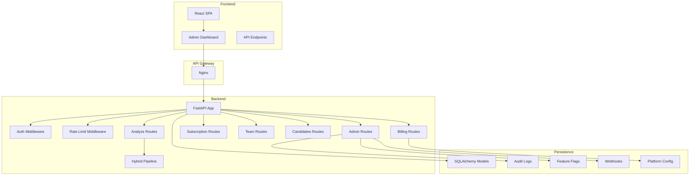
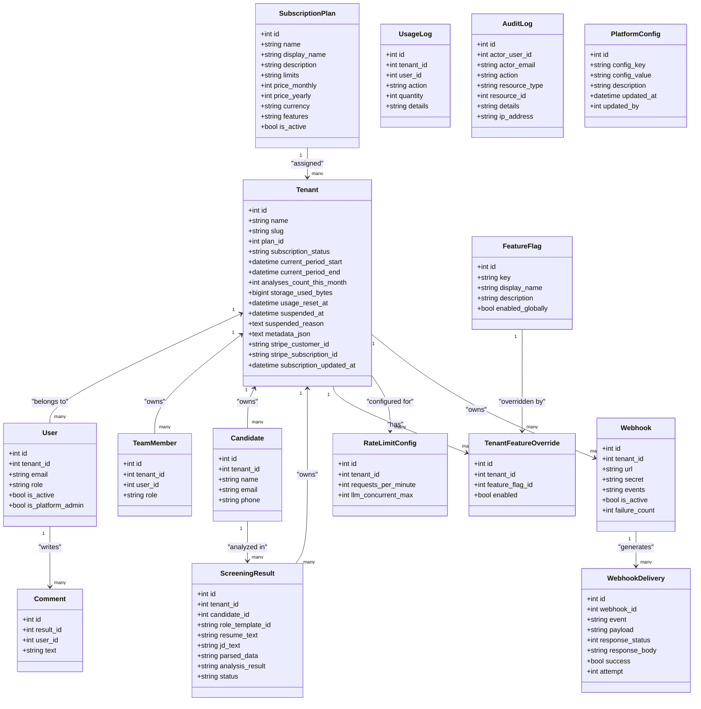
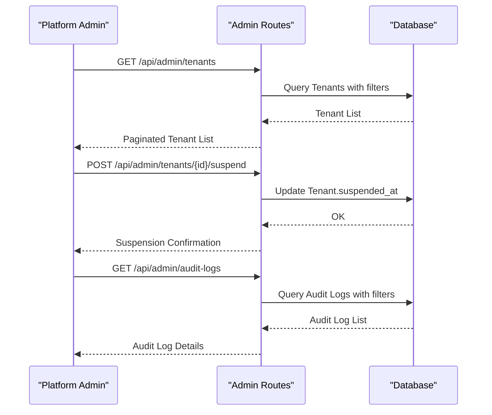
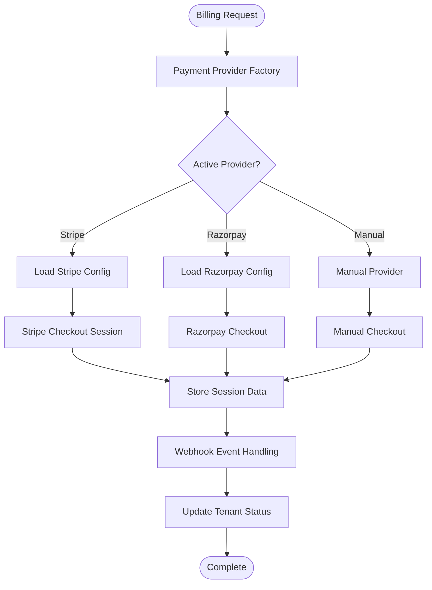
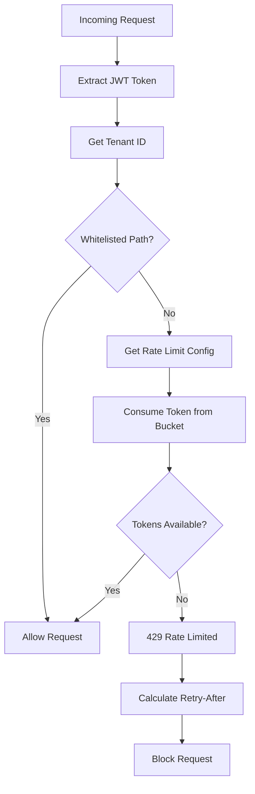
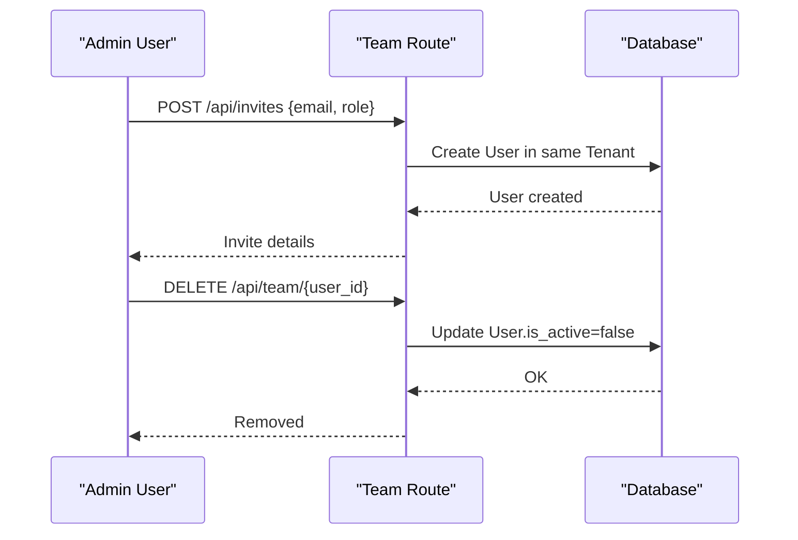
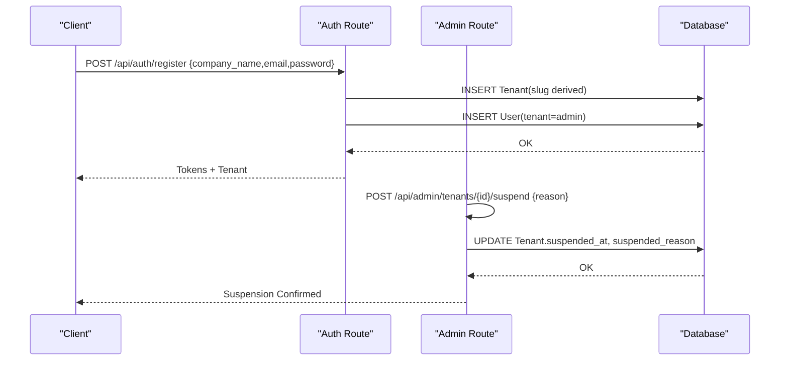
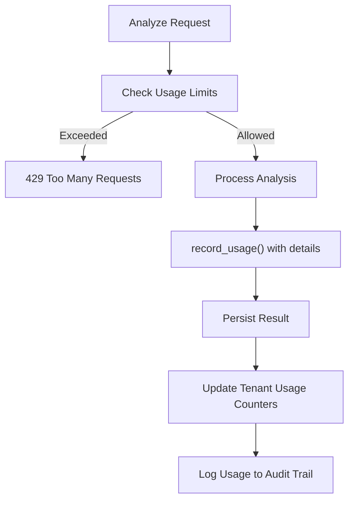
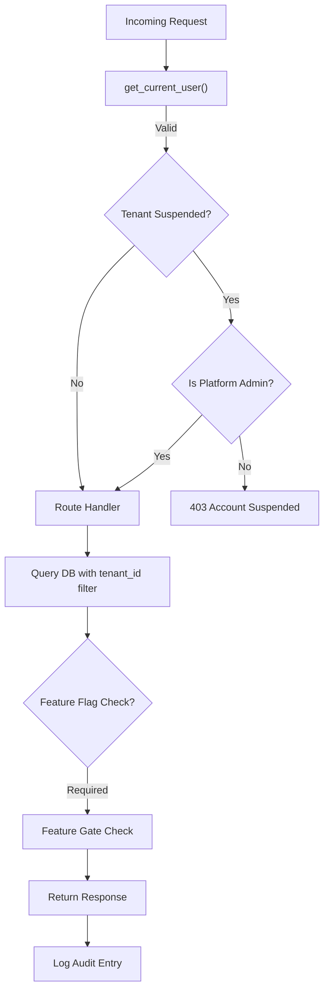
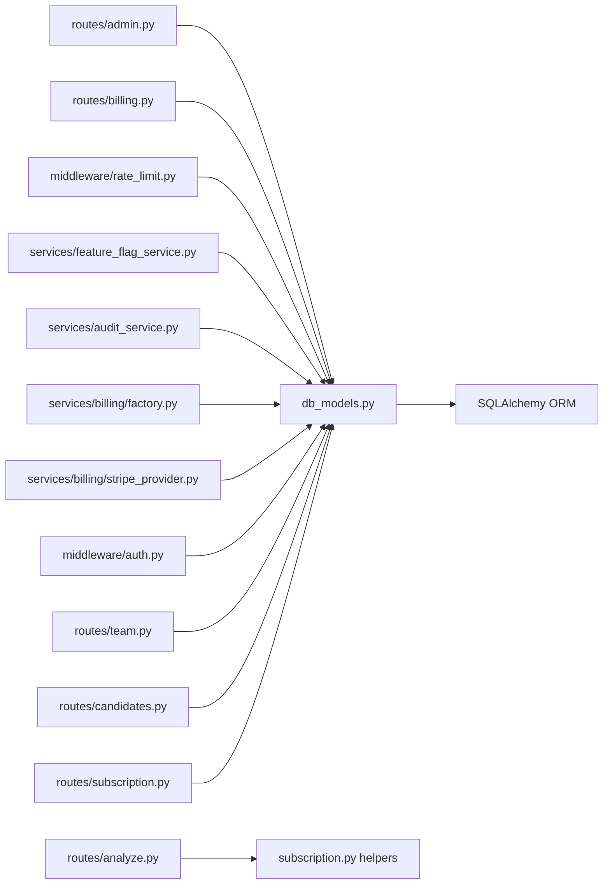

# Multi-Tenant System

<cite>
**Referenced Files in This Document**
- [README.md](file://README.md)
- [main.py](file://app/backend/main.py)
- [database.py](file://app/backend/db/database.py)
- [db_models.py](file://app/backend/models/db_models.py)
- [schemas.py](file://app/backend/models/schemas.py)
- [auth.py](file://app/backend/middleware/auth.py)
- [subscription.py](file://app/backend/routes/subscription.py)
- [team.py](file://app/backend/routes/team.py)
- [candidates.py](file://app/backend/routes/candidates.py)
- [analyze.py](file://app/backend/routes/analyze.py)
- [admin.py](file://app/backend/routes/admin.py)
- [billing.py](file://app/backend/routes/billing.py)
- [rate_limit.py](file://app/backend/middleware/rate_limit.py)
- [feature_flag_service.py](file://app/backend/services/feature_flag_service.py)
- [audit_service.py](file://app/backend/services/audit_service.py)
- [factory.py](file://app/backend/services/billing/factory.py)
- [stripe_provider.py](file://app/backend/services/billing/stripe_provider.py)
- [003_subscription_system.py](file://alembic/versions/003_subscription_system.py)
- [012_admin_foundation.py](file://alembic/versions/012_admin_foundation.py)
- [014_billing_system.py](file://alembic/versions/014_billing_system.py)
- [test_usage_enforcement.py](file://app/backend/tests/test_usage_enforcement.py)
- [test_tenant_suspension.py](file://app/backend/tests/test_tenant_suspension.py)
- [test_admin_api.py](file://app/backend/tests/test_admin_api.py)
- [test_admin_metrics.py](file://app/backend/tests/test_admin_metrics.py)
- [test_feature_flags.py](file://app/backend/tests/test_feature_flags.py)
- [test_rate_limiting.py](file://app/backend/tests/test_rate_limiting.py)
</cite>

## Update Summary
**Changes Made**
- Added comprehensive administrative dashboard with tenant management capabilities
- Integrated billing system with Stripe and Razorpay provider support
- Implemented per-tenant rate limiting with configurable RPM settings
- Added feature flag management with tenant-specific overrides
- Introduced tenant suspension capabilities with audit logging
- Enhanced metadata storage for tenant configuration and tracking
- Added webhook management system for tenant event notifications
- Expanded platform metrics and usage trend reporting

## Table of Contents
1. [Introduction](#introduction)
2. [Project Structure](#project-structure)
3. [Core Components](#core-components)
4. [Architecture Overview](#architecture-overview)
5. [Detailed Component Analysis](#detailed-component-analysis)
6. [Dependency Analysis](#dependency-analysis)
7. [Performance Considerations](#performance-considerations)
8. [Troubleshooting Guide](#troubleshooting-guide)
9. [Conclusion](#conclusion)
10. [Appendices](#appendices)

## Introduction
This document explains the enhanced multi-tenant architecture of Resume AI by ThetaLogics. The system now includes comprehensive administrative capabilities, billing integration, rate limiting, and feature flag management. It covers tenant isolation, data separation, shared resources, subscription and usage management, team collaboration, tenant lifecycle management, and advanced operational controls including tenant suspension, webhook management, and platform metrics monitoring.

## Project Structure
The system is a FastAPI application with enhanced multi-tenant capabilities:
- A SQLAlchemy ORM layer defining tenant-scoped models with administrative extensions
- Route handlers enforcing tenant isolation via current user's tenant_id
- Comprehensive administrative dashboard for tenant management and monitoring
- Billing integration supporting multiple payment providers (Stripe, Razorpay, Manual)
- Per-tenant rate limiting with configurable limits
- Feature flag system with tenant-specific overrides
- Enhanced subscription and usage management with audit logging
- Team collaboration module for invites and comments
- Services implementing the hybrid analysis pipeline and skills registry

**Diagram sources**
- [main.py:200-214](file://app/backend/main.py#L200-L214)
- [auth.py:20](file://app/backend/middleware/auth.py#L20)
- [rate_limit.py:17-148](file://app/backend/middleware/rate_limit.py#L17-L148)
- [admin.py:25](file://app/backend/routes/admin.py#L25)
- [billing.py:12](file://app/backend/routes/billing.py#L12)
- [subscription.py:20](file://app/backend/routes/subscription.py#L20)
- [team.py:15](file://app/backend/routes/team.py#L15)
- [candidates.py:23](file://app/backend/routes/candidates.py#L23)
- [analyze.py:41](file://app/backend/routes/analyze.py#L41)
- [hybrid_pipeline.py:1](file://app/backend/services/hybrid_pipeline.py#L1)

**Section sources**
- [README.md:273-333](file://README.md#L273-L333)
- [main.py:174-214](file://app/backend/main.py#L174-L214)

## Core Components
Enhanced tenant management with administrative capabilities:
- Tenant model with subscription, usage, suspension, and metadata fields
- User model with role scoping and platform admin privileges
- Administrative dashboard with tenant listing, detail views, and management
- UsageLog with comprehensive audit trail and detailed usage tracking
- SubscriptionPlan with plan metadata, limits, and billing integration
- Team collaboration via TeamMember and Comment
- Candidate and ScreeningResult with tenant scoping
- Enhanced billing system with provider factory and webhook handling
- Per-tenant rate limiting with configurable RPM settings
- Feature flag system with tenant-specific overrides
- Audit logging for all administrative actions
- Webhook management for tenant event notifications
- Shared caches (JD cache) and skills registry

Key tenant-aware patterns:
- Every route filters by current_user.tenant_id
- Usage enforcement checks plan limits and increments counters
- Admin-only routes enforce require_platform_admin
- Rate limiting applies per-tenant with configurable limits
- Feature flags respect tenant overrides and global settings
- Billing integration handles provider-specific configurations

**Section sources**
- [db_models.py:31-59](file://app/backend/models/db_models.py#L31-L59)
- [db_models.py:62-76](file://app/backend/models/db_models.py#L62-L76)
- [db_models.py:79-92](file://app/backend/models/db_models.py#L79-L92)
- [db_models.py:11-28](file://app/backend/models/db_models.py#L11-L28)
- [db_models.py:169-178](file://app/backend/models/db_models.py#L169-L178)
- [db_models.py:181-191](file://app/backend/models/db_models.py#L181-L191)
- [db_models.py:97-126](file://app/backend/models/db_models.py#L97-L126)
- [db_models.py:229-250](file://app/backend/models/db_models.py#L229-L250)
- [db_models.py:319-330](file://app/backend/models/db_models.py#L319-L330)
- [db_models.py:305-318](file://app/backend/models/db_models.py#L305-L318)
- [db_models.py:331-365](file://app/backend/models/db_models.py#L331-L365)
- [db_models.py:367-378](file://app/backend/models/db_models.py#L367-L378)

## Architecture Overview
The enhanced backend defines tenant-scoped models with administrative extensions and enforces tenant isolation at the route level. The system now includes comprehensive administrative capabilities, billing integration, rate limiting, and feature flag management while maintaining centralized subscription and usage management.

**Diagram sources**
- [db_models.py:31-59](file://app/backend/models/db_models.py#L31-L59)
- [db_models.py:62-76](file://app/backend/models/db_models.py#L62-L76)
- [db_models.py:11-28](file://app/backend/models/db_models.py#L11-L28)
- [db_models.py:79-92](file://app/backend/models/db_models.py#L79-L92)
- [db_models.py:169-178](file://app/backend/models/db_models.py#L169-L178)
- [db_models.py:181-191](file://app/backend/models/db_models.py#L181-L191)
- [db_models.py:97-126](file://app/backend/models/db_models.py#L97-L126)
- [db_models.py:305-318](file://app/backend/models/db_models.py#L305-L318)
- [db_models.py:319-330](file://app/backend/models/db_models.py#L319-L330)
- [db_models.py:331-365](file://app/backend/models/db_models.py#L331-L365)
- [db_models.py:367-378](file://app/backend/models/db_models.py#L367-L378)

## Detailed Component Analysis

### Enhanced Tenant Isolation and Administrative Dashboard
The system now includes comprehensive administrative capabilities with tenant management, audit logging, and platform metrics:
- Administrative dashboard with tenant listing, detail views, and management controls
- Tenant suspension and reactivation with reason tracking
- Usage adjustment and plan modification capabilities
- Audit logging for all administrative actions with detailed context
- Platform metrics overview with tenant statistics and revenue tracking
- Usage trend reporting for historical analysis

**Diagram sources**
- [admin.py:140-209](file://app/backend/routes/admin.py#L140-L209)
- [admin.py:301-329](file://app/backend/routes/admin.py#L301-L329)
- [admin.py:493-558](file://app/backend/routes/admin.py#L493-L558)

**Section sources**
- [admin.py:140-209](file://app/backend/routes/admin.py#L140-L209)
- [admin.py:214-296](file://app/backend/routes/admin.py#L214-L296)
- [admin.py:301-360](file://app/backend/routes/admin.py#L301-L360)
- [admin.py:414-453](file://app/backend/routes/admin.py#L414-L453)
- [admin.py:458-488](file://app/backend/routes/admin.py#L458-L488)
- [admin.py:493-558](file://app/backend/routes/admin.py#L493-L558)
- [admin.py:562-695](file://app/backend/routes/admin.py#L562-L695)
- [admin.py:700-777](file://app/backend/routes/admin.py#L700-L777)
- [admin.py:780-800](file://app/backend/routes/admin.py#L780-L800)

### Enhanced Subscription Management and Billing Integration
The billing system now supports multiple payment providers with comprehensive integration:
- Factory pattern for payment provider selection and configuration
- Stripe provider with checkout sessions, subscription management, and webhook handling
- Razorpay provider support for international markets
- Manual provider fallback for testing and development
- Platform configuration management for provider credentials
- Tenant billing integration with Stripe customer and subscription IDs

**Diagram sources**
- [factory.py:37-91](file://app/backend/services/billing/factory.py#L37-L91)
- [stripe_provider.py:36-100](file://app/backend/services/billing/stripe_provider.py#L36-L100)
- [billing.py:39-113](file://app/backend/routes/billing.py#L39-L113)

**Section sources**
- [factory.py:13-34](file://app/backend/services/billing/factory.py#L13-L34)
- [factory.py:37-91](file://app/backend/services/billing/factory.py#L37-L91)
- [stripe_provider.py:12-100](file://app/backend/services/billing/stripe_provider.py#L12-L100)
- [billing.py:15-113](file://app/backend/routes/billing.py#L15-L113)
- [014_billing_system.py:33-56](file://alembic/versions/014_billing_system.py#L33-L56)

### Per-Tenant Rate Limiting and Feature Flag Management
The system now implements sophisticated rate limiting and feature flag management:
- In-memory token bucket rate limiting per tenant with configurable RPM
- Cache-based feature flag resolution with tenant overrides
- Real-time configuration updates with TTL caching
- Audit logging for feature flag changes
- Tenant-specific rate limit configuration

**Diagram sources**
- [rate_limit.py:124-148](file://app/backend/middleware/rate_limit.py#L124-L148)
- [feature_flag_service.py:46-79](file://app/backend/services/feature_flag_service.py#L46-L79)

**Section sources**
- [rate_limit.py:17-148](file://app/backend/middleware/rate_limit.py#L17-L148)
- [feature_flag_service.py:13-44](file://app/backend/services/feature_flag_service.py#L13-L44)
- [feature_flag_service.py:46-94](file://app/backend/services/feature_flag_service.py#L46-L94)
- [auth.py:78-92](file://app/backend/middleware/auth.py#L78-L92)

### Team Collaboration and Access Delegation
Enhanced team collaboration with administrative oversight:
- Roles: admin, recruiter, viewer with platform admin privileges
- Admin-only operations with comprehensive audit logging
- Invite management with tenant scoping
- Member removal with proper cleanup
- Collaborative features with tenant isolation
- Team member listing with user details

**Diagram sources**
- [team.py:34-61](file://app/backend/routes/team.py#L34-L61)
- [team.py:64-82](file://app/backend/routes/team.py#L64-L82)
- [auth.py:57-96](file://app/backend/middleware/auth.py#L57-L96)

**Section sources**
- [team.py:18-31](file://app/backend/routes/team.py#L18-L31)
- [team.py:34-61](file://app/backend/routes/team.py#L34-L61)
- [team.py:64-82](file://app/backend/routes/team.py#L64-L82)
- [team.py:85-134](file://app/backend/routes/team.py#L85-L134)

### Enhanced Tenant Lifecycle Management
Comprehensive tenant lifecycle management with administrative controls:
- Onboarding with tenant creation and admin assignment
- Suspension and reactivation with reason tracking
- Plan modification with audit trail
- Usage adjustment for administrative purposes
- Metadata storage for tenant configuration
- Stripe integration for billing management

**Diagram sources**
- [auth.py:57-96](file://app/backend/middleware/auth.py#L57-L96)
- [admin.py:301-329](file://app/backend/routes/admin.py#L301-L329)
- [003_subscription_system.py:235-251](file://alembic/versions/003_subscription_system.py#L235-L251)

**Section sources**
- [auth.py:57-96](file://app/backend/middleware/auth.py#L57-L96)
- [admin.py:301-360](file://app/backend/routes/admin.py#L301-L360)
- [admin.py:365-410](file://app/backend/routes/admin.py#L365-L410)
- [admin.py:414-453](file://app/backend/routes/admin.py#L414-L453)
- [003_subscription_system.py:43-251](file://alembic/versions/003_subscription_system.py#L43-L251)

### Usage Enforcement and Quota Management
Enhanced usage enforcement with comprehensive tracking:
- Per-request checks with detailed usage logging
- Batch endpoint support with configurable batch sizes
- Monthly reset automation with usage counter management
- Unlimited plan handling for negative limits
- Detailed usage tracking with action categorization
- Integration with administrative dashboard for usage monitoring

**Diagram sources**
- [analyze.py:323-351](file://app/backend/routes/analyze.py#L323-L351)
- [subscription.py:427-476](file://app/backend/routes/subscription.py#L427-L476)

**Section sources**
- [analyze.py:323-351](file://app/backend/routes/analyze.py#L323-L351)
- [analyze.py:651-758](file://app/backend/routes/analyze.py#L651-L758)
- [subscription.py:72-84](file://app/backend/routes/subscription.py#L72-L84)
- [subscription.py:427-476](file://app/backend/routes/subscription.py#L427-L476)
- [test_usage_enforcement.py:56-191](file://app/backend/tests/test_usage_enforcement.py#L56-L191)

### Tenant-Aware Query Patterns and Security Boundaries
Enhanced security with administrative oversight:
- Tenant isolation enforced at route level with comprehensive filtering
- Platform admin privileges for cross-tenant operations
- Tenant suspension checking with exception handling
- Audit logging for all administrative actions
- Feature flag enforcement with tenant overrides
- Rate limiting with per-tenant configuration

**Diagram sources**
- [auth.py:19-46](file://app/backend/middleware/auth.py#L19-L46)
- [auth.py:57-62](file://app/backend/middleware/auth.py#L57-L62)
- [auth.py:78-92](file://app/backend/middleware/auth.py#L78-L92)
- [team.py:18-31](file://app/backend/routes/team.py#L18-L31)
- [candidates.py:26-80](file://app/backend/routes/candidates.py#L26-L80)

**Section sources**
- [auth.py:19-46](file://app/backend/middleware/auth.py#L19-L46)
- [auth.py:57-62](file://app/backend/middleware/auth.py#L57-L62)
- [auth.py:78-92](file://app/backend/middleware/auth.py#L78-L92)
- [team.py:18-31](file://app/backend/routes/team.py#L18-L31)
- [candidates.py:26-80](file://app/backend/routes/candidates.py#L26-L80)

### Enhanced Shared Resources and Scalability
Advanced shared resources with administrative controls:
- Shared JD cache with tenant-aware caching strategies
- Skills registry with hot reload capabilities
- Per-tenant rate limiting with configurable concurrency
- Webhook management system for tenant event notifications
- Platform configuration management for provider settings
- Audit logging for all administrative operations
- Enhanced metrics collection for platform monitoring

**Section sources**
- [db_models.py:229-250](file://app/backend/models/db_models.py#L229-L250)
- [hybrid_pipeline.py:24-32](file://app/backend/services/hybrid_pipeline.py#L24-L32)
- [003_subscription_system.py:93-117](file://alembic/versions/003_subscription_system.py#L93-L117)
- [db_models.py:319-330](file://app/backend/models/db_models.py#L319-L330)
- [db_models.py:331-365](file://app/backend/models/db_models.py#L331-L365)
- [db_models.py:367-378](file://app/backend/models/db_models.py#L367-L378)

## Dependency Analysis
Enhanced dependency structure with administrative components:
- Route dependencies expanded with administrative routes and billing endpoints
- Middleware dependencies include rate limiting and enhanced authentication
- Database dependencies include audit logs, feature flags, and rate limit configs
- Service dependencies expanded with billing providers and feature flag management
- Test dependencies cover administrative APIs, tenant suspension, and feature flags

**Diagram sources**
- [admin.py:25](file://app/backend/routes/admin.py#L25)
- [billing.py:12](file://app/backend/routes/billing.py#L12)
- [rate_limit.py:17](file://app/backend/middleware/rate_limit.py#L17)
- [feature_flag_service.py:1](file://app/backend/services/feature_flag_service.py#L1)
- [audit_service.py:1](file://app/backend/services/audit_service.py#L1)
- [factory.py:1](file://app/backend/services/billing/factory.py#L1)
- [stripe_provider.py:1](file://app/backend/services/billing/stripe_provider.py#L1)
- [auth.py:12](file://app/backend/middleware/auth.py#L12)
- [analyze.py:39](file://app/backend/routes/analyze.py#L39)
- [subscription.py:15](file://app/backend/routes/subscription.py#L15)
- [db_models.py:31-59](file://app/backend/models/db_models.py#L31-L59)

**Section sources**
- [admin.py:25](file://app/backend/routes/admin.py#L25)
- [billing.py:12](file://app/backend/routes/billing.py#L12)
- [rate_limit.py:17](file://app/backend/middleware/rate_limit.py#L17)
- [feature_flag_service.py:1](file://app/backend/services/feature_flag_service.py#L1)
- [audit_service.py:1](file://app/backend/services/audit_service.py#L1)
- [factory.py:1](file://app/backend/services/billing/factory.py#L1)
- [stripe_provider.py:1](file://app/backend/services/billing/stripe_provider.py#L1)
- [auth.py:12](file://app/backend/middleware/auth.py#L12)
- [analyze.py:39](file://app/backend/routes/analyze.py#L39)
- [subscription.py:15](file://app/backend/routes/subscription.py#L15)
- [db_models.py:31-59](file://app/backend/models/db_models.py#L31-L59)

## Performance Considerations
Enhanced performance with administrative optimizations:
- Database optimization with new indexes on audit logs and feature flags
- Cache optimization with TTL-based feature flag caching
- Rate limiting with in-memory token buckets for low latency
- Platform metrics aggregation with efficient SQL queries
- Webhook delivery tracking with separate tables for performance
- PostgreSQL recommended for production multi-tenant deployments
- Background task processing for webhook retries and audit logging

## Troubleshooting Guide
Comprehensive troubleshooting for enhanced system:
- Health checks with database and provider connectivity validation
- Rate limiting debugging with token bucket inspection
- Billing provider configuration verification
- Feature flag cache invalidation procedures
- Audit log query optimization techniques
- Tenant suspension troubleshooting
- Webhook delivery failure analysis
- Platform configuration management

**Section sources**
- [main.py:228-259](file://app/backend/main.py#L228-L259)
- [main.py:262-326](file://app/backend/main.py#L262-L326)
- [README.md:337-355](file://README.md#L337-L355)
- [rate_limit.py:79-99](file://app/backend/middleware/rate_limit.py#L79-L99)
- [feature_flag_service.py:30-44](file://app/backend/services/feature_flag_service.py#L30-L44)

## Conclusion
The enhanced Resume AI multi-tenant system provides comprehensive administrative capabilities, billing integration, rate limiting, and feature flag management while maintaining strict tenant isolation. The system now includes tenant suspension capabilities, enhanced metadata storage, webhook management, and platform metrics monitoring. Usage enforcement protects resources through comprehensive tracking, while the administrative dashboard enables effective tenant management and oversight. The architecture supports scalability through configurable rate limits, caching strategies, and multi-provider billing integration.

## Appendices

### Implementation Examples for Extended Tenant Functionality
- Adding new billing providers:
  - Extend factory registry with provider configuration
  - Implement provider interface methods
  - Add platform configuration keys
  - Reference: [factory.py:13-34](file://app/backend/services/billing/factory.py#L13-L34)
- Implementing tenant suspension logic:
  - Use require_platform_admin for admin-only routes
  - Add suspension checks in authentication middleware
  - Reference: [auth.py:57-62](file://app/backend/middleware/auth.py#L57-L62)
- Customizing rate limiting:
  - Configure RateLimitConfig per tenant
  - Set requests_per_minute and llm_concurrent_max
  - Reference: [rate_limit.py:79-99](file://app/backend/middleware/rate_limit.py#L79-L99)
- Managing feature flags:
  - Use is_feature_enabled for runtime checks
  - Implement tenant overrides for plan-specific features
  - Reference: [feature_flag_service.py:46-79](file://app/backend/services/feature_flag_service.py#L46-L79)
- Extending administrative capabilities:
  - Add new admin routes with require_platform_admin
  - Implement audit logging for all actions
  - Reference: [audit_service.py:7-39](file://app/backend/services/audit_service.py#L7-L39)
- Integrating webhook management:
  - Use Webhook and WebhookDelivery models
  - Implement webhook delivery retry logic
  - Reference: [db_models.py:331-365](file://app/backend/models/db_models.py#L331-L365)