# Multi-Tenant System

<cite>
**Referenced Files in This Document**
- [README.md](file://README.md)
- [main.py](file://app/backend/main.py)
- [database.py](file://app/backend/db/database.py)
- [db_models.py](file://app/backend/models/db_models.py)
- [schemas.py](file://app/backend/models/schemas.py)
- [auth.py](file://app/backend/middleware/auth.py)
- [subscription.py](file://app/backend/routes/subscription.py)
- [team.py](file://app/backend/routes/team.py)
- [candidates.py](file://app/backend/routes/candidates.py)
- [analyze.py](file://app/backend/routes/analyze.py)
- [admin.py](file://app/backend/routes/admin.py)
- [billing.py](file://app/backend/routes/billing.py)
- [sso.py](file://app/backend/routes/sso.py)
- [rate_limit.py](file://app/backend/middleware/rate_limit.py)
- [feature_flag_service.py](file://app/backend/services/feature_flag_service.py)
- [audit_service.py](file://app/backend/services/audit_service.py)
- [factory.py](file://app/backend/services/billing/factory.py)
- [stripe_provider.py](file://app/backend/services/billing/stripe_provider.py)
- [invoice_service.py](file://app/backend/services/billing/invoice_service.py)
- [dunning_service.py](file://app/backend/services/billing/dunning_service.py)
- [usage_alert_service.py](file://app/backend/services/usage_alert_service.py)
- [sso_service.py](file://app/backend/services/sso_service.py)
- [security_event_service.py](file://app/backend/services/security_event_service.py)
- [erasure_service.py](file://app/backend/services/erasure_service.py)
- [003_subscription_system.py](file://alembic/versions/003_subscription_system.py)
- [012_admin_foundation.py](file://alembic/versions/012_admin_foundation.py)
- [014_billing_system.py](file://alembic/versions/014_billing_system.py)
- [021_enterprise_platform_admin.py](file://alembic/versions/021_enterprise_platform_admin.py)
- [028_invoices.py](file://alembic/versions/028_invoices.py)
- [029_dunning_system.py](file://alembic/versions/029_dunning_system.py)
- [030_usage_alerts.py](file://alembic/versions/030_usage_alerts.py)
- [032_sso_config.py](file://alembic/versions/032_sso_config.py)
- [test_usage_enforcement.py](file://app/backend/tests/test_usage_enforcement.py)
- [test_tenant_suspension.py](file://app/backend/tests/test_tenant_suspension.py)
- [test_admin_api.py](file://app/backend/tests/test_admin_api.py)
- [test_admin_metrics.py](file://app/backend/tests/test_admin_metrics.py)
- [test_enterprise_platform_admin.py](file://app/backend/tests/test_enterprise_platform_admin.py)
- [test_feature_flags.py](file://app/backend/tests/test_feature_flags.py)
- [test_rate_limiting.py](file://app/backend/tests/test_rate_limiting.py)
- [PlanManagementPage.jsx](file://app/frontend/src/pages/admin/PlanManagementPage.jsx)
- [EmailSettings.jsx](file://app/frontend/src/pages/admin/EmailSettings.jsx)
- [SecurityEventsPage.jsx](file://app/frontend/src/pages/admin/SecurityEventsPage.jsx)
- [ImpersonationPage.jsx](file://app/frontend/src/pages/admin/ImpersonationPage.jsx)
- [ErasurePage.jsx](file://app/frontend/src/pages/admin/ErasurePage.jsx)
</cite>

## Update Summary
**Changes Made**
- Enhanced platform administration with comprehensive enterprise-grade capabilities
- Added granular platform role-based access control (super_admin, billing_admin, support, security_admin, readonly)
- Implemented comprehensive security event monitoring and threat detection
- Added admin impersonation system for support debugging with session tracking
- Integrated GDPR data erasure functionality with audit trails
- Enhanced plan-feature entitlement mapping for subscription plans
- Added comprehensive rate limit management across tenant groups
- Expanded administrative dashboard with enterprise compliance features

## Table of Contents
1. [Introduction](#introduction)
2. [Project Structure](#project-structure)
3. [Core Components](#core-components)
4. [Architecture Overview](#architecture-overview)
5. [Detailed Component Analysis](#detailed-component-analysis)
6. [Dependency Analysis](#dependency-analysis)
7. [Performance Considerations](#performance-considerations)
8. [Troubleshooting Guide](#troubleshooting-guide)
9. [Conclusion](#conclusion)
10. [Appendices](#appendices)

## Introduction
This document explains the enhanced multi-tenant architecture of Resume AI by ThetaLogics with comprehensive enterprise platform administration capabilities. The system now includes advanced administrative controls, enterprise-grade security features, GDPR compliance functionality, and extensive operational oversight mechanisms. It covers tenant isolation, data separation, shared resources, subscription and usage management, team collaboration, tenant lifecycle management, and advanced enterprise compliance features including security event monitoring, admin impersonation, and data erasure capabilities.

The enhanced system provides complete platform-level control with administrative dashboards, multi-provider billing integration, comprehensive tenant management capabilities, enterprise security monitoring, GDPR compliance features, and robust SaaS management workflows that enable effective oversight and control of the entire multi-tenant environment.

## Project Structure
The system is a FastAPI application with enhanced multi-tenant capabilities and enterprise-grade administrative features:
- A SQLAlchemy ORM layer defining tenant-scoped models with administrative extensions
- Route handlers enforcing tenant isolation via current user's tenant_id
- Comprehensive administrative dashboard for tenant management and monitoring
- Enterprise-grade security with impersonation sessions and security event logging
- GDPR-compliant data erasure functionality with audit trails
- Billing integration supporting multiple payment providers (Stripe, Razorpay, Manual)
- Per-tenant rate limiting with configurable limits and administrative controls
- Feature flag system with tenant-specific overrides and plan entitlements
- Enhanced subscription and usage management with audit logging
- Team collaboration module for invites and comments
- Services implementing the hybrid analysis pipeline and skills registry
- Frontend admin portal with plan management, security monitoring, and enterprise features
- Comprehensive SSO/SAML integration with tenant-specific configuration
- Invoice system with sequential numbering and payment tracking
- Dunning system with retry scheduling and tenant suspension
- Usage alert system with threshold notifications and webhook dispatch
- Enterprise platform administration with granular role-based access control

```mermaid
graph TB
subgraph "Frontend"
FE["React SPA"]
ADMIN["Admin Dashboard"]
PLANMGMT["Plan Management"]
EMAILCFG["Email Settings"]
SECURITY["Security Events"]
IMPERSONATION["Admin Impersonation"]
ERASURE["GDPR Erasure"]
ENDPOINTS["API Endpoints"]
end
subgraph "API Gateway"
NGINX["Nginx"]
end
subgraph "Backend"
APP["FastAPI App"]
AUTH["Auth Middleware"]
RATELIMIT["Rate Limit Middleware"]
ADMINROUTE["Admin Routes"]
BILLING["Billing Routes"]
SUB["Subscription Routes"]
TEAM["Team Routes"]
CAND["Candidates Routes"]
ANA["Analyze Routes"]
SSO["SSO Routes"]
PIPE["Hybrid Pipeline"]
SECURITYSERVICE["Security Event Service"]
ERASURESERVICE["Data Erasure Service"]
ENDPOINT["API Endpoints"]
ENDPOINT --> ADMINROUTE
ENDPOINT --> BILLING
ENDPOINT --> SUB
ENDPOINT --> TEAM
ENDPOINT --> CAND
ENDPOINT --> ANA
ENDPOINT --> SSO
PIPE --> ANA
SECURITYSERVICE --> ADMINROUTE
ERASURESERVICE --> ADMINROUTE
APP --> AUTH
APP --> RATELIMIT
APP --> ADMINROUTE
APP --> BILLING
APP --> SUB
APP --> TEAM
APP --> CAND
APP --> ANA
APP --> SSO
ANA --> PIPE
APP --> DB
ADMINROUTE --> AUDIT
ADMINROUTE --> FEATURE
ADMINROUTE --> WEBHOOK
BILLING --> PLATFORM
BILLING --> INVOICE
BILLING --> DUNNING
PLANMGMT --> ADMINROUTE
EMAILCFG --> ADMINROUTE
SECURITY --> ADMINROUTE
IMPERSONATION --> ADMINROUTE
ERASURE --> ADMINROUTE
```

**Diagram sources**
- [main.py:200-214](file://app/backend/main.py#L200-L214)
- [auth.py:20](file://app/backend/middleware/auth.py#L20)
- [rate_limit.py:17-148](file://app/backend/middleware/rate_limit.py#L17-L148)
- [admin.py:25](file://app/backend/routes/admin.py#L25)
- [billing.py:12](file://app/backend/routes/billing.py#L12)
- [subscription.py:20](file://app/backend/routes/subscription.py#L20)
- [team.py:15](file://app/backend/routes/team.py#L15)
- [candidates.py:23](file://app/backend/routes/candidates.py#L23)
- [analyze.py:41](file://app/backend/routes/analyze.py#L41)
- [sso.py:21](file://app/backend/routes/sso.py#L21)
- [hybrid_pipeline.py:1](file://app/backend/services/hybrid_pipeline.py#L1)
- [security_event_service.py:1](file://app/backend/services/security_event_service.py#L1)
- [erasure_service.py:1](file://app/backend/services/erasure_service.py#L1)
- [PlanManagementPage.jsx:103](file://app/frontend/src/pages/admin/PlanManagementPage.jsx#L103)
- [EmailSettings.jsx:70](file://app/frontend/src/pages/admin/EmailSettings.jsx#L70)
- [SecurityEventsPage.jsx:1](file://app/frontend/src/pages/admin/SecurityEventsPage.jsx#L1)
- [ImpersonationPage.jsx:1](file://app/frontend/src/pages/admin/ImpersonationPage.jsx#L1)
- [ErasurePage.jsx:1](file://app/frontend/src/pages/admin/ErasurePage.jsx#L1)

**Section sources**
- [README.md:273-333](file://README.md#L273-L333)
- [main.py:174-214](file://app/backend/main.py#L174-L214)

## Core Components
Enhanced enterprise-grade tenant management with comprehensive administrative capabilities:
- Tenant model with subscription, usage, suspension, metadata fields, and scoring weights
- User model with granular platform roles (super_admin, billing_admin, support, security_admin, readonly) and tenant isolation
- Administrative dashboard with tenant listing, detail views, and comprehensive management
- UsageLog with comprehensive audit trail and detailed usage tracking
- SubscriptionPlan with plan metadata, limits, billing integration, and feature entitlement mapping
- Team collaboration via TeamMember and Comment
- Candidate and ScreeningResult with tenant scoping
- Enhanced billing system with provider factory and webhook handling
- Per-tenant rate limiting with configurable RPM settings and administrative controls
- Feature flag system with tenant-specific overrides and plan entitlements
- Audit logging for all administrative actions with detailed context
- Webhook management for tenant event notifications
- Shared caches (JD cache) and skills registry
- SSO configuration management for tenant security
- Tenant email configuration for outbound notifications
- Platform configuration management for provider settings
- Invoice system with sequential numbering and payment tracking
- Dunning system with retry scheduling and tenant suspension
- Usage alert system with threshold notifications and webhook dispatch
- **New**: SecurityEvent model for comprehensive security monitoring and threat detection
- **New**: ImpersonationSession model for admin impersonation support and debugging
- **New**: ErasureLog model for GDPR data erasure audit trails
- **New**: PlanFeature model for subscription plan to feature flag entitlement mapping
- **New**: Granular platform role-based access control with role hierarchy

Key enterprise tenant-aware patterns:
- Every route filters by current_user.tenant_id
- Usage enforcement checks plan limits and increments counters
- Admin-only routes enforce require_platform_admin with role hierarchy
- Rate limiting applies per-tenant with configurable limits and administrative controls
- Feature flags respect tenant overrides, global settings, and plan entitlements
- Billing integration handles provider-specific configurations
- SSO configuration manages tenant authentication policies
- Email settings provide tenant-specific SMTP configuration
- Invoice generation tracks payment success and period coverage
- Dunning system manages failed payment retries and suspension
- Usage alerts notify tenants of threshold breaches
- **New**: Security events recorded with tenant and user context
- **New**: Admin impersonation sessions tracked with expiration and revocation
- **New**: GDPR data erasure processes with audit trails and tenant suspension
- **New**: Plan-feature entitlement mapping for subscription-based feature access

**Section sources**
- [db_models.py:31-59](file://app/backend/models/db_models.py#L31-L59)
- [db_models.py:62-76](file://app/backend/models/db_models.py#L62-L76)
- [db_models.py:79-92](file://app/backend/models/db_models.py#L79-L92)
- [db_models.py:11-28](file://app/backend/models/db_models.py#L11-L28)
- [db_models.py:169-178](file://app/backend/models/db_models.py#L169-L178)
- [db_models.py:181-191](file://app/backend/models/db_models.py#L181-L191)
- [db_models.py:97-126](file://app/backend/models/db_models.py#L97-L126)
- [db_models.py:229-250](file://app/backend/models/db_models.py#L229-L250)
- [db_models.py:319-330](file://app/backend/models/db_models.py#L319-L330)
- [db_models.py:305-318](file://app/backend/models/db_models.py#L305-L318)
- [db_models.py:331-365](file://app/backend/models/db_models.py#L331-L365)
- [db_models.py:367-378](file://app/backend/models/db_models.py#L367-L378)
- [db_models.py:497-507](file://app/backend/models/db_models.py#L497-L507)
- [db_models.py:509-529](file://app/backend/models/db_models.py#L509-L529)
- [db_models.py:531-546](file://app/backend/models/db_models.py#L531-L546)
- [db_models.py:548-563](file://app/backend/models/db_models.py#L548-L563)
- [db_models.py:565-580](file://app/backend/models/db_models.py#L565-L580)
- [db_models.py:582-611](file://app/backend/models/db_models.py#L582-L611)
- [db_models.py:613-629](file://app/backend/models/db_models.py#L613-L629)
- [db_models.py:665-691](file://app/backend/models/db_models.py#L665-L691)
- [db_models.py:532-546](file://app/backend/models/db_models.py#L532-L546)
- [db_models.py:548-563](file://app/backend/models/db_models.py#L548-L563)
- [db_models.py:631-645](file://app/backend/models/db_models.py#L631-L645)
- [db_models.py:647-663](file://app/backend/models/db_models.py#L647-L663)

## Architecture Overview
The enhanced backend defines tenant-scoped models with comprehensive administrative extensions and enforces tenant isolation at the route level. The system now includes enterprise-grade administrative capabilities, security monitoring, GDPR compliance, impersonation support, and extensive operational controls while maintaining centralized subscription and usage management.

```mermaid
classDiagram
class Tenant {
+int id
+string name
+string slug
+int plan_id
+string subscription_status
+datetime current_period_start
+datetime current_period_end
+int analyses_count_this_month
+bigint storage_used_bytes
+datetime usage_reset_at
+datetime suspended_at
+text suspended_reason
+text metadata_json
+string stripe_customer_id
+string stripe_subscription_id
+datetime subscription_updated_at
+text contact_email
+json scoring_weights
}
class User {
+int id
+int tenant_id
+string email
+string role
+bool is_active
+bool is_platform_admin
+string platform_role
}
class SubscriptionPlan {
+int id
+string name
+string display_name
+string description
+string limits
+int price_monthly
+int price_yearly
+string currency
+string features
+bool is_active
+int sort_order
+int subscriber_count
}
class UsageLog {
+int id
+int tenant_id
+int user_id
+string action
+int quantity
+string details
}
class TeamMember {
+int id
+int tenant_id
+int user_id
+string role
}
class Comment {
+int id
+int result_id
+int user_id
+string text
}
class Candidate {
+int id
+int tenant_id
+string name
+string email
+string phone
}
class ScreeningResult {
+int id
+int tenant_id
+int candidate_id
+string role_template_id
+string resume_text
+string jd_text
+string parsed_data
+string analysis_result
+string status
}
class AuditLog {
+int id
+int actor_user_id
+string actor_email
+string action
+string resource_type
+int resource_id
+string details
+string ip_address
+datetime created_at
}
class FeatureFlag {
+int id
+string key
+string display_name
+string description
+bool enabled_globally
}
class TenantFeatureOverride {
+int id
+int tenant_id
+int feature_flag_id
+bool enabled
}
class RateLimitConfig {
+int id
+int tenant_id
+int requests_per_minute
+int llm_concurrent_max
}
class Webhook {
+int id
+int tenant_id
+string url
+string secret
+string events
+bool is_active
+int failure_count
+datetime last_triggered_at
+datetime last_failure_at
}
class WebhookDelivery {
+int id
+int webhook_id
+string event
+string payload
+int response_status
+string response_body
+bool success
+int attempt
}
class PlatformConfig {
+int id
+string config_key
+string config_value
+string description
+datetime updated_at
+int updated_by
}
class TenantEmailConfig {
+int id
+int tenant_id
+string smtp_host
+int smtp_port
+string smtp_user
+string smtp_password
+string smtp_from
+string from_name
+string reply_to
+string encryption_type
+bool is_active
+datetime last_test_at
+bool last_test_success
}
class SSOConfig {
+int id
+int tenant_id
+string provider_type
+string idp_entity_id
+string idp_sso_url
+string idp_slo_url
+string idp_certificate
+string sp_entity_id
+string sp_acs_url
+bool enforce_sso
+bool auto_provision
+string default_role
+bool is_active
}
class Invoice {
+int id
+int tenant_id
+string invoice_number
+string status
+int amount
+string currency
+string description
+json line_items
+string payment_provider
+string provider_invoice_id
+datetime period_start
+datetime period_end
+datetime issued_at
+datetime paid_at
}
class DunningRecord {
+string id
+int tenant_id
+string status
+int retry_count
+int max_retries
+datetime next_retry_at
+datetime last_retry_at
+string failure_reason
+datetime resolved_at
}
class UsageAlert {
+string id
+int tenant_id
+string alert_type
+int threshold_percent
+string metric_name
+int current_value
+int limit_value
+datetime notified_at
+string period_key
}
class SecurityEvent {
+int id
+int tenant_id
+int user_id
+string event_type
+string ip_address
+string user_agent
+text details
+datetime created_at
}
class ImpersonationSession {
+int id
+int admin_user_id
+int target_user_id
+string token_hash
+datetime expires_at
+datetime created_at
+datetime revoked_at
+string ip_address
}
class ErasureLog {
+int id
+int tenant_id
+int actor_user_id
+string status
+datetime started_at
+datetime completed_at
+int records_affected
+text details
+datetime created_at
}
class PlanFeature {
+int id
+int plan_id
+int feature_flag_id
+bool enabled
+datetime created_at
}
Tenant "1" <-- "many" User : "belongs to"
Tenant "1" <-- "many" TeamMember : "owns"
Tenant "1" <-- "many" Candidate : "owns"
Tenant "1" <-- "many" ScreeningResult : "owns"
SubscriptionPlan "1" --> "many" Tenant : "assigned"
User "1" --> "many" Comment : "writes"
Candidate "1" --> "many" ScreeningResult : "analyzed in"
FeatureFlag "1" --> "many" TenantFeatureOverride : "overridden by"
Tenant "1" --> "many" TenantFeatureOverride : "has"
Tenant "1" --> "many" RateLimitConfig : "configured for"
Tenant "1" --> "many" Webhook : "owns"
Webhook "1" --> "many" WebhookDelivery : "generates"
Tenant "1" --> "many" TenantEmailConfig : "configured for"
Tenant "1" --> "many" SSOConfig : "configured for"
Tenant "1" --> "many" Invoice : "has"
Tenant "1" --> "many" DunningRecord : "has"
Tenant "1" --> "many" UsageAlert : "has"
Tenant "1" --> "many" SecurityEvent : "generates"
User "1" --> "many" ImpersonationSession : "creates"
User "1" --> "many" ErasureLog : "initiates"
SubscriptionPlan "1" --> "many" PlanFeature : "entitles"
FeatureFlag "1" --> "many" PlanFeature : "mapped by"
```

**Diagram sources**
- [db_models.py:31-59](file://app/backend/models/db_models.py#L31-L59)
- [db_models.py:62-76](file://app/backend/models/db_models.py#L62-L76)
- [db_models.py:11-28](file://app/backend/models/db_models.py#L11-L28)
- [db_models.py:79-92](file://app/backend/models/db_models.py#L79-L92)
- [db_models.py:169-178](file://app/backend/models/db_models.py#L169-L178)
- [db_models.py:181-191](file://app/backend/models/db_models.py#L181-L191)
- [db_models.py:97-126](file://app/backend/models/db_models.py#L97-L126)
- [db_models.py:305-318](file://app/backend/models/db_models.py#L305-L318)
- [db_models.py:319-330](file://app/backend/models/db_models.py#L319-L330)
- [db_models.py:331-365](file://app/backend/models/db_models.py#L331-L365)
- [db_models.py:367-378](file://app/backend/models/db_models.py#L367-L378)
- [db_models.py:497-507](file://app/backend/models/db_models.py#L497-L507)
- [db_models.py:509-529](file://app/backend/models/db_models.py#L509-L529)
- [db_models.py:531-546](file://app/backend/models/db_models.py#L531-L546)
- [db_models.py:548-563](file://app/backend/models/db_models.py#L548-L563)
- [db_models.py:565-580](file://app/backend/models/db_models.py#L565-L580)
- [db_models.py:582-611](file://app/backend/models/db_models.py#L582-L611)
- [db_models.py:613-629](file://app/backend/models/db_models.py#L613-L629)
- [db_models.py:665-691](file://app/backend/models/db_models.py#L665-L691)
- [db_models.py:532-546](file://app/backend/models/db_models.py#L532-L546)
- [db_models.py:548-563](file://app/backend/models/db_models.py#L548-L563)
- [db_models.py:631-645](file://app/backend/models/db_models.py#L631-L645)
- [db_models.py:647-663](file://app/backend/models/db_models.py#L647-L663)

## Detailed Component Analysis

### Enhanced Enterprise Platform Administration
The system now includes comprehensive enterprise-grade administrative capabilities with granular role-based access control, security monitoring, and compliance features:
- **Granular Platform Roles**: Super Admin (full access), Billing Admin (billing management), Support (tenant impersonation), Security Admin (security events), Readonly Platform (view-only)
- **Enhanced Administrative Dashboard**: Comprehensive tenant management, security monitoring, impersonation support, and GDPR compliance tools
- **Tenant Suspension and Reactivation**: With reason tracking and administrative audit trails
- **Usage Adjustment and Plan Modification**: With proration calculations and provider integration
- **Comprehensive Audit Logging**: All administrative actions with detailed context and IP tracking
- **Security Event Monitoring**: Login attempts, failures, suspicious activity, impersonation events with tenant/user scoping
- **Admin Impersonation System**: Secure session management with token hashing, expiration tracking, and audit trails
- **GDPR Data Erasure**: Complete data anonymization with audit trails, tenant suspension, and record counting
- **Plan-Feature Entitlement Mapping**: Subscription plan to feature flag access control
- **Rate Limit Management**: Per-tenant rate limiting with administrative controls and cache invalidation
- **Tenant Lifecycle Management**: Onboarding, suspension, plan changes, and administrative oversight

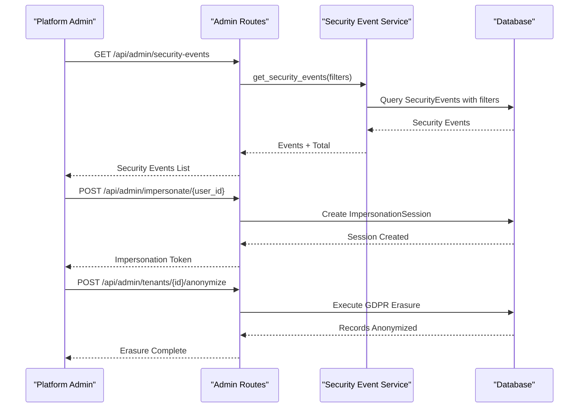

**Diagram sources**
- [admin.py:140-209](file://app/backend/routes/admin.py#L140-L209)
- [admin.py:301-329](file://app/backend/routes/admin.py#L301-L329)
- [admin.py:493-558](file://app/backend/routes/admin.py#L493-L558)
- [admin.py:736-766](file://app/backend/routes/admin.py#L736-L766)
- [admin.py:2064-2110](file://app/backend/routes/admin.py#L2064-L2110)
- [admin.py:2000-2045](file://app/backend/routes/admin.py#L2000-L2045)
- [security_event_service.py:150-180](file://app/backend/services/security_event_service.py#L150-L180)

**Section sources**
- [admin.py:140-209](file://app/backend/routes/admin.py#L140-L209)
- [admin.py:214-296](file://app/backend/routes/admin.py#L214-L296)
- [admin.py:301-360](file://app/backend/routes/admin.py#L301-L360)
- [admin.py:414-453](file://app/backend/routes/admin.py#L414-L453)
- [admin.py:458-488](file://app/backend/routes/admin.py#L458-L488)
- [admin.py:493-558](file://app/backend/routes/admin.py#L493-L558)
- [admin.py:562-695](file://app/backend/routes/admin.py#L562-L695)
- [admin.py:700-777](file://app/backend/routes/admin.py#L700-L777)
- [admin.py:780-800](file://app/backend/routes/admin.py#L780-L800)
- [admin.py:736-766](file://app/backend/routes/admin.py#L736-L766)
- [admin.py:2000-2045](file://app/backend/routes/admin.py#L2000-L2045)
- [admin.py:2064-2110](file://app/backend/routes/admin.py#L2064-L2110)
- [admin.py:2113-2167](file://app/backend/routes/admin.py#L2113-L2167)
- [admin.py:2169-2208](file://app/backend/routes/admin.py#L2169-L2208)
- [admin.py:2211-2268](file://app/backend/routes/admin.py#L2211-L2268)
- [admin.py:2271-2304](file://app/backend/routes/admin.py#L2271-L2304)
- [admin.py:2325-2367](file://app/backend/routes/admin.py#L2325-L2367)
- [admin.py:2370-2406](file://app/backend/routes/admin.py#L2370-L2406)
- [admin.py:2409-2472](file://app/backend/routes/admin.py#L2409-L2472)
- [admin.py:2475-2495](file://app/backend/routes/admin.py#L2475-L2495)

### Enhanced Role-Based Access Control
The system now implements comprehensive platform-level role-based access control with backward compatibility:
- **Granular Platform Roles**: super_admin (full platform access), billing_admin (billing management), support (tenant impersonation), security_admin (security monitoring), readonly (view-only)
- **Backward Compatibility**: Legacy is_platform_admin=true automatically treated as super_admin
- **Role Hierarchy**: require_platform_admin for any platform role, require_super_admin for full access, require_billing_admin, require_support, require_security_admin, require_readonly_platform
- **Role Validation**: Internal _check_platform_role function validates user roles against allowed roles
- **Feature Gating**: require_feature dependency checks feature availability for tenant's plan
- **Tenant Suspension Bypass**: Platform admins can bypass tenant suspension restrictions

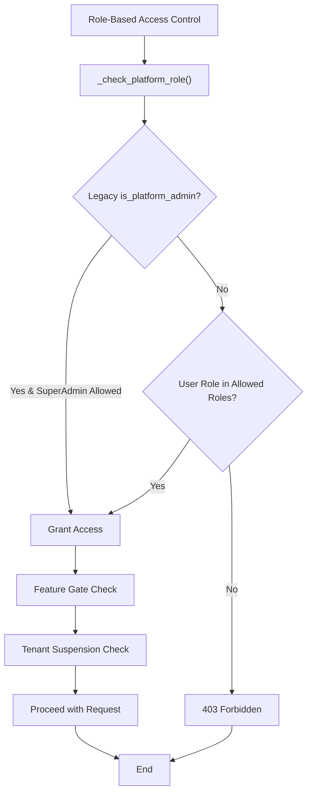

**Diagram sources**
- [auth.py:176-239](file://app/backend/middleware/auth.py#L176-L239)

**Section sources**
- [auth.py:31-53](file://app/backend/middleware/auth.py#L31-L53)
- [auth.py:176-239](file://app/backend/middleware/auth.py#L176-L239)
- [admin.py:17-24](file://app/backend/routes/admin.py#L17-L24)

### Comprehensive Security Event Monitoring
The security event system provides enterprise-grade security monitoring and threat detection:
- **Event Types**: login_success, login_failure, password_reset_requested, token_revoked, impersonation_started, impersonation_ended, suspicious_activity
- **Event Recording**: Automatic security event logging with tenant and user context
- **Suspicious Activity Detection**: Threshold-based detection of login failures within time windows
- **Event Filtering**: Comprehensive filtering by event type, tenant, user, IP address, and date range
- **Context Preservation**: IP addresses, user agents, and detailed event metadata
- **Audit Integration**: Security events integrated with comprehensive audit logging
- **Real-time Monitoring**: Immediate event recording and retrieval capabilities

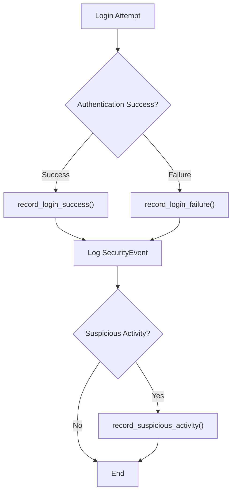

**Diagram sources**
- [security_event_service.py:24-115](file://app/backend/services/security_event_service.py#L24-L115)
- [security_event_service.py:117-148](file://app/backend/services/security_event_service.py#L117-L148)
- [security_event_service.py:150-180](file://app/backend/services/security_event_service.py#L150-L180)

**Section sources**
- [security_event_service.py:14-115](file://app/backend/services/security_event_service.py#L14-L115)
- [security_event_service.py:117-180](file://app/backend/services/security_event_service.py#L117-L180)
- [db_models.py:548-563](file://app/backend/models/db_models.py#L548-L563)

### Admin Impersonation System
The impersonation system enables support and administrative debugging with comprehensive session management:
- **Secure Token Generation**: SHA-256 hashed impersonation tokens with unique token_hash indexing
- **Session Tracking**: ImpersonationSession model with admin_user_id, target_user_id, and session metadata
- **Expiration Management**: Automatic session expiration with expires_at timestamp validation
- **Revocation Capability**: Session revocation with revoked_at timestamp and audit logging
- **IP Address Tracking**: Origin IP address capture for security and audit purposes
- **Audit Integration**: Impersonation events logged as security events and audit logs
- **Middleware Integration**: X-Impersonation-Token header validation in authentication middleware
- **Support Use Cases**: Debugging tenant issues, investigating user problems, and administrative oversight

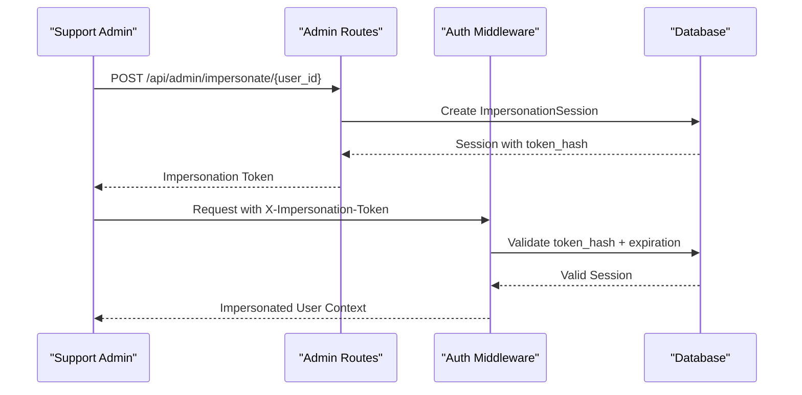

**Diagram sources**
- [admin.py:2000-2045](file://app/backend/routes/admin.py#L2000-L2045)
- [auth.py:101-131](file://app/backend/middleware/auth.py#L101-L131)
- [db_models.py:532-546](file://app/backend/models/db_models.py#L532-L546)

**Section sources**
- [admin.py:2000-2045](file://app/backend/routes/admin.py#L2000-L2045)
- [db_models.py:532-546](file://app/backend/models/db_models.py#L532-L546)
- [auth.py:101-131](file://app/backend/middleware/auth.py#L101-L131)

### GDPR Data Erasure Compliance
The system provides comprehensive GDPR compliance with automated data erasure capabilities:
- **Erasure Request Management**: ErasureLog model tracks all data erasure requests with status tracking
- **Automated Data Processing**: execute_erasure function processes and anonymizes tenant data across all relevant tables
- **Audit Trail**: Complete audit trail with actor tracking, timestamps, and record counts
- **Tenant Suspension**: Automatic tenant suspension during erasure process
- **Error Handling**: Comprehensive error handling with failure status and detailed error logging
- **Record Counting**: Accurate counting of affected records across all processed tables
- **JSON Details**: Structured details storage for audit and compliance reporting
- **Compliance Features**: Supports right to erasure requests with complete data anonymization

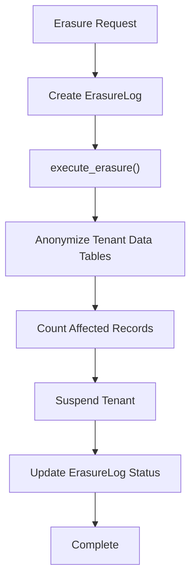

**Diagram sources**
- [admin.py:2064-2110](file://app/backend/routes/admin.py#L2064-L2110)
- [erasure_service.py:24-157](file://app/backend/services/erasure_service.py#L24-L157)

**Section sources**
- [admin.py:2064-2110](file://app/backend/routes/admin.py#L2064-L2110)
- [admin.py:2113-2167](file://app/backend/routes/admin.py#L2113-L2167)
- [admin.py:2141-2167](file://app/backend/routes/admin.py#L2141-L2167)
- [erasure_service.py:24-157](file://app/backend/services/erasure_service.py#L24-L157)
- [db_models.py:647-663](file://app/backend/models/db_models.py#L647-L663)

### Plan-Feature Entitlement Mapping
The system provides subscription plan to feature flag entitlement mapping for precise feature access control:
- **PlanFeature Model**: Maps subscription plans to feature flags with enablement status
- **Entitlement Management**: Individual plan-feature mappings override global feature flag defaults
- **Automatic Invalidation**: Cache invalidation when plan-feature mappings change
- **Billing Admin Access**: Dedicated billing admin role for plan-feature management
- **Audit Logging**: Comprehensive audit trail for all plan-feature changes
- **Global Default Fallback**: Reverts to global feature flag default when mapping is removed
- **Tenant Impact**: Automatic cache invalidation for all tenants on affected plans

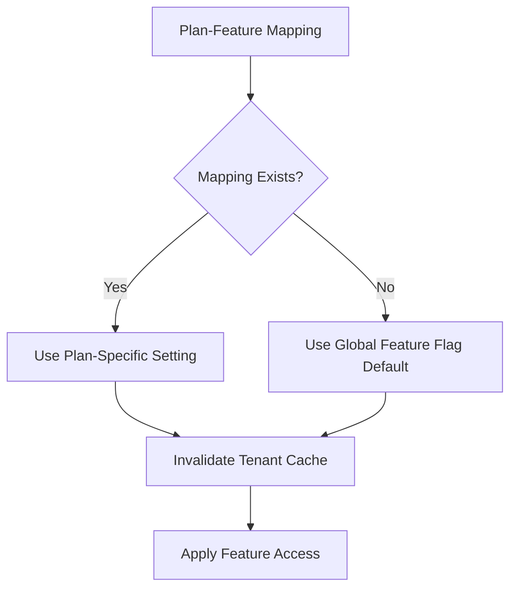

**Diagram sources**
- [admin.py:2181-2208](file://app/backend/routes/admin.py#L2181-L2208)
- [admin.py:2211-2268](file://app/backend/routes/admin.py#L2211-L2268)
- [admin.py:2271-2304](file://app/backend/routes/admin.py#L2271-L2304)

**Section sources**
- [admin.py:2169-2208](file://app/backend/routes/admin.py#L2169-L2208)
- [admin.py:2211-2268](file://app/backend/routes/admin.py#L2211-L2268)
- [admin.py:2271-2304](file://app/backend/routes/admin.py#L2271-L2304)
- [db_models.py:631-645](file://app/backend/models/db_models.py#L631-L645)

### Enhanced Rate Limit Management
The system provides comprehensive rate limit management with administrative controls:
- **Per-Tenant Rate Limits**: Configurable requests_per_minute and llm_concurrent_max per tenant
- **Administrative Controls**: Platform admins can view, update, and delete tenant rate limit configurations
- **Default Values**: 60 requests_per_minute and 2 concurrent LLM operations by default
- **Cache Invalidation**: Automatic cache invalidation when rate limit configurations change
- **Search and Filter**: Paginated listing with tenant name/slug search and filtering
- **Validation**: Input validation ensuring minimum values and proper types
- **Audit Logging**: Comprehensive audit trail for all rate limit changes

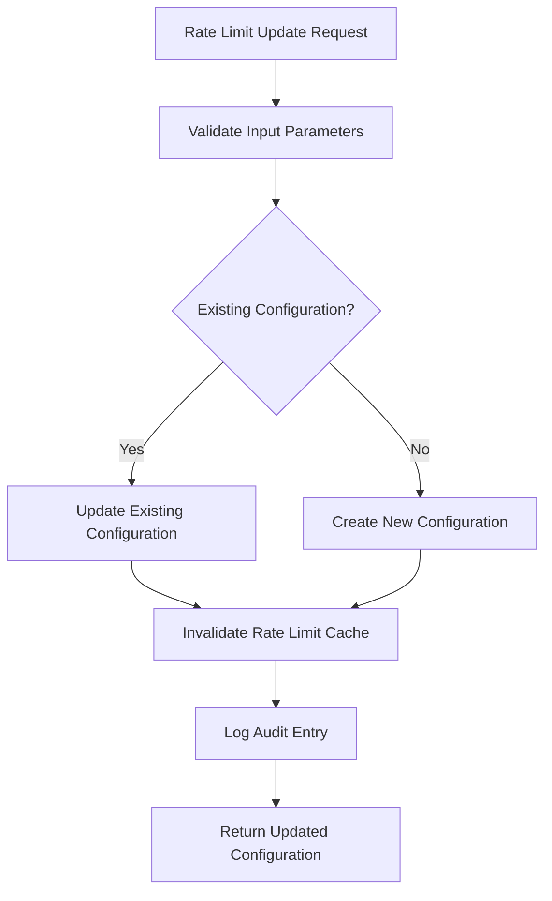

**Diagram sources**
- [admin.py:2325-2367](file://app/backend/routes/admin.py#L2325-L2367)
- [admin.py:2370-2406](file://app/backend/routes/admin.py#L2370-L2406)
- [admin.py:2409-2472](file://app/backend/routes/admin.py#L2409-L2472)
- [admin.py:2475-2495](file://app/backend/routes/admin.py#L2475-L2495)

**Section sources**
- [admin.py:2325-2367](file://app/backend/routes/admin.py#L2325-L2367)
- [admin.py:2370-2406](file://app/backend/routes/admin.py#L2370-L2406)
- [admin.py:2409-2472](file://app/backend/routes/admin.py#L2409-L2472)
- [admin.py:2475-2495](file://app/backend/routes/admin.py#L2475-L2495)
- [rate_limit.py:81-118](file://app/backend/middleware/rate_limit.py#L81-L118)

### Enhanced Tenant Isolation and Administrative Dashboard
The system now includes comprehensive administrative capabilities with tenant management, audit logging, and platform metrics:
- Administrative dashboard with tenant listing, detail views, and management controls
- Tenant suspension and reactivation with reason tracking
- Usage adjustment and plan modification capabilities
- Audit logging for all administrative actions with detailed context
- Platform metrics overview with tenant statistics and revenue tracking
- Usage trend reporting for historical analysis
- SSO configuration management for tenant authentication policies
- Tenant email configuration for outbound notification management
- Full CRUD operations for tenant management including creation, updates, and deletion
- Comprehensive tenant lifecycle management with onboarding workflows
- **New**: Security event monitoring with filtering and pagination
- **New**: Admin impersonation session management
- **New**: GDPR data erasure request and tracking
- **New**: Plan-feature entitlement management
- **New**: Rate limit configuration management

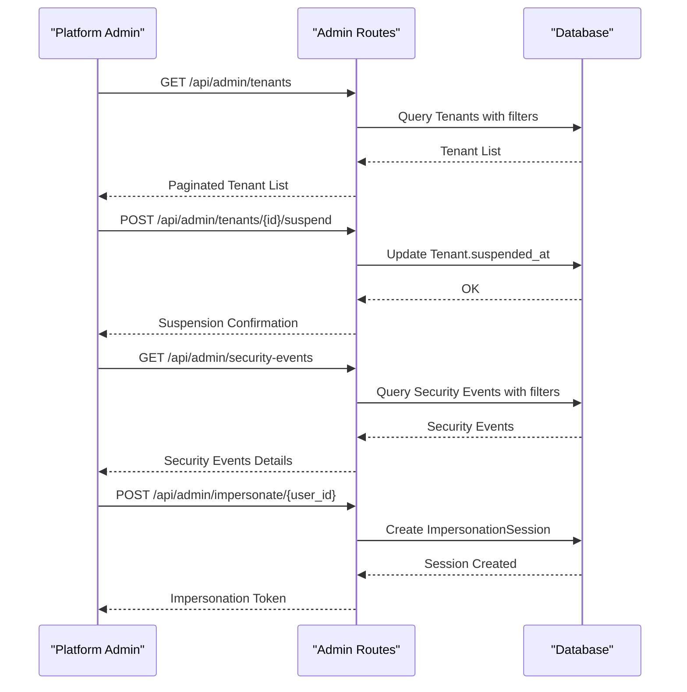

**Diagram sources**
- [admin.py:140-209](file://app/backend/routes/admin.py#L140-L209)
- [admin.py:301-329](file://app/backend/routes/admin.py#L301-L329)
- [admin.py:493-558](file://app/backend/routes/admin.py#L493-L558)
- [admin.py:736-766](file://app/backend/routes/admin.py#L736-L766)
- [admin.py:2000-2045](file://app/backend/routes/admin.py#L2000-L2045)

**Section sources**
- [admin.py:140-209](file://app/backend/routes/admin.py#L140-L209)
- [admin.py:214-296](file://app/backend/routes/admin.py#L214-L296)
- [admin.py:301-360](file://app/backend/routes/admin.py#L301-L360)
- [admin.py:414-453](file://app/backend/routes/admin.py#L414-L453)
- [admin.py:458-488](file://app/backend/routes/admin.py#L458-L488)
- [admin.py:493-558](file://app/backend/routes/admin.py#L493-L558)
- [admin.py:562-695](file://app/backend/routes/admin.py#L562-L695)
- [admin.py:700-777](file://app/backend/routes/admin.py#L700-L777)
- [admin.py:780-800](file://app/backend/routes/admin.py#L780-L800)
- [admin.py:736-766](file://app/backend/routes/admin.py#L736-L766)

### Enhanced Subscription Management and Billing Integration
The billing system now supports multiple payment providers with comprehensive integration:
- Factory pattern for payment provider selection and configuration
- Stripe provider with checkout sessions, subscription management, and webhook handling
- Razorpay provider support for international markets
- Manual provider fallback for testing and development
- Platform configuration management for provider credentials
- Tenant billing integration with Stripe customer and subscription IDs
- Invoice generation and management for successful payments with sequential numbering
- Dunning system for failed payment retry attempts with configurable retry schedules
- Comprehensive billing events and webhook processing

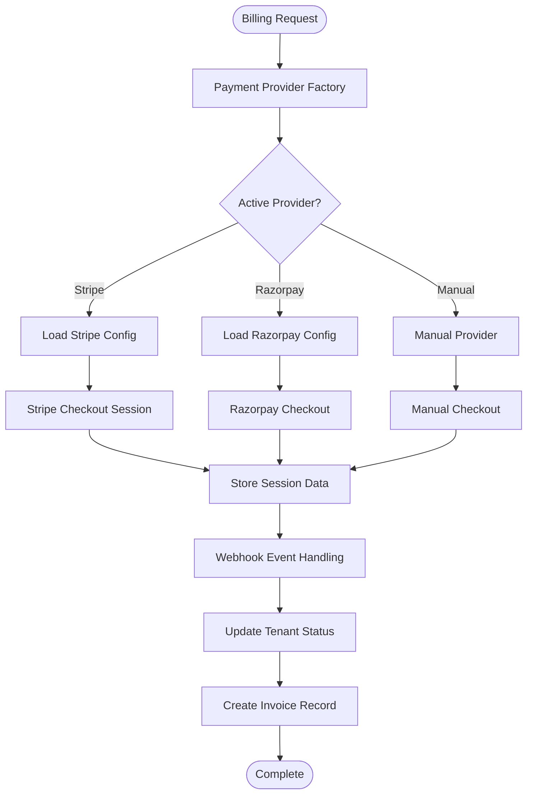

**Diagram sources**
- [factory.py:37-91](file://app/backend/services/billing/factory.py#L37-L91)
- [stripe_provider.py:36-100](file://app/backend/services/billing/stripe_provider.py#L36-L100)
- [billing.py:39-113](file://app/backend/routes/billing.py#L39-L113)
- [db_models.py:582-611](file://app/backend/models/db_models.py#L582-L611)
- [db_models.py:613-629](file://app/backend/models/db_models.py#L613-L629)

**Section sources**
- [factory.py:13-34](file://app/backend/services/billing/factory.py#L13-L34)
- [factory.py:37-91](file://app/backend/services/billing/factory.py#L37-L91)
- [stripe_provider.py:12-100](file://app/backend/services/billing/stripe_provider.py#L12-L100)
- [billing.py:15-113](file://app/backend/routes/billing.py#L15-L113)
- [014_billing_system.py:33-56](file://alembic/versions/014_billing_system.py#L33-L56)
- [db_models.py:582-611](file://app/backend/models/db_models.py#L582-L611)
- [db_models.py:613-629](file://app/backend/models/db_models.py#L613-L629)

### Comprehensive Invoice System
The invoice system provides complete payment tracking and receipt generation:
- Sequential invoice numbering with yearly reset (INV-YYYY-NNNNN format)
- Automatic invoice creation upon successful payment processing
- Detailed line item tracking with plan descriptions and amounts
- Tenant-specific invoice retrieval with pagination
- Invoice status tracking (paid, pending, failed)
- Period coverage tracking for subscription billing cycles
- Provider integration for external invoice IDs

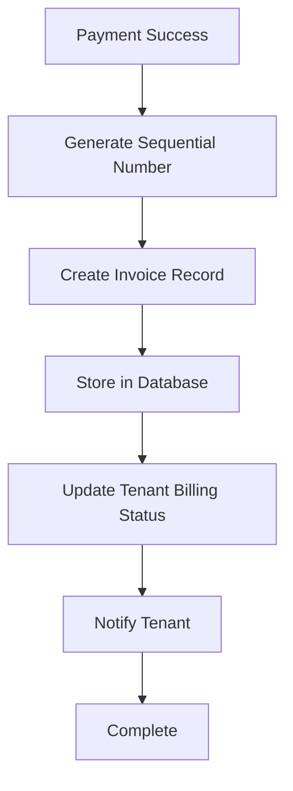

**Diagram sources**
- [invoice_service.py:18-44](file://app/backend/services/billing/invoice_service.py#L18-L44)
- [invoice_service.py:47-97](file://app/backend/services/billing/invoice_service.py#L47-L97)
- [028_invoices.py:13-31](file://alembic/versions/028_invoices.py#L13-L31)

**Section sources**
- [invoice_service.py:18-134](file://app/backend/services/billing/invoice_service.py#L18-L134)
- [028_invoices.py:13-31](file://alembic/versions/028_invoices.py#L13-L31)

### Advanced Dunning System
The dunning system manages failed payment retries with configurable escalation:
- Configurable retry schedules (1, 3, 7, 14 days by default)
- Maximum retry limits with configurable settings
- Automatic tenant suspension after max retries
- Detailed failure reason tracking
- Background processing for retry attempts
- Webhook notifications for dunning events
- Subscription status synchronization with payment providers

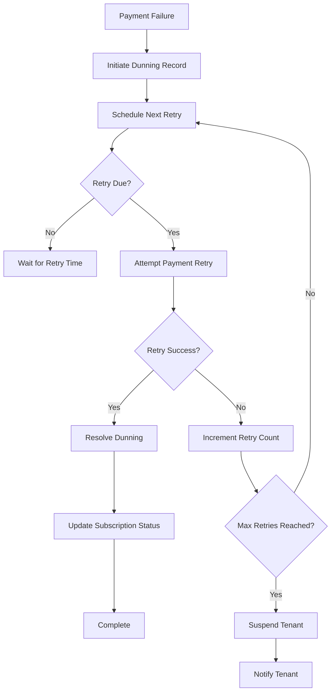

**Diagram sources**
- [dunning_service.py:64-139](file://app/backend/services/billing/dunning_service.py#L64-L139)
- [dunning_service.py:141-259](file://app/backend/services/billing/dunning_service.py#L141-L259)
- [029_dunning_system.py:13-37](file://alembic/versions/029_dunning_system.py#L13-L37)

**Section sources**
- [dunning_service.py:42-428](file://app/backend/services/billing/dunning_service.py#L42-L428)
- [029_dunning_system.py:13-43](file://alembic/versions/029_dunning_system.py#L13-L43)

### Usage Alert System
The usage alert system monitors plan limits and notifies tenants of threshold breaches:
- 80% and 100% usage thresholds for all plan limits
- Duplicate alert prevention within billing periods
- Multi-channel notification dispatch (webhook + email)
- Tenant-specific SMTP configuration for alert delivery
- Automated alert generation after usage increments
- Historical alert tracking with pagination

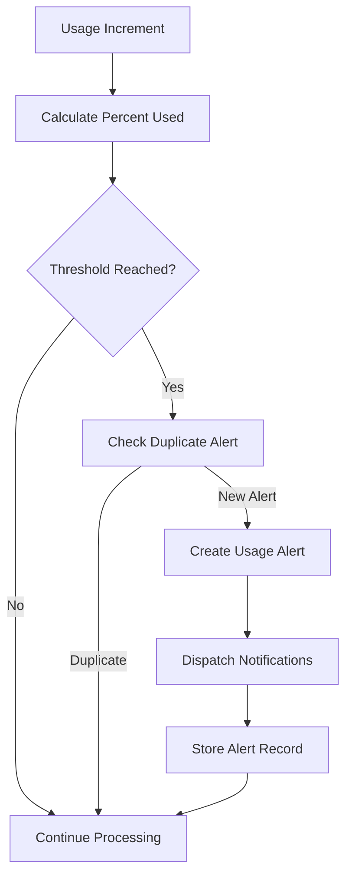

**Diagram sources**
- [usage_alert_service.py:30-97](file://app/backend/services/usage_alert_service.py#L30-L97)
- [usage_alert_service.py:128-224](file://app/backend/services/usage_alert_service.py#L128-L224)
- [030_usage_alerts.py:13-26](file://alembic/versions/030_usage_alerts.py#L13-L26)

**Section sources**
- [usage_alert_service.py:21-239](file://app/backend/services/usage_alert_service.py#L21-L239)
- [030_usage_alerts.py:13-31](file://alembic/versions/030_usage_alerts.py#L13-L31)

### Enhanced SSO/SAML Integration
The SSO system provides comprehensive tenant-specific authentication:
- SAML 2.0 implementation with signature verification
- Tenant-specific SSO configuration management
- Auto-provisioning of users with default roles
- Enforce SSO policy per tenant
- SP metadata generation for IdP configuration
- Signature verification with X.509 certificates
- Attribute extraction from SAML assertions

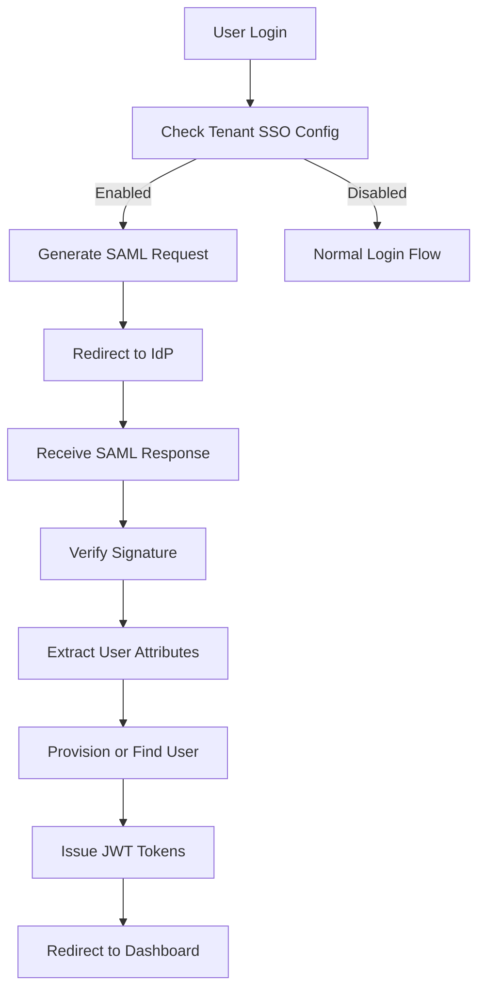

**Diagram sources**
- [sso_service.py:167-186](file://app/backend/services/sso_service.py#L167-L186)
- [sso_service.py:188-290](file://app/backend/services/sso_service.py#L188-L290)
- [sso_service.py:292-330](file://app/backend/services/sso_service.py#L292-L330)
- [sso.py:58-123](file://app/backend/routes/sso.py#L58-L123)
- [032_sso_config.py:13-31](file://alembic/versions/032_sso_config.py#L13-L31)

**Section sources**
- [sso_service.py:164-335](file://app/backend/services/sso_service.py#L164-L335)
- [sso.py:26-156](file://app/backend/routes/sso.py#L26-L156)
- [032_sso_config.py:13-36](file://alembic/versions/032_sso_config.py#L13-L36)

### Per-Tenant Rate Limiting and Feature Flag Management
The system now implements sophisticated rate limiting and feature flag management:
- In-memory token bucket rate limiting per tenant with configurable RPM
- Cache-based feature flag resolution with tenant overrides
- Real-time configuration updates with TTL caching
- Audit logging for feature flag changes
- Tenant-specific rate limit configuration
- **New**: Rate limit configuration management with administrative controls

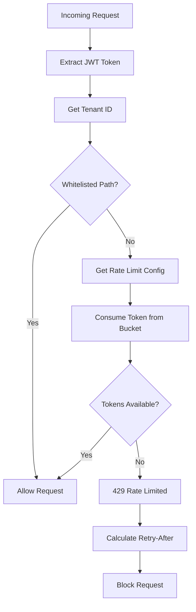

**Diagram sources**
- [rate_limit.py:124-148](file://app/backend/middleware/rate_limit.py#L124-L148)
- [feature_flag_service.py:46-79](file://app/backend/services/feature_flag_service.py#L46-L79)

**Section sources**
- [rate_limit.py:17-148](file://app/backend/middleware/rate_limit.py#L17-L148)
- [feature_flag_service.py:13-44](file://app/backend/services/feature_flag_service.py#L13-L44)
- [feature_flag_service.py:46-94](file://app/backend/services/feature_flag_service.py#L46-L94)
- [auth.py:78-92](file://app/backend/middleware/auth.py#L78-L92)

### Team Collaboration and Access Delegation
Enhanced team collaboration with administrative oversight:
- Roles: admin, recruiter, viewer with platform admin privileges
- Admin-only operations with comprehensive audit logging
- Invite management with tenant scoping
- Member removal with proper cleanup
- Collaborative features with tenant isolation
- Team member listing with user details

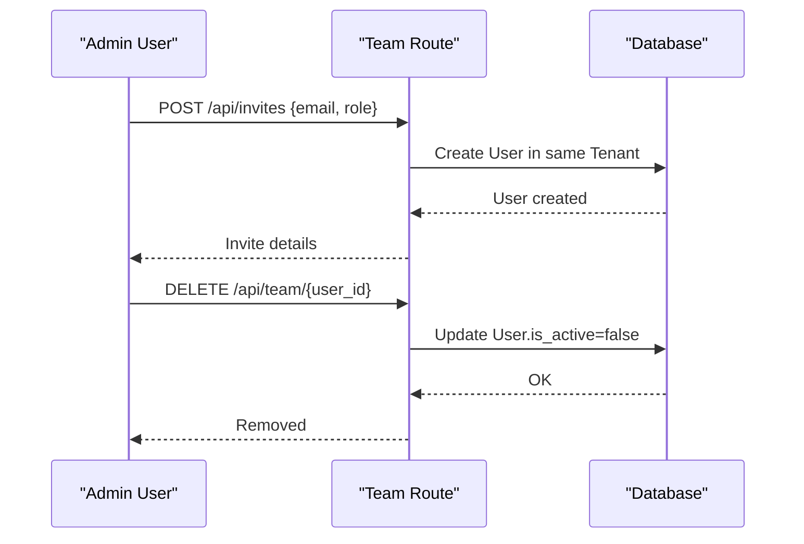

**Diagram sources**
- [team.py:34-61](file://app/backend/routes/team.py#L34-L61)
- [team.py:64-82](file://app/backend/routes/team.py#L64-L82)
- [auth.py:57-96](file://app/backend/middleware/auth.py#L57-L96)

**Section sources**
- [team.py:18-31](file://app/backend/routes/team.py#L18-L31)
- [team.py:34-61](file://app/backend/routes/team.py#L34-L61)
- [team.py:64-82](file://app/backend/routes/team.py#L64-L82)
- [team.py:85-134](file://app/backend/routes/team.py#L85-L134)

### Enhanced Tenant Lifecycle Management
Comprehensive tenant lifecycle management with administrative controls:
- Onboarding with tenant creation and admin assignment
- Suspension and reactivation with reason tracking
- Plan modification with audit trail
- Usage adjustment for administrative purposes
- Metadata storage for tenant configuration
- Stripe integration for billing management
- SSO configuration for tenant authentication
- Email configuration for tenant notifications
- Full CRUD operations for tenant management
- Comprehensive administrative portal with tenant oversight
- **New**: Security event monitoring and reporting
- **New**: Admin impersonation session management
- **New**: GDPR data erasure request and tracking
- **New**: Plan-feature entitlement management
- **New**: Rate limit configuration management

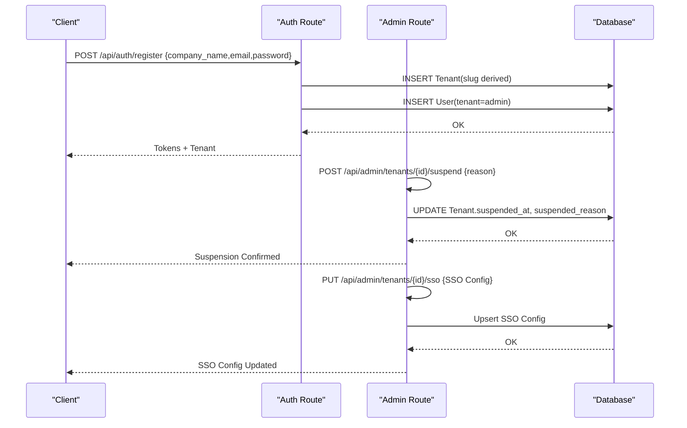

**Diagram sources**
- [auth.py:57-96](file://app/backend/middleware/auth.py#L57-L96)
- [admin.py:301-329](file://app/backend/routes/admin.py#L301-L329)
- [admin.py:768-800](file://app/backend/routes/admin.py#L768-L800)
- [003_subscription_system.py:235-251](file://alembic/versions/003_subscription_system.py#L235-L251)

**Section sources**
- [auth.py:57-96](file://app/backend/middleware/auth.py#L57-L96)
- [admin.py:301-360](file://app/backend/routes/admin.py#L301-L360)
- [admin.py:365-410](file://app/backend/routes/admin.py#L365-L410)
- [admin.py:414-453](file://app/backend/routes/admin.py#L414-L453)
- [admin.py:768-800](file://app/backend/routes/admin.py#L768-L800)
- [003_subscription_system.py:43-251](file://alembic/versions/003_subscription_system.py#L43-L251)

### Usage Enforcement and Quota Management
Enhanced usage enforcement with comprehensive tracking:
- Per-request checks with detailed usage logging
- Batch endpoint support with configurable batch sizes
- Monthly reset automation with usage counter management
- Unlimited plan handling for negative limits
- Detailed usage tracking with action categorization
- Integration with administrative dashboard for usage monitoring
- Usage alert system for threshold notifications

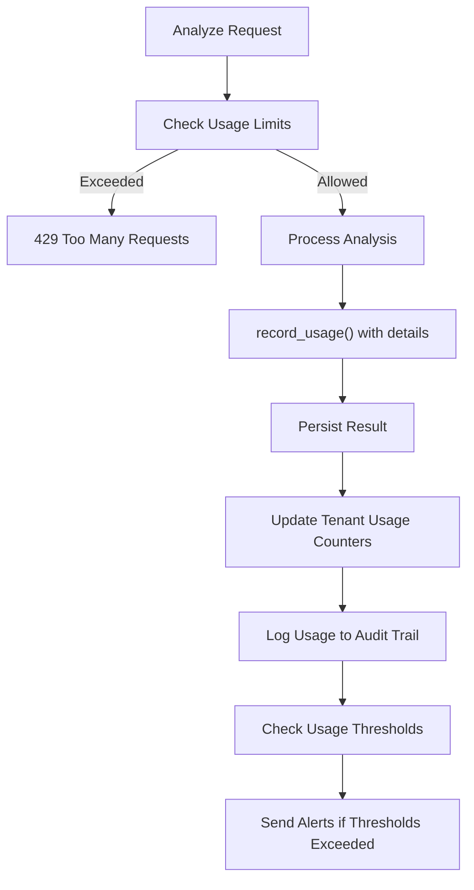

**Diagram sources**
- [analyze.py:323-351](file://app/backend/routes/analyze.py#L323-L351)
- [subscription.py:427-476](file://app/backend/routes/subscription.py#L427-L476)
- [db_models.py:796-815](file://app/backend/models/db_models.py#L796-L815)

**Section sources**
- [analyze.py:323-351](file://app/backend/routes/analyze.py#L323-L351)
- [analyze.py:651-758](file://app/backend/routes/analyze.py#L651-L758)
- [subscription.py:72-84](file://app/backend/routes/subscription.py#L72-L84)
- [subscription.py:427-476](file://app/backend/routes/subscription.py#L427-L476)
- [test_usage_enforcement.py:56-191](file://app/backend/tests/test_usage_enforcement.py#L56-L191)
- [db_models.py:796-815](file://app/backend/models/db_models.py#L796-L815)

### Tenant-Aware Query Patterns and Security Boundaries
Enhanced security with administrative oversight:
- Tenant isolation enforced at route level with comprehensive filtering
- Platform admin privileges for cross-tenant operations
- Tenant suspension checking with exception handling
- Audit logging for all administrative actions
- Feature flag enforcement with tenant overrides
- Rate limiting with per-tenant configuration
- SSO enforcement for tenant authentication policies
- Email configuration isolation for tenant notifications
- Comprehensive administrative role-based access control
- **New**: Security event monitoring with tenant/user scoping
- **New**: Admin impersonation session validation
- **New**: GDPR data erasure audit trails

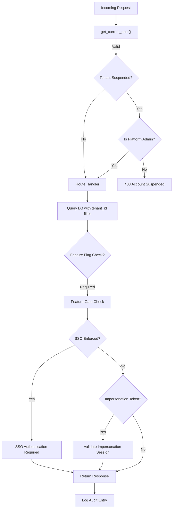

**Diagram sources**
- [auth.py:19-46](file://app/backend/middleware/auth.py#L19-L46)
- [auth.py:57-62](file://app/backend/middleware/auth.py#L57-L62)
- [auth.py:78-92](file://app/backend/middleware/auth.py#L78-L92)
- [team.py:18-31](file://app/backend/routes/team.py#L18-L31)
- [candidates.py:26-80](file://app/backend/routes/candidates.py#L26-L80)
- [admin.py:736-766](file://app/backend/routes/admin.py#L736-L766)
- [auth.py:101-131](file://app/backend/middleware/auth.py#L101-L131)

**Section sources**
- [auth.py:19-46](file://app/backend/middleware/auth.py#L19-L46)
- [auth.py:57-62](file://app/backend/middleware/auth.py#L57-L62)
- [auth.py:78-92](file://app/backend/middleware/auth.py#L78-L92)
- [team.py:18-31](file://app/backend/routes/team.py#L18-L31)
- [candidates.py:26-80](file://app/backend/routes/candidates.py#L26-L80)
- [admin.py:736-766](file://app/backend/routes/admin.py#L736-L766)
- [auth.py:101-131](file://app/backend/middleware/auth.py#L101-L131)

### Enhanced Shared Resources and Scalability
Advanced shared resources with administrative controls:
- Shared JD cache with tenant-aware caching strategies
- Skills registry with hot reload capabilities
- Per-tenant rate limiting with configurable concurrency
- Webhook management system for tenant event notifications
- Platform configuration management for provider settings
- Audit logging for all administrative operations
- Enhanced metrics collection for platform monitoring
- SSO configuration management for tenant security
- Tenant email configuration for notification management
- Comprehensive billing configuration management
- **New**: Security event monitoring infrastructure
- **New**: Admin impersonation session management
- **New**: GDPR data erasure audit trail infrastructure
- **New**: Plan-feature entitlement mapping system

**Section sources**
- [db_models.py:229-250](file://app/backend/models/db_models.py#L229-L250)
- [hybrid_pipeline.py:24-32](file://app/backend/services/hybrid_pipeline.py#L24-L32)
- [003_subscription_system.py:93-117](file://alembic/versions/003_subscription_system.py#L93-L117)
- [db_models.py:319-330](file://app/backend/models/db_models.py#L319-L330)
- [db_models.py:331-365](file://app/backend/models/db_models.py#L331-L365)
- [db_models.py:367-378](file://app/backend/models/db_models.py#L367-L378)
- [db_models.py:497-507](file://app/backend/models/db_models.py#L497-L507)
- [db_models.py:509-529](file://app/backend/models/db_models.py#L509-L529)
- [db_models.py:531-546](file://app/backend/models/db_models.py#L531-L546)
- [db_models.py:548-563](file://app/backend/models/db_models.py#L548-L563)

### Enhanced Administrative Portal and Enterprise Features
Comprehensive administrative interface with enterprise-grade features:
- Plan management interface for creating, updating, and archiving subscription plans
- Email configuration management for tenant SMTP settings
- Tenant dashboard with usage statistics and management controls
- Audit logging interface for administrative oversight
- Usage alert management for threshold notifications
- SSO configuration interface for tenant authentication policies
- **New**: Security events monitoring with filtering and pagination
- **New**: Admin impersonation session management with token generation
- **New**: GDPR data erasure request and tracking interface
- **New**: Plan-feature entitlement mapping management
- **New**: Rate limit configuration management with administrative controls
- Comprehensive tenant CRUD operations with full administrative control
- Platform configuration management for billing and dunning settings

```mermaid
flowchart TD
AdminPortal["Admin Portal"] --> PlanMgmt["Plan Management"]
AdminPortal --> EmailCfg["Email Configuration"]
AdminPortal --> TenantDash["Tenant Dashboard"]
AdminPortal --> AuditLog["Audit Logging"]
AdminPortal --> SSOMgmt["SSO Management"]
AdminPortal --> SecurityEvents["Security Events"]
AdminPortal --> Impersonation["Admin Impersonation"]
AdminPortal --> Erasure["GDPR Erasure"]
AdminPortal --> PlanFeatures["Plan Features"]
AdminPortal --> RateLimits["Rate Limits"]
PlanMgmt --> CreatePlan["Create Plan"]
PlanMgmt --> UpdatePlan["Update Plan"]
PlanMgmt --> ArchivePlan["Archive Plan"]
EmailCfg --> SMTPConfig["SMTP Configuration"]
EmailCfg --> TestConnection["Test Connection"]
TenantDash --> UsageStats["Usage Statistics"]
TenantDash --> Suspension["Tenant Suspension"]
SecurityEvents --> FilterEvents["Filter & Search"]
SecurityEvents --> ViewDetails["View Event Details"]
Impersonation --> CreateSession["Create Session"]
Impersonation --> ManageSessions["Manage Sessions"]
Erasure --> RequestErasure["Request Erasure"]
Erasure --> TrackLogs["Track Erasure Logs"]
PlanFeatures --> MapFeatures["Map Features to Plans"]
PlanFeatures --> ManageEntitlements["Manage Entitlements"]
RateLimits --> ViewConfigs["View Rate Limit Configs"]
RateLimits --> UpdateConfigs["Update Rate Limit Configs"]
```

**Diagram sources**
- [PlanManagementPage.jsx:103](file://app/frontend/src/pages/admin/PlanManagementPage.jsx#L103)
- [EmailSettings.jsx:70](file://app/frontend/src/pages/admin/EmailSettings.jsx#L70)
- [SecurityEventsPage.jsx:1](file://app/frontend/src/pages/admin/SecurityEventsPage.jsx#L1)
- [ImpersonationPage.jsx:1](file://app/frontend/src/pages/admin/ImpersonationPage.jsx#L1)
- [ErasurePage.jsx:1](file://app/frontend/src/pages/admin/ErasurePage.jsx#L1)

**Section sources**
- [PlanManagementPage.jsx:103-725](file://app/frontend/src/pages/admin/PlanManagementPage.jsx#L103-L725)
- [EmailSettings.jsx:70-441](file://app/frontend/src/pages/admin/EmailSettings.jsx#L70-L441)
- [SecurityEventsPage.jsx:1-139](file://app/frontend/src/pages/admin/SecurityEventsPage.jsx#L1-L139)
- [ImpersonationPage.jsx:1-205](file://app/frontend/src/pages/admin/ImpersonationPage.jsx#L1-L205)
- [ErasurePage.jsx:1-214](file://app/frontend/src/pages/admin/ErasurePage.jsx#L1-L214)

## Dependency Analysis
Enhanced dependency structure with enterprise administrative components:
- Route dependencies expanded with administrative routes, security event routes, and enterprise features
- Middleware dependencies include rate limiting and enhanced authentication with impersonation support
- Database dependencies include audit logs, feature flags, rate limit configs, security events, impersonation sessions, and erasure logs
- Service dependencies expanded with billing providers, dunning, invoice, usage alert, security event, and erasure services
- Test dependencies cover administrative APIs, tenant suspension, enterprise security features, and feature flags
- Frontend dependencies include admin portal components, security monitoring interfaces, impersonation management, and GDPR compliance tools
- SSO service dependencies include cryptography and XML parsing libraries
- **New**: Security event service dependencies for comprehensive security monitoring
- **New**: Erasure service dependencies for GDPR compliance functionality
- **New**: Impersonation service dependencies for admin impersonation support

```mermaid
graph LR
AdminRoutes["routes/admin.py"] --> Models["db_models.py"]
BillingRoutes["routes/billing.py"] --> Models
SSORoutes["routes/sso.py"] --> Models
RateLimit["middleware/rate_limit.py"] --> Models
FeatureService["services/feature_flag_service.py"] --> Models
AuditService["services/audit_service.py"] --> Models
Factory["services/billing/factory.py"] --> Models
StripeProvider["services/billing/stripe_provider.py"] --> Models
InvoiceService["services/billing/invoice_service.py"] --> Models
DunningService["services/billing/dunning_service.py"] --> Models
UsageAlertService["services/usage_alert_service.py"] --> Models
SSOService["services/sso_service.py"] --> Models
SecurityEventService["services/security_event_service.py"] --> Models
ErasureService["services/erasure_service.py"] --> Models
Auth["middleware/auth.py"] --> Models
Analyze["routes/analyze.py"] --> SubHelpers["subscription.py helpers"]
Team["routes/team.py"] --> Models
Candidates["routes/candidates.py"] --> Models
Subscription["routes/subscription.py"] --> Models
Models --> DB["SQLAlchemy ORM"]
PlanMgmt["frontend/PlanManagementPage.jsx"] --> AdminRoutes
EmailCfg["frontend/EmailSettings.jsx"] --> AdminRoutes
SecurityEvents["frontend/SecurityEventsPage.jsx"] --> AdminRoutes
Impersonation["frontend/ImpersonationPage.jsx"] --> AdminRoutes
Erasure["frontend/ErasurePage.jsx"] --> AdminRoutes
```

**Diagram sources**
- [admin.py:25](file://app/backend/routes/admin.py#L25)
- [billing.py:12](file://app/backend/routes/billing.py#L12)
- [sso.py:21](file://app/backend/routes/sso.py#L21)
- [rate_limit.py:17](file://app/backend/middleware/rate_limit.py#L17)
- [feature_flag_service.py:1](file://app/backend/services/feature_flag_service.py#L1)
- [audit_service.py:1](file://app/backend/services/audit_service.py#L1)
- [factory.py:1](file://app/backend/services/billing/factory.py#L1)
- [stripe_provider.py:1](file://app/backend/services/billing/stripe_provider.py#L1)
- [invoice_service.py:1](file://app/backend/services/billing/invoice_service.py#L1)
- [dunning_service.py:1](file://app/backend/services/billing/dunning_service.py#L1)
- [usage_alert_service.py:1](file://app/backend/services/usage_alert_service.py#L1)
- [sso_service.py:1](file://app/backend/services/sso_service.py#L1)
- [security_event_service.py:1](file://app/backend/services/security_event_service.py#L1)
- [erasure_service.py:1](file://app/backend/services/erasure_service.py#L1)
- [auth.py:12](file://app/backend/middleware/auth.py#L12)
- [analyze.py:39](file://app/backend/routes/analyze.py#L39)
- [subscription.py:15](file://app/backend/routes/subscription.py#L15)
- [db_models.py:31-59](file://app/backend/models/db_models.py#L31-L59)
- [PlanManagementPage.jsx:103](file://app/frontend/src/pages/admin/PlanManagementPage.jsx#L103)
- [EmailSettings.jsx:70](file://app/frontend/src/pages/admin/EmailSettings.jsx#L70)
- [SecurityEventsPage.jsx:1](file://app/frontend/src/pages/admin/SecurityEventsPage.jsx#L1)
- [ImpersonationPage.jsx:1](file://app/frontend/src/pages/admin/ImpersonationPage.jsx#L1)
- [ErasurePage.jsx:1](file://app/frontend/src/pages/admin/ErasurePage.jsx#L1)

**Section sources**
- [admin.py:25](file://app/backend/routes/admin.py#L25)
- [billing.py:12](file://app/backend/routes/billing.py#L12)
- [sso.py:21](file://app/backend/routes/sso.py#L21)
- [rate_limit.py:17](file://app/backend/middleware/rate_limit.py#L17)
- [feature_flag_service.py:1](file://app/backend/services/feature_flag_service.py#L1)
- [audit_service.py:1](file://app/backend/services/audit_service.py#L1)
- [factory.py:1](file://app/backend/services/billing/factory.py#L1)
- [stripe_provider.py:1](file://app/backend/services/billing/stripe_provider.py#L1)
- [invoice_service.py:1](file://app/backend/services/billing/invoice_service.py#L1)
- [dunning_service.py:1](file://app/backend/services/billing/dunning_service.py#L1)
- [usage_alert_service.py:1](file://app/backend/services/usage_alert_service.py#L1)
- [sso_service.py:1](file://app/backend/services/sso_service.py#L1)
- [security_event_service.py:1](file://app/backend/services/security_event_service.py#L1)
- [erasure_service.py:1](file://app/backend/services/erasure_service.py#L1)
- [auth.py:12](file://app/backend/middleware/auth.py#L12)
- [analyze.py:39](file://app/backend/routes/analyze.py#L39)
- [subscription.py:15](file://app/backend/routes/subscription.py#L15)
- [db_models.py:31-59](file://app/backend/models/db_models.py#L31-L59)

## Performance Considerations
Enhanced performance with enterprise administrative optimizations:
- Database optimization with new indexes on audit logs, feature flags, invoices, dunning records, usage alerts, security events, impersonation sessions, and erasure logs
- Cache optimization with TTL-based feature flag caching and rate limit configuration caching
- Rate limiting with in-memory token buckets for low latency
- Platform metrics aggregation with efficient SQL queries
- Webhook delivery tracking with separate tables for performance
- PostgreSQL recommended for production multi-tenant deployments
- Background task processing for webhook retries, audit logging, dunning processing, and security event monitoring
- SSO configuration caching for tenant authentication performance
- Email configuration encryption for secure tenant notification delivery
- Sequential invoice number generation with optimized database queries
- **New**: Security event indexing for high-performance event querying
- **New**: Impersonation session expiration cleanup for memory management
- **New**: Erasure log indexing for compliance reporting performance

## Troubleshooting Guide
Comprehensive troubleshooting for enhanced enterprise system:
- Health checks with database and provider connectivity validation
- Rate limiting debugging with token bucket inspection
- Billing provider configuration verification
- Feature flag cache invalidation procedures
- Audit log query optimization techniques
- Tenant suspension troubleshooting
- Webhook delivery failure analysis
- Platform configuration management
- SSO configuration validation and certificate management
- Email configuration testing and SMTP connection troubleshooting
- Invoice generation troubleshooting and sequential number validation
- Dunning system retry scheduling and suspension management
- Usage alert threshold configuration and notification delivery
- **New**: Security event monitoring troubleshooting and threshold tuning
- **New**: Admin impersonation session debugging and token validation
- **New**: GDPR data erasure process troubleshooting and recovery options
- **New**: Plan-feature entitlement mapping validation and cache clearing
- **New**: Rate limit configuration troubleshooting and cache invalidation

**Section sources**
- [main.py:228-259](file://app/backend/main.py#L228-L259)
- [main.py:262-326](file://app/backend/main.py#L262-L326)
- [README.md:337-355](file://README.md#L337-L355)
- [rate_limit.py:79-99](file://app/backend/middleware/rate_limit.py#L79-L99)
- [feature_flag_service.py:30-44](file://app/backend/services/feature_flag_service.py#L30-L44)

## Conclusion
The enhanced Resume AI multi-tenant system provides comprehensive enterprise-grade administrative capabilities, security monitoring, GDPR compliance, and billing integration while maintaining strict tenant isolation. The system now includes tenant suspension capabilities, enhanced metadata storage, webhook management, platform metrics monitoring, security event logging, admin impersonation support, GDPR data erasure functionality, plan-feature entitlement mapping, and comprehensive rate limit management. Usage enforcement protects resources through comprehensive tracking, while the administrative dashboard enables effective tenant management and oversight with enterprise-grade security and compliance features. The architecture supports scalability through configurable rate limits, caching strategies, multi-provider billing integration, and comprehensive administrative controls.

The enhanced administrative portal provides complete platform-level control with plan management, email configuration, SSO management, comprehensive tenant oversight capabilities, enterprise security monitoring, GDPR compliance tools, admin impersonation support, plan-feature entitlement management, and robust SaaS management workflows including subscription management, payment processing integration, invoice system, dunning system, usage alerts, tenant lifecycle management, and enterprise compliance features that enable effective multi-tenant platform administration and tenant management.

## Appendices

### Implementation Examples for Extended Enterprise Functionality
- Adding new billing providers:
  - Extend factory registry with provider configuration
  - Implement provider interface methods
  - Add platform configuration keys
  - Reference: [factory.py:13-34](file://app/backend/services/billing/factory.py#L13-L34)
- Implementing tenant suspension logic:
  - Use require_platform_admin for admin-only routes
  - Add suspension checks in authentication middleware
  - Reference: [auth.py:57-62](file://app/backend/middleware/auth.py#L57-L62)
- Customizing rate limiting:
  - Configure RateLimitConfig per tenant
  - Set requests_per_minute and llm_concurrent_max
  - Reference: [rate_limit.py:79-99](file://app/backend/middleware/rate_limit.py#L79-L99)
- Managing feature flags:
  - Use is_feature_enabled for runtime checks
  - Implement tenant overrides for plan-specific features
  - Reference: [feature_flag_service.py:46-79](file://app/backend/services/feature_flag_service.py#L46-L79)
- Extending administrative capabilities:
  - Add new admin routes with require_platform_admin
  - Implement audit logging for all actions
  - Reference: [audit_service.py:7-39](file://app/backend/services/audit_service.py#L7-L39)
- Integrating webhook management:
  - Use Webhook and WebhookDelivery models
  - Implement webhook delivery retry logic
  - Reference: [db_models.py:331-365](file://app/backend/models/db_models.py#L331-L365)
- Implementing SSO configuration:
  - Use SSOConfig model for tenant authentication
  - Configure IdP and SP settings
  - Reference: [db_models.py:665-691](file://app/backend/models/db_models.py#L665-L691)
- Managing tenant email configuration:
  - Use TenantEmailConfig for SMTP settings
  - Implement encrypted credential storage
  - Reference: [db_models.py:509-529](file://app/backend/models/db_models.py#L509-L529)
- Creating subscription plans:
  - Use SubscriptionPlan model with limits and features
  - Implement plan management UI
  - Reference: [PlanManagementPage.jsx:103-725](file://app/frontend/src/pages/admin/PlanManagementPage.jsx#L103-L725)
- Implementing invoice system:
  - Use Invoice model for payment tracking
  - Implement sequential numbering logic
  - Reference: [invoice_service.py:18-134](file://app/backend/services/billing/invoice_service.py#L18-L134)
- Managing dunning system:
  - Use DunningRecord model for retry tracking
  - Configure retry schedules and suspension logic
  - Reference: [dunning_service.py:42-428](file://app/backend/services/billing/dunning_service.py#L42-L428)
- Implementing usage alerts:
  - Use UsageAlert model for threshold notifications
  - Configure alert thresholds and notification channels
  - Reference: [usage_alert_service.py:21-239](file://app/backend/services/usage_alert_service.py#L21-L239)
- **New**: Implementing security event monitoring:
  - Use SecurityEvent model for comprehensive security logging
  - Implement suspicious activity detection
  - Reference: [security_event_service.py:14-115](file://app/backend/services/security_event_service.py#L14-L115)
- **New**: Managing admin impersonation:
  - Use ImpersonationSession model for session tracking
  - Implement token validation and expiration
  - Reference: [db_models.py:532-546](file://app/backend/models/db_models.py#L532-L546)
- **New**: Implementing GDPR data erasure:
  - Use ErasureLog model for audit trails
  - Implement data anonymization across tables
  - Reference: [erasure_service.py:24-157](file://app/backend/services/erasure_service.py#L24-L157)
- **New**: Managing plan-feature entitlements:
  - Use PlanFeature model for subscription plan mapping
  - Implement entitlement validation and cache invalidation
  - Reference: [admin.py:2169-2208](file://app/backend/routes/admin.py#L2169-L2208)
- **New**: Managing rate limit configurations:
  - Use RateLimitConfig model for per-tenant limits
  - Implement administrative controls and cache invalidation
  - Reference: [admin.py:2325-2367](file://app/backend/routes/admin.py#L2325-L2367)