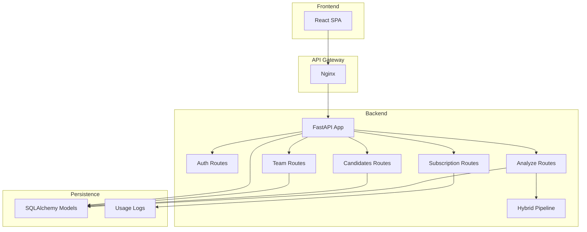
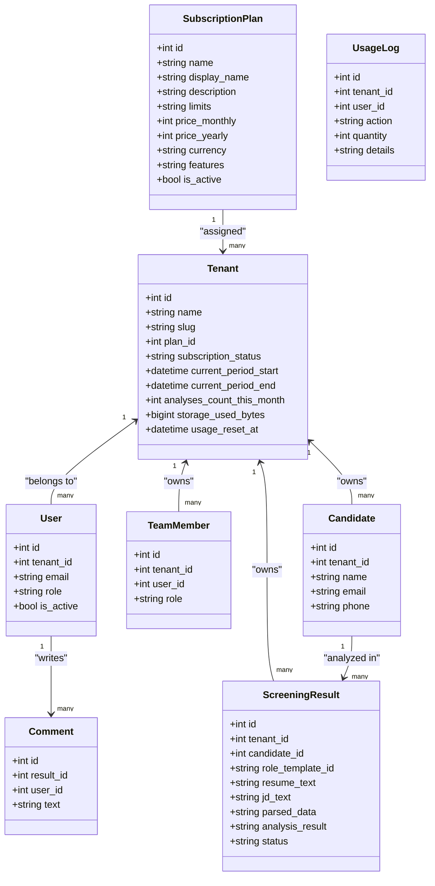
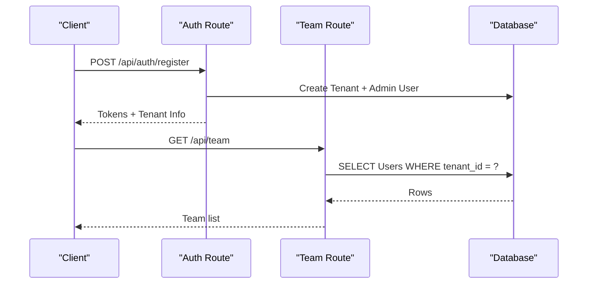
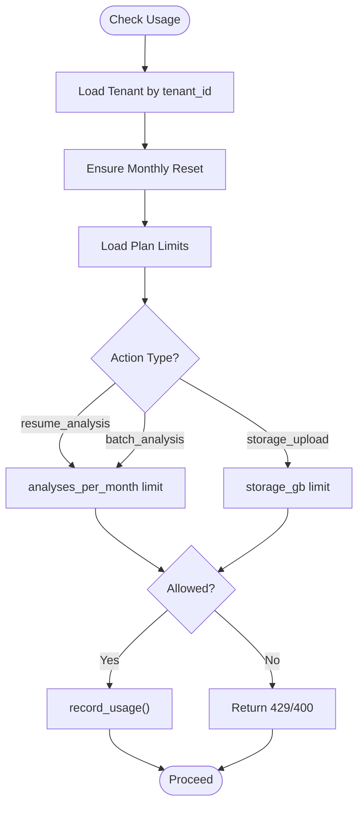
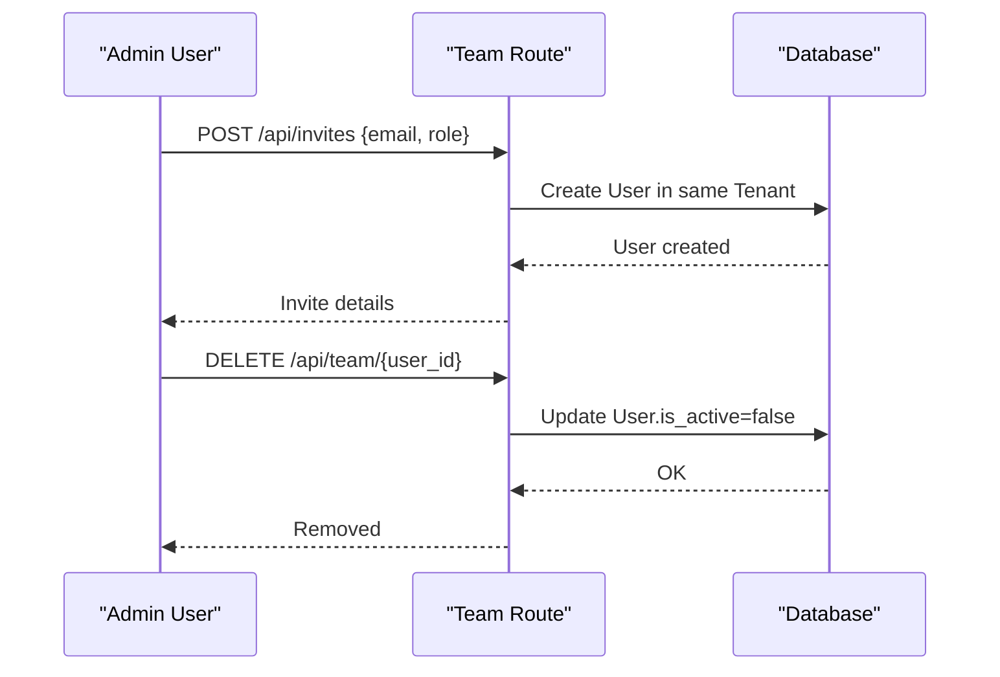
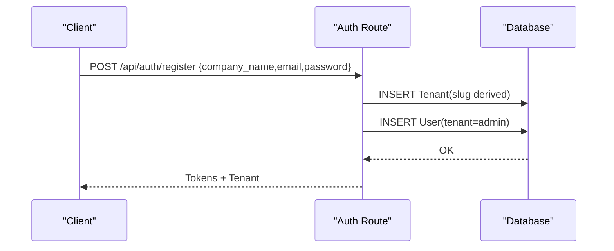
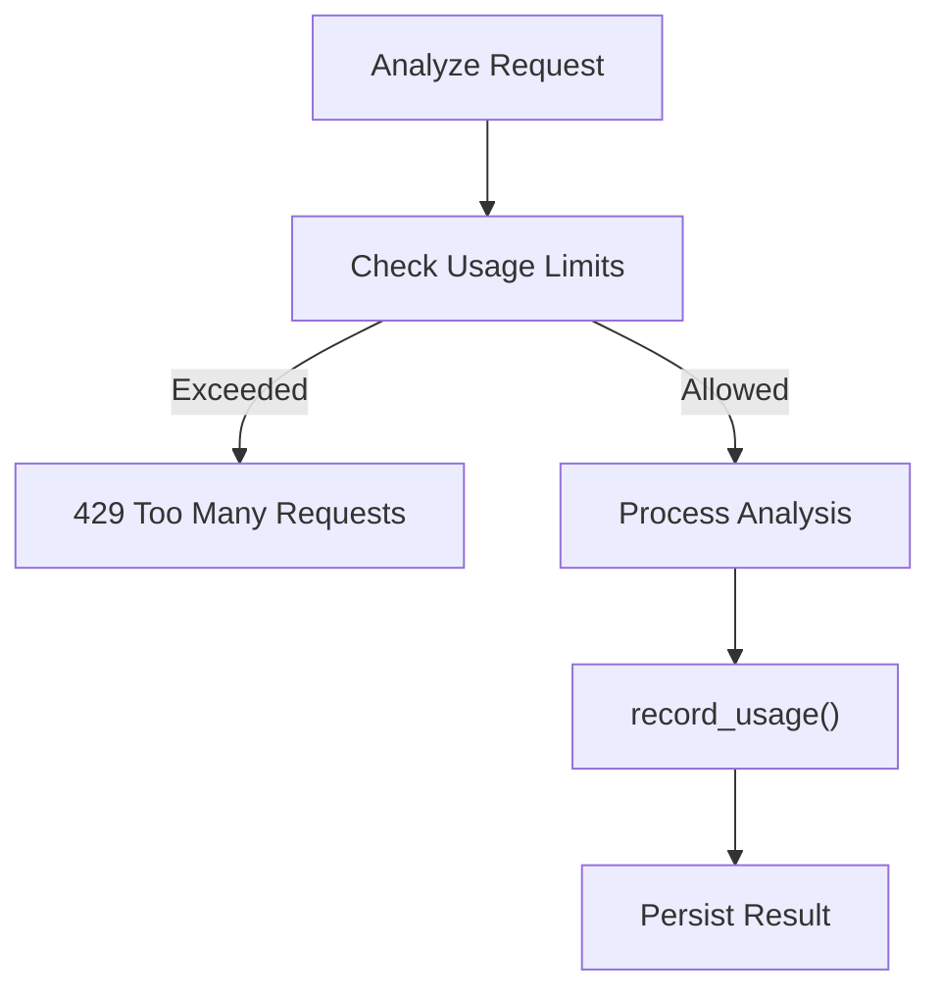
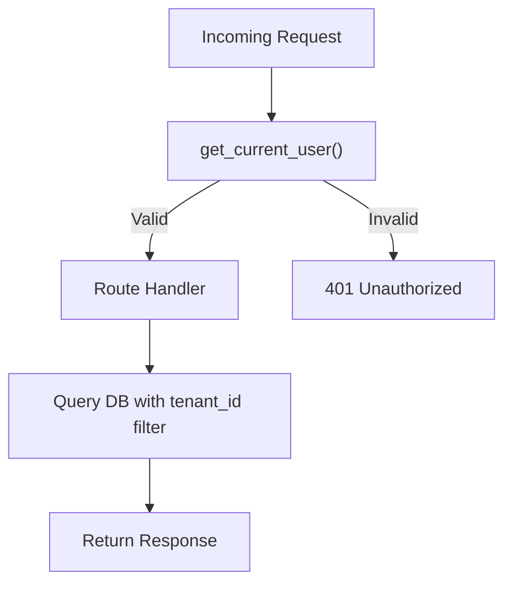
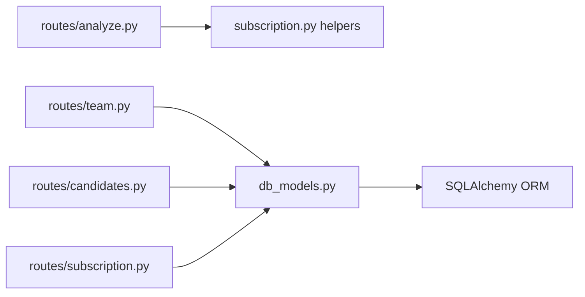

# Multi-Tenant System

<cite>
**Referenced Files in This Document**
- [README.md](file://README.md)
- [main.py](file://app/backend/main.py)
- [database.py](file://app/backend/db/database.py)
- [db_models.py](file://app/backend/models/db_models.py)
- [schemas.py](file://app/backend/models/schemas.py)
- [auth.py](file://app/backend/routes/auth.py)
- [subscription.py](file://app/backend/routes/subscription.py)
- [team.py](file://app/backend/routes/team.py)
- [candidates.py](file://app/backend/routes/candidates.py)
- [analyze.py](file://app/backend/routes/analyze.py)
- [hybrid_pipeline.py](file://app/backend/services/hybrid_pipeline.py)
- [003_subscription_system.py](file://alembic/versions/003_subscription_system.py)
- [test_usage_enforcement.py](file://app/backend/tests/test_usage_enforcement.py)
</cite>

## Table of Contents
1. [Introduction](#introduction)
2. [Project Structure](#project-structure)
3. [Core Components](#core-components)
4. [Architecture Overview](#architecture-overview)
5. [Detailed Component Analysis](#detailed-component-analysis)
6. [Dependency Analysis](#dependency-analysis)
7. [Performance Considerations](#performance-considerations)
8. [Troubleshooting Guide](#troubleshooting-guide)
9. [Conclusion](#conclusion)
10. [Appendices](#appendices)

## Introduction
This document explains the multi-tenant architecture of Resume AI by ThetaLogics. It covers tenant isolation, data separation, shared resources, subscription and usage management, team collaboration, and tenant lifecycle. It also documents usage enforcement, quota management, and tenant-aware query patterns, along with practical extension points and scalability considerations.

## Project Structure
The system is a FastAPI application with:
- A SQLAlchemy ORM layer defining tenant-scoped models
- Route handlers enforcing tenant isolation via current user’s tenant_id
- A subscription module managing plan tiers, quotas, and usage logs
- A team collaboration module for invites and comments
- Services implementing the hybrid analysis pipeline and skills registry

**Diagram sources**
- [main.py:200-214](file://app/backend/main.py#L200-L214)
- [auth.py:20](file://app/backend/routes/auth.py#L20)
- [subscription.py:20](file://app/backend/routes/subscription.py#L20)
- [team.py:15](file://app/backend/routes/team.py#L15)
- [candidates.py:23](file://app/backend/routes/candidates.py#L23)
- [analyze.py:41](file://app/backend/routes/analyze.py#L41)
- [hybrid_pipeline.py:1](file://app/backend/services/hybrid_pipeline.py#L1)

**Section sources**
- [README.md:273-333](file://README.md#L273-L333)
- [main.py:174-214](file://app/backend/main.py#L174-L214)

## Core Components
- Tenant model with subscription and usage fields
- User model with role scoping to tenant
- UsageLog for detailed usage tracking
- SubscriptionPlan with plan metadata and limits
- Team collaboration via TeamMember and Comment
- Candidate and ScreeningResult with tenant scoping
- Shared caches (JD cache) and skills registry

Key tenant-aware patterns:
- Every route filters by current_user.tenant_id
- Usage enforcement checks plan limits and increments counters
- Admin-only routes enforce require_admin

**Section sources**
- [db_models.py:31-59](file://app/backend/models/db_models.py#L31-L59)
- [db_models.py:62-76](file://app/backend/models/db_models.py#L62-L76)
- [db_models.py:79-92](file://app/backend/models/db_models.py#L79-L92)
- [db_models.py:11-28](file://app/backend/models/db_models.py#L11-L28)
- [db_models.py:169-178](file://app/backend/models/db_models.py#L169-L178)
- [db_models.py:181-191](file://app/backend/models/db_models.py#L181-L191)
- [db_models.py:97-126](file://app/backend/models/db_models.py#L97-L126)
- [db_models.py:229-250](file://app/backend/models/db_models.py#L229-L250)

## Architecture Overview
The backend defines tenant-scoped models and enforces tenant isolation at the route level. Subscription and usage are managed centrally, while shared caches reduce repeated work across tenants.

**Diagram sources**
- [db_models.py:31-59](file://app/backend/models/db_models.py#L31-L59)
- [db_models.py:62-76](file://app/backend/models/db_models.py#L62-L76)
- [db_models.py:11-28](file://app/backend/models/db_models.py#L11-L28)
- [db_models.py:79-92](file://app/backend/models/db_models.py#L79-L92)
- [db_models.py:169-178](file://app/backend/models/db_models.py#L169-L178)
- [db_models.py:181-191](file://app/backend/models/db_models.py#L181-L191)
- [db_models.py:97-126](file://app/backend/models/db_models.py#L97-L126)

## Detailed Component Analysis

### Tenant Isolation and Data Separation
- All routes filter by current_user.tenant_id to ensure tenant isolation.
- Examples:
  - Team listing, invites, and comments scoped to tenant
  - Candidate listing and retrieval scoped to tenant
  - Analysis history scoped to tenant
- Usage enforcement checks tenant’s plan limits and increments counters before processing.

**Diagram sources**
- [auth.py:57-96](file://app/backend/routes/auth.py#L57-L96)
- [team.py:18-31](file://app/backend/routes/team.py#L18-L31)

**Section sources**
- [team.py:18-31](file://app/backend/routes/team.py#L18-L31)
- [candidates.py:26-80](file://app/backend/routes/candidates.py#L26-L80)
- [analyze.py:763-786](file://app/backend/routes/analyze.py#L763-L786)

### Subscription Management and Usage Tracking
- SubscriptionPlan stores pricing, currency, features, and limits (JSON).
- Tenant holds subscription_status, billing periods, monthly usage counters, and storage usage.
- UsageLog records every action with quantity and details.
- Helper functions:
  - _ensure_monthly_reset: resets usage counters at month boundary
  - _get_plan_limits/_get_plan_features: parse JSON fields
  - record_usage: increments counters and logs usage
- Endpoints:
  - GET /api/subscription/plans: available plans
  - GET /api/subscription: current plan, usage stats, available plans, days until reset
  - GET /api/subscription/check/{action}: usage check before action
  - GET /api/subscription/usage-history: tenant usage logs
  - POST /api/subscription/admin/reset-usage: admin reset
  - POST /api/subscription/admin/change-plan/{plan_id}: admin change plan

**Diagram sources**
- [subscription.py:256-343](file://app/backend/routes/subscription.py#L256-L343)
- [subscription.py:427-476](file://app/backend/routes/subscription.py#L427-L476)
- [analyze.py:323-351](file://app/backend/routes/analyze.py#L323-L351)

**Section sources**
- [subscription.py:162-253](file://app/backend/routes/subscription.py#L162-L253)
- [subscription.py:256-343](file://app/backend/routes/subscription.py#L256-L343)
- [subscription.py:346-367](file://app/backend/routes/subscription.py#L346-L367)
- [subscription.py:372-422](file://app/backend/routes/subscription.py#L372-L422)
- [subscription.py:427-476](file://app/backend/routes/subscription.py#L427-L476)
- [003_subscription_system.py:135-224](file://alembic/versions/003_subscription_system.py#L135-L224)

### Team Collaboration and Access Delegation
- Roles: admin, recruiter, viewer
- Admin-only operations:
  - Invite members (POST /api/invites)
  - Remove members (DELETE /api/team/{user_id})
  - Admin-only subscription endpoints
- Collaborative features:
  - Comments on screening results
  - Team member listing filtered by tenant

**Diagram sources**
- [team.py:34-61](file://app/backend/routes/team.py#L34-L61)
- [team.py:64-82](file://app/backend/routes/team.py#L64-L82)
- [auth.py:57-96](file://app/backend/routes/auth.py#L57-L96)

**Section sources**
- [team.py:18-31](file://app/backend/routes/team.py#L18-L31)
- [team.py:34-61](file://app/backend/routes/team.py#L34-L61)
- [team.py:64-82](file://app/backend/routes/team.py#L64-L82)
- [team.py:85-134](file://app/backend/routes/team.py#L85-L134)

### Tenant Onboarding, Lifecycle, and Migration
- Onboarding:
  - Registration creates Tenant and admin User, sets slug, assigns plan
- Lifecycle:
  - Admin can change plan and reset usage
  - Tenant usage resets monthly
- Migration:
  - Alembic migration 003 adds subscription system, seeds plans, and links existing tenants to Pro plan

**Diagram sources**
- [auth.py:57-96](file://app/backend/routes/auth.py#L57-L96)
- [003_subscription_system.py:235-251](file://alembic/versions/003_subscription_system.py#L235-L251)

**Section sources**
- [auth.py:57-96](file://app/backend/routes/auth.py#L57-L96)
- [003_subscription_system.py:43-251](file://alembic/versions/003_subscription_system.py#L43-L251)

### Usage Enforcement and Quota Management
- Per-request checks:
  - analyze endpoint checks limits and increments usage before processing
  - batch endpoint respects plan batch_size and increments by file count
- Global helpers:
  - _ensure_monthly_reset ensures counters reset at month boundary
  - record_usage increments counters and writes UsageLog
- Tests validate:
  - Usage increments on success
  - Denial at limit
  - Unlimited behavior for negative limits
  - Persistence across requests

**Diagram sources**
- [analyze.py:323-351](file://app/backend/routes/analyze.py#L323-L351)
- [subscription.py:427-476](file://app/backend/routes/subscription.py#L427-L476)

**Section sources**
- [analyze.py:323-351](file://app/backend/routes/analyze.py#L323-L351)
- [analyze.py:651-758](file://app/backend/routes/analyze.py#L651-L758)
- [subscription.py:72-84](file://app/backend/routes/subscription.py#L72-L84)
- [subscription.py:427-476](file://app/backend/routes/subscription.py#L427-L476)
- [test_usage_enforcement.py:56-191](file://app/backend/tests/test_usage_enforcement.py#L56-L191)

### Tenant-Aware Query Patterns and Security Boundaries
- Every route that reads/writes tenant data filters by tenant_id from the current user.
- Security boundaries:
  - get_current_user validates JWT and ensures user.is_active
  - require_admin guards admin-only endpoints
  - Results are filtered by tenant_id in queries

**Diagram sources**
- [auth.py:19-46](file://app/backend/routes/auth.py#L19-L46)
- [team.py:18-31](file://app/backend/routes/team.py#L18-L31)
- [candidates.py:26-80](file://app/backend/routes/candidates.py#L26-L80)

**Section sources**
- [auth.py:19-46](file://app/backend/routes/auth.py#L19-L46)
- [team.py:18-31](file://app/backend/routes/team.py#L18-L31)
- [candidates.py:26-80](file://app/backend/routes/candidates.py#L26-L80)

### Shared Resources and Scalability
- Shared JD cache:
  - JdCache stores parsed JD results keyed by hash to avoid repeated parsing
- Skills registry:
  - SkillsRegistry loads active skills and supports hot reload
- Concurrency:
  - Hybrid pipeline uses a semaphore to limit concurrent LLM calls per worker
- Scalability considerations:
  - SQLite is used for simplicity; consider PostgreSQL for multi-tenant scale
  - Use database indexes on tenant_id and frequently queried fields
  - Offload heavy analytics to background tasks

**Section sources**
- [db_models.py:229-250](file://app/backend/models/db_models.py#L229-L250)
- [hybrid_pipeline.py:24-32](file://app/backend/services/hybrid_pipeline.py#L24-L32)
- [003_subscription_system.py:93-117](file://alembic/versions/003_subscription_system.py#L93-L117)

## Dependency Analysis
- Route dependencies:
  - analyze.py depends on subscription helpers for usage checks and recording
  - team.py, candidates.py depend on tenant_id from current user
  - subscription.py depends on Tenant, SubscriptionPlan, UsageLog
- Database dependencies:
  - Foreign keys enforce tenant ownership
  - Indexes on tenant_id improve query performance

**Diagram sources**
- [analyze.py:39-39](file://app/backend/routes/analyze.py#L39-L39)
- [subscription.py:15-18](file://app/backend/routes/subscription.py#L15-L18)
- [db_models.py:31-59](file://app/backend/models/db_models.py#L31-L59)

**Section sources**
- [analyze.py:39-39](file://app/backend/routes/analyze.py#L39-L39)
- [subscription.py:15-18](file://app/backend/routes/subscription.py#L15-L18)
- [db_models.py:31-59](file://app/backend/models/db_models.py#L31-L59)

## Performance Considerations
- Database:
  - Use PostgreSQL for concurrent writes and better multi-tenant scaling
  - Add indexes on tenant_id, created_at, and composite indexes for frequent filters
- Caching:
  - Leverage JdCache and SkillsRegistry to minimize repeated work
- Concurrency:
  - Limit concurrent LLM calls with semaphore
- Streaming:
  - Use SSE streaming for long-running analyses to improve responsiveness

## Troubleshooting Guide
- Health checks:
  - GET /health validates DB and Ollama connectivity
  - GET /api/llm-status provides diagnostics for model readiness
- Common issues:
  - Database locked (SQLite): restart backend container
  - Ollama not reachable: pull model and warm it in RAM
  - SSL certificate renewal: use certbot and restart nginx

**Section sources**
- [main.py:228-259](file://app/backend/main.py#L228-L259)
- [main.py:262-326](file://app/backend/main.py#L262-L326)
- [README.md:337-355](file://README.md#L337-L355)

## Conclusion
The Resume AI multi-tenant system enforces strict tenant isolation via tenant_id-scoped queries, centralizes subscription and usage management, and provides team collaboration features with role-based access. Usage enforcement protects resources, while shared caches and skills registries optimize performance. The architecture is straightforward to extend for additional plans, features, or access controls.

## Appendices

### Implementation Examples for Extending Tenant Functionality
- Adding a new plan tier:
  - Extend SubscriptionPlan fields and limits
  - Update Alembic migration to seed new plan
  - Reference: [003_subscription_system.py:135-224](file://alembic/versions/003_subscription_system.py#L135-L224)
- Customizing access controls:
  - Use require_admin for admin-only routes
  - Add role checks in route handlers
  - Reference: [auth.py:43-46](file://app/backend/routes/auth.py#L43-L46)
- Extending usage tracking:
  - Add new actions to UsageLog and update record_usage
  - Reference: [subscription.py:427-476](file://app/backend/routes/subscription.py#L427-L476)
- Tenant-aware caching:
  - Use tenant_id in cache keys or separate caches per tenant
  - Reference: [hybrid_pipeline.py:49-66](file://app/backend/services/hybrid_pipeline.py#L49-L66)