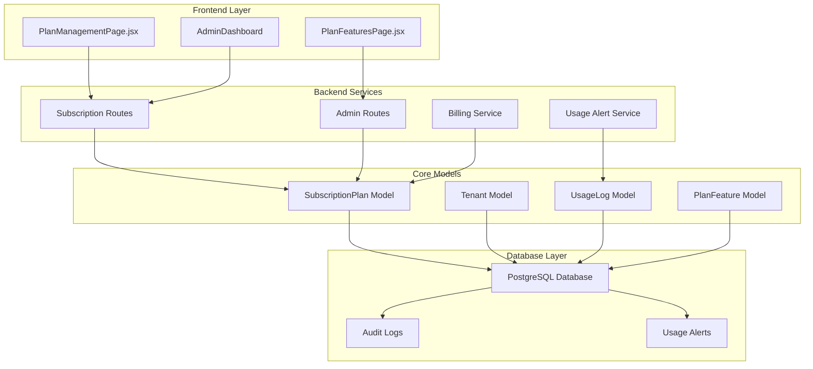
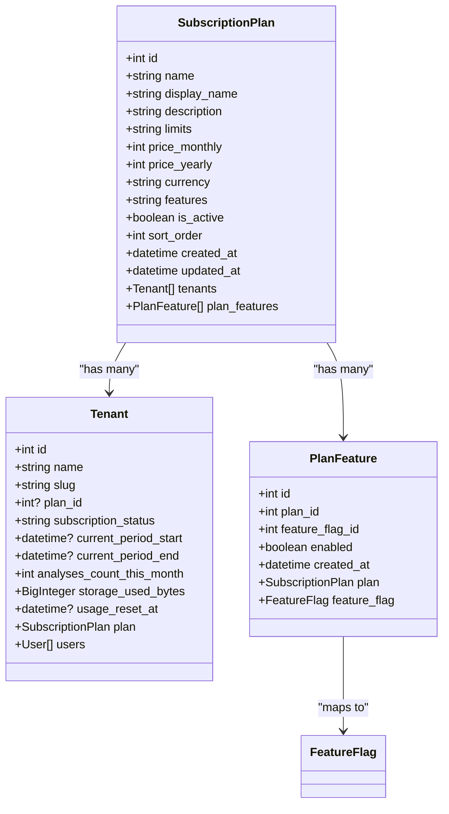
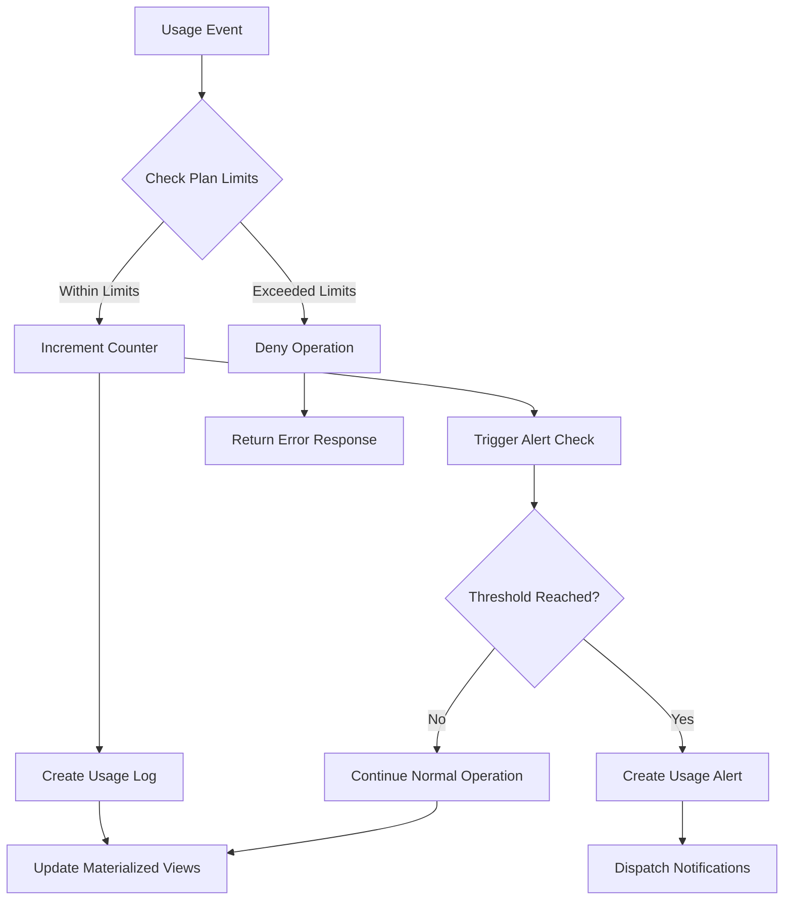
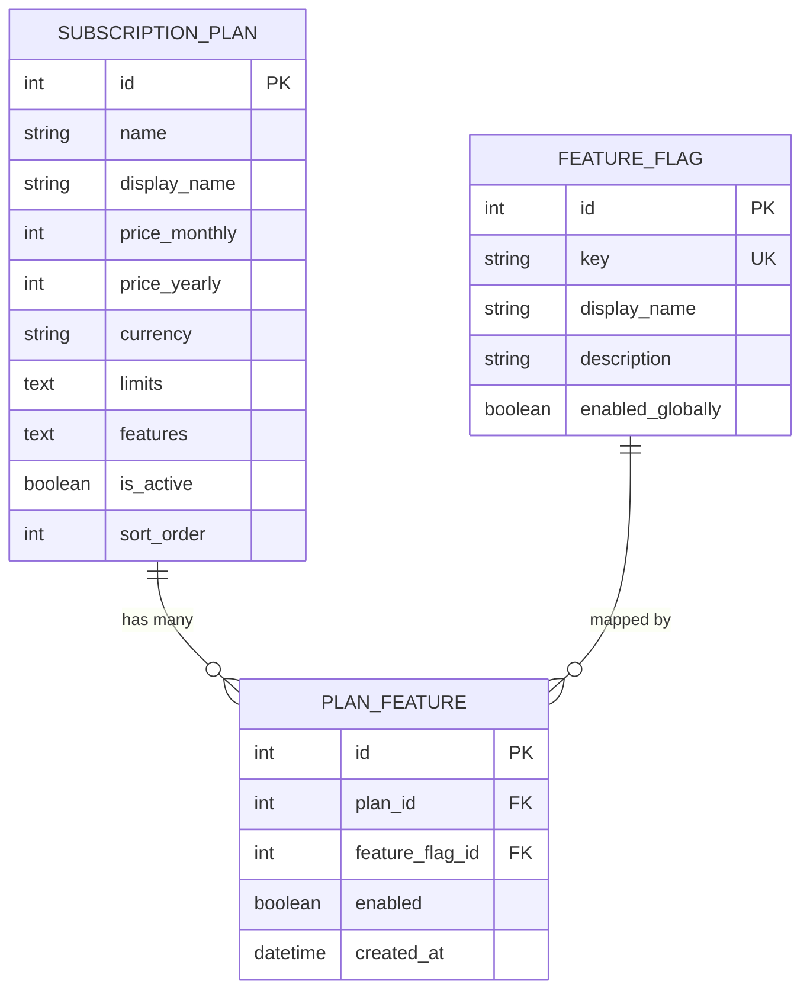
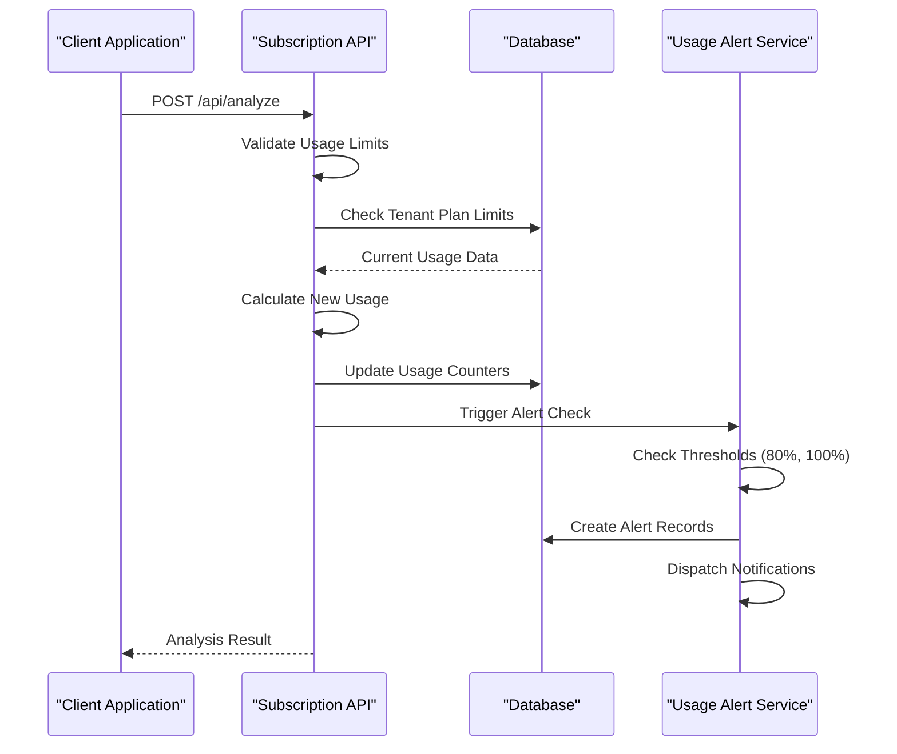
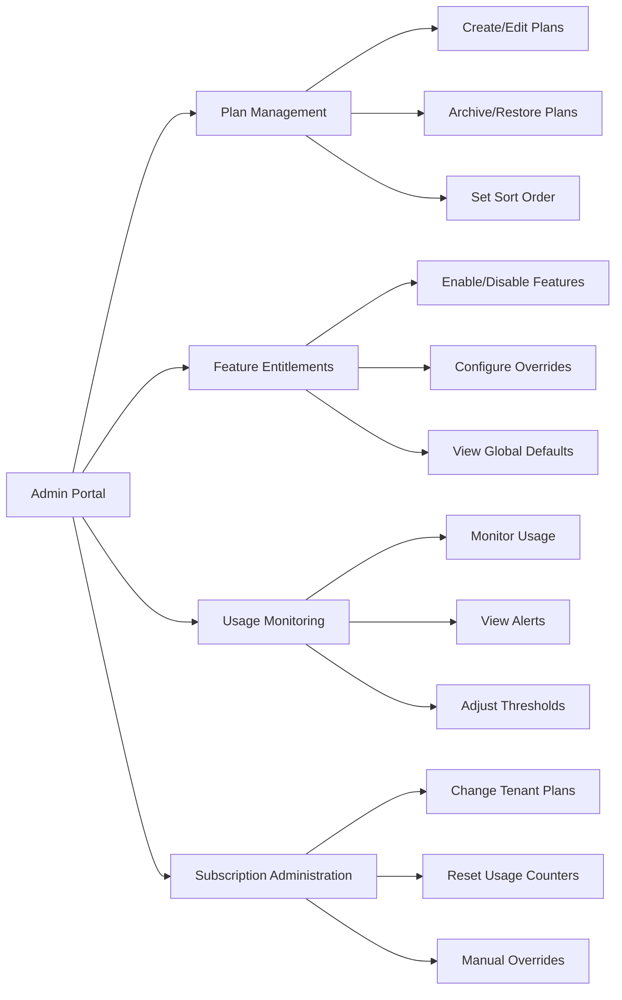
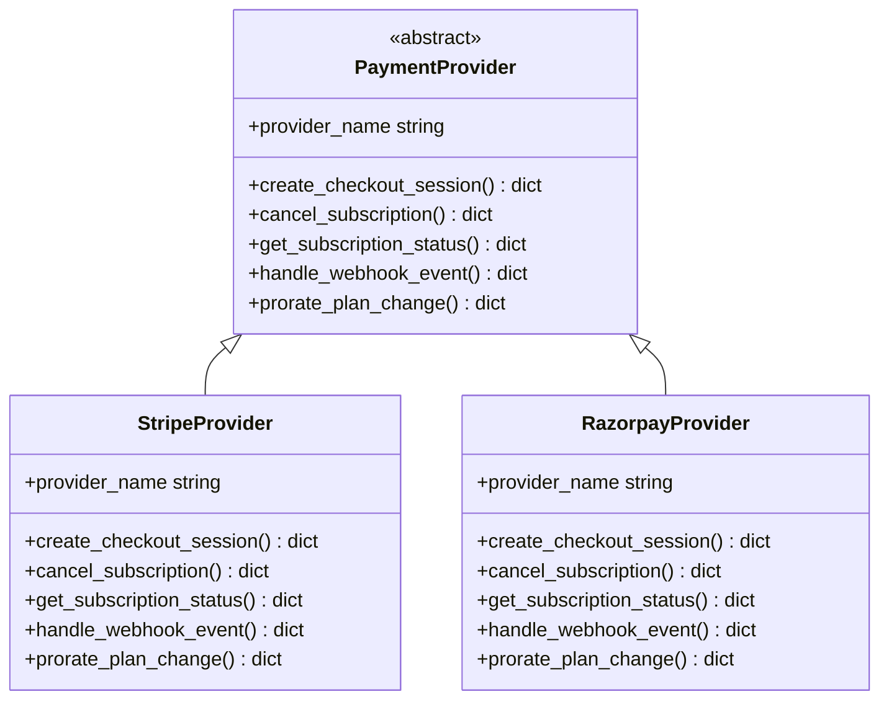

# Plan Management System

<cite>
**Referenced Files in This Document**
- [subscription.py](file://app/backend/routes/subscription.py)
- [admin.py](file://app/backend/routes/admin.py)
- [db_models.py](file://app/backend/models/db_models.py)
- [schemas.py](file://app/backend/models/schemas.py)
- [PlanManagementPage.jsx](file://app/frontend/src/pages/admin/PlanManagementPage.jsx)
- [PlanFeaturesPage.jsx](file://app/frontend/src/pages/admin/PlanFeaturesPage.jsx)
- [test_plan_crud.py](file://app/backend/tests/test_plan_crud.py)
- [test_subscription.py](file://app/backend/tests/test_subscription.py)
- [usage_alert_service.py](file://app/backend/services/usage_alert_service.py)
- [base.py](file://app/backend/services/billing/base.py)
</cite>

## Table of Contents
1. [Introduction](#introduction)
2. [System Architecture](#system-architecture)
3. [Core Components](#core-components)
4. [Plan Management Features](#plan-management-features)
5. [Usage Management](#usage-management)
6. [Feature Entitlement System](#feature-entitlement-system)
7. [Admin Operations](#admin-operations)
8. [Frontend Implementation](#frontend-implementation)
9. [Testing Framework](#testing-framework)
10. [Integration Points](#integration-points)
11. [Performance Considerations](#performance-considerations)
12. [Troubleshooting Guide](#troubleshooting-guide)
13. [Conclusion](#conclusion)

## Introduction

The Plan Management System is a comprehensive subscription and billing management solution built for the Resume AI platform. This system enables organizations to define, manage, and enforce subscription plans with granular feature entitlements, usage tracking, and administrative controls. The system supports multiple pricing tiers, usage limits, feature flags, and integrates with various payment providers through a flexible abstraction layer.

The platform serves as a foundation for enterprise-grade recruitment technology, providing scalable subscription management for resume analysis, candidate screening, and interview automation services. The system emphasizes extensibility, auditability, and operational control through comprehensive admin interfaces and automated usage monitoring.

## System Architecture

The Plan Management System follows a layered architecture pattern with clear separation of concerns across backend services, frontend interfaces, and database models.

**Diagram sources**
- [subscription.py:1-640](file://app/backend/routes/subscription.py#L1-L640)
- [admin.py:3100-3300](file://app/backend/routes/admin.py#L3100-L3300)
- [db_models.py:12-75](file://app/backend/models/db_models.py#L12-L75)

The architecture ensures loose coupling between components while maintaining clear data flow patterns. The system utilizes FastAPI for backend routing, SQLAlchemy for ORM operations, and React for frontend interfaces.

## Core Components

### Subscription Plan Model

The SubscriptionPlan model serves as the central entity for defining pricing tiers and feature entitlements. It encapsulates pricing information, usage limits, and display attributes.

**Diagram sources**
- [db_models.py:12-75](file://app/backend/models/db_models.py#L12-L75)

### Usage Management System

The usage management system tracks consumption against plan limits and provides real-time monitoring capabilities.

**Diagram sources**
- [subscription.py:495-561](file://app/backend/routes/subscription.py#L495-L561)

**Section sources**
- [db_models.py:12-75](file://app/backend/models/db_models.py#L12-L75)
- [subscription.py:104-183](file://app/backend/routes/subscription.py#L104-L183)

## Plan Management Features

### Pricing and Limits Configuration

The system supports flexible pricing models with monthly and yearly billing cycles, customizable currency support, and granular usage limits.

Key pricing features include:
- **Multi-tier Pricing**: Support for free, pro, and enterprise tiers
- **Flexible Currency**: Built-in currency normalization (USD, EUR, GBP, INR)
- **Usage Limits**: Configurable limits for analyses, storage, team members, and batch sizes
- **Sort Order**: Customizable display ordering for plan selection

### Feature Entitlement Management

Plan features are managed through a sophisticated mapping system that allows fine-grained control over feature availability per subscription tier.

**Diagram sources**
- [db_models.py:671-684](file://app/backend/models/db_models.py#L671-L684)

**Section sources**
- [subscription.py:38-147](file://app/backend/routes/subscription.py#L38-L147)
- [admin.py:3156-3300](file://app/backend/routes/admin.py#L3156-L3300)

## Usage Management

### Usage Tracking and Monitoring

The system implements comprehensive usage tracking with automatic monthly resets and configurable alert thresholds.

**Diagram sources**
- [subscription.py:495-561](file://app/backend/routes/subscription.py#L495-L561)
- [usage_alert_service.py:43-129](file://app/backend/services/usage_alert_service.py#L43-L129)

### Usage Alert System

The usage alert system provides automated notifications when tenants approach or exceed their plan limits, with configurable threshold percentages and duplicate prevention mechanisms.

**Section sources**
- [subscription.py:292-380](file://app/backend/routes/subscription.py#L292-L380)
- [usage_alert_service.py:21-272](file://app/backend/services/usage_alert_service.py#L21-L272)

## Feature Entitlement System

### Plan-Feature Mapping

The feature entitlement system allows administrators to precisely control which features are available to different subscription tiers through a flexible mapping mechanism.

Key capabilities include:
- **Global Feature Flags**: Base feature availability controlled at platform level
- **Plan Overrides**: Per-plan customization of feature availability
- **Hierarchical Resolution**: Plan-specific overrides take precedence over global defaults
- **Real-time Enforcement**: Feature availability checked dynamically based on current plan

### Feature Flag Integration

The system integrates with the broader feature flag infrastructure, enabling progressive feature rollouts and A/B testing capabilities.

**Section sources**
- [db_models.py:450-478](file://app/backend/models/db_models.py#L450-L478)
- [admin.py:2684-2706](file://app/backend/routes/admin.py#L2684-L2706)

## Admin Operations

### Administrative Interfaces

The system provides comprehensive administrative capabilities through dedicated interfaces for plan management, feature entitlements, and usage monitoring.

**Diagram sources**
- [PlanManagementPage.jsx:127-305](file://app/frontend/src/pages/admin/PlanManagementPage.jsx#L127-L305)
- [PlanFeaturesPage.jsx:91-163](file://app/frontend/src/pages/admin/PlanFeaturesPage.jsx#L91-L163)

**Section sources**
- [admin.py:3140-3300](file://app/backend/routes/admin.py#L3140-L3300)
- [PlanManagementPage.jsx:1-925](file://app/frontend/src/pages/admin/PlanManagementPage.jsx#L1-L925)

## Frontend Implementation

### React-Based Admin Interfaces

The frontend implementation leverages modern React patterns with TypeScript for robust type safety and developer experience.

#### Plan Management Interface

The Plan Management interface provides a comprehensive dashboard for subscription plan administration with filtering, sorting, and bulk operations capabilities.

Key frontend features include:
- **Responsive Design**: Adaptive layouts for desktop and mobile devices
- **Real-time Updates**: WebSocket-powered live plan synchronization
- **Form Validation**: Comprehensive client-side validation with user-friendly error messages
- **Bulk Operations**: Mass actions for plan archiving and restoration
- **Visual Indicators**: Color-coded status displays and usage progress bars

#### Feature Entitlement Interface

The feature entitlement management interface offers intuitive toggle controls for managing feature availability across different subscription tiers.

**Section sources**
- [PlanManagementPage.jsx:1-925](file://app/frontend/src/pages/admin/PlanManagementPage.jsx#L1-L925)
- [PlanFeaturesPage.jsx:1-163](file://app/frontend/src/pages/admin/PlanFeaturesPage.jsx#L1-L163)

## Testing Framework

### Comprehensive Test Coverage

The system includes extensive test coverage ensuring reliability and maintainability across all major components.

#### Plan CRUD Operations Testing

The test suite validates all plan management operations including creation, updates, archiving, and retrieval with proper authorization enforcement.

Testing scenarios include:
- **Authorization Validation**: Ensuring only authorized users can modify plans
- **Data Integrity**: Validating unique constraints and data validation rules
- **Audit Logging**: Verifying comprehensive audit trail creation
- **Edge Cases**: Testing boundary conditions and error scenarios

#### Usage Management Testing

Usage tracking and alert systems are rigorously tested to ensure accurate consumption monitoring and timely notifications.

**Section sources**
- [test_plan_crud.py:1-464](file://app/backend/tests/test_plan_crud.py#L1-L464)
- [test_subscription.py:104-187](file://app/backend/tests/test_subscription.py#L104-L187)

## Integration Points

### Payment Provider Abstraction

The system provides a flexible abstraction layer for integrating with various payment providers while maintaining consistent subscription management functionality.

**Diagram sources**
- [base.py:6-89](file://app/backend/services/billing/base.py#L6-L89)

### Webhook and Notification Integration

The system supports comprehensive webhook and notification capabilities for external integrations and automated alerts.

**Section sources**
- [base.py:1-89](file://app/backend/services/billing/base.py#L1-L89)
- [usage_alert_service.py:160-257](file://app/backend/services/usage_alert_service.py#L160-L257)

## Performance Considerations

### Scalability Optimizations

The system incorporates several performance optimizations to handle high-volume usage scenarios:

- **Database Indexing**: Strategic indexing on frequently queried fields including plan names, tenant associations, and usage timestamps
- **Materialized Views**: Pre-calculated usage metrics to reduce query complexity
- **Connection Pooling**: Efficient database connection management for concurrent operations
- **Caching Strategies**: Intelligent caching for plan configurations and feature entitlements
- **Asynchronous Processing**: Background tasks for heavy operations like usage recalculations

### Usage Pattern Optimization

The system optimizes for common usage patterns including:
- **Batch Operations**: Efficient handling of multiple concurrent analysis requests
- **Memory Management**: Optimized memory usage for large datasets and batch processing
- **Network Efficiency**: Minimized API calls through intelligent data fetching strategies

## Troubleshooting Guide

### Common Issues and Solutions

#### Plan Creation Failures

**Issue**: Plan creation returns validation errors
**Solution**: Verify required fields (name, display_name, prices) meet validation criteria and check for duplicate names

#### Usage Limit Exceeded

**Issue**: Analysis requests being denied despite available plan limits
**Solution**: Check monthly reset functionality and verify usage counters are properly incremented

#### Feature Entitlement Conflicts

**Issue**: Features not appearing according to plan configuration
**Solution**: Verify plan-feature mappings and check for conflicting global defaults

#### Audit Trail Issues

**Issue**: Missing or incomplete audit logs
**Solution**: Ensure proper audit logging middleware is enabled and database connections are stable

**Section sources**
- [test_plan_crud.py:202-238](file://app/backend/tests/test_plan_crud.py#L202-L238)
- [subscription.py:3140-3153](file://app/backend/routes/subscription.py#L3140-L3153)

## Conclusion

The Plan Management System represents a comprehensive solution for subscription and billing management in enterprise recruitment platforms. Its modular architecture, extensive feature set, and robust administrative capabilities make it suitable for organizations requiring sophisticated subscription management with fine-grained control over pricing tiers, usage limits, and feature entitlements.

The system's emphasis on extensibility, auditability, and operational control positions it well for future enhancements and integration with evolving business requirements. The comprehensive testing framework and performance optimizations ensure reliability and scalability in production environments.

Through its combination of powerful backend services, intuitive frontend interfaces, and flexible integration capabilities, the Plan Management System provides a solid foundation for enterprise-grade subscription management solutions.