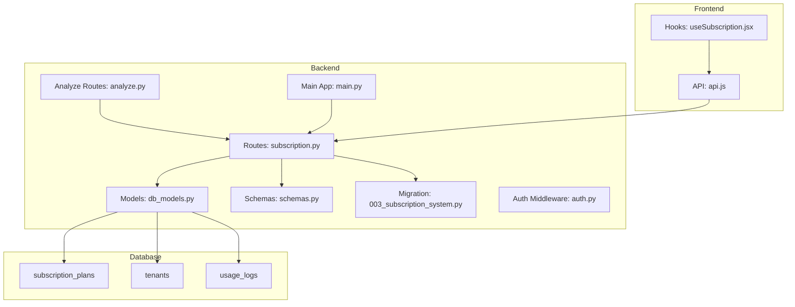
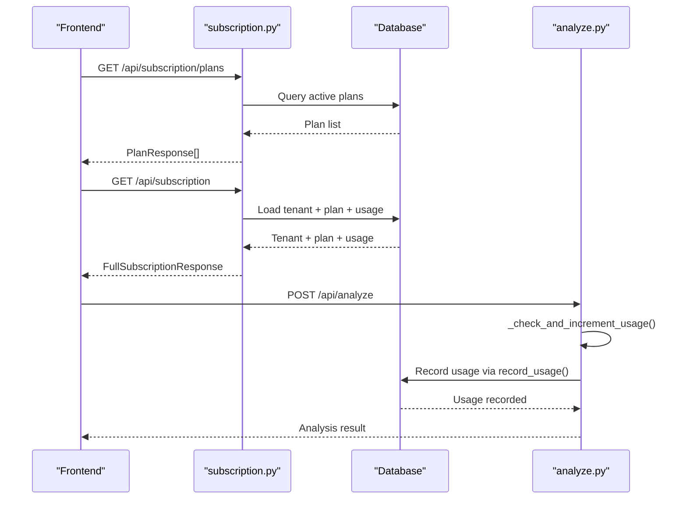
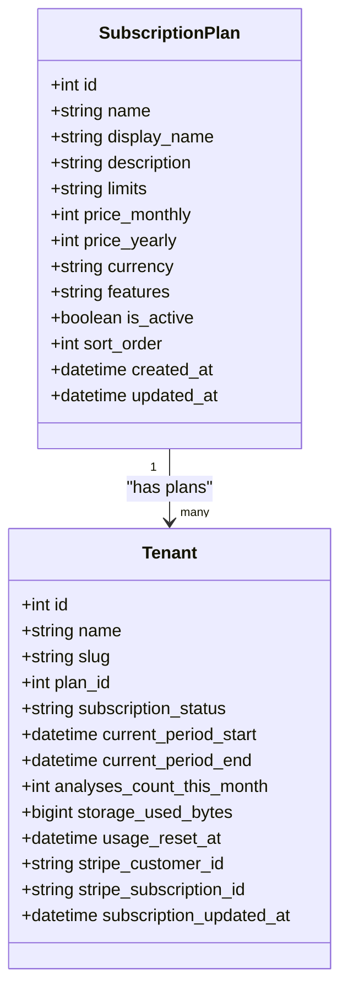
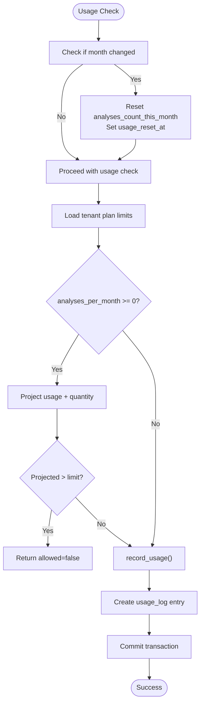
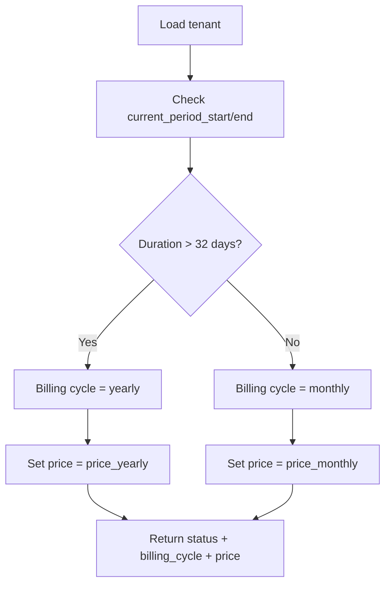
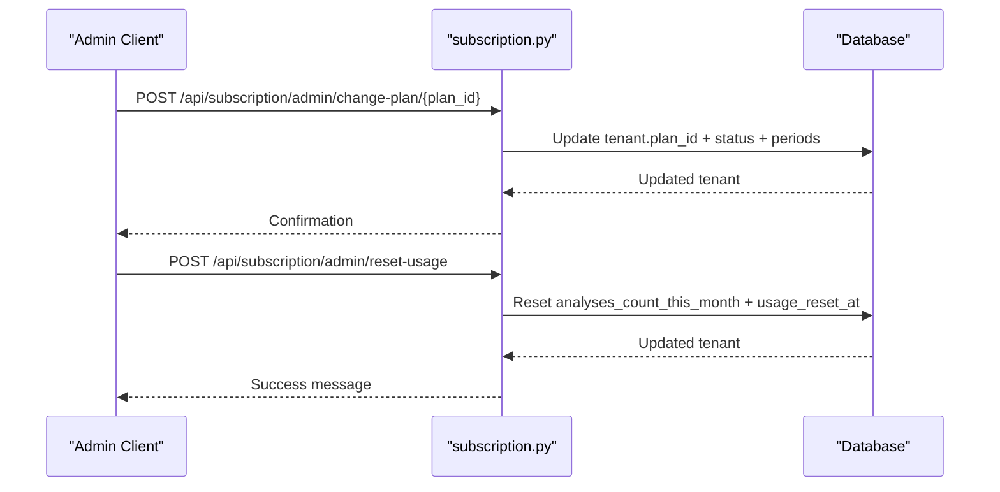
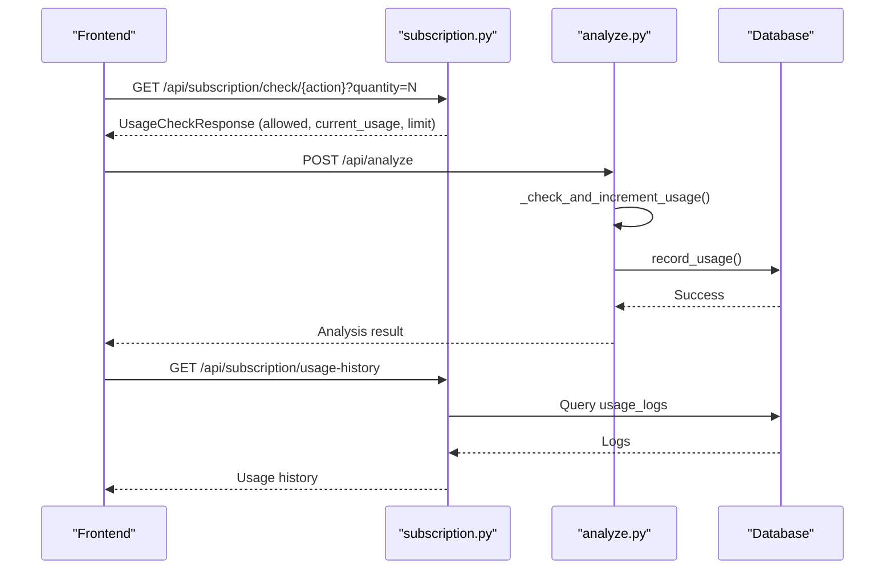
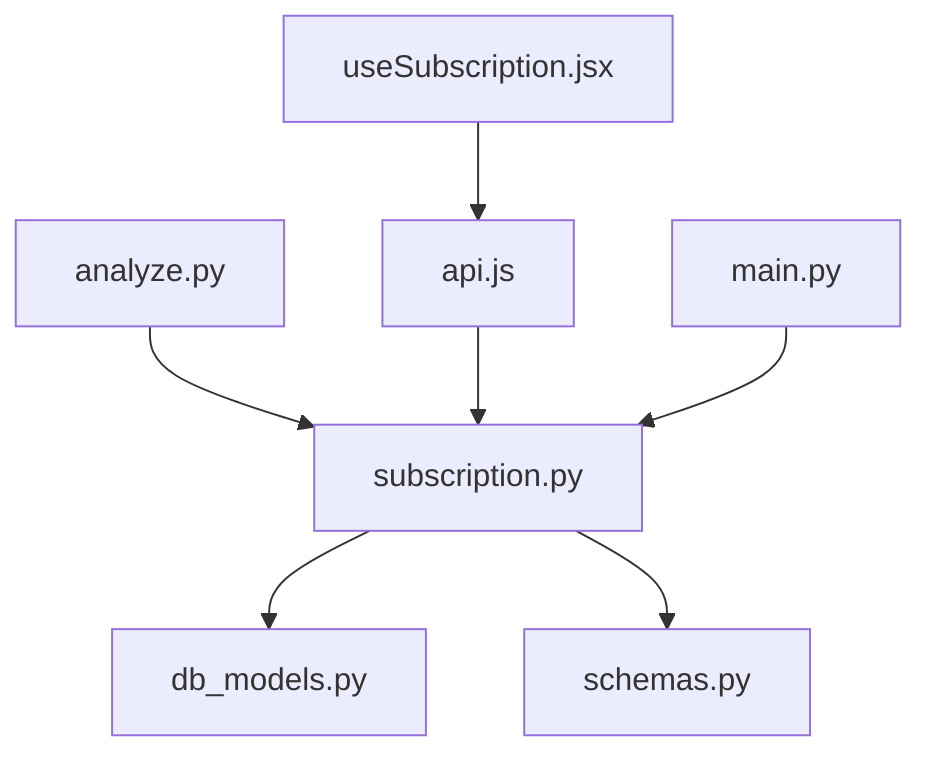

# Subscription Management System

<cite>
**Referenced Files in This Document**
- [subscription.py](file://app/backend/routes/subscription.py)
- [db_models.py](file://app/backend/models/db_models.py)
- [schemas.py](file://app/backend/models/schemas.py)
- [003_subscription_system.py](file://alembic/versions/003_subscription_system.py)
- [analyze.py](file://app/backend/routes/analyze.py)
- [auth.py](file://app/backend/middleware/auth.py)
- [main.py](file://app/backend/main.py)
- [useSubscription.jsx](file://app/frontend/src/hooks/useSubscription.jsx)
- [api.js](file://app/frontend/src/lib/api.js)
- [test_subscription.py](file://app/backend/tests/test_subscription.py)
- [test_usage_enforcement.py](file://app/backend/tests/test_usage_enforcement.py)
</cite>

## Table of Contents
1. [Introduction](#introduction)
2. [Project Structure](#project-structure)
3. [Core Components](#core-components)
4. [Architecture Overview](#architecture-overview)
5. [Detailed Component Analysis](#detailed-component-analysis)
6. [Dependency Analysis](#dependency-analysis)
7. [Performance Considerations](#performance-considerations)
8. [Troubleshooting Guide](#troubleshooting-guide)
9. [Conclusion](#conclusion)

## Introduction
This document provides comprehensive documentation for the subscription management system, covering subscription plan definitions, pricing tiers, feature limitations, usage tracking mechanisms, tenant subscription status management, Stripe integration readiness, upgrade/downgrade workflows, proration considerations, usage-based billing scenarios, validation and enforcement, and analytics/reporting capabilities.

## Project Structure
The subscription system spans backend routes, database models, migrations, frontend hooks, and tests:

- Backend routes define public and admin endpoints for subscription management, usage checks, and analytics.
- Database models define subscription plans, tenant subscriptions, usage logs, and Stripe integration placeholders.
- Migrations seed initial plans and establish usage tracking infrastructure.
- Frontend hooks integrate subscription data and enforce usage limits client-side.
- Tests validate plan definitions, usage enforcement, and administrative controls.

**Diagram sources**
- [subscription.py:1-477](file://app/backend/routes/subscription.py#L1-L477)
- [db_models.py:1-250](file://app/backend/models/db_models.py#L1-L250)
- [003_subscription_system.py:1-290](file://alembic/versions/003_subscription_system.py#L1-L290)
- [analyze.py:1-813](file://app/backend/routes/analyze.py#L1-L813)
- [auth.py:1-47](file://app/backend/middleware/auth.py#L1-L47)
- [main.py:1-327](file://app/backend/main.py#L1-L327)
- [useSubscription.jsx:1-186](file://app/frontend/src/hooks/useSubscription.jsx#L1-L186)
- [api.js:360-395](file://app/frontend/src/lib/api.js#L360-L395)

**Section sources**
- [subscription.py:1-477](file://app/backend/routes/subscription.py#L1-L477)
- [db_models.py:1-250](file://app/backend/models/db_models.py#L1-L250)
- [003_subscription_system.py:1-290](file://alembic/versions/003_subscription_system.py#L1-L290)
- [main.py:200-215](file://app/backend/main.py#L200-L215)

## Core Components
- Subscription Plan Definitions: Plans include Free, Pro, and Enterprise tiers with JSON-encoded limits, features, pricing, and ordering.
- Tenant Subscription Tracking: Tracks status, billing cycles, monthly usage, storage consumption, and Stripe identifiers.
- Usage Tracking: Monthly counters, storage calculation, usage logs, and automatic monthly resets.
- Usage Enforcement: Pre-validation checks and post-processing recording to prevent overages.
- Analytics and Reporting: Usage history logs and dashboard metrics.

**Section sources**
- [db_models.py:11-60](file://app/backend/models/db_models.py#L11-L60)
- [003_subscription_system.py:135-225](file://alembic/versions/003_subscription_system.py#L135-L225)
- [subscription.py:72-145](file://app/backend/routes/subscription.py#L72-L145)
- [subscription.py:427-477](file://app/backend/routes/subscription.py#L427-L477)

## Architecture Overview
The subscription system integrates with analysis routes to enforce usage limits and track consumption. It exposes public endpoints for plan information and usage dashboards, and admin endpoints for testing and plan management.

**Diagram sources**
- [subscription.py:162-253](file://app/backend/routes/subscription.py#L162-L253)
- [subscription.py:427-477](file://app/backend/routes/subscription.py#L427-L477)
- [analyze.py:323-351](file://app/backend/routes/analyze.py#L323-L351)

## Detailed Component Analysis

### Subscription Plan Definitions and Pricing
- Plan fields include name, display name, description, limits (JSON), prices (monthly/yearly in cents), currency, features (JSON array), activation flag, and sort order.
- Limits encode quotas such as analyses per month, batch size, team members, storage capacity, and feature flags.
- Pricing tiers:
  - Free: $0/month, 20 analyses/month, batch up to 5, 1 team member, 1 GB storage.
  - Pro: $49/month ($470/year), 500 analyses/month, batch up to 50, 5 team members, 10 GB storage.
  - Enterprise: $199/month ($1910/year), unlimited analyses, batch up to 100, 25 team members, 100 GB storage.

**Diagram sources**
- [db_models.py:11-60](file://app/backend/models/db_models.py#L11-L60)
- [003_subscription_system.py:135-225](file://alembic/versions/003_subscription_system.py#L135-L225)

**Section sources**
- [db_models.py:11-28](file://app/backend/models/db_models.py#L11-L28)
- [003_subscription_system.py:135-225](file://alembic/versions/003_subscription_system.py#L135-L225)

### Usage Tracking and Monthly Resets
- Monthly counters are maintained per tenant and reset automatically at the start of each new month.
- Storage usage is calculated from resume text lengths and parser snapshots.
- Usage logs capture each action with quantity and optional details.

**Diagram sources**
- [subscription.py:72-84](file://app/backend/routes/subscription.py#L72-L84)
- [subscription.py:427-477](file://app/backend/routes/subscription.py#L427-L477)
- [analyze.py:323-351](file://app/backend/routes/analyze.py#L323-L351)

**Section sources**
- [subscription.py:72-84](file://app/backend/routes/subscription.py#L72-L84)
- [subscription.py:117-129](file://app/backend/routes/subscription.py#L117-L129)
- [subscription.py:427-477](file://app/backend/routes/subscription.py#L427-L477)
- [analyze.py:323-351](file://app/backend/routes/analyze.py#L323-L351)

### Tenant Subscription Status and Billing Cycle Detection
- Subscription status supports active, trialing, cancelled, past_due.
- Billing cycle detection determines monthly vs yearly based on period duration.
- Stripe integration fields are reserved for future payment processing.

**Diagram sources**
- [subscription.py:147-157](file://app/backend/routes/subscription.py#L147-L157)
- [db_models.py:41-51](file://app/backend/models/db_models.py#L41-L51)

**Section sources**
- [subscription.py:147-157](file://app/backend/routes/subscription.py#L147-L157)
- [db_models.py:41-51](file://app/backend/models/db_models.py#L41-L51)

### Stripe Integration Capabilities and Future Plans
- Tenant model includes Stripe customer and subscription identifiers and timestamps for updates.
- These fields are reserved for future Stripe integration, enabling customer lifecycle management and billing events.

**Section sources**
- [db_models.py:48-51](file://app/backend/models/db_models.py#L48-L51)

### Upgrade/Downgrade Processes and Proration
- Administrative endpoints allow changing a tenant's plan and resetting usage for testing.
- The system does not implement proration logic; upgrades/downgrades affect limits immediately upon plan change.

**Diagram sources**
- [subscription.py:394-423](file://app/backend/routes/subscription.py#L394-L423)
- [subscription.py:372-392](file://app/backend/routes/subscription.py#L372-L392)

**Section sources**
- [subscription.py:394-423](file://app/backend/routes/subscription.py#L394-L423)
- [subscription.py:372-392](file://app/backend/routes/subscription.py#L372-L392)

### Usage-Based Billing Scenarios
- Current implementation focuses on quota enforcement rather than recurring billing.
- Stripe integration fields are present for future billing automation and event handling.

**Section sources**
- [db_models.py:48-51](file://app/backend/models/db_models.py#L48-L51)

### Subscription Validation, Quota Enforcement, and Billing Event Handling
- Pre-check endpoints validate upcoming actions against limits.
- Analysis routes enforce usage before processing and record successful actions.
- Usage logs provide audit trails for analytics and reporting.

**Diagram sources**
- [subscription.py:256-344](file://app/backend/routes/subscription.py#L256-L344)
- [subscription.py:346-368](file://app/backend/routes/subscription.py#L346-L368)
- [analyze.py:323-351](file://app/backend/routes/analyze.py#L323-L351)

**Section sources**
- [subscription.py:256-344](file://app/backend/routes/subscription.py#L256-L344)
- [subscription.py:346-368](file://app/backend/routes/subscription.py#L346-L368)
- [subscription.py:427-477](file://app/backend/routes/subscription.py#L427-L477)
- [analyze.py:323-351](file://app/backend/routes/analyze.py#L323-L351)

### Subscription Analytics and Reporting
- Usage history endpoint aggregates detailed logs with user context and timestamps.
- Dashboard endpoints surface plan, usage stats, available plans, and days until reset.

**Section sources**
- [subscription.py:346-368](file://app/backend/routes/subscription.py#L346-L368)
- [subscription.py:172-253](file://app/backend/routes/subscription.py#L172-L253)

## Dependency Analysis
The subscription system integrates tightly with analysis routes and frontend hooks:

- Analysis routes depend on subscription helpers for usage checks and recording.
- Frontend hooks consume subscription endpoints and enforce client-side checks.
- Database models define relationships among plans, tenants, and usage logs.

**Diagram sources**
- [analyze.py:39-39](file://app/backend/routes/analyze.py#L39-L39)
- [subscription.py:1-20](file://app/backend/routes/subscription.py#L1-L20)
- [db_models.py:1-6](file://app/backend/models/db_models.py#L1-L6)
- [schemas.py:342-379](file://app/backend/models/schemas.py#L342-L379)
- [useSubscription.jsx:1-4](file://app/frontend/src/hooks/useSubscription.jsx#L1-L4)
- [api.js:360-395](file://app/frontend/src/lib/api.js#L360-L395)
- [main.py:214-214](file://app/backend/main.py#L214-L214)

**Section sources**
- [analyze.py:39-39](file://app/backend/routes/analyze.py#L39-L39)
- [subscription.py:1-20](file://app/backend/routes/subscription.py#L1-L20)
- [db_models.py:1-6](file://app/backend/models/db_models.py#L1-L6)
- [schemas.py:342-379](file://app/backend/models/schemas.py#L342-L379)
- [useSubscription.jsx:1-4](file://app/frontend/src/hooks/useSubscription.jsx#L1-L4)
- [api.js:360-395](file://app/frontend/src/lib/api.js#L360-L395)
- [main.py:214-214](file://app/backend/main.py#L214-L214)

## Performance Considerations
- Monthly reset logic runs on demand to avoid unnecessary writes.
- Storage usage aggregation queries sum text lengths; consider indexing or caching for large datasets.
- Usage logs are indexed by tenant and created_at for efficient retrieval.
- Frontend caches subscription data to reduce API calls.

## Troubleshooting Guide
Common issues and resolutions:
- Authentication failures: Ensure JWT bearer token is attached to requests.
- Rate limiting: When usage exceeds limits, endpoints return 429 with contextual messages.
- Admin operations: Verify admin role when using admin endpoints.
- Stripe integration: Fields exist for future integration; no Stripe webhook handling is implemented yet.

**Section sources**
- [auth.py:19-46](file://app/backend/middleware/auth.py#L19-L46)
- [subscription.py:256-344](file://app/backend/routes/subscription.py#L256-L344)
- [subscription.py:372-392](file://app/backend/routes/subscription.py#L372-L392)

## Conclusion
The subscription management system provides robust plan definitions, usage tracking, and enforcement mechanisms. It supports tenant status management, Stripe-ready fields, and comprehensive analytics via usage logs. While proration and automated billing are not currently implemented, the architecture is prepared for future Stripe integration and advanced billing scenarios.