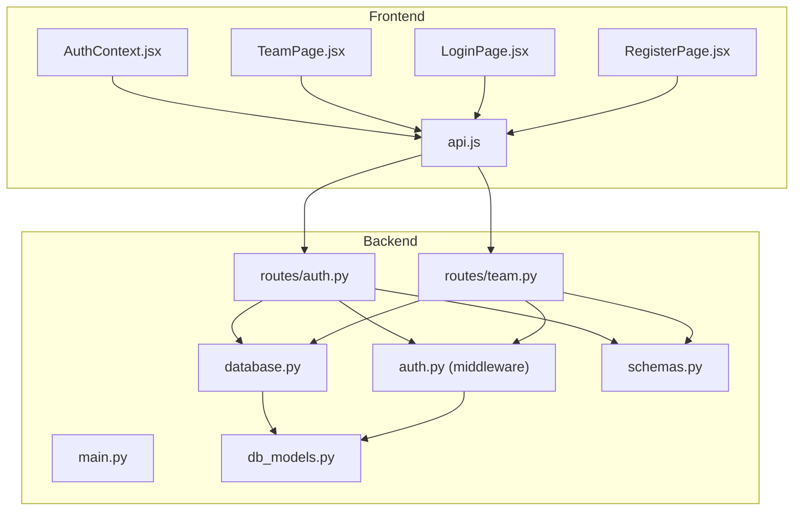
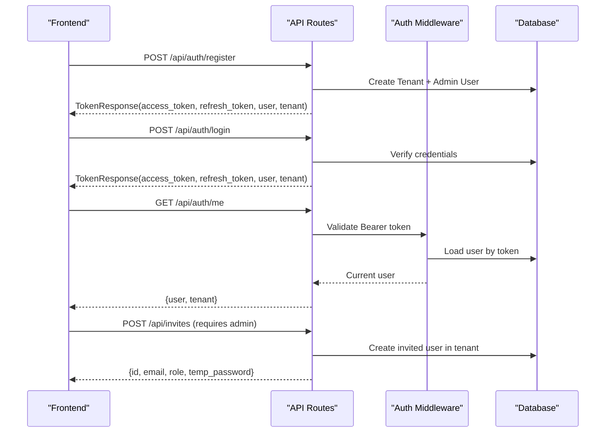
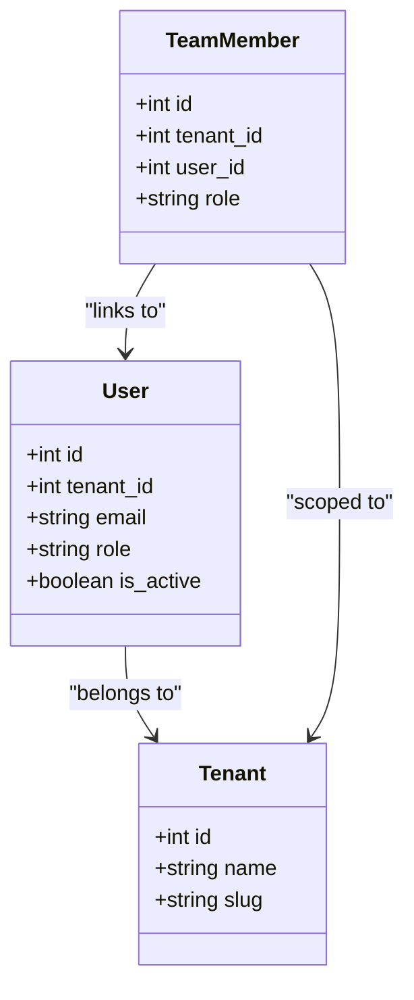
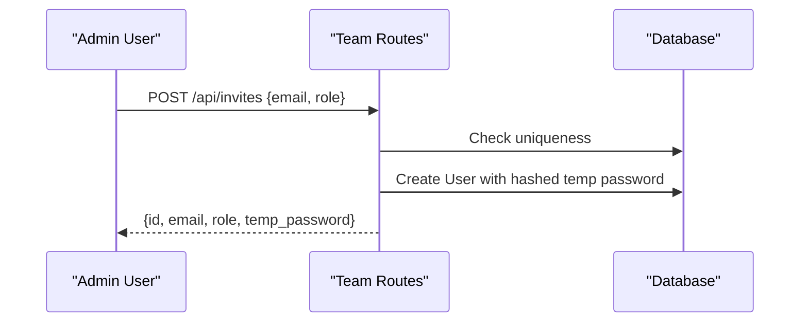
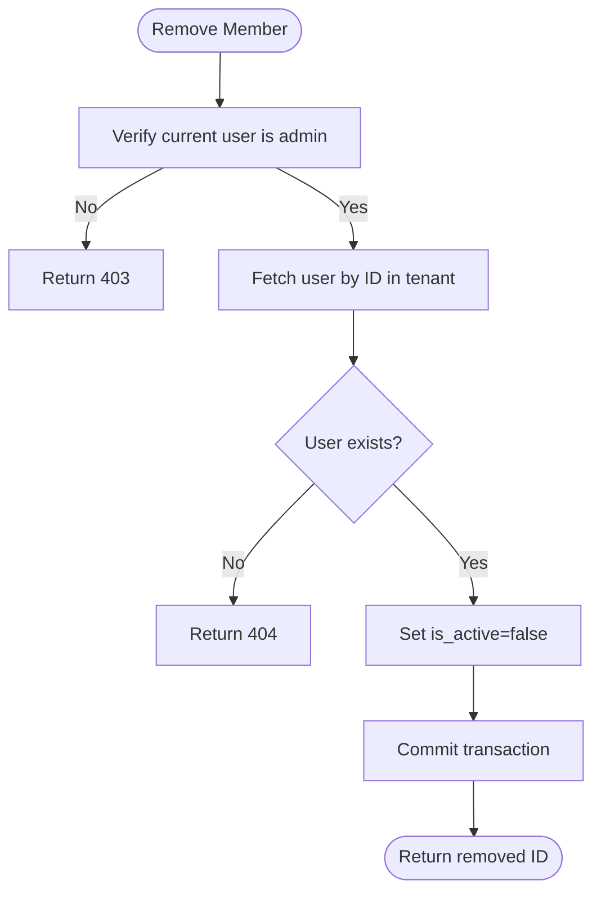
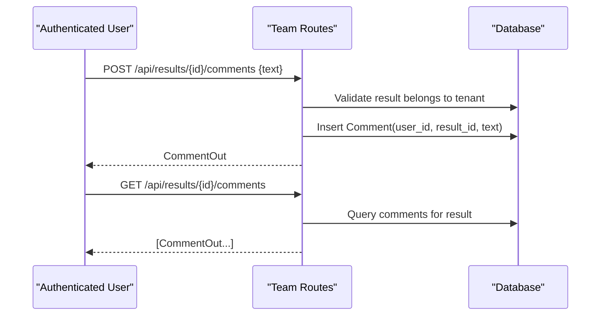
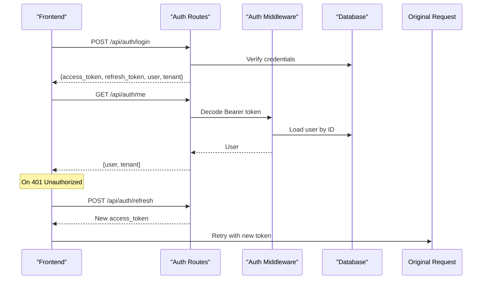
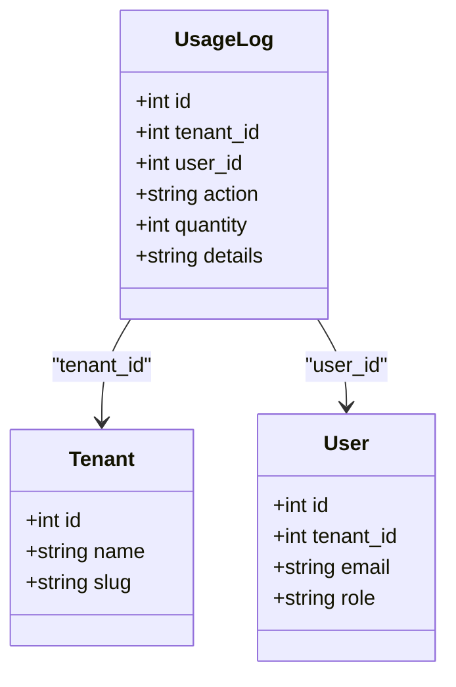
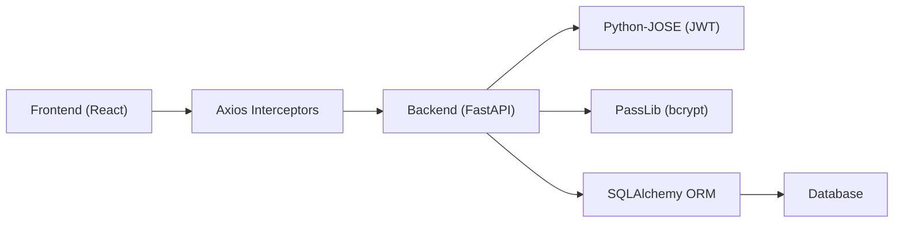

# Team Collaboration & User Management

<cite>
**Referenced Files in This Document**
- [main.py](file://app/backend/main.py)
- [database.py](file://app/backend/db/database.py)
- [auth.py](file://app/backend/middleware/auth.py)
- [auth_routes.py](file://app/backend/routes/auth.py)
- [team_routes.py](file://app/backend/routes/team.py)
- [db_models.py](file://app/backend/models/db_models.py)
- [schemas.py](file://app/backend/models/schemas.py)
- [AuthContext.jsx](file://app/frontend/src/contexts/AuthContext.jsx)
- [api.js](file://app/frontend/src/lib/api.js)
- [TeamPage.jsx](file://app/frontend/src/pages/TeamPage.jsx)
- [LoginPage.jsx](file://app/frontend/src/pages/LoginPage.jsx)
- [RegisterPage.jsx](file://app/frontend/src/pages/RegisterPage.jsx)
</cite>

## Table of Contents
1. [Introduction](#introduction)
2. [Project Structure](#project-structure)
3. [Core Components](#core-components)
4. [Architecture Overview](#architecture-overview)
5. [Detailed Component Analysis](#detailed-component-analysis)
6. [Dependency Analysis](#dependency-analysis)
7. [Performance Considerations](#performance-considerations)
8. [Troubleshooting Guide](#troubleshooting-guide)
9. [Conclusion](#conclusion)

## Introduction
This document explains the team collaboration and user management features of the platform. It covers user roles (admin, recruiter, viewer), permission hierarchies, team member invitation workflows, JWT-based authentication and tenant-aware login, user activity tracking, audit logging, session management, and collaborative workflows including comments and shared resources. It also documents the frontend integration points and provides practical examples of onboarding, password security, and account lifecycle management.

## Project Structure
The system is organized into:
- Backend API (FastAPI): Authentication, team collaboration, and tenant management
- Database models: SQLAlchemy ORM for users, tenants, team members, comments, and usage logs
- Frontend (React): Authentication flows, team management UI, and API integration

**Diagram sources**
- [main.py:174-215](file://app/backend/main.py#L174-L215)
- [database.py:1-33](file://app/backend/db/database.py#L1-L33)
- [auth.py:19-46](file://app/backend/middleware/auth.py#L19-L46)
- [auth_routes.py:1-152](file://app/backend/routes/auth.py#L1-L152)
- [team_routes.py:1-135](file://app/backend/routes/team.py#L1-L135)
- [db_models.py:62-192](file://app/backend/models/db_models.py#L62-L192)
- [schemas.py:140-171](file://app/backend/models/schemas.py#L140-L171)
- [AuthContext.jsx:1-70](file://app/frontend/src/contexts/AuthContext.jsx#L1-L70)
- [api.js:1-43](file://app/frontend/src/lib/api.js#L1-L43)
- [TeamPage.jsx:1-257](file://app/frontend/src/pages/TeamPage.jsx#L1-L257)
- [LoginPage.jsx:1-121](file://app/frontend/src/pages/LoginPage.jsx#L1-L121)
- [RegisterPage.jsx:1-143](file://app/frontend/src/pages/RegisterPage.jsx#L1-L143)

**Section sources**
- [main.py:174-215](file://app/backend/main.py#L174-L215)
- [database.py:1-33](file://app/backend/db/database.py#L1-L33)
- [db_models.py:62-192](file://app/backend/models/db_models.py#L62-L192)

## Core Components
- Multi-tenancy: Tenants own users, candidates, templates, results, and team members. Users belong to a single tenant and are isolated by tenant_id.
- User roles: admin, recruiter, viewer. Roles are enforced via route decorators and tenant-scoped queries.
- Authentication: JWT tokens (access and refresh) with bcrypt password hashing. Tokens carry user identity and are validated centrally.
- Team collaboration: Invite members (with role), list team members, remove members, and add comments to screening results.
- Activity tracking: Usage logs record actions per tenant/user for billing and analytics.
- Frontend integration: Axios interceptors handle token injection and auto-refresh; React context manages auth state.

**Section sources**
- [db_models.py:31-60](file://app/backend/models/db_models.py#L31-L60)
- [db_models.py:62-76](file://app/backend/models/db_models.py#L62-L76)
- [db_models.py:169-178](file://app/backend/models/db_models.py#L169-L178)
- [db_models.py:181-191](file://app/backend/models/db_models.py#L181-L191)
- [db_models.py:79-92](file://app/backend/models/db_models.db_models.py#L79-L92)
- [auth_routes.py:57-96](file://app/backend/routes/auth.py#L57-L96)
- [auth_routes.py:99-115](file://app/backend/routes/auth.py#L99-L115)
- [auth_routes.py:118-142](file://app/backend/routes/auth.py#L118-L142)
- [auth_routes.py:145-151](file://app/backend/routes/auth.py#L145-L151)
- [auth.py:19-46](file://app/backend/middleware/auth.py#L19-L46)
- [team_routes.py:18-31](file://app/backend/routes/team.py#L18-L31)
- [team_routes.py:34-61](file://app/backend/routes/team.py#L34-L61)
- [team_routes.py:64-82](file://app/backend/routes/team.py#L64-L82)
- [team_routes.py:85-134](file://app/backend/routes/team.py#L85-L134)
- [schemas.py:140-171](file://app/backend/models/schemas.py#L140-L171)
- [schemas.py:254-257](file://app/backend/models/schemas.py#L254-L257)
- [schemas.py:259-271](file://app/backend/models/schemas.py#L259-L271)
- [api.js:9-43](file://app/frontend/src/lib/api.js#L9-L43)
- [AuthContext.jsx:11-27](file://app/frontend/src/contexts/AuthContext.jsx#L11-L27)
- [AuthContext.jsx:33-56](file://app/frontend/src/contexts/AuthContext.jsx#L33-L56)

## Architecture Overview
The system enforces tenant isolation and role-based access control across all routes. Authentication middleware validates JWTs and attaches the current user to requests. Team routes operate within the tenant scope, ensuring users can only access resources belonging to their tenant.

**Diagram sources**
- [auth_routes.py:57-96](file://app/backend/routes/auth.py#L57-L96)
- [auth_routes.py:99-115](file://app/backend/routes/auth.py#L99-L115)
- [auth_routes.py:145-151](file://app/backend/routes/auth.py#L145-L151)
- [auth.py:19-46](file://app/backend/middleware/auth.py#L19-L46)
- [team_routes.py:34-61](file://app/backend/routes/team.py#L34-L61)

## Detailed Component Analysis

### User Roles and Permission Hierarchies
- Role definitions:
  - admin: Can invite/remove users and access administrative endpoints
  - recruiter: Standard collaborator role
  - viewer: Read-only role (defined in frontend role list)
- Enforcement:
  - Route-level decorator ensures only admins can invite/remove members
  - Tenant scoping ensures users operate within their tenant’s data
  - Comments are associated with users and results, enabling collaboration

**Diagram sources**
- [db_models.py:62-76](file://app/backend/models/db_models.py#L62-L76)
- [db_models.py:169-178](file://app/backend/models/db_models.py#L169-L178)
- [db_models.py:31-60](file://app/backend/models/db_models.py#L31-L60)

**Section sources**
- [db_models.py:69](file://app/backend/models/db_models.py#L69)
- [team_routes.py:37](file://app/backend/routes/team.py#L37)
- [team_routes.py:67](file://app/backend/routes/team.py#L67)
- [TeamPage.jsx:6](file://app/frontend/src/pages/TeamPage.jsx#L6)

### Team Member Invitation Workflow
- Admin creates an invited user with a temporary password
- Temporary password is returned to the caller (in production, would be emailed)
- Invited user can log in and change their password

**Diagram sources**
- [team_routes.py:34-61](file://app/backend/routes/team.py#L34-L61)
- [auth_routes.py:30-35](file://app/backend/routes/auth.py#L30-L35)

**Section sources**
- [team_routes.py:34-61](file://app/backend/routes/team.py#L34-L61)
- [schemas.py:254-257](file://app/backend/models/schemas.py#L254-L257)

### Team Member Removal and Listing
- Listing filters active users within the current tenant
- Removal sets is_active to false and prevents further access

**Diagram sources**
- [team_routes.py:64-82](file://app/backend/routes/team.py#L64-L82)

**Section sources**
- [team_routes.py:18-31](file://app/backend/routes/team.py#L18-L31)
- [team_routes.py:64-82](file://app/backend/routes/team.py#L64-L82)

### Collaborative Comments on Screening Results
- Users can add comments to results within their tenant
- Comments are retrieved in creation-time order

**Diagram sources**
- [team_routes.py:85-134](file://app/backend/routes/team.py#L85-L134)
- [schemas.py:259-271](file://app/backend/models/schemas.py#L259-L271)

**Section sources**
- [team_routes.py:85-134](file://app/backend/routes/team.py#L85-L134)
- [db_models.py:181-191](file://app/backend/models/db_models.py#L181-L191)

### Authentication and Authorization Patterns
- JWT token management:
  - Access tokens expire after a configurable period
  - Refresh tokens are separate and long-lived
  - Refresh endpoint validates token type and reissues access token
- Tenant-aware login:
  - On login/register, the tenant is resolved and returned with tokens
- Frontend session management:
  - Axios interceptor attaches Authorization: Bearer header
  - Automatic token refresh on 401 using stored refresh token
  - Local storage persists tokens and clears on logout

**Diagram sources**
- [auth_routes.py:99-115](file://app/backend/routes/auth.py#L99-L115)
- [auth_routes.py:118-142](file://app/backend/routes/auth.py#L118-L142)
- [auth_routes.py:145-151](file://app/backend/routes/auth.py#L145-L151)
- [auth.py:19-46](file://app/backend/middleware/auth.py#L19-L46)
- [api.js:9-43](file://app/frontend/src/lib/api.js#L9-L43)
- [AuthContext.jsx:33-56](file://app/frontend/src/contexts/AuthContext.jsx#L33-L56)

**Section sources**
- [auth_routes.py:24-25](file://app/backend/routes/auth.py#L24-L25)
- [auth_routes.py:99-115](file://app/backend/routes/auth.py#L99-L115)
- [auth_routes.py:118-142](file://app/backend/routes/auth.py#L118-L142)
- [auth_routes.py:145-151](file://app/backend/routes/auth.py#L145-L151)
- [auth.py:13-14](file://app/backend/middleware/auth.py#L13-L14)
- [api.js:9-43](file://app/frontend/src/lib/api.js#L9-L43)
- [AuthContext.jsx:11-27](file://app/frontend/src/contexts/AuthContext.jsx#L11-L27)

### User Activity Tracking and Audit Logging
- Usage logs capture per-action usage per tenant/user for billing and analytics
- Logs include action type, quantity, and optional details

**Diagram sources**
- [db_models.py:79-92](file://app/backend/models/db_models.py#L79-L92)
- [db_models.py:31-60](file://app/backend/models/db_models.py#L31-L60)
- [db_models.py:62-76](file://app/backend/models/db_models.py#L62-L76)

**Section sources**
- [db_models.py:79-92](file://app/backend/models/db_models.py#L79-L92)

### Team Member Management APIs
- List team members: GET /api/team
- Invite member: POST /api/invites {email, role}
- Remove member: DELETE /api/team/{user_id}
- Add comment: POST /api/results/{result_id}/comments {text}
- Get comments: GET /api/results/{result_id}/comments

**Section sources**
- [team_routes.py:18-31](file://app/backend/routes/team.py#L18-L31)
- [team_routes.py:34-61](file://app/backend/routes/team.py#L34-L61)
- [team_routes.py:64-82](file://app/backend/routes/team.py#L64-L82)
- [team_routes.py:85-134](file://app/backend/routes/team.py#L85-L134)

### Frontend Integration and User Experience
- Authentication flows:
  - Login page posts credentials and stores tokens
  - Registration creates a tenant and admin user
- Team management:
  - Admins see invite button and can invite members with selected roles
  - Temporary passwords are copied securely
- Session persistence:
  - Auth context loads user on startup if tokens exist
  - Logout clears tokens and state

**Section sources**
- [LoginPage.jsx:15-27](file://app/frontend/src/pages/LoginPage.jsx#L15-L27)
- [RegisterPage.jsx:16-32](file://app/frontend/src/pages/RegisterPage.jsx#L16-L32)
- [TeamPage.jsx:8-29](file://app/frontend/src/pages/TeamPage.jsx#L8-L29)
- [TeamPage.jsx:177-256](file://app/frontend/src/pages/TeamPage.jsx#L177-L256)
- [AuthContext.jsx:11-27](file://app/frontend/src/contexts/AuthContext.jsx#L11-L27)
- [AuthContext.jsx:33-56](file://app/frontend/src/contexts/AuthContext.jsx#L33-L56)
- [api.js:259-268](file://app/frontend/src/lib/api.js#L259-L268)

## Dependency Analysis
- Backend depends on:
  - SQLAlchemy for ORM and tenant/user isolation
  - Pydantic for request/response schemas
  - Python-JOSE for JWT encoding/decoding
  - PassLib for bcrypt password hashing
- Frontend depends on:
  - Axios for HTTP requests with interceptors
  - React context for global auth state

**Diagram sources**
- [api.js:9-43](file://app/frontend/src/lib/api.js#L9-L43)
- [auth_routes.py:30-35](file://app/backend/routes/auth.py#L30-L35)
- [auth_routes.py:38-40](file://app/backend/routes/auth.py#L38-L40)
- [database.py:1-33](file://app/backend/db/database.py#L1-L33)

**Section sources**
- [auth_routes.py:30-35](file://app/backend/routes/auth.py#L30-L35)
- [auth_routes.py:38-40](file://app/backend/routes/auth.py#L38-L40)
- [database.py:1-33](file://app/backend/db/database.py#L1-L33)
- [api.js:9-43](file://app/frontend/src/lib/api.js#L9-L43)

## Performance Considerations
- Token expiration: Configure access and refresh token lifetimes via environment variables to balance security and UX
- Database queries: Tenant-scoped filters ensure isolation and reduce cross-tenant joins
- Frontend caching: Persist minimal user/tenant info in local storage to avoid repeated auth/me calls
- Streaming: Use streaming endpoints where available to improve perceived performance during analysis

## Troubleshooting Guide
- Invalid or expired token:
  - Backend returns 401; frontend auto-refreshes using refresh token
  - If refresh fails, user is redirected to login
- Missing or invalid Authorization header:
  - Ensure axios interceptor attaches Bearer token
- Admin-only endpoints:
  - Verify current user role is admin before inviting/removing members
- Tenant mismatch:
  - Ensure all operations filter by current_user.tenant_id

**Section sources**
- [auth.py:23-40](file://app/backend/middleware/auth.py#L23-L40)
- [api.js:19-43](file://app/frontend/src/lib/api.js#L19-L43)
- [team_routes.py:37](file://app/backend/routes/team.py#L37)
- [team_routes.py:67](file://app/backend/routes/team.py#L67)

## Conclusion
The platform implements robust tenant-aware user management with clear role hierarchies, secure JWT-based authentication, and comprehensive team collaboration features. Frontend integration provides seamless authentication and team management experiences, while backend middleware and tenant-scoped queries enforce access control and data isolation.