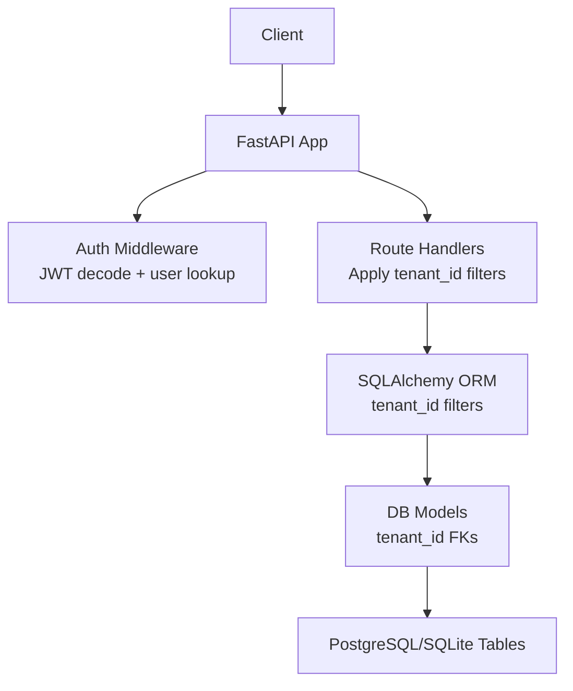
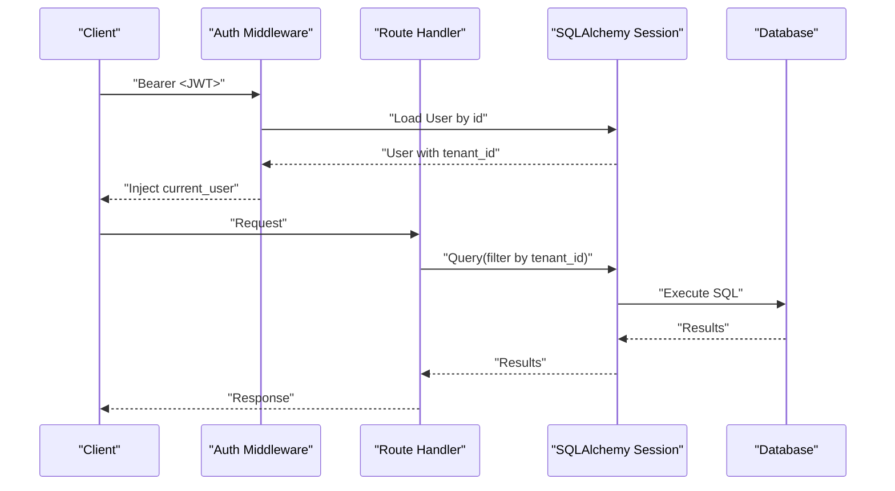
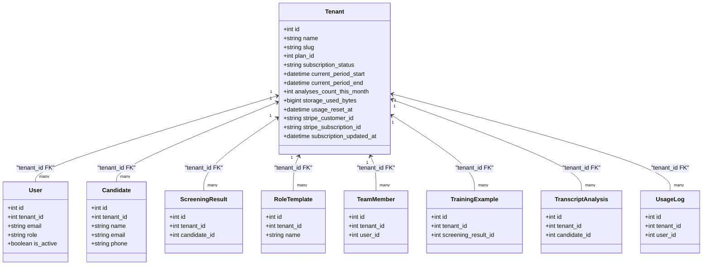
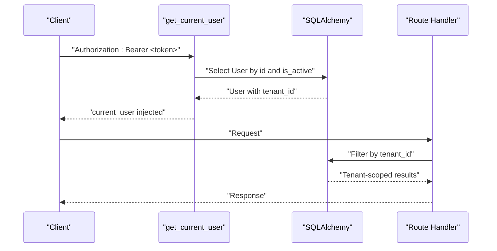
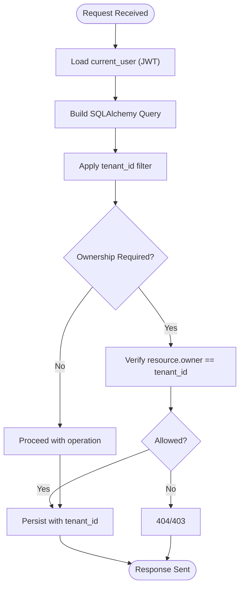
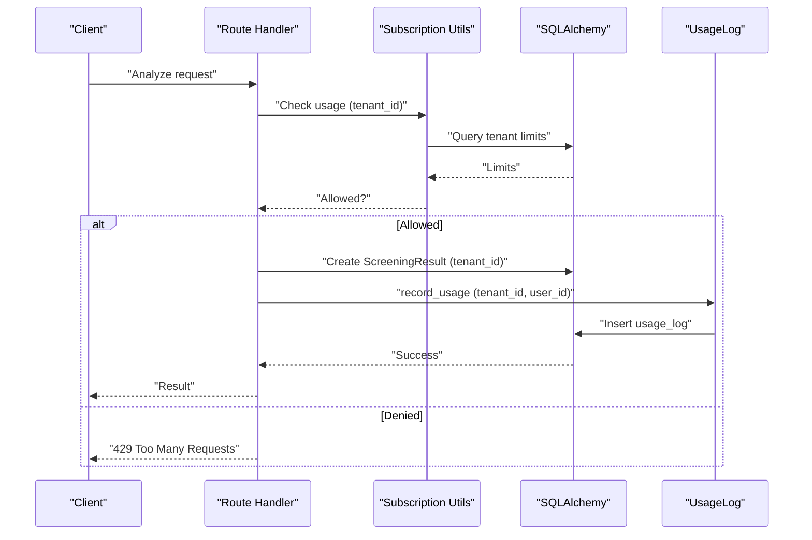
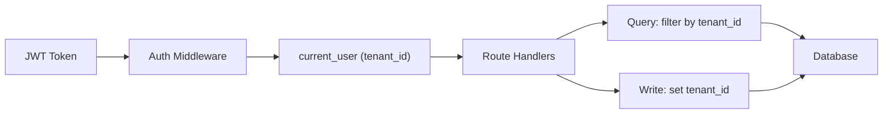

# Tenant Isolation & Data Separation

<cite>
**Referenced Files in This Document**
- [db_models.py](file://app/backend/models/db_models.py)
- [auth.py](file://app/backend/middleware/auth.py)
- [database.py](file://app/backend/db/database.py)
- [schemas.py](file://app/backend/models/schemas.py)
- [candidates.py](file://app/backend/routes/candidates.py)
- [auth_routes.py](file://app/backend/routes/auth.py)
- [team.py](file://app/backend/routes/team.py)
- [templates.py](file://app/backend/routes/templates.py)
- [subscription.py](file://app/backend/routes/subscription.py)
- [analyze.py](file://app/backend/routes/analyze.py)
- [main.py](file://app/backend/main.py)
- [001_enrich_candidates_add_caches.py](file://alembic/versions/001_enrich_candidates_add_caches.py)
- [002_parser_snapshot_json.py](file://alembic/versions/002_parser_snapshot_json.py)
- [003_subscription_system.py](file://alembic/versions/003_subscription_system.py)
</cite>

## Table of Contents
1. [Introduction](#introduction)
2. [Project Structure](#project-structure)
3. [Core Components](#core-components)
4. [Architecture Overview](#architecture-overview)
5. [Detailed Component Analysis](#detailed-component-analysis)
6. [Dependency Analysis](#dependency-analysis)
7. [Performance Considerations](#performance-considerations)
8. [Troubleshooting Guide](#troubleshooting-guide)
9. [Conclusion](#conclusion)

## Introduction
This document explains how Resume AI enforces multi-tenant isolation across all data models and API operations. The system ensures that each tenant’s data remains completely separate, preventing cross-tenant access through strict tenant_id-based filtering at the database query layer, automatic propagation of tenant context from authentication to persistence, and explicit security boundaries in route handlers. It also covers tenant-aware CRUD patterns, usage enforcement, and practical guidance for extending the system with new tenant-scoped models.

## Project Structure
The tenant isolation implementation spans three layers:
- Data models define tenant_id foreign keys on all tenant-scoped entities.
- Middleware extracts the current user (including tenant_id) from JWTs and exposes it to route handlers.
- Route handlers apply tenant_id filters on every read/write operation and enforce administrative boundaries.

**Diagram sources**
- [main.py:200-215](file://app/backend/main.py#L200-L215)
- [auth.py:19-41](file://app/backend/middleware/auth.py#L19-L41)
- [database.py:27-33](file://app/backend/db/database.py#L27-L33)
- [db_models.py:62-126](file://app/backend/models/db_models.py#L62-L126)

**Section sources**
- [main.py:200-215](file://app/backend/main.py#L200-L215)
- [auth.py:19-41](file://app/backend/middleware/auth.py#L19-L41)
- [database.py:27-33](file://app/backend/db/database.py#L27-L33)
- [db_models.py:62-126](file://app/backend/models/db_models.py#L62-L126)

## Core Components
- Tenant model: central entity representing a customer account with subscription and usage tracking.
- User model: belongs to a tenant and carries role-based permissions.
- Candidate, ScreeningResult, RoleTemplate, TeamMember, TrainingExample, TranscriptAnalysis, UsageLog: all include tenant_id to ensure data confinement.
- Authentication middleware: decodes JWT and loads the current user (includes tenant_id).
- Route handlers: consistently filter queries by tenant_id and set tenant_id on writes.

Key tenant-scoped models and their tenant_id presence:
- User: tenant_id foreign key.
- Candidate: tenant_id foreign key.
- ScreeningResult: tenant_id foreign key.
- RoleTemplate: tenant_id foreign key.
- TeamMember: tenant_id foreign key.
- TrainingExample: tenant_id foreign key.
- TranscriptAnalysis: tenant_id foreign key.
- UsageLog: tenant_id foreign key.
- Tenant: parent entity referenced by foreign keys above.

**Section sources**
- [db_models.py:31-60](file://app/backend/models/db_models.py#L31-L60)
- [db_models.py:62-77](file://app/backend/models/db_models.py#L62-L77)
- [db_models.py:97-126](file://app/backend/models/db_models.py#L97-L126)
- [db_models.py:128-147](file://app/backend/models/db_models.py#L128-L147)
- [db_models.py:151-165](file://app/backend/models/db_models.py#L151-L165)
- [db_models.py:169-179](file://app/backend/models/db_models.py#L169-L179)
- [db_models.py:214-225](file://app/backend/models/db_models.py#L214-L225)
- [db_models.py:196-210](file://app/backend/models/db_models.py#L196-L210)
- [db_models.py:79-93](file://app/backend/models/db_models.py#L79-L93)

## Architecture Overview
The tenant isolation architecture enforces a strict “tenant-first” policy:
- Authentication layer resolves tenant_id from the JWT and injects the current user into route handlers.
- Every database query includes tenant_id equality to restrict results to the caller’s tenant.
- Writes populate tenant_id automatically to prevent leakage to other tenants.
- Administrative boundaries (require_admin) ensure only authorized users can access admin endpoints.

**Diagram sources**
- [auth.py:19-41](file://app/backend/middleware/auth.py#L19-L41)
- [candidates.py:26-81](file://app/backend/routes/candidates.py#L26-L81)
- [database.py:27-33](file://app/backend/db/database.py#L27-L33)

**Section sources**
- [auth.py:19-41](file://app/backend/middleware/auth.py#L19-L41)
- [candidates.py:26-81](file://app/backend/routes/candidates.py#L26-L81)
- [database.py:27-33](file://app/backend/db/database.py#L27-L33)

## Detailed Component Analysis

### Tenant Model and Relationships
The Tenant model encapsulates subscription and usage metadata and maintains relationships to all tenant-scoped entities.

**Diagram sources**
- [db_models.py:31-60](file://app/backend/models/db_models.py#L31-L60)
- [db_models.py:62-77](file://app/backend/models/db_models.py#L62-L77)
- [db_models.py:97-126](file://app/backend/models/db_models.py#L97-L126)
- [db_models.py:128-147](file://app/backend/models/db_models.py#L128-L147)
- [db_models.py:151-165](file://app/backend/models/db_models.py#L151-L165)
- [db_models.py:169-179](file://app/backend/models/db_models.py#L169-L179)
- [db_models.py:214-225](file://app/backend/models/db_models.py#L214-L225)
- [db_models.py:196-210](file://app/backend/models/db_models.py#L196-L210)
- [db_models.py:79-93](file://app/backend/models/db_models.py#L79-L93)

**Section sources**
- [db_models.py:31-60](file://app/backend/models/db_models.py#L31-L60)
- [db_models.py:62-77](file://app/backend/models/db_models.py#L62-L77)
- [db_models.py:97-126](file://app/backend/models/db_models.py#L97-L126)
- [db_models.py:128-147](file://app/backend/models/db_models.py#L128-L147)
- [db_models.py:151-165](file://app/backend/models/db_models.py#L151-L165)
- [db_models.py:169-179](file://app/backend/models/db_models.py#L169-L179)
- [db_models.py:214-225](file://app/backend/models/db_models.py#L214-L225)
- [db_models.py:196-210](file://app/backend/models/db_models.py#L196-L210)
- [db_models.py:79-93](file://app/backend/models/db_models.py#L79-L93)

### Authentication and Tenant Context Propagation
The authentication middleware validates JWTs and loads the current user, which includes the tenant_id. Route handlers depend on this user to enforce tenant isolation.

**Diagram sources**
- [auth.py:19-41](file://app/backend/middleware/auth.py#L19-L41)
- [auth_routes.py:100-115](file://app/backend/routes/auth.py#L100-L115)

**Section sources**
- [auth.py:19-41](file://app/backend/middleware/auth.py#L19-L41)
- [auth_routes.py:100-115](file://app/backend/routes/auth.py#L100-L115)

### Tenant-Aware CRUD Patterns
Tenant isolation is enforced in all major route handlers by:
- Filtering reads with tenant_id.
- Setting tenant_id on writes.
- Verifying ownership for updates/deletes.

Examples across modules:
- Candidate listing and retrieval include tenant_id filters.
- Candidate updates verify tenant ownership.
- Template CRUD enforces tenant scoping.
- Team member management filters users by tenant_id.
- Usage logs and subscription endpoints scope all queries by tenant_id.

**Diagram sources**
- [candidates.py:26-81](file://app/backend/routes/candidates.py#L26-L81)
- [candidates.py:83-100](file://app/backend/routes/candidates.py#L83-L100)
- [templates.py:16-27](file://app/backend/routes/templates.py#L16-L27)
- [templates.py:29-46](file://app/backend/routes/templates.py#L29-L46)
- [team.py:18-32](file://app/backend/routes/team.py#L18-L32)
- [team.py:64-83](file://app/backend/routes/team.py#L64-L83)
- [subscription.py:346-368](file://app/backend/routes/subscription.py#L346-L368)

**Section sources**
- [candidates.py:26-81](file://app/backend/routes/candidates.py#L26-L81)
- [candidates.py:83-100](file://app/backend/routes/candidates.py#L83-L100)
- [templates.py:16-27](file://app/backend/routes/templates.py#L16-L27)
- [templates.py:29-46](file://app/backend/routes/templates.py#L29-L46)
- [team.py:18-32](file://app/backend/routes/team.py#L18-L32)
- [team.py:64-83](file://app/backend/routes/team.py#L64-L83)
- [subscription.py:346-368](file://app/backend/routes/subscription.py#L346-L368)

### Usage Enforcement and Security Boundaries
- Usage checks and increments are scoped to tenant_id.
- Admin-only endpoints enforce require_admin to prevent unauthorized access.
- Deduplication and analysis flows write ScreeningResult with tenant_id to maintain isolation.

**Diagram sources**
- [subscription.py:256-344](file://app/backend/routes/subscription.py#L256-L344)
- [subscription.py:427-477](file://app/backend/routes/subscription.py#L427-L477)
- [analyze.py:354-502](file://app/backend/routes/analyze.py#L354-L502)

**Section sources**
- [subscription.py:256-344](file://app/backend/routes/subscription.py#L256-L344)
- [subscription.py:427-477](file://app/backend/routes/subscription.py#L427-L477)
- [analyze.py:354-502](file://app/backend/routes/analyze.py#L354-L502)

### Implementation Guidelines for New Tenant-Aware Models
To add a new tenant-scoped model:
- Define tenant_id as a non-nullable foreign key to tenants.
- Add appropriate indexes on tenant_id for query performance.
- Ensure all route handlers filter reads by tenant_id and set tenant_id on writes.
- If the model references other tenant-scoped entities, add corresponding foreign keys and relationships.
- Consider cascading deletes and referential integrity as needed.

Schema evolution via Alembic:
- Use idempotent migrations to add tenant_id columns and indexes.
- Seed or backfill default values where necessary.

**Section sources**
- [db_models.py:62-77](file://app/backend/models/db_models.py#L62-L77)
- [db_models.py:97-126](file://app/backend/models/db_models.py#L97-L126)
- [001_enrich_candidates_add_caches.py:45-77](file://alembic/versions/001_enrich_candidates_add_caches.py#L45-L77)
- [003_subscription_system.py:69-91](file://alembic/versions/003_subscription_system.py#L69-L91)

## Dependency Analysis
Tenant isolation depends on consistent application of tenant_id across:
- Models: all tenant-scoped entities include tenant_id.
- Middleware: JWT decoding yields current_user with tenant_id.
- Routes: every query includes tenant_id filter; writes set tenant_id.
- Database: indexes on tenant_id improve query performance.

**Diagram sources**
- [auth.py:19-41](file://app/backend/middleware/auth.py#L19-L41)
- [candidates.py:26-81](file://app/backend/routes/candidates.py#L26-L81)
- [database.py:27-33](file://app/backend/db/database.py#L27-L33)

**Section sources**
- [auth.py:19-41](file://app/backend/middleware/auth.py#L19-L41)
- [candidates.py:26-81](file://app/backend/routes/candidates.py#L26-L81)
- [database.py:27-33](file://app/backend/db/database.py#L27-L33)

## Performance Considerations
- Indexes on tenant_id:
  - Candidate: resume_file_hash index supports deduplication and tenant scoping.
  - UsageLog: composite indexes on (tenant_id, action) and (tenant_id, created_at) optimize usage queries.
  - Tenant: indexes on subscription_status and stripe_customer_id support subscription management.
- Query patterns:
  - Always filter by tenant_id to avoid scanning unrelated rows.
  - Use pagination and ordering to limit result sets.
- Storage and caching:
  - Parser snapshots and resume text are stored per tenant; ensure appropriate limits via subscription plans.
- Deduplication:
  - Multi-layer dedup (email → hash → name+phone) reduces redundant writes and improves performance.

**Section sources**
- [001_enrich_candidates_add_caches.py:75-77](file://alembic/versions/001_enrich_candidates_add_caches.py#L75-L77)
- [003_subscription_system.py:106-117](file://alembic/versions/003_subscription_system.py#L106-L117)
- [003_subscription_system.py:88-91](file://alembic/versions/003_subscription_system.py#L88-L91)
- [analyze.py:147-215](file://app/backend/routes/analyze.py#L147-L215)

## Troubleshooting Guide
Common issues and resolutions:
- Cross-tenant data access:
  - Symptom: seeing records from another tenant.
  - Cause: missing tenant_id filter in a route handler or model query.
  - Resolution: ensure every query includes tenant_id equality and tenant_id is set on writes.
- Unauthorized access to admin endpoints:
  - Symptom: 403 when accessing admin routes.
  - Cause: user lacks admin role.
  - Resolution: verify require_admin decorator and user role.
- Usage limit errors:
  - Symptom: 429 Too Many Requests on analysis.
  - Cause: tenant exceeded plan limits.
  - Resolution: check subscription plan limits and usage via subscription endpoints.
- Missing tenant_id in new model:
  - Symptom: data leakage or inability to scope queries.
  - Resolution: add tenant_id FK, indexes, and enforce tenant_id in all handlers.

**Section sources**
- [team.py:37-41](file://app/backend/routes/team.py#L37-L41)
- [subscription.py:256-344](file://app/backend/routes/subscription.py#L256-L344)
- [analyze.py:354-502](file://app/backend/routes/analyze.py#L354-L502)

## Conclusion
Resume AI achieves robust tenant isolation by embedding tenant_id across all tenant-scoped models, enforcing tenant-aware query patterns in route handlers, and propagating tenant context from JWT authentication through the application stack. Administrative boundaries and usage enforcement further strengthen security and compliance. Following the documented patterns and guidelines ensures that new features and models remain isolated and secure.