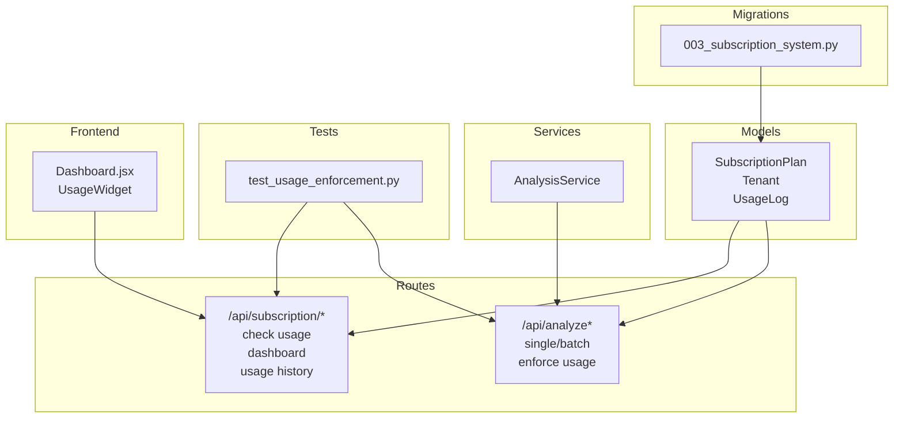
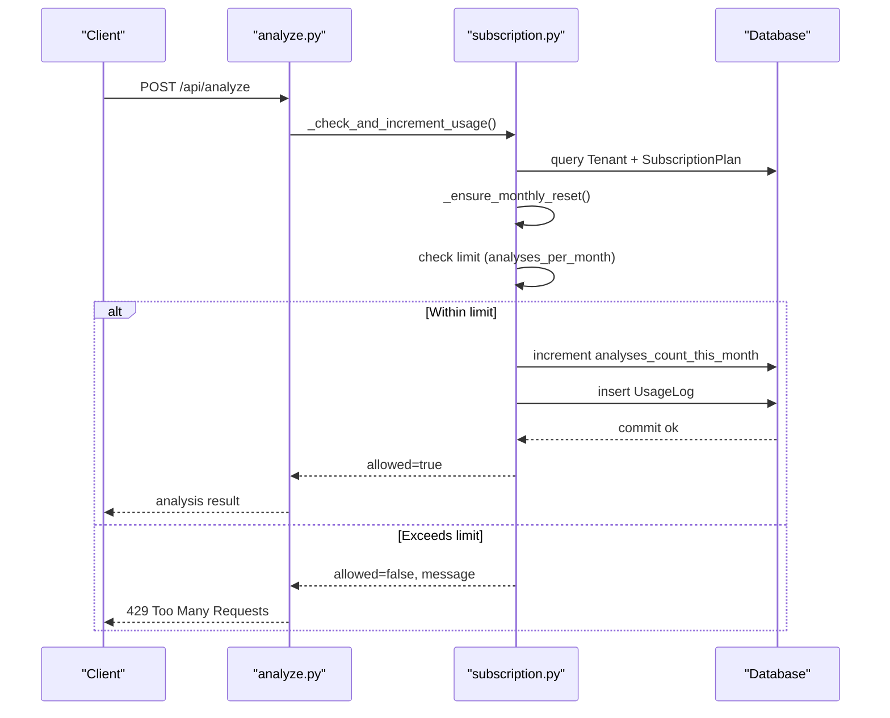
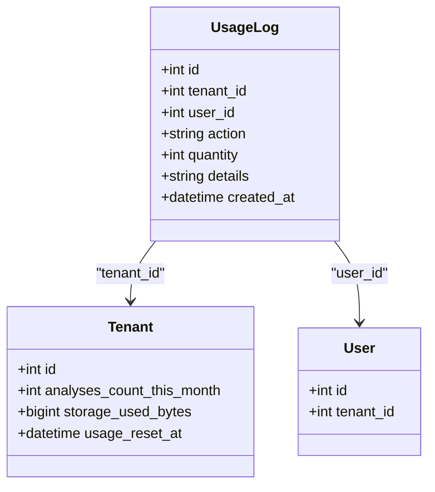
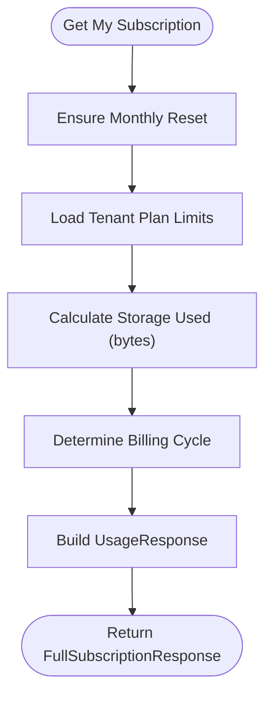
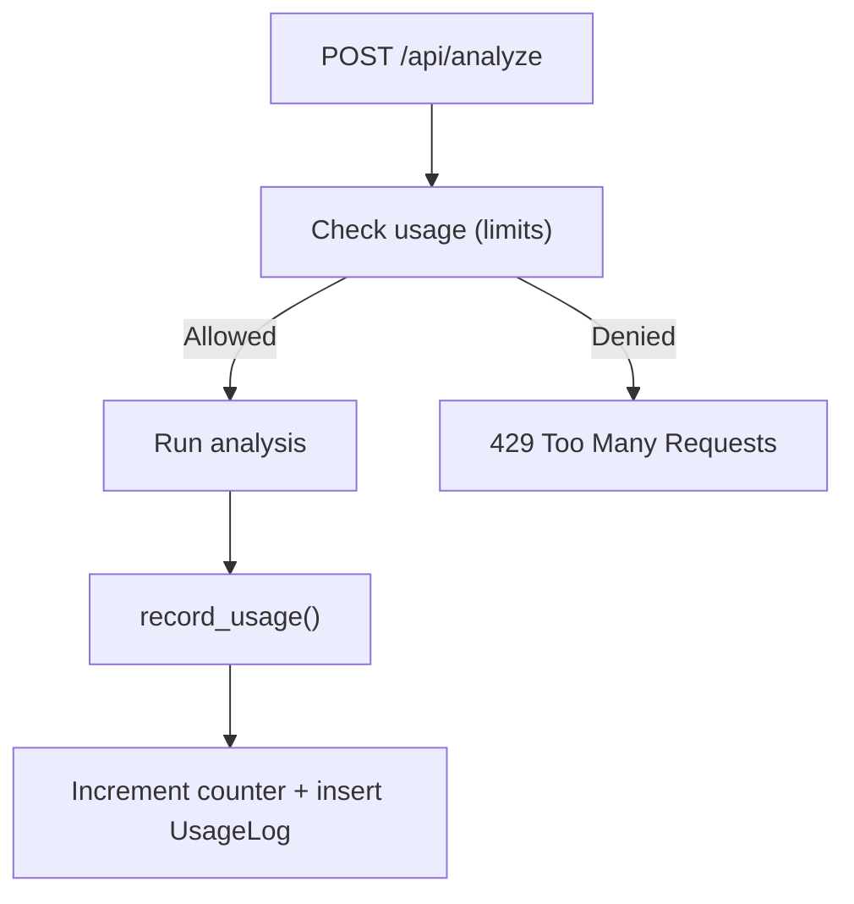
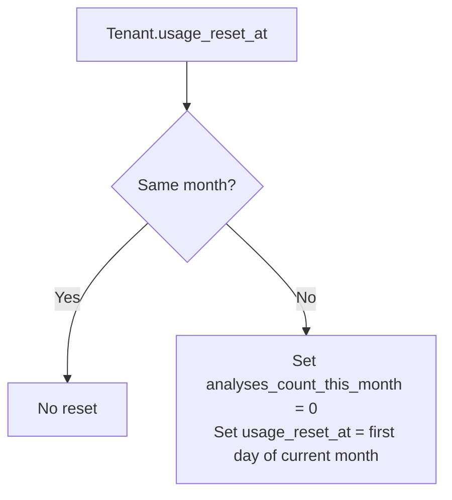
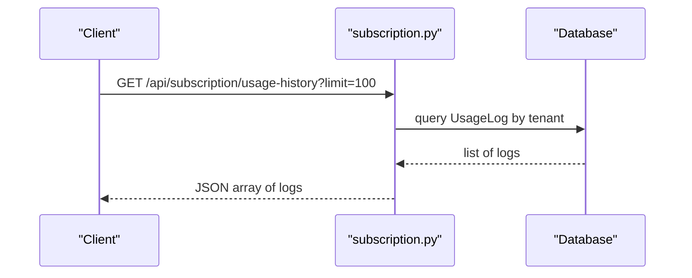
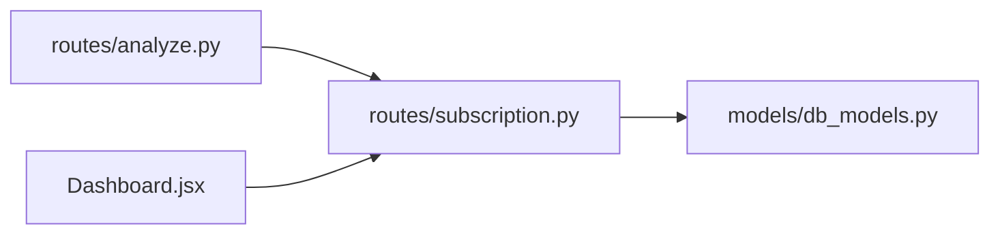

# Usage Tracking & Analytics

<cite>
**Referenced Files in This Document**
- [db_models.py](file://app/backend/models/db_models.py)
- [schemas.py](file://app/backend/models/schemas.py)
- [subscription.py](file://app/backend/routes/subscription.py)
- [analyze.py](file://app/backend/routes/analyze.py)
- [analysis_service.py](file://app/backend/services/analysis_service.py)
- [003_subscription_system.py](file://alembic/versions/003_subscription_system.py)
- [test_usage_enforcement.py](file://app/backend/tests/test_usage_enforcement.py)
- [Dashboard.jsx](file://app/frontend/src/pages/Dashboard.jsx)
</cite>

## Table of Contents
1. [Introduction](#introduction)
2. [Project Structure](#project-structure)
3. [Core Components](#core-components)
4. [Architecture Overview](#architecture-overview)
5. [Detailed Component Analysis](#detailed-component-analysis)
6. [Dependency Analysis](#dependency-analysis)
7. [Performance Considerations](#performance-considerations)
8. [Troubleshooting Guide](#troubleshooting-guide)
9. [Conclusion](#conclusion)
10. [Appendices](#appendices)

## Introduction
This document describes the usage tracking and analytics system for the Resume AI platform. It covers the UsageLog model, usage metrics collection, enforcement mechanisms, quotas, resource allocation, analytics, automated resets, billing cycles, capacity planning, reporting APIs, dashboard metrics, alerting, and practical examples for customization and predictive planning.

## Project Structure
The usage tracking spans models, routes, services, migrations, and tests:
- Models define tenants, plans, and usage logs.
- Routes expose subscription and usage endpoints and enforce quotas.
- Services encapsulate analysis logic and integrate with usage recording.
- Migrations add usage-related columns and the usage_logs table.
- Tests validate enforcement and dashboard integration.

**Diagram sources**
- [db_models.py:79-93](file://app/backend/models/db_models.py#L79-L93)
- [subscription.py:162-370](file://app/backend/routes/subscription.py#L162-L370)
- [analyze.py:354-501](file://app/backend/routes/analyze.py#L354-L501)
- [analysis_service.py:6-121](file://app/backend/services/analysis_service.py#L6-L121)
- [003_subscription_system.py:43-133](file://alembic/versions/003_subscription_system.py#L43-L133)
- [test_usage_enforcement.py:53-191](file://app/backend/tests/test_usage_enforcement.py#L53-L191)
- [Dashboard.jsx:163-200](file://app/frontend/src/pages/Dashboard.jsx#L163-L200)

**Section sources**
- [db_models.py:11-93](file://app/backend/models/db_models.py#L11-L93)
- [subscription.py:162-370](file://app/backend/routes/subscription.py#L162-L370)
- [analyze.py:354-501](file://app/backend/routes/analyze.py#L354-L501)
- [003_subscription_system.py:43-133](file://alembic/versions/003_subscription_system.py#L43-L133)
- [test_usage_enforcement.py:53-191](file://app/backend/tests/test_usage_enforcement.py#L53-L191)
- [Dashboard.jsx:163-200](file://app/frontend/src/pages/Dashboard.jsx#L163-L200)

## Core Components
- UsageLog model captures per-action usage events with tenant/user linkage, action type, quantity, and optional details.
- Tenant tracks monthly usage counts, storage usage, and last reset timestamp.
- SubscriptionPlan defines plan limits (e.g., analyses_per_month, batch_size, storage_gb) and pricing.
- Routes enforce quotas and record usage via a shared helper.
- Frontend dashboard displays usage progress and limits.

**Section sources**
- [db_models.py:79-93](file://app/backend/models/db_models.py#L79-L93)
- [db_models.py:31-60](file://app/backend/models/db_models.py#L31-L60)
- [db_models.py:11-29](file://app/backend/models/db_models.py#L11-L29)
- [subscription.py:427-477](file://app/backend/routes/subscription.py#L427-L477)
- [Dashboard.jsx:163-200](file://app/frontend/src/pages/Dashboard.jsx#L163-L200)

## Architecture Overview
The system enforces usage quotas at the route level and records detailed events for analytics.

**Diagram sources**
- [analyze.py:323-352](file://app/backend/routes/analyze.py#L323-L352)
- [subscription.py:72-84](file://app/backend/routes/subscription.py#L72-L84)
- [subscription.py:427-477](file://app/backend/routes/subscription.py#L427-L477)

## Detailed Component Analysis

### UsageLog Model
- Purpose: Track every usage event with tenant and user context, action type, quantity, and optional JSON details.
- Fields: id, tenant_id, user_id, action, quantity, details, created_at.
- Indexes: tenant_id + action, tenant_id + created_at, created_at.

**Diagram sources**
- [db_models.py:79-93](file://app/backend/models/db_models.py#L79-L93)
- [db_models.py:31-60](file://app/backend/models/db_models.py#L31-L60)
- [db_models.py:62-77](file://app/backend/models/db_models.py#L62-L77)

**Section sources**
- [db_models.py:79-93](file://app/backend/models/db_models.py#L79-L93)
- [003_subscription_system.py:93-117](file://alembic/versions/003_subscription_system.py#L93-L117)

### Tenant Usage Metrics and Billing Cycle
- Monthly counters: analyses_count_this_month, usage_reset_at.
- Storage: storage_used_bytes updated via helper.
- Billing cycle detection: inferred from current_period_start/end durations.
- Days until reset computed from next calendar month.

**Diagram sources**
- [subscription.py:172-253](file://app/backend/routes/subscription.py#L172-L253)
- [subscription.py:117-145](file://app/backend/routes/subscription.py#L117-L145)
- [subscription.py:147-157](file://app/backend/routes/subscription.py#L147-L157)

**Section sources**
- [subscription.py:172-253](file://app/backend/routes/subscription.py#L172-L253)
- [subscription.py:117-145](file://app/backend/routes/subscription.py#L117-L145)
- [subscription.py:147-157](file://app/backend/routes/subscription.py#L147-L157)

### Usage Enforcement and Quota Management
- Single analysis: checks limit before processing; increments counter and logs usage upon success.
- Batch analysis: validates plan batch_size, computes effective count, enforces limit, and logs per-file.
- Check endpoint: preflight usage check for resume_analysis, batch_analysis, and storage_upload.

**Diagram sources**
- [analyze.py:323-352](file://app/backend/routes/analyze.py#L323-L352)
- [subscription.py:427-477](file://app/backend/routes/subscription.py#L427-L477)

**Section sources**
- [analyze.py:323-352](file://app/backend/routes/analyze.py#L323-L352)
- [analyze.py:651-758](file://app/backend/routes/analyze.py#L651-L758)
- [subscription.py:256-343](file://app/backend/routes/subscription.py#L256-L343)

### Automated Usage Reset and Billing Cycle Management
- Monthly reset: compares current UTC month/year to usage_reset_at; resets counter at month boundary.
- Days until reset: calculates days to next calendar month’s first day.
- Billing cycle: yearly if period > 32 days, otherwise monthly.

**Diagram sources**
- [subscription.py:72-84](file://app/backend/routes/subscription.py#L72-L84)
- [subscription.py:132-144](file://app/backend/routes/subscription.py#L132-L144)
- [subscription.py:147-157](file://app/backend/routes/subscription.py#L147-L157)

**Section sources**
- [subscription.py:72-84](file://app/backend/routes/subscription.py#L72-L84)
- [subscription.py:132-144](file://app/backend/routes/subscription.py#L132-L144)
- [subscription.py:147-157](file://app/backend/routes/subscription.py#L147-L157)

### Usage Analytics and Reporting
- Usage history endpoint: returns paginated UsageLog entries with user emails and timestamps.
- Dashboard widget: shows percent used, unlimited indicator, and progress bar.
- Storage analytics: storage_used_bytes derived from raw text and snapshot JSON lengths.

**Diagram sources**
- [subscription.py:346-367](file://app/backend/routes/subscription.py#L346-L367)
- [db_models.py:79-93](file://app/backend/models/db_models.py#L79-L93)

**Section sources**
- [subscription.py:346-367](file://app/backend/routes/subscription.py#L346-L367)
- [Dashboard.jsx:163-200](file://app/frontend/src/pages/Dashboard.jsx#L163-L200)
- [subscription.py:117-129](file://app/backend/routes/subscription.py#L117-L129)

### Capacity Planning and Predictive Insights
- Historical trends: Use /api/subscription/usage-history to observe action volumes over time.
- Peak usage patterns: Correlate timestamps with action types to identify busy periods.
- User behavior: Group by user_email to detect heavy users or teams.
- Predictive planning: Combine percent_used, analyses_per_month limits, and growth trends to forecast plan upgrades.

[No sources needed since this section provides general guidance]

### Usage Reporting APIs and Dashboard Metrics
- GET /api/subscription: full subscription details, usage stats, available plans, days until reset.
- GET /api/subscription/check/{action}: preflight usage check for resume_analysis, batch_analysis, storage_upload.
- GET /api/subscription/usage-history: recent usage logs for the tenant.
- Frontend UsageWidget: percentUsed, analysesUsed/analysesLimit, unlimited indicator.

**Section sources**
- [subscription.py:172-253](file://app/backend/routes/subscription.py#L172-L253)
- [subscription.py:256-343](file://app/backend/routes/subscription.py#L256-L343)
- [subscription.py:346-367](file://app/backend/routes/subscription.py#L346-L367)
- [Dashboard.jsx:163-200](file://app/frontend/src/pages/Dashboard.jsx#L163-L200)

### Alerting Mechanisms for Quota Thresholds
- Real-time checks: /api/subscription/check/{action} returns allowed flag and messages when exceeding limits.
- Frontend alerts: UsageWidget color-codes percentUsed and shows unlimited state.
- Admin tools: reset usage and change plan endpoints for operational control.

**Section sources**
- [subscription.py:256-343](file://app/backend/routes/subscription.py#L256-L343)
- [subscription.py:372-391](file://app/backend/routes/subscription.py#L372-L391)
- [subscription.py:394-422](file://app/backend/routes/subscription.py#L394-L422)
- [Dashboard.jsx:163-200](file://app/frontend/src/pages/Dashboard.jsx#L163-L200)

### Examples: Custom Usage Tracking, Historical Analysis, Predictive Planning
- Custom usage tracking: Extend UsageLog.action to include new actions (e.g., template_generation) and update enforcement logic accordingly.
- Historical analysis: Aggregate usage-history by action and created_at to compute daily/monthly trends.
- Predictive capacity planning: Forecast next reset window, compare percent_used to limits, and suggest plan upgrades based on growth curves.

[No sources needed since this section provides general guidance]

## Dependency Analysis
- analyze.py depends on subscription.py helpers for usage checks and recording.
- subscription.py depends on models for Tenant, SubscriptionPlan, and UsageLog.
- Frontend Dashboard.jsx consumes subscription data for rendering usage visuals.

**Diagram sources**
- [analyze.py:39-39](file://app/backend/routes/analyze.py#L39-L39)
- [subscription.py:15-18](file://app/backend/routes/subscription.py#L15-L18)
- [db_models.py:11-93](file://app/backend/models/db_models.py#L11-L93)
- [Dashboard.jsx:163-200](file://app/frontend/src/pages/Dashboard.jsx#L163-L200)

**Section sources**
- [analyze.py:39-39](file://app/backend/routes/analyze.py#L39-L39)
- [subscription.py:15-18](file://app/backend/routes/subscription.py#L15-L18)
- [db_models.py:11-93](file://app/backend/models/db_models.py#L11-L93)
- [Dashboard.jsx:163-200](file://app/frontend/src/pages/Dashboard.jsx#L163-L200)

## Performance Considerations
- Indexes on usage_logs improve query performance for tenant-scoped lookups and chronological scans.
- Batch processing in analyze/batch reduces per-request overhead while respecting plan limits.
- Storage usage calculation aggregates text lengths; consider caching or periodic updates for large datasets.

[No sources needed since this section provides general guidance]

## Troubleshooting Guide
- 429 responses: Occur when usage would exceed analyses_per_month limit; use /api/subscription/check/{action} to preflight.
- Unlimited plans: Negative analyses_per_month indicates unlimited; check plan limits and enforcement logic.
- Storage limits: Use storage_upload check to avoid exceeding storage_gb limits.
- Monthly reset: Ensure usage_reset_at is updated at month boundaries; verify timezone handling.

**Section sources**
- [subscription.py:256-343](file://app/backend/routes/subscription.py#L256-L343)
- [subscription.py:72-84](file://app/backend/routes/subscription.py#L72-L84)
- [test_usage_enforcement.py:116-135](file://app/backend/tests/test_usage_enforcement.py#L116-L135)
- [test_usage_enforcement.py:537-557](file://app/backend/tests/test_usage_enforcement.py#L537-L557)

## Conclusion
The system provides robust usage tracking with clear enforcement, detailed logging, automated resets, and dashboard visibility. It supports capacity planning, historical analysis, and customizable extensions for advanced analytics and alerting.

## Appendices

### UsageLog Schema Details
- Fields: tenant_id, user_id, action, quantity, details, created_at.
- Indexes: tenant_id+action, tenant_id+created_at, created_at.

**Section sources**
- [db_models.py:79-93](file://app/backend/models/db_models.py#L79-L93)
- [003_subscription_system.py:93-117](file://alembic/versions/003_subscription_system.py#L93-L117)

### Plan Limits and Pricing
- Free: 20 analyses/month, batch up to 5, 1 team member, 1 GB storage.
- Pro: 500 analyses/month, batch up to 50, 5 team members, 10 GB storage.
- Enterprise: Unlimited analyses, batch up to 100, 25 team members, 100 GB storage.

**Section sources**
- [003_subscription_system.py:135-225](file://alembic/versions/003_subscription_system.py#L135-L225)