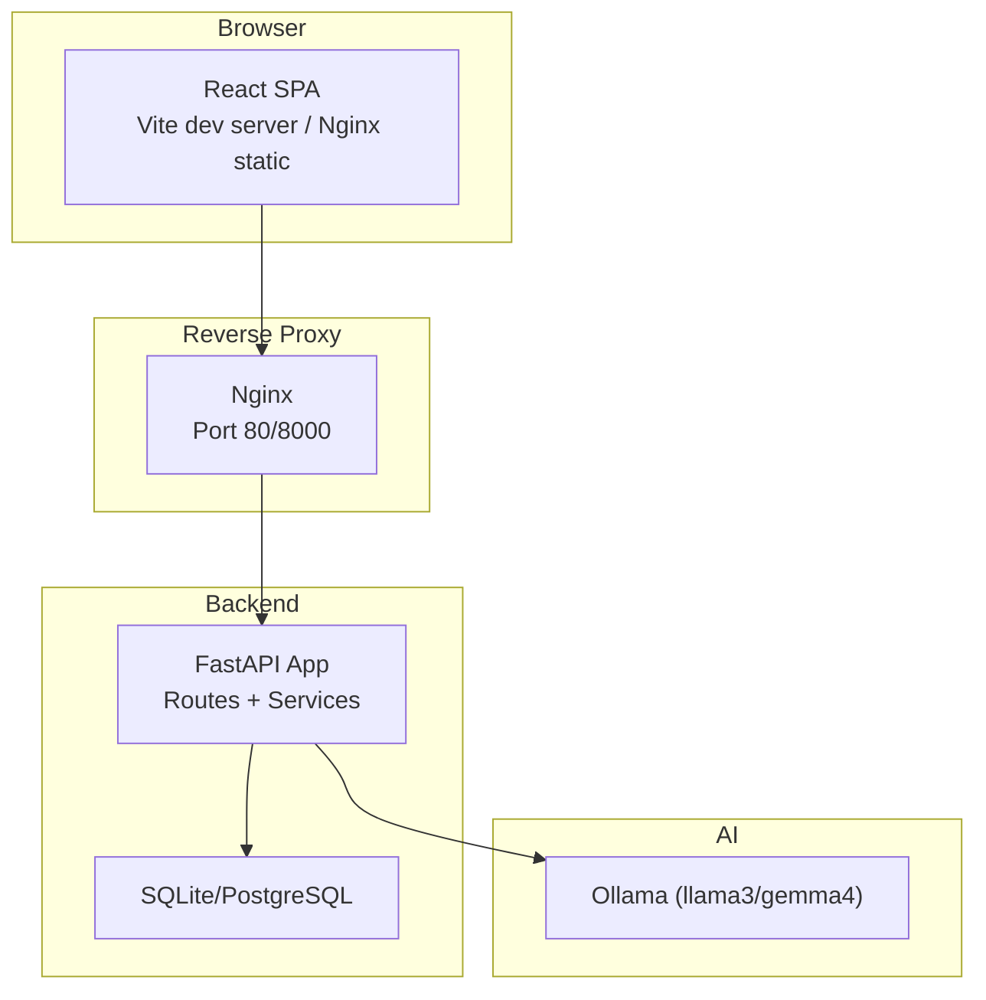
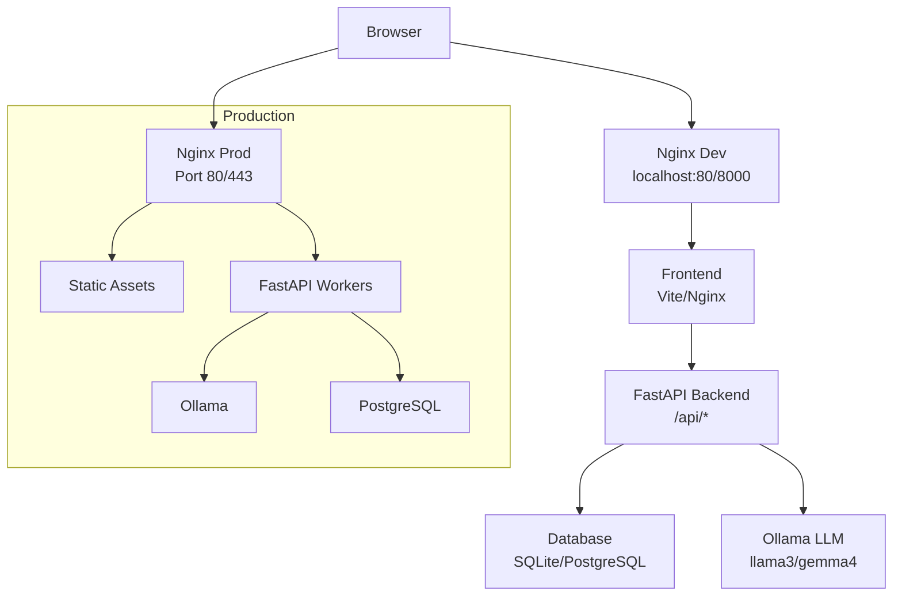
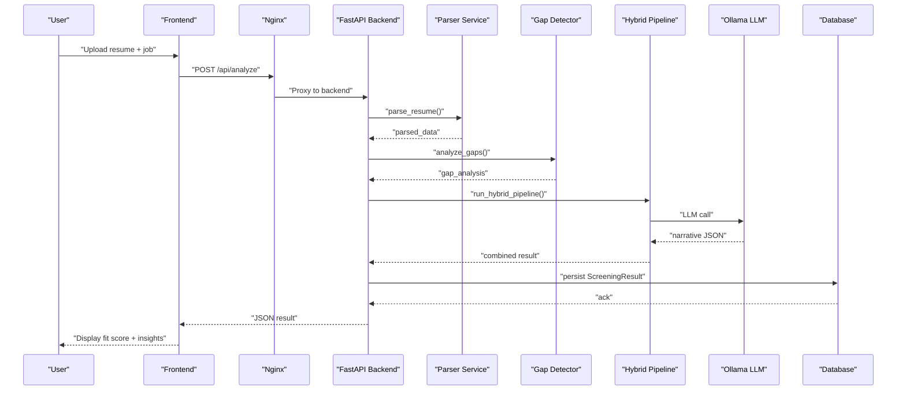
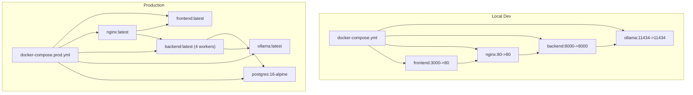
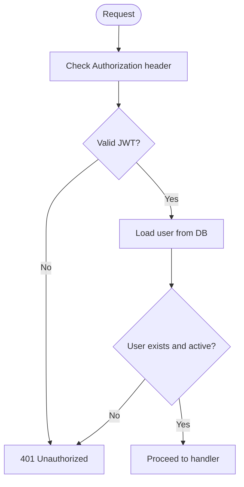
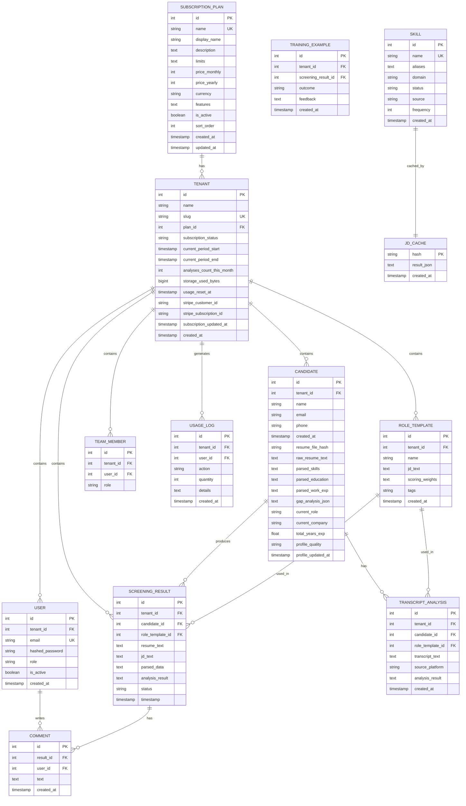
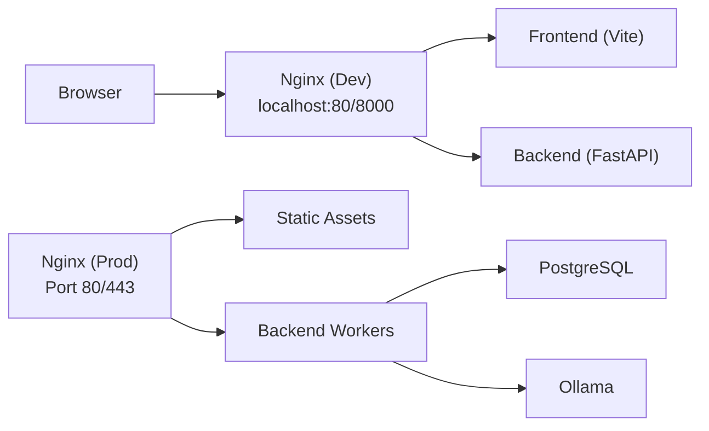
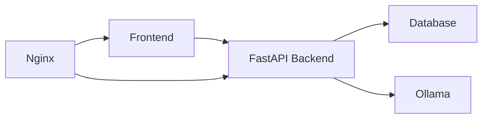

# Architecture Overview

<cite>
**Referenced Files in This Document**
- [README.md](file://README.md)
- [docker-compose.yml](file://docker-compose.yml)
- [docker-compose.prod.yml](file://docker-compose.prod.yml)
- [app/backend/main.py](file://app/backend/main.py)
- [app/backend/db/database.py](file://app/backend/db/database.py)
- [app/backend/models/db_models.py](file://app/backend/models/db_models.py)
- [app/backend/routes/analyze.py](file://app/backend/routes/analyze.py)
- [app/backend/services/analysis_service.py](file://app/backend/services/analysis_service.py)
- [app/backend/middleware/auth.py](file://app/backend/middleware/auth.py)
- [app/backend/Dockerfile](file://app/backend/Dockerfile)
- [app/frontend/src/lib/api.js](file://app/frontend/src/lib/api.js)
- [app/frontend/vite.config.js](file://app/frontend/vite.config.js)
- [app/frontend/Dockerfile](file://app/frontend/Dockerfile)
- [app/nginx/nginx.conf](file://app/nginx/nginx.conf)
</cite>

## Table of Contents
1. [Introduction](#introduction)
2. [Project Structure](#project-structure)
3. [Core Components](#core-components)
4. [Architecture Overview](#architecture-overview)
5. [Detailed Component Analysis](#detailed-component-analysis)
6. [Dependency Analysis](#dependency-analysis)
7. [Performance Considerations](#performance-considerations)
8. [Troubleshooting Guide](#troubleshooting-guide)
9. [Conclusion](#conclusion)
10. [Appendices](#appendices)

## Introduction
This document presents the architecture of Resume AI by ThetaLogics, a local-first AI-powered SaaS for recruiters. The system emphasizes privacy and offline capability by keeping sensitive data on disk and leveraging a local LLM via Ollama. It comprises:
- Browser frontend (React) served by Nginx
- FastAPI backend handling authentication, orchestration, and persistence
- Ollama AI service for LLM-driven analysis
- SQLite/PostgreSQL database for tenant-aware storage
- Docker-based microservices orchestrated via Docker Compose

The architecture supports both development and production topologies, with a reverse proxy configuration and health-checked services. It documents data flows from user uploads through parsing, scoring, and AI narrative generation to result delivery.

## Project Structure
The repository is organized into three primary layers:
- app/backend: FastAPI application, routes, services, models, and database configuration
- app/frontend: React SPA with Vite dev server and Nginx static hosting
- app/nginx: Local development Nginx configuration; production uses dedicated nginx image/container

**Diagram sources**
- [app/frontend/vite.config.js:9-14](file://app/frontend/vite.config.js#L9-L14)
- [app/nginx/nginx.conf:9-35](file://app/nginx/nginx.conf#L9-L35)
- [app/backend/main.py:174-215](file://app/backend/main.py#L174-L215)
- [app/backend/db/database.py:1-33](file://app/backend/db/database.py#L1-L33)

**Section sources**
- [README.md:273-333](file://README.md#L273-L333)
- [docker-compose.yml:1-101](file://docker-compose.yml#L1-L101)
- [docker-compose.prod.yml:1-227](file://docker-compose.prod.yml#L1-L227)

## Core Components
- Browser Frontend (React)
  - Provides upload forms, streaming analysis UI, and authenticated API interactions
  - Uses Axios for REST and native fetch for SSE streaming
- Nginx Reverse Proxy
  - Local dev: proxies frontend and backend to host services
  - Production: serves static assets and routes API traffic to backend
- FastAPI Backend
  - Authentication middleware, route handlers, and orchestration services
  - Health checks, startup diagnostics, and dependency verification
- Ollama AI Service
  - Local LLM inference for narrative analysis and structured outputs
- Database
  - SQLite for local/dev; PostgreSQL for production with tuned parameters

**Section sources**
- [app/frontend/src/lib/api.js:47-147](file://app/frontend/src/lib/api.js#L47-L147)
- [app/frontend/vite.config.js:9-14](file://app/frontend/vite.config.js#L9-L14)
- [app/nginx/nginx.conf:9-35](file://app/nginx/nginx.conf#L9-L35)
- [app/backend/main.py:68-149](file://app/backend/main.py#L68-L149)
- [app/backend/db/database.py:1-33](file://app/backend/db/database.py#L1-L33)

## Architecture Overview
The system follows a microservices architecture with Docker containers for each component. The frontend is served statically (in production) or via Vite dev server (in local dev). Nginx acts as a reverse proxy and SSL terminator in production. The backend exposes REST endpoints and SSE streams, orchestrating parsing, gap detection, and LLM-driven narrative generation. The database persists tenant-aware entities and usage logs. Ollama runs as a separate service for local LLM inference.

**Diagram sources**
- [docker-compose.yml:86-96](file://docker-compose.yml#L86-L96)
- [docker-compose.prod.yml:126-145](file://docker-compose.prod.yml#L126-L145)
- [app/backend/Dockerfile:36-38](file://app/backend/Dockerfile#L36-L38)
- [app/frontend/Dockerfile:15-25](file://app/frontend/Dockerfile#L15-L25)

## Detailed Component Analysis

### Data Flow: Upload to Analysis to Result Delivery
End-to-end flow for a single resume analysis:
1. Frontend uploads resume and optional job description/file
2. Backend validates inputs, parses resume in a thread pool, computes gaps, and caches JD
3. Hybrid pipeline executes Python-based scoring and LLM narrative
4. Results are persisted to the database and returned to the frontend
5. Optional SSE streaming emits stages for real-time UX

**Diagram sources**
- [app/frontend/src/lib/api.js:47-63](file://app/frontend/src/lib/api.js#L47-L63)
- [app/backend/routes/analyze.py:268-318](file://app/backend/routes/analyze.py#L268-L318)
- [app/backend/services/analysis_service.py:10-53](file://app/backend/services/analysis_service.py#L10-L53)
- [app/backend/main.py:228-259](file://app/backend/main.py#L228-L259)

**Section sources**
- [app/frontend/src/lib/api.js:47-147](file://app/frontend/src/lib/api.js#L47-L147)
- [app/backend/routes/analyze.py:354-501](file://app/backend/routes/analyze.py#L354-L501)
- [app/backend/services/analysis_service.py:1-121](file://app/backend/services/analysis_service.py#L1-L121)

### Microservices and Containerization
- Backend
  - Entrypoint waits for Ollama readiness and optional model warmup
  - Exposes health checks and diagnostic endpoints
- Frontend
  - Nginx static hosting in production; Vite dev server proxy in local dev
- Nginx
  - Local dev: routes to host services
  - Production: serves static assets and proxies API to backend
- Ollama
  - Configured with parallelism and memory tuning for CPU inference
- Database
  - SQLite for local; PostgreSQL for production with tuned parameters

**Diagram sources**
- [docker-compose.yml:52-96](file://docker-compose.yml#L52-L96)
- [docker-compose.prod.yml:75-145](file://docker-compose.prod.yml#L75-L145)
- [app/backend/Dockerfile:36-38](file://app/backend/Dockerfile#L36-L38)
- [app/frontend/Dockerfile:15-25](file://app/frontend/Dockerfile#L15-L25)

**Section sources**
- [docker-compose.yml:1-101](file://docker-compose.yml#L1-L101)
- [docker-compose.prod.yml:1-227](file://docker-compose.prod.yml#L1-L227)
- [app/backend/Dockerfile:1-39](file://app/backend/Dockerfile#L1-L39)
- [app/frontend/Dockerfile:1-26](file://app/frontend/Dockerfile#L1-L26)

### Authentication and Authorization
- JWT bearer tokens are validated on each request
- Admin-only endpoints are protected via a decorator
- Token refresh flow is handled in the frontend interceptor

**Diagram sources**
- [app/backend/middleware/auth.py:19-40](file://app/backend/middleware/auth.py#L19-L40)

**Section sources**
- [app/backend/middleware/auth.py:1-47](file://app/backend/middleware/auth.py#L1-L47)
- [app/frontend/src/lib/api.js:18-43](file://app/frontend/src/lib/api.js#L18-L43)

### Database Schema and Multi-Tenancy
The backend defines tenant-aware entities for subscriptions, users, candidates, screening results, transcripts, training examples, and a shared JD cache. This enables multi-tenant isolation and usage tracking.

**Diagram sources**
- [app/backend/models/db_models.py:11-250](file://app/backend/models/db_models.py#L11-L250)

**Section sources**
- [app/backend/models/db_models.py:1-250](file://app/backend/models/db_models.py#L1-L250)
- [app/backend/db/database.py:1-33](file://app/backend/db/database.py#L1-L33)

### Reverse Proxy and Service Communication
- Local development
  - Nginx forwards / to Vite dev server (host.docker.internal:5173)
  - Nginx forwards /api to backend (host.docker.internal:8000)
- Production
  - Nginx serves static assets and proxies API to backend
  - Backend runs multiple workers behind Nginx
  - Ollama warmup ensures first request latency is minimized

**Diagram sources**
- [app/nginx/nginx.conf:9-35](file://app/nginx/nginx.conf#L9-L35)
- [docker-compose.prod.yml:126-145](file://docker-compose.prod.yml#L126-L145)

**Section sources**
- [app/nginx/nginx.conf:1-37](file://app/nginx/nginx.conf#L1-L37)
- [docker-compose.yml:86-96](file://docker-compose.yml#L86-L96)
- [docker-compose.prod.yml:126-145](file://docker-compose.prod.yml#L126-L145)

## Dependency Analysis
- Backend depends on:
  - SQLAlchemy for ORM and sessions
  - httpx for asynchronous Ollama API calls
  - Routes and services for orchestration
- Frontend depends on:
  - Axios for REST
  - Native fetch for SSE
  - Vite proxy for local development
- Infrastructure:
  - Docker Compose for local dev
  - Production Compose for orchestrated deployment

**Diagram sources**
- [app/backend/main.py:8-21](file://app/backend/main.py#L8-L21)
- [app/frontend/src/lib/api.js:1-16](file://app/frontend/src/lib/api.js#L1-L16)
- [docker-compose.yml:52-96](file://docker-compose.yml#L52-L96)

**Section sources**
- [app/backend/main.py:1-327](file://app/backend/main.py#L1-L327)
- [app/frontend/src/lib/api.js:1-395](file://app/frontend/src/lib/api.js#L1-L395)
- [docker-compose.yml:1-101](file://docker-compose.yml#L1-L101)

## Performance Considerations
- Concurrency and Parallelism
  - Backend uses multiple workers in production to handle concurrent requests without starving Ollama
  - Ollama configured with parallel slots and flash attention for improved throughput
- I/O-bound Design
  - Parsing and LLM calls are offloaded to threads and async clients to avoid blocking the event loop
- Caching and Deduplication
  - JD parsing is cached per hash across workers
  - Candidate deduplication prevents redundant processing
- Storage
  - SQLite for local simplicity; PostgreSQL for production with tuned memory and connection parameters
- Streaming
  - SSE endpoints provide progressive UI updates during analysis

[No sources needed since this section provides general guidance]

## Troubleshooting Guide
Common operational issues and remedies:
- Ollama not reachable or model not loaded
  - Verify health endpoints and model lists
  - Warmup container ensures models are loaded in production
- Database locked errors
  - SQLite does not support concurrent writes; restart backend container if locked
- SSL certificate renewal
  - Renew certificates and restart Nginx in production
- Deployment failures
  - Check GitHub Actions logs for Docker Hub token, SSH keys, and firewall issues

**Section sources**
- [app/backend/main.py:228-326](file://app/backend/main.py#L228-L326)
- [docker-compose.prod.yml:151-184](file://docker-compose.prod.yml#L151-L184)
- [README.md:337-375](file://README.md#L337-L375)

## Conclusion
Resume AI employs a pragmatic microservices architecture with Docker, a reverse proxy, and a local LLM to deliver a privacy-focused, offline-capable solution. The backend’s hybrid pipeline combines deterministic scoring with LLM narrative generation, while the frontend provides responsive UX with streaming updates. Production-grade configurations emphasize reliability, scalability, and observability.

[No sources needed since this section summarizes without analyzing specific files]

## Appendices

### Deployment Topology
- Development
  - docker-compose.yml defines services for frontend, backend, Nginx, Ollama, and Postgres
  - Local Nginx proxies to host services for seamless dev experience
- Production
  - docker-compose.prod.yml orchestrates multi-worker backend, static frontend, Nginx, Postgres, Ollama, and Watchtower for auto-updates
  - Ollama warmup ensures cold-start mitigation

**Section sources**
- [docker-compose.yml:1-101](file://docker-compose.yml#L1-L101)
- [docker-compose.prod.yml:1-227](file://docker-compose.prod.yml#L1-L227)