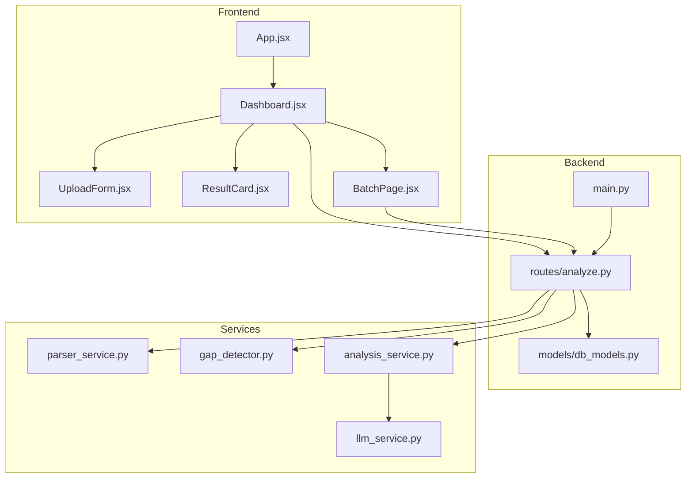
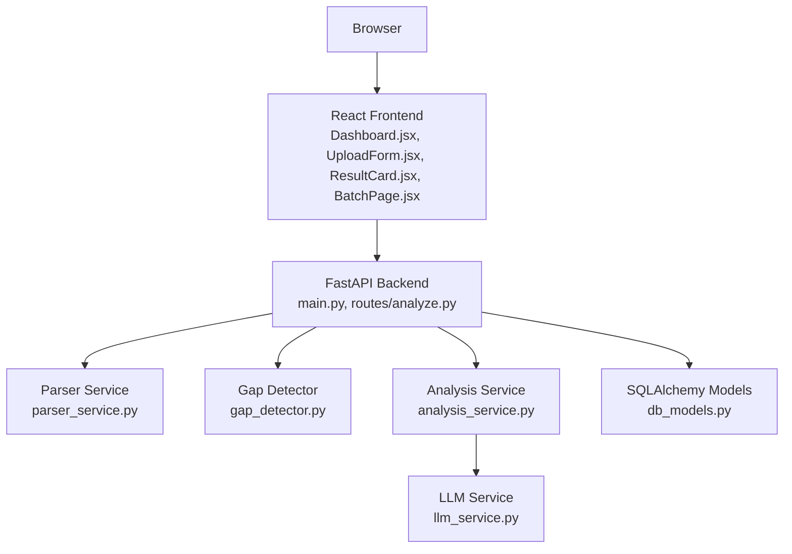
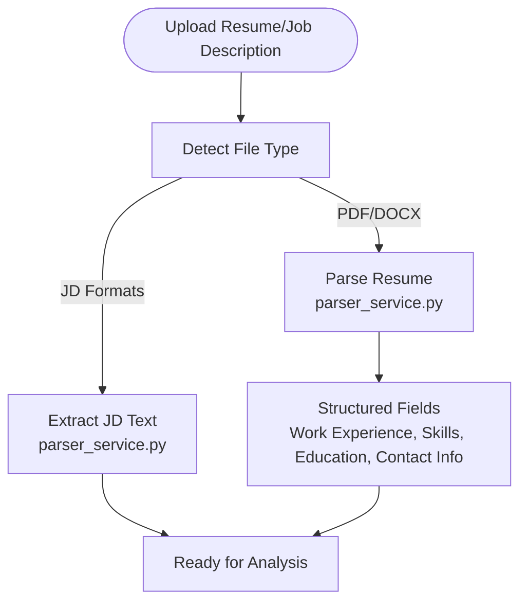
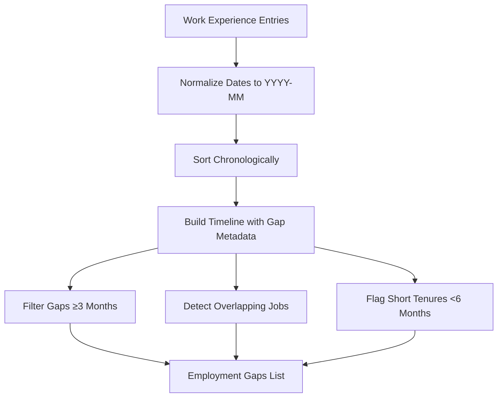
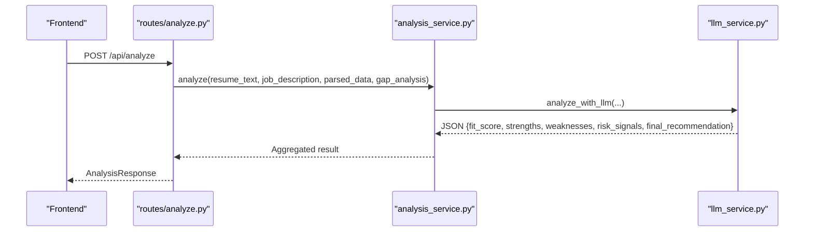
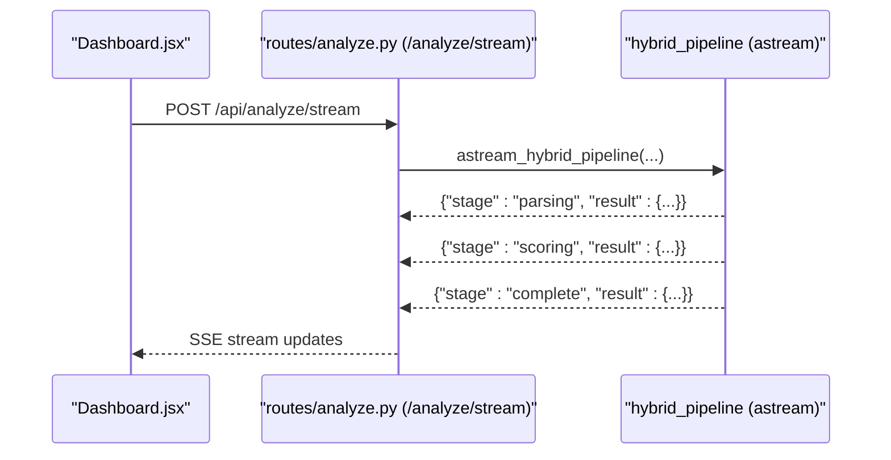
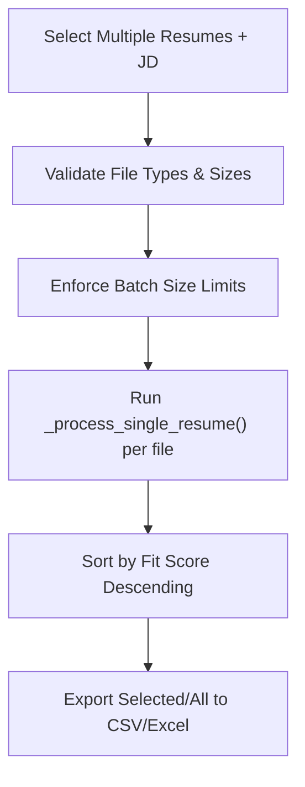
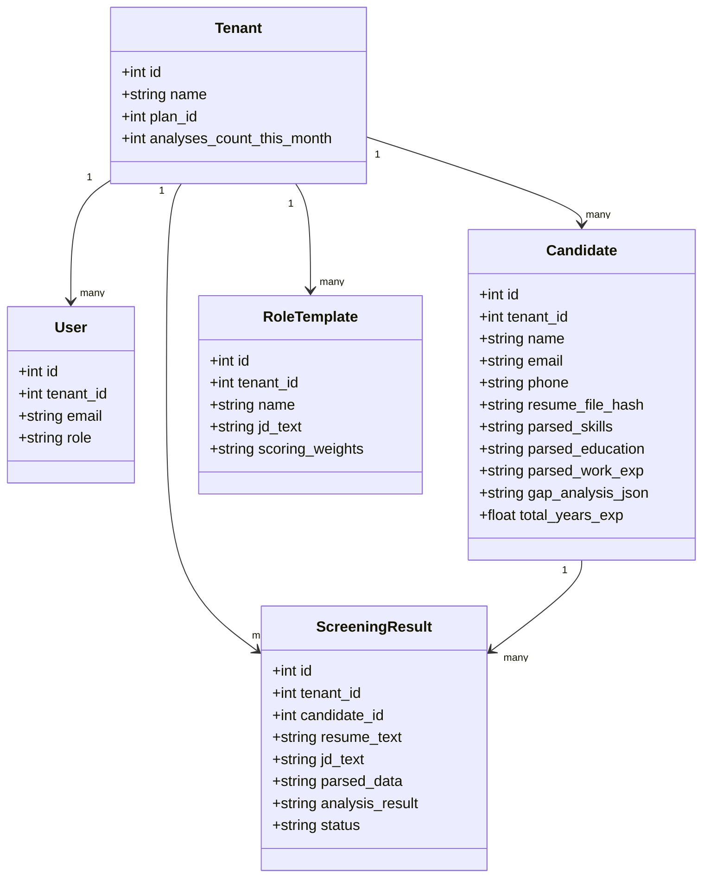
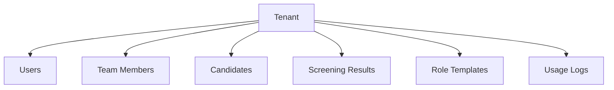
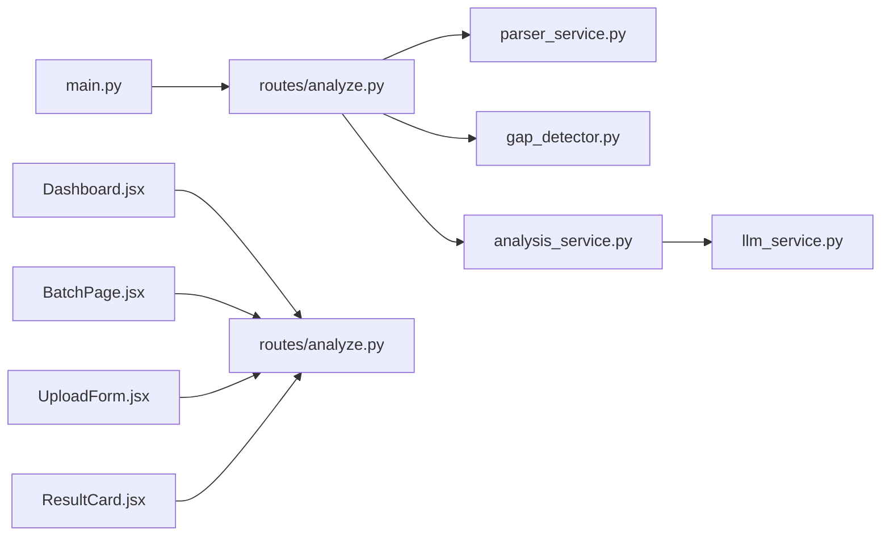

# Feature Showcase

<cite>
**Referenced Files in This Document**
- [README.md](file://README.md)
- [main.py](file://app/backend/main.py)
- [analyze.py](file://app/backend/routes/analyze.py)
- [parser_service.py](file://app/backend/services/parser_service.py)
- [gap_detector.py](file://app/backend/services/gap_detector.py)
- [analysis_service.py](file://app/backend/services/analysis_service.py)
- [llm_service.py](file://app/backend/services/llm_service.py)
- [db_models.py](file://app/backend/models/db_models.py)
- [App.jsx](file://app/frontend/src/App.jsx)
- [Dashboard.jsx](file://app/frontend/src/pages/Dashboard.jsx)
- [UploadForm.jsx](file://app/frontend/src/components/UploadForm.jsx)
- [ResultCard.jsx](file://app/frontend/src/components/ResultCard.jsx)
- [BatchPage.jsx](file://app/frontend/src/pages/BatchPage.jsx)
</cite>

## Table of Contents
1. [Introduction](#introduction)
2. [Project Structure](#project-structure)
3. [Core Components](#core-components)
4. [Architecture Overview](#architecture-overview)
5. [Detailed Component Analysis](#detailed-component-analysis)
6. [Dependency Analysis](#dependency-analysis)
7. [Performance Considerations](#performance-considerations)
8. [Troubleshooting Guide](#troubleshooting-guide)
9. [Conclusion](#conclusion)
10. [Appendices](#appendices)

## Introduction
Resume AI by ThetaLogics is a local-first AI-powered SaaS solution designed to screen resumes against job descriptions using an on-premises LLM (Ollama). It offers a complete pipeline from resume parsing to real-time analysis with streaming responses, candidate management, and multi-tenant collaboration. This document showcases the platform’s core features and how they improve recruitment decision-making.

## Project Structure
The system follows a clean separation of concerns:
- Backend: FastAPI application exposing REST endpoints for analysis, batch processing, history, and team collaboration.
- Frontend: React SPA with routing, protected routes, and real-time progress visualization.
- Services: Parser, gap detection, LLM orchestration, and hybrid pipeline orchestration.
- Persistence: SQLAlchemy models supporting multi-tenancy, usage tracking, templates, and screening results.

**Diagram sources**
- [main.py:174-215](file://app/backend/main.py#L174-L215)
- [analyze.py:41-215](file://app/backend/routes/analyze.py#L41-L215)
- [parser_service.py:130-552](file://app/backend/services/parser_service.py#L130-L552)
- [gap_detector.py:103-219](file://app/backend/services/gap_detector.py#L103-L219)
- [analysis_service.py:6-121](file://app/backend/services/analysis_service.py#L6-L121)
- [llm_service.py:7-156](file://app/backend/services/llm_service.py#L7-L156)
- [db_models.py:9-250](file://app/backend/models/db_models.py#L9-L250)
- [App.jsx:39-64](file://app/frontend/src/App.jsx#L39-L64)
- [Dashboard.jsx:204-330](file://app/frontend/src/pages/Dashboard.jsx#L204-L330)
- [UploadForm.jsx:77-484](file://app/frontend/src/components/UploadForm.jsx#L77-L484)
- [ResultCard.jsx:265-627](file://app/frontend/src/components/ResultCard.jsx#L265-L627)
- [BatchPage.jsx:27-431](file://app/frontend/src/pages/BatchPage.jsx#L27-L431)

**Section sources**
- [README.md:273-333](file://README.md#L273-L333)
- [main.py:174-215](file://app/backend/main.py#L174-L215)
- [App.jsx:39-64](file://app/frontend/src/App.jsx#L39-L64)

## Core Components
- Resume parsing supports PDF and DOCX with robust fallbacks and text extraction. It also parses job descriptions from multiple formats.
- Gap detection computes employment timelines, identifies gaps, overlaps, and short tenures.
- Analysis service orchestrates skill matching, risk signal preparation, and LLM-driven narrative generation.
- Real-time streaming endpoints deliver progressive insights during analysis.
- Batch processing enables high-throughput screening with ranked results.
- Multi-tenant architecture with usage quotas, templates, and team collaboration.

**Section sources**
- [README.md:9-21](file://README.md#L9-L21)
- [parser_service.py:130-552](file://app/backend/services/parser_service.py#L130-L552)
- [gap_detector.py:103-219](file://app/backend/services/gap_detector.py#L103-L219)
- [analysis_service.py:6-121](file://app/backend/services/analysis_service.py#L6-L121)
- [llm_service.py:7-156](file://app/backend/services/llm_service.py#L7-L156)
- [analyze.py:506-647](file://app/backend/routes/analyze.py#L506-L647)
- [analyze.py:649-758](file://app/backend/routes/analyze.py#L649-L758)
- [db_models.py:9-250](file://app/backend/models/db_models.py#L9-L250)

## Architecture Overview
The backend exposes REST endpoints, integrates with Ollama for LLM inference, and persists structured results and candidate profiles. The frontend provides interactive dashboards with real-time progress and reporting.

**Diagram sources**
- [main.py:174-215](file://app/backend/main.py#L174-L215)
- [analyze.py:41-215](file://app/backend/routes/analyze.py#L41-L215)
- [parser_service.py:130-552](file://app/backend/services/parser_service.py#L130-L552)
- [gap_detector.py:103-219](file://app/backend/services/gap_detector.py#L103-L219)
- [analysis_service.py:6-121](file://app/backend/services/analysis_service.py#L6-L121)
- [llm_service.py:7-156](file://app/backend/services/llm_service.py#L7-L156)
- [db_models.py:9-250](file://app/backend/models/db_models.py#L9-L250)

## Detailed Component Analysis

### Resume Parsing (PDF/DOCX/Job Description)
- Parses resumes from PDF and DOCX, normalizes text, and extracts structured fields (work experience, skills, education, contact info).
- Extracts job descriptions from multiple formats (PDF, DOCX, DOC, TXT, RTF, HTML, ODT).
- Raises actionable errors for unsupported or unreadable files.

**Diagram sources**
- [parser_service.py:130-552](file://app/backend/services/parser_service.py#L130-L552)
- [analyze.py:268-318](file://app/backend/routes/analyze.py#L268-L318)

**Section sources**
- [parser_service.py:130-552](file://app/backend/services/parser_service.py#L130-L552)
- [analyze.py:268-318](file://app/backend/routes/analyze.py#L268-L318)

### Employment Gap Detection
- Converts dates to normalized YYYY-MM format, merges overlapping intervals, and computes total experience.
- Identifies gaps ≥3 months, overlapping jobs, and short tenures (<6 months).
- Produces a structured timeline for downstream analysis.

**Diagram sources**
- [gap_detector.py:103-219](file://app/backend/services/gap_detector.py#L103-L219)

**Section sources**
- [gap_detector.py:103-219](file://app/backend/services/gap_detector.py#L103-L219)

### Analysis Engine (Fit Scoring, Strengths/Weaknesses, Risk Signals, Recommendations)
- Computes skill match percentage against the job description.
- Prepares risk signals from gap analysis (overlapping jobs, short stints).
- Calls LLM to generate fit score (0–100), strengths, weaknesses, education analysis, risk signals, and final recommendation.

**Diagram sources**
- [analyze.py:354-501](file://app/backend/routes/analyze.py#L354-L501)
- [analysis_service.py:10-53](file://app/backend/services/analysis_service.py#L10-L53)
- [llm_service.py:13-42](file://app/backend/services/llm_service.py#L13-L42)

**Section sources**
- [analysis_service.py:6-121](file://app/backend/services/analysis_service.py#L6-L121)
- [llm_service.py:7-156](file://app/backend/services/llm_service.py#L7-L156)
- [README.md:11-21](file://README.md#L11-L21)

### Real-Time Analysis with Streaming Responses
- SSE endpoint emits parsing, scoring, and completion stages with live updates.
- Progress UI reflects stage transitions and highlights agent groups.

**Diagram sources**
- [Dashboard.jsx:204-330](file://app/frontend/src/pages/Dashboard.jsx#L204-L330)
- [analyze.py:506-647](file://app/backend/routes/analyze.py#L506-L647)

**Section sources**
- [Dashboard.jsx:204-330](file://app/frontend/src/pages/Dashboard.jsx#L204-L330)
- [analyze.py:506-647](file://app/backend/routes/analyze.py#L506-L647)

### Batch Processing and Ranking
- Uploads multiple resumes and screens them against a single job description.
- Returns ranked results with fit scores and recommendations.
- Supports exporting selected or all results to CSV/Excel.

**Diagram sources**
- [BatchPage.jsx:27-431](file://app/frontend/src/pages/BatchPage.jsx#L27-L431)
- [analyze.py:649-758](file://app/backend/routes/analyze.py#L649-L758)

**Section sources**
- [BatchPage.jsx:27-431](file://app/frontend/src/pages/BatchPage.jsx#L27-L431)
- [analyze.py:649-758](file://app/backend/routes/analyze.py#L649-L758)

### Candidate Management and Templates
- Deduplicates candidates across email, file hash, and name+phone.
- Stores enriched profiles (skills, education, work exp, gap analysis) for reuse.
- Provides role templates with saved JDs and scoring weights.

**Diagram sources**
- [db_models.py:31-250](file://app/backend/models/db_models.py#L31-L250)

**Section sources**
- [db_models.py:95-165](file://app/backend/models/db_models.py#L95-L165)
- [analyze.py:147-215](file://app/backend/routes/analyze.py#L147-L215)

### Multi-Tenant Architecture and Team Collaboration
- Tenants own users, candidates, results, templates, and team members.
- Usage logs track monthly analysis counts and enforce limits.
- Team members collaborate via shared results and comments.

**Diagram sources**
- [db_models.py:31-93](file://app/backend/models/db_models.py#L31-L93)

**Section sources**
- [db_models.py:31-93](file://app/backend/models/db_models.py#L31-L93)

## Dependency Analysis
- Backend entrypoint registers routers and middleware, enabling CORS and health checks.
- Routes depend on parser, gap detector, analysis service, and LLM service.
- Frontend components depend on API endpoints and subscription hooks for usage enforcement.

**Diagram sources**
- [main.py:174-215](file://app/backend/main.py#L174-L215)
- [analyze.py:41-215](file://app/backend/routes/analyze.py#L41-L215)
- [parser_service.py:130-552](file://app/backend/services/parser_service.py#L130-L552)
- [gap_detector.py:103-219](file://app/backend/services/gap_detector.py#L103-L219)
- [analysis_service.py:6-121](file://app/backend/services/analysis_service.py#L6-L121)
- [llm_service.py:7-156](file://app/backend/services/llm_service.py#L7-L156)
- [Dashboard.jsx:204-330](file://app/frontend/src/pages/Dashboard.jsx#L204-L330)
- [BatchPage.jsx:27-431](file://app/frontend/src/pages/BatchPage.jsx#L27-L431)
- [UploadForm.jsx:77-484](file://app/frontend/src/components/UploadForm.jsx#L77-L484)
- [ResultCard.jsx:265-627](file://app/frontend/src/components/ResultCard.jsx#L265-L627)

**Section sources**
- [main.py:174-215](file://app/backend/main.py#L174-L215)
- [analyze.py:41-215](file://app/backend/routes/analyze.py#L41-L215)

## Performance Considerations
- Asynchronous parsing prevents blocking the event loop for large PDFs.
- Thread pool execution offloads blocking I/O to separate threads.
- JD caching reduces repeated parsing overhead across workers.
- Streaming responses provide immediate feedback and reduce perceived latency.
- Batch processing leverages concurrency for throughput.

[No sources needed since this section provides general guidance]

## Troubleshooting Guide
- Ollama not reachable: Verify service availability and model readiness; use diagnostic endpoint to inspect model status.
- Database locked errors: Restart backend container to release locks.
- SSL certificate issues: Renew certificates and restart Nginx.
- Deployment failures: Review CI/CD logs for Docker Hub token, SSH keys, and firewall configurations.

**Section sources**
- [README.md:337-375](file://README.md#L337-L375)
- [main.py:262-327](file://app/backend/main.py#L262-L327)

## Conclusion
Resume AI by ThetaLogics delivers a comprehensive, on-prem AI screening solution with real-time insights, robust parsing, intelligent gap detection, and scalable multi-tenancy. Its streaming analysis, batch capabilities, and candidate management streamline recruitment workflows and enhance decision-making.

[No sources needed since this section summarizes without analyzing specific files]

## Appendices

### Practical Examples and Interpretation
- Fit scoring (0–100): Use the score as a quick comparator; combine with strengths/weaknesses and risk signals for nuanced decisions.
- Strengths and weaknesses: Focus on domain alignment and soft skills highlighted in narratives.
- Employment gaps: Evaluate gap severity and context; short gaps may be acceptable depending on role needs.
- Education analysis: Align degrees and timelines with role requirements; consider field alignment.
- Risk signals: Investigate overlapping jobs and frequent job hopping; corroborate with interviews.
- Recommendations: Treat “Shortlist” as ready for deeper evaluation; “Consider” for further vetting; “Reject” for clear mismatches.

[No sources needed since this section provides general guidance]

### Screenshots and Code References
- Dashboard with streaming progress: [Dashboard.jsx:204-330](file://app/frontend/src/pages/Dashboard.jsx#L204-L330)
- Upload form with JD modes and templates: [UploadForm.jsx:77-484](file://app/frontend/src/components/UploadForm.jsx#L77-L484)
- Batch results ranking and exports: [BatchPage.jsx:27-431](file://app/frontend/src/pages/BatchPage.jsx#L27-L431)
- Analysis result presentation: [ResultCard.jsx:265-627](file://app/frontend/src/components/ResultCard.jsx#L265-L627)
- Streaming endpoint implementation: [analyze.py:506-647](file://app/backend/routes/analyze.py#L506-L647)
- Non-streaming analysis endpoint: [analyze.py:354-501](file://app/backend/routes/analyze.py#L354-L501)