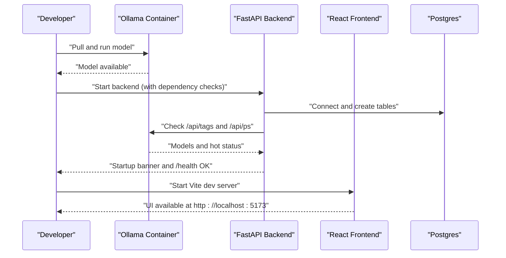
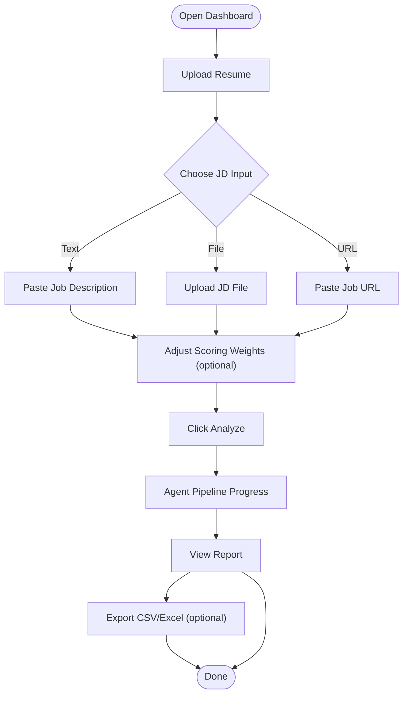
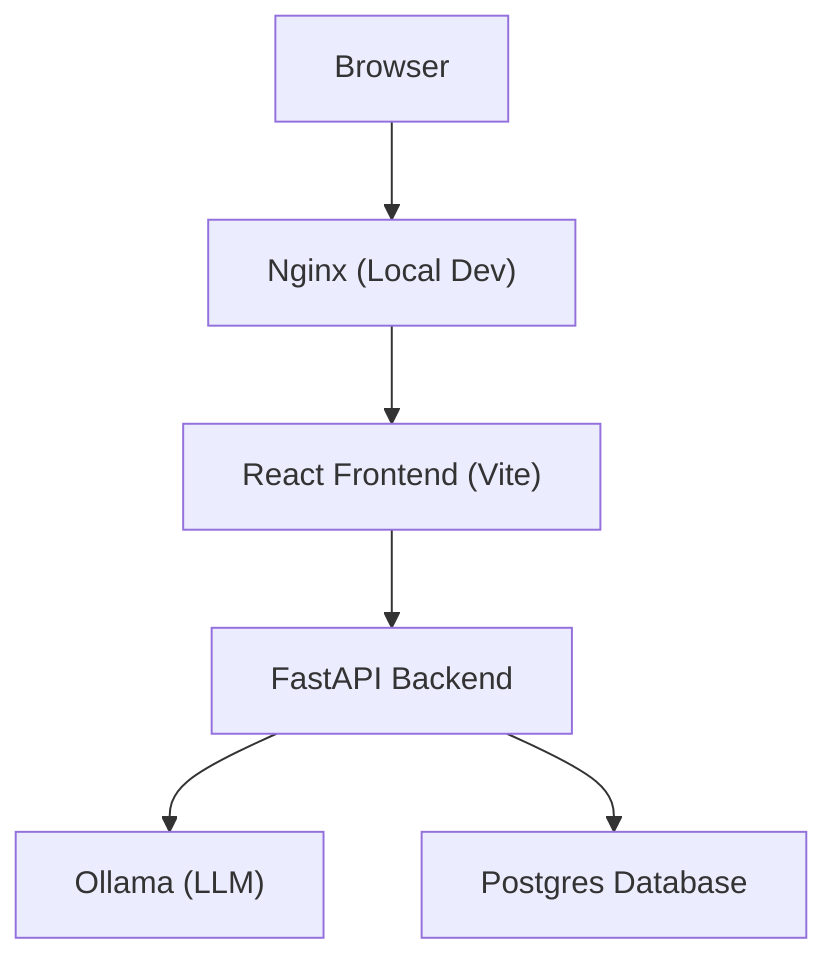

# Getting Started

<cite>
**Referenced Files in This Document**
- [README.md](file://README.md)
- [requirements.txt](file://requirements.txt)
- [docker-compose.yml](file://docker-compose.yml)
- [docker-compose.prod.yml](file://docker-compose.prod.yml)
- [app/backend/Dockerfile](file://app/backend/Dockerfile)
- [app/frontend/Dockerfile](file://app/frontend/Dockerfile)
- [app/backend/main.py](file://app/backend/main.py)
- [app/backend/scripts/docker-entrypoint.sh](file://app/backend/scripts/docker-entrypoint.sh)
- [app/backend/scripts/wait_for_ollama.py](file://app/backend/scripts/wait_for_ollama.py)
- [app/frontend/vite.config.js](file://app/frontend/vite.config.js)
- [app/frontend/package.json](file://app/frontend/package.json)
- [app/frontend/src/lib/api.js](file://app/frontend/src/lib/api.js)
- [app/frontend/src/components/UploadForm.jsx](file://app/frontend/src/components/UploadForm.jsx)
- [app/frontend/src/pages/Dashboard.jsx](file://app/frontend/src/pages/Dashboard.jsx)
- [app/nginx/nginx.conf](file://app/nginx/nginx.conf)
- [scripts/README.md](file://scripts/README.md)
</cite>

## Table of Contents
1. [Introduction](#introduction)
2. [Prerequisites](#prerequisites)
3. [Local Development Setup](#local-development-setup)
4. [Docker-Based Local Development](#docker-based-local-development)
5. [Production Deployment Overview](#production-deployment-overview)
6. [Workflow: From Ollama to Running Application](#workflow-from-ollama-to-running-application)
7. [Using the Application](#using-the-application)
8. [Architecture Overview](#architecture-overview)
9. [Troubleshooting Guide](#troubleshooting-guide)
10. [Conclusion](#conclusion)

## Introduction
Welcome to Resume AI by ThetaLogics. This guide helps you get the platform running locally, understand the workflow from Ollama model setup to a fully functional app, and prepare for production deployment. You will learn how to set up prerequisites, choose between manual and Docker-based development, interpret analysis results, and troubleshoot common issues.

## Prerequisites
- Python 3.11+
- Node.js 20+
- Ollama (install from https://ollama.com)

These versions and tools are required for both manual and Docker-based setups.

**Section sources**
- [README.md:56-65](file://README.md#L56-L65)
- [requirements.txt:1-10](file://requirements.txt#L1-L10)

## Local Development Setup
Follow these steps to run the backend and frontend locally:

1) Start Ollama
- Pull and start the model as described in the repository’s local development section.
- Confirm Ollama is reachable on the default port.

2) Backend setup
- Create and activate a Python virtual environment.
- Install dependencies from the requirements file.
- Navigate to the backend directory and run the FastAPI server with hot reload on port 8000.

3) Frontend setup
- Navigate to the frontend directory.
- Install Node.js dependencies.
- Start the Vite development server.

4) Access the app
- Frontend: http://localhost:5173
- Backend API: http://localhost:8000
- API docs: http://localhost:8000/docs

Notes:
- The backend prints a startup banner and performs dependency checks for database, skills registry, and Ollama.
- CORS is configured for local development origins.

**Section sources**
- [README.md:61-91](file://README.md#L61-L91)
- [app/backend/main.py:68-149](file://app/backend/main.py#L68-L149)
- [app/backend/main.py:181-198](file://app/backend/main.py#L181-L198)

## Docker-Based Local Development
Use Docker Compose to run all services together:

- Build and start the stack with the provided compose file.
- After the stack is up, pull the model into the Ollama container.

Access the app at http://localhost.

Key services:
- Postgres database
- Ollama with configurable environment variables
- Backend service with health checks and dependency gating
- Frontend service built with Nginx
- Nginx reverse proxy for local development

**Section sources**
- [README.md:95-107](file://README.md#L95-L107)
- [docker-compose.yml:5-101](file://docker-compose.yml#L5-L101)
- [app/backend/Dockerfile:1-39](file://app/backend/Dockerfile#L1-L39)
- [app/frontend/Dockerfile:1-26](file://app/frontend/Dockerfile#L1-L26)
- [app/nginx/nginx.conf:1-37](file://app/nginx/nginx.conf#L1-L37)

## Production Deployment Overview
The repository includes a production compose file tailored for a VPS with resource limits, health checks, and automated updates via Watchtower. It also defines a warmup job to preload models into RAM for immediate responsiveness.

Highlights:
- Postgres tuned for production
- Ollama configured for CPU inference with parallelism and flash attention
- Backend with multiple workers and strict health checks
- Nginx proxy with health checks
- Watchtower for automatic image updates
- Certbot volume for SSL certificates

**Section sources**
- [docker-compose.prod.yml:1-227](file://docker-compose.prod.yml#L1-L227)

## Workflow: From Ollama to Running Application
This sequence illustrates the end-to-end flow from model availability to serving requests.

**Diagram sources**
- [app/backend/main.py:68-149](file://app/backend/main.py#L68-L149)
- [app/backend/main.py:228-259](file://app/backend/main.py#L228-L259)
- [docker-compose.yml:52-75](file://docker-compose.yml#L52-L75)

## Using the Application
Once the app is running, use the dashboard to analyze candidates:

- Upload a resume (PDF/DOCX)
- Provide a job description via text, file, or URL
- Optionally adjust scoring weights
- Start analysis and observe agent stages progress
- Review the generated report with fit score, strengths, weaknesses, gaps, education analysis, risk signals, and recommendation

Practical example flow:
- Upload a resume file
- Paste a job description or upload a job file
- Click “Analyze Resume”
- Observe agent progress panels
- View the final report and export options

**Diagram sources**
- [app/frontend/src/pages/Dashboard.jsx:243-275](file://app/frontend/src/pages/Dashboard.jsx#L243-L275)
- [app/frontend/src/components/UploadForm.jsx:137-194](file://app/frontend/src/components/UploadForm.jsx#L137-L194)
- [app/frontend/src/lib/api.js:47-63](file://app/frontend/src/lib/api.js#L47-L63)

**Section sources**
- [README.md:11-21](file://README.md#L11-L21)
- [app/frontend/src/pages/Dashboard.jsx:161-330](file://app/frontend/src/pages/Dashboard.jsx#L161-L330)
- [app/frontend/src/components/UploadForm.jsx:1-484](file://app/frontend/src/components/UploadForm.jsx#L1-L484)
- [app/frontend/src/lib/api.js:168-194](file://app/frontend/src/lib/api.js#L168-L194)

## Architecture Overview
The system consists of a React frontend, a FastAPI backend, a Postgres database, and an Ollama service. Nginx proxies traffic in both local and production environments.

**Diagram sources**
- [README.md:231-251](file://README.md#L231-L251)
- [app/nginx/nginx.conf:5-36](file://app/nginx/nginx.conf#L5-L36)
- [docker-compose.yml:52-96](file://docker-compose.yml#L52-L96)

## Troubleshooting Guide
Common issues and resolutions:

- Ollama not responding
  - Check container logs and ensure the model is pulled.
  - Verify the backend can reach Ollama via the configured base URL.

- Database locked errors
  - SQLite doesn’t support concurrent writes. Restart the backend container if you encounter a “database is locked” error.

- SSL certificate issues
  - Renew certificates manually on the VPS and restart the Nginx container.

- Deploy not working
  - Review GitHub Actions logs for failures related to Docker Hub credentials, SSH keys, or firewall restrictions.

- Docker permissions
  - Ensure your user is part of the Docker group on Linux systems.

- Startup gating and warm-up
  - The backend entrypoint applies migrations and waits for Ollama readiness and model warm-up before starting the server.

**Section sources**
- [README.md:337-362](file://README.md#L337-L362)
- [app/backend/scripts/docker-entrypoint.sh:1-20](file://app/backend/scripts/docker-entrypoint.sh#L1-L20)
- [app/backend/scripts/wait_for_ollama.py:34-91](file://app/backend/scripts/wait_for_ollama.py#L34-L91)

## Conclusion
You now have the essentials to set up Resume AI locally, run the application, and understand how the system integrates Ollama, FastAPI, and React. For production, use the provided compose file and follow the deployment steps to configure resources, SSL, and automated updates. If you encounter issues, consult the troubleshooting section and leverage the health checks and diagnostic endpoints exposed by the backend.