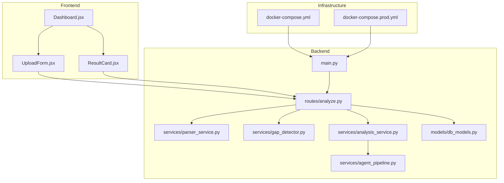
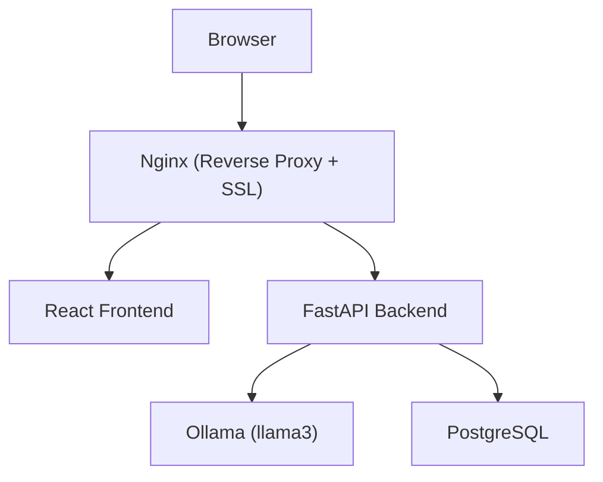
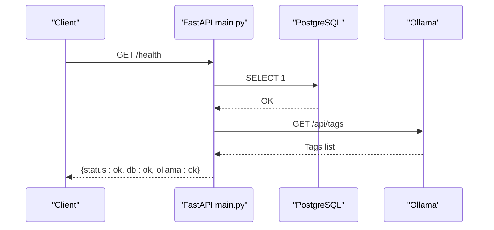
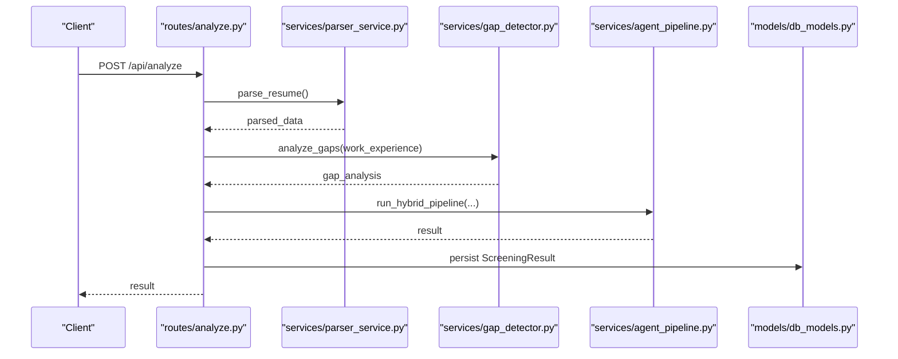
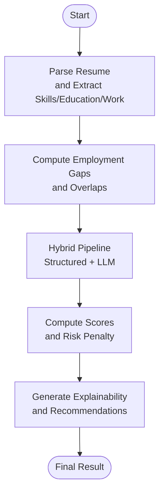
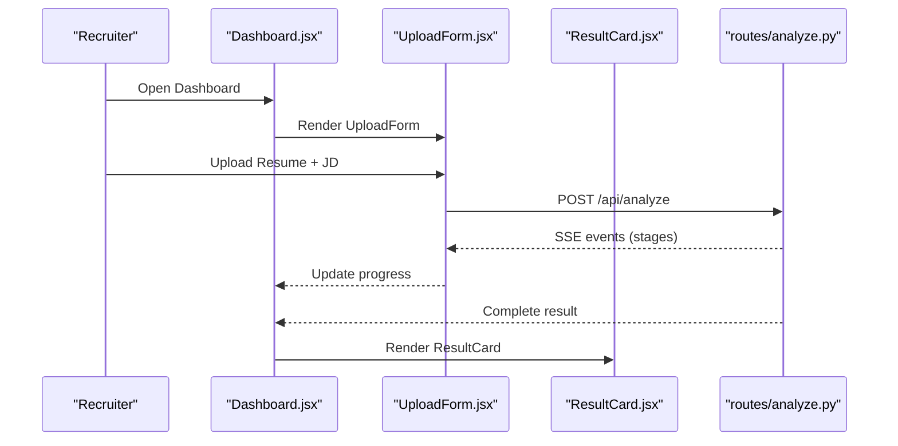
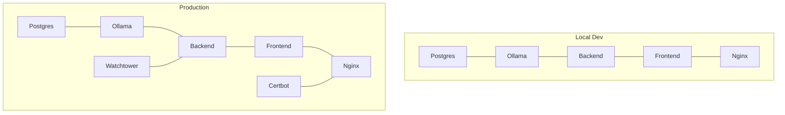
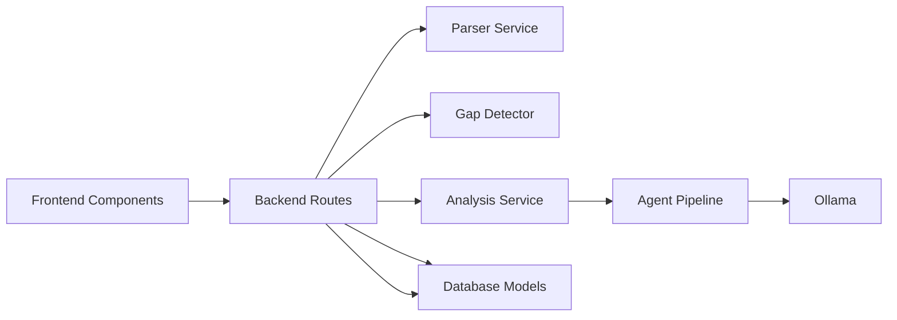

# Project Overview

<cite>
**Referenced Files in This Document**
- [README.md](file://README.md)
- [main.py](file://app/backend/main.py)
- [analyze.py](file://app/backend/routes/analyze.py)
- [agent_pipeline.py](file://app/backend/services/agent_pipeline.py)
- [analysis_service.py](file://app/backend/services/analysis_service.py)
- [gap_detector.py](file://app/backend/services/gap_detector.py)
- [parser_service.py](file://app/backend/services/parser_service.py)
- [db_models.py](file://app/backend/models/db_models.py)
- [docker-compose.yml](file://docker-compose.yml)
- [docker-compose.prod.yml](file://docker-compose.prod.yml)
- [Dashboard.jsx](file://app/frontend/src/pages/Dashboard.jsx)
- [UploadForm.jsx](file://app/frontend/src/components/UploadForm.jsx)
- [ResultCard.jsx](file://app/frontend/src/components/ResultCard.jsx)
</cite>

## Table of Contents
1. [Introduction](#introduction)
2. [Project Structure](#project-structure)
3. [Core Components](#core-components)
4. [Architecture Overview](#architecture-overview)
5. [Detailed Component Analysis](#detailed-component-analysis)
6. [Dependency Analysis](#dependency-analysis)
7. [Performance Considerations](#performance-considerations)
8. [Troubleshooting Guide](#troubleshooting-guide)
9. [Conclusion](#conclusion)

## Introduction
ARIA — AI Resume Intelligence by ThetaLogics is a local-first AI-powered SaaS designed to transform how recruiters screen resumes. Built with a modern stack and a focus on privacy and performance, ARIA enables rapid, repeatable analysis of candidates against job descriptions using Ollama (llama3). The platform offers a comprehensive suite of AI-driven insights: fit scores, strengths/weaknesses, employment gap detection, education analysis, risk signal identification, and final recommendations. It supports both single and batch analysis, integrates with a multi-tenant subscription system, and provides a responsive React frontend with live progress indicators.

ARIA’s core value proposition is to reduce manual effort, improve consistency, and accelerate hiring decisions while keeping sensitive data on-premises. Its hybrid pipeline combines structured parsing and objective calculations with a narrative-driven LLM to deliver both quantitative scores and qualitative explanations.

## Project Structure
The repository is organized into a backend (FastAPI), a React frontend, and infrastructure assets for local and production deployments. The backend encapsulates parsing, gap detection, analysis orchestration, and persistence. The frontend provides an intuitive dashboard for uploading resumes and job descriptions, configuring scoring weights, and reviewing results with explainability and interview kits.

**Diagram sources**
- [docker-compose.yml:1-101](file://docker-compose.yml#L1-L101)
- [docker-compose.prod.yml:1-227](file://docker-compose.prod.yml#L1-L227)
- [main.py:174-215](file://app/backend/main.py#L174-L215)
- [analyze.py:1-813](file://app/backend/routes/analyze.py#L1-L813)
- [parser_service.py:1-552](file://app/backend/services/parser_service.py#L1-L552)
- [gap_detector.py:1-219](file://app/backend/services/gap_detector.py#L1-L219)
- [analysis_service.py:1-121](file://app/backend/services/analysis_service.py#L1-L121)
- [agent_pipeline.py:1-634](file://app/backend/services/agent_pipeline.py#L1-L634)
- [db_models.py:1-250](file://app/backend/models/db_models.py#L1-L250)
- [Dashboard.jsx:1-330](file://app/frontend/src/pages/Dashboard.jsx#L1-L330)
- [UploadForm.jsx:1-484](file://app/frontend/src/components/UploadForm.jsx#L1-L484)
- [ResultCard.jsx:1-627](file://app/frontend/src/components/ResultCard.jsx#L1-L627)

**Section sources**
- [README.md:1-375](file://README.md#L1-L375)
- [docker-compose.yml:1-101](file://docker-compose.yml#L1-L101)
- [docker-compose.prod.yml:1-227](file://docker-compose.prod.yml#L1-L227)

## Core Components
- Local-first AI engine powered by Ollama (llama3) for fully on-prem analysis.
- Multi-tenant backend with subscription plans, usage tracking, and team collaboration.
- Structured parsing for resumes and job descriptions, plus robust gap detection.
- Hybrid analysis pipeline combining objective calculations and LLM narrative.
- Real-time progress visualization and explainability for transparent decision-making.
- Responsive React frontend with job description templates, scoring weight presets, and interview kit generation.

Key capabilities:
- Fit score (0–100) with breakdown across skills, experience, education, timeline, architecture, and domain fit.
- Strengths and weaknesses statements.
- Employment gap detection and risk signals (e.g., overlapping jobs, short stints).
- Education analysis and field alignment.
- Final recommendation (Shortlist | Consider | Reject) with rationale.
- Interview questions categorized by technical, behavioral, and culture fit.

Target audience:
- Recruiters and HR teams who need fast, consistent, and privacy-preserving resume screening at scale.

Benefits:
- Reduced manual effort and bias.
- Faster time-to-hire with standardized scoring.
- Transparent explanations and interview preparation.
- On-prem data control with zero leak to external providers.

**Section sources**
- [README.md:9-21](file://README.md#L9-L21)
- [README.md:23-46](file://README.md#L23-L46)
- [README.md:201-222](file://README.md#L201-L222)
- [db_models.py:11-27](file://app/backend/models/db_models.py#L11-L27)
- [db_models.py:31-60](file://app/backend/models/db_models.py#L31-L60)
- [db_models.py:97-147](file://app/backend/models/db_models.py#L97-L147)

## Architecture Overview
ARIA follows a layered architecture with clear separation of concerns:
- Frontend: React SPA with progress visualization and result presentation.
- Backend: FastAPI with route handlers, services, and persistence.
- AI Engine: Ollama (llama3) for LLM-driven analysis.
- Storage: PostgreSQL for multi-tenant data, usage logs, and results.
- Infrastructure: Docker Compose for local development and production-grade orchestration.

**Diagram sources**
- [README.md:231-251](file://README.md#L231-L251)
- [docker-compose.yml:86-96](file://docker-compose.yml#L86-L96)
- [docker-compose.prod.yml:126-145](file://docker-compose.prod.yml#L126-L145)
- [main.py:174-215](file://app/backend/main.py#L174-L215)

**Section sources**
- [README.md:231-251](file://README.md#L231-L251)
- [docker-compose.yml:1-101](file://docker-compose.yml#L1-L101)
- [docker-compose.prod.yml:1-227](file://docker-compose.prod.yml#L1-L227)

## Detailed Component Analysis

### Backend Entry Point and Health Checks
- Application lifecycle manages dependency checks for database, skills registry, and Ollama readiness.
- Health endpoints verify DB and Ollama connectivity and surface diagnostics for model status.

**Diagram sources**
- [main.py:228-259](file://app/backend/main.py#L228-L259)
- [main.py:262-327](file://app/backend/main.py#L262-L327)

**Section sources**
- [main.py:68-149](file://app/backend/main.py#L68-L149)
- [main.py:228-259](file://app/backend/main.py#L228-L259)
- [main.py:262-327](file://app/backend/main.py#L262-L327)

### Resume and Job Description Processing
- The analysis route orchestrates parsing, gap detection, and hybrid pipeline execution.
- Supports single and batch analysis, with usage enforcement and deduplication strategies.

**Diagram sources**
- [analyze.py:268-318](file://app/backend/routes/analyze.py#L268-L318)
- [parser_service.py:547-552](file://app/backend/services/parser_service.py#L547-L552)
- [gap_detector.py:217-219](file://app/backend/services/gap_detector.py#L217-L219)
- [agent_pipeline.py:623-634](file://app/backend/services/agent_pipeline.py#L623-L634)
- [db_models.py:128-147](file://app/backend/models/db_models.py#L128-L147)

**Section sources**
- [analyze.py:1-813](file://app/backend/routes/analyze.py#L1-L813)
- [parser_service.py:1-552](file://app/backend/services/parser_service.py#L1-L552)
- [gap_detector.py:1-219](file://app/backend/services/gap_detector.py#L1-L219)
- [agent_pipeline.py:1-634](file://app/backend/services/agent_pipeline.py#L1-L634)
- [db_models.py:1-250](file://app/backend/models/db_models.py#L1-L250)

### Hybrid Analysis Pipeline
- The hybrid pipeline merges structured parsing and objective calculations with LLM narrative generation.
- It computes skill match percentages, merges overlapping job intervals, and produces explainable scores and recommendations.

**Diagram sources**
- [analysis_service.py:10-53](file://app/backend/services/analysis_service.py#L10-L53)
- [gap_detector.py:103-214](file://app/backend/services/gap_detector.py#L103-L214)
- [agent_pipeline.py:367-448](file://app/backend/services/agent_pipeline.py#L367-L448)

**Section sources**
- [analysis_service.py:1-121](file://app/backend/services/analysis_service.py#L1-L121)
- [gap_detector.py:1-219](file://app/backend/services/gap_detector.py#L1-L219)
- [agent_pipeline.py:1-634](file://app/backend/services/agent_pipeline.py#L1-L634)

### Frontend Dashboard and Result Presentation
- The dashboard provides a guided workflow: upload resume/job description, configure scoring weights, and view results with explainability and interview questions.
- Live progress panels visualize the multi-stage analysis pipeline.

**Diagram sources**
- [Dashboard.jsx:1-330](file://app/frontend/src/pages/Dashboard.jsx#L1-L330)
- [UploadForm.jsx:1-484](file://app/frontend/src/components/UploadForm.jsx#L1-L484)
- [ResultCard.jsx:1-627](file://app/frontend/src/components/ResultCard.jsx#L1-L627)
- [analyze.py:506-646](file://app/backend/routes/analyze.py#L506-L646)

**Section sources**
- [Dashboard.jsx:1-330](file://app/frontend/src/pages/Dashboard.jsx#L1-L330)
- [UploadForm.jsx:1-484](file://app/frontend/src/components/UploadForm.jsx#L1-L484)
- [ResultCard.jsx:1-627](file://app/frontend/src/components/ResultCard.jsx#L1-L627)
- [analyze.py:1-813](file://app/backend/routes/analyze.py#L1-L813)

### Technology Stack Overview
- Backend: Python 3.11, FastAPI, SQLAlchemy (SQLite in minimal setups), pdfplumber, python-docx, httpx for Ollama API.
- Frontend: React 18, Vite, TailwindCSS, react-dropzone, axios, lucide-react.
- Infrastructure: Docker & Docker Compose, Nginx (reverse proxy + SSL), Ollama (local LLM), Certbot (Let’s Encrypt SSL).
- CI/CD: GitHub Actions, Docker Hub, VPS deployment via SSH.

**Section sources**
- [README.md:23-46](file://README.md#L23-L46)
- [docker-compose.yml:1-101](file://docker-compose.yml#L1-L101)
- [docker-compose.prod.yml:1-227](file://docker-compose.prod.yml#L1-L227)

### Deployment Options
- Local development: Docker Compose with Postgres, Ollama, backend, frontend, and Nginx.
- Production: Optimized Docker Compose with resource limits, Watchtower auto-updates, and Ollama warmup service.

**Diagram sources**
- [docker-compose.yml:1-101](file://docker-compose.yml#L1-L101)
- [docker-compose.prod.yml:1-227](file://docker-compose.prod.yml#L1-L227)

**Section sources**
- [README.md:95-198](file://README.md#L95-L198)
- [docker-compose.yml:1-101](file://docker-compose.yml#L1-L101)
- [docker-compose.prod.yml:1-227](file://docker-compose.prod.yml#L1-L227)

### Practical Use Cases
- Rapid screening of hundreds of resumes against a single job description using batch analysis.
- Comparative analysis of candidates for a given role with adjustable scoring weights.
- Automated email generation for shortlists, rejections, and screening calls.
- Template library for job descriptions to standardize JDs across teams.
- Explainability-driven interviews with tailored technical, behavioral, and culture-fit questions.

**Section sources**
- [README.md:201-222](file://README.md#L201-L222)
- [UploadForm.jsx:1-484](file://app/frontend/src/components/UploadForm.jsx#L1-L484)
- [ResultCard.jsx:1-627](file://app/frontend/src/components/ResultCard.jsx#L1-L627)
- [analyze.py:649-758](file://app/backend/routes/analyze.py#L649-L758)

### How ARIA Transforms Traditional Screening
- Automation: Reduces manual parsing and initial triage.
- Consistency: Standardized scoring and explanations minimize bias.
- Speed: Parallel processing and streaming results accelerate decision-making.
- Transparency: Explainability and interview kits improve candidate and team alignment.
- Privacy: Local-first design ensures sensitive data stays on-premises.

**Section sources**
- [README.md:1-21](file://README.md#L1-L21)
- [agent_pipeline.py:1-24](file://app/backend/services/agent_pipeline.py#L1-L24)
- [Dashboard.jsx:121-159](file://app/frontend/src/pages/Dashboard.jsx#L121-L159)

## Dependency Analysis
- Backend routes depend on parser, gap detector, and hybrid pipeline services.
- Hybrid pipeline depends on Ollama for LLM calls and maintains internal caches for performance.
- Frontend components communicate with backend via Axios and SSE for streaming updates.
- Database models define multi-tenancy, usage tracking, and result persistence.

**Diagram sources**
- [analyze.py:1-813](file://app/backend/routes/analyze.py#L1-L813)
- [parser_service.py:1-552](file://app/backend/services/parser_service.py#L1-L552)
- [gap_detector.py:1-219](file://app/backend/services/gap_detector.py#L1-L219)
- [analysis_service.py:1-121](file://app/backend/services/analysis_service.py#L1-L121)
- [agent_pipeline.py:1-634](file://app/backend/services/agent_pipeline.py#L1-L634)
- [db_models.py:1-250](file://app/backend/models/db_models.py#L1-L250)

**Section sources**
- [analyze.py:1-813](file://app/backend/routes/analyze.py#L1-L813)
- [agent_pipeline.py:1-634](file://app/backend/services/agent_pipeline.py#L1-L634)
- [db_models.py:1-250](file://app/backend/models/db_models.py#L1-L250)

## Performance Considerations
- Ollama warmup and model caching reduce cold-start latency in production.
- Resource limits and parallelism tuning optimize throughput on constrained hardware.
- Streaming SSE updates provide responsive UI feedback during long-running analyses.
- Database connection pooling and health checks prevent bottlenecks.

[No sources needed since this section provides general guidance]

## Troubleshooting Guide
Common issues and resolutions:
- Ollama not responding: Check container logs and pull required models.
- Database locked errors: Restart backend container to release locks.
- SSL certificate issues: Renew certificates and restart Nginx.
- Deploy failures: Verify GitHub secrets, SSH keys, and firewall settings.

**Section sources**
- [README.md:337-362](file://README.md#L337-L362)

## Conclusion
ARIA delivers a robust, privacy-preserving, and scalable solution for AI-powered resume screening. By combining structured parsing, objective gap analysis, and LLM-driven narrative, it empowers recruiters and HR teams to make faster, fairer, and more transparent hiring decisions. With flexible deployment options and a modern frontend, ARIA adapts to diverse environments while maintaining high performance and reliability.