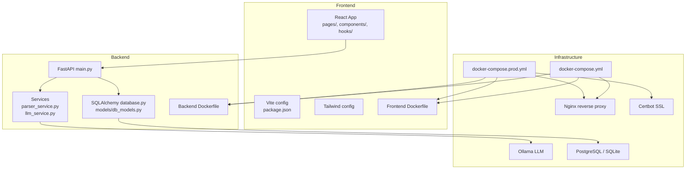
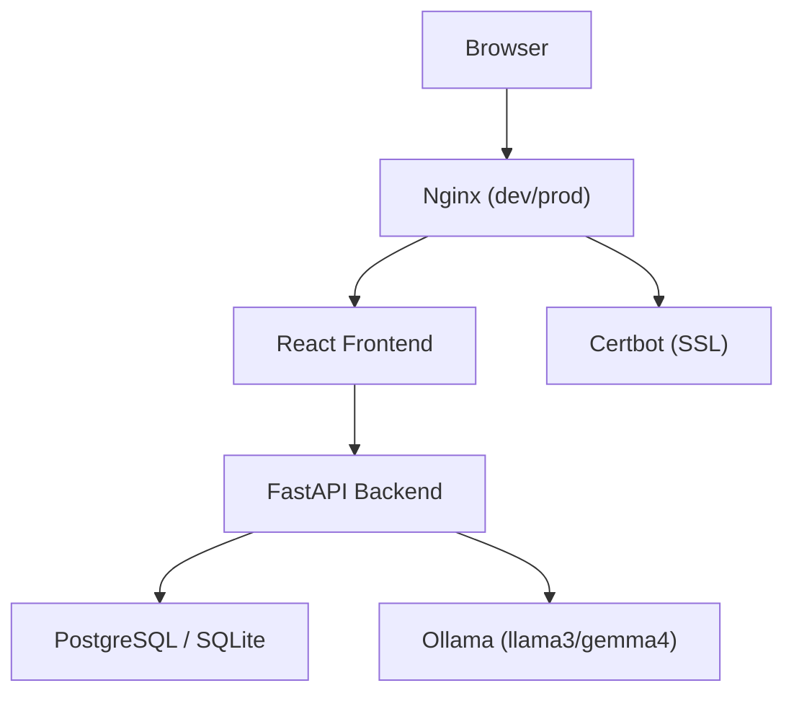
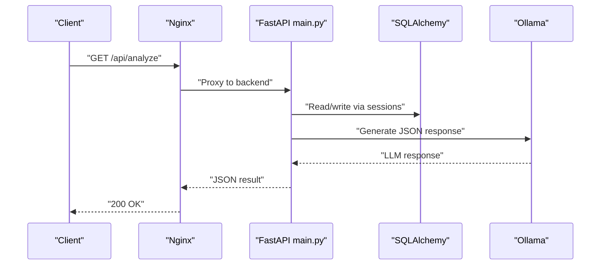
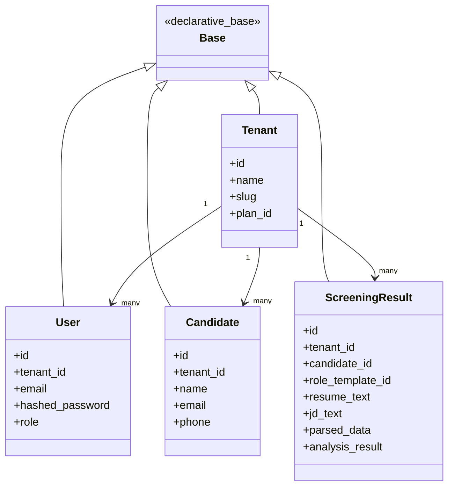
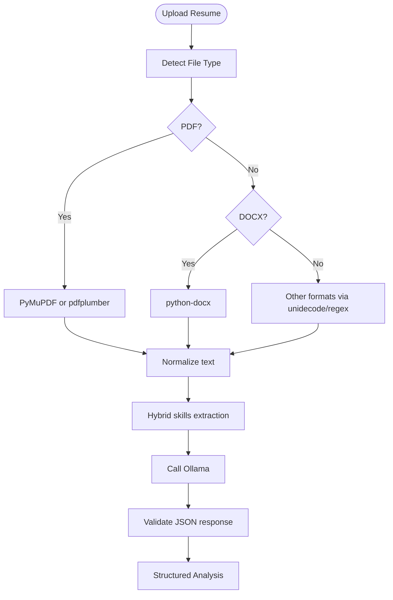
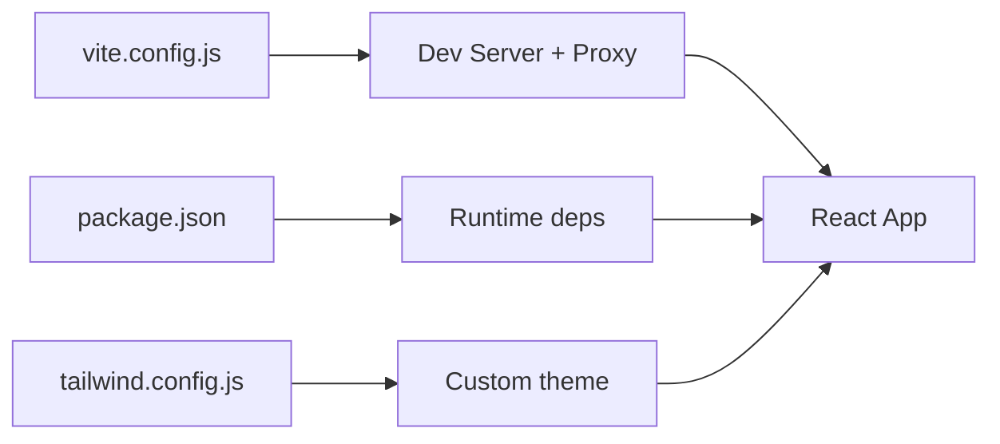
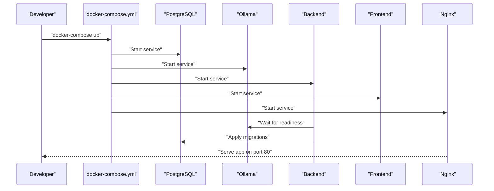
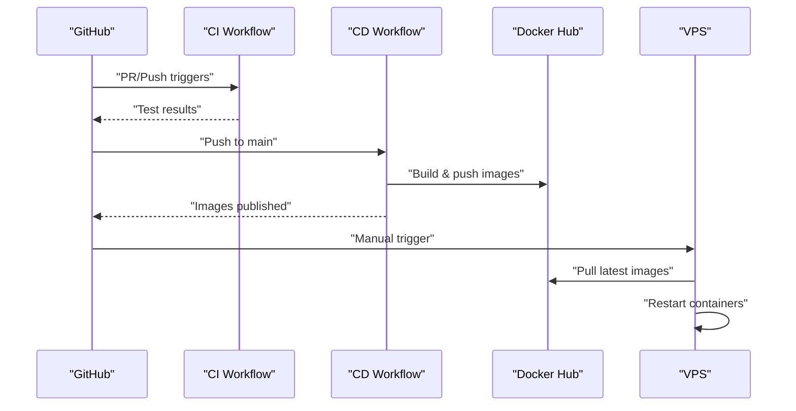
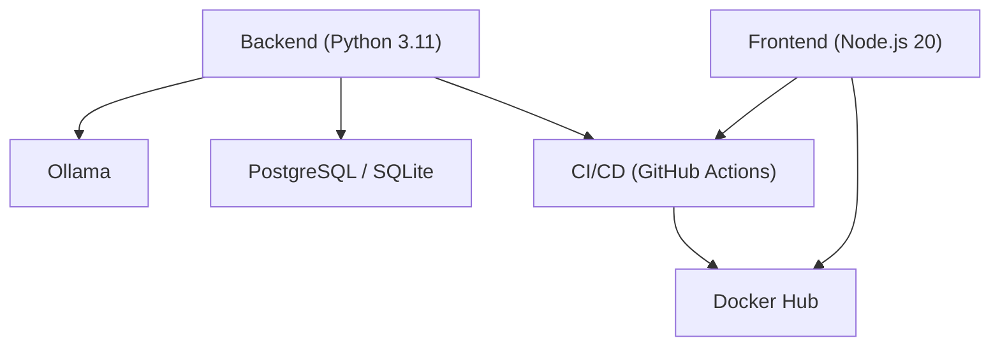

# Technology Stack

<cite>
**Referenced Files in This Document**
- [README.md](file://README.md)
- [requirements.txt](file://requirements.txt)
- [app/backend/main.py](file://app/backend/main.py)
- [app/backend/db/database.py](file://app/backend/db/database.py)
- [app/backend/models/db_models.py](file://app/backend/models/db_models.py)
- [app/backend/services/parser_service.py](file://app/backend/services/parser_service.py)
- [app/backend/services/llm_service.py](file://app/backend/services/llm_service.py)
- [app/backend/Dockerfile](file://app/backend/Dockerfile)
- [app/frontend/Dockerfile](file://app/frontend/Dockerfile)
- [docker-compose.yml](file://docker-compose.yml)
- [docker-compose.prod.yml](file://docker-compose.prod.yml)
- [app/backend/scripts/docker-entrypoint.sh](file://app/backend/scripts/docker-entrypoint.sh)
- [app/backend/scripts/wait_for_ollama.py](file://app/backend/scripts/wait_for_ollama.py)
- [app/frontend/package.json](file://app/frontend/package.json)
- [app/frontend/vite.config.js](file://app/frontend/vite.config.js)
- [app/frontend/tailwind.config.js](file://app/frontend/tailwind.config.js)
- [.github/workflows/ci.yml](file://.github/workflows/ci.yml)
- [.github/workflows/cd.yml](file://.github/workflows/cd.yml)
</cite>

## Table of Contents
1. [Introduction](#introduction)
2. [Project Structure](#project-structure)
3. [Core Components](#core-components)
4. [Architecture Overview](#architecture-overview)
5. [Detailed Component Analysis](#detailed-component-analysis)
6. [Dependency Analysis](#dependency-analysis)
7. [Performance Considerations](#performance-considerations)
8. [Troubleshooting Guide](#troubleshooting-guide)
9. [Conclusion](#conclusion)

## Introduction
This document describes the complete technology stack for Resume AI by ThetaLogics. It covers backend technologies (Python 3.11, FastAPI, SQLAlchemy, SQLite and PostgreSQL), frontend technologies (React 18, Vite, TailwindCSS), AI/ML integration (Ollama with llama3 and gemma4 models, pdfplumber, python-docx), infrastructure (Docker, Docker Compose, Nginx, SSL via Certbot), and CI/CD (GitHub Actions, Docker Hub, VPS deployment). It also explains version compatibility, rationale for technology choices, and integration patterns between components.

## Project Structure
The project is organized into three main areas:
- Backend: FastAPI application with routes, services, database models, and Docker configuration
- Frontend: React SPA built with Vite and styled with TailwindCSS
- Infrastructure: Docker Compose stacks for development and production, plus CI/CD workflows

**Diagram sources**
- [app/backend/main.py:174-215](file://app/backend/main.py#L174-L215)
- [app/backend/db/database.py:1-33](file://app/backend/db/database.py#L1-L33)
- [app/backend/models/db_models.py:1-250](file://app/backend/models/db_models.py#L1-L250)
- [app/backend/services/parser_service.py:1-552](file://app/backend/services/parser_service.py#L1-L552)
- [app/backend/services/llm_service.py:1-156](file://app/backend/services/llm_service.py#L1-L156)
- [app/backend/Dockerfile:1-39](file://app/backend/Dockerfile#L1-L39)
- [app/frontend/Dockerfile:1-26](file://app/frontend/Dockerfile#L1-L26)
- [docker-compose.yml:1-101](file://docker-compose.yml#L1-L101)
- [docker-compose.prod.yml:1-227](file://docker-compose.prod.yml#L1-L227)

**Section sources**
- [README.md:23-51](file://README.md#L23-L51)
- [README.md:273-333](file://README.md#L273-L333)

## Core Components
- Backend runtime and framework
  - Python 3.11 with FastAPI for API endpoints and lifecycle management
  - SQLAlchemy ORM for database abstraction
  - SQLite for local development; PostgreSQL for production
- AI/ML and parsing
  - Ollama for local LLM inference
  - pdfplumber and python-docx for document parsing
  - RapidFuzz/flashtext and PyMuPDF for hybrid parsing and normalization
- Frontend
  - React 18 with Vite for development and build
  - TailwindCSS for styling
  - Axios, react-dropzone, lucide-react, react-router-dom
- Infrastructure
  - Docker and Docker Compose for containerization and orchestration
  - Nginx as reverse proxy and static asset server
  - Certbot for automated SSL certificate management
- CI/CD
  - GitHub Actions workflows for testing and image building/publishing
  - Docker Hub for image registry
  - VPS deployment via SSH and Watchtower auto-update

**Section sources**
- [README.md:23-51](file://README.md#L23-L51)
- [requirements.txt:1-48](file://requirements.txt#L1-L48)
- [app/backend/main.py:174-215](file://app/backend/main.py#L174-L215)
- [app/backend/db/database.py:1-33](file://app/backend/db/database.py#L1-L33)
- [app/backend/services/parser_service.py:1-552](file://app/backend/services/parser_service.py#L1-L552)
- [app/backend/services/llm_service.py:1-156](file://app/backend/services/llm_service.py#L1-L156)
- [app/frontend/package.json:1-41](file://app/frontend/package.json#L1-L41)
- [app/frontend/vite.config.js:1-26](file://app/frontend/vite.config.js#L1-L26)
- [app/frontend/tailwind.config.js:1-67](file://app/frontend/tailwind.config.js#L1-L67)
- [docker-compose.yml:1-101](file://docker-compose.yml#L1-L101)
- [docker-compose.prod.yml:1-227](file://docker-compose.prod.yml#L1-L227)
- [.github/workflows/ci.yml:1-63](file://.github/workflows/ci.yml#L1-L63)
- [.github/workflows/cd.yml:1-101](file://.github/workflows/cd.yml#L1-L101)

## Architecture Overview
The system follows a containerized microservice architecture:
- Frontend (React SPA) served by Nginx
- Backend (FastAPI) exposes REST APIs consumed by the frontend
- Ollama provides local LLM inference
- Database is either SQLite (dev) or PostgreSQL (prod)
- CI/CD builds images and deploys to VPS with Watchtower for updates

**Diagram sources**
- [README.md:231-251](file://README.md#L231-L251)
- [docker-compose.yml:86-96](file://docker-compose.yml#L86-L96)
- [docker-compose.prod.yml:126-145](file://docker-compose.prod.yml#L126-L145)
- [app/backend/main.py:228-259](file://app/backend/main.py#L228-L259)

## Detailed Component Analysis

### Backend: FastAPI Application
- Application lifecycle and health
  - Startup banner and dependency checks for database, skills registry, and Ollama
  - Health endpoint validates database and Ollama connectivity
  - LLM status diagnostic endpoint reports model readiness
- Routing and CORS
  - Centralized router registration for all feature modules
  - CORS policy varies by environment (development allows all)
- Containerization
  - Entrypoint runs Alembic migrations for PostgreSQL and waits for Ollama readiness

**Diagram sources**
- [app/backend/main.py:200-215](file://app/backend/main.py#L200-L215)
- [app/backend/main.py:228-259](file://app/backend/main.py#L228-L259)
- [app/backend/services/llm_service.py:43-57](file://app/backend/services/llm_service.py#L43-L57)

**Section sources**
- [app/backend/main.py:68-171](file://app/backend/main.py#L68-L171)
- [app/backend/main.py:228-326](file://app/backend/main.py#L228-L326)
- [app/backend/Dockerfile:22-38](file://app/backend/Dockerfile#L22-L38)
- [app/backend/scripts/docker-entrypoint.sh:1-20](file://app/backend/scripts/docker-entrypoint.sh#L1-L20)
- [app/backend/scripts/wait_for_ollama.py:34-91](file://app/backend/scripts/wait_for_ollama.py#L34-L91)

### Database Layer: SQLAlchemy ORM
- Engine and session configuration
  - Automatic SQLite URL normalization and PostgreSQL URL normalization
  - Thread-safe connections for SQLite; pooling for PostgreSQL
- Multi-tenant data model
  - Tenants, Users, Candidates, ScreeningResults, RoleTemplates, TeamMembers, Comments, UsageLogs, TranscriptAnalyses, TrainingExamples, JdCache, and Skill registry
- Migration support
  - Alembic integration via backend entrypoint for PostgreSQL deployments

**Diagram sources**
- [app/backend/db/database.py:1-33](file://app/backend/db/database.py#L1-L33)
- [app/backend/models/db_models.py:9-250](file://app/backend/models/db_models.py#L9-L250)

**Section sources**
- [app/backend/db/database.py:1-33](file://app/backend/db/database.py#L1-L33)
- [app/backend/models/db_models.py:1-250](file://app/backend/models/db_models.py#L1-L250)
- [app/backend/Dockerfile:18-20](file://app/backend/Dockerfile#L18-L20)
- [app/backend/scripts/docker-entrypoint.sh:4-14](file://app/backend/scripts/docker-entrypoint.sh#L4-L14)

### AI/ML Parsing and Analysis Services
- Document parsing
  - PDF: PyMuPDF primary, pdfplumber fallback; scanned PDF guard
  - DOCX: python-docx; DOC legacy fallback
  - Other formats: RTF, HTML/HTM, ODT, TXT/MD/CSV with robust decoding
  - Unicode normalization via unidecode
- Skills and hybrid pipeline
  - RapidFuzz/flashtext for keyword extraction
  - Skills registry seeded and loaded at startup
- LLM integration
  - Ollama HTTP client with JSON response parsing and validation
  - Prompt construction with truncated inputs for performance
  - Fallback behavior on failure

**Diagram sources**
- [app/backend/services/parser_service.py:142-191](file://app/backend/services/parser_service.py#L142-L191)
- [app/backend/services/parser_service.py:34-127](file://app/backend/services/parser_service.py#L34-L127)
- [app/backend/services/llm_service.py:13-42](file://app/backend/services/llm_service.py#L13-L42)

**Section sources**
- [app/backend/services/parser_service.py:1-552](file://app/backend/services/parser_service.py#L1-L552)
- [app/backend/services/llm_service.py:1-156](file://app/backend/services/llm_service.py#L1-L156)
- [requirements.txt:4-16](file://requirements.txt#L4-L16)

### Frontend: React 18, Vite, TailwindCSS
- Build and dev server
  - Vite dev server with proxy to backend API
  - Production build with sourcemaps
- Dependencies
  - React 18, react-router-dom, axios, react-dropzone, lucide-react, recharts
- Styling
  - TailwindCSS with custom brand palette, shadows, animations, and fonts

**Diagram sources**
- [app/frontend/vite.config.js:1-26](file://app/frontend/vite.config.js#L1-L26)
- [app/frontend/package.json:14-40](file://app/frontend/package.json#L14-L40)
- [app/frontend/tailwind.config.js:1-67](file://app/frontend/tailwind.config.js#L1-L67)

**Section sources**
- [app/frontend/vite.config.js:1-26](file://app/frontend/vite.config.js#L1-L26)
- [app/frontend/package.json:14-40](file://app/frontend/package.json#L14-L40)
- [app/frontend/tailwind.config.js:1-67](file://app/frontend/tailwind.config.js#L1-L67)

### Infrastructure: Docker, Nginx, SSL, and Deployment
- Development stack
  - PostgreSQL, Ollama, backend, frontend, and Nginx orchestrated via docker-compose
  - Ollama environment tuned for parallelism and flash attention
- Production stack
  - Separate images for backend, frontend, and Nginx
  - Watchtower auto-updates containers on new Docker Hub tags
  - Certbot runs as a persistent container renewing certificates
  - Resource limits and healthchecks for stability
- Entrypoint and warmup
  - Alembic migrations for PostgreSQL
  - wait_for_ollama.py ensures Ollama is reachable and model is warmed before serving

**Diagram sources**
- [docker-compose.yml:5-96](file://docker-compose.yml#L5-L96)
- [docker-compose.prod.yml:75-112](file://docker-compose.prod.yml#L75-L112)
- [app/backend/scripts/docker-entrypoint.sh:4-14](file://app/backend/scripts/docker-entrypoint.sh#L4-L14)
- [app/backend/scripts/wait_for_ollama.py:34-91](file://app/backend/scripts/wait_for_ollama.py#L34-L91)

**Section sources**
- [docker-compose.yml:1-101](file://docker-compose.yml#L1-L101)
- [docker-compose.prod.yml:1-227](file://docker-compose.prod.yml#L1-L227)
- [app/backend/Dockerfile:1-39](file://app/backend/Dockerfile#L1-L39)
- [app/frontend/Dockerfile:1-26](file://app/frontend/Dockerfile#L1-L26)
- [app/backend/scripts/docker-entrypoint.sh:1-20](file://app/backend/scripts/docker-entrypoint.sh#L1-L20)
- [app/backend/scripts/wait_for_ollama.py:1-96](file://app/backend/scripts/wait_for_ollama.py#L1-L96)

### CI/CD Pipeline
- CI workflow
  - Tests backend with Python 3.11 and frontend with Node.js 20
  - Coverage reporting via Codecov
- CD workflow
  - Builds and pushes backend, frontend, and Nginx images to Docker Hub
  - Manual deployment step pulls latest images on VPS and restarts services

**Diagram sources**
- [.github/workflows/ci.yml:1-63](file://.github/workflows/ci.yml#L1-L63)
- [.github/workflows/cd.yml:1-101](file://.github/workflows/cd.yml#L1-L101)

**Section sources**
- [.github/workflows/ci.yml:1-63](file://.github/workflows/ci.yml#L1-L63)
- [.github/workflows/cd.yml:1-101](file://.github/workflows/cd.yml#L1-L101)

## Dependency Analysis
- Backend dependencies
  - FastAPI, Uvicorn, SQLAlchemy, httpx, Pydantic, python-dateutil
  - pdfplumber, python-docx for parsing
  - bcrypt, passlib, python-jose for authentication
  - alembic, psycopg2-binary for migrations and Postgres
  - pandas, openpyxl for exports
  - beautifulsoup4, lxml for job description scraping
  - faster-whisper, yt-dlp for video analysis
  - langgraph, langchain-community, langchain-ollama for multi-agent pipeline
- Frontend dependencies
  - React 18, react-router-dom, axios, react-dropzone, lucide-react, recharts
  - Vite, TailwindCSS, PostCSS, autoprefixer

**Diagram sources**
- [requirements.txt:1-48](file://requirements.txt#L1-L48)
- [app/frontend/package.json:14-40](file://app/frontend/package.json#L14-L40)
- [.github/workflows/ci.yml:16-25](file://.github/workflows/ci.yml#L16-L25)
- [.github/workflows/cd.yml:66-95](file://.github/workflows/cd.yml#L66-L95)

**Section sources**
- [requirements.txt:1-48](file://requirements.txt#L1-L48)
- [app/frontend/package.json:14-40](file://app/frontend/package.json#L14-L40)

## Performance Considerations
- Database
  - SQLite is single-writer; avoid concurrent writes to prevent “database is locked” errors
  - For production, PostgreSQL offers concurrency and scaling; Alembic migrations ensure schema consistency
- LLM and parsing
  - Ollama warmup ensures the model is loaded into RAM to avoid cold-start latency
  - Parallelism and flash attention settings improve throughput
  - Prompt truncation reduces latency and cost
- Frontend
  - Vite build with sourcemaps enables debugging in production
  - Nginx serves static assets efficiently

[No sources needed since this section provides general guidance]

## Troubleshooting Guide
- Ollama not responding
  - Check container logs and ensure the model is pulled and warmed
- Database locked errors
  - Restart the backend container to release locks
- SSL certificate issues
  - Renew certificates manually and restart Nginx
- Deployment failures
  - Verify Docker Hub credentials, SSH keys, and firewall settings

**Section sources**
- [README.md:339-362](file://README.md#L339-L362)

## Conclusion
Resume AI by ThetaLogics combines a modern, container-first stack with local AI inference for privacy and performance. The backend leverages FastAPI and SQLAlchemy for reliability, while the frontend uses React and Vite for a responsive user experience. Ollama powers AI-driven insights, and Docker Compose and GitHub Actions streamline development and deployment. The architecture balances simplicity (SQLite for dev) with scalability (PostgreSQL for prod) and automation (Watchtower and Certbot).