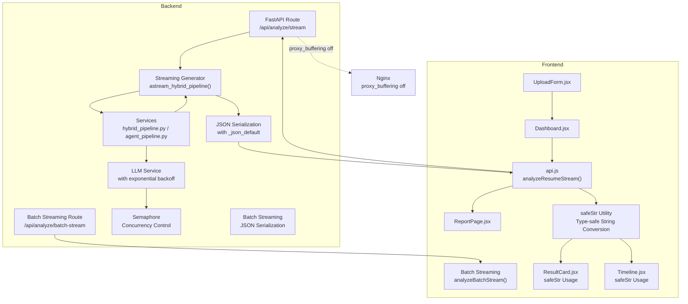
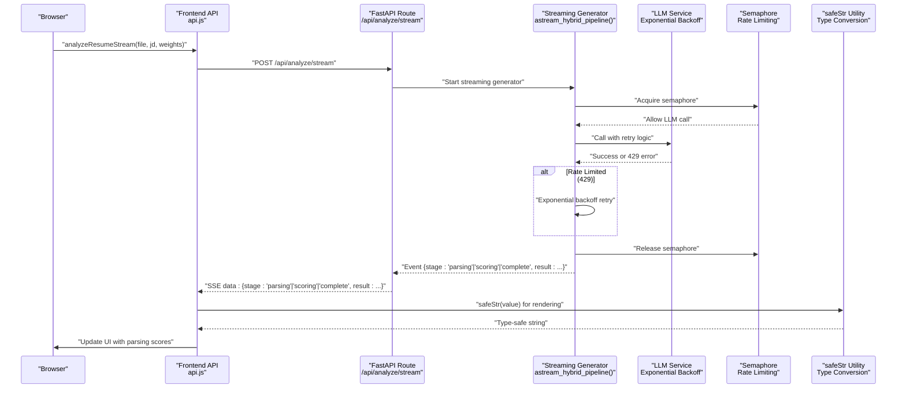
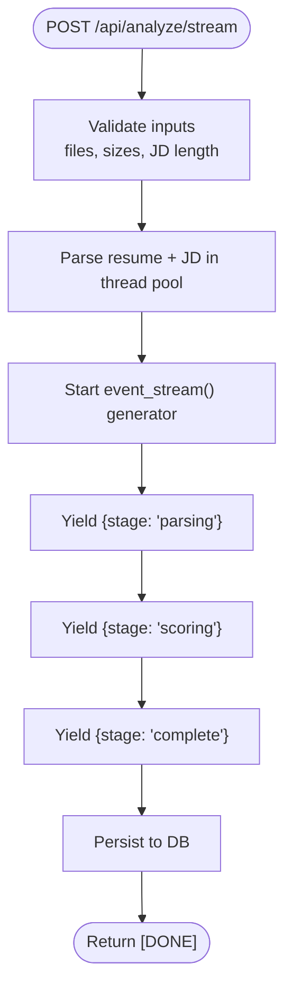
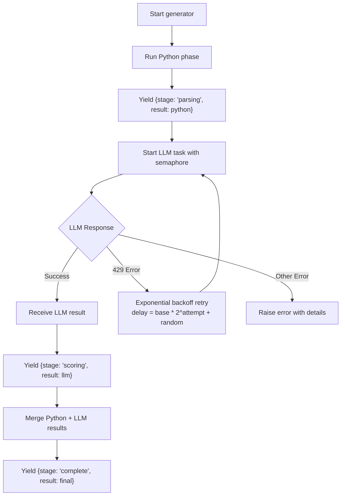
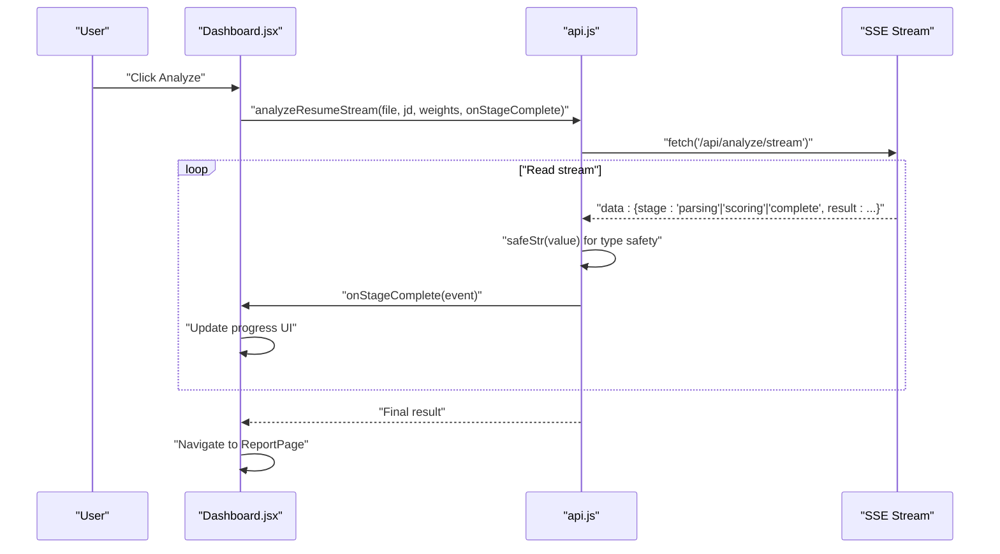
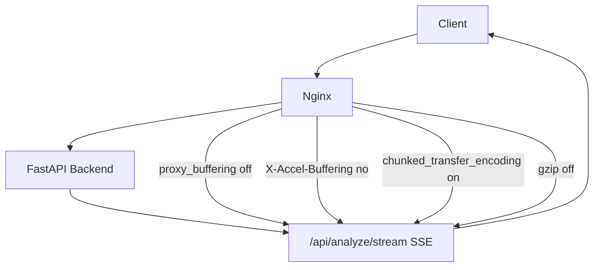
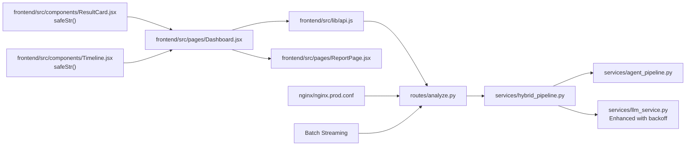

# Real-time Processing

<cite>
**Referenced Files in This Document**
- [analyze.py](file://app/backend/routes/analyze.py)
- [hybrid_pipeline.py](file://app/backend/services/hybrid_pipeline.py)
- [llm_service.py](file://app/backend/services/llm_service.py)
- [agent_pipeline.py](file://app/backend/services/agent_pipeline.py)
- [api.js](file://app/frontend/src/lib/api.js)
- [Dashboard.jsx](file://app/frontend/src/pages/Dashboard.jsx)
- [ReportPage.jsx](file://app/frontend/src/pages/ReportPage.jsx)
- [ResultCard.jsx](file://app/frontend/src/components/ResultCard.jsx)
- [Timeline.jsx](file://app/frontend/src/components/Timeline.jsx)
- [nginx.prod.conf](file://nginx/nginx.prod.conf)
- [main.py](file://app/backend/main.py)
</cite>

## Update Summary
**Changes Made**
- Enhanced SSE streaming data handling with robust string coercion mechanisms for server-side events
- Added safeStr utility function implementations across frontend components to handle type-safe string conversion for dynamic data streams
- Improved error handling for malformed SSE events and type coercion in frontend rendering
- Strengthened defensive programming practices for dynamic data streams in real-time processing

## Table of Contents
1. [Introduction](#introduction)
2. [Project Structure](#project-structure)
3. [Core Components](#core-components)
4. [Architecture Overview](#architecture-overview)
5. [Detailed Component Analysis](#detailed-component-analysis)
6. [Enhanced SSE Streaming Data Handling](#enhanced-sse-streaming-data-handling)
7. [Type-Safe String Conversion Utilities](#type-safe-string-conversion-utilities)
8. [Enhanced LLM Error Handling](#enhanced-llm-error-handling)
9. [Concurrency Control and Rate Limiting](#concurrency-control-and-rate-limiting)
10. [Batch Analysis Streaming](#batch-analysis-streaming)
11. [Dependency Analysis](#dependency-analysis)
12. [Performance Considerations](#performance-considerations)
13. [Troubleshooting Guide](#troubleshooting-guide)
14. [Conclusion](#conclusion)

## Introduction
This document explains the real-time processing implementation for Resume AI by ThetaLogics using Server-Sent Events (SSE). It covers the streaming API design, event lifecycle, client-side consumption, progress indicators, error handling, and operational considerations for reliable long-running analysis. The system now features enhanced SSE streaming data handling with robust string coercion mechanisms for server-side events and safeStr utility function implementations across frontend components to handle type-safe string conversion for dynamic data streams.

## Project Structure
The real-time pipeline spans backend FastAPI routes, streaming generators, and frontend consumers:
- Backend: FastAPI route emits Server-Sent Events for live updates with enhanced error handling
- Streaming generator: Produces structured events for parsing, scoring, and completion with retry logic
- Frontend: Reads SSE stream, updates UI progressively, and navigates to the final report
- Type-safe utilities: safeStr function provides robust string coercion for dynamic data streams
- Batch processing: Concurrent batch analysis with individual result streaming

**Diagram sources**
- [analyze.py:506-646](file://app/backend/routes/analyze.py#L506-L646)
- [analyze.py:1291-1509](file://app/backend/routes/analyze.py#L1291-L1509)
- [hybrid_pipeline.py:1369-1568](file://app/backend/services/hybrid_pipeline.py#L1369-L1568)
- [llm_service.py:41-65](file://app/backend/services/llm_service.py#L41-L65)
- [api.js:210-318](file://app/frontend/src/lib/api.js#L210-L318)
- [api.js:413-515](file://app/frontend/src/lib/api.js#L413-L515)
- [ResultCard.jsx:13-19](file://app/frontend/src/components/ResultCard.jsx#L13-L19)
- [Timeline.jsx:3-9](file://app/frontend/src/components/Timeline.jsx#L3-L9)
- [Dashboard.jsx:243-275](file://app/frontend/src/pages/Dashboard.jsx#L243-L275)
- [ReportPage.jsx:82-120](file://app/frontend/src/pages/ReportPage.jsx#L82-L120)
- [nginx.prod.conf:66-95](file://nginx/nginx.prod.conf#L66-L95)

**Section sources**
- [analyze.py:506-646](file://app/backend/routes/analyze.py#L506-L646)
- [analyze.py:1291-1509](file://app/backend/routes/analyze.py#L1291-L1509)
- [hybrid_pipeline.py:1369-1568](file://app/backend/services/hybrid_pipeline.py#L1369-L1568)
- [llm_service.py:41-65](file://app/backend/services/llm_service.py#L41-L65)
- [api.js:210-318](file://app/frontend/src/lib/api.js#L210-L318)
- [api.js:413-515](file://app/frontend/src/lib/api.js#L413-L515)
- [ResultCard.jsx:13-19](file://app/frontend/src/components/ResultCard.jsx#L13-L19)
- [Timeline.jsx:3-9](file://app/frontend/src/components/Timeline.jsx#L3-L9)
- [Dashboard.jsx:243-275](file://app/frontend/src/pages/Dashboard.jsx#L243-L275)
- [ReportPage.jsx:82-120](file://app/frontend/src/pages/ReportPage.jsx#L82-L120)
- [nginx.prod.conf:66-95](file://nginx/nginx.prod.conf#L66-L95)

## Core Components
- **Streaming route**: Implements SSE with structured events for parsing, scoring, and completion with enhanced error handling
- **Streaming generator**: Emits events with stage markers and payloads; includes heartbeat pings to keep connections alive
- **Enhanced LLM service**: Features exponential backoff retry logic for rate limiting (429 errors) and improved error handling
- **Type-safe string conversion**: safeStr utility function provides robust string coercion for dynamic data streams
- **Concurrency control**: Semaphore-based system to prevent thundering herd effects and manage LLM resource limits
- **Frontend consumer**: Parses SSE stream, updates UI progressively, and handles completion with retry mechanisms
- **Infrastructure**: Nginx configured to disable buffering for SSE endpoints

Key event structure emitted by the backend:
- Stage "parsing": Early Python-only scores
- Stage "scoring": LLM narrative and interview kit with retry logic
- Stage "complete": Final merged result with analysis_id for polling
- Heartbeat comments ": ping" to maintain connection
- Batch events: "result", "failed", and "done" for concurrent processing
- JSON serialization with _json_default for type-safe encoding

**Section sources**
- [analyze.py:506-646](file://app/backend/routes/analyze.py#L506-L646)
- [analyze.py:1291-1509](file://app/backend/routes/analyze.py#L1291-L1509)
- [hybrid_pipeline.py:1369-1568](file://app/backend/services/hybrid_pipeline.py#L1369-L1568)
- [llm_service.py:41-65](file://app/backend/services/llm_service.py#L41-L65)
- [api.js:210-318](file://app/frontend/src/lib/api.js#L210-L318)
- [ResultCard.jsx:13-19](file://app/frontend/src/components/ResultCard.jsx#L13-L19)
- [Timeline.jsx:3-9](file://app/frontend/src/components/Timeline.jsx#L3-L9)

## Architecture Overview
The streaming architecture ensures the client receives incremental updates while the backend performs long-running analysis. The generator yields structured events that the route wraps into SSE messages. The frontend consumes these events to render progress and final results. Enhanced error handling provides resilience against rate limiting and service interruptions, while type-safe string conversion ensures robust rendering of dynamic data streams.

**Diagram sources**
- [analyze.py:506-646](file://app/backend/routes/analyze.py#L506-L646)
- [hybrid_pipeline.py:1369-1568](file://app/backend/services/hybrid_pipeline.py#L1369-L1568)
- [llm_service.py:41-65](file://app/backend/services/llm_service.py#L41-L65)
- [api.js:210-318](file://app/frontend/src/lib/api.js#L210-L318)
- [Dashboard.jsx:243-275](file://app/frontend/src/pages/Dashboard.jsx#L243-L275)
- [ReportPage.jsx:82-120](file://app/frontend/src/pages/ReportPage.jsx#L82-L120)
- [ResultCard.jsx:13-19](file://app/frontend/src/components/ResultCard.jsx#L13-L19)

## Detailed Component Analysis

### Backend Streaming Route
- Validates inputs and parses resume and job description
- Starts a streaming generator that yields structured events
- Emits heartbeat comments to keep the connection alive
- Persists results to the database upon completion
- Sets appropriate SSE headers and disables buffering
- Handles client disconnection with early result saving
- Uses _json_default for type-safe JSON serialization

**Diagram sources**
- [analyze.py:506-646](file://app/backend/routes/analyze.py#L506-L646)

**Section sources**
- [analyze.py:506-646](file://app/backend/routes/analyze.py#L506-L646)

### Streaming Generator (Python + LLM with Enhanced Error Handling)
- Runs Python phase to compute early scores
- Emits parsing stage with Python-only results
- Executes LLM phase with heartbeat pings and exponential backoff retry logic
- Handles 429 rate limit errors with progressive delays
- Emits scoring stage with LLM narrative
- Merges results and emits complete stage

**Diagram sources**
- [hybrid_pipeline.py:1369-1568](file://app/backend/services/hybrid_pipeline.py#L1369-L1568)

**Section sources**
- [hybrid_pipeline.py:1369-1568](file://app/backend/services/hybrid_pipeline.py#L1369-L1568)

### Frontend Consumer and Progress UI
- Initiates streaming analysis and reads SSE events
- Updates progress UI based on received stage markers
- Navigates to the report page when complete
- Handles connection errors and displays user-friendly messages
- Supports batch streaming with individual file progress tracking
- Applies safeStr utility for type-safe string conversion

**Diagram sources**
- [Dashboard.jsx:243-275](file://app/frontend/src/pages/Dashboard.jsx#L243-L275)
- [api.js:210-318](file://app/frontend/src/lib/api.js#L210-L318)

**Section sources**
- [Dashboard.jsx:243-275](file://app/frontend/src/pages/Dashboard.jsx#L243-L275)
- [api.js:210-318](file://app/frontend/src/lib/api.js#L210-L318)

### Infrastructure: Nginx SSE Configuration
- Disables proxy buffering for the streaming endpoint to forward events immediately
- Sets headers to prevent intermediate caching or compression of the stream
- Configures extended timeouts for long-running LLM operations

**Diagram sources**
- [nginx.prod.conf:66-95](file://nginx/nginx.prod.conf#L66-L95)

**Section sources**
- [nginx.prod.conf:66-95](file://nginx/nginx.prod.conf#L66-L95)

## Enhanced SSE Streaming Data Handling
The system now implements robust string coercion mechanisms for server-side events to ensure type-safe data transmission:

### Type-Safe JSON Serialization
- Backend uses _json_default function for custom JSON serialization
- Handles complex data types including datetime objects, UUIDs, and numpy arrays
- Ensures consistent serialization across different event types
- Prevents JSON parsing errors in the frontend

### Frontend Type Safety Enhancements
- safeStr utility function provides robust string coercion
- Handles null/undefined values by converting to empty strings
- Converts primitive types (number, boolean) to strings safely
- Uses JSON.stringify as fallback with error handling
- Applied consistently across all result rendering components

### Event Stream Robustness
- Enhanced error handling for malformed SSE events
- Graceful degradation when type conversion fails
- Logging of conversion errors for debugging
- Prevention of UI crashes from unexpected data types

**Section sources**
- [analyze.py:506-646](file://app/backend/routes/analyze.py#L506-L646)
- [api.js:210-318](file://app/frontend/src/lib/api.js#L210-L318)
- [ResultCard.jsx:13-19](file://app/frontend/src/components/ResultCard.jsx#L13-L19)
- [Timeline.jsx:3-9](file://app/frontend/src/components/Timeline.jsx#L3-L9)

## Type-Safe String Conversion Utilities
The safeStr utility function provides comprehensive type-safe string conversion for dynamic data streams:

### Implementation Details
- Null/undefined values: Returns empty string ('')
- String values: Returned unchanged
- Number/boolean values: Converted using String() constructor
- Object/array values: Attempt JSON.stringify(), fallback to String()
- Error handling: Try-catch prevents crashes, falls back to String()

### Frontend Component Integration
- ResultCard.jsx: Used extensively for rendering analysis results
- Timeline.jsx: Applied for job title and company name rendering
- Interview questions: Safe conversion for dynamic question content
- Risk flags and recommendations: Type-safe display of dynamic content
- Skill lists and education analysis: Robust rendering of mixed data types

### Benefits
- Prevents UI crashes from unexpected data types
- Ensures consistent string representation across components
- Handles edge cases in dynamic data streams gracefully
- Improves user experience by avoiding broken displays

**Section sources**
- [ResultCard.jsx:13-19](file://app/frontend/src/components/ResultCard.jsx#L13-L19)
- [Timeline.jsx:3-9](file://app/frontend/src/components/Timeline.jsx#L3-L9)
- [api.js:210-318](file://app/frontend/src/lib/api.js#L210-L318)

## Enhanced LLM Error Handling
The system now implements comprehensive error handling for LLM operations with exponential backoff retry logic:

### Rate Limiting (429 Errors)
- Detects HTTP 429 rate limit responses from LLM service
- Implements exponential backoff with jitter: `delay = base_delay * (2^attempt) + random.uniform(0, 1.0)`
- Maximum 3 retry attempts for rate-limited requests
- Logs detailed retry information with attempt numbers and delays

### Authentication and Network Errors
- Handles HTTP 401 authentication failures with specific error messages
- Manages HTTP 5xx server errors with retry logic
- Catches connection errors and timeout exceptions
- Wraps langchain ResponseError instances that contain 429 status codes

### Fallback Mechanisms
- Provides deterministic fallback narratives when LLM is unavailable
- Retries with higher temperature settings for edge cases
- Validates JSON extraction and handles malformed responses

**Section sources**
- [hybrid_pipeline.py:1369-1568](file://app/backend/services/hybrid_pipeline.py#L1369-L1568)

## Concurrency Control and Rate Limiting
The system implements sophisticated concurrency control to prevent thundering herd effects:

### Semaphore-Based Architecture
- Global semaphore controls concurrent LLM requests
- Auto-detection of Ollama Cloud vs local instance
- Cloud instances: default concurrency of 4 (conservative to avoid 429 rate limits)
- Local instances: default concurrency of 1 (single-threaded support)
- Environment variable override: `OLLAMA_MAX_CONCURRENT`

### Throttling Strategies
- Prevents overwhelming external LLM APIs during peak usage
- Reduces risk of rate limiting and service degradation
- Balances throughput with resource constraints
- Protects against thundering herd effects in distributed environments

### Health Monitoring
- Ollama health sentinel monitors model availability
- Automatic warmup for local Ollama instances
- Cloud instances skip health checks (no warmup required)
- Proactive detection of service issues

**Section sources**
- [llm_service.py:41-65](file://app/backend/services/llm_service.py#L41-L65)

## Batch Analysis Streaming
The system now supports concurrent batch analysis with progressive streaming:

### Concurrent Processing
- Processes multiple resumes simultaneously using asyncio
- Streams individual results as soon as they complete
- Maintains progress tracking for each file independently
- Handles pre-flight validation failures separately

### Event Stream Format
- "result" events: `{event: "result", index, total, filename, result, screening_result_id}`
- "failed" events: `{event: "failed", index, total, filename?, error}`
- "done" events: `{event: "done", total, successful, failed_count}`

### Usage Limits and Validation
- Enforces tenant plan limits for batch operations
- Validates batch size against subscription plan restrictions
- Atomic usage increment prevents race conditions
- Supports chunked upload processing for large files

**Section sources**
- [analyze.py:1291-1509](file://app/backend/routes/analyze.py#L1291-L1509)

## Dependency Analysis
- Route depends on streaming generator and database persistence
- Generator depends on analysis services for Python and LLM phases
- Enhanced LLM service includes exponential backoff and semaphore management
- Frontend depends on route for SSE and on UI components for rendering
- Infrastructure depends on route for SSE-specific configuration
- safeStr utility provides type-safe string conversion across frontend components

**Diagram sources**
- [analyze.py:506-646](file://app/backend/routes/analyze.py#L506-L646)
- [analyze.py:1291-1509](file://app/backend/routes/analyze.py#L1291-L1509)
- [hybrid_pipeline.py:1369-1568](file://app/backend/services/hybrid_pipeline.py#L1369-L1568)
- [llm_service.py:41-65](file://app/backend/services/llm_service.py#L41-L65)
- [agent_pipeline.py:520-540](file://app/backend/services/agent_pipeline.py#L520-L540)
- [api.js:210-318](file://app/frontend/src/lib/api.js#L210-L318)
- [Dashboard.jsx:243-275](file://app/frontend/src/pages/Dashboard.jsx#L243-L275)
- [ReportPage.jsx:82-120](file://app/frontend/src/pages/ReportPage.jsx#L82-L120)
- [ResultCard.jsx:13-19](file://app/frontend/src/components/ResultCard.jsx#L13-L19)
- [Timeline.jsx:3-9](file://app/frontend/src/components/Timeline.jsx#L3-L9)
- [nginx.prod.conf:66-95](file://nginx/nginx.prod.conf#L66-L95)

**Section sources**
- [analyze.py:506-646](file://app/backend/routes/analyze.py#L506-L646)
- [analyze.py:1291-1509](file://app/backend/routes/analyze.py#L1291-L1509)
- [hybrid_pipeline.py:1369-1568](file://app/backend/services/hybrid_pipeline.py#L1369-L1568)
- [llm_service.py:41-65](file://app/backend/services/llm_service.py#L41-L65)
- [agent_pipeline.py:520-540](file://app/backend/services/agent_pipeline.py#L520-L540)
- [api.js:210-318](file://app/frontend/src/lib/api.js#L210-L318)
- [Dashboard.jsx:243-275](file://app/frontend/src/pages/Dashboard.jsx#L243-L275)
- [ReportPage.jsx:82-120](file://app/frontend/src/pages/ReportPage.jsx#L82-L120)
- [ResultCard.jsx:13-19](file://app/frontend/src/components/ResultCard.jsx#L13-L19)
- [Timeline.jsx:3-9](file://app/frontend/src/components/Timeline.jsx#L3-L9)
- [nginx.prod.conf:66-95](file://nginx/nginx.prod.conf#L66-L95)

## Performance Considerations
- **Enhanced Concurrency Control**: LLM calls are limited by a semaphore to avoid overwhelming the inference backend
- **Exponential Backoff**: Rate limiting (429 errors) handled with progressive delays to prevent service saturation
- **Heartbeat Pings**: Prevent upstream proxies from closing idle connections during long waits
- **Buffering**: Disabled for SSE to ensure immediate event delivery
- **Timeouts**: LLM tasks enforce timeouts to bound latency and resource usage
- **Resource Management**: Thread pool used for parsing to avoid blocking the event loop
- **Batch Processing**: Concurrent processing with individual result streaming for improved throughput
- **Early Result Saving**: Client disconnections trigger early database persistence of Python results
- **Type Conversion Optimization**: safeStr utility reduces rendering overhead through efficient type checking
- **Memory Management**: Frontend components minimize unnecessary re-renders through type-safe data handling

Recommendations:
- Monitor LLM semaphore usage and adjust concurrency based on hardware capacity
- Tune proxy timeouts and keep-alive settings to match expected analysis durations
- Consider rate limiting for SSE endpoints to protect backend resources
- Implement circuit breaker patterns for external LLM services
- Monitor exponential backoff effectiveness and adjust base delays
- Optimize safeStr usage patterns to minimize repeated conversions

**Section sources**
- [hybrid_pipeline.py:24-32](file://app/backend/services/hybrid_pipeline.py#L24-L32)
- [hybrid_pipeline.py:1446-1492](file://app/backend/services/hybrid_pipeline.py#L1446-L1492)
- [llm_service.py:41-65](file://app/backend/services/llm_service.py#L41-L65)
- [nginx.prod.conf:81-94](file://nginx/nginx.prod.conf#L81-L94)
- [ResultCard.jsx:13-19](file://app/frontend/src/components/ResultCard.jsx#L13-L19)

## Troubleshooting Guide
Common issues and resolutions:
- **Stream ends without completion**:
  - Ensure the generator yields a final "complete" event and "[DONE]" marker
  - Verify the frontend reads until "[DONE]" and throws if missing
- **Connection drops or timeouts**:
  - Confirm Nginx disables buffering and sets proper headers for SSE
  - Use heartbeat pings to keep the connection alive
- **LLM rate limiting (429 errors)**:
  - System now automatically applies exponential backoff retry logic
  - Check OLLAMA_MAX_CONCURRENT environment variable for concurrency limits
  - Monitor retry attempts and adjust base delay if needed
- **LLM offline or slow**:
  - The backend falls back gracefully with deterministic narratives
  - Frontend shows a notice and quality indicator
  - Use the diagnostic endpoint to check model readiness
- **Batch processing failures**:
  - Individual file failures are streamed separately
  - Check tenant plan limits for batch size restrictions
  - Monitor concurrent processing limits
- **Frontend errors**:
  - The frontend surfaces HTTP errors and malformed events
  - Display user-friendly messages with retry options
- **Type conversion issues**:
  - safeStr utility prevents crashes from unexpected data types
  - Check browser console for conversion warnings
  - Verify data integrity in backend serialization

Operational checks:
- Health endpoint validates database and Ollama connectivity
- LLM status endpoint reports model availability and readiness
- Monitor semaphore utilization and rate limiting effectiveness
- Track exponential backoff retry patterns and success rates
- Verify safeStr conversion logs for debugging type issues

**Section sources**
- [analyze.py:584-587](file://app/backend/routes/analyze.py#L584-L587)
- [api.js:102-109](file://app/frontend/src/lib/api.js#L102-L109)
- [api.js:132-140](file://app/frontend/src/lib/api.js#L132-L140)
- [nginx.prod.conf:81-94](file://nginx/nginx.prod.conf#L81-L94)
- [main.py:228-259](file://app/backend/main.py#L228-L259)
- [main.py:262-326](file://app/backend/main.py#L262-L326)
- [ResultCard.jsx:13-19](file://app/frontend/src/components/ResultCard.jsx#L13-L19)

## Conclusion
The real-time processing pipeline delivers responsive, incremental feedback during long-running analysis by combining FastAPI SSE with a structured streaming generator. The enhanced implementation now features comprehensive error handling with exponential backoff retry logic for rate limiting, reduced concurrency limits to prevent thundering herd effects, and improved streaming architecture for batch analysis operations. The introduction of safeStr utility functions provides robust type-safe string conversion for dynamic data streams, preventing UI crashes and ensuring consistent rendering across all frontend components. The frontend consumes these events to provide clear progress indicators and a smooth user experience. Proper infrastructure configuration and enhanced error handling ensure reliability under production conditions with improved resilience against external service limitations and data type inconsistencies.