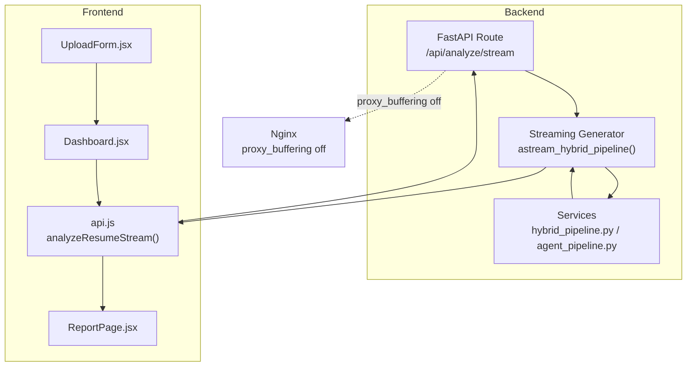
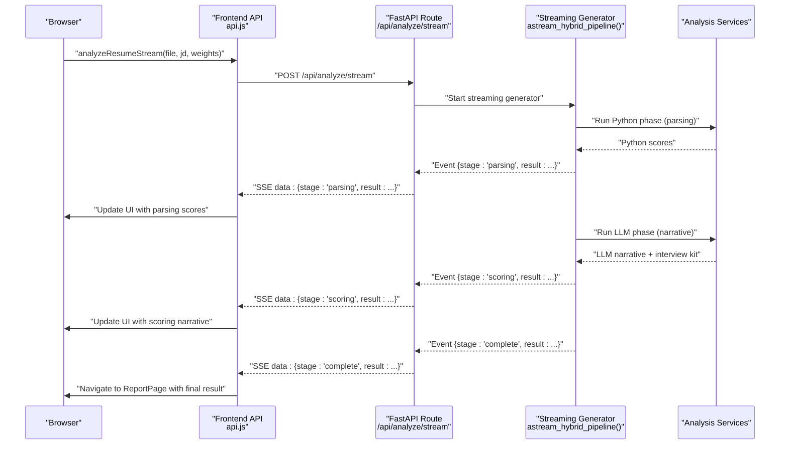
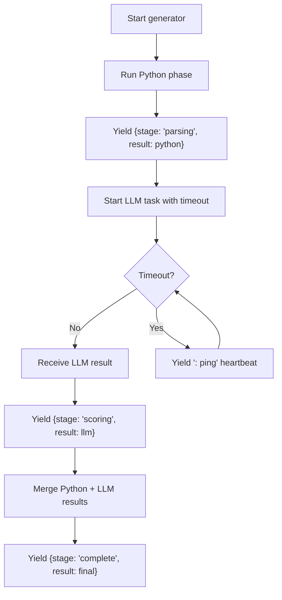
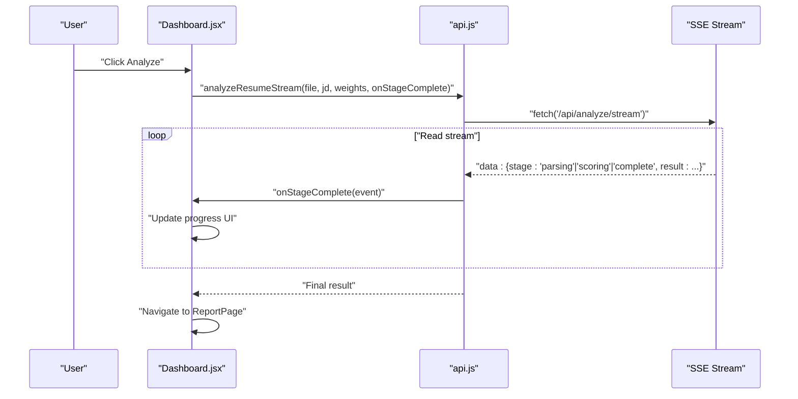
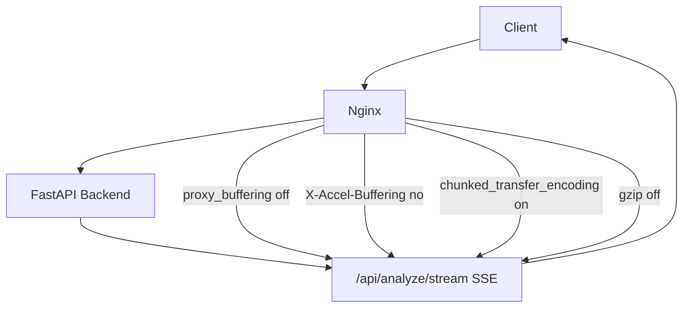
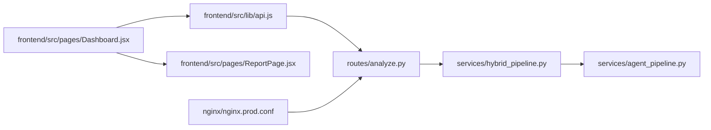

# Real-time Processing

<cite>
**Referenced Files in This Document**
- [analyze.py](file://app/backend/routes/analyze.py)
- [hybrid_pipeline.py](file://app/backend/services/hybrid_pipeline.py)
- [agent_pipeline.py](file://app/backend/services/agent_pipeline.py)
- [api.js](file://app/frontend/src/lib/api.js)
- [Dashboard.jsx](file://app/frontend/src/pages/Dashboard.jsx)
- [ReportPage.jsx](file://app/frontend/src/pages/ReportPage.jsx)
- [nginx.prod.conf](file://nginx/nginx.prod.conf)
- [main.py](file://app/backend/main.py)
</cite>

## Table of Contents
1. [Introduction](#introduction)
2. [Project Structure](#project-structure)
3. [Core Components](#core-components)
4. [Architecture Overview](#architecture-overview)
5. [Detailed Component Analysis](#detailed-component-analysis)
6. [Dependency Analysis](#dependency-analysis)
7. [Performance Considerations](#performance-considerations)
8. [Troubleshooting Guide](#troubleshooting-guide)
9. [Conclusion](#conclusion)

## Introduction
This document explains the real-time processing implementation for Resume AI by ThetaLogics using Server-Sent Events (SSE). It covers the streaming API design, event lifecycle, client-side consumption, progress indicators, error handling, and operational considerations for reliable long-running analysis.

## Project Structure
The real-time pipeline spans backend FastAPI routes, streaming generators, and frontend consumers:
- Backend: FastAPI route emits Server-Sent Events for live updates.
- Streaming generator: Produces structured events for parsing, scoring, and completion.
- Frontend: Reads SSE stream, updates UI progressively, and navigates to the final report.

**Diagram sources**
- [analyze.py:506-646](file://app/backend/routes/analyze.py#L506-L646)
- [hybrid_pipeline.py:1410-1497](file://app/backend/services/hybrid_pipeline.py#L1410-L1497)
- [agent_pipeline.py:520-540](file://app/backend/services/agent_pipeline.py#L520-L540)
- [api.js:75-147](file://app/frontend/src/lib/api.js#L75-L147)
- [Dashboard.jsx:243-275](file://app/frontend/src/pages/Dashboard.jsx#L243-L275)
- [ReportPage.jsx:82-120](file://app/frontend/src/pages/ReportPage.jsx#L82-L120)
- [nginx.prod.conf:66-95](file://nginx/nginx.prod.conf#L66-L95)

**Section sources**
- [analyze.py:506-646](file://app/backend/routes/analyze.py#L506-L646)
- [hybrid_pipeline.py:1410-1497](file://app/backend/services/hybrid_pipeline.py#L1410-L1497)
- [api.js:75-147](file://app/frontend/src/lib/api.js#L75-L147)
- [Dashboard.jsx:243-275](file://app/frontend/src/pages/Dashboard.jsx#L243-L275)
- [ReportPage.jsx:82-120](file://app/frontend/src/pages/ReportPage.jsx#L82-L120)
- [nginx.prod.conf:66-95](file://nginx/nginx.prod.conf#L66-L95)

## Core Components
- Streaming route: Implements SSE with structured events for parsing, scoring, and completion.
- Streaming generator: Emits events with stage markers and payloads; includes heartbeat pings to keep connections alive.
- Frontend consumer: Parses SSE stream, updates UI progressively, and handles completion.
- Infrastructure: Nginx configured to disable buffering for SSE endpoints.

Key event structure emitted by the backend:
- Stage "parsing": Early Python-only scores.
- Stage "scoring": LLM narrative and interview kit.
- Stage "complete": Final merged result.
- Heartbeat comments ": ping" to maintain connection.

**Section sources**
- [analyze.py:506-646](file://app/backend/routes/analyze.py#L506-L646)
- [hybrid_pipeline.py:1410-1497](file://app/backend/services/hybrid_pipeline.py#L1410-L1497)
- [api.js:75-147](file://app/frontend/src/lib/api.js#L75-L147)

## Architecture Overview
The streaming architecture ensures the client receives incremental updates while the backend performs long-running analysis. The generator yields structured events that the route wraps into SSE messages. The frontend consumes these events to render progress and final results.

**Diagram sources**
- [analyze.py:506-646](file://app/backend/routes/analyze.py#L506-L646)
- [hybrid_pipeline.py:1410-1497](file://app/backend/services/hybrid_pipeline.py#L1410-L1497)
- [api.js:75-147](file://app/frontend/src/lib/api.js#L75-L147)
- [Dashboard.jsx:243-275](file://app/frontend/src/pages/Dashboard.jsx#L243-L275)
- [ReportPage.jsx:82-120](file://app/frontend/src/pages/ReportPage.jsx#L82-L120)

## Detailed Component Analysis

### Backend Streaming Route
- Validates inputs and parses resume and job description.
- Starts a streaming generator that yields structured events.
- Emits heartbeat comments to keep the connection alive.
- Persists results to the database upon completion.
- Sets appropriate SSE headers and disables buffering.

**Diagram sources**
- [analyze.py:506-646](file://app/backend/routes/analyze.py#L506-L646)

**Section sources**
- [analyze.py:506-646](file://app/backend/routes/analyze.py#L506-L646)

### Streaming Generator (Python + LLM)
- Runs Python phase to compute early scores.
- Emits parsing stage with Python-only results.
- Executes LLM phase with heartbeat pings to prevent timeouts.
- Emits scoring stage with LLM narrative.
- Merges results and emits complete stage.

**Diagram sources**
- [hybrid_pipeline.py:1410-1497](file://app/backend/services/hybrid_pipeline.py#L1410-L1497)

**Section sources**
- [hybrid_pipeline.py:1410-1497](file://app/backend/services/hybrid_pipeline.py#L1410-L1497)

### Frontend Consumer and Progress UI
- Initiates streaming analysis and reads SSE events.
- Updates progress UI based on received stage markers.
- Navigates to the report page when complete.
- Handles connection errors and displays user-friendly messages.

**Diagram sources**
- [Dashboard.jsx:243-275](file://app/frontend/src/pages/Dashboard.jsx#L243-L275)
- [api.js:75-147](file://app/frontend/src/lib/api.js#L75-L147)

**Section sources**
- [Dashboard.jsx:243-275](file://app/frontend/src/pages/Dashboard.jsx#L243-L275)
- [api.js:75-147](file://app/frontend/src/lib/api.js#L75-L147)

### Infrastructure: Nginx SSE Configuration
- Disables proxy buffering for the streaming endpoint to forward events immediately.
- Sets headers to prevent intermediate caching or compression of the stream.
- Configures extended timeouts for long-running LLM operations.

**Diagram sources**
- [nginx.prod.conf:66-95](file://nginx/nginx.prod.conf#L66-L95)

**Section sources**
- [nginx.prod.conf:66-95](file://nginx/nginx.prod.conf#L66-L95)

## Dependency Analysis
- Route depends on streaming generator and database persistence.
- Generator depends on analysis services for Python and LLM phases.
- Frontend depends on route for SSE and on UI components for rendering.
- Infrastructure depends on route for SSE-specific configuration.

**Diagram sources**
- [analyze.py:506-646](file://app/backend/routes/analyze.py#L506-L646)
- [hybrid_pipeline.py:1410-1497](file://app/backend/services/hybrid_pipeline.py#L1410-L1497)
- [agent_pipeline.py:520-540](file://app/backend/services/agent_pipeline.py#L520-L540)
- [api.js:75-147](file://app/frontend/src/lib/api.js#L75-L147)
- [Dashboard.jsx:243-275](file://app/frontend/src/pages/Dashboard.jsx#L243-L275)
- [ReportPage.jsx:82-120](file://app/frontend/src/pages/ReportPage.jsx#L82-L120)
- [nginx.prod.conf:66-95](file://nginx/nginx.prod.conf#L66-L95)

**Section sources**
- [analyze.py:506-646](file://app/backend/routes/analyze.py#L506-L646)
- [hybrid_pipeline.py:1410-1497](file://app/backend/services/hybrid_pipeline.py#L1410-L1497)
- [agent_pipeline.py:520-540](file://app/backend/services/agent_pipeline.py#L520-L540)
- [api.js:75-147](file://app/frontend/src/lib/api.js#L75-L147)
- [Dashboard.jsx:243-275](file://app/frontend/src/pages/Dashboard.jsx#L243-L275)
- [ReportPage.jsx:82-120](file://app/frontend/src/pages/ReportPage.jsx#L82-L120)
- [nginx.prod.conf:66-95](file://nginx/nginx.prod.conf#L66-L95)

## Performance Considerations
- Concurrency control: LLM calls are limited by a semaphore to avoid overwhelming the inference backend.
- Heartbeat pings: Prevent upstream proxies from closing idle connections during long waits.
- Buffering: Disabled for SSE to ensure immediate event delivery.
- Timeouts: LLM tasks enforce timeouts to bound latency and resource usage.
- Resource management: Thread pool used for parsing to avoid blocking the event loop.

Recommendations:
- Monitor LLM semaphore usage and adjust concurrency based on hardware capacity.
- Tune proxy timeouts and keep-alive settings to match expected analysis durations.
- Consider rate limiting for SSE endpoints to protect backend resources.

**Section sources**
- [hybrid_pipeline.py:24-32](file://app/backend/services/hybrid_pipeline.py#L24-L32)
- [hybrid_pipeline.py:1446-1492](file://app/backend/services/hybrid_pipeline.py#L1446-L1492)
- [nginx.prod.conf:81-94](file://nginx/nginx.prod.conf#L81-L94)

## Troubleshooting Guide
Common issues and resolutions:
- Stream ends without completion:
  - Ensure the generator yields a final "complete" event and "[DONE]" marker.
  - Verify the frontend reads until "[DONE]" and throws if missing.
- Connection drops or timeouts:
  - Confirm Nginx disables buffering and sets proper headers for SSE.
  - Use heartbeat pings to keep the connection alive.
- LLM offline or slow:
  - The backend falls back gracefully; frontend shows a notice and quality indicator.
  - Use the diagnostic endpoint to check model readiness.
- Frontend errors:
  - The frontend surfaces HTTP errors and malformed events; display user-friendly messages.

Operational checks:
- Health endpoint validates database and Ollama connectivity.
- LLM status endpoint reports model availability and readiness.

**Section sources**
- [analyze.py:584-587](file://app/backend/routes/analyze.py#L584-L587)
- [api.js:102-109](file://app/frontend/src/lib/api.js#L102-L109)
- [api.js:132-140](file://app/frontend/src/lib/api.js#L132-L140)
- [nginx.prod.conf:81-94](file://nginx/nginx.prod.conf#L81-L94)
- [main.py:228-259](file://app/backend/main.py#L228-L259)
- [main.py:262-326](file://app/backend/main.py#L262-L326)

## Conclusion
The real-time processing pipeline delivers responsive, incremental feedback during long-running analysis by combining FastAPI SSE with a structured streaming generator. The frontend consumes these events to provide clear progress indicators and a smooth user experience. Proper infrastructure configuration and error handling ensure reliability under production conditions.