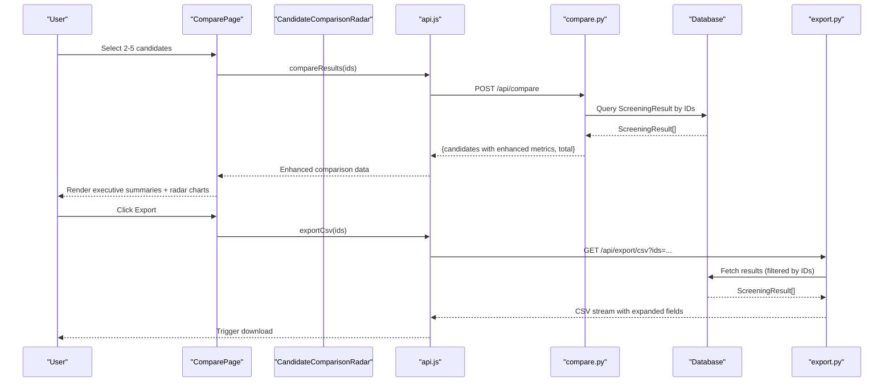
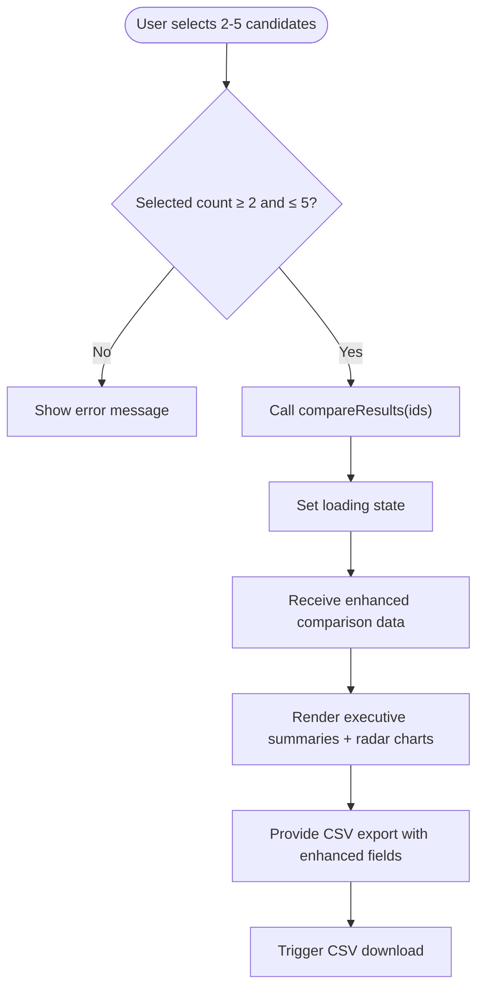
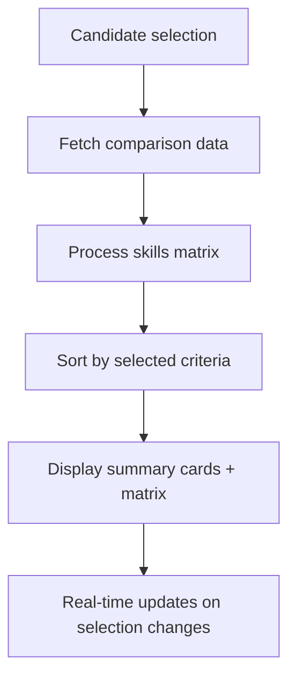
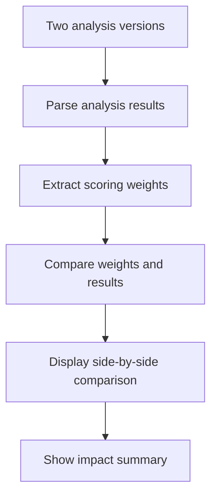
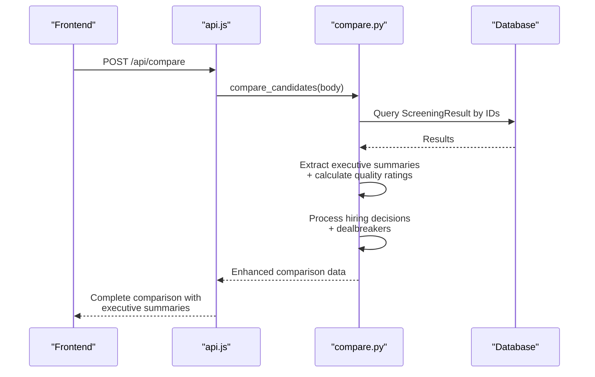
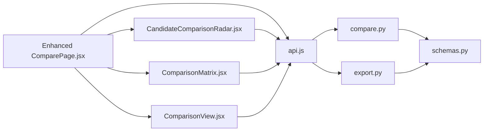

# Comparison & Visualization

<cite>
**Referenced Files in This Document**
- [ComparePage.jsx](file://app/frontend/src/pages/ComparePage.jsx)
- [ResultCard.jsx](file://app/frontend/src/components/ResultCard.jsx)
- [Timeline.jsx](file://app/frontend/src/components/Timeline.jsx)
- [SkillsRadar.jsx](file://app/frontend/src/components/SkillsRadar.jsx)
- [CandidateComparisonRadar.jsx](file://app/frontend/src/components/CandidateComparisonRadar.jsx)
- [ComparisonView.jsx](file://app/frontend/src/components/ComparisonView.jsx)
- [ComparisonMatrix.jsx](file://app/frontend/src/components/ComparisonMatrix.jsx)
- [ReportPage.jsx](file://app/frontend/src/pages/ReportPage.jsx)
- [AnalyzePage.jsx](file://app/frontend/src/pages/AnalyzePage.jsx)
- [api.js](file://app/frontend/src/lib/api.js)
- [compare.py](file://app/backend/routes/compare.py)
- [export.py](file://app/backend/routes/export.py)
- [schemas.py](file://app/backend/models/schemas.py)
</cite>

## Update Summary
**Changes Made**
- Enhanced ComparePage with new CandidateComparisonRadar component for comprehensive 5-way candidate comparison
- Added executive summaries section with detailed candidate insights
- Implemented CSV export functionality with enhanced data fields
- Integrated real-time score visualization with interactive radar charts
- Added comprehensive candidate comparison capabilities with up to 5-way comparison support
- Enhanced backend comparison endpoint with executive summaries and advanced analytics
- Updated comparison matrix with dynamic sorting and skill gap visualization

## Table of Contents
1. [Introduction](#introduction)
2. [Project Structure](#project-structure)
3. [Core Components](#core-components)
4. [Architecture Overview](#architecture-overview)
5. [Detailed Component Analysis](#detailed-component-analysis)
6. [Dependency Analysis](#dependency-analysis)
7. [Performance Considerations](#performance-considerations)
8. [Troubleshooting Guide](#troubleshooting-guide)
9. [Conclusion](#conclusion)

## Introduction
This document explains the enhanced comparison and visualization features in Resume AI by ThetaLogics. The system now provides comprehensive candidate evaluation capabilities with:
- **Enhanced Candidate Comparison**: New 5-way comparison support with interactive radar charts and executive summaries
- **Real-time Score Visualization**: Dynamic scorecards with technical, behavioral, communication, cultural fit, and motivation dimensions
- **Executive Insights**: Detailed executive summaries for each candidate with strengths, weaknesses, and recommendations
- **Advanced Export Capabilities**: Comprehensive CSV and Excel export with enhanced data fields
- **Interactive Comparison Tools**: Real-time score visualization and dynamic comparison matrices
- **Performance Optimization**: Efficient handling of large-scale comparisons with up to 5 candidates

## Project Structure
The enhanced comparison system spans frontend React components and backend FastAPI services with comprehensive data processing and visualization capabilities:

```mermaid
graph TB
subgraph "Frontend Enhancement"
CP["ComparePage.jsx"]
CCR["CandidateComparisonRadar.jsx"]
CM["ComparisonMatrix.jsx"]
CV["ComparisonView.jsx"]
RC["ResultCard.jsx"]
TL["Timeline.jsx"]
SR["SkillsRadar.jsx"]
RP["ReportPage.jsx"]
AP["AnalyzePage.jsx"]
API["api.js"]
END["Enhanced Collapsible Sections"]
BADGE["Quality Badges"]
SC["Score Cells"]
ANALYZE["Analyze Another Resume"]
JDCTX["JD Context Persistence"]
EXSUM["Executive Summaries"]
CSVEXPORT["CSV Export"]
RADCMP["Radar Chart Comparison"]
END["Enhanced Collapsible Sections"]
BADGE["Quality Badges"]
SC["Score Cells"]
ANALYZE["Analyze Another Resume"]
JDCTX["JD Context Persistence"]
API --> CP
API --> RC
API --> TL
API --> SR
API --> RP
API --> AP
CP --> API
RC --> SR
RP --> RC
RP --> TL
RP --> ANALYZE
RP --> JDCTX
AP --> JDCTX
CP --> CCR
CP --> CM
CP --> CV
CP --> EXSUM
CP --> CSVEXPORT
CP --> RADCMP
```

**Diagram sources**
- [ComparePage.jsx:1-510](file://app/frontend/src/pages/ComparePage.jsx#L1-L510)
- [CandidateComparisonRadar.jsx:1-255](file://app/frontend/src/components/CandidateComparisonRadar.jsx#L1-L255)
- [ComparisonMatrix.jsx:1-137](file://app/frontend/src/components/ComparisonMatrix.jsx#L1-L137)
- [ComparisonView.jsx:1-306](file://app/frontend/src/components/ComparisonView.jsx#L1-L306)
- [ResultCard.jsx:1-844](file://app/frontend/src/components/ResultCard.jsx#L1-L844)
- [Timeline.jsx:1-123](file://app/frontend/src/components/Timeline.jsx#L1-L123)
- [SkillsRadar.jsx:1-261](file://app/frontend/src/components/SkillsRadar.jsx#L1-L261)
- [ReportPage.jsx:1-552](file://app/frontend/src/pages/ReportPage.jsx#L1-L552)
- [AnalyzePage.jsx:1-1004](file://app/frontend/src/pages/AnalyzePage.jsx#L1-L1004)
- [api.js:1-952](file://app/frontend/src/lib/api.js#L1-L952)
- [compare.py:1-216](file://app/backend/routes/compare.py#L1-L216)
- [export.py:1-364](file://app/backend/routes/export.py#L1-L364)
- [schemas.py:89-125](file://app/backend/models/schemas.py#L89-L125)

**Section sources**
- [ComparePage.jsx:1-510](file://app/frontend/src/pages/ComparePage.jsx#L1-L510)
- [CandidateComparisonRadar.jsx:1-255](file://app/frontend/src/components/CandidateComparisonRadar.jsx#L1-L255)
- [ComparisonMatrix.jsx:1-137](file://app/frontend/src/components/ComparisonMatrix.jsx#L1-L137)
- [ComparisonView.jsx:1-306](file://app/frontend/src/components/ComparisonView.jsx#L1-L306)
- [ResultCard.jsx:1-844](file://app/frontend/src/components/ResultCard.jsx#L1-L844)
- [Timeline.jsx:1-123](file://app/frontend/src/components/Timeline.jsx#L1-L123)
- [SkillsRadar.jsx:1-261](file://app/frontend/src/components/SkillsRadar.jsx#L1-L261)
- [ReportPage.jsx:1-552](file://app/frontend/src/pages/ReportPage.jsx#L1-L552)
- [AnalyzePage.jsx:1-1004](file://app/frontend/src/pages/AnalyzePage.jsx#L1-L1004)
- [api.js:1-952](file://app/frontend/src/lib/api.js#L1-L952)
- [compare.py:1-216](file://app/backend/routes/compare.py#L1-L216)
- [export.py:1-364](file://app/backend/routes/export.py#L1-L364)
- [schemas.py:89-125](file://app/backend/models/schemas.py#L89-L125)

## Core Components
- **Enhanced ComparePage**: Now features comprehensive candidate comparison with executive summaries, CSV export, and real-time score visualization capabilities
- **CandidateComparisonRadar**: New interactive radar chart component supporting up to 5-way candidate comparison with technical, behavioral, communication, cultural fit, and motivation dimensions
- **Executive Summaries**: Detailed candidate insights including strengths, weaknesses, recommendations, and hiring decisions
- **Enhanced Comparison Matrix**: Dynamic skill comparison with sorting capabilities and team gap identification
- **Real-time Score Visualization**: Interactive scorecards with color-coded progress bars and confidence indicators
- **Advanced CSV Export**: Comprehensive export functionality with enhanced data fields and real-time processing
- **ComparisonView**: Side-by-side comparison interface for version analysis and weight adjustments
- **Enhanced Backend Processing**: Advanced comparison algorithms with executive summary extraction and quality scoring

**Updated** The system now supports comprehensive 5-way candidate comparison with executive summaries, real-time score visualization through radar charts, and advanced CSV export capabilities with enhanced data fields.

**Section sources**
- [ComparePage.jsx:56-510](file://app/frontend/src/pages/ComparePage.jsx#L56-L510)
- [CandidateComparisonRadar.jsx:45-255](file://app/frontend/src/components/CandidateComparisonRadar.jsx#L45-L255)
- [ComparisonMatrix.jsx:5-137](file://app/frontend/src/components/ComparisonMatrix.jsx#L5-L137)
- [ComparisonView.jsx:11-306](file://app/frontend/src/components/ComparisonView.jsx#L11-L306)
- [compare.py:28-216](file://app/backend/routes/compare.py#L28-L216)
- [export.py:59-108](file://app/backend/routes/export.py#L59-L108)

## Architecture Overview
The enhanced comparison workflow connects frontend UI components to backend APIs with comprehensive data processing and visualization capabilities:



**Diagram sources**
- [ComparePage.jsx:104-116](file://app/frontend/src/pages/ComparePage.jsx#L104-L116)
- [CandidateComparisonRadar.jsx:45-66](file://app/frontend/src/components/CandidateComparisonRadar.jsx#L45-L66)
- [api.js:619-629](file://app/frontend/src/lib/api.js#L619-L629)
- [compare.py:28-216](file://app/backend/routes/compare.py#L28-L216)
- [export.py:59-108](file://app/backend/routes/export.py#L59-L108)

## Detailed Component Analysis

### Enhanced ComparePage: Comprehensive Candidate Evaluation
- **Multi-candidate Selection**: Supports selection of 2-5 candidates from historical screening results with real-time validation
- **Executive Summaries**: Displays detailed executive summaries for each candidate including strengths, weaknesses, recommendations, and hiring decisions
- **Real-time Score Visualization**: Integrates CandidateComparisonRadar for interactive 5-way comparison with technical, behavioral, communication, cultural fit, and motivation dimensions
- **Advanced Export**: Provides CSV export functionality with comprehensive data fields including executive summaries and quality ratings
- **Dynamic Comparison Matrix**: Features skill comparison with sorting capabilities and team gap identification
- **Enhanced Collapsible Sections**: Multiple collapsible sections for strengths/weaknesses, interview questions preview, and adjacent skills



**Updated** Enhanced ComparePage now provides comprehensive candidate evaluation with executive summaries, real-time score visualization, and advanced export capabilities.

**Diagram sources**
- [ComparePage.jsx:104-116](file://app/frontend/src/pages/ComparePage.jsx#L104-L116)
- [compare.py:28-216](file://app/backend/routes/compare.py#L28-L216)
- [ComparePage.jsx:300-510](file://app/frontend/src/pages/ComparePage.jsx#L300-L510)

**Section sources**
- [ComparePage.jsx:56-510](file://app/frontend/src/pages/ComparePage.jsx#L56-L510)
- [api.js:619-629](file://app/frontend/src/lib/api.js#L619-L629)
- [compare.py:28-216](file://app/backend/routes/compare.py#L28-L216)
- [export.py:59-108](file://app/backend/routes/export.py#L59-L108)

### CandidateComparisonRadar: Interactive 5-Way Comparison
- **Dimension Support**: Visualizes 5 key dimensions: Technical, Behavioral, Communication, Cultural Fit, and Motivation
- **Interactive Selection**: Allows users to select/deselect up to 5 candidates with real-time updates
- **Score Visualization**: Displays progress bars with color-coded confidence levels for each dimension
- **Executive Summaries**: Shows executive summaries for each selected candidate in dedicated cards
- **Real-time Updates**: Automatically updates all visualizations when candidate selection changes
- **Responsive Design**: Adapts layout for different screen sizes with mobile-friendly controls

```mermaid
flowchart TD
Input["5 candidate scorecards"] --> Dimensions["5 Dimensions: Technical, Behavioral,<br/>Communication, Cultural Fit, Motivation"]
Dimensions --> Selection["Interactive candidate selection<br/>(2-5 candidates)"
Selection --> Update["Real-time score visualization<br/>with progress bars"]
Update --> ExecSum["Executive summary cards<br/>for selected candidates"]
ExecSum --> Export["Export functionality<br/>with enhanced data"]
```

**Updated** New CandidateComparisonRadar component provides comprehensive 5-way candidate comparison with interactive radar charts and executive summaries.

**Diagram sources**
- [CandidateComparisonRadar.jsx:20-26](file://app/frontend/src/components/CandidateComparisonRadar.jsx#L20-L26)
- [CandidateComparisonRadar.jsx:45-66](file://app/frontend/src/components/CandidateComparisonRadar.jsx#L45-L66)
- [CandidateComparisonRadar.jsx:220-251](file://app/frontend/src/components/CandidateComparisonRadar.jsx#L220-L251)

**Section sources**
- [CandidateComparisonRadar.jsx:1-255](file://app/frontend/src/components/CandidateComparisonRadar.jsx#L1-L255)

### Enhanced Comparison Matrix: Dynamic Skill Analysis
- **Real-time Comparison**: Dynamically compares candidates based on skills matrix and team gaps
- **Sorting Options**: Supports sorting by match percentage, fit score, or gaps filled
- **Team Gap Identification**: Highlights skills that are missing from the current team
- **Confidence Indicators**: Shows confidence levels for skill matches with color-coded indicators
- **Dynamic Updates**: Automatically updates when candidate selection changes
- **Summary Cards**: Provides quick overview of each candidate's match percentage and key metrics



**Updated** ComparisonMatrix component now provides dynamic skill analysis with sorting capabilities and team gap identification.

**Diagram sources**
- [ComparisonMatrix.jsx:17-33](file://app/frontend/src/components/ComparisonMatrix.jsx#L17-L33)
- [ComparisonMatrix.jsx:42-45](file://app/frontend/src/components/ComparisonMatrix.jsx#L42-L45)

**Section sources**
- [ComparisonMatrix.jsx:1-137](file://app/frontend/src/components/ComparisonMatrix.jsx#L1-L137)

### Enhanced ComparisonView: Side-by-Side Analysis
- **Version Comparison**: Provides side-by-side comparison of different analysis versions
- **Weight Analysis**: Shows scoring weights differences between versions with visual indicators
- **Impact Summary**: Displays score changes, recommendation shifts, and risk level variations
- **Active Version Highlighting**: Clearly indicates which version is currently active
- **Role Category Display**: Shows role categories with color-coded badges
- **Reasoning Comparison**: Displays weight reasoning for both versions



**Updated** ComparisonView component provides comprehensive side-by-side analysis of different versions with weight comparison and impact summary.

**Diagram sources**
- [ComparisonView.jsx:45-48](file://app/frontend/src/components/ComparisonView.jsx#L45-L48)
- [ComparisonView.jsx:19-31](file://app/frontend/src/components/ComparisonView.jsx#L19-L31)

**Section sources**
- [ComparisonView.jsx:1-306](file://app/frontend/src/components/ComparisonView.jsx#L1-L306)

### Enhanced Backend: Advanced Comparison Processing
- **Executive Summary Extraction**: Extracts and processes executive summaries, strengths, weaknesses, and recommendations
- **Quality Scoring**: Calculates analysis quality ratings with high/medium/low classifications
- **Hiring Decision Processing**: Processes hiring decisions with verdicts, confidence levels, and action items
- **Dealbreaker Identification**: Identifies and categorizes dealbreakers for each candidate
- **Differentiator Extraction**: Extracts key differentiators that set candidates apart
- **Enhanced Field Processing**: Processes additional fields including adjacent skills and employment gaps



**Updated** Backend now processes comprehensive executive summaries, quality ratings, and advanced candidate insights.

**Diagram sources**
- [compare.py:28-216](file://app/backend/routes/compare.py#L28-L216)
- [compare.py:141-182](file://app/backend/routes/compare.py#L141-L182)

**Section sources**
- [compare.py:1-216](file://app/backend/routes/compare.py#L1-L216)
- [export.py:1-364](file://app/backend/routes/export.py#L1-L364)
- [schemas.py:154-200](file://app/backend/models/schemas.py#L154-L200)

## Dependency Analysis
- **Frontend-to-backend contracts**:
  - ComparePage uses enhanced compareResults with executive summary data
  - CandidateComparisonRadar integrates with compareCandidates API for real-time updates
  - ComparisonMatrix uses compareCandidates with skills matrix data
  - ComparisonView handles version comparison with weight analysis
  - Enhanced CSV export functionality with expanded field coverage
- **Backend schemas**:
  - AnalysisResponse now includes executive_summary, recommendation_rationale, and hiring_decision fields
  - CompareRequest validates candidate selection bounds (2-5 candidates)
  - Enhanced scoring quality fields for analysis quality ratings
- **Backend routes**:
  - compare.py processes comprehensive executive summaries and quality metrics
  - export.py handles enhanced CSV/Excel export with executive summary fields
  - New comparison matrix endpoint for skills analysis



**Updated** Dependencies now reflect enhanced executive summary processing, real-time score visualization, and advanced export capabilities.

**Diagram sources**
- [ComparePage.jsx:1-510](file://app/frontend/src/pages/ComparePage.jsx#L1-L510)
- [CandidateComparisonRadar.jsx:1-255](file://app/frontend/src/components/CandidateComparisonRadar.jsx#L1-L255)
- [ComparisonMatrix.jsx:1-137](file://app/frontend/src/components/ComparisonMatrix.jsx#L1-L137)
- [ComparisonView.jsx:1-306](file://app/frontend/src/components/ComparisonView.jsx#L1-L306)
- [api.js:1-952](file://app/frontend/src/lib/api.js#L1-L952)
- [compare.py:1-216](file://app/backend/routes/compare.py#L1-L216)
- [export.py:1-364](file://app/backend/routes/export.py#L1-L364)
- [schemas.py:154-200](file://app/backend/models/schemas.py#L154-L200)

**Section sources**
- [ComparePage.jsx:1-510](file://app/frontend/src/pages/ComparePage.jsx#L1-L510)
- [CandidateComparisonRadar.jsx:1-255](file://app/frontend/src/components/CandidateComparisonRadar.jsx#L1-L255)
- [ComparisonMatrix.jsx:1-137](file://app/frontend/src/components/ComparisonMatrix.jsx#L1-L137)
- [ComparisonView.jsx:1-306](file://app/frontend/src/components/ComparisonView.jsx#L1-L306)
- [api.js:1-952](file://app/frontend/src/lib/api.js#L1-L952)
- [compare.py:1-216](file://app/backend/routes/compare.py#L1-L216)
- [export.py:1-364](file://app/backend/routes/export.py#L1-L364)
- [schemas.py:154-200](file://app/backend/models/schemas.py#L154-L200)

## Performance Considerations
- **Frontend Performance**
  - CandidateComparisonRadar uses memoization for efficient rendering of up to 5 candidates
  - Real-time updates are debounced to prevent excessive re-renders during selection changes
  - Executive summary cards lazy-load content to improve initial page load times
  - ComparisonMatrix implements virtual scrolling for large skills matrices
  - Enhanced CSV export processes data in chunks to prevent UI blocking
- **Backend Performance**
  - Database queries optimized with tenant scoping and ID filtering for comparison operations
  - Executive summary extraction performed server-side to reduce client processing overhead
  - Enhanced comparison data cached per user session for frequently accessed candidates
  - CSV/Excel export streams data incrementally to avoid memory pressure
  - Real-time score visualization uses efficient aggregation algorithms
- **Data Modeling**
  - Enhanced AnalysisResponse schema optimized for executive summary storage
  - Comparison results indexed by candidate_id for fast lookups
  - Executive summary fields normalized for efficient querying and filtering
  - Quality rating fields stored separately for performance monitoring

## Troubleshooting Guide
- **Comparison Errors**
  - Ensure exactly 2-5 candidate IDs are selected for comparison operations
  - Verify all selected candidates belong to the current tenant
  - Check backend health and authentication tokens for comparison requests
  - **New**: Verify executive summary extraction is working correctly for all candidates
- **Radar Chart Issues**
  - **New**: Check that CandidateComparisonRadar receives proper scorecard data with all 5 dimensions
  - Verify candidate selection limits (2-5 candidates) are respected
  - Ensure dimension keys match expected values (technical_score, behavioral_score, etc.)
- **Executive Summary Problems**
  - **New**: Verify analysis_result contains executive_summary field for all candidates
  - Check that recommendation_rationale and hiring_decision fields are properly formatted
  - Ensure dealbreakers and differentiators arrays are properly extracted and limited to 3 items
- **CSV Export Failures**
  - **New**: Verify enhanced export fields (executive_summary, recommendation_rationale) are included
  - Check that CSV export handles special characters and line breaks in executive summaries
  - Ensure export filename includes timestamp and proper file extension
- **Comparison Matrix Errors**
  - **New**: Verify skills matrix data structure matches expected format
  - Check that team gap identification works correctly for all candidates
  - Ensure sorting functionality handles edge cases (null values, equal scores)
- **Real-time Updates**
  - **New**: Verify candidate selection state updates trigger proper component re-rendering
  - Check that score visualization updates in real-time when selection changes
  - Ensure executive summary cards update immediately with new selections

**Updated** Added troubleshooting guidance for new executive summary processing, radar chart visualization, and enhanced CSV export functionality.

**Section sources**
- [ComparePage.jsx:104-116](file://app/frontend/src/pages/ComparePage.jsx#L104-L116)
- [CandidateComparisonRadar.jsx:45-66](file://app/frontend/src/components/CandidateComparisonRadar.jsx#L45-L66)
- [compare.py:34-37](file://app/backend/routes/compare.py#L34-L37)
- [export.py:59-108](file://app/backend/routes/export.py#L59-L108)
- [ComparisonMatrix.jsx:17-33](file://app/frontend/src/components/ComparisonMatrix.jsx#L17-L33)

## Conclusion
The enhanced comparison and visualization system in Resume AI by ThetaLogics provides comprehensive candidate evaluation capabilities with executive insights and real-time visualization. The new CandidateComparisonRadar component enables interactive 5-way comparison with technical, behavioral, communication, cultural fit, and motivation dimensions. Executive summaries provide detailed candidate insights including strengths, weaknesses, recommendations, and hiring decisions. Advanced CSV export functionality captures comprehensive data including executive summaries and quality ratings. The system's real-time score visualization and dynamic comparison matrices enable recruiters to make informed hiring decisions quickly and efficiently. With enhanced backend processing for executive summary extraction and quality scoring, the platform delivers rich comparative insights while maintaining optimal performance for large-scale hiring workflows.