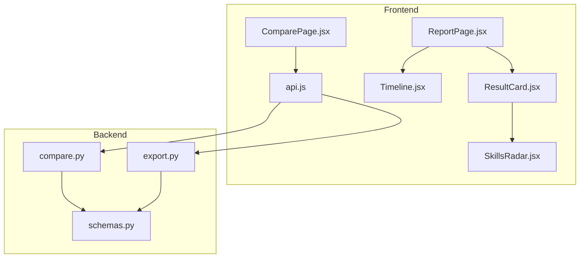
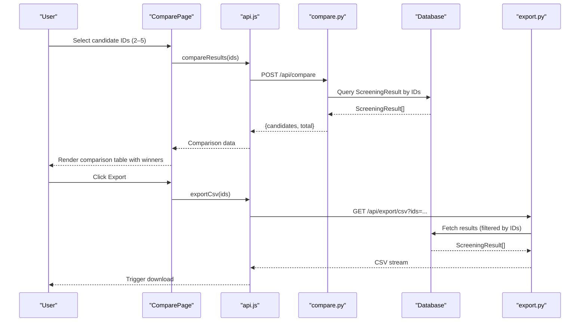
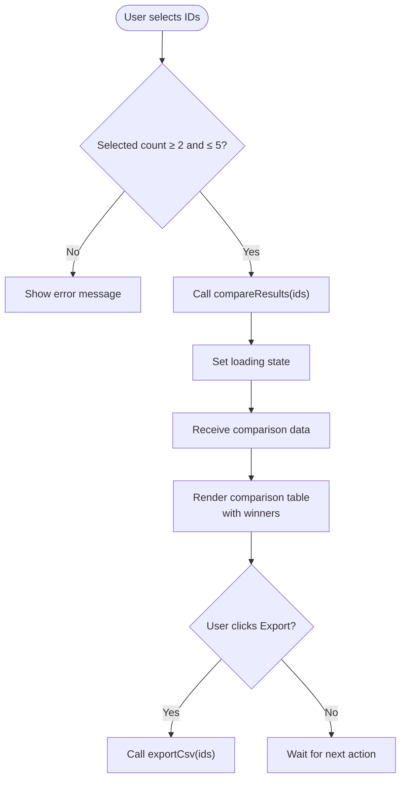
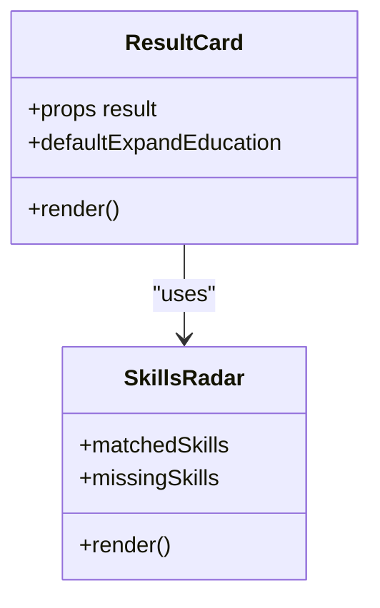
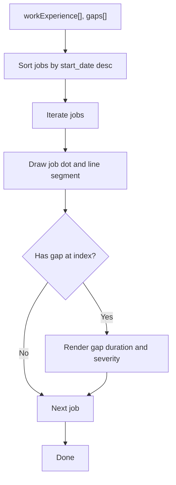
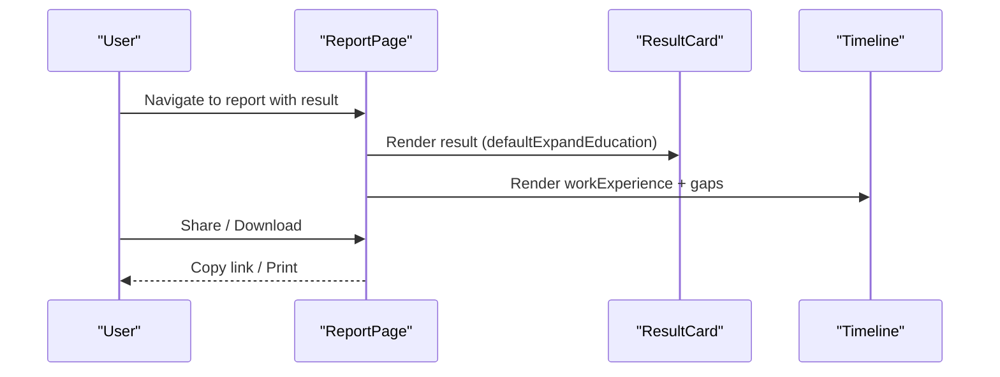
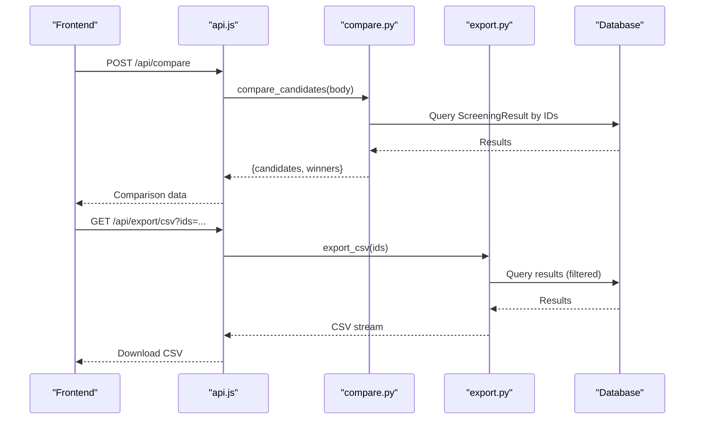
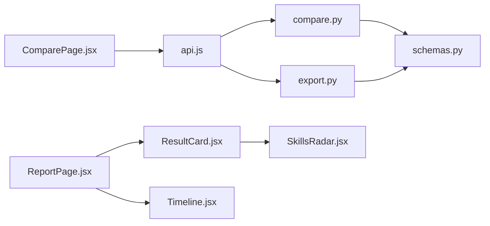

# Comparison & Visualization

<cite>
**Referenced Files in This Document**
- [ComparePage.jsx](file://app/frontend/src/pages/ComparePage.jsx)
- [ResultCard.jsx](file://app/frontend/src/components/ResultCard.jsx)
- [Timeline.jsx](file://app/frontend/src/components/Timeline.jsx)
- [SkillsRadar.jsx](file://app/frontend/src/components/SkillsRadar.jsx)
- [ReportPage.jsx](file://app/frontend/src/pages/ReportPage.jsx)
- [api.js](file://app/frontend/src/lib/api.js)
- [compare.py](file://app/backend/routes/compare.py)
- [export.py](file://app/backend/routes/export.py)
- [schemas.py](file://app/backend/models/schemas.py)
</cite>

## Table of Contents
1. [Introduction](#introduction)
2. [Project Structure](#project-structure)
3. [Core Components](#core-components)
4. [Architecture Overview](#architecture-overview)
5. [Detailed Component Analysis](#detailed-component-analysis)
6. [Dependency Analysis](#dependency-analysis)
7. [Performance Considerations](#performance-considerations)
8. [Troubleshooting Guide](#troubleshooting-guide)
9. [Conclusion](#conclusion)

## Introduction
This document explains the comparison and visualization features in Resume AI by ThetaLogics. It focuses on:
- Side-by-side candidate evaluation via ComparePage
- Individual result presentation via ResultCard
- Employment timeline visualization via Timeline
- Interactive skills visualization via SkillsRadar
- Export capabilities for comparison reports
- Customization options for scoring weights
- Performance considerations for large-scale comparisons

## Project Structure
The comparison and visualization features span the frontend React application and the backend FastAPI service:
- Frontend pages and components render comparison tables, result cards, timelines, and skills radar charts.
- Backend routes compute pairwise comparisons and export CSV/Excel reports.
- Shared schemas define the data structures used across the stack.

**Diagram sources**
- [ComparePage.jsx:1-230](file://app/frontend/src/pages/ComparePage.jsx#L1-L230)
- [ResultCard.jsx:1-627](file://app/frontend/src/components/ResultCard.jsx#L1-L627)
- [Timeline.jsx:1-115](file://app/frontend/src/components/Timeline.jsx#L1-L115)
- [SkillsRadar.jsx:1-261](file://app/frontend/src/components/SkillsRadar.jsx#L1-L261)
- [ReportPage.jsx:1-297](file://app/frontend/src/pages/ReportPage.jsx#L1-L297)
- [api.js:1-395](file://app/frontend/src/lib/api.js#L1-L395)
- [compare.py:1-78](file://app/backend/routes/compare.py#L1-L78)
- [export.py:1-105](file://app/backend/routes/export.py#L1-L105)
- [schemas.py:1-379](file://app/backend/models/schemas.py#L1-L379)

**Section sources**
- [ComparePage.jsx:1-230](file://app/frontend/src/pages/ComparePage.jsx#L1-L230)
- [ResultCard.jsx:1-627](file://app/frontend/src/components/ResultCard.jsx#L1-L627)
- [Timeline.jsx:1-115](file://app/frontend/src/components/Timeline.jsx#L1-L115)
- [SkillsRadar.jsx:1-261](file://app/frontend/src/components/SkillsRadar.jsx#L1-L261)
- [ReportPage.jsx:1-297](file://app/frontend/src/pages/ReportPage.jsx#L1-L297)
- [api.js:1-395](file://app/frontend/src/lib/api.js#L1-L395)
- [compare.py:1-78](file://app/backend/routes/compare.py#L1-L78)
- [export.py:1-105](file://app/backend/routes/export.py#L1-L105)
- [schemas.py:1-379](file://app/backend/models/schemas.py#L1-L379)

## Core Components
- ComparePage: Allows selecting 2–5 historical screening results and renders a comparison table with winners highlighted per category.
- ResultCard: Renders a comprehensive analysis result for a single candidate, including expandable sections for education, work experience, skills, and interview kit.
- Timeline: Visualizes employment history with gaps and highlights short tenures.
- SkillsRadar: Provides a category-wise skills gap visualization with matched/missing counts and a coverage percentage.
- ReportPage: Presents a full-screen report combining ResultCard and Timeline, with sharing and printing support.
- Backend compare route: Aggregates candidate results and determines winners per category.
- Backend export routes: Generate CSV and Excel exports for selected results.

**Section sources**
- [ComparePage.jsx:20-229](file://app/frontend/src/pages/ComparePage.jsx#L20-L229)
- [ResultCard.jsx:265-627](file://app/frontend/src/components/ResultCard.jsx#L265-L627)
- [Timeline.jsx:3-115](file://app/frontend/src/components/Timeline.jsx#L3-L115)
- [SkillsRadar.jsx:110-261](file://app/frontend/src/components/SkillsRadar.jsx#L110-L261)
- [ReportPage.jsx:82-297](file://app/frontend/src/pages/ReportPage.jsx#L82-L297)
- [compare.py:16-78](file://app/backend/routes/compare.py#L16-L78)
- [export.py:55-105](file://app/backend/routes/export.py#L55-L105)

## Architecture Overview
The comparison and visualization workflow connects frontend UI to backend APIs and models:

**Diagram sources**
- [ComparePage.jsx:42-54](file://app/frontend/src/pages/ComparePage.jsx#L42-L54)
- [api.js:176-187](file://app/frontend/src/lib/api.js#L176-L187)
- [compare.py:16-78](file://app/backend/routes/compare.py#L16-L78)
- [export.py:55-105](file://app/backend/routes/export.py#L55-L105)

## Detailed Component Analysis

### ComparePage: Side-by-Side Candidate Evaluation
- Selection logic: Users select up to five historical results. The selector enforces a minimum of two selections and a cap of five.
- Comparison computation: On submit, the page requests backend comparison for the selected IDs and displays a structured table.
- Winner indicators: Per-category winners are computed server-side and rendered with a trophy badge.
- Actions: Users can reset to a new comparison or export a CSV report for the selected IDs.

**Diagram sources**
- [ComparePage.jsx:34-54](file://app/frontend/src/pages/ComparePage.jsx#L34-L54)
- [api.js:176-179](file://app/frontend/src/lib/api.js#L176-L179)
- [compare.py:16-78](file://app/backend/routes/compare.py#L16-L78)
- [export.py:55-78](file://app/backend/routes/export.py#L55-L78)

**Section sources**
- [ComparePage.jsx:20-229](file://app/frontend/src/pages/ComparePage.jsx#L20-L229)
- [api.js:169-187](file://app/frontend/src/lib/api.js#L169-L187)
- [compare.py:16-78](file://app/backend/routes/compare.py#L16-L78)
- [export.py:55-105](file://app/backend/routes/export.py#L55-L105)

### ResultCard: Individual Analysis Results
- Presentation: Displays recommendation badge, risk level, and score breakdown.
- Expandable sections: Education analysis, domain fit/architecture assessment, strengths/weaknesses/risk signals, explainability rationale, and interview kit tabs.
- Skills visualization: Integrates SkillsRadar for category-wise matched/missing skills and coverage percentage.
- Email generation: Modal to generate tailored emails for shortlist/rejection/screening call scenarios.

**Diagram sources**
- [ResultCard.jsx:265-627](file://app/frontend/src/components/ResultCard.jsx#L265-L627)
- [SkillsRadar.jsx:110-261](file://app/frontend/src/components/SkillsRadar.jsx#L110-L261)

**Section sources**
- [ResultCard.jsx:265-627](file://app/frontend/src/components/ResultCard.jsx#L265-L627)
- [SkillsRadar.jsx:110-261](file://app/frontend/src/components/SkillsRadar.jsx#L110-L261)

### Timeline: Employment History Visualization
- Input: Work experience entries and employment gaps.
- Sorting: Jobs are sorted by start date descending.
- Rendering: Timeline bars with icons indicating short tenures and gap durations/severity.
- UX: Gap severity badges and short-tenure highlighting.

**Diagram sources**
- [Timeline.jsx:13-94](file://app/frontend/src/components/Timeline.jsx#L13-L94)

**Section sources**
- [Timeline.jsx:3-115](file://app/frontend/src/components/Timeline.jsx#L3-L115)

### SkillsRadar: Skills Gap Visualization
- Categorization: Skills are categorized into domains (e.g., Programming, DevOps, Data).
- Tally: Counts matched and missing skills per category.
- Coverage: Computes overall match percentage and visual progress indicator.
- Chart: Vertical bar chart showing matched vs missing per category with tooltips and legend.
- Chips: Lists matched and missing skills per category.

**Diagram sources**
- [SkillsRadar.jsx:113-139](file://app/frontend/src/components/SkillsRadar.jsx#L113-L139)
- [SkillsRadar.jsx:195-231](file://app/frontend/src/components/SkillsRadar.jsx#L195-L231)

**Section sources**
- [SkillsRadar.jsx:110-261](file://app/frontend/src/components/SkillsRadar.jsx#L110-L261)

### ReportPage: Full Report Composition
- Layout: Left sidebar for quick actions and labels; right panel for scrollable content.
- Content: Embeds ResultCard and Timeline for a comprehensive view.
- Sharing and printing: Copies shareable links to clipboard and triggers browser print dialog.

**Diagram sources**
- [ReportPage.jsx:82-297](file://app/frontend/src/pages/ReportPage.jsx#L82-L297)
- [ResultCard.jsx:265-627](file://app/frontend/src/components/ResultCard.jsx#L265-L627)
- [Timeline.jsx:3-115](file://app/frontend/src/components/Timeline.jsx#L3-L115)

**Section sources**
- [ReportPage.jsx:82-297](file://app/frontend/src/pages/ReportPage.jsx#L82-L297)

### Backend: Comparison and Export
- Comparison endpoint: Validates selection bounds, loads results for the tenant, extracts analysis fields, and computes winners per category.
- Export endpoints: CSV and Excel streams containing fit scores, recommendations, risk levels, skill metrics, and strengths/weaknesses.

**Diagram sources**
- [compare.py:16-78](file://app/backend/routes/compare.py#L16-L78)
- [export.py:55-105](file://app/backend/routes/export.py#L55-L105)
- [api.js:176-193](file://app/frontend/src/lib/api.js#L176-L193)

**Section sources**
- [compare.py:16-78](file://app/backend/routes/compare.py#L16-L78)
- [export.py:55-105](file://app/backend/routes/export.py#L55-L105)
- [schemas.py:89-125](file://app/backend/models/schemas.py#L89-L125)

## Dependency Analysis
- Frontend-to-backend contracts:
  - ComparePage uses api.compareResults and api.exportCsv.
  - ResultCard integrates SkillsRadar and uses api.generateEmail for email modal.
  - ReportPage composes ResultCard and Timeline and uses api.labelTrainingExample and api.updateResultStatus.
- Backend schemas:
  - AnalysisResponse defines the shape of candidate results used by both ComparePage and ReportPage.
  - CompareRequest validates incoming IDs for comparison.
- Backend routes:
  - compare.py aggregates results and computes winners.
  - export.py transforms results into CSV/Excel streams.

**Diagram sources**
- [ComparePage.jsx:1-4](file://app/frontend/src/pages/ComparePage.jsx#L1-L4)
- [ResultCard.jsx:1-9](file://app/frontend/src/components/ResultCard.jsx#L1-L9)
- [ReportPage.jsx:1-10](file://app/frontend/src/pages/ReportPage.jsx#L1-L10)
- [api.js:1-395](file://app/frontend/src/lib/api.js#L1-L395)
- [compare.py:1-13](file://app/backend/routes/compare.py#L1-L13)
- [export.py:1-17](file://app/backend/routes/export.py#L1-L17)
- [schemas.py:89-125](file://app/backend/models/schemas.py#L89-L125)

**Section sources**
- [ComparePage.jsx:1-4](file://app/frontend/src/pages/ComparePage.jsx#L1-L4)
- [ResultCard.jsx:1-9](file://app/frontend/src/components/ResultCard.jsx#L1-L9)
- [ReportPage.jsx:1-10](file://app/frontend/src/pages/ReportPage.jsx#L1-L10)
- [api.js:1-395](file://app/frontend/src/lib/api.js#L1-L395)
- [compare.py:1-13](file://app/backend/routes/compare.py#L1-L13)
- [export.py:1-17](file://app/backend/routes/export.py#L1-L17)
- [schemas.py:89-125](file://app/backend/models/schemas.py#L89-L125)

## Performance Considerations
- Frontend
  - Limit concurrent comparisons to 5 to prevent excessive DOM rendering and API load.
  - Debounce selection toggles and comparison requests to reduce unnecessary re-renders.
  - Lazy-load heavy components (e.g., SkillsRadar) only when expanded.
  - Virtualize long lists (e.g., interview questions) if they grow large.
- Backend
  - Use efficient database queries with tenant scoping and ID filtering.
  - Stream CSV/Excel responses to avoid large memory footprints.
  - Normalize scoring weights server-side to ensure deterministic computations.
- Data modeling
  - Keep analysis_result compact and indexed by tenant_id to minimize joins.
  - Cache recent comparison results per user session if appropriate.

[No sources needed since this section provides general guidance]

## Troubleshooting Guide
- Comparison errors
  - Ensure at least two and no more than five candidate IDs are selected.
  - Verify that all selected IDs correspond to the current tenant.
  - Confirm backend health and authentication tokens.
- Export failures
  - Check that ids query parameter is a comma-separated list of integers.
  - Ensure the user has permission to access the requested results.
- Timeline anomalies
  - Confirm that dates are valid ISO-like strings or “present”.
  - Short tenures are flagged below six months; adjust expectations accordingly.
- SkillsRadar empty state
  - SkillsRadar hides itself when both matched and missing skills are empty.
  - Verify that the underlying analysis populates matched_skills and missing_skills.

**Section sources**
- [ComparePage.jsx:42-54](file://app/frontend/src/pages/ComparePage.jsx#L42-L54)
- [compare.py:22-25](file://app/backend/routes/compare.py#L22-L25)
- [export.py:61-62](file://app/backend/routes/export.py#L61-L62)
- [Timeline.jsx:96-114](file://app/frontend/src/components/Timeline.jsx#L96-L114)

## Conclusion
The comparison and visualization features provide a cohesive workflow for evaluating candidates side-by-side, drilling into individual results, and exporting actionable insights. ComparePage orchestrates selection and comparison, ResultCard delivers rich, expandable insights, Timeline highlights career progression and gaps, and SkillsRadar offers a clear skills gap view. Backend routes ensure secure, tenant-scoped comparisons and efficient exports. With the suggested performance and troubleshooting guidance, teams can scale these features effectively for large-scale hiring workflows.