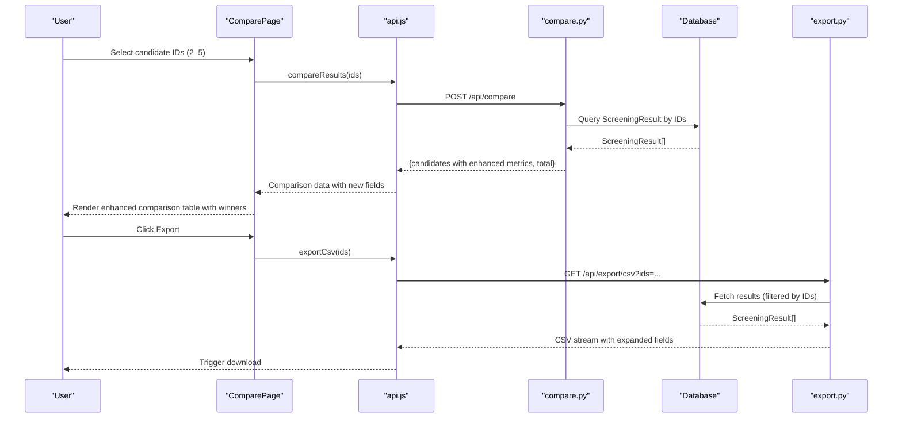
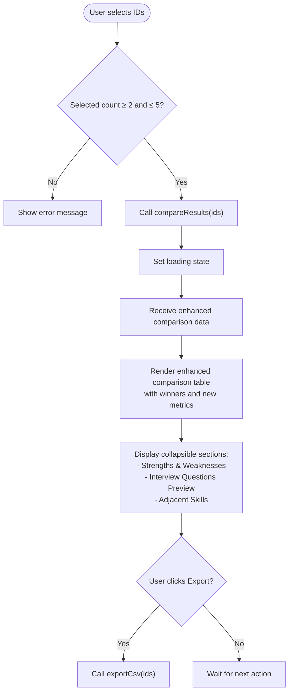
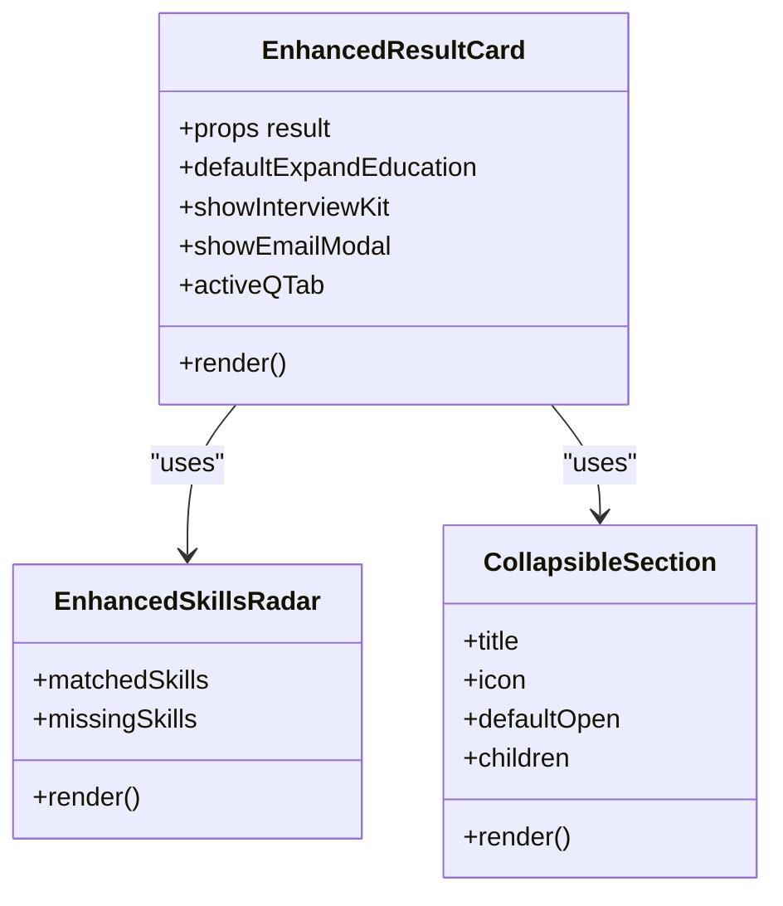
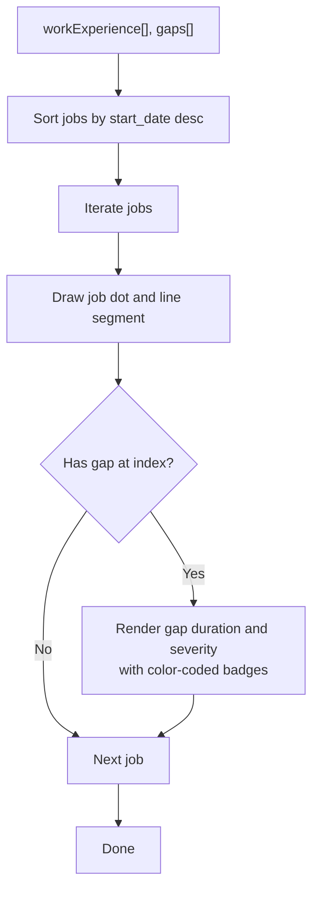
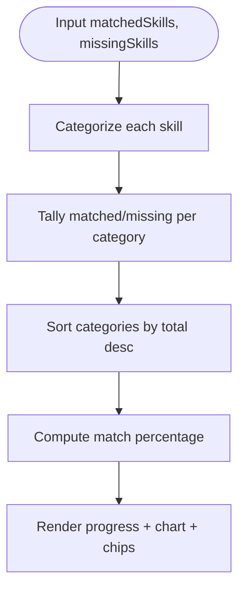
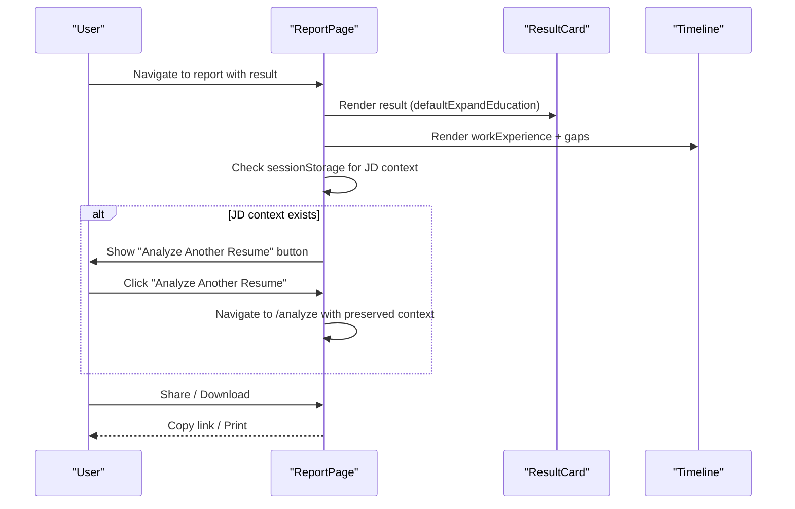
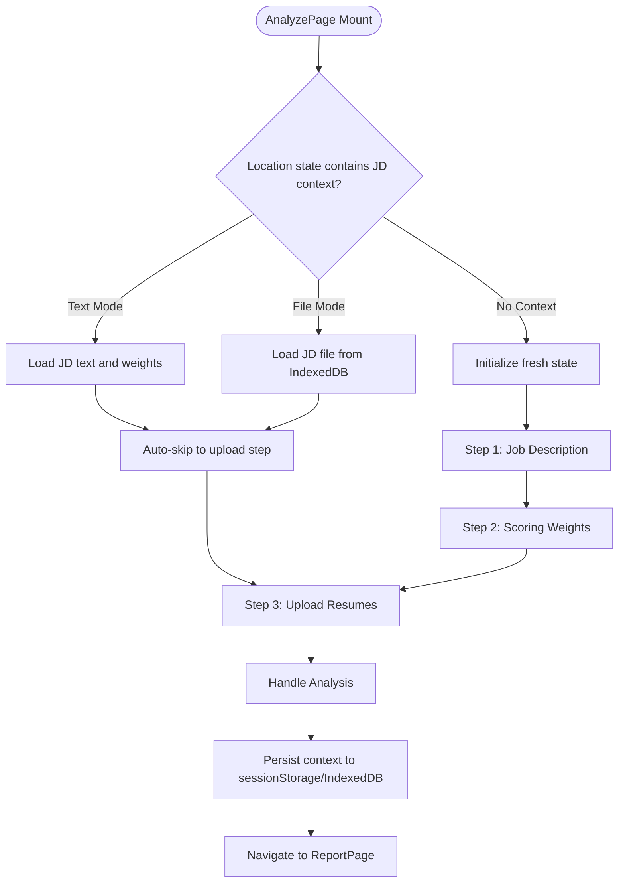
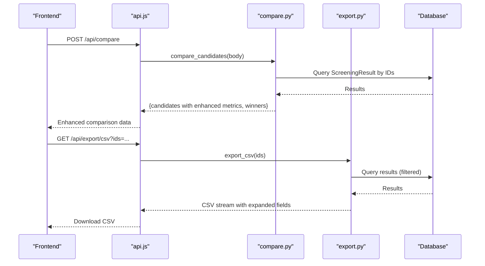
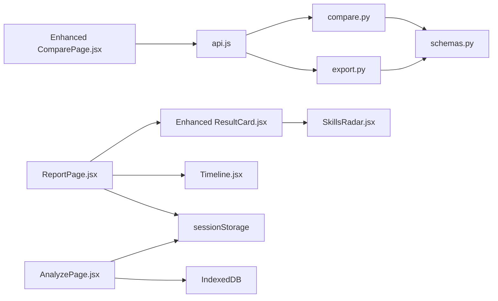

# Comparison & Visualization

<cite>
**Referenced Files in This Document**
- [ComparePage.jsx](file://app/frontend/src/pages/ComparePage.jsx)
- [ResultCard.jsx](file://app/frontend/src/components/ResultCard.jsx)
- [Timeline.jsx](file://app/frontend/src/components/Timeline.jsx)
- [SkillsRadar.jsx](file://app/frontend/src/components/SkillsRadar.jsx)
- [ReportPage.jsx](file://app/frontend/src/pages/ReportPage.jsx)
- [AnalyzePage.jsx](file://app/frontend/src/pages/AnalyzePage.jsx)
- [api.js](file://app/frontend/src/lib/api.js)
- [compare.py](file://app/backend/routes/compare.py)
- [export.py](file://app/backend/routes/export.py)
- [schemas.py](file://app/backend/models/schemas.py)
</cite>

## Update Summary
**Changes Made**
- Enhanced ReportPage with intelligent context detection for both text-mode and file-mode job descriptions
- Implemented seamless 'Analyze Another Resume' workflow using sessionStorage persistence
- Added JD context preservation including file names and weights for recurring analysis workflows
- Enhanced backend comparison endpoint with additional fields including analysis quality ratings
- Updated ComparePage with collapsible sections for strengths/weaknesses, interview questions preview, and adjacent skills
- Enhanced ResultCard with improved collapsible sections and analysis quality badges

## Table of Contents
1. [Introduction](#introduction)
2. [Project Structure](#project-structure)
3. [Core Components](#core-components)
4. [Architecture Overview](#architecture-overview)
5. [Detailed Component Analysis](#detailed-component-analysis)
6. [Dependency Analysis](#dependency-analysis)
7. [Performance Considerations](#performance-considerations)
8. [Troubleshooting Guide](#troubleshooting-guide)
9. [Conclusion](#conclusion)

## Introduction
This document explains the comparison and visualization features in Resume AI by ThetaLogics. It focuses on:
- Side-by-side candidate evaluation via ComparePage with enhanced metrics
- Individual result presentation via ResultCard with collapsible sections
- Employment timeline visualization via Timeline with gap analysis
- Interactive skills visualization via SkillsRadar with category breakdown
- Export capabilities for comparison reports with enhanced data
- Customization options for scoring weights
- Performance considerations for large-scale comparisons
- Enhanced ReportPage with intelligent 'Analyze Another Resume' workflow and context persistence

## Project Structure
The comparison and visualization features span the frontend React application and the backend FastAPI service:
- Frontend pages and components render comparison tables, result cards, timelines, and skills radar charts.
- Backend routes compute pairwise comparisons and export CSV/Excel reports.
- Shared schemas define the data structures used across the stack.

```mermaid
graph TB
subgraph "Frontend"
CP["ComparePage.jsx"]
RC["ResultCard.jsx"]
TL["Timeline.jsx"]
SR["SkillsRadar.jsx"]
RP["ReportPage.jsx"]
AP["AnalyzePage.jsx"]
API["api.js"]
END["Enhanced Collapsible Sections"]
BADGE["Quality Badges"]
SC["Score Cells"]
ANALYZE["Analyze Another Resume"]
JDCTX["JD Context Persistence"]
API --> CP
API --> RC
API --> TL
API --> SR
API --> RP
API --> AP
CP --> API
RC --> SR
RP --> RC
RP --> TL
RP --> ANALYZE
RP --> JDCTX
AP --> JDCTX
```

**Diagram sources**
- [ComparePage.jsx:1-380](file://app/frontend/src/pages/ComparePage.jsx#L1-L380)
- [ResultCard.jsx:1-844](file://app/frontend/src/components/ResultCard.jsx#L1-L844)
- [Timeline.jsx:1-123](file://app/frontend/src/components/Timeline.jsx#L1-L123)
- [SkillsRadar.jsx:1-261](file://app/frontend/src/components/SkillsRadar.jsx#L1-L261)
- [ReportPage.jsx:1-552](file://app/frontend/src/pages/ReportPage.jsx#L1-L552)
- [AnalyzePage.jsx:1-1004](file://app/frontend/src/pages/AnalyzePage.jsx#L1-L1004)
- [api.js:1-952](file://app/frontend/src/lib/api.js#L1-L952)
- [compare.py:1-159](file://app/backend/routes/compare.py#L1-L159)
- [export.py:1-105](file://app/backend/routes/export.py#L1-L105)
- [schemas.py:89-125](file://app/backend/models/schemas.py#L89-L125)

**Section sources**
- [ComparePage.jsx:1-380](file://app/frontend/src/pages/ComparePage.jsx#L1-L380)
- [ResultCard.jsx:1-844](file://app/frontend/src/components/ResultCard.jsx#L1-L844)
- [Timeline.jsx:1-123](file://app/frontend/src/components/Timeline.jsx#L1-L123)
- [SkillsRadar.jsx:1-261](file://app/frontend/src/components/SkillsRadar.jsx#L1-L261)
- [ReportPage.jsx:1-552](file://app/frontend/src/pages/ReportPage.jsx#L1-L552)
- [AnalyzePage.jsx:1-1004](file://app/frontend/src/pages/AnalyzePage.jsx#L1-L1004)
- [api.js:1-952](file://app/frontend/src/lib/api.js#L1-L952)
- [compare.py:1-159](file://app/backend/routes/compare.py#L1-L159)
- [export.py:1-105](file://app/backend/routes/export.py#L1-L105)
- [schemas.py:89-125](file://app/backend/models/schemas.py#L89-L125)

## Core Components
- **Enhanced ComparePage**: Allows selecting 2–5 historical screening results and renders a comparison table with winners highlighted per category, plus new metrics including top 3 strengths/weaknesses, employment gap counts, interview question previews, and analysis quality ratings.
- **ResultCard**: Renders a comprehensive analysis result for a single candidate with collapsible sections for education, work experience, skills, and interview kit.
- **Timeline**: Visualizes employment history with gaps and highlights short tenures with severity indicators.
- **SkillsRadar**: Provides a category-wise skills gap visualization with matched/missing counts and a coverage percentage.
- **ReportPage**: Presents a full-screen report combining ResultCard and Timeline, with sharing and printing support, and enhanced 'Analyze Another Resume' workflow.
- **AnalyzePage**: Handles job description input, scoring weights configuration, and resume analysis with intelligent context persistence.
- **Backend compare route**: Aggregates candidate results and determines winners per category with enhanced data extraction.
- **Backend export routes**: Generate CSV and Excel exports for selected results with expanded field coverage.

**Updated** Enhanced ComparePage now includes collapsible sections for strengths/weaknesses, interview questions preview, and adjacent skills, plus quality badges and enhanced comparison metrics. ReportPage now features seamless 'Analyze Another Resume' workflow with intelligent context detection for both text-mode and file-mode job descriptions, preserving JD context including file names and weights.

**Section sources**
- [ComparePage.jsx:56-380](file://app/frontend/src/pages/ComparePage.jsx#L56-L380)
- [ResultCard.jsx:262-844](file://app/frontend/src/components/ResultCard.jsx#L262-L844)
- [Timeline.jsx:3-123](file://app/frontend/src/components/Timeline.jsx#L3-L123)
- [SkillsRadar.jsx:110-261](file://app/frontend/src/components/SkillsRadar.jsx#L110-L261)
- [ReportPage.jsx:421-440](file://app/frontend/src/pages/ReportPage.jsx#L421-L440)
- [AnalyzePage.jsx:350-370](file://app/frontend/src/pages/AnalyzePage.jsx#L350-L370)
- [compare.py:16-159](file://app/backend/routes/compare.py#L16-L159)
- [export.py:55-105](file://app/backend/routes/export.py#L55-L105)

## Architecture Overview
The comparison and visualization workflow connects frontend UI to backend APIs and models with enhanced data processing and context persistence:



**Diagram sources**
- [ComparePage.jsx:78-90](file://app/frontend/src/pages/ComparePage.jsx#L78-L90)
- [api.js:526-529](file://app/frontend/src/lib/api.js#L526-L529)
- [compare.py:16-159](file://app/backend/routes/compare.py#L16-L159)
- [export.py:55-105](file://app/backend/routes/export.py#L55-L105)

## Detailed Component Analysis

### Enhanced ComparePage: Side-by-Side Candidate Evaluation
- **Selection logic**: Users select up to five historical results. The selector enforces a minimum of two selections and a cap of five.
- **Enhanced comparison computation**: On submit, the page requests backend comparison for the selected IDs and displays an enhanced structured table with new metrics.
- **Winner indicators**: Per-category winners are computed server-side and rendered with a trophy badge.
- **New metrics display**: Enhanced table now includes employment gap counts, analysis quality ratings, and top 3 strengths/weaknesses.
- **Collapsible sections**: Three new collapsible sections for strengths/weaknesses, interview questions preview, and adjacent skills.
- **Quality badges**: Color-coded badges for analysis quality (high, medium, low) with visual indicators.
- **Actions**: Users can reset to a new comparison or export a CSV report for the selected IDs.



**Updated** Enhanced ComparePage now processes additional fields from the backend including top 3 strengths/weaknesses, employment gap counts, interview question previews, analysis quality ratings, and adjacent skills.

**Diagram sources**
- [ComparePage.jsx:78-90](file://app/frontend/src/pages/ComparePage.jsx#L78-L90)
- [compare.py:130-139](file://app/backend/routes/compare.py#L130-L139)
- [ComparePage.jsx:282-373](file://app/frontend/src/pages/ComparePage.jsx#L282-L373)

**Section sources**
- [ComparePage.jsx:56-380](file://app/frontend/src/pages/ComparePage.jsx#L56-L380)
- [api.js:526-529](file://app/frontend/src/lib/api.js#L526-L529)
- [compare.py:16-159](file://app/backend/routes/compare.py#L16-L159)
- [export.py:55-105](file://app/backend/routes/export.py#L55-L105)

### Enhanced ResultCard: Individual Analysis Results
- **Presentation**: Displays recommendation badge, risk level, and score breakdown.
- **Collapsible sections**: Enhanced with collapsible sections for education analysis, domain fit/architecture assessment, strengths/weaknesses/risk signals, explainability rationale, and interview kit tabs.
- **Skills visualization**: Integrates SkillsRadar for category-wise matched/missing skills and coverage percentage.
- **Email generation**: Modal to generate tailored emails for shortlist/rejection/screening call scenarios.
- **Analysis quality badges**: Enhanced with quality badges showing analysis quality ratings and AI enhancement status.



**Updated** ResultCard now includes enhanced collapsible sections system and analysis quality badges for better user experience.

**Diagram sources**
- [ResultCard.jsx:262-844](file://app/frontend/src/components/ResultCard.jsx#L262-L844)
- [SkillsRadar.jsx:110-261](file://app/frontend/src/components/SkillsRadar.jsx#L110-L261)
- [ResultCard.jsx:65-90](file://app/frontend/src/components/ResultCard.jsx#L65-L90)

**Section sources**
- [ResultCard.jsx:262-844](file://app/frontend/src/components/ResultCard.jsx#L262-L844)
- [SkillsRadar.jsx:110-261](file://app/frontend/src/components/SkillsRadar.jsx#L110-L261)

### Timeline: Employment History Visualization
- **Input**: Work experience entries and employment gaps.
- **Sorting**: Jobs are sorted by start date descending.
- **Rendering**: Timeline bars with icons indicating short tenures and gap durations/severity.
- **UX**: Gap severity badges and short-tenure highlighting with enhanced gap analysis.



**Updated** Timeline now includes enhanced gap analysis with severity indicators and duration display.

**Diagram sources**
- [Timeline.jsx:13-123](file://app/frontend/src/components/Timeline.jsx#L13-L123)

**Section sources**
- [Timeline.jsx:3-123](file://app/frontend/src/components/Timeline.jsx#L3-L123)

### SkillsRadar: Skills Gap Visualization
- **Categorization**: Skills are categorized into domains (e.g., Programming, DevOps, Data).
- **Tally**: Counts matched and missing skills per category.
- **Coverage**: Computes overall match percentage and visual progress indicator.
- **Chart**: Vertical bar chart showing matched vs missing per category with tooltips and legend.
- **Chips**: Lists matched and missing skills per category.



**Diagram sources**
- [SkillsRadar.jsx:113-139](file://app/frontend/src/components/SkillsRadar.jsx#L113-L139)
- [SkillsRadar.jsx:195-231](file://app/frontend/src/components/SkillsRadar.jsx#L195-L231)

**Section sources**
- [SkillsRadar.jsx:110-261](file://app/frontend/src/components/SkillsRadar.jsx#L110-L261)

### ReportPage: Full Report Composition with Enhanced Workflow
- **Layout**: Left sidebar for quick actions and labels; right panel for scrollable content.
- **Content**: Embeds ResultCard and Timeline for a comprehensive view.
- **Sharing and printing**: Copies shareable links to clipboard and triggers browser print dialog.
- **Enhanced workflow**: Detects persisted job description context and provides 'Analyze Another Resume' button for seamless workflow continuation.
- **Context persistence**: Uses sessionStorage to store JD text, weights, and role category for cross-page continuity.



**Updated** ReportPage now includes enhanced 'Analyze Another Resume' workflow with automatic context detection and preservation using sessionStorage. The system intelligently handles both text-mode and file-mode job descriptions, preserving JD context including file names and weights when users navigate back to analyze page.

**Diagram sources**
- [ReportPage.jsx:421-440](file://app/frontend/src/pages/ReportPage.jsx#L421-L440)
- [ReportPage.jsx:112-120](file://app/frontend/src/pages/ReportPage.jsx#L112-L120)
- [AnalyzePage.jsx:279-286](file://app/frontend/src/pages/AnalyzePage.jsx#L279-L286)

**Section sources**
- [ReportPage.jsx:1-552](file://app/frontend/src/pages/ReportPage.jsx#L1-L552)

### AnalyzePage: Intelligent Job Description Context Management
- **Job Description Modes**: Supports text, file, and URL extraction modes for job descriptions.
- **Context Persistence**: Automatically persists JD context to sessionStorage for seamless workflow continuation.
- **File Mode Handling**: Uses IndexedDB for storing JD files with automatic retrieval when returning from ReportPage.
- **Weight Preservation**: Maintains scoring weights and role category across analysis sessions.
- **Auto-navigation**: Automatically advances to upload step when returning with valid context.



**Updated** AnalyzePage now includes intelligent context management with automatic persistence of both text-mode and file-mode job descriptions, ensuring seamless workflow continuity across analysis sessions.

**Diagram sources**
- [AnalyzePage.jsx:350-370](file://app/frontend/src/pages/AnalyzePage.jsx#L350-L370)
- [AnalyzePage.jsx:193-217](file://app/frontend/src/pages/AnalyzePage.jsx#L193-L217)

**Section sources**
- [AnalyzePage.jsx:1-1004](file://app/frontend/src/pages/AnalyzePage.jsx#L1-L1004)

### Enhanced Backend: Comparison and Export
- **Comparison endpoint**: Validates selection bounds, loads results for the tenant, extracts enhanced analysis fields including top 3 strengths/weaknesses, employment gap counts, interview question previews, and analysis quality ratings, and computes winners per category.
- **Export endpoints**: CSV and Excel streams containing expanded fit scores, recommendations, risk levels, skill metrics, strengths/weaknesses, and new analysis quality fields.



**Updated** Backend now processes additional analysis fields including top 3 strengths/weaknesses, employment gap counts, interview question previews, analysis quality ratings, and adjacent skills.

**Diagram sources**
- [compare.py:16-159](file://app/backend/routes/compare.py#L16-L159)
- [export.py:55-105](file://app/backend/routes/export.py#L55-L105)
- [api.js:526-543](file://app/frontend/src/lib/api.js#L526-L543)

**Section sources**
- [compare.py:16-159](file://app/backend/routes/compare.py#L16-L159)
- [export.py:55-105](file://app/backend/routes/export.py#L55-L105)
- [schemas.py:89-125](file://app/backend/models/schemas.py#L89-L125)

## Dependency Analysis
- **Frontend-to-backend contracts**:
  - ComparePage uses api.compareResults and api.exportCsv with enhanced data structures.
  - ResultCard integrates SkillsRadar and uses api.generateEmail for email modal with enhanced analysis quality badges.
  - ReportPage composes ResultCard and Timeline and uses api.labelTrainingExample and api.updateResultStatus.
  - ReportPage uses sessionStorage for context persistence and navigation to AnalyzePage.
  - AnalyzePage manages JD context persistence using both sessionStorage and IndexedDB.
- **Backend schemas**:
  - AnalysisResponse defines the shape of candidate results used by both ComparePage and ReportPage with enhanced fields.
  - CompareRequest validates incoming IDs for comparison.
- **Backend routes**:
  - compare.py aggregates results and computes winners with enhanced data extraction.
  - export.py transforms results into CSV/Excel streams with expanded field coverage.



**Updated** Dependencies now reflect enhanced data structures, new components in ComparePage, context persistence mechanisms in ReportPage, and intelligent context management in AnalyzePage.

**Diagram sources**
- [ComparePage.jsx:1-380](file://app/frontend/src/pages/ComparePage.jsx#L1-L380)
- [ResultCard.jsx:1-844](file://app/frontend/src/components/ResultCard.jsx#L1-L844)
- [ReportPage.jsx:1-552](file://app/frontend/src/pages/ReportPage.jsx#L1-L552)
- [AnalyzePage.jsx:1-1004](file://app/frontend/src/pages/AnalyzePage.jsx#L1-L1004)
- [api.js:1-952](file://app/frontend/src/lib/api.js#L1-L952)
- [compare.py:1-159](file://app/backend/routes/compare.py#L1-L159)
- [export.py:1-105](file://app/backend/routes/export.py#L1-L105)
- [schemas.py:89-125](file://app/backend/models/schemas.py#L89-L125)

**Section sources**
- [ComparePage.jsx:1-380](file://app/frontend/src/pages/ComparePage.jsx#L1-L380)
- [ResultCard.jsx:1-844](file://app/frontend/src/components/ResultCard.jsx#L1-L844)
- [ReportPage.jsx:1-552](file://app/frontend/src/pages/ReportPage.jsx#L1-L552)
- [AnalyzePage.jsx:1-1004](file://app/frontend/src/pages/AnalyzePage.jsx#L1-L1004)
- [api.js:1-952](file://app/frontend/src/lib/api.js#L1-L952)
- [compare.py:1-159](file://app/backend/routes/compare.py#L1-L159)
- [export.py:1-105](file://app/backend/routes/export.py#L1-L105)
- [schemas.py:89-125](file://app/backend/models/schemas.py#L89-L125)

## Performance Considerations
- **Frontend**
  - Limit concurrent comparisons to 5 to prevent excessive DOM rendering and API load.
  - Debounce selection toggles and comparison requests to reduce unnecessary re-renders.
  - Lazy-load heavy components (e.g., SkillsRadar) only when expanded.
  - Virtualize long lists (e.g., interview questions) if they grow large.
  - **Enhanced**: Collapsible sections reduce initial render complexity and improve perceived performance.
  - **Enhanced**: Quality badges use simple color mapping for efficient rendering.
  - **Enhanced**: Context persistence using sessionStorage avoids expensive re-computation of job descriptions.
  - **Enhanced**: Intelligent context detection minimizes redundant data entry and improves workflow efficiency.
- **Backend**
  - Use efficient database queries with tenant scoping and ID filtering.
  - Stream CSV/Excel responses to avoid large memory footprints.
  - Normalize scoring weights server-side to ensure deterministic computations.
  - **Enhanced**: Extract only top 3 strengths/weaknesses and limited interview questions to reduce payload size.
  - **Enhanced**: Calculate employment gap counts server-side to avoid client-side processing overhead.
- **Data modeling**
  - Keep analysis_result compact and indexed by tenant_id to minimize joins.
  - Cache recent comparison results per user session if appropriate.
  - **Enhanced**: Store analysis quality ratings and adjacent skills for faster retrieval.
  - **Enhanced**: Implement IndexedDB caching for JD files to reduce network overhead.

## Troubleshooting Guide
- **Comparison errors**
  - Ensure at least two and no more than five candidate IDs are selected.
  - Verify that all selected IDs correspond to the current tenant.
  - Confirm backend health and authentication tokens.
  - **Enhanced**: Check that enhanced fields (top 3 strengths/weaknesses, gap counts, question previews) are properly populated.
- **Export failures**
  - Check that ids query parameter is a comma-separated list of integers.
  - Ensure the user has permission to access the requested results.
  - **Enhanced**: Verify that expanded export fields (analysis quality, adjacent skills) are included in CSV/Excel output.
- **Timeline anomalies**
  - Confirm that dates are valid ISO-like strings or "present".
  - Short tenures are flagged below six months; adjust expectations accordingly.
  - **Enhanced**: Verify gap severity calculations and duration formatting.
- **SkillsRadar empty state**
  - SkillsRadar hides itself when both matched and missing skills are empty.
  - Verify that the underlying analysis populates matched_skills and missing_skills.
- **Collapsible section issues**
  - **Enhanced**: Ensure collapsible sections render properly with default open states.
  - Verify that section content is accessible and keyboard navigable.
- **Quality badge display**
  - **Enhanced**: Check that quality badges display correct colors for high/medium/low ratings.
  - Verify that analysis quality data is properly extracted from analysis results.
- **Analyze Another Resume workflow issues**
  - **Enhanced**: Verify that sessionStorage contains 'aria_active_jd' with proper JD context.
  - Check that the 'Analyze Another Resume' button appears when JD context is detected.
  - Ensure navigation to /analyze preserves jd_text, weights, and role_category in state.
  - **Enhanced**: For file-mode contexts, verify IndexedDB caching is working correctly.
  - **Enhanced**: Check that file names are properly preserved in sessionStorage for file-mode workflows.
- **Context persistence problems**
  - **Enhanced**: Verify that sessionStorage.setItem and getItem operations are working correctly.
  - **Enhanced**: Check that JSON parsing errors are handled gracefully for corrupted context data.
  - **Enhanced**: Ensure IndexedDB operations are properly wrapped in try-catch blocks.

**Updated** Added troubleshooting guidance for new enhanced features including collapsible sections, quality badges, expanded data fields, and the new 'Analyze Another Resume' workflow with intelligent context detection for both text-mode and file-mode job descriptions.

**Section sources**
- [ComparePage.jsx:78-90](file://app/frontend/src/pages/ComparePage.jsx#L78-L90)
- [compare.py:22-25](file://app/backend/routes/compare.py#L22-L25)
- [export.py:61-62](file://app/backend/routes/export.py#L61-L62)
- [Timeline.jsx:104-123](file://app/frontend/src/components/Timeline.jsx#L104-L123)
- [ReportPage.jsx:112-120](file://app/frontend/src/pages/ReportPage.jsx#L112-L120)
- [ReportPage.jsx:421-440](file://app/frontend/src/pages/ReportPage.jsx#L421-L440)
- [AnalyzePage.jsx:350-370](file://app/frontend/src/pages/AnalyzePage.jsx#L350-L370)

## Conclusion
The comparison and visualization features provide a cohesive workflow for evaluating candidates side-by-side with enhanced metrics and insights. The enhanced ComparePage now offers comprehensive comparison capabilities including top 3 strengths/weaknesses, employment gap analysis, interview question previews, and quality ratings. ResultCard delivers rich, expandable insights through collapsible sections, while Timeline highlights career progression and gaps with severity indicators. SkillsRadar offers a clear skills gap view with category breakdowns. Backend routes ensure secure, tenant-scoped comparisons with enhanced data extraction and efficient exports. The new collapsible section system improves user experience by organizing information hierarchically, while quality badges provide immediate visual assessment of analysis reliability. 

**Enhanced ReportPage** introduces a seamless 'Analyze Another Resume' workflow that maintains context persistence across sessions using sessionStorage and IndexedDB. The system intelligently detects previously analyzed job descriptions in both text-mode and file-mode, automatically preserving JD context including file names and weights when users navigate back to analyze page. This enhancement significantly improves workflow efficiency and reduces redundant data entry, making the platform more intuitive for recruiters who frequently analyze multiple candidates for the same position. The intelligent context detection ensures that users can continue their analysis workflows without losing important scoring weights or job description details, whether they used text-based JD input or uploaded JD files.

With the enhanced performance optimizations, comprehensive troubleshooting guidance, and improved context persistence mechanisms, teams can scale these features effectively for large-scale hiring workflows with richer comparative insights and streamlined analysis processes.