# Dashboard Components

<cite>
**Referenced Files in This Document**
- [Dashboard.jsx](file://app/frontend/src/pages/Dashboard.jsx)
- [ReportPage.jsx](file://app/frontend/src/pages/ReportPage.jsx)
- [ScoreGauge.jsx](file://app/frontend/src/components/ScoreGauge.jsx)
- [SkillsRadar.jsx](file://app/frontend/src/components/SkillsRadar.jsx)
- [ResultCard.jsx](file://app/frontend/src/components/ResultCard.jsx)
- [UploadForm.jsx](file://app/frontend/src/components/UploadForm.jsx)
- [api.js](file://app/frontend/src/lib/api.js)
- [useSubscription.jsx](file://app/frontend/src/hooks/useSubscription.jsx)
- [App.jsx](file://app/frontend/src/App.jsx)
- [AppShell.jsx](file://app/frontend/src/components/AppShell.jsx)
- [tailwind.config.js](file://app/frontend/tailwind.config.js)
</cite>

## Table of Contents
1. [Introduction](#introduction)
2. [Project Structure](#project-structure)
3. [Core Components](#core-components)
4. [Architecture Overview](#architecture-overview)
5. [Detailed Component Analysis](#detailed-component-analysis)
6. [Dependency Analysis](#dependency-analysis)
7. [Performance Considerations](#performance-considerations)
8. [Troubleshooting Guide](#troubleshooting-guide)
9. [Conclusion](#conclusion)
10. [Appendices](#appendices)

## Introduction
This document explains the dashboard components in Resume AI by ThetaLogics, focusing on the main dashboard page layout, score visualization, skills radar visualization, real-time metrics, candidate overview, and performance indicators. It also covers customization options, data filtering, responsive design, and practical examples for extending the dashboard with new visualization components and integrating with the backend analytics API.

## Project Structure
The dashboard is built with React and Vite, styled with Tailwind CSS. The main dashboard page orchestrates the upload form, real-time pipeline progress, and usage metrics. Reports are rendered in a dedicated page that integrates score gauges and result cards. The design system uses a cohesive brand palette and consistent spacing/shadow tokens.

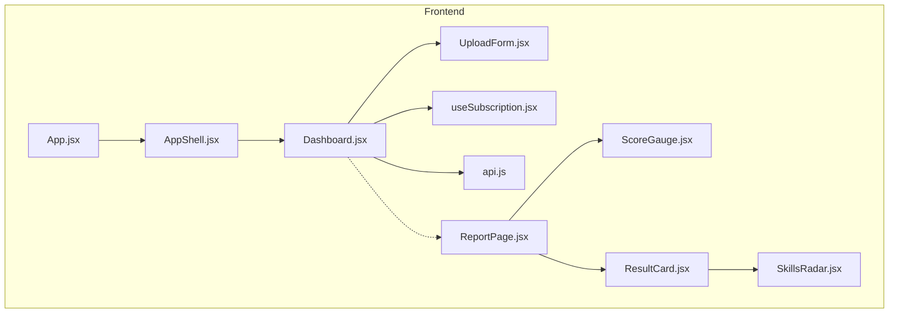

**Diagram sources**
- [App.jsx:39-61](file://app/frontend/src/App.jsx#L39-L61)
- [AppShell.jsx:3-12](file://app/frontend/src/components/AppShell.jsx#L3-L12)
- [Dashboard.jsx:204-329](file://app/frontend/src/pages/Dashboard.jsx#L204-L329)
- [ReportPage.jsx:82-296](file://app/frontend/src/pages/ReportPage.jsx#L82-L296)
- [UploadForm.jsx:77-483](file://app/frontend/src/components/UploadForm.jsx#L77-L483)
- [ScoreGauge.jsx:1-97](file://app/frontend/src/components/ScoreGauge.jsx#L1-L97)
- [SkillsRadar.jsx:110-261](file://app/frontend/src/components/SkillsRadar.jsx#L110-L261)
- [ResultCard.jsx:265-627](file://app/frontend/src/components/ResultCard.jsx#L265-L627)
- [api.js:47-147](file://app/frontend/src/lib/api.js#L47-L147)
- [useSubscription.jsx:6-158](file://app/frontend/src/hooks/useSubscription.jsx#L6-L158)

**Section sources**
- [App.jsx:39-61](file://app/frontend/src/App.jsx#L39-L61)
- [AppShell.jsx:3-12](file://app/frontend/src/components/AppShell.jsx#L3-L12)
- [tailwind.config.js:8-47](file://app/frontend/tailwind.config.js#L8-L47)

## Core Components
- Dashboard page: Orchestrates upload form, real-time pipeline progress, and usage metrics.
- UploadForm: Handles resume/job description inputs, scoring weights, and submission.
- ScoreGauge: Visualizes fit score with thresholds and animated transitions.
- SkillsRadar: Renders skills gap analysis with category breakdowns and coverage metrics.
- ResultCard: Comprehensive report card with score breakdowns, strengths/weaknesses, explainability, and interview kit.
- ReportPage: Dedicated page for displaying a single result with sidebar controls and print/download actions.
- Subscription hook: Provides usage statistics and plan limits for dashboard widgets.
- API client: Encapsulates backend communication, including streaming analysis.

**Section sources**
- [Dashboard.jsx:204-329](file://app/frontend/src/pages/Dashboard.jsx#L204-L329)
- [UploadForm.jsx:77-483](file://app/frontend/src/components/UploadForm.jsx#L77-L483)
- [ScoreGauge.jsx:1-97](file://app/frontend/src/components/ScoreGauge.jsx#L1-L97)
- [SkillsRadar.jsx:110-261](file://app/frontend/src/components/SkillsRadar.jsx#L110-L261)
- [ResultCard.jsx:265-627](file://app/frontend/src/components/ResultCard.jsx#L265-L627)
- [ReportPage.jsx:82-296](file://app/frontend/src/pages/ReportPage.jsx#L82-L296)
- [useSubscription.jsx:6-158](file://app/frontend/src/hooks/useSubscription.jsx#L6-L158)
- [api.js:47-147](file://app/frontend/src/lib/api.js#L47-L147)

## Architecture Overview
The dashboard follows a layered architecture:
- Presentation layer: Pages and components render UI and manage state.
- Business logic: Dashboard orchestrates analysis lifecycle and progress tracking.
- Data layer: API client handles requests and streaming responses.
- State management: Subscription provider supplies usage and plan data.

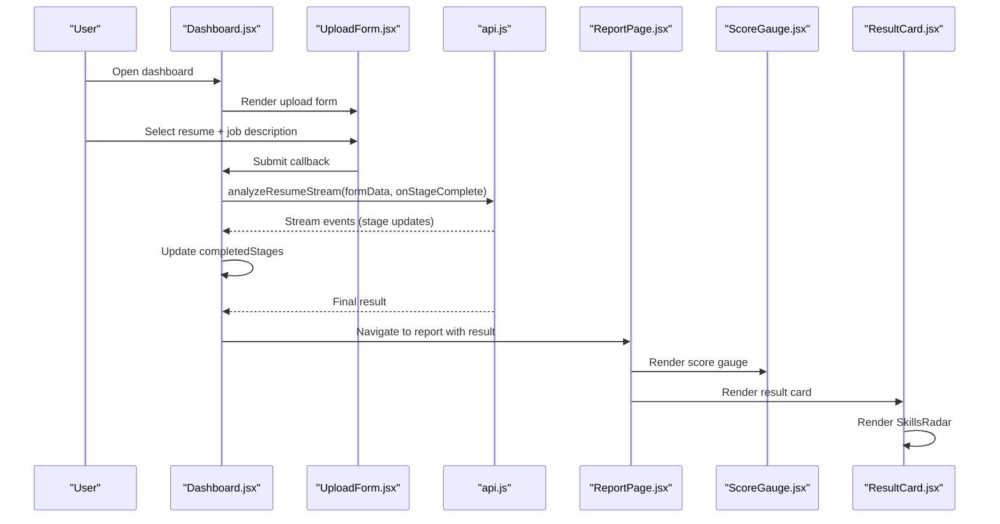

**Diagram sources**
- [Dashboard.jsx:243-275](file://app/frontend/src/pages/Dashboard.jsx#L243-L275)
- [UploadForm.jsx:459-479](file://app/frontend/src/components/UploadForm.jsx#L459-L479)
- [api.js:75-147](file://app/frontend/src/lib/api.js#L75-L147)
- [ReportPage.jsx:200-208](file://app/frontend/src/pages/ReportPage.jsx#L200-L208)
- [ScoreGauge.jsx:1-97](file://app/frontend/src/components/ScoreGauge.jsx#L1-L97)
- [ResultCard.jsx:410-410](file://app/frontend/src/components/ResultCard.jsx#L410-L410)

## Detailed Component Analysis

### Dashboard Page Layout
The dashboard page organizes content into two columns on desktop and stacks on mobile:
- Left column: Usage widget and upload form.
- Right column: Agent progress panel during analysis; idle panel otherwise.
- Mobile: Progress panel appears below the form.

Key behaviors:
- Real-time pipeline progress tracking via stage completion callbacks.
- Usage widget reflects monthly analysis usage and limits.
- Responsive layout adapts to screen size.

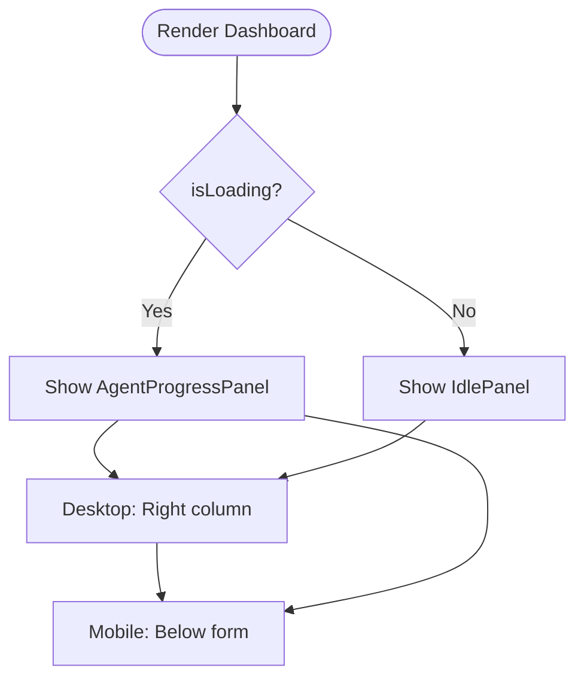

**Diagram sources**
- [Dashboard.jsx:307-326](file://app/frontend/src/pages/Dashboard.jsx#L307-L326)
- [Dashboard.jsx:163-200](file://app/frontend/src/pages/Dashboard.jsx#L163-L200)

**Section sources**
- [Dashboard.jsx:204-329](file://app/frontend/src/pages/Dashboard.jsx#L204-L329)

### UploadForm Component
Handles:
- Resume file selection (drag-and-drop).
- Job description input modes: text, file, URL extraction.
- Scoring weights panel with presets and sliders.
- Saved JD templates integration.
- Validation and submission flow.

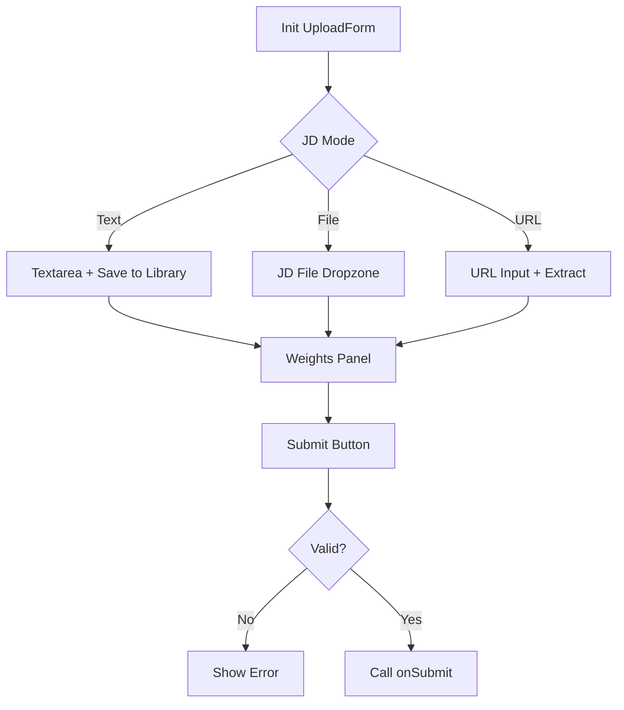

**Diagram sources**
- [UploadForm.jsx:77-483](file://app/frontend/src/components/UploadForm.jsx#L77-L483)

**Section sources**
- [UploadForm.jsx:77-483](file://app/frontend/src/components/UploadForm.jsx#L77-L483)

### ScoreGauge Component
Visualizes fit score with:
- Thresholds: Strong fit (≥72), Moderate fit (≥45), Low fit (<45).
- Animated arc rendering with smooth transitions.
- Pending state with dashed ring and “Manual Review” label.

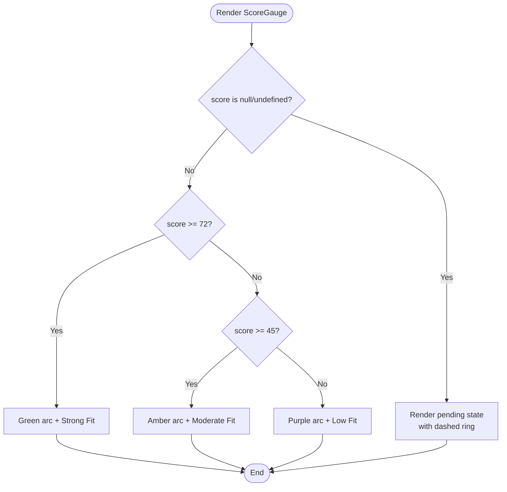

**Diagram sources**
- [ScoreGauge.jsx:1-97](file://app/frontend/src/components/ScoreGauge.jsx#L1-L97)

**Section sources**
- [ScoreGauge.jsx:1-97](file://app/frontend/src/components/ScoreGauge.jsx#L1-L97)

### SkillsRadar Component
Provides skills gap analysis:
- Categorizes skills into predefined domains (Programming, DevOps, Data, etc.).
- Computes match percentage and renders a category breakdown bar chart.
- Shows matched vs missing skills per category with chips.
- Includes a circular progress indicator for overall coverage.

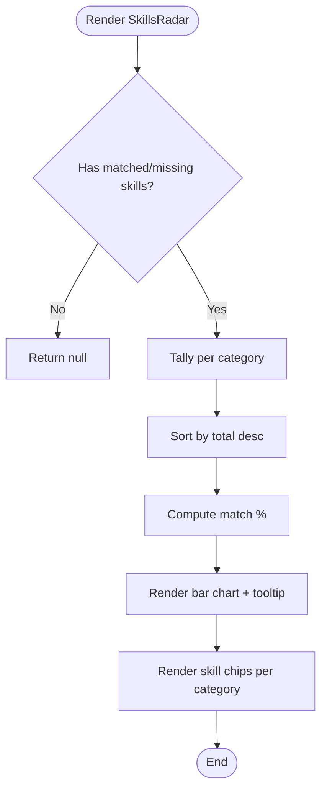

**Diagram sources**
- [SkillsRadar.jsx:110-261](file://app/frontend/src/components/SkillsRadar.jsx#L110-L261)

**Section sources**
- [SkillsRadar.jsx:110-261](file://app/frontend/src/components/SkillsRadar.jsx#L110-L261)

### ResultCard Component
Comprehensive report card used in the report page:
- Recommendation badge (Shortlist/Reject/Pending).
- Score breakdown bars for multiple dimensions.
- Strengths, weaknesses, risk signals.
- Skills gap visualization via SkillsRadar.
- Explainability sections with collapsible panels.
- Education and domain-fit assessments.
- Interview kit tabs (Technical, Behavioral, Culture Fit).
- Email generation modal.

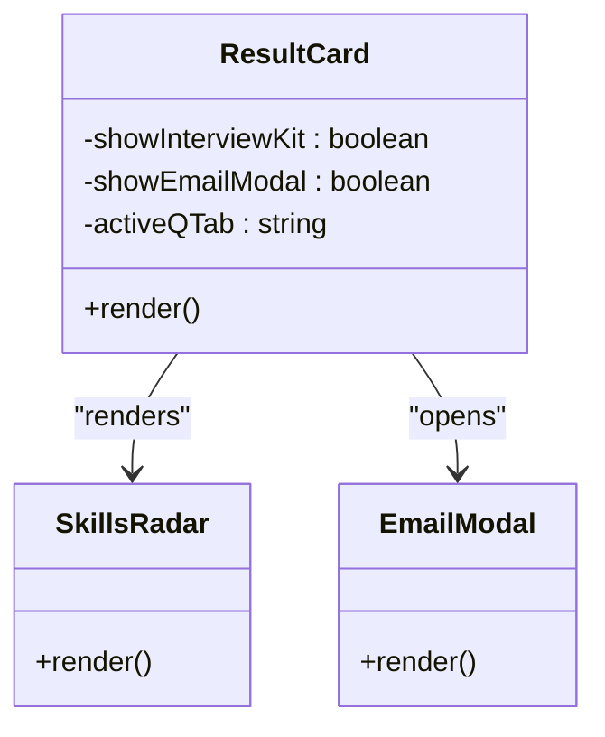

**Diagram sources**
- [ResultCard.jsx:265-627](file://app/frontend/src/components/ResultCard.jsx#L265-L627)
- [SkillsRadar.jsx:110-261](file://app/frontend/src/components/SkillsRadar.jsx#L110-L261)

**Section sources**
- [ResultCard.jsx:265-627](file://app/frontend/src/components/ResultCard.jsx#L265-L627)

### ReportPage Component
Dedicated page for displaying a single result:
- Sidebar with candidate name editor, share/download actions, score gauge, and labeling controls.
- Main content area renders the ResultCard and a timeline component.
- Supports sharing via session storage and printing.

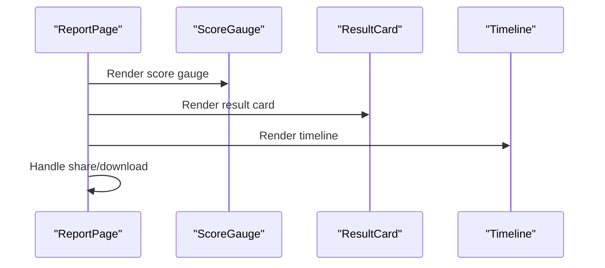

**Diagram sources**
- [ReportPage.jsx:82-296](file://app/frontend/src/pages/ReportPage.jsx#L82-L296)
- [ScoreGauge.jsx:1-97](file://app/frontend/src/components/ScoreGauge.jsx#L1-L97)
- [ResultCard.jsx:265-627](file://app/frontend/src/components/ResultCard.jsx#L265-L627)

**Section sources**
- [ReportPage.jsx:82-296](file://app/frontend/src/pages/ReportPage.jsx#L82-L296)

### Usage Widget and Subscription Hook
The usage widget displays:
- Monthly analyses used vs limit.
- Progress bar with dynamic color based on usage percentage.
- Special handling for unlimited plans.

The subscription hook provides:
- Usage statistics (analyses used, limit, percent used).
- Plan availability checks.
- Optimistic updates after analysis operations.

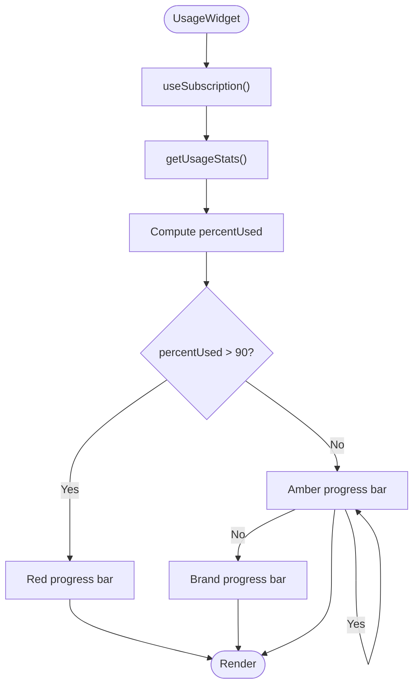

**Diagram sources**
- [Dashboard.jsx:163-200](file://app/frontend/src/pages/Dashboard.jsx#L163-L200)
- [useSubscription.jsx:57-69](file://app/frontend/src/hooks/useSubscription.jsx#L57-L69)

**Section sources**
- [Dashboard.jsx:163-200](file://app/frontend/src/pages/Dashboard.jsx#L163-L200)
- [useSubscription.jsx:6-158](file://app/frontend/src/hooks/useSubscription.jsx#L6-L158)

### Backend Integration and Streaming
The API client supports:
- Standard analysis with multipart/form-data.
- Streaming analysis via Server-Sent Events (SSE) endpoint.
- Authentication via bearer token and automatic refresh.
- Additional endpoints for history, batch analysis, templates, and email generation.

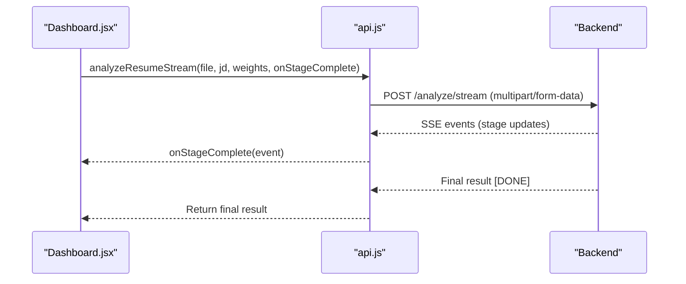

**Diagram sources**
- [api.js:75-147](file://app/frontend/src/lib/api.js#L75-L147)
- [Dashboard.jsx:254-266](file://app/frontend/src/pages/Dashboard.jsx#L254-L266)

**Section sources**
- [api.js:47-147](file://app/frontend/src/lib/api.js#L47-L147)
- [Dashboard.jsx:243-275](file://app/frontend/src/pages/Dashboard.jsx#L243-L275)

## Dependency Analysis
- Dashboard depends on UploadForm, Subscription hook, and API client.
- ReportPage depends on ScoreGauge and ResultCard.
- ResultCard composes SkillsRadar and other reusable UI elements.
- AppShell wraps pages with authentication and subscription providers.

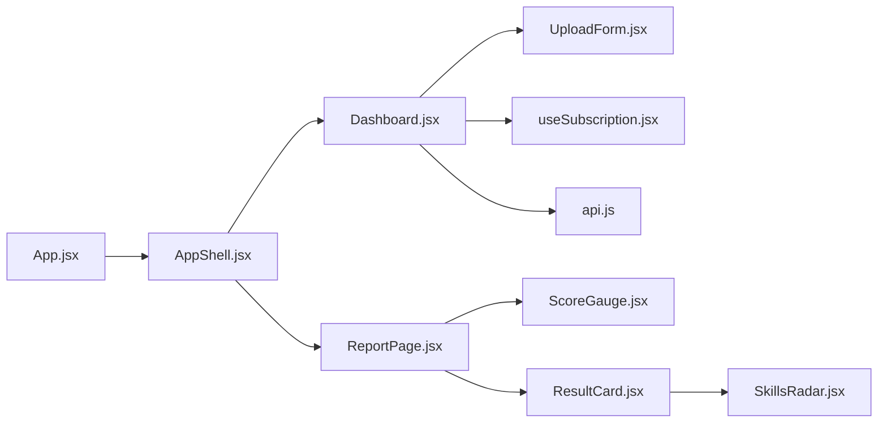

**Diagram sources**
- [Dashboard.jsx:204-329](file://app/frontend/src/pages/Dashboard.jsx#L204-L329)
- [ReportPage.jsx:82-296](file://app/frontend/src/pages/ReportPage.jsx#L82-L296)
- [App.jsx:39-61](file://app/frontend/src/App.jsx#L39-L61)

**Section sources**
- [App.jsx:39-61](file://app/frontend/src/App.jsx#L39-L61)
- [AppShell.jsx:3-12](file://app/frontend/src/components/AppShell.jsx#L3-L12)

## Performance Considerations
- Streaming analysis reduces perceived latency by showing incremental progress.
- Optimistic updates in the subscription hook improve user experience during analysis operations.
- Tailwind utilities enable efficient styling without heavy CSS overhead.
- Responsive layout minimizes reflows by leveraging flexbox and fixed sidebar widths.

[No sources needed since this section provides general guidance]

## Troubleshooting Guide
Common issues and resolutions:
- Ollama service offline: The dashboard shows a pending state and prompts to start the service for AI narratives.
- Network errors: API client interceptors handle 401 and redirect to login; ensure tokens are present.
- Streaming failures: Verify SSE endpoint and network connectivity; the client throws descriptive errors.

**Section sources**
- [Dashboard.jsx:267-274](file://app/frontend/src/pages/Dashboard.jsx#L267-L274)
- [api.js:19-43](file://app/frontend/src/lib/api.js#L19-L43)

## Conclusion
The dashboard components provide a cohesive, real-time experience for resume screening with robust visualizations and usage insights. The modular design allows easy extension with new widgets and integrations, while the streaming pipeline ensures timely feedback. The subscription-aware UI helps teams manage usage effectively.

[No sources needed since this section summarizes without analyzing specific files]

## Appendices

### Customization Options
- Scoring weights: Adjust weights for skills, experience, stability, and education in the upload form.
- JD templates: Save and reuse job descriptions for consistent analysis.
- Recommendation badges: Customize styling for Shortlist/Reject/Pending states.
- Usage widget: Extend to show storage or team member limits.

**Section sources**
- [UploadForm.jsx:6-11](file://app/frontend/src/components/UploadForm.jsx#L6-L11)
- [UploadForm.jsx:13-75](file://app/frontend/src/components/UploadForm.jsx#L13-L75)
- [Dashboard.jsx:163-200](file://app/frontend/src/pages/Dashboard.jsx#L163-L200)

### Data Filtering Capabilities
- Candidates page supports search by name/email and pagination.
- Usage checks prevent exceeding plan limits before initiating analysis.

**Section sources**
- [CandidatesPage.jsx:77-203](file://app/frontend/src/pages/CandidatesPage.jsx#L77-L203)
- [useSubscription.jsx:161-185](file://app/frontend/src/hooks/useSubscription.jsx#L161-L185)

### Responsive Design Considerations
- Desktop: Two-column layout with a fixed-width sidebar in the report page.
- Mobile: Stacked layout for upload form and progress panel.
- Tailwind breakpoints and flexible grids ensure readability across devices.

**Section sources**
- [Dashboard.jsx:307-326](file://app/frontend/src/pages/Dashboard.jsx#L307-L326)
- [ReportPage.jsx:154-296](file://app/frontend/src/pages/ReportPage.jsx#L154-L296)
- [tailwind.config.js:8-47](file://app/frontend/tailwind.config.js#L8-L47)

### Extending Dashboard Functionality
Examples:
- New visualization component: Create a component similar to SkillsRadar, integrate it into ResultCard or ReportPage, and pass relevant props (e.g., matched/missing skills).
- Custom metrics widget: Build a small widget like UsageWidget and place it alongside UploadForm in the dashboard layout.
- Data filtering: Add filters to the Candidates page and pass query parameters to the API client.

Integration tips:
- Use the existing API client for backend calls.
- Wrap pages with SubscriptionProvider for usage checks.
- Leverage Tailwind utilities for consistent styling.

**Section sources**
- [SkillsRadar.jsx:110-261](file://app/frontend/src/components/SkillsRadar.jsx#L110-L261)
- [ResultCard.jsx:410-410](file://app/frontend/src/components/ResultCard.jsx#L410-L410)
- [Dashboard.jsx:290-303](file://app/frontend/src/pages/Dashboard.jsx#L290-L303)
- [api.js:47-147](file://app/frontend/src/lib/api.js#L47-L147)
- [useSubscription.jsx:6-158](file://app/frontend/src/hooks/useSubscription.jsx#L6-L158)