# Export & Sharing

<cite>
**Referenced Files in This Document**
- [export.py](file://app/backend/routes/export.py)
- [api.js](file://app/frontend/src/lib/api.js)
- [ReportPage.jsx](file://app/frontend/src/pages/ReportPage.jsx)
- [ResultCard.jsx](file://app/frontend/src/components/ResultCard.jsx)
- [training.py](file://app/backend/routes/training.py)
- [auth.py](file://app/backend/middleware/auth.py)
- [db_models.py](file://app/backend/models/db_models.py)
- [candidates.py](file://app/backend/routes/candidates.py)
</cite>

## Table of Contents
1. [Introduction](#introduction)
2. [Project Structure](#project-structure)
3. [Core Components](#core-components)
4. [Architecture Overview](#architecture-overview)
5. [Detailed Component Analysis](#detailed-component-analysis)
6. [Dependency Analysis](#dependency-analysis)
7. [Performance Considerations](#performance-considerations)
8. [Troubleshooting Guide](#troubleshooting-guide)
9. [Conclusion](#conclusion)

## Introduction
This document explains the export and sharing capabilities for Resume AI by ThetaLogics reports and analytics. It covers:
- PDF generation using browser print capabilities
- Shareable report URLs with session storage integration
- CSV and Excel export options for candidate data
- Inline name editing for candidate customization
- Label training functionality for improving AI accuracy
- Real-time status updates for analysis completion
- Security considerations for shared reports, access control mechanisms
- Integration with external sharing platforms
- Examples of customizing export formats and implementing additional export options

## Project Structure
The export and sharing features span the frontend React application and the backend FastAPI service:
- Frontend: Report page actions, inline editing, and export triggers
- Backend: Export endpoints for CSV and Excel, training endpoints, and authentication middleware

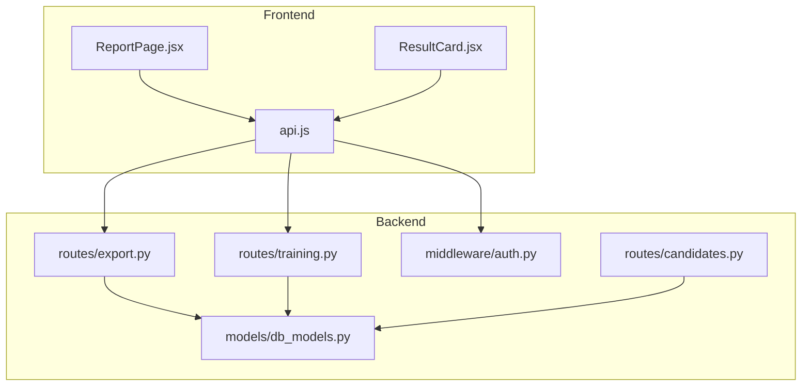

**Diagram sources**
- [ReportPage.jsx:120-151](file://app/frontend/src/pages/ReportPage.jsx#L120-L151)
- [api.js:183-204](file://app/frontend/src/lib/api.js#L183-L204)
- [export.py:55-104](file://app/backend/routes/export.py#L55-L104)
- [training.py:24-97](file://app/backend/routes/training.py#L24-L97)
- [auth.py:19-46](file://app/backend/middleware/auth.py#L19-L46)
- [db_models.py:128-146](file://app/backend/models/db_models.py#L128-L146)
- [candidates.py:83-99](file://app/backend/routes/candidates.py#L83-L99)

**Section sources**
- [ReportPage.jsx:120-151](file://app/frontend/src/pages/ReportPage.jsx#L120-L151)
- [api.js:183-204](file://app/frontend/src/lib/api.js#L183-L204)
- [export.py:55-104](file://app/backend/routes/export.py#L55-L104)
- [training.py:24-97](file://app/backend/routes/training.py#L24-L97)
- [auth.py:19-46](file://app/backend/middleware/auth.py#L19-L46)
- [db_models.py:128-146](file://app/backend/models/db_models.py#L128-L146)
- [candidates.py:83-99](file://app/backend/routes/candidates.py#L83-L99)

## Core Components
- Export endpoints: CSV and Excel exports of screening results
- Shareable report URLs: Temporary links backed by session storage
- Inline name editor: Allows recruiters to customize candidate names
- Label training: Collects outcomes to improve AI accuracy
- Authentication and access control: JWT-based protection for sensitive endpoints
- Data models: ScreeningResult and related entities used by export and training

**Section sources**
- [export.py:55-104](file://app/backend/routes/export.py#L55-L104)
- [ReportPage.jsx:127-137](file://app/frontend/src/pages/ReportPage.jsx#L127-L137)
- [api.js:183-204](file://app/frontend/src/lib/api.js#L183-L204)
- [training.py:24-97](file://app/backend/routes/training.py#L24-L97)
- [auth.py:19-46](file://app/backend/middleware/auth.py#L19-L46)
- [db_models.py:128-146](file://app/backend/models/db_models.py#L128-L146)

## Architecture Overview
The export and sharing flow integrates frontend actions with backend endpoints and database models.

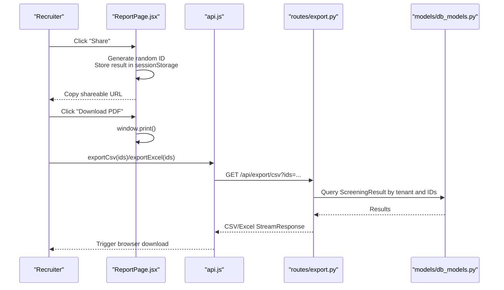

**Diagram sources**
- [ReportPage.jsx:127-137](file://app/frontend/src/pages/ReportPage.jsx#L127-L137)
- [api.js:183-204](file://app/frontend/src/lib/api.js#L183-L204)
- [export.py:55-104](file://app/backend/routes/export.py#L55-L104)
- [db_models.py:128-146](file://app/backend/models/db_models.py#L128-L146)

## Detailed Component Analysis

### Export Endpoints (CSV and Excel)
- Purpose: Provide downloadable exports of screening results for selected IDs
- Access control: Requires authenticated user; filters by tenant
- Output: CSV or Excel streams with standardized columns derived from parsed and analysis data

Key behaviors:
- Fetch results scoped to the current tenant and optional ID list
- Transform results into tabular rows with contact info, scores, recommendations, and breakdowns
- Stream CSV or Excel responses with appropriate headers and filenames

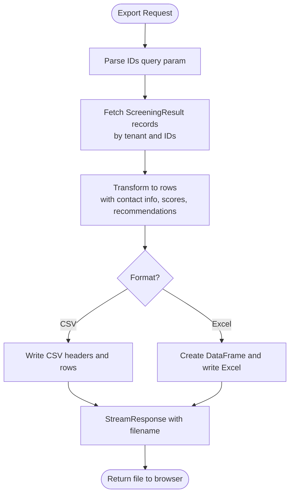

**Diagram sources**
- [export.py:20-52](file://app/backend/routes/export.py#L20-L52)
- [export.py:55-104](file://app/backend/routes/export.py#L55-L104)

**Section sources**
- [export.py:55-104](file://app/backend/routes/export.py#L55-L104)

### Shareable Report URLs with Session Storage
- Purpose: Allow recruiters to share a temporary link to a report
- Mechanism: Generate a random ID, store the report result in sessionStorage, and construct a shareable URL
- Clipboard integration: Copy the URL to clipboard; fallback prompt if clipboard API fails

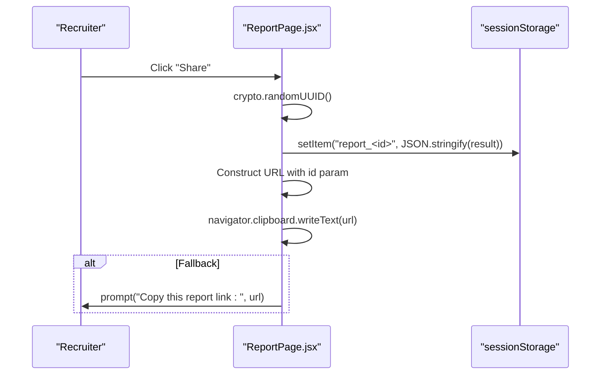

**Diagram sources**
- [ReportPage.jsx:127-137](file://app/frontend/src/pages/ReportPage.jsx#L127-L137)

**Section sources**
- [ReportPage.jsx:127-137](file://app/frontend/src/pages/ReportPage.jsx#L127-L137)

### PDF Generation Using Browser Print
- Purpose: Enable downloading a PDF of the report via the browser’s print dialog
- Mechanism: The “Download PDF” action triggers the browser’s print dialog; the report page includes print-specific styling and header

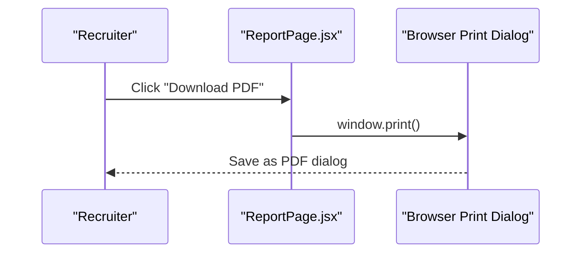

**Diagram sources**
- [ReportPage.jsx:137-137](file://app/frontend/src/pages/ReportPage.jsx#L137-L137)

**Section sources**
- [ReportPage.jsx:137-137](file://app/frontend/src/pages/ReportPage.jsx#L137-L137)

### CSV Export Options for Candidate Data
- Purpose: Provide CSV downloads of screening results for bulk analysis
- Implementation: Frontend export functions call backend endpoints with optional IDs

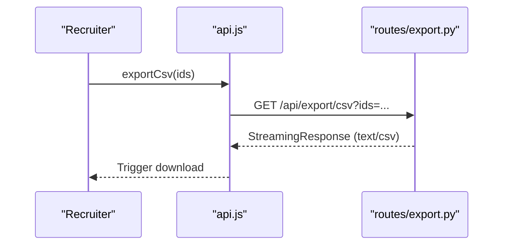

**Diagram sources**
- [api.js:183-187](file://app/frontend/src/lib/api.js#L183-L187)
- [export.py:55-78](file://app/backend/routes/export.py#L55-L78)

**Section sources**
- [api.js:183-187](file://app/frontend/src/lib/api.js#L183-L187)
- [export.py:55-78](file://app/backend/routes/export.py#L55-L78)

### Inline Name Editing for Candidate Customization
- Purpose: Allow recruiters to edit candidate names directly in the report view
- Mechanism: Inline editor component with save/cancel controls; updates persisted via PATCH endpoint

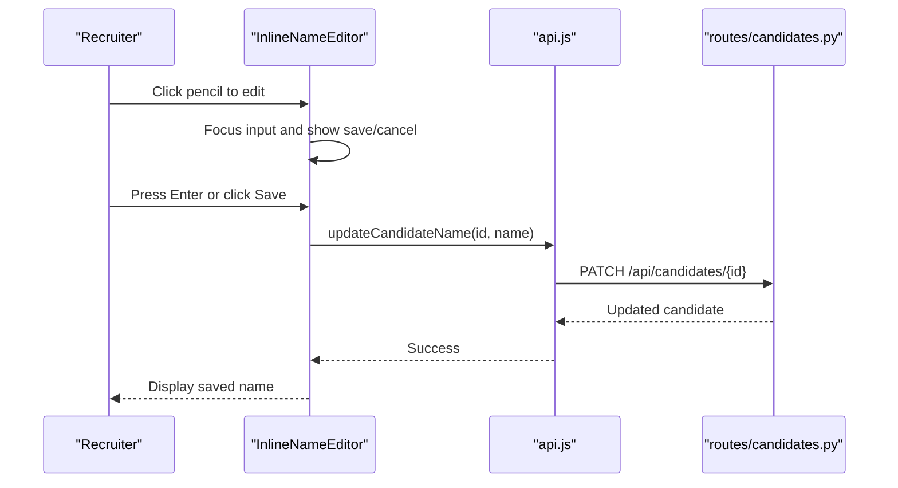

**Diagram sources**
- [ReportPage.jsx:12-80](file://app/frontend/src/pages/ReportPage.jsx#L12-L80)
- [api.js:239-242](file://app/frontend/src/lib/api.js#L239-L242)
- [candidates.py:83-99](file://app/backend/routes/candidates.py#L83-L99)

**Section sources**
- [ReportPage.jsx:12-80](file://app/frontend/src/pages/ReportPage.jsx#L12-L80)
- [api.js:239-242](file://app/frontend/src/lib/api.js#L239-L242)
- [candidates.py:83-99](file://app/backend/routes/candidates.py#L83-L99)

### Label Training Functionality for Improving AI Accuracy
- Purpose: Collect labeled outcomes to improve AI accuracy via custom model training
- Workflow: Label a result as hired or rejected; backend persists the label and updates result status; admin can trigger training to build a custom model

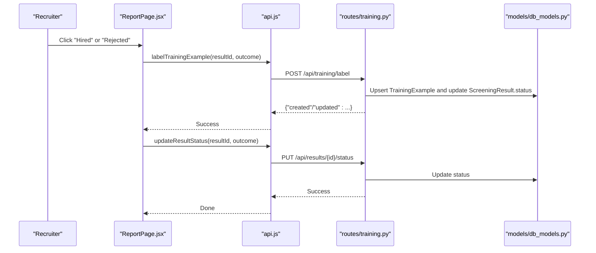

**Diagram sources**
- [ReportPage.jsx:139-151](file://app/frontend/src/pages/ReportPage.jsx#L139-L151)
- [api.js:282-285](file://app/frontend/src/lib/api.js#L282-L285)
- [training.py:24-63](file://app/backend/routes/training.py#L24-L63)
- [db_models.py:214-224](file://app/backend/models/db_models.py#L214-L224)

**Section sources**
- [ReportPage.jsx:139-151](file://app/frontend/src/pages/ReportPage.jsx#L139-L151)
- [api.js:282-285](file://app/frontend/src/lib/api.js#L282-L285)
- [training.py:24-63](file://app/backend/routes/training.py#L24-L63)
- [db_models.py:214-224](file://app/backend/models/db_models.py#L214-L224)

### Real-Time Status Updates for Analysis Completion
- Purpose: Provide immediate feedback on whether AI narrative is available versus fallback mode
- Mechanism: The report page displays a badge indicating analysis source and quality; this informs users about real-time status

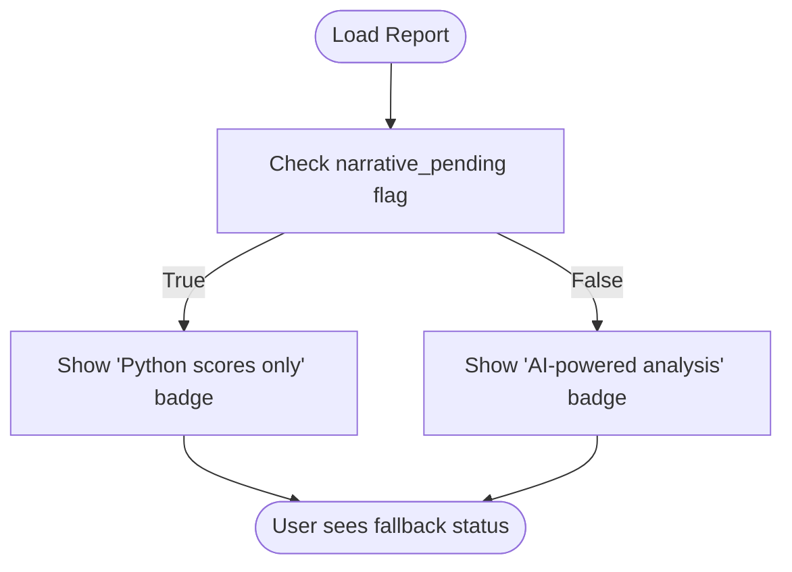

**Diagram sources**
- [ReportPage.jsx:186-197](file://app/frontend/src/pages/ReportPage.jsx#L186-L197)

**Section sources**
- [ReportPage.jsx:186-197](file://app/frontend/src/pages/ReportPage.jsx#L186-L197)

### Security Considerations for Shared Reports
- Access control: All routes requiring authentication use JWT bearer tokens validated by the middleware
- Tenant scoping: Queries filter by tenant ID to prevent cross-tenant data leakage
- Session storage: Shareable URLs rely on sessionStorage; ensure secure transport (HTTPS) and consider CSRF protections
- Admin-only training: Model training requires admin role

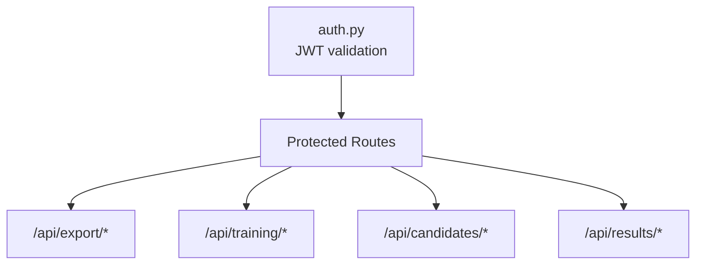

**Diagram sources**
- [auth.py:19-46](file://app/backend/middleware/auth.py#L19-L46)
- [export.py:55-104](file://app/backend/routes/export.py#L55-L104)
- [training.py:66-97](file://app/backend/routes/training.py#L66-L97)
- [candidates.py:83-99](file://app/backend/routes/candidates.py#L83-L99)

**Section sources**
- [auth.py:19-46](file://app/backend/middleware/auth.py#L19-L46)
- [export.py:55-104](file://app/backend/routes/export.py#L55-L104)
- [training.py:66-97](file://app/backend/routes/training.py#L66-L97)
- [candidates.py:83-99](file://app/backend/routes/candidates.py#L83-L99)

### Integration with External Sharing Platforms
- The shareable URL mechanism uses the browser’s clipboard API and falls back to prompting the user; it does not integrate with external social platforms
- For embedding or sharing on external sites, consider adding explicit copy-to-clipboard and share intents

[No sources needed since this section provides general guidance]

### Customizing Export Formats and Additional Export Options
Examples of extending export functionality:
- Add new export formats (e.g., JSON, Parquet) by creating a new backend route similar to CSV/Excel
- Extend the row transformation logic to include additional fields from parsed or analysis data
- Add filtering or grouping options (e.g., by recommendation, risk level, date range)
- Implement batch export for all results within a tenant or candidate

Implementation steps:
- Define a new route in the backend exporting module
- Add a frontend export function mirroring the existing CSV/Excel functions
- Ensure tenant scoping and access control are enforced
- Consider pagination and streaming for large datasets

**Section sources**
- [export.py:27-52](file://app/backend/routes/export.py#L27-L52)
- [api.js:183-204](file://app/frontend/src/lib/api.js#L183-L204)

## Dependency Analysis
- Frontend export functions depend on the backend export endpoints and authentication interceptor
- Backend export endpoints depend on database models and tenant-scoped queries
- Training endpoints depend on the training example model and require admin role
- Authentication middleware enforces JWT-based access control across protected routes

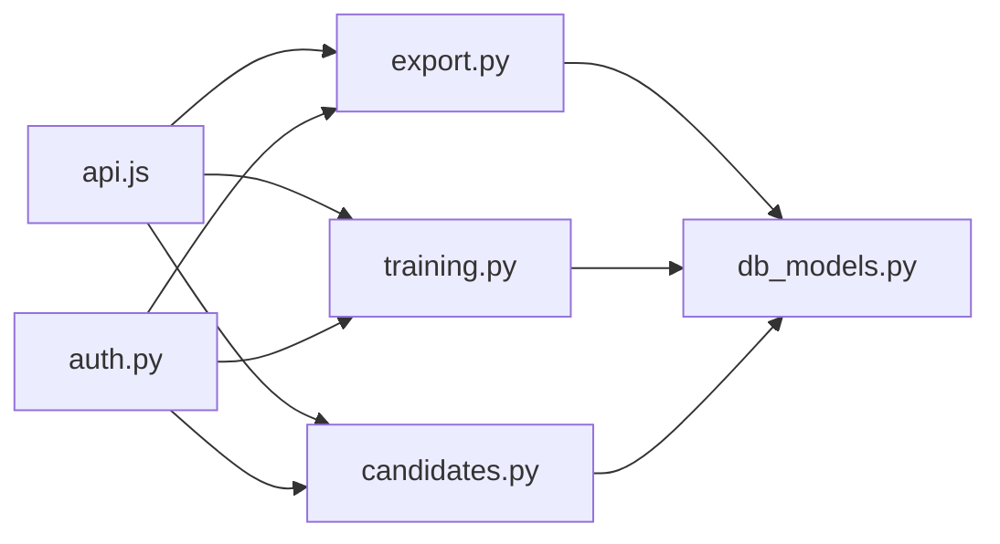

**Diagram sources**
- [api.js:183-204](file://app/frontend/src/lib/api.js#L183-L204)
- [export.py:55-104](file://app/backend/routes/export.py#L55-L104)
- [training.py:24-97](file://app/backend/routes/training.py#L24-L97)
- [candidates.py:83-99](file://app/backend/routes/candidates.py#L83-L99)
- [db_models.py:128-146](file://app/backend/models/db_models.py#L128-L146)
- [auth.py:19-46](file://app/backend/middleware/auth.py#L19-L46)

**Section sources**
- [api.js:183-204](file://app/frontend/src/lib/api.js#L183-L204)
- [export.py:55-104](file://app/backend/routes/export.py#L55-L104)
- [training.py:24-97](file://app/backend/routes/training.py#L24-L97)
- [candidates.py:83-99](file://app/backend/routes/candidates.py#L83-L99)
- [db_models.py:128-146](file://app/backend/models/db_models.py#L128-L146)
- [auth.py:19-46](file://app/backend/middleware/auth.py#L19-L46)

## Performance Considerations
- Streaming responses: CSV and Excel endpoints stream data to reduce memory usage for large exports
- Filtering by IDs: Limit exports to specific results to minimize query and serialization overhead
- Tenant scoping: Ensure queries are filtered by tenant to avoid scanning unrelated data
- Frontend downloads: Use blob-based downloads to avoid large DOM manipulations

[No sources needed since this section provides general guidance]

## Troubleshooting Guide
Common issues and resolutions:
- Export returns empty data: Verify tenant scoping and that IDs exist for the current user’s tenant
- Share URL not found: Confirm the ID exists in sessionStorage and the report page handles missing data gracefully
- Label training errors: Ensure the result belongs to the current tenant and the outcome is valid
- Authentication failures: Check JWT token presence and expiration; ensure refresh flow works

**Section sources**
- [export.py:20-24](file://app/backend/routes/export.py#L20-L24)
- [ReportPage.jsx:104-118](file://app/frontend/src/pages/ReportPage.jsx#L104-L118)
- [training.py:24-63](file://app/backend/routes/training.py#L24-L63)
- [auth.py:19-46](file://app/backend/middleware/auth.py#L19-L46)

## Conclusion
Resume AI by ThetaLogics provides robust export and sharing capabilities:
- Shareable report URLs leverage session storage for quick, temporary sharing
- PDF generation uses the browser’s print dialog for convenient downloads
- CSV and Excel exports enable bulk analysis with tenant-scoped filtering
- Inline name editing and label training enhance customization and AI accuracy
- Strong authentication and access control protect sensitive data and training workflows
- Extensibility allows adding new export formats and advanced filtering options