# Individual Reports

<cite>
**Referenced Files in This Document**
- [ReportPage.jsx](file://app/frontend/src/pages/ReportPage.jsx)
- [ResultCard.jsx](file://app/frontend/src/components/ResultCard.jsx)
- [ScoreGauge.jsx](file://app/frontend/src/components/ScoreGauge.jsx)
- [SkillsRadar.jsx](file://app/frontend/src/components/SkillsRadar.jsx)
- [Timeline.jsx](file://app/frontend/src/components/Timeline.jsx)
- [api.js](file://app/frontend/src/lib/api.js)
- [index.css](file://app/frontend/src/index.css)
- [CandidatesPage.jsx](file://app/frontend/src/pages/CandidatesPage.jsx)
- [export.py](file://app/backend/routes/export.py)
- [analyze.py](file://app/backend/routes/analyze.py)
- [email_gen.py](file://app/backend/routes/email_gen.py)
- [hybrid_pipeline.py](file://app/backend/services/hybrid_pipeline.py)
- [llm_service.py](file://app/backend/services/llm_service.py)
- [analysis_service.py](file://app/backend/services/analysis_service.py)
</cite>

## Update Summary
**Changes Made**
- Enhanced PDF reporting functionality with improved PDF generation process
- Added comprehensive score summaries directly within the .report-content container
- Refined PDF generation options with optimized scaling, CORS handling, logging configuration, and letter rendering settings
- Implemented letter-format PDF generation with A4 portrait orientation
- Enhanced print optimization with dedicated .report-content styling
- Preserved candidate information, score summaries, risk assessments, final recommendations, and detailed analysis sections in printed output

## Table of Contents
1. [Introduction](#introduction)
2. [Project Structure](#project-structure)
3. [Core Components](#core-components)
4. [Architecture Overview](#architecture-overview)
5. [Detailed Component Analysis](#detailed-component-analysis)
6. [Dependency Analysis](#dependency-analysis)
7. [Performance Considerations](#performance-considerations)
8. [Troubleshooting Guide](#troubleshooting-guide)
9. [Conclusion](#conclusion)
10. [Appendices](#appendices)

## Introduction
This document explains the end-to-end individual report generation and display system in Resume AI by ThetaLogics. It focuses on:
- The ReportPage component for comprehensive candidate analysis reports
- Inline name editor functionality
- Sharing mechanisms and PDF download capabilities
- The ResultCard component for detailed analysis presentation with expandable sections
- The ScoreGauge component for visual fit score representation and recommendation display
- **Enhanced PDF reporting system** with improved generation process and comprehensive screening report formatting
- Customization options for report layouts, branding integration, print optimization, and export formats (CSV and Excel)

## Project Structure
The reporting system spans frontend React components and backend FastAPI routes:
- Frontend pages and components render the report UI, manage user interactions, and trigger exports
- Backend routes handle analysis, email generation, and export generation
- Styling and print optimization are centralized in Tailwind CSS and media queries
- **Enhanced PDF generation system** with optimized html2pdf configuration and print-specific styling

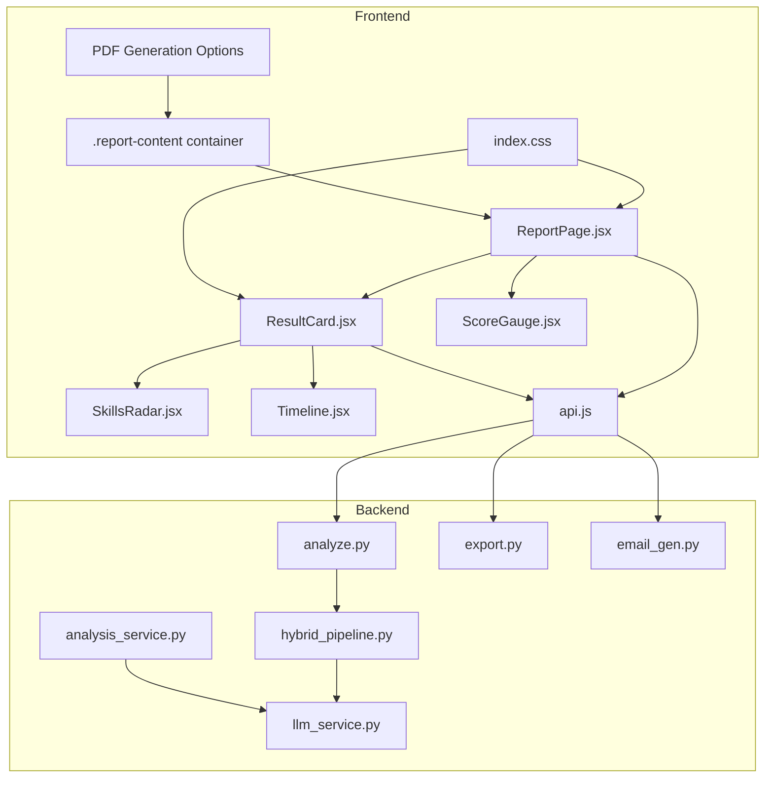

**Diagram sources**
- [ReportPage.jsx:82-296](file://app/frontend/src/pages/ReportPage.jsx#L82-L296)
- [ResultCard.jsx:265-626](file://app/frontend/src/components/ResultCard.jsx#L265-L626)
- [ScoreGauge.jsx:1-97](file://app/frontend/src/components/ScoreGauge.jsx#L1-L97)
- [SkillsRadar.jsx:110-261](file://app/frontend/src/components/SkillsRadar.jsx#L110-L261)
- [Timeline.jsx:3-115](file://app/frontend/src/components/Timeline.jsx#L3-L115)
- [api.js:1-395](file://app/frontend/src/lib/api.js#L1-L395)
- [index.css:136-160](file://app/frontend/src/index.css#L136-L160)
- [analyze.py:354-501](file://app/backend/routes/analyze.py#L354-L501)
- [export.py:55-104](file://app/backend/routes/export.py#L55-L104)
- [email_gen.py:39-104](file://app/backend/routes/email_gen.py#L39-L104)
- [hybrid_pipeline.py:1322-1335](file://app/backend/services/hybrid_pipeline.py#L1322-L1335)
- [llm_service.py:256-273](file://app/backend/services/llm_service.py#L256-L273)

**Section sources**
- [ReportPage.jsx:82-296](file://app/frontend/src/pages/ReportPage.jsx#L82-L296)
- [ResultCard.jsx:265-626](file://app/frontend/src/components/ResultCard.jsx#L265-L626)
- [ScoreGauge.jsx:1-97](file://app/frontend/src/components/ScoreGauge.jsx#L1-L97)
- [SkillsRadar.jsx:110-261](file://app/frontend/src/components/SkillsRadar.jsx#L110-L261)
- [Timeline.jsx:3-115](file://app/frontend/src/components/Timeline.jsx#L3-L115)
- [api.js:1-395](file://app/frontend/src/lib/api.js#L1-L395)
- [index.css:136-160](file://app/frontend/src/index.css#L136-L160)
- [analyze.py:354-501](file://app/backend/routes/analyze.py#L354-L501)
- [export.py:55-104](file://app/backend/routes/export.py#L55-L104)
- [email_gen.py:39-104](file://app/backend/routes/email_gen.py#L39-L104)

## Core Components
- ReportPage: Orchestrates the report UI, inline name editing, sharing, and **enhanced PDF printing** with comprehensive score summaries
- ResultCard: Presents analysis results with collapsible sections, email generation, and interview kit
- ScoreGauge: Visualizes fit score thresholds and recommendation
- SkillsRadar: Displays skills coverage and category breakdown
- Timeline: Renders employment history and gaps
- api.js: Provides functions for analysis, exports, and email generation
- index.css: Defines **optimized print and PDF styling** for the .report-content container
- **Enhanced PDF Generation System**: Optimized html2pdf configuration with A4 portrait format and comprehensive content preservation

**Section sources**
- [ReportPage.jsx:82-296](file://app/frontend/src/pages/ReportPage.jsx#L82-L296)
- [ResultCard.jsx:265-626](file://app/frontend/src/components/ResultCard.jsx#L265-L626)
- [ScoreGauge.jsx:1-97](file://app/frontend/src/components/ScoreGauge.jsx#L1-L97)
- [SkillsRadar.jsx:110-261](file://app/frontend/src/components/SkillsRadar.jsx#L110-L261)
- [Timeline.jsx:3-115](file://app/frontend/src/components/Timeline.jsx#L3-L115)
- [api.js:183-204](file://app/frontend/src/lib/api.js#L183-L204)
- [index.css:136-160](file://app/frontend/src/index.css#L136-L160)

## Architecture Overview
The report rendering pipeline integrates frontend and backend with **enhanced PDF generation capabilities**:
- Frontend loads a result (via route state or session storage) and renders ReportPage
- ReportPage delegates analysis display to ResultCard and ScoreGauge
- Timeline visualizes work experience and gaps
- **Enhanced PDF generation system** processes the .report-content container with optimized settings
- **Comprehensive screening report formatting** preserves candidate information, score summaries, risk assessments, and detailed analysis sections
- Sharing uses client-side session storage to generate a shareable URL
- PDF download triggers optimized html2pdf generation with A4 portrait format
- Exports (CSV/Excel) are generated server-side and downloaded client-side

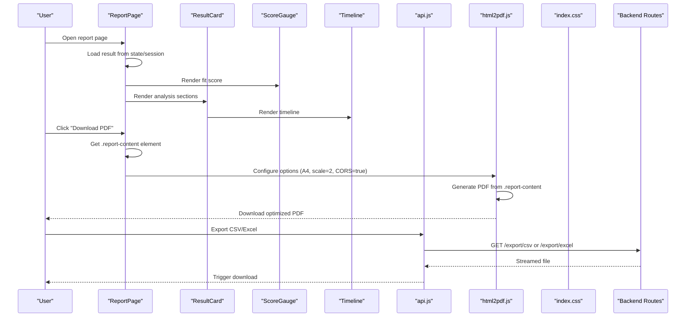

**Diagram sources**
- [ReportPage.jsx:82-296](file://app/frontend/src/pages/ReportPage.jsx#L82-L296)
- [ResultCard.jsx:265-626](file://app/frontend/src/components/ResultCard.jsx#L265-L626)
- [ScoreGauge.jsx:1-97](file://app/frontend/src/components/ScoreGauge.jsx#L1-L97)
- [Timeline.jsx:3-115](file://app/frontend/src/components/Timeline.jsx#L3-L115)
- [api.js:183-204](file://app/frontend/src/lib/api.js#L183-L204)
- [export.py:55-104](file://app/backend/routes/export.py#L55-L104)

## Detailed Component Analysis

### ReportPage: Individual Report Container
Responsibilities:
- Resolve and persist the selected result
- Inline candidate name editor with persistence
- Share report via client-side session storage
- **Enhanced PDF generation** with optimized html2pdf configuration
- Provide training labeling for outcomes

Key behaviors:
- Loads result from route state or session storage keyed by a random ID
- Renders sidebar with score, recommendation, and labeling controls
- Renders sticky action bar with Share and Download PDF buttons
- **Processes .report-content container for comprehensive PDF generation**
- **Configures html2pdf with A4 portrait format, scale 2, CORS handling, and letter rendering**
- **Preserves score summaries, candidate information, and analysis sections in PDF output**
- Prints a print-friendly header and delegates content to ResultCard and Timeline

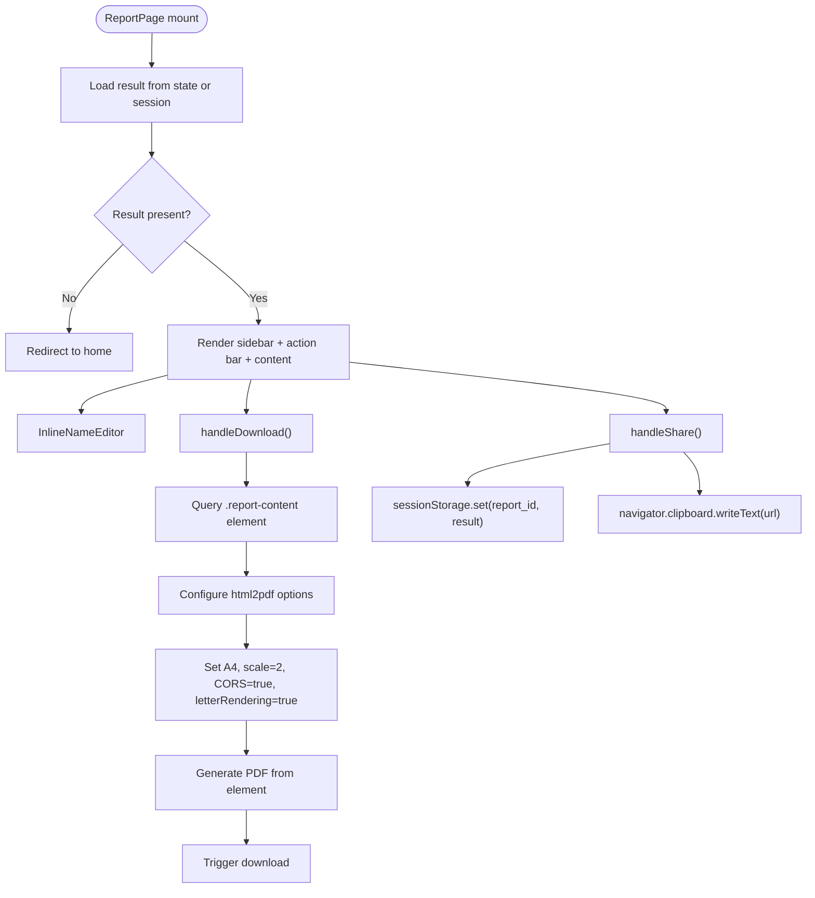

**Diagram sources**
- [ReportPage.jsx:82-151](file://app/frontend/src/pages/ReportPage.jsx#L82-L151)
- [ReportPage.jsx:153-296](file://app/frontend/src/pages/ReportPage.jsx#L153-L296)
- [ReportPage.jsx:193-207](file://app/frontend/src/pages/ReportPage.jsx#L193-L207)
- [ReportPage.jsx:236-276](file://app/frontend/src/pages/ReportPage.jsx#L236-L276)
- [ReportPage.jsx:241-270](file://app/frontend/src/pages/ReportPage.jsx#L241-L270)

**Section sources**
- [ReportPage.jsx:82-151](file://app/frontend/src/pages/ReportPage.jsx#L82-L151)
- [ReportPage.jsx:153-296](file://app/frontend/src/pages/ReportPage.jsx#L153-L296)
- [ReportPage.jsx:193-207](file://app/frontend/src/pages/ReportPage.jsx#L193-L207)
- [ReportPage.jsx:236-276](file://app/frontend/src/pages/ReportPage.jsx#L236-L276)
- [ReportPage.jsx:241-270](file://app/frontend/src/pages/ReportPage.jsx#L241-L270)

### Inline Name Editor
- Toggles between display and edit modes
- Persists edits via PATCH to update candidate name
- Supports Enter to save and Escape to cancel
- Triggers parent callback to update local state

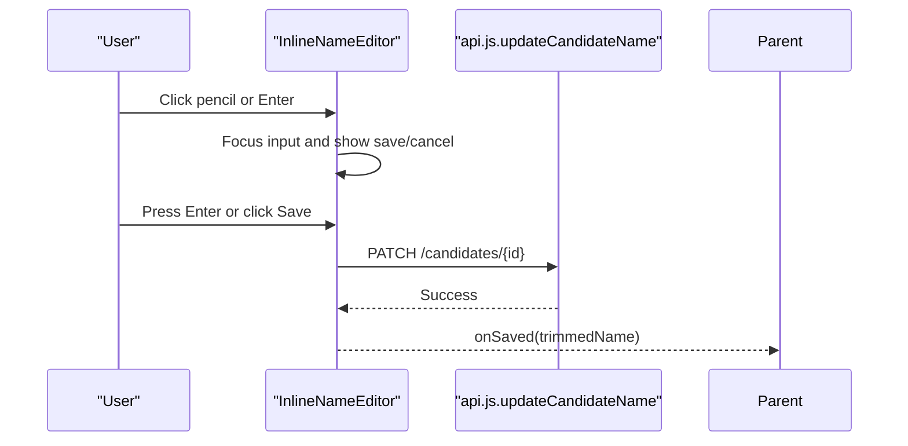

**Diagram sources**
- [ReportPage.jsx:12-80](file://app/frontend/src/pages/ReportPage.jsx#L12-L80)
- [api.js:239-242](file://app/frontend/src/lib/api.js#L239-L242)

**Section sources**
- [ReportPage.jsx:12-80](file://app/frontend/src/pages/ReportPage.jsx#L12-L80)
- [api.js:239-242](file://app/frontend/src/lib/api.js#L239-L242)

### ResultCard: Detailed Analysis Presentation
Highlights:
- Recommendation badge and risk indicator
- **Enhanced Analysis Source Badge** indicating AI Enhanced Report vs Analysis complete
- Score breakdown bars
- Skills matched/missing and adjacent skills
- Skills radar visualization
- Strengths, weaknesses, risk signals
- Explainability rationale
- Education and domain-fit sections
- Interview kit tabs (Technical, Behavioral, Culture Fit)
- Email generation modal

Expandable sections:
- Education Analysis
- Domain Fit & Architecture Assessment
- Explainability
- Interview Kit

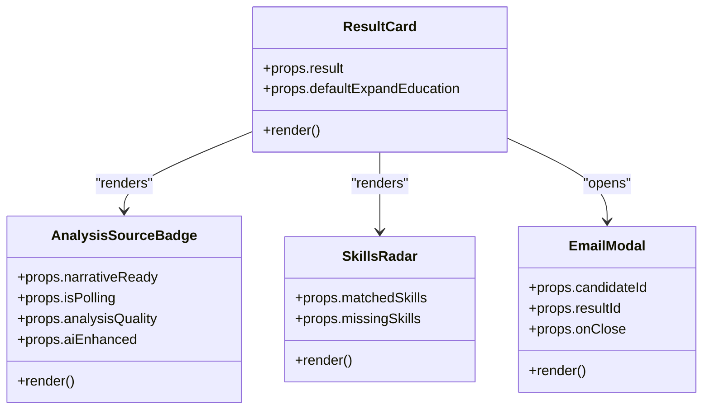

**Diagram sources**
- [ResultCard.jsx:265-626](file://app/frontend/src/components/ResultCard.jsx#L265-L626)
- [ResultCard.jsx:198-244](file://app/frontend/src/components/ResultCard.jsx#L198-L244)
- [SkillsRadar.jsx:110-261](file://app/frontend/src/components/SkillsRadar.jsx#L110-L261)

**Section sources**
- [ResultCard.jsx:265-626](file://app/frontend/src/components/ResultCard.jsx#L265-L626)
- [ResultCard.jsx:198-244](file://app/frontend/src/components/ResultCard.jsx#L198-L244)

### ScoreGauge: Fit Score Visualization
- Thresholds: ≥72 Strong Fit, ≥45 Moderate Fit, else Low Fit
- Pending state displays "Manual Review" with neutral styling
- Animated arc indicates score percentage
- Recommendation label updates dynamically

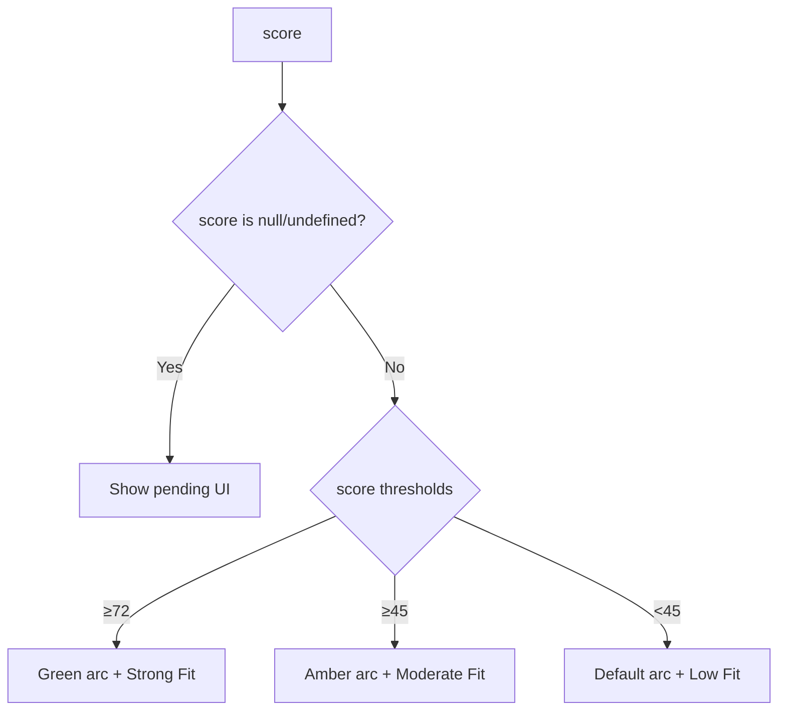

**Diagram sources**
- [ScoreGauge.jsx:1-97](file://app/frontend/src/components/ScoreGauge.jsx#L1-L97)

**Section sources**
- [ScoreGauge.jsx:1-97](file://app/frontend/src/components/ScoreGauge.jsx#L1-L97)

### Timeline: Employment History and Gaps
- Sorts jobs by start date descending
- Highlights short tenures
- Renders gaps with severity and duration
- Uses icons and subtle timelines

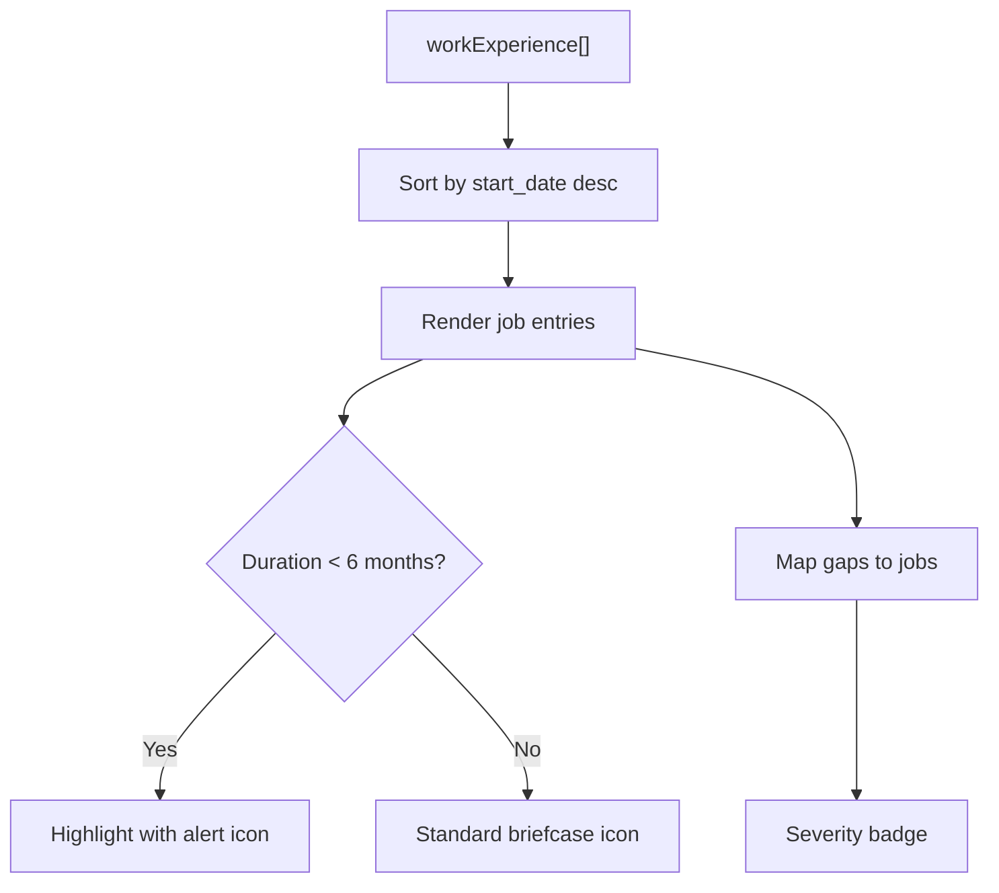

**Diagram sources**
- [Timeline.jsx:3-115](file://app/frontend/src/components/Timeline.jsx#L3-L115)

**Section sources**
- [Timeline.jsx:3-115](file://app/frontend/src/components/Timeline.jsx#L3-L115)

### Sharing Mechanism
- Generates a random ID and stores the result in session storage
- Copies shareable URL to clipboard; falls back to prompting if clipboard API fails
- Uses window origin for absolute URL construction

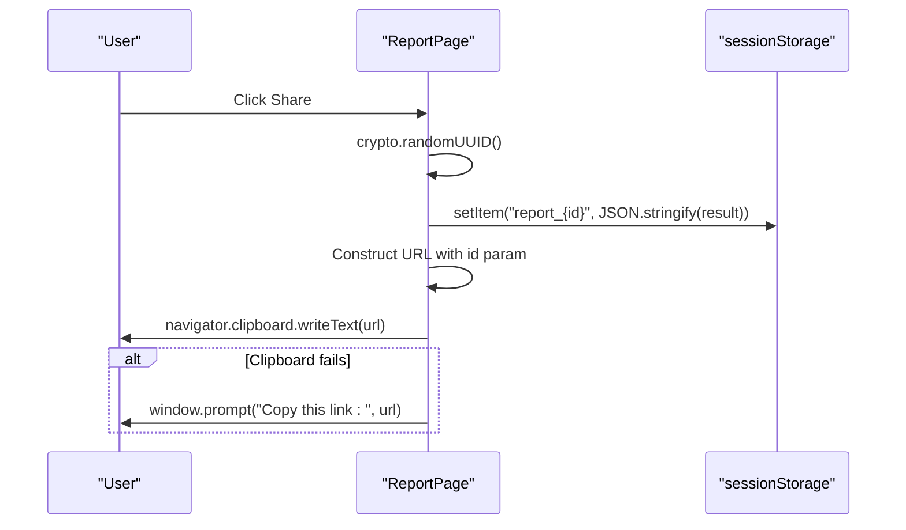

**Diagram sources**
- [ReportPage.jsx:127-135](file://app/frontend/src/pages/ReportPage.jsx#L127-L135)

**Section sources**
- [ReportPage.jsx:127-135](file://app/frontend/src/pages/ReportPage.jsx#L127-L135)

### Enhanced PDF Download and Print Optimization
**Updated** - The PDF generation system has been significantly enhanced with comprehensive configuration:

- **Target Element**: Processes the .report-content container for complete report capture
- **Optimized Scaling**: Uses scale: 2 for higher resolution PDF output
- **CORS Handling**: Enables useCORS: true for cross-origin image support
- **Logging Control**: Sets logging: false to suppress console output during generation
- **Letter Rendering**: Enables letterRendering: true for precise typography
- **Format Configuration**: Uses jsPDF with A4 format, portrait orientation, and millimeter units
- **Page Break Management**: Implements pagebreak: { mode: ['avoid-all', 'css', 'legacy'] } for optimal layout
- **Print Styles**: Enhanced @media print rules optimize spacing, fonts, and section preservation
- **Content Preservation**: Comprehensive screening report formatting maintains all analysis sections

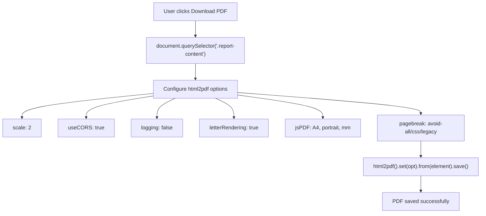

**Diagram sources**
- [ReportPage.jsx:236-276](file://app/frontend/src/pages/ReportPage.jsx#L236-L276)
- [ReportPage.jsx:249-266](file://app/frontend/src/pages/ReportPage.jsx#L249-L266)
- [index.css:174-183](file://app/frontend/src/index.css#L174-L183)

**Section sources**
- [ReportPage.jsx:236-276](file://app/frontend/src/pages/ReportPage.jsx#L236-L276)
- [ReportPage.jsx:249-266](file://app/frontend/src/pages/ReportPage.jsx#L249-L266)
- [index.css:174-183](file://app/frontend/src/index.css#L174-L183)

### Export Formats: CSV and Excel
- CSV export: Streams CSV rows with selected fields
- Excel export: Streams XLSX with a single sheet
- Client-side download triggered via Blob and anchor element

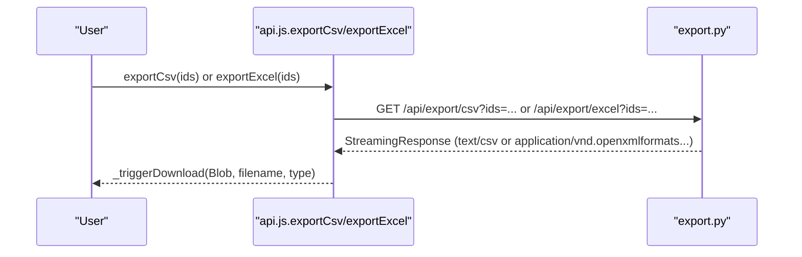

**Diagram sources**
- [api.js:183-204](file://app/frontend/src/lib/api.js#L183-L204)
- [export.py:55-104](file://app/backend/routes/export.py#L55-L104)

**Section sources**
- [api.js:183-204](file://app/frontend/src/lib/api.js#L183-L204)
- [export.py:55-104](file://app/backend/routes/export.py#L55-L104)

### Email Generation Integration
- ResultCard opens a modal to generate shortlist/rejection/screening-call emails
- Uses backend email generation endpoint powered by Ollama
- Falls back to templates if LLM is unavailable

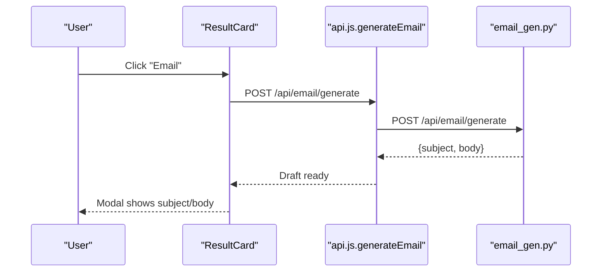

**Diagram sources**
- [ResultCard.jsx:94-194](file://app/frontend/src/components/ResultCard.jsx#L94-L194)
- [api.js:246-249](file://app/frontend/src/lib/api.js#L246-L249)
- [email_gen.py:39-104](file://app/backend/routes/email_gen.py#L39-L104)

**Section sources**
- [ResultCard.jsx:94-194](file://app/frontend/src/components/ResultCard.jsx#L94-L194)
- [api.js:246-249](file://app/frontend/src/lib/api.js#L246-L249)
- [email_gen.py:39-104](file://app/backend/routes/email_gen.py#L39-L104)

## Dependency Analysis
- ReportPage depends on ResultCard, ScoreGauge, Timeline, and api.js
- ResultCard depends on SkillsRadar and uses api.js for email generation
- **Enhanced backend services now propagate ai_enhanced flags** through the analysis pipeline
- Export and analysis flows depend on backend routes
- **Optimized print styles** are centralized in index.css with dedicated .report-content styling
- **Enhanced PDF generation system** relies on html2pdf.js configuration

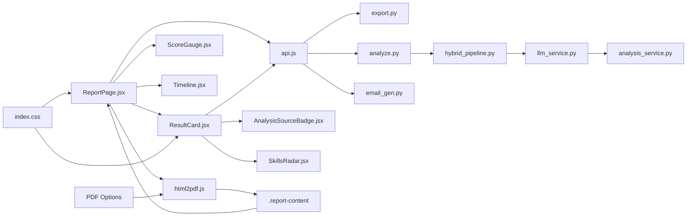

**Diagram sources**
- [ReportPage.jsx:82-296](file://app/frontend/src/pages/ReportPage.jsx#L82-L296)
- [ResultCard.jsx:265-626](file://app/frontend/src/components/ResultCard.jsx#L265-L626)
- [ResultCard.jsx:198-244](file://app/frontend/src/components/ResultCard.jsx#L198-L244)
- [ScoreGauge.jsx:1-97](file://app/frontend/src/components/ScoreGauge.jsx#L1-L97)
- [SkillsRadar.jsx:110-261](file://app/frontend/src/components/SkillsRadar.jsx#L110-L261)
- [Timeline.jsx:3-115](file://app/frontend/src/components/Timeline.jsx#L3-L115)
- [api.js:1-395](file://app/frontend/src/lib/api.js#L1-L395)
- [index.css:136-160](file://app/frontend/src/index.css#L136-L160)
- [export.py:55-104](file://app/backend/routes/export.py#L55-L104)
- [analyze.py:354-501](file://app/backend/routes/analyze.py#L354-L501)
- [email_gen.py:39-104](file://app/backend/routes/email_gen.py#L39-L104)
- [hybrid_pipeline.py:1322-1335](file://app/backend/services/hybrid_pipeline.py#L1322-L1335)
- [llm_service.py:256-273](file://app/backend/services/llm_service.py#L256-L273)

**Section sources**
- [ReportPage.jsx:82-296](file://app/frontend/src/pages/ReportPage.jsx#L82-L296)
- [ResultCard.jsx:265-626](file://app/frontend/src/components/ResultCard.jsx#L265-L626)
- [ResultCard.jsx:198-244](file://app/frontend/src/components/ResultCard.jsx#L198-L244)
- [api.js:1-395](file://app/frontend/src/lib/api.js#L1-L395)
- [export.py:55-104](file://app/backend/routes/export.py#L55-L104)
- [analyze.py:354-501](file://app/backend/routes/analyze.py#L354-L501)
- [email_gen.py:39-104](file://app/backend/routes/email_gen.py#L39-L104)
- [index.css:136-160](file://app/frontend/src/index.css#L136-L160)
- [hybrid_pipeline.py:1322-1335](file://app/backend/services/hybrid_pipeline.py#L1322-L1335)
- [llm_service.py:256-273](file://app/backend/services/llm_service.py#L256-L273)

## Performance Considerations
- **Enhanced PDF Generation**: Optimized html2pdf configuration with scale 2 provides better quality while maintaining reasonable file sizes
- **CORS Support**: useCORS: true enables cross-origin image loading without performance penalties
- **Reduced Logging**: logging: false minimizes console overhead during PDF generation
- **Letter Rendering**: letterRendering: true ensures precise typography in PDF output
- **Print Optimization**: Enhanced print styles remove shadows, adjust font sizes, and optimize spacing for the .report-content container
- **Export Streaming**: CSV and Excel are streamed from the backend to avoid large memory usage on the client
- **Client-side sharing**: Uses session storage to avoid network requests for sharing within the same tab
- **Recommendations**:
  - Keep print styles minimal to avoid layout thrashing
  - Prefer server-side exports for large datasets
  - Debounce name edits to avoid frequent PATCH requests
  - Monitor PDF generation performance with the enhanced configuration

## Troubleshooting Guide
Common issues and resolutions:
- Share link does not open report:
  - Ensure the report ID exists in session storage
  - Verify the URL includes the id query parameter
- **Enhanced PDF Download Issues**:
  - **PDF generation fails**: Check that .report-content element exists in DOM
  - **Poor quality PDF**: Verify scale: 2 setting is working correctly
  - **Cross-origin image errors**: Confirm useCORS: true is enabled
  - **Large PDF size**: Consider adjusting image quality setting
  - **Layout issues**: Review pagebreak configuration and CSS print styles
- Download PDF does nothing:
  - Confirm browser print dialog is enabled
  - Check that print styles are applied
  - Verify html2pdf.js is properly loaded
- Export downloads blank or partial data:
  - Verify backend endpoints are reachable
  - Confirm ids parameter is correctly passed
- Email generation fails:
  - Check Ollama availability and model readiness
  - Confirm candidate exists and has a recent analysis result

**Section sources**
- [ReportPage.jsx:127-135](file://app/frontend/src/pages/ReportPage.jsx#L127-L135)
- [ReportPage.jsx:137-137](file://app/frontend/src/pages/ReportPage.jsx#L137-L137)
- [ReportPage.jsx:236-276](file://app/frontend/src/pages/ReportPage.jsx#L236-L276)
- [ReportPage.jsx:249-266](file://app/frontend/src/pages/ReportPage.jsx#L249-L266)
- [api.js:183-204](file://app/frontend/src/lib/api.js#L183-L204)
- [email_gen.py:77-104](file://app/backend/routes/email_gen.py#L77-L104)

## Conclusion
The individual report system combines a responsive frontend with robust backend support to deliver a complete candidate analysis experience. ReportPage orchestrates the UI with **enhanced PDF generation capabilities**, ResultCard presents detailed insights, ScoreGauge communicates fit quickly, and Timeline contextualizes work history. **The enhanced PDF system now provides comprehensive screening report generation with optimized html2pdf configuration, preserving all analysis sections including candidate information, score summaries, risk assessments, and detailed recommendations in high-quality PDF format.** Sharing and PDF printing are streamlined for productivity, while CSV and Excel exports enable scalable data handling. Print optimization and branding are integrated through centralized styles with dedicated .report-content container styling.

## Appendices

### Customization Options
- Report layout:
  - Sidebar and main content split is controlled in ReportPage
  - Additional sections can be added by extending ResultCard
- Branding integration:
  - Brand colors and gradients are defined in Tailwind utilities and CSS
  - Update color classes to align with brand guidelines
- **Enhanced Print Optimization**:
  - Modify @media print rules in index.css to adjust margins, fonts, and UI removal
  - **Optimize .report-content container styling for PDF output**
  - **Fine-tune page break settings for optimal section preservation**
- Export formats:
  - Extend backend export.py to add new columns or sheets
  - Update frontend api.js to support additional formats
- **Enhanced PDF Generation Customization**:
  - Modify html2pdf configuration options in handleDownload function
  - **Adjust scale factor for quality vs file size balance**
  - **Configure page format and orientation settings**
  - **Customize image quality and compression settings**
  - **Tune page break modes for different content layouts**

**Section sources**
- [ReportPage.jsx:153-296](file://app/frontend/src/pages/ReportPage.jsx#L153-L296)
- [ResultCard.jsx:265-626](file://app/frontend/src/components/ResultCard.jsx#L265-L626)
- [ResultCard.jsx:198-244](file://app/frontend/src/components/ResultCard.jsx#L198-L244)
- [index.css:136-160](file://app/frontend/src/index.css#L136-L160)
- [index.css:174-183](file://app/frontend/src/index.css#L174-L183)
- [export.py:27-52](file://app/backend/routes/export.py#L27-L52)
- [ReportPage.jsx:249-266](file://app/frontend/src/pages/ReportPage.jsx#L249-L266)