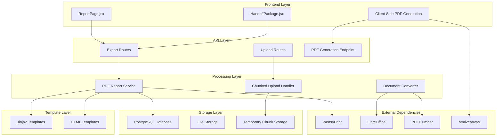
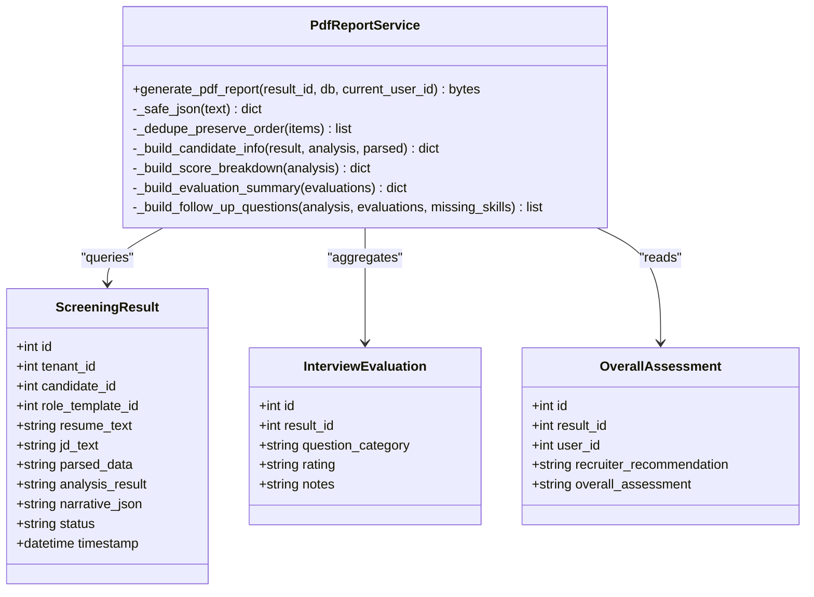
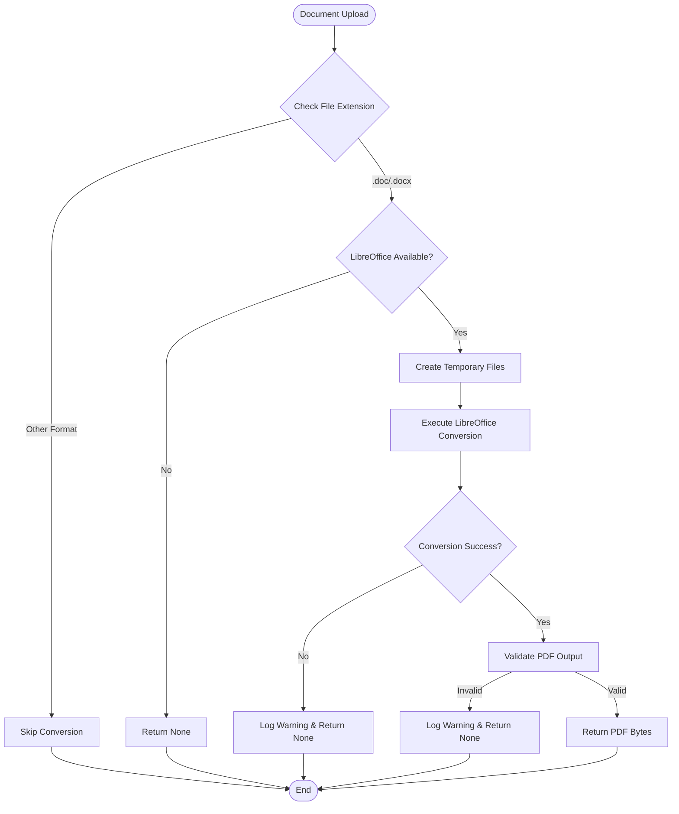
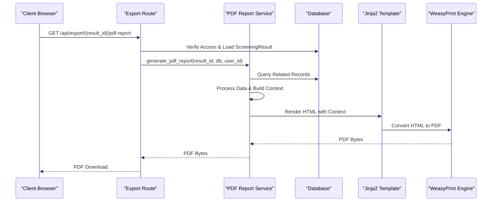
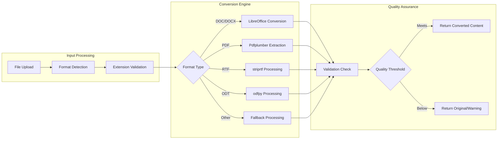
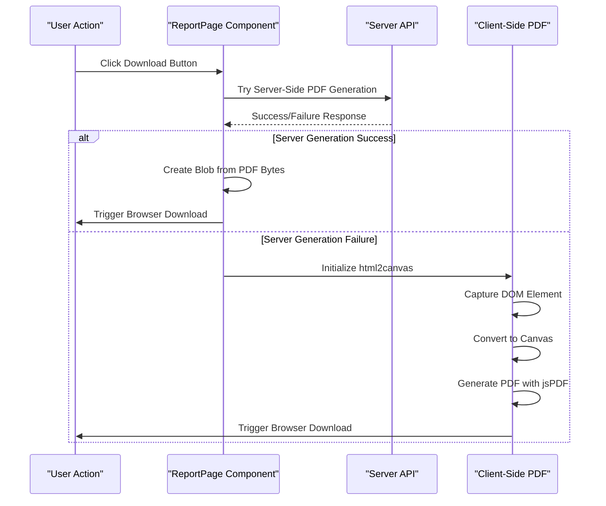
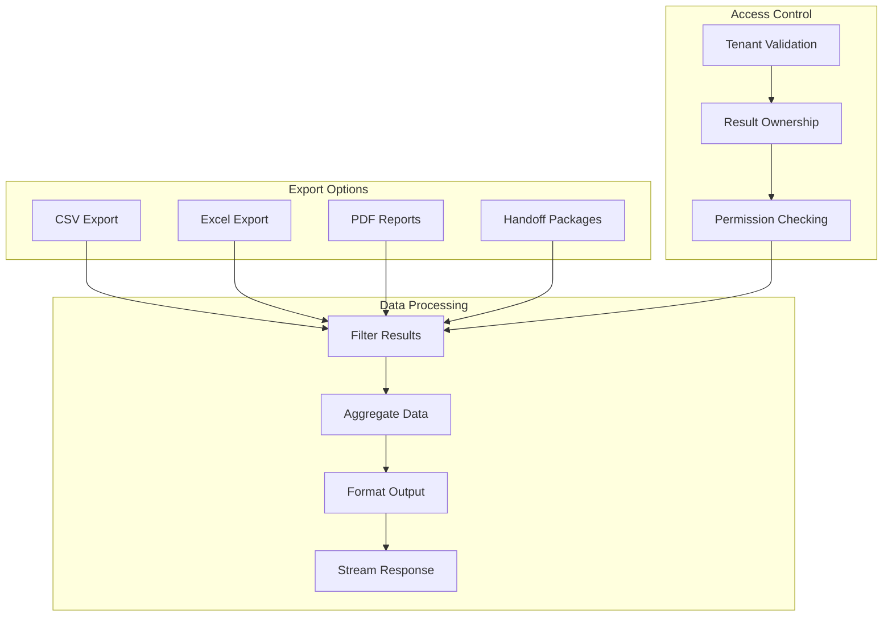
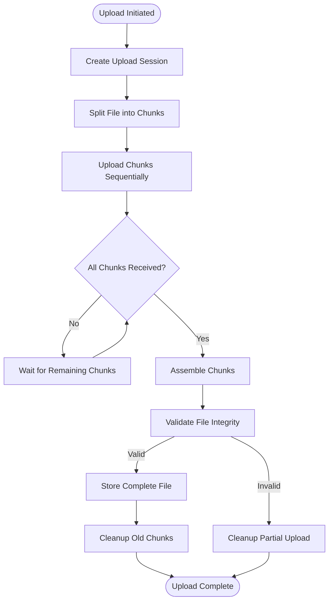
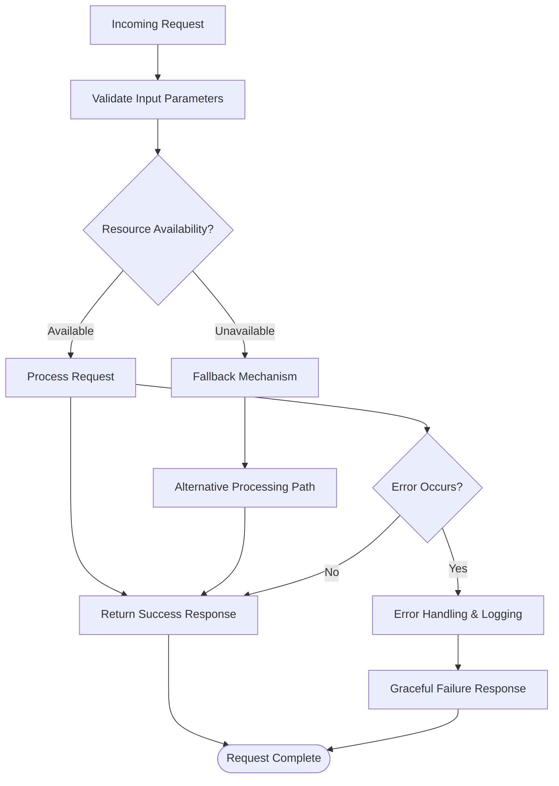
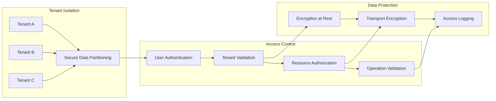

# PDF Reporting and Document Processing

<cite>
**Referenced Files in This Document**
- [pdf_report_service.py](file://app/backend/services/pdf_report_service.py)
- [report.html](file://app/backend/templates/report.html)
- [doc_converter.py](file://app/backend/services/doc_converter.py)
- [export.py](file://app/backend/routes/export.py)
- [upload.py](file://app/backend/routes/upload.py)
- [ReportPage.jsx](file://app/frontend/src/pages/ReportPage.jsx)
- [HandoffPackage.jsx](file://app/frontend/src/components/HandoffPackage.jsx)
- [requirements.txt](file://requirements.txt)
- [backend_requirements.txt](file://app/backend/requirements.txt)
- [db_models.py](file://app/backend/models/db_models.py)
</cite>

## Table of Contents
1. [Introduction](#introduction)
2. [System Architecture](#system-architecture)
3. [Core Components](#core-components)
4. [PDF Report Generation](#pdf-report-generation)
5. [Document Conversion Pipeline](#document-conversion-pipeline)
6. [Client-Side PDF Generation](#client-side-pdf-generation)
7. [Export Capabilities](#export-capabilities)
8. [Storage and File Management](#storage-and-file-management)
9. [Error Handling and Resilience](#error-handling-and-resilience)
10. [Performance Considerations](#performance-considerations)
11. [Security and Access Control](#security-and-access-control)
12. [Troubleshooting Guide](#troubleshooting-guide)
13. [Conclusion](#conclusion)

## Introduction

The Resume AI by ThetaLogics platform provides comprehensive PDF reporting and document processing capabilities designed for enterprise recruitment workflows. This system enables organizations to generate professional PDF reports from AI-powered candidate screening results, convert various document formats to PDF, and manage large file uploads efficiently.

The platform combines server-side PDF generation using WeasyPrint with Jinja2 templating, client-side PDF creation capabilities, and robust document conversion services. It supports multiple document formats including DOC, DOCX, and native PDF processing, with fallback mechanisms for reliability.

## System Architecture

The PDF reporting and document processing system follows a layered architecture with clear separation of concerns:

**Diagram sources**
- [pdf_report_service.py:1-300](file://app/backend/services/pdf_report_service.py#L1-L300)
- [export.py:313-364](file://app/backend/routes/export.py#L313-L364)
- [upload.py:99-361](file://app/backend/routes/upload.py#L99-L361)

## Core Components

### PDF Report Service

The PDF Report Service is the cornerstone of the document processing system, responsible for generating comprehensive enterprise-grade PDF reports from screening results.

**Diagram sources**
- [pdf_report_service.py:41-300](file://app/backend/services/pdf_report_service.py#L41-L300)
- [db_models.py:171-200](file://app/backend/models/db_models.py#L171-L200)

### Document Conversion Service

The Document Conversion Service provides enterprise-grade conversion capabilities for various document formats to PDF using LibreOffice headless mode.

**Diagram sources**
- [doc_converter.py:56-136](file://app/backend/services/doc_converter.py#L56-L136)

**Section sources**
- [pdf_report_service.py:1-300](file://app/backend/services/pdf_report_service.py#L1-L300)
- [doc_converter.py:1-159](file://app/backend/services/doc_converter.py#L1-L159)

## PDF Report Generation

### Template-Based Rendering

The system uses Jinja2 templating combined with WeasyPrint for professional PDF generation. The template structure supports multi-page documents with consistent branding and responsive layouts.

**Diagram sources**
- [export.py:313-364](file://app/backend/routes/export.py#L313-L364)
- [pdf_report_service.py:41-300](file://app/backend/services/pdf_report_service.py#L41-L300)

### Report Content Structure

The generated PDF reports contain comprehensive candidate assessment information organized across multiple sections:

1. **Executive Summary**: Candidate information, role title, AI score, recommendation, and recruiter status
2. **Recruiter Evaluation**: Detailed evaluation checklist and decision summary
3. **Score Breakdown**: Visual representation of skill match, experience, domain fit, education, stability, and architecture scores
4. **Skills Analysis**: Missing skills with severity indicators and matched skills display
5. **Risk Assessment**: Identified risk signals with severity categorization
6. **Detailed Analysis**: Employment gaps and comprehensive AI reasoning

**Section sources**
- [report.html:1-699](file://app/backend/templates/report.html#L1-L699)
- [pdf_report_service.py:262-299](file://app/backend/services/pdf_report_service.py#L262-L299)

## Document Conversion Pipeline

### Multi-Format Support

The document conversion system supports multiple input formats with intelligent fallback mechanisms:

| Format | Conversion Method | Quality | Speed |
|--------|-------------------|---------|-------|
| DOC/DOCX | LibreOffice Headless | High | Medium |
| PDF | Text Extraction | Medium | Fast |
| RTF | striprtf Library | Medium | Fast |
| ODT | odfpy Library | Medium | Fast |
| TXT | Native Python | Low | Very Fast |

### Conversion Process

**Diagram sources**
- [doc_converter.py:56-136](file://app/backend/services/doc_converter.py#L56-L136)

**Section sources**
- [doc_converter.py:17-136](file://app/backend/services/doc_converter.py#L17-L136)

## Client-Side PDF Generation

### Frontend Implementation

The frontend provides client-side PDF generation capabilities using html2canvas and jsPDF libraries, offering fallback functionality when server-side generation fails.

**Diagram sources**
- [ReportPage.jsx:308-377](file://app/frontend/src/pages/ReportPage.jsx#L308-L377)

### Client-Side Features

The client-side PDF generation includes advanced features for reliable document creation:

- **Responsive Design**: Automatic page break handling and CSS-based layout
- **Image Optimization**: High-quality JPEG compression with configurable quality
- **Canvas Scaling**: Adjustable resolution for optimal print quality
- **Cross-Origin Support**: CORS-enabled canvas rendering for external images
- **Error Recovery**: Comprehensive error handling with user-friendly feedback

**Section sources**
- [ReportPage.jsx:308-377](file://app/frontend/src/pages/ReportPage.jsx#L308-L377)
- [HandoffPackage.jsx:319-329](file://app/frontend/src/components/HandoffPackage.jsx#L319-L329)

## Export Capabilities

### Bulk Export System

The platform provides comprehensive export capabilities for screening results in multiple formats:

**Diagram sources**
- [export.py:24-108](file://app/backend/routes/export.py#L24-L108)

### Handoff Package Generation

The system generates comprehensive handoff packages for hiring managers with:

- **Comparison Matrix**: Multi-dimensional candidate comparison
- **Interview Scores**: Aggregated evaluation summaries
- **Candidate Profiles**: Complete candidate information
- **Recruiter Notes**: Personalized assessment details

**Section sources**
- [export.py:162-308](file://app/backend/routes/export.py#L162-L308)

## Storage and File Management

### Chunked Upload System

The platform implements a sophisticated chunked upload system designed to handle large files exceeding CDN limitations:

**Diagram sources**
- [upload.py:99-324](file://app/backend/routes/upload.py#L99-L324)

### File Storage Architecture

The system maintains separate storage locations for different file types:

- **Temporary Chunk Storage**: `/tmp/aria_chunks/` for upload processing
- **Permanent Storage**: PostgreSQL Large Object storage for resumes and documents
- **Cache Storage**: Application-level caching for frequently accessed files

**Section sources**
- [upload.py:39-46](file://app/backend/routes/upload.py#L39-L46)
- [db_models.py:128-149](file://app/backend/models/db_models.py#L128-L149)

## Error Handling and Resilience

### Graceful Degradation

The system implements comprehensive error handling with graceful degradation strategies:

### Error Categories and Responses

| Error Type | Handling Strategy | User Impact |
|------------|-------------------|-------------|
| Resource Unavailable | Fallback to alternative processing | Reduced functionality |
| Network Timeout | Retry with exponential backoff | Delayed response |
| Invalid Input | Immediate validation error | Clear error message |
| System Failure | Graceful degradation | Minimal disruption |
| Permission Denied | Access denied response | No unauthorized access |

**Section sources**
- [pdf_report_service.py:117-129](file://app/backend/services/pdf_report_service.py#L117-L129)
- [doc_converter.py:95-107](file://app/backend/services/doc_converter.py#L95-L107)

## Performance Considerations

### Optimization Strategies

The system implements several performance optimization strategies:

1. **Lazy Loading**: Deferred initialization of expensive resources
2. **Connection Pooling**: Efficient database connection management
3. **Memory Management**: Proper resource cleanup and garbage collection
4. **Caching**: Strategic caching of frequently accessed data
5. **Asynchronous Processing**: Non-blocking operations for heavy computations

### Scalability Features

- **Horizontal Scaling**: Stateless processing components
- **Load Balancing**: Distributed request handling
- **Database Optimization**: Indexed queries and efficient joins
- **CDN Integration**: Static asset delivery optimization

## Security and Access Control

### Multi-Tenant Architecture

The system enforces strict multi-tenant isolation:

**Diagram sources**
- [export.py:325-335](file://app/backend/routes/export.py#L325-L335)

### Security Measures

- **Input Validation**: Comprehensive sanitization and validation
- **Rate Limiting**: Protection against abuse and DoS attacks
- **Audit Logging**: Complete activity tracking and monitoring
- **Data Encryption**: Secure storage and transmission of sensitive data
- **CSRF Protection**: Cross-site request forgery prevention

**Section sources**
- [export.py:325-344](file://app/backend/routes/export.py#L325-L344)

## Troubleshooting Guide

### Common Issues and Solutions

#### PDF Generation Failures

**Issue**: WeasyPrint conversion errors
- **Cause**: Missing system dependencies or memory constraints
- **Solution**: Install WeasyPrint dependencies and increase memory allocation
- **Prevention**: Monitor system resources and implement retry logic

**Issue**: Template rendering errors  
- **Cause**: Missing data context or invalid template syntax
- **Solution**: Validate data context and fix template syntax errors
- **Prevention**: Implement comprehensive data validation

#### Document Conversion Problems

**Issue**: LibreOffice not found
- **Cause**: Missing LibreOffice installation
- **Solution**: Install LibreOffice and configure PATH environment variable
- **Prevention**: Implement health checks for dependencies

**Issue**: Conversion timeouts
- **Cause**: Large file sizes or system overload
- **Solution**: Optimize file sizes and implement timeout adjustments
- **Prevention**: Monitor system performance and implement load balancing

#### Upload Issues

**Issue**: Chunk upload failures
- **Cause**: Network interruptions or storage issues
- **Solution**: Implement retry mechanisms and cleanup procedures
- **Prevention**: Monitor upload progress and implement automatic cleanup

**Section sources**
- [pdf_report_service.py:117-129](file://app/backend/services/pdf_report_service.py#L117-L129)
- [doc_converter.py:124-129](file://app/backend/services/doc_converter.py#L124-L129)
- [upload.py:85-97](file://app/backend/routes/upload.py#L85-L97)

## Conclusion

The Resume AI by ThetaLogics PDF reporting and document processing system provides a comprehensive solution for enterprise recruitment workflows. The system combines robust server-side PDF generation with flexible client-side alternatives, extensive document conversion capabilities, and scalable file management infrastructure.

Key strengths of the system include:

- **Multi-format Support**: Comprehensive document processing across various formats
- **Professional Output**: High-quality PDF generation with consistent branding
- **Reliability**: Graceful fallback mechanisms and comprehensive error handling
- **Scalability**: Designed for horizontal scaling and high-volume processing
- **Security**: Multi-tenant isolation with comprehensive access controls
- **Flexibility**: Client-side and server-side generation options for diverse use cases

The system successfully addresses the complex requirements of modern recruitment technology, providing organizations with powerful tools for candidate assessment and reporting while maintaining high standards for performance, security, and user experience.