# Reporting & Analytics

<cite>
**Referenced Files in This Document**
- [Dashboard.jsx](file://app/frontend/src/pages/Dashboard.jsx)
- [ComparePage.jsx](file://app/frontend/src/pages/ComparePage.jsx)
- [ReportPage.jsx](file://app/frontend/src/pages/ReportPage.jsx)
- [SkillsRadar.jsx](file://app/frontend/src/components/SkillsRadar.jsx)
- [Timeline.jsx](file://app/frontend/src/components/Timeline.jsx)
- [ScoreGauge.jsx](file://app/frontend/src/components/ScoreGauge.jsx)
- [ResultCard.jsx](file://app/frontend/src/components/ResultCard.jsx)
- [api.js](file://app/frontend/src/lib/api.js)
- [analyze.py](file://app/backend/routes/analyze.py)
- [compare.py](file://app/backend/routes/compare.py)
- [export.py](file://app/backend/routes/export.py)
- [db_models.py](file://app/backend/models/db_models.py)
- [analysis_service.py](file://app/backend/services/analysis_service.py)
- [hybrid_pipeline.py](file://app/backend/services/hybrid_pipeline.py)
</cite>

## Table of Contents
1. [Introduction](#introduction)
2. [Project Structure](#project-structure)
3. [Core Components](#core-components)
4. [Architecture Overview](#architecture-overview)
5. [Detailed Component Analysis](#detailed-component-analysis)
6. [Dependency Analysis](#dependency-analysis)
7. [Performance Considerations](#performance-considerations)
8. [Troubleshooting Guide](#troubleshooting-guide)
9. [Conclusion](#conclusion)
10. [Appendices](#appendices)

## Introduction
This document describes the reporting and analytics capabilities of Resume AI by ThetaLogics. It covers the dashboard components, score visualization techniques, interactive charts, comparison functionality, skills radar, timeline components, progress indicators, export capabilities, customization options, and performance considerations for large datasets and real-time updates.

## Project Structure
The analytics and reporting features span the frontend React application and the backend FastAPI service:
- Frontend pages and components render results, comparisons, and interactive visualizations.
- Backend routes orchestrate analysis, comparison, and exports, persisting results to the database.
- Services implement the hybrid analysis pipeline and scoring logic.

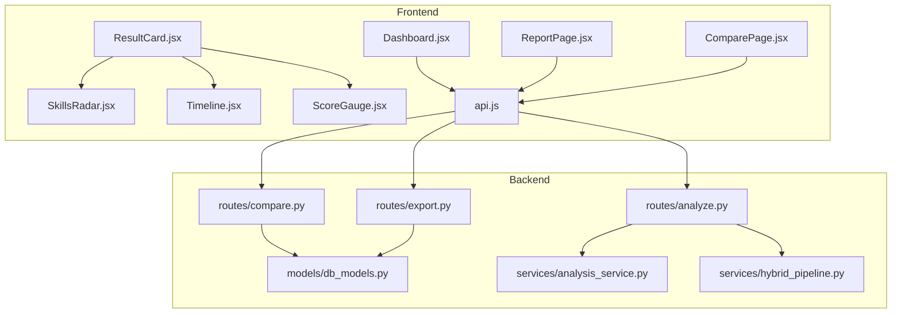

**Diagram sources**
- [Dashboard.jsx:1-330](file://app/frontend/src/pages/Dashboard.jsx#L1-330)
- [ReportPage.jsx:1-297](file://app/frontend/src/pages/ReportPage.jsx#L1-297)
- [ComparePage.jsx:1-230](file://app/frontend/src/pages/ComparePage.jsx#L1-230)
- [ResultCard.jsx:1-627](file://app/frontend/src/components/ResultCard.jsx#L1-627)
- [SkillsRadar.jsx:1-261](file://app/frontend/src/components/SkillsRadar.jsx#L1-261)
- [Timeline.jsx:1-115](file://app/frontend/src/components/Timeline.jsx#L1-115)
- [ScoreGauge.jsx:1-97](file://app/frontend/src/components/ScoreGauge.jsx#L1-97)
- [api.js:1-395](file://app/frontend/src/lib/api.js#L1-395)
- [analyze.py:1-813](file://app/backend/routes/analyze.py#L1-813)
- [compare.py:1-78](file://app/backend/routes/compare.py#L1-78)
- [export.py:1-105](file://app/backend/routes/export.py#L1-105)
- [db_models.py:1-250](file://app/backend/models/db_models.py#L1-250)
- [analysis_service.py:1-121](file://app/backend/services/analysis_service.py#L1-121)
- [hybrid_pipeline.py:1-200](file://app/backend/services/hybrid_pipeline.py#L1-200)

**Section sources**
- [Dashboard.jsx:1-330](file://app/frontend/src/pages/Dashboard.jsx#L1-330)
- [ReportPage.jsx:1-297](file://app/frontend/src/pages/ReportPage.jsx#L1-297)
- [ComparePage.jsx:1-230](file://app/frontend/src/pages/ComparePage.jsx#L1-230)
- [ResultCard.jsx:1-627](file://app/frontend/src/components/ResultCard.jsx#L1-627)
- [SkillsRadar.jsx:1-261](file://app/frontend/src/components/SkillsRadar.jsx#L1-261)
- [Timeline.jsx:1-115](file://app/frontend/src/components/Timeline.jsx#L1-115)
- [ScoreGauge.jsx:1-97](file://app/frontend/src/components/ScoreGauge.jsx#L1-97)
- [api.js:1-395](file://app/frontend/src/lib/api.js#L1-395)
- [analyze.py:1-813](file://app/backend/routes/analyze.py#L1-813)
- [compare.py:1-78](file://app/backend/routes/compare.py#L1-78)
- [export.py:1-105](file://app/backend/routes/export.py#L1-105)
- [db_models.py:1-250](file://app/backend/models/db_models.py#L1-250)
- [analysis_service.py:1-121](file://app/backend/services/analysis_service.py#L1-121)
- [hybrid_pipeline.py:1-200](file://app/backend/services/hybrid_pipeline.py#L1-200)

## Core Components
- Dashboard: Presents the analysis pipeline progress, usage widget, and submission controls.
- Report Page: Renders the candidate report with score visualization, explainability, skills radar, timeline, and export/print actions.
- Compare Page: Compares up to five candidates side-by-side with score breakdowns and export.
- ResultCard: Aggregates analysis results, score breakdowns, strengths/weaknesses, risk signals, explainability, education analysis, domain fit, and interview kit.
- SkillsRadar: Visualizes matched vs missing skills by category with coverage metrics and bar chart.
- Timeline: Displays employment history with gaps and severity.
- ScoreGauge: Circular score visualization with thresholds and status badges.
- API client: Wraps HTTP requests to backend endpoints for analysis, comparison, and exports.

**Section sources**
- [Dashboard.jsx:161-330](file://app/frontend/src/pages/Dashboard.jsx#L161-330)
- [ReportPage.jsx:82-297](file://app/frontend/src/pages/ReportPage.jsx#L82-297)
- [ComparePage.jsx:20-230](file://app/frontend/src/pages/ComparePage.jsx#L20-230)
- [ResultCard.jsx:265-627](file://app/frontend/src/components/ResultCard.jsx#L265-627)
- [SkillsRadar.jsx:110-261](file://app/frontend/src/components/SkillsRadar.jsx#L110-261)
- [Timeline.jsx:3-115](file://app/frontend/src/components/Timeline.jsx#L3-115)
- [ScoreGauge.jsx:1-97](file://app/frontend/src/components/ScoreGauge.jsx#L1-97)
- [api.js:47-204](file://app/frontend/src/lib/api.js#L47-204)

## Architecture Overview
The system streams analysis results from the backend to the frontend, persists results to the database, and supports batch operations and exports.

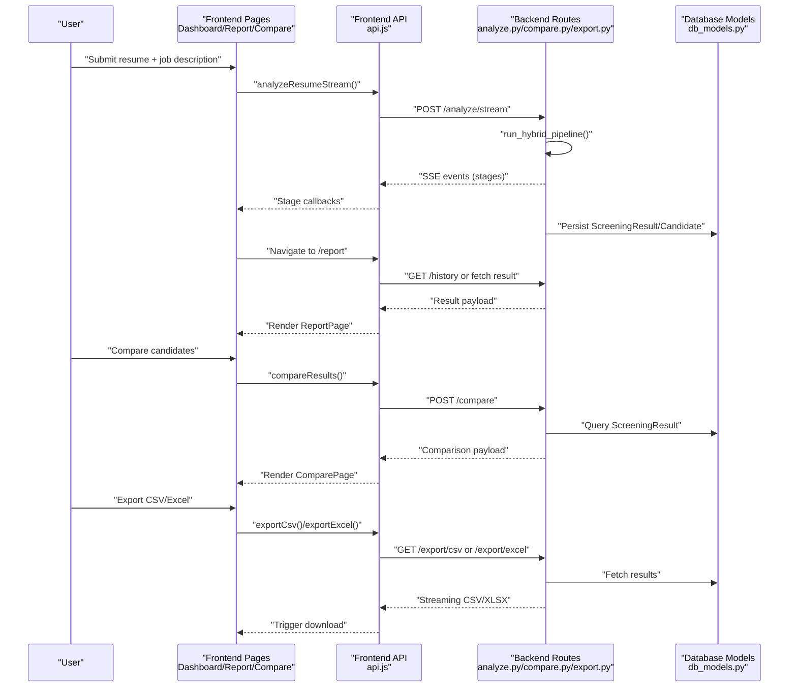

**Diagram sources**
- [api.js:75-147](file://app/frontend/src/lib/api.js#L75-147)
- [analyze.py:506-646](file://app/backend/routes/analyze.py#L506-646)
- [compare.py:16-78](file://app/backend/routes/compare.py#L16-78)
- [export.py:55-105](file://app/backend/routes/export.py#L55-105)
- [db_models.py:128-147](file://app/backend/models/db_models.py#L128-147)

## Detailed Component Analysis

### Dashboard: Pipeline Progress and Usage
- Tracks pipeline stages and derives active stages based on completion.
- Shows a progress panel with grouped stages and a usage widget indicating monthly analysis consumption.
- Submits analysis with optional scoring weights and navigates to the report upon completion.

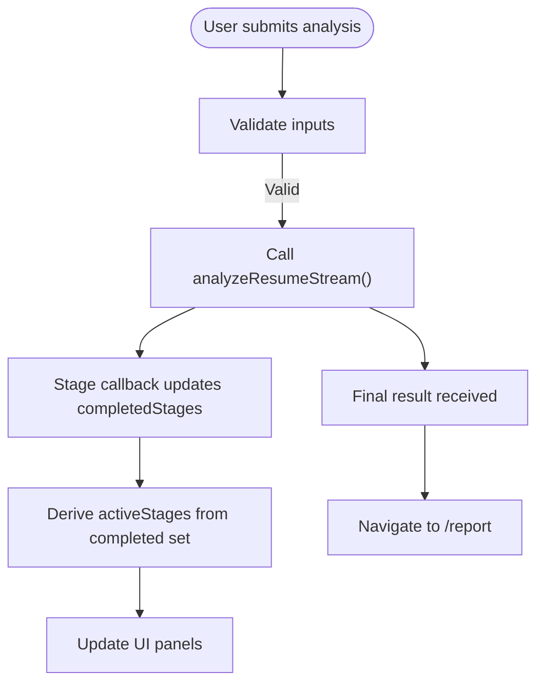

**Diagram sources**
- [Dashboard.jsx:219-275](file://app/frontend/src/pages/Dashboard.jsx#L219-275)

**Section sources**
- [Dashboard.jsx:161-330](file://app/frontend/src/pages/Dashboard.jsx#L161-330)
- [api.js:75-147](file://app/frontend/src/lib/api.js#L75-147)

### Report Page: Score Visualization and Explainability
- Displays a ScoreGauge with thresholds and recommendation badge.
- Renders ResultCard with score breakdown bars, strengths/weaknesses, risk signals, explainability, education analysis, domain fit, and interview kit.
- Provides share and print actions; integrates SkillsRadar and Timeline components.

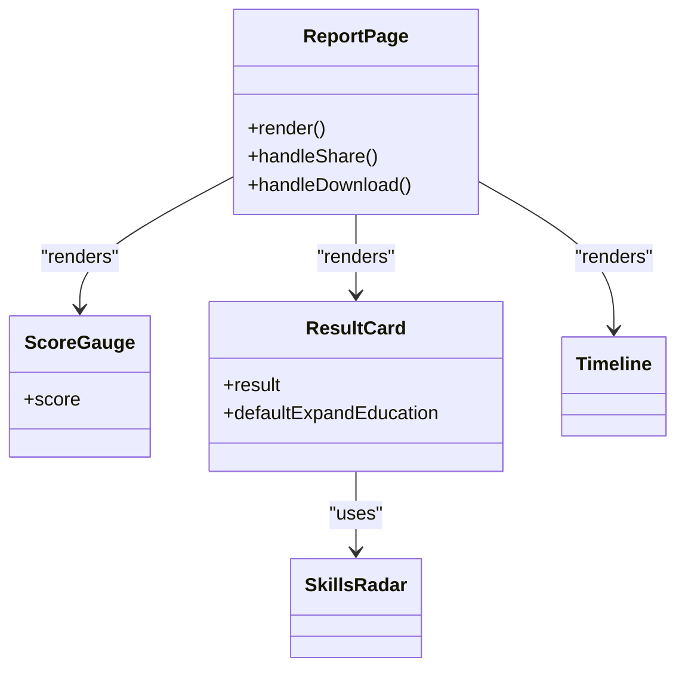

**Diagram sources**
- [ReportPage.jsx:82-297](file://app/frontend/src/pages/ReportPage.jsx#L82-297)
- [ScoreGauge.jsx:1-97](file://app/frontend/src/components/ScoreGauge.jsx#L1-97)
- [ResultCard.jsx:265-627](file://app/frontend/src/components/ResultCard.jsx#L265-627)
- [SkillsRadar.jsx:110-261](file://app/frontend/src/components/SkillsRadar.jsx#L110-261)
- [Timeline.jsx:3-115](file://app/frontend/src/components/Timeline.jsx#L3-115)

**Section sources**
- [ReportPage.jsx:82-297](file://app/frontend/src/pages/ReportPage.jsx#L82-297)
- [ScoreGauge.jsx:1-97](file://app/frontend/src/components/ScoreGauge.jsx#L1-97)
- [ResultCard.jsx:265-627](file://app/frontend/src/components/ResultCard.jsx#L265-627)

### Compare Page: Side-by-Side Evaluation
- Allows selection of 2–5 candidates from history.
- Calls compare endpoint to compute winners per category and renders a comparison table with scores and recommendations.

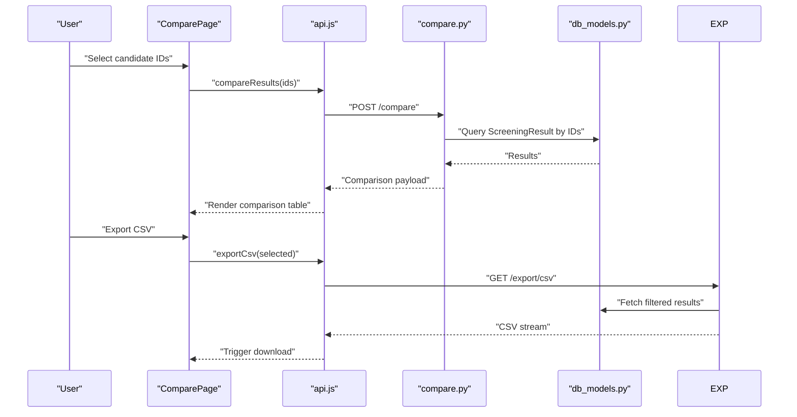

**Diagram sources**
- [ComparePage.jsx:20-230](file://app/frontend/src/pages/ComparePage.jsx#L20-230)
- [api.js:176-204](file://app/frontend/src/lib/api.js#L176-204)
- [compare.py:16-78](file://app/backend/routes/compare.py#L16-78)
- [export.py:55-105](file://app/backend/routes/export.py#L55-105)
- [db_models.py:128-147](file://app/backend/models/db_models.py#L128-147)

**Section sources**
- [ComparePage.jsx:20-230](file://app/frontend/src/pages/ComparePage.jsx#L20-230)
- [api.js:176-204](file://app/frontend/src/lib/api.js#L176-204)
- [compare.py:16-78](file://app/backend/routes/compare.py#L16-78)
- [export.py:55-105](file://app/backend/routes/export.py#L55-105)

### Skills Radar: Category-Based Gap Analysis
- Categorizes skills and computes matched vs missing counts per category.
- Shows overall match percentage with circular progress and a vertical bar chart.
- Displays skill chips per category with distinct colors.

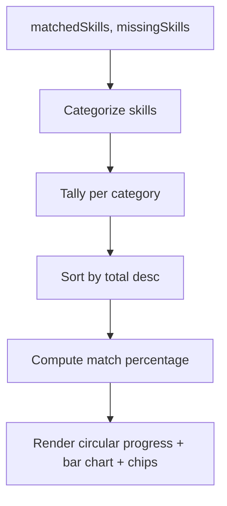

**Diagram sources**
- [SkillsRadar.jsx:110-261](file://app/frontend/src/components/SkillsRadar.jsx#L110-261)

**Section sources**
- [SkillsRadar.jsx:110-261](file://app/frontend/src/components/SkillsRadar.jsx#L110-261)

### Timeline: Employment History and Gaps
- Sorts jobs by start date and renders a vertical timeline.
- Highlights short tenures and displays gaps with duration and severity.

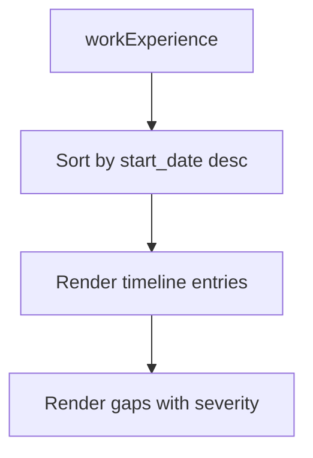

**Diagram sources**
- [Timeline.jsx:3-115](file://app/frontend/src/components/Timeline.jsx#L3-115)

**Section sources**
- [Timeline.jsx:3-115](file://app/frontend/src/components/Timeline.jsx#L3-115)

### Score Gauge: Threshold-Based Visualization
- Visualizes fit score with color-coded arcs and labels.
- Handles pending state when score is unavailable.

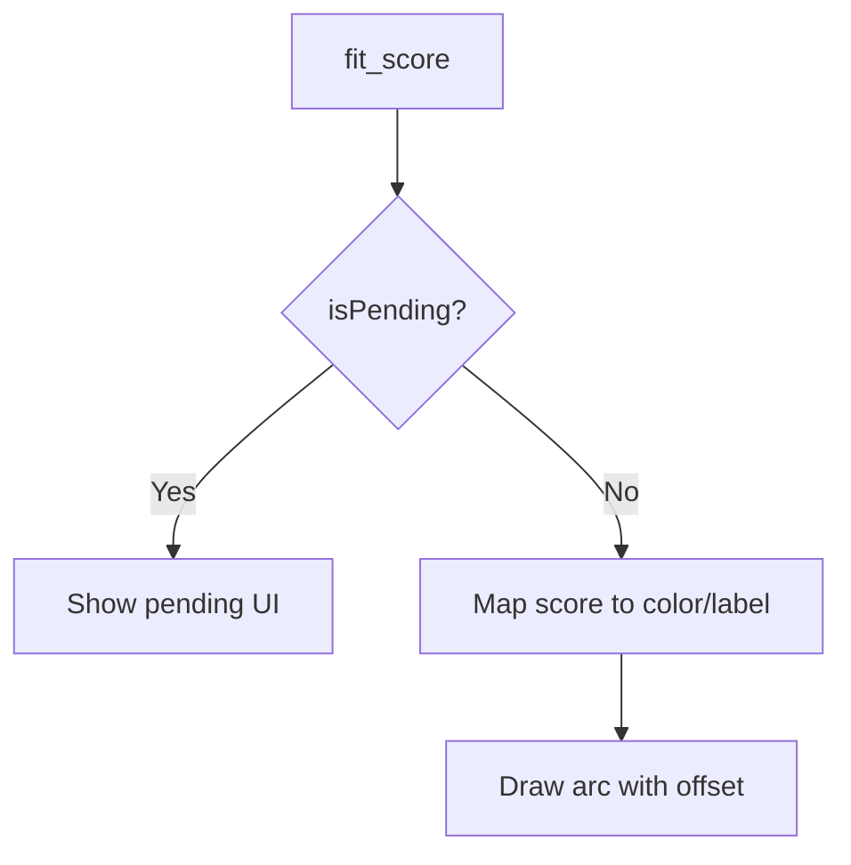

**Diagram sources**
- [ScoreGauge.jsx:1-97](file://app/frontend/src/components/ScoreGauge.jsx#L1-97)

**Section sources**
- [ScoreGauge.jsx:1-97](file://app/frontend/src/components/ScoreGauge.jsx#L1-97)

### ResultCard: Comprehensive Analysis Display
- Renders score breakdown bars, strengths/weaknesses, risk signals, explainability, education analysis, domain fit, and interview kit tabs.
- Integrates SkillsRadar and Timeline for deeper insights.

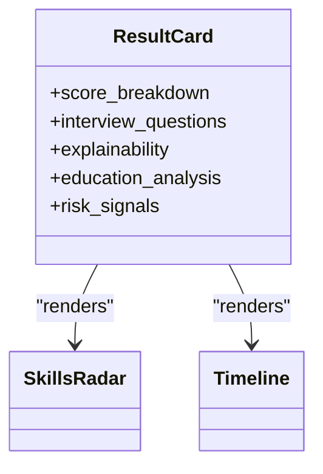

**Diagram sources**
- [ResultCard.jsx:265-627](file://app/frontend/src/components/ResultCard.jsx#L265-627)
- [SkillsRadar.jsx:110-261](file://app/frontend/src/components/SkillsRadar.jsx#L110-261)
- [Timeline.jsx:3-115](file://app/frontend/src/components/Timeline.jsx#L3-115)

**Section sources**
- [ResultCard.jsx:265-627](file://app/frontend/src/components/ResultCard.jsx#L265-627)

### Backend Analysis Pipeline
- Hybrid pipeline: Python-first scoring and a single LLM call for narrative.
- Supports streaming SSE events and fallbacks when LLM is unavailable.
- Deduplicates candidates and stores enriched profiles for reuse.

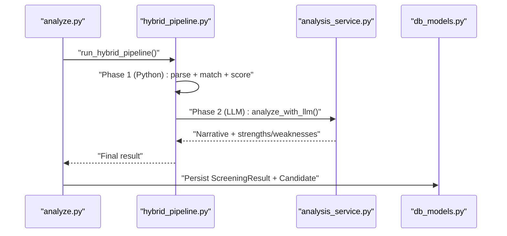

**Diagram sources**
- [analyze.py:268-318](file://app/backend/routes/analyze.py#L268-318)
- [hybrid_pipeline.py:1-200](file://app/backend/services/hybrid_pipeline.py#L1-200)
- [analysis_service.py:10-53](file://app/backend/services/analysis_service.py#L10-53)
- [db_models.py:128-147](file://app/backend/models/db_models.py#L128-147)

**Section sources**
- [analyze.py:268-318](file://app/backend/routes/analyze.py#L268-318)
- [hybrid_pipeline.py:1-200](file://app/backend/services/hybrid_pipeline.py#L1-200)
- [analysis_service.py:10-53](file://app/backend/services/analysis_service.py#L10-53)
- [db_models.py:128-147](file://app/backend/models/db_models.py#L128-147)

## Dependency Analysis
- Frontend depends on API client for all backend interactions.
- Backend routes depend on SQLAlchemy models and services.
- Analysis pipeline integrates Python scoring and LLM reasoning.

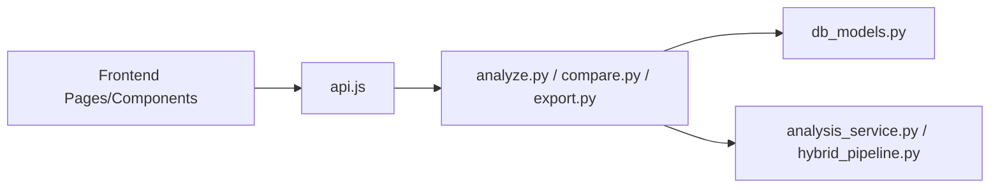

**Diagram sources**
- [api.js:1-395](file://app/frontend/src/lib/api.js#L1-395)
- [analyze.py:1-813](file://app/backend/routes/analyze.py#L1-813)
- [compare.py:1-78](file://app/backend/routes/compare.py#L1-78)
- [export.py:1-105](file://app/backend/routes/export.py#L1-105)
- [db_models.py:1-250](file://app/backend/models/db_models.py#L1-250)
- [analysis_service.py:1-121](file://app/backend/services/analysis_service.py#L1-121)
- [hybrid_pipeline.py:1-200](file://app/backend/services/hybrid_pipeline.py#L1-200)

**Section sources**
- [api.js:1-395](file://app/frontend/src/lib/api.js#L1-395)
- [analyze.py:1-813](file://app/backend/routes/analyze.py#L1-813)
- [compare.py:1-78](file://app/backend/routes/compare.py#L1-78)
- [export.py:1-105](file://app/backend/routes/export.py#L1-105)
- [db_models.py:1-250](file://app/backend/models/db_models.py#L1-250)
- [analysis_service.py:1-121](file://app/backend/services/analysis_service.py#L1-121)
- [hybrid_pipeline.py:1-200](file://app/backend/services/hybrid_pipeline.py#L1-200)

## Performance Considerations
- Streaming: The frontend receives incremental updates via SSE, enabling responsive UI during long-running analysis.
- Concurrency: LLM semaphore limits concurrent reasoning calls to maintain stability.
- Background processing: Long-running tasks offload parsing and scoring to threads to avoid blocking the event loop.
- Caching: Job description parsing is cached per hash to reduce repeated work across requests and workers.
- Pagination and limits: History and batch sizes are constrained by subscription plans to prevent overload.

[No sources needed since this section provides general guidance]

## Troubleshooting Guide
- Ollama/LangChain unavailability: The system falls back to Python-only scores and deterministic narrative; UI indicates “LLM offline”.
- Usage limits: Exceeding monthly quotas triggers a 429 response; the frontend should surface actionable messages.
- Network errors: The API client retries unauthorized requests with token refresh and redirects to login when needed.
- Large files: Backend enforces size limits for resumes and job description files.

**Section sources**
- [ReportPage.jsx:187-197](file://app/frontend/src/pages/ReportPage.jsx#L187-197)
- [api.js:19-43](file://app/frontend/src/lib/api.js#L19-43)
- [analyze.py:364-367](file://app/backend/routes/analyze.py#L364-367)
- [analyze.py:373-380](file://app/backend/routes/analyze.py#L373-380)

## Conclusion
Resume AI provides a robust analytics and reporting system with real-time progress, rich visualizations, and export capabilities. The hybrid pipeline ensures reliable scoring even without LLM availability, while the frontend components deliver clear insights through gauges, radar charts, timelines, and explainability.

[No sources needed since this section summarizes without analyzing specific files]

## Appendices

### Export Capabilities
- CSV: Endpoint returns a streamed CSV file with selected result IDs.
- Excel: Endpoint returns a streamed XLSX file with the same dataset.

**Section sources**
- [export.py:55-105](file://app/backend/routes/export.py#L55-105)
- [api.js:183-204](file://app/frontend/src/lib/api.js#L183-204)

### Customization Options
- Scoring weights: Provided during analysis to influence score breakdown.
- Candidate name editing: Inline editor in the report page.
- Template-based emails: Email generation integrated via backend templates.

**Section sources**
- [Dashboard.jsx:212-212](file://app/frontend/src/pages/Dashboard.jsx#L212-212)
- [ReportPage.jsx:12-80](file://app/frontend/src/pages/ReportPage.jsx#L12-80)
- [api.js:239-242](file://app/frontend/src/lib/api.js#L239-242)

### Extending Analytics Features
- Add new visualization components by composing existing building blocks (e.g., integrate a new chart in ResultCard).
- Extend backend services to compute additional metrics and expose them via the analysis pipeline.
- Introduce new export formats by adding endpoints similar to CSV/Excel.

[No sources needed since this section provides general guidance]