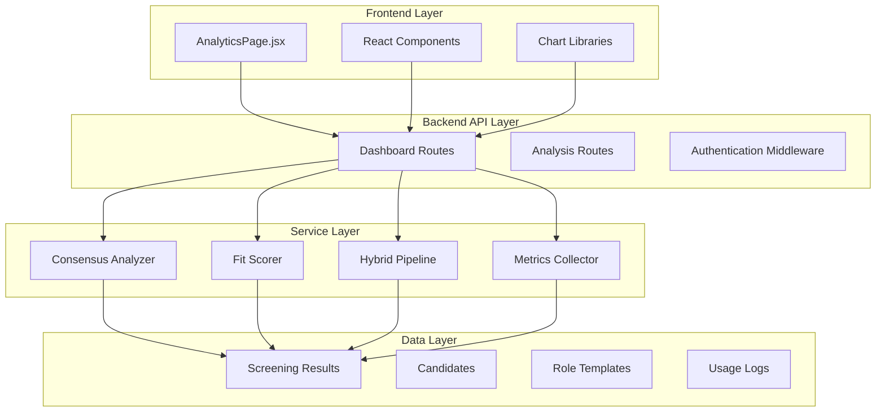
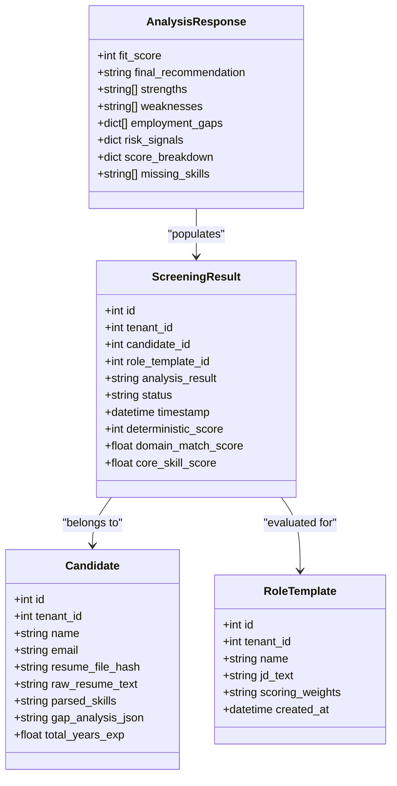
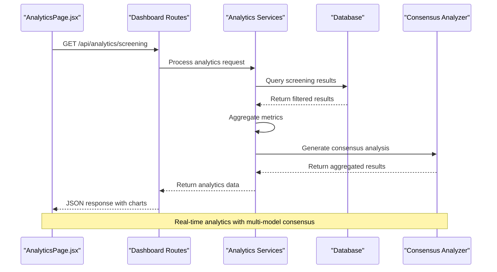
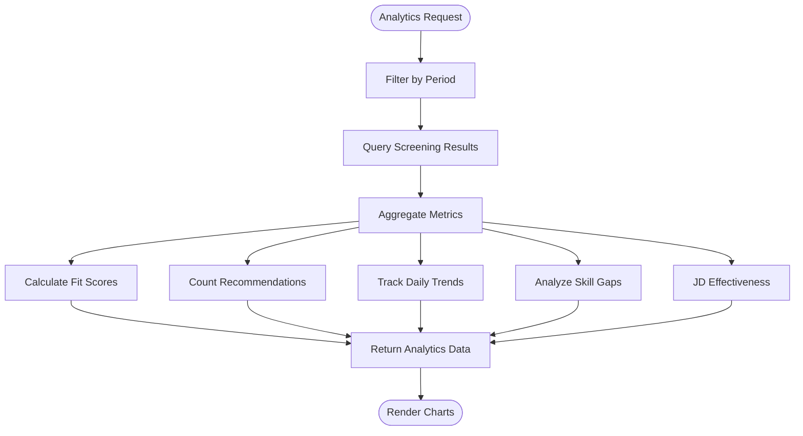
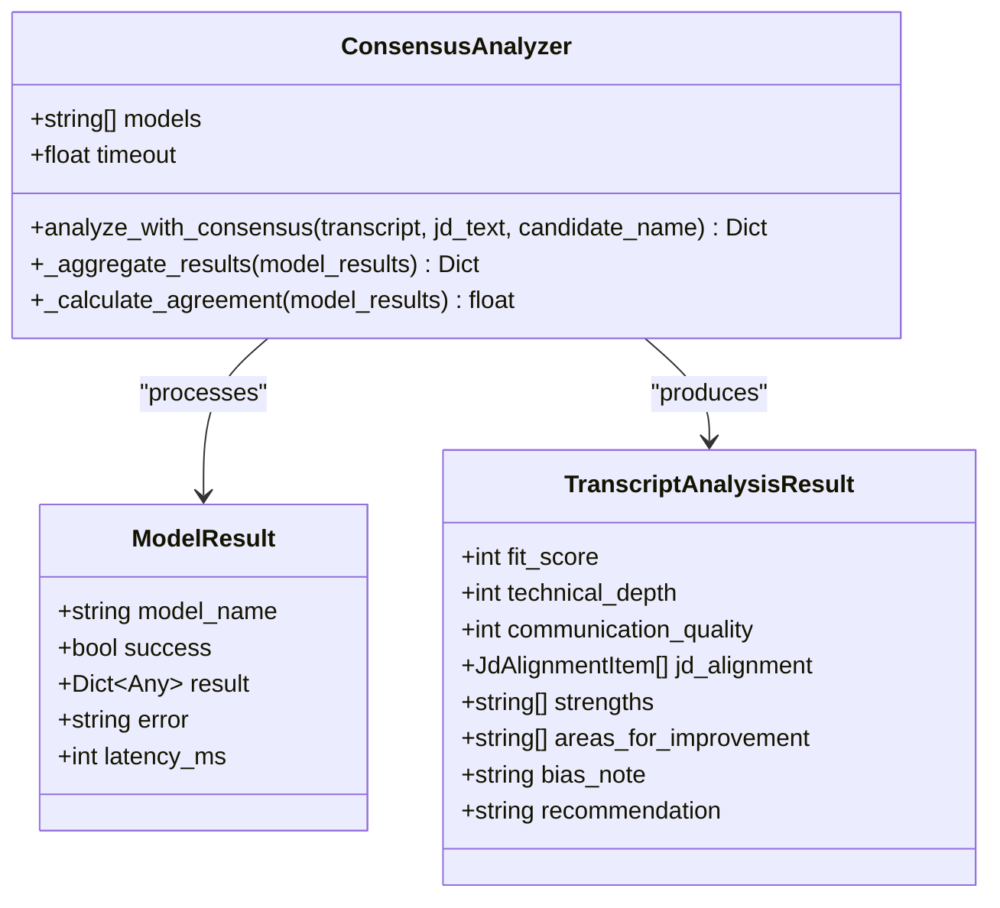
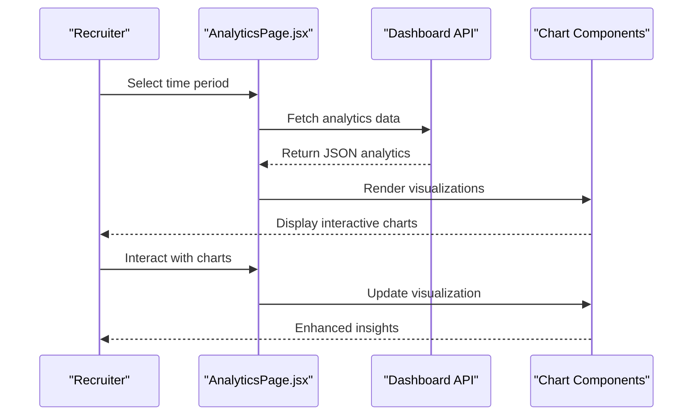
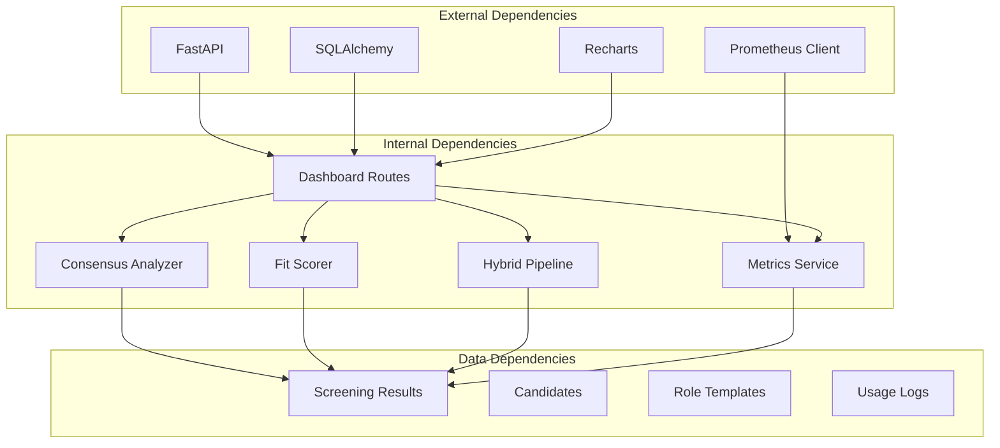

# Screening Analytics

<cite>
**Referenced Files in This Document**
- [dashboard.py](file://app/backend/routes/dashboard.py)
- [metrics.py](file://app/backend/services/metrics.py)
- [consensus_analyzer.py](file://app/backend/services/consensus_analyzer.py)
- [schemas.py](file://app/backend/models/schemas.py)
- [AnalyticsPage.jsx](file://app/frontend/src/pages/AnalyticsPage.jsx)
- [analysis_service.py](file://app/backend/services/analysis_service.py)
- [db_models.py](file://app/backend/models/db_models.py)
- [analyze.py](file://app/backend/routes/analyze.py)
- [hybrid_pipeline.py](file://app/backend/services/hybrid_pipeline.py)
- [fit_scorer.py](file://app/backend/services/fit_scorer.py)
- [main.py](file://app/backend/main.py)
</cite>

## Table of Contents
1. [Introduction](#introduction)
2. [Project Structure](#project-structure)
3. [Core Components](#core-components)
4. [Architecture Overview](#architecture-overview)
5. [Detailed Component Analysis](#detailed-component-analysis)
6. [Dependency Analysis](#dependency-analysis)
7. [Performance Considerations](#performance-considerations)
8. [Troubleshooting Guide](#troubleshooting-guide)
9. [Conclusion](#conclusion)

## Introduction

Screening Analytics is a comprehensive system within the ARIA (AI Resume Intelligence) platform that provides real-time insights into the candidate screening process. The system combines automated resume analysis with advanced analytics capabilities to deliver actionable intelligence for recruitment teams. It features a sophisticated multi-model consensus analyzer, comprehensive dashboard metrics, and a modern React-based frontend interface.

The analytics system processes screening results through multiple analytical lenses, providing organizations with detailed insights into their recruitment pipeline performance, candidate quality trends, and decision-making effectiveness. Built with scalability and reliability in mind, the system handles large volumes of screening data while maintaining real-time responsiveness.

## Project Structure

The Screening Analytics system follows a layered architecture with clear separation of concerns:

**Diagram sources**
- [dashboard.py:1-382](file://app/backend/routes/dashboard.py#L1-L382)
- [AnalyticsPage.jsx:1-452](file://app/frontend/src/pages/AnalyticsPage.jsx#L1-L452)

**Section sources**
- [dashboard.py:1-382](file://app/backend/routes/dashboard.py#L1-L382)
- [AnalyticsPage.jsx:1-452](file://app/frontend/src/pages/AnalyticsPage.jsx#L1-L452)

## Core Components

### Dashboard Analytics Engine

The dashboard analytics engine serves as the central hub for screening analytics, providing comprehensive insights into the recruitment pipeline. It processes screening results through multiple analytical filters to generate actionable metrics.

Key features include:
- Real-time dashboard summaries with action items and pipeline status
- Weekly activity tracking with candidate analysis trends
- Comprehensive screening analytics with score distributions and recommendation breakdowns
- JD effectiveness tracking across different roles and departments
- Pass-through funnel analysis showing conversion rates from initial screening to final hiring decisions

### Consensus Analyzer

The consensus analyzer implements a sophisticated multi-model approach to reduce single-model bias in candidate evaluation. By running analyses through multiple language models and aggregating results statistically, it provides more reliable and consistent screening outcomes.

Core capabilities:
- Parallel analysis execution across multiple models (gemma2:27b, llama3.1:8b, qwen2.5:14b)
- Statistical aggregation using median-based scoring for robustness
- Model agreement metrics to assess confidence levels
- Fallback mechanisms when individual models fail
- Comprehensive result merging for strengths, weaknesses, and recommendations

### Analytics Data Models

The system utilizes a comprehensive set of data models to capture and analyze screening analytics:

**Diagram sources**
- [db_models.py:135-170](file://app/backend/models/db_models.py#L135-L170)
- [db_models.py:102-133](file://app/backend/models/db_models.py#L102-L133)
- [db_models.py:175-188](file://app/backend/models/db_models.py#L175-L188)
- [schemas.py:119-165](file://app/backend/models/schemas.py#L119-L165)

**Section sources**
- [db_models.py:135-170](file://app/backend/models/db_models.py#L135-L170)
- [schemas.py:119-165](file://app/backend/models/schemas.py#L119-L165)

## Architecture Overview

The Screening Analytics system employs a microservices architecture with clear separation between data processing, analytics computation, and presentation layers:

**Diagram sources**
- [dashboard.py:240-382](file://app/backend/routes/dashboard.py#L240-L382)
- [consensus_analyzer.py:66-131](file://app/backend/services/consensus_analyzer.py#L66-L131)

The architecture ensures high availability and fault tolerance through:
- Asynchronous processing for long-running analytics computations
- Database caching for frequently accessed analytics data
- Multi-model consensus for improved accuracy and reliability
- Comprehensive error handling and fallback mechanisms

**Section sources**
- [dashboard.py:240-382](file://app/backend/routes/dashboard.py#L240-L382)
- [consensus_analyzer.py:66-131](file://app/backend/services/consensus_analyzer.py#L66-L131)

## Detailed Component Analysis

### Dashboard Analytics Implementation

The dashboard analytics implementation provides comprehensive screening insights through multiple analytical dimensions:

#### Summary Dashboard
The summary dashboard aggregates key metrics for quick operational oversight:
- Pending review items requiring immediate attention
- Active analyses currently in progress
- Shortlisted candidates awaiting final decisions
- Pipeline distribution by job role and department
- Weekly performance metrics including average fit scores and shortlist rates

#### Activity Feed
The activity feed provides real-time visibility into recent screening activities:
- Recent candidate analyses with timestamps
- Fit scores and final recommendations
- Candidate and job role associations
- Status updates and decision timelines

#### Comprehensive Analytics
The comprehensive analytics endpoint delivers detailed screening insights:
- Fit score distributions across different ranges (0-20, 21-40, etc.)
- Recommendation distribution (Shortlist, Consider, Reject)
- Daily analysis volume trends
- Top skill gaps identified across the candidate pool
- JD effectiveness metrics including average scores and shortlist rates
- Pass-through funnel analysis showing conversion rates

**Diagram sources**
- [dashboard.py:240-382](file://app/backend/routes/dashboard.py#L240-L382)

**Section sources**
- [dashboard.py:240-382](file://app/backend/routes/dashboard.py#L240-L382)

### Consensus Analyzer Architecture

The consensus analyzer implements a sophisticated multi-model approach to candidate evaluation:

#### Multi-Model Analysis
The system runs candidate analyses through multiple language models in parallel:
- Primary model: gemma2:27b (balanced performance)
- Alternative model: llama3.1:8b (efficient processing)
- Diverse model: qwen2.5:14b (different training data perspective)

#### Statistical Aggregation
Results are aggregated using robust statistical methods:
- Median-based scoring for fit scores, technical depth, and communication quality
- Consensus recommendation through majority voting
- Model agreement calculation based on coefficient of variation
- Comprehensive merging of strengths, weaknesses, and risk assessments

#### Quality Assurance
The system includes comprehensive quality assurance measures:
- Model failure detection and fallback mechanisms
- Latency tracking for performance monitoring
- Confidence scoring based on model agreement
- Bias mitigation through multi-perspective analysis

**Diagram sources**
- [consensus_analyzer.py:44-131](file://app/backend/services/consensus_analyzer.py#L44-L131)
- [consensus_analyzer.py:34-42](file://app/backend/services/consensus_analyzer.py#L34-L42)
- [schemas.py:364-387](file://app/backend/models/schemas.py#L364-L387)

**Section sources**
- [consensus_analyzer.py:44-131](file://app/backend/services/consensus_analyzer.py#L44-L131)
- [schemas.py:364-387](file://app/backend/models/schemas.py#L364-L387)

### Frontend Analytics Interface

The frontend analytics interface provides an intuitive dashboard for exploring screening insights:

#### Interactive Charts and Visualizations
The interface features responsive charts powered by Recharts:
- Area charts for daily analysis trends
- Bar charts for score distributions and skill gaps
- Pie charts for recommendation distributions
- Interactive dashboards with customizable time periods

#### Real-Time Data Updates
The frontend implements real-time data synchronization:
- Period selection (Last 7 Days, 30 Days, 90 Days)
- Manual refresh capabilities
- Loading states and error handling
- Responsive design for various screen sizes

#### User Experience Features
Enhanced user experience through:
- Color-coded score indicators (green for high, amber for medium, red for low)
- Sortable tables for JD effectiveness analysis
- Hover tooltips with detailed metric information
- Persistent user preferences and selections

**Diagram sources**
- [AnalyticsPage.jsx:189-452](file://app/frontend/src/pages/AnalyticsPage.jsx#L189-L452)

**Section sources**
- [AnalyticsPage.jsx:189-452](file://app/frontend/src/pages/AnalyticsPage.jsx#L189-L452)

### Analytics Data Processing Pipeline

The analytics data processing pipeline transforms raw screening results into actionable insights:

#### Data Collection and Filtering
The system collects screening results within specified time periods and applies tenant-based filtering for multi-tenant environments. Data is processed through multiple aggregation layers to ensure accuracy and completeness.

#### Metric Calculation
Comprehensive metrics are calculated across multiple dimensions:
- Statistical aggregations (averages, distributions, conversions)
- Trend analysis across selected time periods
- Comparative analysis between different job roles and departments
- Performance benchmarking against historical data

#### Quality Assurance
Data quality is ensured through:
- Input validation and sanitization
- Missing data handling and fallback mechanisms
- Consistency checks across different analytical dimensions
- Performance monitoring and alerting

**Section sources**
- [dashboard.py:240-382](file://app/backend/routes/dashboard.py#L240-L382)

## Dependency Analysis

The Screening Analytics system exhibits well-managed dependencies with clear boundaries between components:

**Diagram sources**
- [main.py:325-393](file://app/backend/main.py#L325-L393)
- [dashboard.py:10-20](file://app/backend/routes/dashboard.py#L10-L20)

The dependency structure ensures:
- Loose coupling between components through well-defined interfaces
- Clear separation of concerns with specialized services
- Scalable architecture supporting concurrent analytics processing
- Robust error handling and graceful degradation

**Section sources**
- [main.py:325-393](file://app/backend/main.py#L325-L393)
- [dashboard.py:10-20](file://app/backend/routes/dashboard.py#L10-L20)

## Performance Considerations

The Screening Analytics system is designed for high performance and scalability:

### Database Optimization
- Indexes on frequently queried fields (tenant_id, timestamp, status)
- Efficient query patterns using SQLAlchemy ORM
- Caching strategies for frequently accessed analytics data
- Connection pooling for optimal database resource utilization

### Asynchronous Processing
- Non-blocking analytics computation using asyncio
- Background task processing for heavy analytics operations
- Semaphore-based concurrency control for external API calls
- Graceful shutdown handling for background processes

### Memory Management
- Efficient data structures for large-scale analytics
- Streaming responses for large datasets
- Memory-efficient aggregation algorithms
- Proper resource cleanup and garbage collection

### Monitoring and Observability
- Comprehensive metrics collection using Prometheus
- Request correlation for tracing distributed operations
- Health checks for external dependencies (Ollama, database)
- Performance monitoring with automatic alerts

**Section sources**
- [metrics.py:1-76](file://app/backend/services/metrics.py#L1-L76)
- [main.py:332-339](file://app/backend/main.py#L332-L339)

## Troubleshooting Guide

Common issues and their resolutions in the Screening Analytics system:

### Analytics Data Issues
**Problem**: Missing or incomplete analytics data
**Causes**: 
- Database connectivity issues
- Insufficient screening results for the selected period
- Tenant isolation problems
- Data processing delays

**Solutions**:
- Verify database connectivity and permissions
- Check tenant membership and access rights
- Review analytics processing logs for errors
- Validate time period selections and filters

### Performance Degradation
**Problem**: Slow analytics response times
**Causes**:
- Database query performance issues
- Insufficient indexing on analytical queries
- High concurrent analytics requests
- External dependency timeouts

**Solutions**:
- Optimize database queries and add appropriate indexes
- Implement query result caching for frequently accessed periods
- Scale database resources or implement read replicas
- Monitor and tune external dependency performance

### Multi-Model Analysis Failures
**Problem**: Consensus analyzer failures or inconsistent results
**Causes**:
- LLM service unavailability
- Model loading issues
- Network connectivity problems
- Resource exhaustion

**Solutions**:
- Verify LLM service health and model availability
- Check network connectivity to external services
- Monitor resource usage and scale accordingly
- Implement fallback mechanisms for critical failures

### Frontend Rendering Issues
**Problem**: Charts not displaying or data not loading
**Causes**:
- API endpoint failures
- Network connectivity issues
- JavaScript errors in chart rendering
- Browser compatibility problems

**Solutions**:
- Verify API endpoint accessibility and response formats
- Check browser console for JavaScript errors
- Validate chart data structures and formats
- Test across different browsers and devices

**Section sources**
- [dashboard.py:240-382](file://app/backend/routes/dashboard.py#L240-L382)
- [consensus_analyzer.py:66-131](file://app/backend/services/consensus_analyzer.py#L66-L131)

## Conclusion

The Screening Analytics system represents a comprehensive solution for modern recruitment analytics, combining advanced machine learning capabilities with intuitive visualization tools. The system's multi-model consensus approach ensures reliable and unbiased candidate evaluation, while the comprehensive analytics dashboard provides actionable insights for recruitment teams.

Key strengths of the system include:
- **Robust Multi-Model Analysis**: Reduces bias and improves accuracy through statistical aggregation
- **Real-Time Analytics**: Provides immediate insights into screening performance and trends
- **Scalable Architecture**: Designed to handle large volumes of screening data efficiently
- **Comprehensive Visualization**: Offers multiple perspectives on screening analytics through interactive charts
- **Multi-Tenant Support**: Enables isolated analytics for different organizations within shared infrastructure

The system's modular architecture facilitates easy maintenance and extension, while comprehensive monitoring and error handling ensure reliable operation in production environments. Future enhancements could include advanced predictive analytics, automated trend identification, and integration with external HRIS systems for enriched candidate insights.