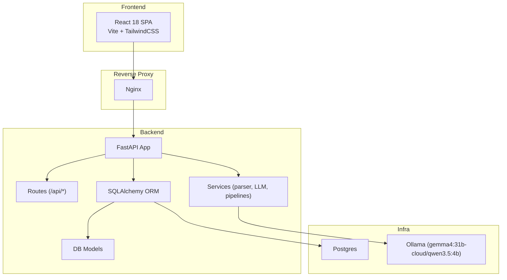
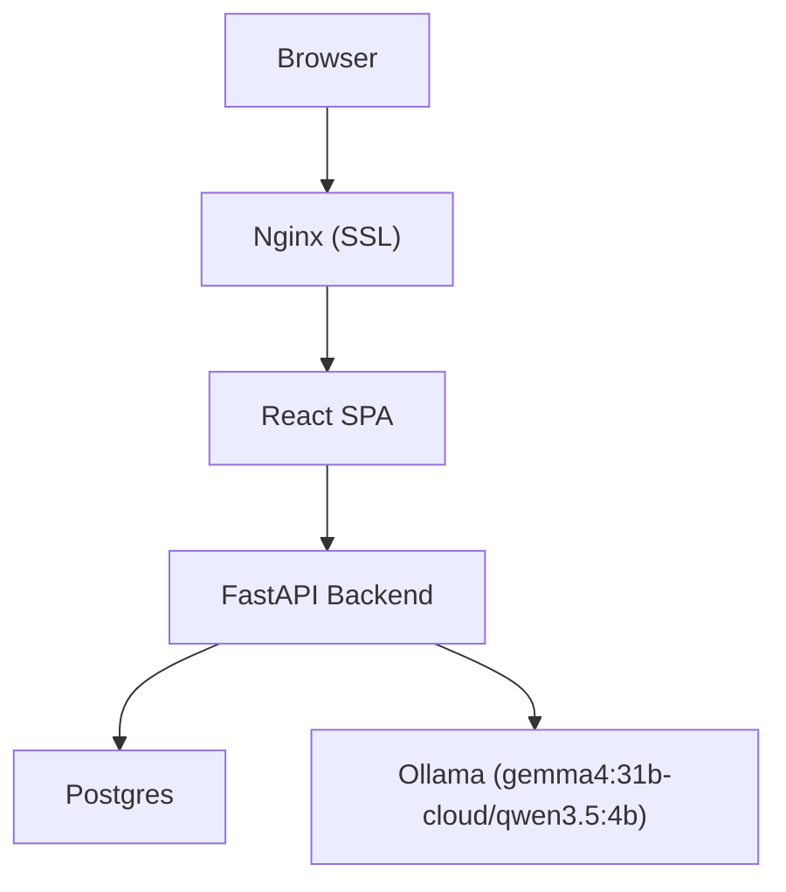
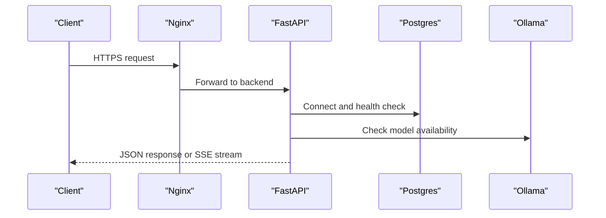
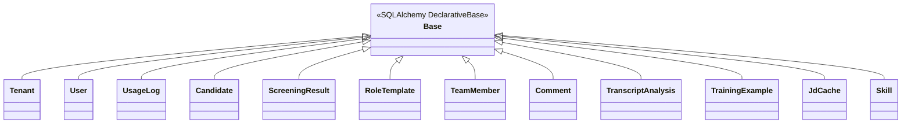
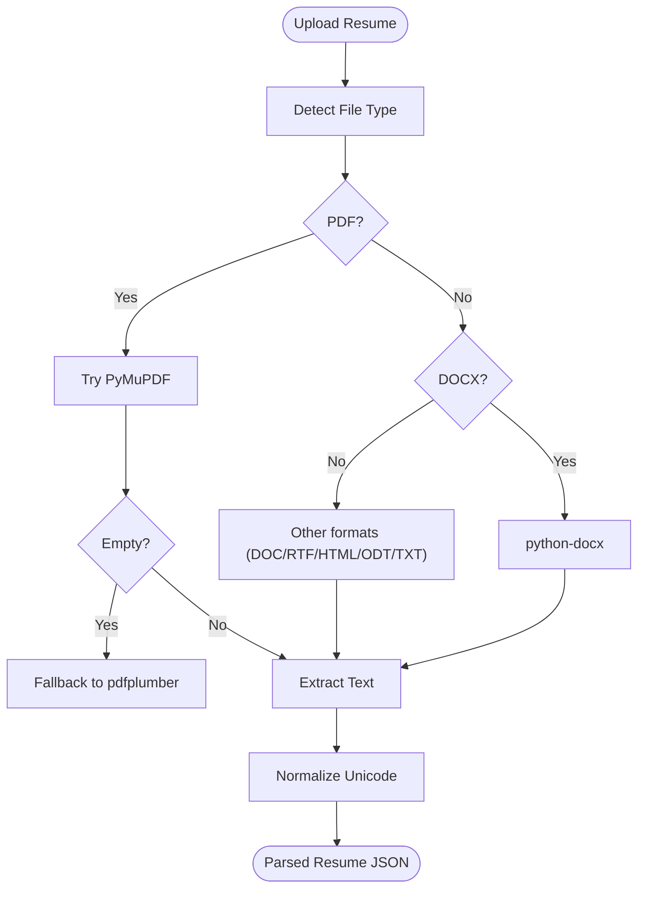
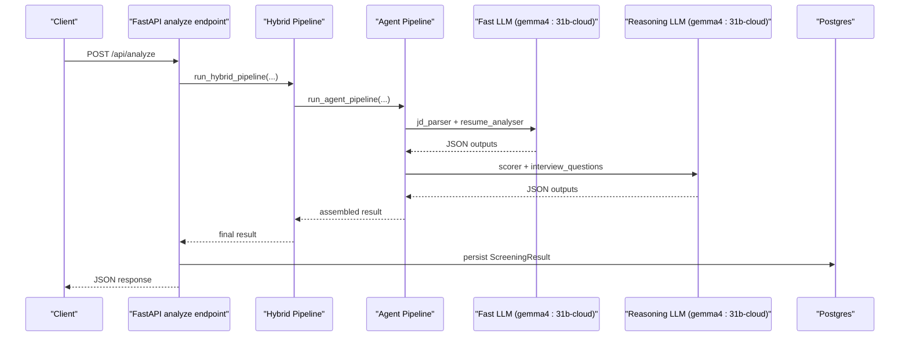
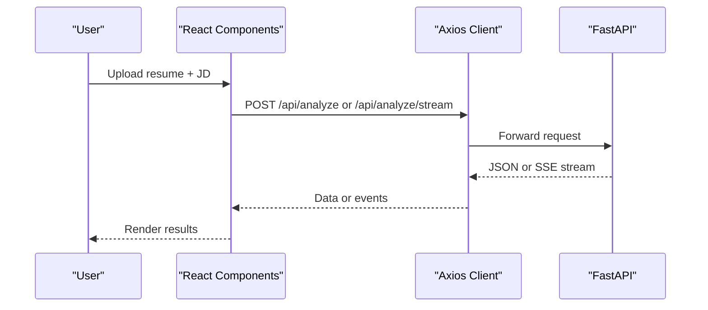
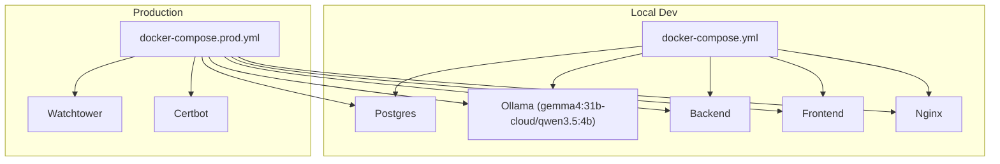
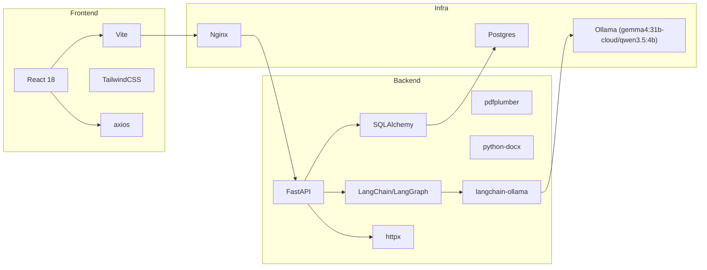

# Technology Stack

<cite>
**Referenced Files in This Document**
- [README.md](file://README.md)
- [requirements.txt](file://requirements.txt)
- [docker-compose.yml](file://docker-compose.yml)
- [docker-compose.prod.yml](file://docker-compose.prod.yml)
- [app/backend/Dockerfile](file://app/backend/Dockerfile)
- [app/frontend/Dockerfile](file://app/frontend/Dockerfile)
- [app/backend/main.py](file://app/backend/main.py)
- [app/backend/db/database.py](file://app/backend/db/database.py)
- [app/backend/models/db_models.py](file://app/backend/models/db_models.py)
- [app/backend/services/parser_service.py](file://app/backend/services/parser_service.py)
- [app/backend/services/llm_service.py](file://app/backend/services/llm_service.py)
- [app/backend/services/agent_pipeline.py](file://app/backend/services/agent_pipeline.py)
- [app/backend/routes/analyze.py](file://app/backend/routes/analyze.py)
- [app/frontend/package.json](file://app/frontend/package.json)
- [app/frontend/vite.config.js](file://app/frontend/vite.config.js)
- [app/frontend/tailwind.config.js](file://app/frontend/tailwind.config.js)
- [app/frontend/src/lib/api.js](file://app/frontend/src/lib/api.js)
- [app/backend/scripts/docker-entrypoint.sh](file://app/backend/scripts/docker-entrypoint.sh)
- [app/backend/scripts/wait_for_ollama.py](file://app/backend/scripts/wait_for_ollama.py)
</cite>

## Update Summary
**Changes Made**
- Updated model specifications to reflect `gemma4:31b-cloud` as primary cloud model with `qwen3.5:4b` as local fallback option
- Updated architecture diagrams to reflect new model configuration
- Corrected tech stack section to accurately reflect current model specifications and capabilities
- Updated performance considerations to reflect new model characteristics

## Table of Contents
1. [Introduction](#introduction)
2. [Project Structure](#project-structure)
3. [Core Components](#core-components)
4. [Architecture Overview](#architecture-overview)
5. [Detailed Component Analysis](#detailed-component-analysis)
6. [Dependency Analysis](#dependency-analysis)
7. [Performance Considerations](#performance-considerations)
8. [Troubleshooting Guide](#troubleshooting-guide)
9. [Conclusion](#conclusion)

## Introduction
This document describes the complete technology stack for Resume AI by ThetaLogics, focusing on backend, frontend, infrastructure, and AI/ML integration. It explains version requirements, dependency relationships, rationale for technology choices, installation steps, and how components work together. It also covers performance characteristics and scaling implications of each technology.

## Project Structure
The project is organized into:
- Backend: FastAPI application with SQLAlchemy ORM, route handlers, services, and models.
- Frontend: React 18 SPA built with Vite and styled with TailwindCSS.
- Infrastructure: Dockerized services orchestrated by Docker Compose, including Nginx, Postgres, Ollama, and optional production enhancements.
- AI/ML: Hybrid pipeline combining deterministic parsing and LLM-driven scoring via LangChain/LangGraph and Ollama.

**Diagram sources**
- [docker-compose.yml:1-108](file://docker-compose.yml#L1-L108)
- [docker-compose.prod.yml:1-236](file://docker-compose.prod.yml#L1-L236)
- [app/backend/main.py:1-327](file://app/backend/main.py#L1-L327)
- [app/backend/db/database.py:1-33](file://app/backend/db/database.py#L1-L33)
- [app/backend/models/db_models.py:1-250](file://app/backend/models/db_models.py#L1-L250)
- [app/backend/services/agent_pipeline.py:1-699](file://app/backend/services/agent_pipeline.py#L1-L699)
- [app/frontend/package.json:1-41](file://app/frontend/package.json#L1-L41)

**Section sources**
- [README.md:23-51](file://README.md#L23-L51)
- [README.md:273-333](file://README.md#L273-L333)

## Core Components
- Backend runtime and framework
  - Python 3.11 with FastAPI for async web server and API routes.
  - SQLAlchemy 2.x for ORM and database abstraction.
  - Uvicorn for ASGI server.
- Document parsing
  - pdfplumber and python-docx for PDF/DOCX text extraction.
  - PyMuPDF as a fast fallback for PDF parsing; rapidfuzz/flashtext/unidecode/dateparser for hybrid parsing features.
- Authentication and multi-tenancy
  - bcrypt/passlib, python-jose, Alembic, psycopg2-binary for secure auth and migrations.
- Export and analytics
  - pandas and openpyxl for exports.
- Job description parsing and URL scraping
  - beautifulsoup4 and lxml for JD URL extraction.
- Video analysis
  - faster-whisper and yt-dlp for transcript generation and video processing.
- AI/ML and LLM integration
  - LangGraph 0.2+, LangChain Community 0.3+, and langchain-ollama 0.2+ for multi-agent pipelines.
  - Ollama serving gemma4:31b-cloud (primary cloud model) and qwen3.5:4b (local fallback) models.
- Frontend
  - React 18, Vite, TailwindCSS, react-router-dom, axios, react-dropzone, recharts.
- Infrastructure
  - Docker and Docker Compose for local and production deployments.
  - Nginx for reverse proxy and SSL termination.
  - Certbot for Let's Encrypt certificates in production.

**Section sources**
- [README.md:23-51](file://README.md#L23-L51)
- [requirements.txt:1-48](file://requirements.txt#L1-L48)
- [app/backend/Dockerfile:1-49](file://app/backend/Dockerfile#L1-L49)
- [app/frontend/Dockerfile:1-26](file://app/frontend/Dockerfile#L1-L26)

## Architecture Overview
The system follows a reverse-proxy fronted architecture:
- Browser → Nginx (SSL/TLS) → React SPA → FastAPI backend.
- Backend services communicate with Postgres for persistence and Ollama for LLM inference.
- Production adds Watchtower for automated updates, certbot for certs, and optimized Ollama settings.

**Diagram sources**
- [README.md:231-251](file://README.md#L231-L251)
- [docker-compose.yml:86-96](file://docker-compose.yml#L86-L96)
- [docker-compose.prod.yml:126-145](file://docker-compose.prod.yml#L126-L145)

## Detailed Component Analysis

### Backend: FastAPI Application
- Startup lifecycle includes dependency checks for database, skills registry, and Ollama reachability.
- Health endpoints verify DB and Ollama connectivity.
- CORS policy configured for development and staging domains.
- Includes routers for auth, analysis, comparison, export, templates, candidates, email generation, JD URL extraction, team, training, video, transcript, and subscription.

**Diagram sources**
- [app/backend/main.py:68-149](file://app/backend/main.py#L68-L149)
- [app/backend/main.py:228-259](file://app/backend/main.py#L228-L259)
- [docker-compose.yml:52-75](file://docker-compose.yml#L52-L75)
- [docker-compose.prod.yml:75-106](file://docker-compose.prod.yml#L75-L106)

**Section sources**
- [app/backend/main.py:1-327](file://app/backend/main.py#L1-L327)
- [app/backend/routes/analyze.py:1-813](file://app/backend/routes/analyze.py#L1-L813)

### Database Layer: SQLAlchemy ORM
- Engine creation supports SQLite and PostgreSQL with normalized URLs.
- Session factory and Base class for declarative models.
- Models define multi-tenancy, users, usage logs, candidates, screening results, transcripts, training examples, and caches.

**Diagram sources**
- [app/backend/db/database.py:1-33](file://app/backend/db/database.py#L1-L33)
- [app/backend/models/db_models.py:1-250](file://app/backend/models/db_models.py#L1-L250)

**Section sources**
- [app/backend/db/database.py:1-33](file://app/backend/db/database.py#L1-L33)
- [app/backend/models/db_models.py:1-250](file://app/backend/models/db_models.py#L1-L250)

### Document Parsing Services
- PDF/DOCX/DOC/RTF/HTML/ODT/TXT parsing with robust fallbacks.
- PyMuPDF preferred for PDFs; pdfplumber as fallback; python-docx for DOCX.
- Hybrid parsing utilities (rapidfuzz/flashtext/unidecode/PyMuPDF/dateparser/unidecode) for skills and text normalization.
- Enrichment logic fills missing candidate name from email or relaxed heuristics.

**Diagram sources**
- [app/backend/services/parser_service.py:142-191](file://app/backend/services/parser_service.py#L142-L191)
- [app/backend/services/parser_service.py:152-187](file://app/backend/services/parser_service.py#L152-L187)
- [app/backend/services/parser_service.py:320-371](file://app/backend/services/parser_service.py#L320-L371)

**Section sources**
- [app/backend/services/parser_service.py:1-552](file://app/backend/services/parser_service.py#L1-L552)

### LLM Service and Agent Pipeline
- LLMService integrates with Ollama to generate structured JSON outputs for resume analysis.
- Agent pipeline uses LangGraph to orchestrate a 3-stage, sequential workflow:
  - Stage 1: JD parser and resume analyser (combined).
  - Stage 2: Skill analysis and education/timeline analysis (combined).
  - Stage 3: Scoring and interview questions (combined).
- Singletons for fast and reasoning LLMs reuse connections and keep models hot.
- JSON parsing helper extracts structured outputs; fallbacks compute scores mathematically when LLM calls fail.

**Updated** Model configuration now uses `gemma4:31b-cloud` as the primary cloud model and `qwen3.5:4b` as the local fallback model. The system automatically detects whether Ollama Cloud is being used and adjusts parameters accordingly, with different token limits and context sizes for cloud vs local models.

**Diagram sources**
- [app/backend/routes/analyze.py:321-501](file://app/backend/routes/analyze.py#L321-L501)
- [app/backend/services/agent_pipeline.py:520-540](file://app/backend/services/agent_pipeline.py#L520-L540)
- [app/backend/services/llm_service.py:1-156](file://app/backend/services/llm_service.py#L1-L156)

**Section sources**
- [app/backend/services/llm_service.py:1-156](file://app/backend/services/llm_service.py#L1-L156)
- [app/backend/services/agent_pipeline.py:1-699](file://app/backend/services/agent_pipeline.py#L1-L699)

### Frontend: React 18, Vite, TailwindCSS
- React SPA with routing, state management via context, and UI components.
- Vite dev server with proxy to backend API.
- TailwindCSS for styling with brand-specific design tokens.
- Axios-based API client with JWT bearer token injection and automatic refresh logic.
- Streaming analysis via Server-Sent Events (SSE) for staged results.

**Diagram sources**
- [app/frontend/src/lib/api.js:47-147](file://app/frontend/src/lib/api.js#L47-L147)
- [app/frontend/vite.config.js:1-26](file://app/frontend/vite.config.js#L1-L26)
- [app/frontend/package.json:1-41](file://app/frontend/package.json#L1-L41)

**Section sources**
- [app/frontend/package.json:1-41](file://app/frontend/package.json#L1-L41)
- [app/frontend/vite.config.js:1-26](file://app/frontend/vite.config.js#L1-L26)
- [app/frontend/tailwind.config.js:1-67](file://app/frontend/tailwind.config.js#L1-L67)
- [app/frontend/src/lib/api.js:1-395](file://app/frontend/src/lib/api.js#L1-L395)

### Infrastructure: Docker, Nginx, Ollama, Deployment
- Local development: docker-compose defines services for Postgres, Ollama, backend, frontend, and Nginx.
- Production: docker-compose.prod.yml adds resource limits, Watchtower, certbot, and optimized Ollama settings.
- Backend Dockerfile sets Python 3.11, installs system deps, copies requirements and code, exposes 8000, and defines entrypoint and environment variables.
- Frontend Dockerfile builds assets with Vite and serves via Nginx.
- Nginx configuration proxies to backend and frontend; production variant includes SSL and health checks.

**Updated** Ollama configuration now uses `gemma4:31b-cloud` as the primary model and `qwen3.5:4b` for local fallback. The system automatically detects cloud vs local environments and adjusts model parameters accordingly.

**Diagram sources**
- [docker-compose.yml:1-108](file://docker-compose.yml#L1-L108)
- [docker-compose.prod.yml:1-236](file://docker-compose.prod.yml#L1-L236)
- [app/backend/Dockerfile:1-49](file://app/backend/Dockerfile#L1-L49)
- [app/frontend/Dockerfile:1-26](file://app/frontend/Dockerfile#L1-L26)

**Section sources**
- [docker-compose.yml:1-108](file://docker-compose.yml#L1-L108)
- [docker-compose.prod.yml:1-236](file://docker-compose.prod.yml#L1-L236)
- [app/backend/Dockerfile:1-49](file://app/backend/Dockerfile#L1-L49)
- [app/frontend/Dockerfile:1-26](file://app/frontend/Dockerfile#L1-L26)

## Dependency Analysis
- Backend dependencies pinned in requirements.txt include FastAPI, Uvicorn, SQLAlchemy, pdfplumber, python-docx, httpx, pydantic, bcrypt/passlib, Alembic, psycopg2-binary, pandas/openpyxl, beautifulsoup4/lxml, faster-whisper/yt-dlp, langgraph/langchain-ollama, and pytest suite.
- Frontend dependencies include React 18, Vite, TailwindCSS, axios, react-router-dom, react-dropzone, lucide-react, and recharts.
- Runtime environment variables in Dockerfiles and docker-compose files define database URLs, Ollama base URL, model names, and worker counts.

**Updated** Model configuration now reflects the new primary cloud model (`gemma4:31b-cloud`) and local fallback (`qwen3.5:4b`).

**Diagram sources**
- [requirements.txt:1-48](file://requirements.txt#L1-L48)
- [app/frontend/package.json:14-22](file://app/frontend/package.json#L14-L22)
- [app/backend/Dockerfile:29-38](file://app/backend/Dockerfile#L29-L38)
- [docker-compose.yml:59-75](file://docker-compose.yml#L59-L75)

**Section sources**
- [requirements.txt:1-48](file://requirements.txt#L1-L48)
- [app/frontend/package.json:14-22](file://app/frontend/package.json#L14-L22)
- [app/backend/Dockerfile:29-38](file://app/backend/Dockerfile#L29-L38)
- [docker-compose.yml:59-75](file://docker-compose.yml#L59-L75)

## Performance Considerations
- Backend concurrency
  - Uvicorn workers configured to 4 in production for I/O-bound workload; backend waits on Ollama and DB, so multiple workers improve throughput without overloading the LLM.
- Database
  - SQLite used locally; PostgreSQL recommended for production with tuned parameters (shared_buffers, effective_cache_size, work_mem, max_connections) and health checks.
- LLM inference
  - Ollama parallelism and KV cache quantization tuned for throughput; warmup service ensures models are loaded into RAM on first deploy.
  - Primary cloud model `gemma4:31b-cloud` provides enhanced reasoning capabilities with increased token limits; local fallback `qwen3.5:4b` optimized for deterministic extraction.
  - Keep-alive enabled to reuse connections; cloud models use different token limits (3000 vs 600) and context sizes (12288 vs 3072) based on environment detection.
- Frontend
  - Vite build with sourcemaps; Nginx static hosting; SSE streaming reduces perceived latency by delivering staged results.
- Caching and deduplication
  - JD cache (DB/shared) avoids repeated LLM calls for identical job descriptions; candidate deduplication prevents redundant processing.

**Updated** Performance tuning now accounts for the different capabilities and token limits of `gemma4:31b-cloud` (cloud) vs `qwen3.5:4b` (local), with automatic parameter adjustment based on environment detection.

**Section sources**
- [docker-compose.prod.yml:75-112](file://docker-compose.prod.yml#L75-L112)
- [docker-compose.prod.yml:41-71](file://docker-compose.prod.yml#L41-L71)
- [app/backend/main.py:104-143](file://app/backend/main.py#L104-L143)
- [app/backend/routes/analyze.py:48-67](file://app/backend/routes/analyze.py#L48-L67)
- [app/backend/routes/analyze.py:147-214](file://app/backend/routes/analyze.py#L147-L214)

## Troubleshooting Guide
- Ollama not responding
  - Check container logs and ensure models are pulled; warmup service loads models into RAM.
  - For cloud deployments, verify OLLAMA_API_KEY is set and OLLAMA_BASE_URL points to `https://ollama.com`.
- Database locked errors
  - SQLite does not support concurrent writes; restart backend container if "database is locked" occurs.
- SSL certificate issues
  - Renew certificates with certbot and restart Nginx; ensure DNS A record points to VPS IP.
- Deploy failures
  - Verify Docker Hub credentials, SSH key added to VPS, and firewall settings; Watchtower auto-restarts containers on new images.
- Model loading issues
  - For local deployments, ensure `qwen3.5:4b` is pulled; for cloud deployments, verify API key authentication is configured correctly.

**Updated** Added troubleshooting guidance for the new model configuration, including cloud vs local model selection and API key requirements.

**Section sources**
- [README.md:339-362](file://README.md#L339-L362)
- [docker-compose.prod.yml:213-221](file://docker-compose.prod.yml#L213-L221)

## Conclusion
Resume AI by ThetaLogics combines a modern React SPA with a FastAPI backend, robust document parsing, and a hybrid AI pipeline powered by Ollama and LangGraph. The system now uses `gemma4:31b-cloud` as the primary cloud model with `qwen3.5:4b` as a reliable local fallback, providing enhanced reasoning capabilities while maintaining deterministic extraction performance. Docker and Nginx enable straightforward local and production deployments, while careful tuning of Ollama and Postgres ensures predictable performance. The architecture balances determinism (hybrid parsing) with LLM-driven insights, supporting scalable, maintainable growth with improved model capabilities.