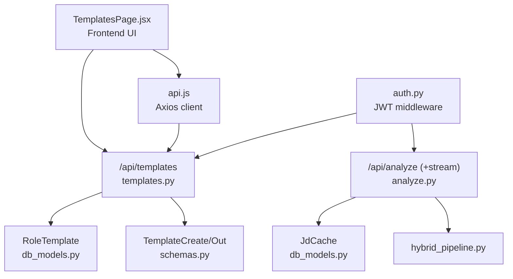
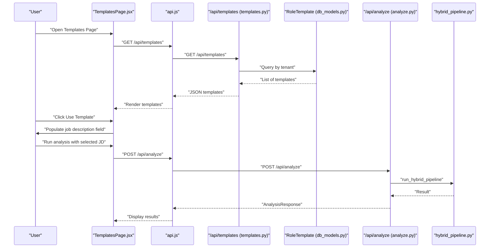
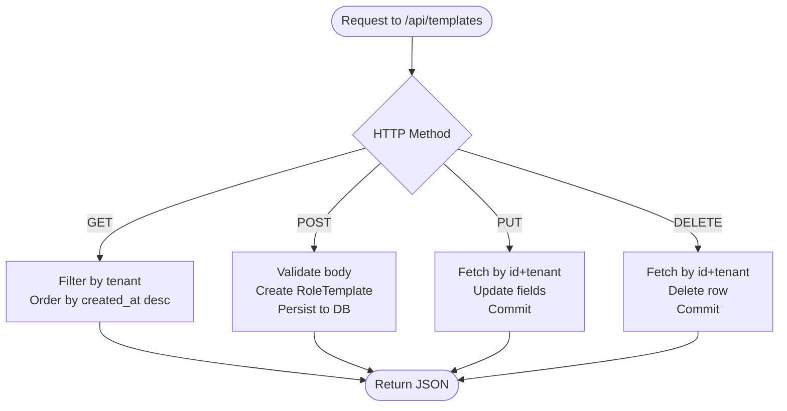
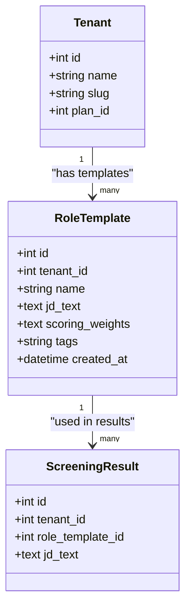
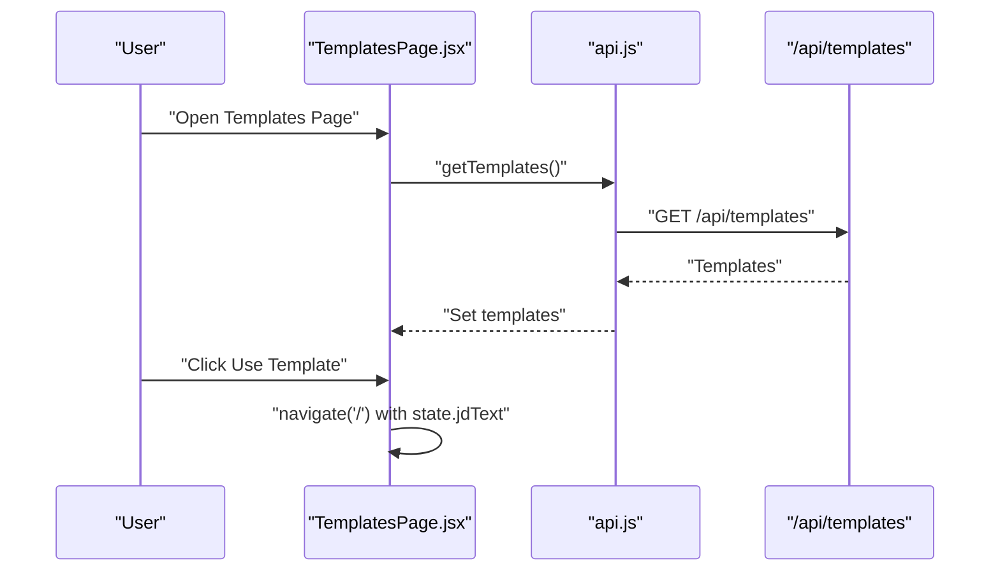
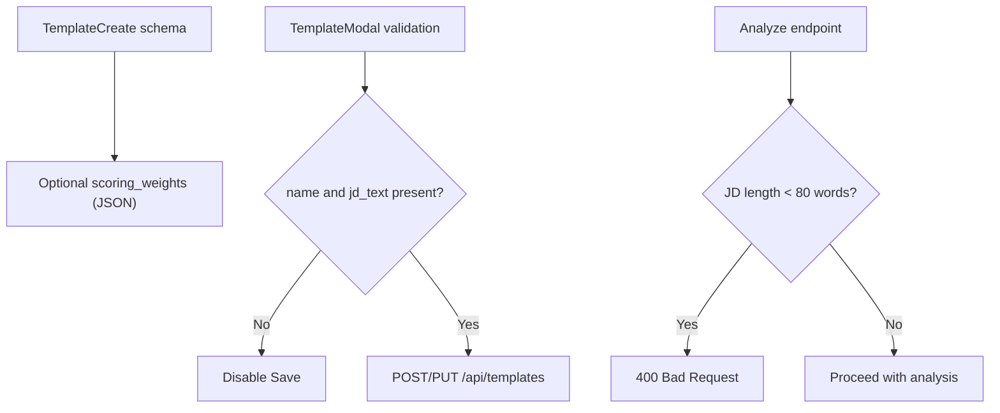
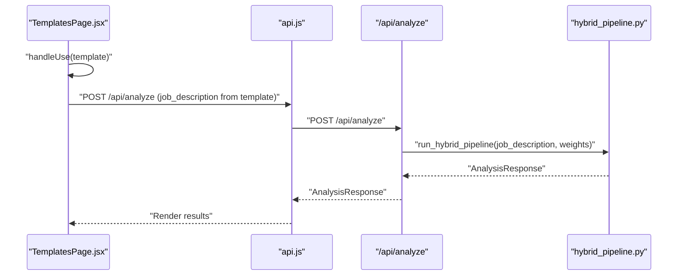
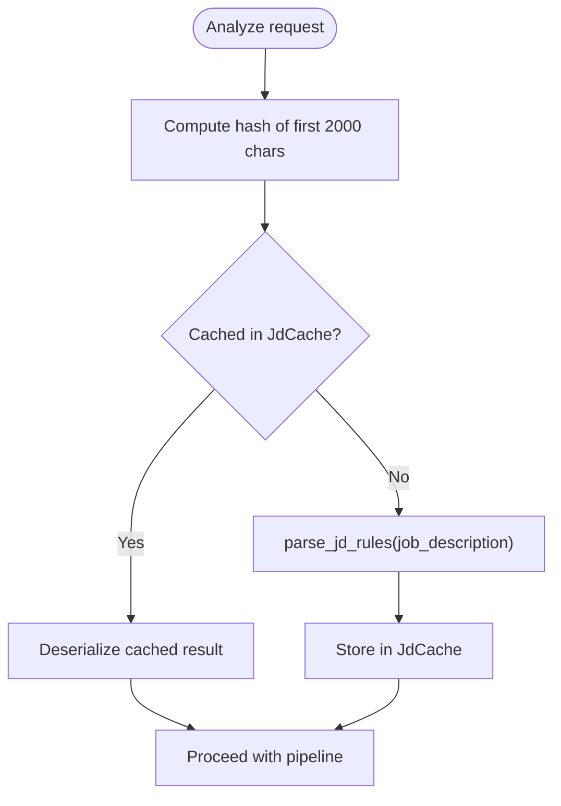
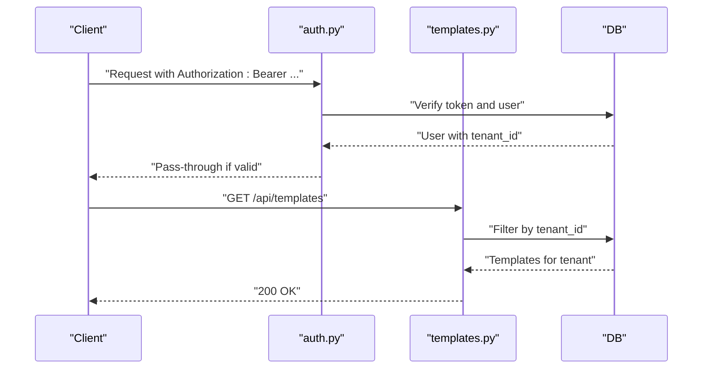
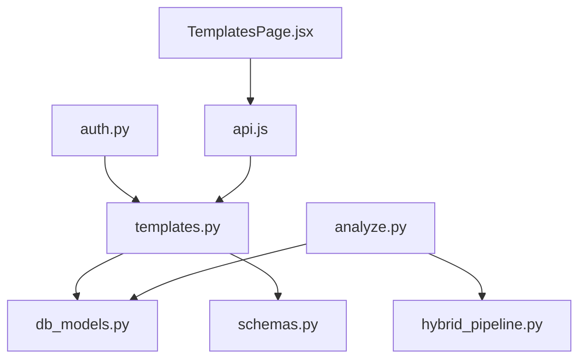

# Template Management

<cite>
**Referenced Files in This Document**
- [templates.py](file://app/backend/routes/templates.py)
- [db_models.py](file://app/backend/models/db_models.py)
- [schemas.py](file://app/backend/models/schemas.py)
- [api.js](file://app/frontend/src/lib/api.js)
- [TemplatesPage.jsx](file://app/frontend/src/pages/TemplatesPage.jsx)
- [analyze.py](file://app/backend/routes/analyze.py)
- [hybrid_pipeline.py](file://app/backend/services/hybrid_pipeline.py)
- [auth.py](file://app/backend/middleware/auth.py)
- [nginx.prod.conf](file://nginx/nginx.prod.conf)
- [README.md](file://README.md)
</cite>

## Table of Contents
1. [Introduction](#introduction)
2. [Project Structure](#project-structure)
3. [Core Components](#core-components)
4. [Architecture Overview](#architecture-overview)
5. [Detailed Component Analysis](#detailed-component-analysis)
6. [Dependency Analysis](#dependency-analysis)
7. [Performance Considerations](#performance-considerations)
8. [Troubleshooting Guide](#troubleshooting-guide)
9. [Conclusion](#conclusion)

## Introduction
This document explains the template management system for Resume AI by ThetaLogics. It covers how job description templates are created, edited, shared, validated, and integrated into analysis workflows. It also documents caching, performance optimization, security, and collaborative patterns. The system centers around Role Templates stored per tenant, consumed by the analysis pipeline and surfaced in the frontend.

## Project Structure
Template management spans backend routes, models, schemas, and frontend pages. The backend exposes a REST API for CRUD operations on Role Templates, while the frontend provides a UI for creating, editing, and applying templates. The analysis pipeline consumes templates during resume-screening workflows.

**Diagram sources**
- [templates.py:1-86](file://app/backend/routes/templates.py#L1-L86)
- [db_models.py:149-165](file://app/backend/models/db_models.py#L149-L165)
- [schemas.py:210-227](file://app/backend/models/schemas.py#L210-L227)
- [api.js:206-226](file://app/frontend/src/lib/api.js#L206-L226)
- [TemplatesPage.jsx:1-195](file://app/frontend/src/pages/TemplatesPage.jsx#L1-L195)
- [analyze.py:49-68](file://app/backend/routes/analyze.py#L49-L68)
- [hybrid_pipeline.py:1-121](file://app/backend/services/hybrid_pipeline.py#L1-L121)
- [auth.py:19-41](file://app/backend/middleware/auth.py#L19-L41)

**Section sources**
- [templates.py:1-86](file://app/backend/routes/templates.py#L1-L86)
- [db_models.py:149-165](file://app/backend/models/db_models.py#L149-L165)
- [schemas.py:210-227](file://app/backend/models/schemas.py#L210-L227)
- [api.js:206-226](file://app/frontend/src/lib/api.js#L206-L226)
- [TemplatesPage.jsx:1-195](file://app/frontend/src/pages/TemplatesPage.jsx#L1-L195)
- [analyze.py:49-68](file://app/backend/routes/analyze.py#L49-L68)
- [hybrid_pipeline.py:1-121](file://app/backend/services/hybrid_pipeline.py#L1-L121)
- [auth.py:19-41](file://app/backend/middleware/auth.py#L19-L41)

## Core Components
- Role Templates: Stored per tenant with name, job description text, optional scoring weights, and tags.
- Backend API: Provides list, create, update, and delete endpoints scoped to the current user’s tenant.
- Frontend UI: Lists templates, supports inline edit, deletion, and “Use Template” to populate the main analysis page.
- Analysis Integration: Templates feed into the analysis pipeline; the pipeline caches parsed JD results for performance.

Key responsibilities:
- Tenant scoping ensures isolation between organizations.
- Validation occurs at the API boundary (e.g., required fields) and in the analysis pipeline (e.g., minimum JD length).
- Caching avoids repeated parsing of identical or similar job descriptions.

**Section sources**
- [templates.py:16-85](file://app/backend/routes/templates.py#L16-L85)
- [db_models.py:151-164](file://app/backend/models/db_models.py#L151-L164)
- [schemas.py:210-227](file://app/backend/models/schemas.py#L210-L227)
- [TemplatesPage.jsx:82-194](file://app/frontend/src/pages/TemplatesPage.jsx#L82-L194)
- [analyze.py:255-266](file://app/backend/routes/analyze.py#L255-L266)

## Architecture Overview
The template lifecycle integrates frontend, backend, and analysis services:

**Diagram sources**
- [TemplatesPage.jsx:105-107](file://app/frontend/src/pages/TemplatesPage.jsx#L105-L107)
- [api.js:47-63](file://app/frontend/src/lib/api.js#L47-L63)
- [templates.py:16-26](file://app/backend/routes/templates.py#L16-L26)
- [analyze.py:354-501](file://app/backend/routes/analyze.py#L354-L501)
- [hybrid_pipeline.py:1-121](file://app/backend/services/hybrid_pipeline.py#L1-L121)

## Detailed Component Analysis

### Backend Template Routes
- List templates: GET /api/templates returns all templates for the current tenant, ordered by creation time.
- Create template: POST /api/templates persists a new template under the current tenant.
- Update template: PUT /api/templates/{id} updates fields and enforces tenant ownership.
- Delete template: DELETE /api/templates/{id} removes the template if owned by the tenant.

Tenant scoping is enforced in queries to prevent cross-tenant access.

**Diagram sources**
- [templates.py:16-85](file://app/backend/routes/templates.py#L16-L85)

**Section sources**
- [templates.py:16-85](file://app/backend/routes/templates.py#L16-L85)

### Data Model: RoleTemplate
RoleTemplate stores per-tenant templates with optional scoring weights and tags. It links to Tenant and ScreeningResult.

**Diagram sources**
- [db_models.py:31-60](file://app/backend/models/db_models.py#L31-L60)
- [db_models.py:151-164](file://app/backend/models/db_models.py#L151-L164)
- [db_models.py:128-146](file://app/backend/models/db_models.py#L128-L146)

**Section sources**
- [db_models.py:151-164](file://app/backend/models/db_models.py#L151-L164)

### Frontend Template UI
The Templates page lists templates, supports inline editing, deletion, and “Use Template” to populate the main analysis page. It uses the Axios client to call the backend.

**Diagram sources**
- [TemplatesPage.jsx:82-107](file://app/frontend/src/pages/TemplatesPage.jsx#L82-L107)
- [api.js:208-211](file://app/frontend/src/lib/api.js#L208-L211)

**Section sources**
- [TemplatesPage.jsx:82-194](file://app/frontend/src/pages/TemplatesPage.jsx#L82-L194)
- [api.js:206-226](file://app/frontend/src/lib/api.js#L206-L226)

### Template Scoring Weights and Validation
- Scoring weights are optional and stored as JSON in RoleTemplate.scoring_weights.
- The frontend modal validates presence of name and job description text before saving.
- The analysis pipeline validates JD length and supports passing custom scoring weights.

**Diagram sources**
- [schemas.py:210-215](file://app/backend/models/schemas.py#L210-L215)
- [TemplatesPage.jsx:12-21](file://app/frontend/src/pages/TemplatesPage.jsx#L12-L21)
- [analyze.py:255-266](file://app/backend/routes/analyze.py#L255-L266)

**Section sources**
- [schemas.py:210-215](file://app/backend/models/schemas.py#L210-L215)
- [TemplatesPage.jsx:12-21](file://app/frontend/src/pages/TemplatesPage.jsx#L12-L21)
- [analyze.py:255-266](file://app/backend/routes/analyze.py#L255-L266)

### Integration with Analysis Workflows
Templates integrate with analysis in two ways:
- Direct use: The frontend “Use Template” action passes the template’s job description text to the analysis endpoint.
- Scoring weights: When provided, the analysis endpoint forwards custom weights to the hybrid pipeline.

**Diagram sources**
- [TemplatesPage.jsx:105-107](file://app/frontend/src/pages/TemplatesPage.jsx#L105-L107)
- [api.js:47-63](file://app/frontend/src/lib/api.js#L47-L63)
- [analyze.py:354-501](file://app/backend/routes/analyze.py#L354-L501)
- [hybrid_pipeline.py:1-121](file://app/backend/services/hybrid_pipeline.py#L1-121)

**Section sources**
- [TemplatesPage.jsx:105-107](file://app/frontend/src/pages/TemplatesPage.jsx#L105-L107)
- [api.js:47-63](file://app/frontend/src/lib/api.js#L47-L63)
- [analyze.py:354-501](file://app/backend/routes/analyze.py#L354-L501)
- [hybrid_pipeline.py:1-121](file://app/backend/services/hybrid_pipeline.py#L1-L121)

### Template Caching and Performance
The analysis pipeline caches parsed JD results keyed by a hash of the first 2000 characters of the job description text. This reduces repeated parsing costs across requests and workers.

**Diagram sources**
- [analyze.py:49-68](file://app/backend/routes/analyze.py#L49-L68)
- [db_models.py:229-236](file://app/backend/models/db_models.py#L229-L236)

**Section sources**
- [analyze.py:49-68](file://app/backend/routes/analyze.py#L49-L68)
- [db_models.py:229-236](file://app/backend/models/db_models.py#L229-L236)

### Security and Access Control
- Authentication: All endpoints require a valid JWT bearer token resolved by the auth middleware.
- Authorization: Routes filter resources by tenant to enforce multi-tenancy.
- Cross-tenant protection: Tests confirm users cannot access another tenant’s templates.

**Diagram sources**
- [auth.py:19-41](file://app/backend/middleware/auth.py#L19-L41)
- [templates.py:16-26](file://app/backend/routes/templates.py#L16-L26)

**Section sources**
- [auth.py:19-41](file://app/backend/middleware/auth.py#L19-L41)
- [templates.py:16-26](file://app/backend/routes/templates.py#L16-L26)

### Collaborative Editing and Sharing
- Multi-tenancy isolates templates per organization; there is no explicit cross-user sharing mechanism in the current code.
- Team collaboration exists elsewhere in the system (e.g., comments on results), but template sharing is not implemented here.

**Section sources**
- [db_models.py:31-60](file://app/backend/models/db_models.py#L31-L60)
- [templates.py:16-85](file://app/backend/routes/templates.py#L16-L85)

### Preview and Quality Assurance
- Preview: The Templates page shows a truncated preview of the job description text.
- Quality checks: The analysis pipeline enforces a minimum JD length and falls back gracefully on errors.

**Section sources**
- [TemplatesPage.jsx:172-172](file://app/frontend/src/pages/TemplatesPage.jsx#L172-L172)
- [analyze.py:255-266](file://app/backend/routes/analyze.py#L255-L266)
- [analyze.py:219-235](file://app/backend/routes/analyze.py#L219-L235)

### Bulk Operations and Import/Export
- Bulk analysis: The backend supports batch analysis with configurable limits per plan.
- Export: CSV and Excel exports are supported for analysis results; there is no template import/export functionality in the current code.

**Section sources**
- [api.js:183-193](file://app/frontend/src/lib/api.js#L183-L193)
- [analyze.py:651-758](file://app/backend/routes/analyze.py#L651-L758)

### Customization and Extensibility
- Custom scoring weights: Templates can store optional scoring weights; the analysis endpoint accepts and forwards weights to the pipeline.
- Extending fields: The RoleTemplate model can be extended (e.g., adding new metadata fields) with corresponding schema updates.

**Section sources**
- [schemas.py:210-215](file://app/backend/models/schemas.py#L210-L215)
- [templates.py:35-41](file://app/backend/routes/templates.py#L35-L41)

## Dependency Analysis
Template management depends on:
- Authentication middleware for user identity and tenant scoping.
- SQLAlchemy ORM for persistence.
- Pydantic models for request/response validation.
- Frontend Axios client for API calls.

**Diagram sources**
- [auth.py:19-41](file://app/backend/middleware/auth.py#L19-L41)
- [templates.py:1-13](file://app/backend/routes/templates.py#L1-L13)
- [db_models.py:151-164](file://app/backend/models/db_models.py#L151-L164)
- [schemas.py:210-227](file://app/backend/models/schemas.py#L210-L227)
- [TemplatesPage.jsx:1-4](file://app/frontend/src/pages/TemplatesPage.jsx#L1-L4)
- [api.js:1-16](file://app/frontend/src/lib/api.js#L1-L16)
- [analyze.py:25-40](file://app/backend/routes/analyze.py#L25-L40)
- [hybrid_pipeline.py:1-22](file://app/backend/services/hybrid_pipeline.py#L1-L22)

**Section sources**
- [auth.py:19-41](file://app/backend/middleware/auth.py#L19-L41)
- [templates.py:1-13](file://app/backend/routes/templates.py#L1-L13)
- [db_models.py:151-164](file://app/backend/models/db_models.py#L151-L164)
- [schemas.py:210-227](file://app/backend/models/schemas.py#L210-L227)
- [TemplatesPage.jsx:1-4](file://app/frontend/src/pages/TemplatesPage.jsx#L1-L4)
- [api.js:1-16](file://app/frontend/src/lib/api.js#L1-L16)
- [analyze.py:25-40](file://app/backend/routes/analyze.py#L25-L40)
- [hybrid_pipeline.py:1-22](file://app/backend/services/hybrid_pipeline.py#L1-L22)

## Performance Considerations
- Template caching: The JD cache avoids repeated parsing of similar job descriptions.
- Streaming analysis: The SSE endpoint streams intermediate results to improve perceived latency.
- Nginx tuning: Streaming endpoint disables buffering to prevent timeouts and ensure real-time delivery.

Recommendations:
- Monitor cache hit rate and consider increasing cache size if needed.
- Tune LLM concurrency and resource allocation for streaming endpoints.
- Consider template versioning if frequent updates occur; current design relies on immutable templates with updates replacing older ones.

**Section sources**
- [analyze.py:49-68](file://app/backend/routes/analyze.py#L49-L68)
- [analyze.py:506-646](file://app/backend/routes/analyze.py#L506-L646)
- [nginx.prod.conf:66-75](file://nginx/nginx.prod.conf#L66-L75)

## Troubleshooting Guide
Common issues and resolutions:
- Authentication failures: Ensure the Authorization header is present and valid; the auth middleware rejects invalid/expired tokens.
- Tenant isolation errors: Cross-tenant access attempts are blocked by tenant-scoped filters.
- Template not found: Verify the template ID and tenant ownership; 404 indicates either wrong ID or tenant mismatch.
- Analysis fails due to short JD: Ensure the job description exceeds the minimum word count.
- Streaming timeouts: Confirm Nginx streaming configuration is applied and buffering is disabled for the SSE endpoint.

**Section sources**
- [auth.py:23-40](file://app/backend/middleware/auth.py#L23-L40)
- [templates.py:55-60](file://app/backend/routes/templates.py#L55-L60)
- [analyze.py:255-266](file://app/backend/routes/analyze.py#L255-L266)
- [nginx.prod.conf:66-75](file://nginx/nginx.prod.conf#L66-L75)

## Conclusion
Resume AI’s template management provides a secure, tenant-scoped system for storing and reusing job descriptions. Templates integrate seamlessly with the analysis pipeline, benefit from caching, and are exposed via a straightforward frontend interface. While collaborative sharing is not implemented, the system’s design supports future enhancements such as template versioning, import/export, and expanded sharing controls.