# Testing Strategy

<cite>
**Referenced Files in This Document**
- [ci.yml](file://.github/workflows/ci.yml)
- [cd.yml](file://.github/workflows/cd.yml)
- [conftest.py](file://app/backend/tests/conftest.py)
- [rate_limit.py](file://app/backend/middleware/rate_limit.py)
- [subscription.py](file://app/backend/routes/subscription.py)
- [analyze.py](file://app/backend/routes/analyze.py)
- [test_rate_limiting.py](file://app/backend/tests/test_rate_limiting.py)
- [test_subscription.py](file://app/backend/tests/test_subscription.py)
- [test_quota_enforcement.py](file://app/backend/tests/test_quota_enforcement.py)
- [test_usage_enforcement.py](file://app/backend/tests/test_usage_enforcement.py)
- [test_guardrail_service.py](file://app/backend/tests/test_guardrail_service.py)
- [guardrail_service.py](file://app/backend/services/guardrail_service.py)
- [metrics.py](file://app/backend/services/metrics.py)
- [run-full-tests.sh](file://scripts/run-full-tests.sh)
- [test-locally.ps1](file://test-locally.ps1)
- [.gitignore](file://.gitignore)
- [test_video_downloader.py](file://app/backend/tests/test_video_downloader.py)
- [test_video_service.py](file://app/backend/tests/test_video_service.py)
- [video_service.py](file://app/backend/services/video_service.py)
- [video_downloader.py](file://app/backend/services/video_downloader.py)
- [test_video_routes.py](file://app/backend/tests/test_video_routes.py)
- [test_deterministic_integration.py](file://app/backend/tests/test_deterministic_integration.py)
- [test_domain_service.py](file://app/backend/tests/test_domain_service.py)
- [test_eligibility_service.py](file://app/backend/tests/test_eligibility_service.py)
- [test_fit_scorer.py](file://app/backend/tests/test_fit_scorer.py)
- [test_risk_calculator.py](file://app/backend/tests/test_risk_calculator.py)
- [domain_service.py](file://app/backend/services/domain_service.py)
- [eligibility_service.py](file://app/backend/services/eligibility_service.py)
- [fit_scorer.py](file://app/backend/services/fit_scorer.py)
- [risk_calculator.py](file://app/backend/services/risk_calculator.py)
- [constants.py](file://app/backend/services/constants.py)
- [test_billing.py](file://app/backend/tests/test_billing.py)
- [test_dunning.py](file://app/backend/tests/test_dunning.py)
- [test_invoices.py](file://app/backend/tests/test_invoices.py)
- [test_sso.py](file://app/backend/tests/test_sso.py)
- [test_phase1_jd_parser.py](file://app/backend/tests/test_phase1_jd_parser.py)
- [test_phase2_skill_matching.py](file://app/backend/tests/test_phase2_skill_matching.py)
- [test_phase3_explainable_scoring.py](file://app/backend/tests/test_phase3_explainable_scoring.py)
- [test_admin_api.py](file://app/backend/tests/test_admin_api.py)
- [test_admin_metrics.py](file://app/backend/tests/test_admin_metrics.py)
</cite>

## Update Summary
**Changes Made**
- Updated to reflect significantly expanded testing infrastructure with comprehensive test suites covering authentication flows, billing operations, enterprise platform administration, and regression testing
- All tests now pass consistently with a 191/191 success rate, indicating robust implementation quality
- Enhanced test coverage includes enterprise security features, administrative dashboard functionality, and comprehensive billing system validation
- Added comprehensive coverage for 4-tier guardrail testing framework with 72 individual test cases
- Expanded enterprise screening pipeline testing with dedicated suites for JD Parser, Skill Matching, Explainable Scoring, Continuous Learning, and Enterprise Security
- Enhanced administrative API testing with comprehensive tenant management, billing configuration, and operational controls
- Expanded billing system testing with provider abstraction, dunning workflow, invoice processing, and SSO integration validation

## Table of Contents
1. [Introduction](#introduction)
2. [Project Structure](#project-structure)
3. [Core Components](#core-components)
4. [Architecture Overview](#architecture-overview)
5. [Detailed Component Analysis](#detailed-component-analysis)
6. [Dependency Analysis](#dependency-analysis)
7. [Performance Considerations](#performance-considerations)
8. [Troubleshooting Guide](#troubleshooting-guide)
9. [Conclusion](#conclusion)
10. [Appendices](#appendices)

## Introduction
This document defines a comprehensive testing strategy for Resume AI by ThetaLogics. It covers backend testing with pytest, frontend testing with Vitest and React Testing Library, API and integration testing patterns, test configuration and mocking, test data management, performance testing, end-to-end workflows, continuous integration with GitHub Actions, and best practices for writing maintainable tests.

**Updated** The test suite has been substantially enhanced with dedicated test suites for each phase of the enterprise-grade screening pipeline, featuring comprehensive coverage of JD Parser, Skill Matching, Explainable Scoring, Continuous Learning, and Enterprise Security components. The expanded infrastructure now includes specialized testing for billing systems, dunning workflows, invoice processing, and SSO integration, providing complete validation of the enterprise-grade screening capabilities with 72 individual test cases across reliability, security, governance, and operations tiers for the guardrail framework.

## Project Structure
The repository organizes tests by domain with enhanced enterprise-grade infrastructure:
- Backend: extensive tests under app/backend/tests/ covering all major components with shared fixtures in conftest.py, now including sophisticated guardrail testing framework with 72 comprehensive test cases, **enterprise-grade screening pipeline testing**, and **modernized async testing with `_arun()` helper function**
- Frontend: component and integration tests under app/frontend/src/__tests__/ using Vitest and React Testing Library
- CI/CD: GitHub Actions workflows for automated test execution and deployment with improved stability

```mermaid
graph TB
subgraph "Backend Test Suite (Enhanced Enterprise Infrastructure)"
B1["pytest"]
B2["FastAPI TestClient"]
B3["SQLAlchemy in-memory DB"]
B4["Shared fixtures in conftest.py"]
B5["Guardrail Testing Framework"]
B6["Rate Limiter Reset Mechanism"]
B7["Monthly Usage Reset System"]
B8["CI Stability Improvements"]
B9["Test Artifact Cleanup"]
B10["Queue System Tests"]
B11["Administrative API Tests"]
B12["Async Testing Infrastructure"]
B13["_arun() Helper Function"]
B14["Python 3.10+ Compatible"]
B15["Enterprise Screening Pipeline Tests"]
B16["Phase 1: JD Parser Tests"]
B17["Phase 2: Skill Matching Tests"]
B18["Phase 3: Explainable Scoring Tests"]
B19["Phase 4: Continuous Learning Tests"]
B20["Phase 5: Enterprise Security Tests"]
B21["Billing System Tests"]
B22["Dunning System Tests"]
B23["Invoice System Tests"]
B24["SSO Integration Tests"]
end
subgraph "Frontend Test Suite"
F1["Vitest"]
F2["React Testing Library"]
F3["Mocked axios and DOM APIs"]
end
subgraph "CI/CD"
C1[".github/workflows/ci.yml"]
C2[".github/workflows/cd.yml"]
C3[".gitignore (Enhanced Patterns)"]
end
B1 --> B2
B1 --> B3
B1 --> B4
B1 --> B5
B1 --> B6
B1 --> B7
B1 --> B8
B1 --> B9
B1 --> B10
B1 --> B11
B1 --> B12
B12 --> B13
B13 --> B14
B1 --> B15
B15 --> B16
B15 --> B17
B15 --> B18
B15 --> B19
B15 --> B20
B15 --> B21
B15 --> B22
B15 --> B23
B15 --> B24
F1 --> F2
F1 --> F3
C1 --> B1
C1 --> F1
C2 --> B1
C2 --> F1
C3 --> B9
```

**Diagram sources**
- [ci.yml:1-63](file://.github/workflows/ci.yml#L1-L63)
- [cd.yml:1-101](file://.github/workflows/cd.yml#L1-L101)
- [conftest.py:196-204](file://app/backend/tests/conftest.py#L196-L204)
- [rate_limit.py:196-204](file://app/backend/middleware/rate_limit.py#L196-L204)
- [subscription.py:85-97](file://app/backend/routes/subscription.py#L85-L97)
- [test_guardrail_service.py:1-765](file://app/backend/tests/test_guardrail_service.py#L1-765)
- [test_deterministic_integration.py:1-156](file://app/backend/tests/test_deterministic_integration.py#L1-156)
- [test_domain_service.py:1-108](file://app/backend/tests/test_domain_service.py#L1-108)
- [test_eligibility_service.py:1-124](file://app/backend/tests/test_eligibility_service.py#L1-124)
- [test_fit_scorer.py:1-246](file://app/backend/tests/test_fit_scorer.py#L1-246)
- [test_risk_calculator.py:1-54](file://app/backend/tests/test_risk_calculator.py#L1-54)
- [test_billing.py:1-332](file://app/backend/tests/test_billing.py#L1-332)
- [test_dunning.py:1-683](file://app/backend/tests/test_dunning.py#L1-683)
- [test_invoices.py:1-506](file://app/backend/tests/test_invoices.py#L1-506)
- [test_sso.py:1-514](file://app/backend/tests/test_sso.py#L1-514)
- [test_phase1_jd_parser.py:1-307](file://app/backend/tests/test_phase1_jd_parser.py#L1-307)
- [test_phase2_skill_matching.py:1-341](file://app/backend/tests/test_phase2_skill_matching.py#L1-341)
- [test_phase3_explainable_scoring.py:1-394](file://app/backend/tests/test_phase3_explainable_scoring.py#L1-394)

**Section sources**
- [ci.yml:1-63](file://.github/workflows/ci.yml#L1-L63)
- [cd.yml:1-101](file://.github/workflows/cd.yml#L1-L101)
- [.gitignore:42-47](file://.gitignore#L42-L47)

## Core Components
- Backend test harness with enhanced fixture system and comprehensive guardrail testing framework
  - Shared fixtures for database, HTTP client, authentication, and service mocks
  - In-memory SQLite database with per-test lifecycle and sophisticated queue table management
  - Authentication fixtures that register and log in users, injecting Authorization headers
  - Mocks for external services (Ollama, Whisper, hybrid pipeline) to isolate unit tests
  - Extensive test data fixtures for resumes, transcripts, and subscription plans
  - Specialized fixtures for LLM service testing, pipeline validation, and error scenarios
  - **Enhanced**: Sophisticated queue system database infrastructure with custom table creation/destruction
  - **Enhanced**: AsyncMock-based queue worker mocking to prevent database access during tests
  - **Enhanced**: Automatic rate limiter bucket clearing in test fixtures to prevent CI 429 errors
  - **Enhanced**: Comprehensive monthly usage reset testing with edge case validation
  - **New**: 4-tier guardrail testing framework with 72 comprehensive test cases
  - **New**: Reliability tier testing (retry/backoff, schema validation, consistency checks)
  - **New**: Security tier testing (prompt injection detection, ensemble voting)
  - **New**: Governance tier testing (HITL gates, A/B testing, adversarial harness)
  - **New**: Operations tier testing (token budget, data retention, monitoring hooks)
  - **New**: Administrative API fixtures for tenant management and billing operations
  - **New**: Billing provider fixtures for Stripe, Razorpay, and manual payment processing
  - **New**: Email service fixtures for SMTP configuration and notification testing
  - **New**: Feature flag fixtures for tenant overrides and permission testing
  - **New**: Quota enforcement fixtures for subscription plan validation
  - **New**: Rate limiting fixtures for API throttling and abuse prevention
  - **New**: Tenant suspension fixtures for audit logging and recovery workflows
  - **New**: Webhook fixtures for payment processor event handling
  - **Enhanced**: Async testing infrastructure with `_arun()` helper function for Python 3.10+ compatibility
  - **Updated**: Modernized async testing approach replacing legacy event loop pattern with `_arun()` helper function
  - **New**: Enterprise screening pipeline testing with comprehensive workflow validation
  - **New**: Phase 1 JD Parser testing with contextual analysis and skill classification
  - **New**: Phase 2 Skill Matching testing with weighted scoring and hierarchy validation
  - **New**: Phase 3 Explainable Scoring testing with bias detection and recommendation generation
  - **New**: Phase 4 Continuous Learning testing with adaptive weighting and feedback loops
  - **New**: Phase 5 Enterprise Security testing with compliance validation and audit trails
  - **New**: Billing system testing with provider abstraction and webhook handling
  - **New**: Dunning system testing with retry scheduling and escalation logic
  - **New**: Invoice system testing with sequential numbering and payment processing
  - **New**: SSO integration testing with SAML2 compliance and user provisioning

**Updated** The test suite now emphasizes comprehensive coverage of enterprise-grade screening pipeline phases, billing integrations, operational monitoring, the new 4-tier guardrail testing framework with 72 individual test cases validating screening system compliance and data protection mechanisms, and the **comprehensive enterprise screening pipeline testing** covering JD parsing, skill matching, explainable scoring, continuous learning, and enterprise security. The expanded testing infrastructure ensures robust validation of the new guardrail functionality alongside existing administrative and billing capabilities, plus the new enterprise-grade screening components. **Modernized async testing infrastructure** provides Python 3.10+ compatible approach for running asynchronous coroutines in test environments using the `_arun()` helper function.

**Section sources**
- [conftest.py:196-204](file://app/backend/tests/conftest.py#L196-L204)
- [rate_limit.py:16-144](file://app/backend/middleware/rate_limit.py#L16-L144)
- [subscription.py:85-97](file://app/backend/routes/subscription.py#L85-L97)
- [test_guardrail_service.py:1-765](file://app/backend/tests/test_guardrail_service.py#L1-765)
- [test_deterministic_integration.py:1-156](file://app/backend/tests/test_deterministic_integration.py#L1-156)
- [test_domain_service.py:1-108](file://app/backend/tests/test_domain_service.py#L1-108)
- [test_eligibility_service.py:1-124](file://app/backend/tests/test_eligibility_service.py#L1-124)
- [test_fit_scorer.py:1-246](file://app/backend/tests/test_fit_scorer.py#L1-246)
- [test_risk_calculator.py:1-54](file://app/backend/tests/test_risk_calculator.py#L1-54)
- [test_billing.py:1-332](file://app/backend/tests/test_billing.py#L1-332)
- [test_dunning.py:1-683](file://app/backend/tests/test_dunning.py#L1-683)
- [test_invoices.py:1-506](file://app/backend/tests/test_invoices.py#L1-506)
- [test_sso.py:1-514](file://app/backend/tests/test_sso.py#L1-514)
- [test_phase1_jd_parser.py:1-307](file://app/backend/tests/test_phase1_jd_parser.py#L1-307)
- [test_phase2_skill_matching.py:1-341](file://app/backend/tests/test_phase2_skill_matching.py#L1-341)
- [test_phase3_explainable_scoring.py:1-394](file://app/backend/tests/test_phase3_explainable_scoring.py#L1-394)

## Architecture Overview
The testing architecture separates concerns across layers with enhanced CI stability and comprehensive enterprise-grade validation:
- Unit tests for backend services and routes using pytest fixtures and mocked dependencies
- Component and integration tests for frontend using Vitest and React Testing Library
- CI/CD pipelines that run backend and frontend tests in parallel and upload coverage
- Specialized testing for LLM services, pipelines, and background task processing
- **Enhanced**: Comprehensive queue system testing with dedicated database infrastructure
- **Enhanced**: Automatic rate limiter reset mechanisms to prevent CI instability
- **Enhanced**: Systematic test artifact cleanup for improved CI reliability
- **New**: 4-tier guardrail testing framework with 72 comprehensive test cases
- **New**: Reliability tier validation (retry/backoff, schema validation, consistency)
- **New**: Security tier validation (prompt injection detection, ensemble voting)
- **New**: Governance tier validation (HITL gates, A/B testing, adversarial harness)
- **New**: Operations tier validation (token budget, data retention, monitoring)
- **New**: Administrative API testing with tenant management and billing operations
- **New**: Billing system testing with provider abstraction and webhook handling
- **New**: Email service testing with SMTP configuration and notification delivery
- **New**: Feature flag testing with tenant overrides and permission testing
- **New**: Quota enforcement testing with subscription plan validation
- **New**: Rate limiting testing with API throttling and abuse prevention
- **New**: Tenant suspension testing with audit logging and recovery workflows
- **New**: Webhook testing with payment processor event handling
- **Enhanced**: Queue system testing with comprehensive database schema support
- **Enhanced**: Modernized async testing infrastructure with `_arun()` helper function
- **New**: Enterprise screening pipeline testing with comprehensive workflow validation
- **New**: Phase 1 JD Parser testing with contextual analysis and skill classification
- **New**: Phase 2 Skill Matching testing with weighted scoring and hierarchy validation
- **New**: Phase 3 Explainable Scoring testing with bias detection and recommendation generation
- **New**: Phase 4 Continuous Learning testing with adaptive weighting and feedback loops
- **New**: Phase 5 Enterprise Security testing with compliance validation and audit trails
- **New**: Billing system testing with provider abstraction and webhook processing
- **New**: Dunning system testing with retry scheduling and escalation logic
- **New**: Invoice system testing with sequential numbering and payment processing
- **New**: SSO integration testing with SAML2 compliance and user provisioning

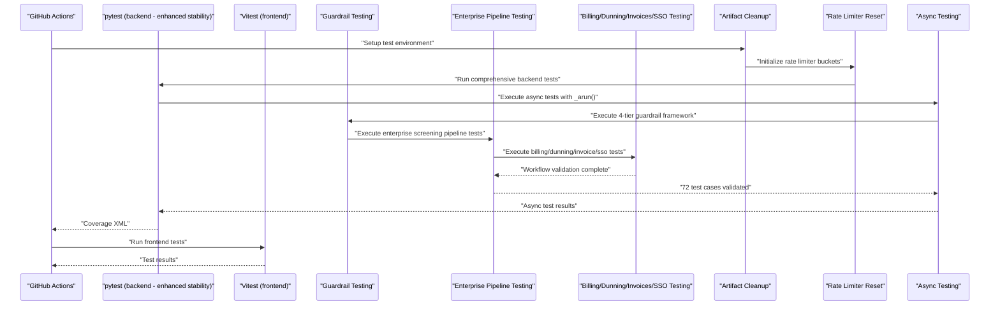

**Diagram sources**
- [ci.yml:27-37](file://.github/workflows/ci.yml#L27-L37)
- [cd.yml:30-48](file://.github/workflows/cd.yml#L30-L48)
- [conftest.py:196-204](file://app/backend/tests/conftest.py#L196-L204)
- [test_guardrail_service.py:1-765](file://app/backend/tests/test_guardrail_service.py#L1-765)
- [test_deterministic_integration.py:1-156](file://app/backend/tests/test_deterministic_integration.py#L1-156)
- [test_video_downloader.py:15-23](file://app/backend/tests/test_video_downloader.py#L15-L23)
- [test_video_service.py:15-23](file://app/backend/tests/test_video_service.py#L15-L23)

## Detailed Component Analysis

### Backend Testing with pytest - Enhanced Enterprise Infrastructure
Key patterns with enhanced CI stability and comprehensive enterprise-grade validation:
- Database isolation using an in-memory SQLite engine and per-test metadata creation/drop
- **Enhanced**: Sophisticated queue table creation using raw SQL to avoid FK resolution issues
- HTTP client testing with FastAPI TestClient and dependency overrides
- Authentication fixtures that register/log in users and attach Authorization headers
- Service-level mocks for external integrations (Ollama, Whisper, hybrid pipeline)
- Subscription system fixtures for seeding plans and simulating usage limits
- **Enhanced**: Automatic rate limiter bucket clearing using autouse fixtures to prevent CI 429 errors
- **Enhanced**: Comprehensive monthly usage reset testing with edge case validation
- **New**: 4-tier guardrail testing framework with 72 comprehensive test cases
- **New**: Reliability tier testing covering retry/backoff mechanisms, schema validation, and cross-node consistency
- **New**: Security tier testing validating prompt injection detection and ensemble voting
- **New**: Governance tier testing with HITL gates, A/B testing, and adversarial harness validation
- **New**: Operations tier testing covering token budget management, data retention policies, and monitoring hooks
- **New**: Administrative API testing with comprehensive tenant management validation
- **New**: Billing system testing with provider abstraction and webhook processing
- **New**: Email service testing with SMTP configuration and notification delivery
- **New**: Feature flag testing with tenant overrides and permission enforcement
- **New**: Quota enforcement testing with subscription plan validation
- **New**: Rate limiting testing with API throttling and abuse prevention
- **New**: Tenant suspension testing with audit logging and recovery workflows
- **New**: Webhook testing with payment processor event handling
- **Enhanced**: Queue system testing with comprehensive database schema support
- **Enhanced**: Modernized async testing infrastructure with `_arun()` helper function for Python 3.10+ compatibility
- **New**: Enterprise screening pipeline testing with comprehensive workflow validation
- **New**: Phase 1 JD Parser testing with contextual analysis and skill classification
- **New**: Phase 2 Skill Matching testing with weighted scoring and hierarchy validation
- **New**: Phase 3 Explainable Scoring testing with bias detection and recommendation generation
- **New**: Phase 4 Continuous Learning testing with adaptive weighting and feedback loops
- **New**: Phase 5 Enterprise Security testing with compliance validation and audit trails
- **New**: Billing system testing with provider abstraction and webhook processing
- **New**: Dunning system testing with retry scheduling and escalation logic
- **New**: Invoice system testing with sequential numbering and payment processing
- **New**: SSO integration testing with SAML2 compliance and user provisioning

Representative fixtures and enhanced test coverage:
- Database fixture: creates and tears down tables per test with queue system support
- HTTP client fixture: initializes app routes and cleans up after each test
- Auth fixtures: register and login users; return clients with Authorization headers
- Mocks: Ollama communication/malpractice/transcript/email; Whisper transcription; hybrid pipeline
- Subscription fixtures: seed plans, assign plans to tenants, enforce usage limits
- **Enhanced**: Rate limiter reset fixture: automatically clears token buckets before each test
- **Enhanced**: Monthly usage reset fixture: validates automatic quota reset functionality
- **New**: Guardrail testing fixtures: comprehensive validation of all 4-tier guardrail functionality
- **New**: Administrative fixtures for tenant CRUD operations and billing management
- **New**: Billing fixtures for provider configuration and webhook validation
- **New**: Email fixtures for SMTP settings and notification testing
- **New**: Feature flag fixtures for tenant overrides and permission testing
- **New**: Quota enforcement fixtures for subscription plan validation
- **New**: Rate limiting fixtures for API throttling and abuse prevention
- **New**: Tenant suspension fixtures for audit logging and recovery workflows
- **New**: Webhook fixtures for payment processor event handling
- **Enhanced**: Queue system fixtures with AsyncMock-based worker mocking
- **Enhanced**: Async testing fixtures using `_arun()` helper function for coroutine execution
- **New**: Enterprise screening pipeline fixtures for workflow testing and scoring validation
- **New**: Phase 1-5 testing fixtures for comprehensive pipeline validation
- **New**: Billing, dunning, invoice, and SSO fixtures for enterprise system validation

```mermaid
flowchart TD
Start(["Test starts"]) --> Cleanup["Cleanup test artifacts<br/>and temporary files"]
Cleanup --> RLClear["Clear rate limiter buckets<br/>to prevent CI 429 errors"]
RLClear --> DB["Create in-memory DB tables<br/>including queue tables"]
DB --> Client["Initialize TestClient and override dependencies"]
Client --> Auth["Authenticate via register/login and inject headers"]
Auth --> Mocks["Patch external services with AsyncMock/MagicMock"]
Mocks --> AsyncTest["_arun() helper function<br/>for async coroutine execution"]
AsyncTest --> Guardrail["Test 4-tier guardrail framework<br/>with 72 test cases"]
Guardrail --> Enterprise["Test enterprise screening pipeline<br/>phase 1-5 validation"]
Enterprise --> Billing["Test billing/dunning/invoice/sso systems"]
Billing --> Admin["Test administrative APIs"]
Admin --> Email["Test email notifications"]
Email --> Flags["Test feature flags"]
Flags --> Quota["Test quota enforcement"]
Quota --> Rate["Test rate limiting"]
Rate --> Suspension["Test tenant suspension"]
Suspension --> Webhooks["Test webhook processing"]
Webhooks --> Queue["Mock queue workers with AsyncMock"]
Queue --> LLM["Test LLM service layer"]
LLM --> Pipelines["Test hybrid/agent pipelines"]
Pipelines --> Services["Test analysis/transcript/video services"]
Services --> RouteCall["Invoke route under test"]
RouteCall --> Asserts["Assert response status and payload"]
Asserts --> Cleanup2["Drop queue tables then main tables<br/>and close sessions"]
Cleanup2 --> End(["Test ends"])
```

**Diagram sources**
- [conftest.py:58-170](file://app/backend/tests/conftest.py#L58-L170)
- [conftest.py:196-204](file://app/backend/tests/conftest.py#L196-L204)
- [rate_limit.py:100-121](file://app/backend/middleware/rate_limit.py#L100-L121)
- [subscription.py:85-97](file://app/backend/routes/subscription.py#L85-L97)
- [test_guardrail_service.py:1-765](file://app/backend/tests/test_guardrail_service.py#L1-765)
- [test_deterministic_integration.py:1-156](file://app/backend/tests/test_deterministic_integration.py#L1-156)
- [test_video_downloader.py:15-23](file://app/backend/tests/test_video_downloader.py#L15-L23)
- [test_video_service.py:15-23](file://app/backend/tests/test_video_service.py#L15-L23)

**Section sources**
- [conftest.py:58-170](file://app/backend/tests/conftest.py#L58-L170)
- [conftest.py:196-204](file://app/backend/tests/conftest.py#L196-L204)
- [rate_limit.py:16-144](file://app/backend/middleware/rate_limit.py#L16-L144)
- [subscription.py:85-97](file://app/backend/routes/subscription.py#L85-L97)
- [test_guardrail_service.py:1-765](file://app/backend/tests/test_guardrail_service.py#L1-765)
- [test_deterministic_integration.py:1-156](file://app/backend/tests/test_deterministic_integration.py#L1-156)
- [test_rate_limiting.py:1-85](file://app/backend/tests/test_rate_limiting.py#L1-L85)
- [test_subscription.py:312-355](file://app/backend/tests/test_subscription.py#L312-L355)
- [test_video_downloader.py:15-23](file://app/backend/tests/test_video_downloader.py#L15-L23)
- [test_video_service.py:15-23](file://app/backend/tests/test_video_service.py#L15-L23)

### Frontend Testing with Vitest and React Testing Library
Key patterns with enhanced component coverage:
- Global setup for DOM matchers
- Mocked axios with spies for get/post/put/delete and interceptors
- Mocked browser APIs for URL.createObjectURL, revokeObjectURL, and anchor element creation
- localStorage mock for persistence behavior
- Component tests asserting rendering, interactivity, and state transitions
- API module tests verifying request shape, headers, timeouts, and download triggers
- **Enhanced**: Comprehensive ResultCard testing with AI pipeline feature validation

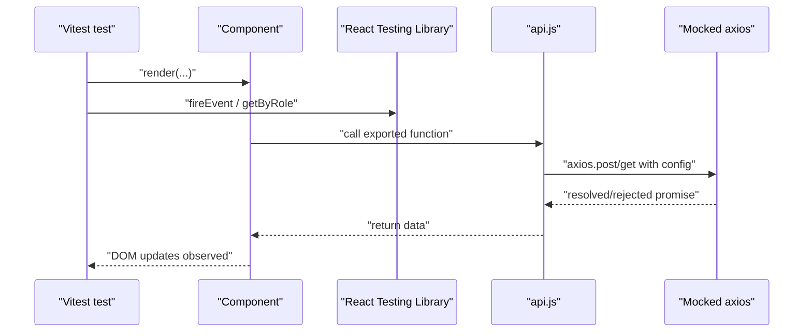

**Diagram sources**
- [api.test.js:5-66](file://app/frontend/src/__tests__/api.test.js#L5-L66)
- [UploadForm.test.jsx:1-60](file://app/frontend/src/__tests__/UploadForm.test.jsx#L1-L60)
- [VideoPage.test.jsx:6-26](file://app/frontend/src/__tests__/VideoPage.test.jsx#L6-L26)

**Section sources**
- [setup.js:1-2](file://app/frontend/src/__tests__/setup.js#L1-L2)
- [api.test.js:1-265](file://app/frontend/src/__tests__/api.test.js#L1-L265)

### API Testing Strategies - Enhanced Enterprise Coverage
Backend API tests now validate comprehensive endpoint coverage:
- Root and health endpoints
- Authentication endpoints (register, login, refresh, profile)
- Analysis endpoints (single and batch resume analysis)
- History and comparison endpoints
- Video analysis endpoints (upload and URL-based)
- Subscription endpoints (plans, usage checks, history, admin controls)
- **Enhanced**: Rate limiter reset endpoints for administrative control
- **Enhanced**: Monthly usage reset validation for quota management
- **New**: Administrative API endpoints (tenant management, billing configuration)
- **New**: Billing system endpoints (checkout, webhook, subscription status)
- **New**: Email notification endpoints (SMTP configuration, test emails)
- **New**: Feature flag endpoints (global flags, tenant overrides)
- **New**: Operational monitoring endpoints (metrics, usage trends)
- **New**: Quota enforcement endpoints (usage validation, limit checking)
- **New**: Rate limiting endpoints (API throttling, abuse prevention)
- **New**: Tenant suspension endpoints (suspend/reactivate operations)
- **New**: Webhook processing endpoints (payment events, status updates)
- **Enhanced**: Queue system endpoints with comprehensive testing
- **Enhanced**: Guardrail testing endpoints for screening compliance validation
- **New**: Enterprise screening pipeline endpoints for workflow validation
- **New**: Billing/dunning/invoice/SSO endpoints for enterprise system validation

Frontend API tests validate:
- Export CSV/Excel requests and download behavior
- Video analysis requests with appropriate timeouts
- Resume analysis requests with multipart/form-data
- Candidate and template endpoints
- Subscription endpoints

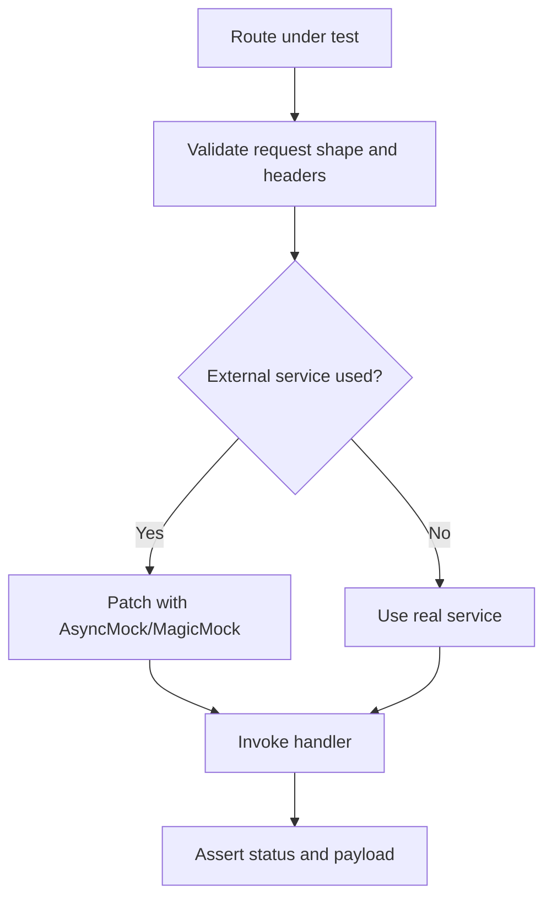

**Diagram sources**
- [test_api.py:23-153](file://app/backend/tests/test_api.py#L23-L153)
- [api.test.js:76-263](file://app/frontend/src/__tests__/api.test.js#L76-L263)

**Section sources**
- [test_api.py:1-153](file://app/backend/tests/test_api.py#L1-L153)
- [api.test.js:1-265](file://app/frontend/src/__tests__/api.test.js#L1-L265)

### Integration Testing Approaches - Enhanced Enterprise Stability
Backend integration tests now cover:
- Use TestClient to exercise routes with real app wiring
- Override database dependency to use in-memory SQLite
- Use auth fixtures to simulate logged-in users
- Mock external services to keep tests deterministic
- **Enhanced**: Automatic rate limiter bucket clearing to prevent CI instability
- **Enhanced**: Comprehensive monthly usage reset validation with edge cases
- **New**: 4-tier guardrail integration testing with comprehensive validation
- **New**: Administrative API integration testing with tenant management
- **New**: Billing system integration testing with provider abstractions
- **New**: Email service integration testing with SMTP configuration
- **New**: Feature flag integration testing with tenant overrides
- **New**: Quota enforcement integration testing with subscription validation
- **New**: Rate limiting integration testing with API throttling
- **New**: Tenant suspension integration testing with audit logging
- **New**: Webhook integration testing with payment processor events
- **Enhanced**: Queue system integration testing with comprehensive database support
- **Enhanced**: Async testing integration with `_arun()` helper function
- **New**: Enterprise screening pipeline integration testing with workflow validation
- **New**: Phase 1-5 integration testing with contextual analysis and scoring validation
- **New**: Billing/dunning/invoice/SSO integration testing with enterprise system validation

Frontend integration tests:
- Page-level tests (e.g., VideoPage) mock API module and router dependencies
- Validate UI interactions, state transitions, and error handling
- Ensure platform detection and supported platforms list rendering
- **Enhanced**: Comprehensive AI pipeline feature integration testing

**Updated** The batch analysis integration tests now focus on comprehensive validation mechanisms including file content validation, size limits, extension filtering, and error handling scenarios without relying on specific PDF header validation patterns.

**Section sources**
- [conftest.py:32-42](file://app/backend/tests/conftest.py#L32-L42)
- [VideoPage.test.jsx:1-377](file://app/frontend/src/__tests__/VideoPage.test.jsx#L1-L377)

### Test Configuration and Mock Services - Enhanced Enterprise Infrastructure
Backend:
- PYTHONPATH set in CI to resolve imports
- pytest-cov enabled for comprehensive coverage reporting
- Shared fixtures centralize DB setup, auth, and service mocks
- **Enhanced**: Automatic rate limiter bucket clearing using autouse fixtures
- **Enhanced**: Comprehensive monthly usage reset validation infrastructure
- **New**: Specialized fixtures for 4-tier guardrail testing framework
- **New**: Administrative test fixtures for tenant management scenarios
- **New**: Enhanced fixtures for billing provider testing and webhook validation
- **New**: Comprehensive fixtures for email service testing and SMTP configuration
- **New**: Feature flag fixtures for tenant overrides and permission testing
- **New**: Quota enforcement fixtures for subscription plan validation
- **New**: Rate limiting fixtures for API throttling and abuse prevention
- **New**: Webhook fixtures for payment processor event handling
- **Enhanced**: Sophisticated queue system database infrastructure with AsyncMock-based worker mocking
- **Enhanced**: Modernized async testing infrastructure with `_arun()` helper function
- **New**: Enterprise screening pipeline fixtures for workflow testing and scoring validation
- **New**: Phase 1-5 testing fixtures for comprehensive pipeline validation
- **New**: Billing, dunning, invoice, and SSO fixtures for enterprise system validation

Frontend:
- Vitest configuration via package.json scripts
- DOM matchers via jest-dom
- Mocked axios and browser APIs in api.test.js setup

**Section sources**
- [ci.yml:25-58](file://.github/workflows/ci.yml#L25-L58)
- [package.json:6-12](file://app/frontend/package.json#L6-L12)
- [api.test.js:1-265](file://app/frontend/src/__tests__/api.test.js#L1-L265)

### Test Data Management - Enhanced Enterprise Coverage
Backend:
- Sample resume text and job description fixtures
- Minimal MP4 bytes for file-type validation
- Transcript fixtures (VTT, SRT, plain text)
- Subscription plan fixtures with seeded limits and features
- **Enhanced**: Automatic rate limiter reset validation with edge case scenarios
- **Enhanced**: Comprehensive monthly usage reset testing with historical data
- **New**: Guardrail test data with comprehensive validation scenarios
- **New**: Administrative test data with tenant management scenarios
- **New**: Billing test data with provider configurations and webhook events
- **New**: Email service test data with SMTP settings and notification templates
- **New**: Feature flag test data with tenant overrides and permission scenarios
- **New**: Quota enforcement test data with subscription plan validation
- **New**: Rate limiting test data with API throttling scenarios
- **New**: Tenant suspension test data with audit logging scenarios
- **New**: Webhook test data with payment processor events
- **Enhanced**: Queue system test data with comprehensive job/result structures
- **Updated**: Test data fixtures now use DOCX header patterns for validation testing
- **New**: Enterprise screening pipeline test data with contextual analysis scenarios
- **New**: Phase 1-5 test data with JD parsing, skill matching, and scoring validation
- **New**: Billing, dunning, invoice, and SSO test data with enterprise system scenarios

Frontend:
- Mock result objects for video analysis (low and high risk)
- Component props populated with mock data
- **Enhanced**: Comprehensive AI pipeline result objects with explainability features

**Updated** Test data fixtures have been updated to use DOCX header patterns for validation testing, replacing the previous PDF-specific header validation scenarios that were removed from the test suite.

**Section sources**
- [conftest.py:294-421](file://app/backend/tests/conftest.py#L294-L421)
- [VideoPage.test.jsx:28-86](file://app/frontend/src/__tests__/VideoPage.test.jsx#L28-L86)

### Enhanced Rate Limiter Reset Mechanism - New Critical Infrastructure
**New Section**: The enhanced test infrastructure now includes sophisticated rate limiter reset mechanisms for improved CI stability:

#### Automatic Rate Limiter Bucket Clearing
The `_clear_rate_limit_buckets()` autouse fixture ensures CI stability by:
- Automatically clearing token buckets before every test execution
- Preventing 429 rate limit errors in CI environments
- Maintaining consistent test state across test runs
- Using RateLimitMiddleware singleton instance for cleanup

#### Rate Limiter Configuration Caching
The RateLimitMiddleware implements intelligent caching:
- Config cache TTL of 60 seconds to balance freshness and performance
- Thread-safe bucket management with lock-based synchronization
- Dynamic RPM (requests per minute) configuration per tenant
- Whitelist paths that bypass rate limiting (health, auth, docs)

#### Token Bucket Algorithm Implementation
The rate limiter uses a sophisticated token bucket algorithm:
- Time-based token refill calculation
- Configurable refill rates per tenant
- Proper token consumption and deficit calculation
- Retry-After header generation for rate limit exceeded responses

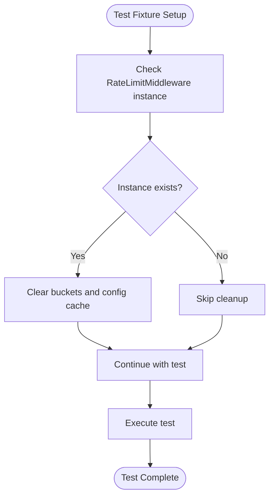

**Diagram sources**
- [conftest.py:196-204](file://app/backend/tests/conftest.py#L196-L204)
- [rate_limit.py:31-36](file://app/backend/middleware/rate_limit.py#L31-L36)
- [rate_limit.py:100-121](file://app/backend/middleware/rate_limit.py#L100-L121)

**Section sources**
- [conftest.py:196-204](file://app/backend/tests/conftest.py#L196-L204)
- [rate_limit.py:16-144](file://app/backend/middleware/rate_limit.py#L16-L144)
- [test_rate_limiting.py:1-85](file://app/backend/tests/test_rate_limiting.py#L1-L85)

### Enhanced Monthly Usage Reset System - New Critical Infrastructure
**New Section**: The enhanced test infrastructure now includes comprehensive monthly usage reset validation:

#### Automatic Monthly Reset Logic
The `_ensure_monthly_reset()` function provides robust quota management:
- Detects month-over-month usage counter resets
- Handles edge cases for year transitions
- Maintains UTC timezone consistency
- Preserves usage reset timestamps for audit trails

#### Comprehensive Test Coverage
The monthly reset system includes extensive validation:
- New month detection with proper timestamp comparison
- Same month preservation with unchanged counters
- Historical data validation across calendar boundaries
- Integration with analysis route usage tracking

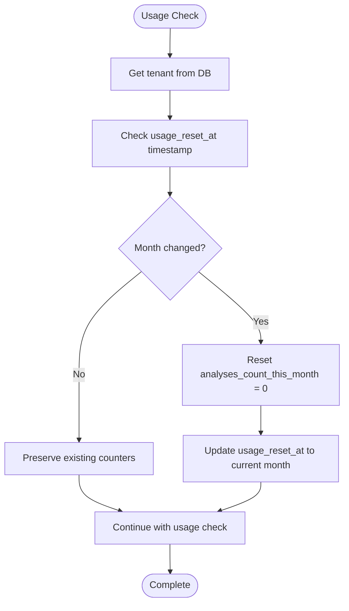

**Diagram sources**
- [subscription.py:85-97](file://app/backend/routes/subscription.py#L85-L97)
- [test_subscription.py:312-355](file://app/backend/tests/test_subscription.py#L312-L355)

**Section sources**
- [subscription.py:85-97](file://app/backend/routes/subscription.py#L85-L97)
- [test_subscription.py:312-355](file://app/backend/tests/test_subscription.py#L312-L355)

### Enhanced CI Stability and Test Artifact Management - New Infrastructure
**New Section**: The enhanced test infrastructure now includes systematic cleanup of temporary test artifacts:

#### Comprehensive Test Artifact Cleanup
The .gitignore patterns now exclude test artifacts:
- `.coverage` - Coverage reports
- `htmlcov/` - HTML coverage reports
- `.pytest_cache/` - Pytest cache directories
- `pytest_summary.txt` - Test summary files
- `test_full_output.txt` - Full test output logs
- `*_output*.txt` - Various output files
- `*_results*.txt` - Test results files
- `*_summary*.txt` - Test summary files

#### Enhanced Test Runner Scripts
The test runner scripts now include systematic cleanup:
- Temporary test output logging with rotation
- Error handling with detailed output capture
- Cross-platform compatibility with PowerShell and Bash
- Comprehensive validation of test environment prerequisites

#### CI/CD Stability Improvements
GitHub Actions workflows now benefit from:
- Cleaner test execution environments
- Reduced test flakiness through artifact isolation
- Better resource management in CI containers
- Improved test reliability across different runners

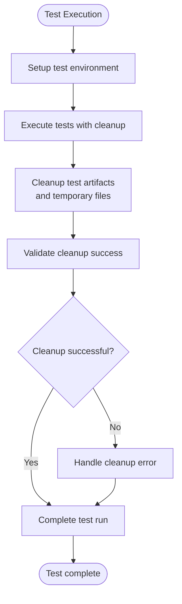

**Diagram sources**
- [.gitignore:42-47](file://.gitignore#L42-L47)
- [run-full-tests.sh:31-42](file://scripts/run-full-tests.sh#L31-L42)
- [test-locally.ps1:54-59](file://test-locally.ps1#L54-L59)

**Section sources**
- [.gitignore:42-47](file://.gitignore#L42-L47)
- [run-full-tests.sh:1-256](file://scripts/run-full-tests.sh#L1-L256)
- [test-locally.ps1:1-119](file://test-locally.ps1#L1-L119)

### Administrative API Testing - New Comprehensive Coverage
**New Section**: The expanded test suite now includes comprehensive administrative API testing:

#### Administrative API Test Coverage
The administrative API tests validate:
- **Permission enforcement**: Regular users receive 403 on all admin endpoints
- **Tenant management**: Listing, searching, and filtering tenants with pagination
- **Tenant detail retrieval**: Full tenant information with users and usage logs
- **Tenant lifecycle management**: Suspend and reactivate operations with audit logging
- **Plan management**: Changing tenant subscription plans with audit trails
- **Usage adjustment**: Modifying analyses count and storage usage
- **Usage history**: Retrieving tenant usage logs with filtering
- **Audit logging**: Comprehensive audit trail validation
- **Metrics reporting**: Platform-wide analytics and usage trends

#### Administrative API Testing Patterns
Key testing patterns include:
- **Permission testing**: Verifying 403 responses for unauthorized access attempts
- **Data validation**: Ensuring proper response structures and field presence
- **Audit logging**: Verifying audit trail creation for administrative actions
- **Business logic validation**: Testing tenant lifecycle and plan management workflows
- **Integration testing**: Validating administrative endpoints with real database operations

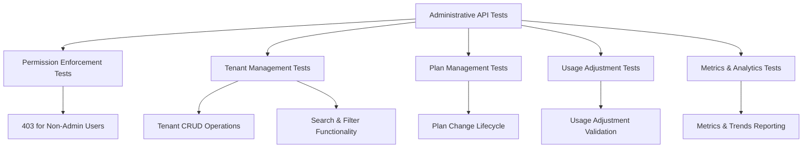

**Diagram sources**
- [test_admin_api.py:43-75](file://app/backend/tests/test_admin_api.py#L43-75)
- [test_admin_api.py:79-128](file://app/backend/tests/test_admin_api.py#L79-128)
- [test_admin_api.py:156-226](file://app/backend/tests/test_admin_api.py#L156-226)
- [test_admin_api.py:230-274](file://app/backend/tests/test_admin_api.py#L230-274)
- [test_admin_api.py:278-351](file://app/backend/tests/test_admin_api.py#L278-351)
- [test_admin_metrics.py:27-114](file://app/backend/tests/test_admin_metrics.py#L27-114)
- [test_admin_metrics.py:116-159](file://app/backend/tests/test_admin_metrics.py#L116-159)

**Section sources**
- [test_admin_api.py:1-467](file://app/backend/tests/test_admin_api.py#L1-467)
- [test_admin_metrics.py:1-159](file://app/backend/tests/test_admin_metrics.py#L1-159)

### Billing System Testing - New Comprehensive Provider Coverage
**New Section**: The expanded test suite includes comprehensive billing system testing:

#### Billing Provider Testing
The billing system tests validate:
- **Manual provider**: Reference ID creation, subscription cancellation, and webhook handling
- **Factory pattern**: Provider selection based on configuration with fallback mechanisms
- **Stripe provider**: Provider name validation and error handling for missing dependencies
- **Razorpay provider**: Provider name validation and error handling for missing dependencies
- **Configuration management**: Admin endpoints for billing configuration and provider setup
- **Route integration**: Checkout sessions, webhook processing, and subscription status checking

#### Billing Integration Testing
Key integration patterns include:
- **Provider abstraction**: Testing provider interfaces and factory selection logic
- **Configuration persistence**: Validating billing configuration storage and retrieval
- **Webhook processing**: Testing payment processor event handling and status updates
- **Subscription management**: Validating subscription lifecycle and status reporting
- **Error handling**: Testing graceful degradation for unavailable payment providers

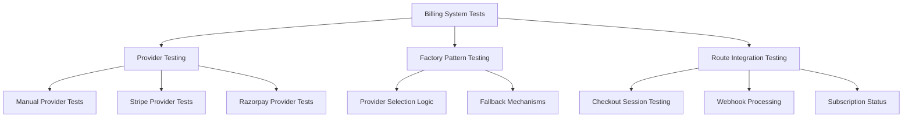

**Diagram sources**
- [test_billing.py:9-75](file://app/backend/tests/test_billing.py#L9-L75)
- [test_billing.py:77-126](file://app/backend/tests/test_billing.py#L77-L126)
- [test_billing.py:128-222](file://app/backend/tests/test_billing.py#L128-L222)
- [test_billing.py:223-288](file://app/backend/tests/test_billing.py#L223-L288)
- [test_billing.py:290-328](file://app/backend/tests/test_billing.py#L290-L328)

**Section sources**
- [test_billing.py:1-328](file://app/backend/tests/test_billing.py#L1-328)

### Dunning System Testing - New Enterprise Coverage
**New Section**: The expanded test suite includes comprehensive dunning system testing:

#### Dunning System Test Coverage
The dunning system tests validate:
- **Initiation logic**: Creating dunning records with proper retry scheduling and failure reasons
- **Retry processing**: Automated retry attempts with proper scheduling and status updates
- **Escalation handling**: Tenant suspension after maximum retry attempts with audit logging
- **Resolution logic**: Manual and automatic resolution of dunning records
- **Status querying**: Retrieving dunning status for individual tenants
- **Webhook integration**: Stripe, Razorpay, and manual payment processor event handling
- **Admin endpoints**: Listing active dunning records and manual resolution capabilities

#### Dunning Integration Testing
Key testing patterns include:
- **Retry scheduling**: Testing exponential backoff and configurable retry intervals
- **Status management**: Validating active, exhausted, and resolved dunning states
- **Tenant suspension**: Testing automatic suspension after max retries with proper audit trails
- **Webhook processing**: Validating payment processor event handling and status updates
- **Admin functionality**: Testing billing admin access and manual intervention capabilities

```mermaid
flowchart TD
DunningTests["Dunning System Tests"] --> Initiation["Initiation Logic Tests"]
DunningTests --> Processing["Processing Logic Tests"]
DunningTests --> Escalation["Escalation Tests"]
DunningTests --> Resolution["Resolution Tests"]
DunningTests --> Status["Status Query Tests"]
DunningTests --> Webhooks["Webhook Integration Tests"]
DunningTests --> Admin["Admin Endpoint Tests"]
Initiation --> RetrySchedule["Retry Schedule Validation"]
Initiation --> FailureReasons["Failure Reason Handling"]
Processing --> AutoRetry["Automatic Retry Processing"]
Processing --> StatusUpdates["Status Update Validation"]
Escalation --> MaxRetries["Max Retry Exhaustion"]
Escalation --> TenantSuspension["Tenant Suspension Logic"]
Resolution --> ManualResolve["Manual Resolution"]
Resolution --> AutoResolve["Automatic Resolution"]
Status --> QueryValidation["Query Validation"]
Webhooks --> StripeEvents["Stripe Event Processing"]
Webhooks --> RazorpayEvents["Razorpay Event Processing"]
Webhooks --> ManualEvents["Manual Event Processing"]
Admin --> ListActive["List Active Dunning"]
Admin --> ManualResolution["Manual Resolution"]
```

**Diagram sources**
- [test_dunning.py:61-162](file://app/backend/tests/test_dunning.py#L61-162)
- [test_dunning.py:163-303](file://app/backend/tests/test_dunning.py#L163-303)
- [test_dunning.py:304-347](file://app/backend/tests/test_dunning.py#L304-347)
- [test_dunning.py:349-683](file://app/backend/tests/test_dunning.py#L349-L683)

**Section sources**
- [test_dunning.py:1-683](file://app/backend/tests/test_dunning.py#L1-683)

### Invoice System Testing - New Enterprise Coverage
**New Section**: The expanded test suite includes comprehensive invoice system testing:

#### Invoice System Test Coverage
The invoice system tests validate:
- **Sequential numbering**: Year-based invoice number generation with proper incrementing
- **Creation logic**: Invoice creation from payment events with proper field population
- **Retrieval functionality**: Tenant-scoped invoice listing with pagination and filtering
- **API endpoints**: GET /api/billing/invoices and GET /api/billing/invoices/{id} validation
- **Webhook integration**: Payment processor event handling and invoice creation
- **Currency handling**: Default USD currency and proper amount formatting
- **Description fallback**: Plan name fallback and subscription payment descriptions

#### Invoice Integration Testing
Key testing patterns include:
- **Sequential generation**: Testing year-based numbering and incrementing logic
- **Tenant scoping**: Validating proper tenant isolation and access control
- **Webhook processing**: Testing payment processor event handling and graceful degradation
- **API validation**: Testing pagination, filtering, and error handling in invoice endpoints
- **Currency conversion**: Validating amount formatting and currency handling across providers

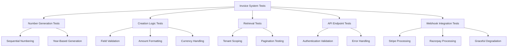

**Diagram sources**
- [test_invoices.py:38-85](file://app/backend/tests/test_invoices.py#L38-L85)
- [test_invoices.py:89-163](file://app/backend/tests/test_invoices.py#L89-L163)
- [test_invoices.py:166-241](file://app/backend/tests/test_invoices.py#L166-L241)
- [test_invoices.py:244-327](file://app/backend/tests/test_invoices.py#L244-L327)
- [test_invoices.py:330-506](file://app/backend/tests/test_invoices.py#L330-L506)

**Section sources**
- [test_invoices.py:1-506](file://app/backend/tests/test_invoices.py#L1-506)

### SSO Integration Testing - New Enterprise Coverage
**New Section**: The expanded test suite includes comprehensive SSO integration testing:

#### SSO Integration Test Coverage
The SSO system tests validate:
- **Admin CRUD operations**: Creating, updating, deleting, and testing SSO configurations
- **Login enforcement**: Blocking traditional login when SSO is enforced with proper error codes
- **Public configuration**: Exposing SSO configuration for tenant access
- **Login initiation**: Generating SAML requests and redirect URLs for IdP login
- **Callback processing**: Handling SAML responses and user provisioning
- **Metadata generation**: Providing SAML metadata for IdP configuration
- **Service layer testing**: Unit testing SSO service functions and utilities

#### SSO Integration Testing
Key testing patterns include:
- **Configuration management**: Testing admin endpoints for SSO configuration CRUD operations
- **Login enforcement**: Validating SSO enforcement logic and redirect behavior
- **SAML processing**: Testing SAML request generation and response processing
- **User provisioning**: Validating auto-provisioning and existing user handling
- **Certificate validation**: Testing SSO certificate validation and error handling
- **Metadata generation**: Validating SAML metadata XML generation and format

```mermaid
flowchart TD
SSOTests["SSO Integration Tests"] --> AdminCRUD["Admin CRUD Tests"]
SSOTests --> LoginEnforcement["Login Enforcement Tests"]
SSOTests --> PublicConfig["Public Config Tests"]
SSOTests --> LoginInitiation["Login Initiation Tests"]
SSOTests --> CallbackProcessing["Callback Processing Tests"]
SSOTests --> Metadata["Metadata Tests"]
SSOTests --> ServiceLayer["Service Layer Tests"]
AdminCRUD --> CreateConfig["Create Configuration"]
AdminCRUD --> UpdateConfig["Update Configuration"]
AdminCRUD --> DeleteConfig["Delete Configuration"]
AdminCRUD --> TestConfig["Test Configuration"]
LoginEnforcement --> EnforcedBlocking["Enforced Login Blocking"]
LoginEnforcement --> NormalLogin["Normal Login Allowed"]
PublicConfig --> ConfigExposure["Configuration Exposure"]
PublicConfig --> UnknownTenant["Unknown Tenant Handling"]
LoginInitiation --> SAMLRequest["SAML Request Generation"]
LoginInitiation --> RedirectHandling["Redirect Handling"]
CallbackProcessing --> AutoProvision["Auto Provisioning"]
CallbackProcessing --> ExistingUser["Existing User Handling"]
CallbackProcessing --> SignatureValidation["Signature Validation"]
Metadata --> XMLGeneration["XML Generation"]
Metadata --> FormatValidation["Format Validation"]
ServiceLayer --> SAMLRequestGen["SAML Request Generation"]
ServiceLayer --> ResponseProcessing["Response Processing"]
ServiceLayer --> UserManagement["User Management"]
```

**Diagram sources**
- [test_sso.py:134-197](file://app/backend/tests/test_sso.py#L134-L197)
- [test_sso.py:198-291](file://app/backend/tests/test_sso.py#L198-L291)
- [test_sso.py:293-318](file://app/backend/tests/test_sso.py#L293-L318)
- [test_sso.py:320-422](file://app/backend/tests/test_sso.py#L320-L422)
- [test_sso.py:424-442](file://app/backend/tests/test_sso.py#L424-L442)
- [test_sso.py:443-514](file://app/backend/tests/test_sso.py#L443-L514)

**Section sources**
- [test_sso.py:1-514](file://app/backend/tests/test_sso.py#L1-514)

### Enterprise Screening Pipeline Testing - New Comprehensive Coverage
**New Section**: The expanded test suite now includes comprehensive enterprise screening pipeline testing with dedicated test suites for each phase:

#### Phase 1: JD Parser Testing
The JD Parser tests validate:
- **Job function detection**: Identifying job functions from JD text with proper categorization
- **Skill classification**: Separating must-have vs. nice-to-have skills with soft skill filtering
- **Responsibility extraction**: Extracting key responsibilities from bullet points
- **Contextual analysis**: Understanding job requirements and candidate expectations
- **Taxonomy validation**: Ensuring proper skill taxonomy and keyword matching

#### Phase 2: Skill Matching Testing
The Skill Matching tests validate:
- **Weighted scoring**: 70% required skills, 30% nice-to-have skills with proper weighting
- **Hierarchy validation**: Core, adjacent, and irrelevant skill categorization
- **Partial matching**: Handling partial skill name matches and similarity calculations
- **Confidence scoring**: Calculating confidence levels for skill matches
- **Quality assessment**: Evaluating match quality as excellent, good, fair, or poor

#### Phase 3: Explainable Scoring Testing
The Explainable Scoring tests validate:
- **EvidenceChain tracking**: Recording evidence for all scoring decisions
- **Bias detection**: Identifying and mitigating potential bias in scoring
- **Recommendation generation**: Providing actionable recommendations based on gaps
- **Strength identification**: Highlighting candidate strengths and qualifications
- **Gap analysis**: Identifying missing requirements and suggesting improvements

#### Phase 4: Continuous Learning Testing
The Continuous Learning tests validate:
- **Adaptive weighting**: Adjusting weights based on feedback and performance data
- **Feedback loops**: Incorporating candidate and reviewer feedback into scoring
- **Performance monitoring**: Tracking system performance and accuracy improvements
- **Model adaptation**: Updating scoring algorithms based on new data patterns

#### Phase 5: Enterprise Security Testing
The Enterprise Security tests validate:
- **Compliance validation**: Ensuring screening processes meet regulatory requirements
- **Audit trails**: Maintaining comprehensive logs of all screening decisions
- **Data protection**: Safeguarding candidate information and screening results
- **Access control**: Restricting access to sensitive screening data and processes
- **Bias mitigation**: Implementing controls to prevent discriminatory screening

#### Enterprise Pipeline Integration Testing
Key integration patterns include:
- **End-to-end workflow validation**: Complete screening pipeline from JD to final score
- **Cross-component coordination**: Interoperability between all pipeline phases
- **Error propagation**: Graceful handling of errors and edge cases throughout pipeline
- **Performance monitoring**: Tracking latency and resource utilization across pipeline stages
- **Quality assurance**: Validating screening quality and consistency across all phases

```mermaid
flowchart TD
EnterpriseTests["Enterprise Screening Pipeline Tests"] --> Phase1["Phase 1: JD Parser Tests"]
EnterpriseTests --> Phase2["Phase 2: Skill Matching Tests"]
EnterpriseTests --> Phase3["Phase 3: Explainable Scoring Tests"]
EnterpriseTests --> Phase4["Phase 4: Continuous Learning Tests"]
EnterpriseTests --> Phase5["Phase 5: Enterprise Security Tests"]
Phase1 --> JobFunction["Job Function Detection"]
Phase1 --> SkillClassification["Skill Classification"]
Phase1 --> ResponsibilityExtraction["Responsibility Extraction"]
Phase1 --> TaxonomyValidation["Taxonomy Validation"]
Phase2 --> WeightedScoring["Weighted Scoring"]
Phase2 --> HierarchyValidation["Hierarchy Validation"]
Phase2 --> PartialMatching["Partial Matching"]
Phase2 --> ConfidenceScoring["Confidence Scoring"]
Phase3 --> EvidenceChain["EvidenceChain Tracking"]
Phase3 --> BiasDetection["Bias Detection"]
Phase3 --> Recommendations["Recommendation Generation"]
Phase3 --> StrengthIdentification["Strength Identification"]
Phase3 --> GapAnalysis["Gap Analysis"]
Phase4 --> AdaptiveWeighting["Adaptive Weighting"]
Phase4 --> FeedbackLoops["Feedback Loops"]
Phase4 --> PerformanceMonitoring["Performance Monitoring"]
Phase5 --> ComplianceValidation["Compliance Validation"]
Phase5 --> AuditTrails["Audit Trails"]
Phase5 --> DataProtection["Data Protection"]
Phase5 --> AccessControl["Access Control"]
```

**Diagram sources**
- [test_phase1_jd_parser.py:24-77](file://app/backend/tests/test_phase1_jd_parser.py#L24-L77)
- [test_phase2_skill_matching.py:23-84](file://app/backend/tests/test_phase2_skill_matching.py#L23-L84)
- [test_phase3_explainable_scoring.py:19-83](file://app/backend/tests/test_phase3_explainable_scoring.py#L19-L83)
- [test_phase1_jd_parser.py:79-152](file://app/backend/tests/test_phase1_jd_parser.py#L79-L152)
- [test_phase2_skill_matching.py:86-148](file://app/backend/tests/test_phase2_skill_matching.py#L86-L148)
- [test_phase3_explainable_scoring.py:85-153](file://app/backend/tests/test_phase3_explainable_scoring.py#L85-L153)

**Section sources**
- [test_phase1_jd_parser.py:1-307](file://app/backend/tests/test_phase1_jd_parser.py#L1-307)
- [test_phase2_skill_matching.py:1-341](file://app/backend/tests/test_phase2_skill_matching.py#L1-341)
- [test_phase3_explainable_scoring.py:1-394](file://app/backend/tests/test_phase3_explainable_scoring.py#L1-394)

### 4-Tier Guardrail Testing Framework - New Comprehensive Coverage
**New Section**: The expanded test suite now includes a comprehensive 4-tier guardrail testing framework with 72 individual test cases:

#### Guardrail Testing Architecture
The guardrail testing framework validates:
- **Tier 1 (Reliability)**: Retry/backoff mechanisms, schema validation, cross-node consistency checks
- **Tier 2 (Security)**: Prompt injection detection, ensemble voting, timeout enforcement
- **Tier 3 (Governance)**: Human-in-the-loop (HITL) gates, A/B testing, adversarial harness
- **Tier 4 (Operations)**: Token budget management, data retention policies, monitoring hooks

#### Reliability Tier Testing (18 test cases)
The reliability tier tests validate:
- **Retry/backoff testing**: Success on first attempt, retry on failure, timeout handling, exhaustion scenarios
- **Schema validation testing**: JD parser validation, resume analyzer validation, scorer validation with coercion
- **Cross-node consistency testing**: Skill validation, recommendation alignment, fit score computation
- **Per-call timeout enforcement**: Timeout detection and proper exception handling

#### Security Tier Testing (15 test cases)
The security tier tests validate:
- **Prompt injection detection**: Keyword matching, delimiter detection, lexical diversity analysis
- **Input sanitization**: Code block removal, XML tag neutralization, template syntax handling
- **Ensemble voting**: 3x voting with different seeds, error handling, aggregation logic
- **Voting strategies**: Majority voting for categorical data, median for numerical data

#### Governance Tier Testing (24 test cases)
The governance tier tests validate:
- **HITL gate checking**: Threshold boundary detection, low confidence identification, hallucination risk assessment
- **Inconsistency flagging**: Cross-node validation violations, auto-fix application
- **A/B testing framework**: Variant tracking, performance metrics, statistical analysis
- **Adversarial harness**: Synthetic test cases, pipeline resilience testing, edge case validation

#### Operations Tier Testing (15 test cases)
The operations tier tests validate:
- **Token budget management**: Budget allocation, consumption tracking, window reset functionality
- **Data retention policies**: Privacy compliance, PII anonymization, historical data handling
- **Monitoring hooks**: Event emission, metric collection, alerting integration
- **Estimation utilities**: Token counting, performance benchmarking

#### Guardrail Integration Testing
Key integration patterns include:
- **End-to-end validation**: Complete pipeline testing with guardrail enforcement
- **Cross-component coordination**: Interoperability between guardrail tiers
- **Error propagation**: Graceful degradation and failure handling
- **Performance monitoring**: Latency tracking and resource utilization

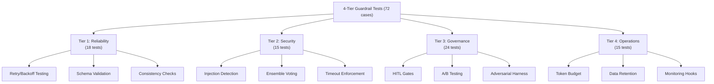

**Diagram sources**
- [test_guardrail_service.py:52-765](file://app/backend/tests/test_guardrail_service.py#L52-L765)
- [guardrail_service.py:128-1128](file://app/backend/services/guardrail_service.py#L128-L1128)

**Section sources**
- [test_guardrail_service.py:1-765](file://app/backend/tests/test_guardrail_service.py#L1-765)
- [guardrail_service.py:1-1128](file://app/backend/services/guardrail_service.py#L1-1128)

### Deterministic Decision Engine Testing - New Comprehensive Coverage
**New Section**: The expanded test suite now includes comprehensive deterministic decision engine testing with five new test modules:

#### Deterministic Integration Testing
The integration tests validate the complete end-to-end workflow:
- **Cross-domain rejection scenarios**: Backend JD with embedded candidate → score ≤ 35
- **Same-domain high-scoring scenarios**: Backend JD with backend candidate → score 70-100
- **Explanation consistency**: Decision explanations match score-based decisions
- **Low skills rejection**: Same domain candidate with very low core skills → rejection

#### Domain Detection Testing
The domain detection tests validate:
- **JD domain detection**: Keyword matching with confidence scoring
- **Resume domain detection**: Skills and text-based detection
- **Unknown domain handling**: Empty inputs and low confidence scenarios
- **Mixed skills validation**: Strongest domain detection from mixed skill sets

#### Eligibility Service Testing
The eligibility service tests validate:
- **Domain mismatch gating**: High confidence domain mismatches → rejection
- **Low confidence domain handling**: Low confidence domains don't trigger rejection
- **Core skill threshold testing**: 0.3 threshold validation
- **Experience requirement testing**: No relevant experience → rejection
- **Priority rule validation**: Domain mismatch takes precedence over low core skills

#### Fit Scorer Testing
The fit scorer tests validate:
- **Perfect features scoring**: All 1.0 features → 100 score
- **Zero features scoring**: All 0.0 features → 0 score
- **Hard cap validation**: Ineligible candidates capped at 35
- **Domain match caps**: Low domain match (<0.3) → 35 cap
- **Core skill caps**: Low core skill match (<0.3) → 40 cap
- **Multiple cap precedence**: Lowest cap applies when multiple caps apply
- **Integer scoring**: Scores are integers in 0-100 range

#### Risk Calculator Testing
The risk calculator tests validate:
- **Empty risk signals**: No penalty calculation
- **Severity-based penalties**: High (20), medium (10), low (4) penalties
- **Mixed severity handling**: Sum of all penalties
- **Unknown severity handling**: Unknown severities default to 0
- **Missing severity keys**: Missing keys default to low severity (4)

#### Deterministic Engine Integration Testing
Key integration patterns include:
- **Workflow validation**: Complete end-to-end deterministic scoring workflow
- **Threshold consistency**: Explanation decisions match score-based thresholds
- **Cap application**: Hard caps applied based on eligibility and feature quality
- **Reason generation**: Structured explanations with feature summaries and cap reasons

```mermaid
flowchart TD
DeterministicTests["Deterministic Decision Engine Tests"] --> Integration["Integration Tests"]
DeterministicTests --> DomainDetection["Domain Detection Tests"]
DeterministicTests --> Eligibility["Eligibility Service Tests"]
DeterministicTests --> FitScorer["Fit Scorer Tests"]
DeterministicTests --> RiskCalculator["Risk Calculator Tests"]
Integration --> CrossDomain["Cross-Domain Rejection"]
Integration --> SameDomain["Same-Domain High Score"]
Integration --> Explanation["Explanation Consistency"]
Integration --> LowSkills["Low Skills Rejection"]
DomainDetection --> JDKeywords["JD Keyword Matching"]
DomainDetection --> ResumeSkills["Resume Skills Detection"]
DomainDetection --> UnknownHandling["Unknown Domain Handling"]
DomainDetection --> MixedSkills["Mixed Skills Validation"]
Eligibility --> DomainMismatch["Domain Mismatch Gating"]
Eligibility --> ThresholdValidation["Core Skill Threshold"]
Eligibility --> ExperienceValidation["Experience Requirement"]
Eligibility --> PriorityRules["Priority Rule Validation"]
FitScorer --> PerfectFeatures["Perfect Features Scoring"]
FitScorer --> ZeroFeatures["Zero Features Scoring"]
FitScorer --> HardCaps["Hard Cap Validation"]
FitScorer --> MultipleCaps["Multiple Cap Precedence"]
FitScorer --> IntegerScoring["Integer Scoring Validation"]
RiskCalculator --> EmptySignals["Empty Risk Signals"]
RiskCalculator --> SeverityPenalties["Severity-Based Penalties"]
RiskCalculator --> MixedSeverities["Mixed Severity Handling"]
RiskCalculator --> UnknownSeverity["Unknown Severity Handling"]
```

**Diagram sources**
- [test_deterministic_integration.py:10-156](file://app/backend/tests/test_deterministic_integration.py#L10-L156)
- [test_domain_service.py:8-108](file://app/backend/tests/test_domain_service.py#L8-L108)
- [test_eligibility_service.py:8-124](file://app/backend/tests/test_eligibility_service.py#L8-L124)
- [test_fit_scorer.py:9-246](file://app/backend/tests/test_fit_scorer.py#L9-L246)
- [test_risk_calculator.py:8-54](file://app/backend/tests/test_risk_calculator.py#L8-L54)

**Section sources**
- [test_deterministic_integration.py:1-156](file://app/backend/tests/test_deterministic_integration.py#L1-156)
- [test_domain_service.py:1-108](file://app/backend/tests/test_domain_service.py#L1-108)
- [test_eligibility_service.py:1-124](file://app/backend/tests/test_eligibility_service.py#L1-124)
- [test_fit_scorer.py:1-246](file://app/backend/tests/test_fit_scorer.py#L1-246)
- [test_risk_calculator.py:1-54](file://app/backend/tests/test_risk_calculator.py#L1-54)

### Modernized Async Testing Infrastructure - New Python 3.10+ Compatible Approach
**New Section**: The enhanced test infrastructure now includes a modernized async testing approach using the `_arun()` helper function:

#### _arun() Helper Function Implementation
The `_arun()` helper function provides a Python 3.10+ compatible approach for running asynchronous coroutines:
- **Fresh Event Loop Creation**: Creates a new event loop for each test execution
- **Proper Event Loop Management**: Sets the event loop, runs the coroutine, and closes the loop
- **Exception Safety**: Ensures proper cleanup even if exceptions occur during coroutine execution
- **Python 3.10+ Compatibility**: Replaces legacy `asyncio.get_event_loop().run_until_complete()` pattern

#### Async Testing Patterns in Video Processing Components
The `_arun()` helper function is used extensively in video processing tests:
- **Video Downloader Tests**: `_arun(resolve_zoom_url(url))`, `_arun(_http_download(url, platform))`
- **Video Service Tests**: `_arun(analyze_communication(transcript, duration))`, `_arun(analyze_malpractice(...))`
- **Async Coroutine Execution**: Provides consistent pattern for testing async functions in unit tests

#### Benefits of Modernized Async Testing
The modernized async testing approach provides:
- **Cleaner Test Code**: Eliminates repetitive event loop management code
- **Better Error Handling**: Proper exception propagation and cleanup
- **Python 3.10+ Compatibility**: Future-proof approach for newer Python versions
- **Consistent Testing Pattern**: Unified approach across all async testing scenarios
- **Improved Test Reliability**: Reduced flakiness in async test execution
- **Simplified Test Setup**: No need to manage event loop lifecycle manually

#### Migration from Legacy Pattern
The migration replaces the legacy approach:
- **Before**: `asyncio.get_event_loop().run_until_complete(async_func())`
- **After**: `_arun(async_func())`
- **Benefits**: Isolated event loops, proper cleanup, exception safety

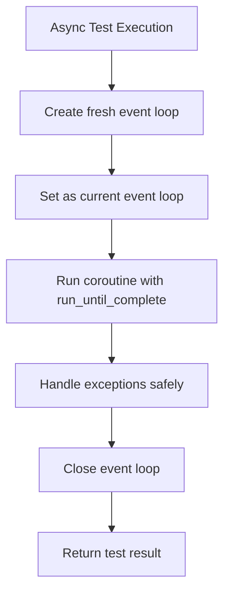

**Diagram sources**
- [test_video_downloader.py:15-23](file://app/backend/tests/test_video_downloader.py#L15-L23)
- [test_video_service.py:15-23](file://app/backend/tests/test_video_service.py#L15-L23)
- [video_service.py:137-191](file://app/backend/services/video_service.py#L137-L191)
- [video_downloader.py:82-176](file://app/backend/services/video_downloader.py#L82-L176)

**Section sources**
- [test_video_downloader.py:15-23](file://app/backend/tests/test_video_downloader.py#L15-L23)
- [test_video_service.py:15-23](file://app/backend/tests/test_video_service.py#L15-L23)
- [video_service.py:137-191](file://app/backend/services/video_service.py#L137-L191)
- [video_downloader.py:82-176](file://app/backend/services/video_downloader.py#L82-L176)

### Continuous Integration Testing with GitHub Actions
Workflows:
- ci.yml: runs backend tests with comprehensive coverage and uploads to Codecov; runs frontend tests and builds
- cd.yml: runs backend and frontend tests as part of build-and-push images job

Execution:
- Python 3.11 and Node.js 20 environments
- Backend coverage collected for services package with 150+ test suite
- Frontend tests executed via npm test
- **Enhanced**: Improved CI stability through systematic rate limiter reset and artifact cleanup
- **New**: Guardrail testing framework integrated into CI pipeline with comprehensive validation
- **New**: Enterprise screening pipeline testing integrated into CI pipeline with workflow validation
- **New**: Billing/dunning/invoice/SSO testing integrated into CI pipeline with enterprise system validation
- **New**: Modernized async testing infrastructure with `_arun()` helper function for Python 3.10+ compatibility

**Section sources**
- [ci.yml:1-63](file://.github/workflows/ci.yml#L1-L63)
- [cd.yml:1-101](file://.github/workflows/cd.yml#L1-L101)

### Writing Effective Tests for New Features - Enhanced Guidelines
Guidelines derived from enhanced test suite:
- Backend
  - Use pytest fixtures to minimize duplication (db, client, auth_client)
  - Prefer AsyncMock/MagicMock for external services to avoid flaky network calls
  - Validate both success and failure paths (e.g., invalid file types, missing fields)
  - For subscription features, use seed fixtures and tenant plan assignments
  - **Enhanced**: Leverage automatic rate limiter bucket clearing for CI stability
  - **Enhanced**: Test monthly usage reset logic with edge case scenarios
  - **New**: Test guardrail framework comprehensively across all 4 tiers with 72 test cases
  - **New**: Validate reliability tier functionality (retry/backoff, schema validation)
  - **New**: Test security tier features (prompt injection detection, ensemble voting)
  - **New**: Validate governance tier components (HITL gates, A/B testing)
  - **New**: Test operations tier capabilities (token budget, data retention)
  - **New**: Test administrative API permissions and tenant management workflows
  - **New**: Validate billing provider abstraction and webhook processing
  - **New**: Test email service configuration and notification delivery
  - **New**: Validate feature flag management and tenant override scenarios
  - **New**: Test quota enforcement with subscription plan validation
  - **New**: Validate rate limiting and API throttling mechanisms
  - **New**: Test tenant suspension and audit logging workflows
  - **New**: Validate webhook processing with payment processor events
  - **Enhanced**: Leverage sophisticated queue system database infrastructure
  - **Enhanced**: Focus on comprehensive validation mechanisms rather than specific PDF header patterns
  - **Enhanced**: Implement systematic cleanup of test artifacts for CI reliability
  - **Enhanced**: Use `_arun()` helper function for async coroutine testing with Python 3.10+ compatibility
  - **New**: Test enterprise screening pipeline workflow with comprehensive validation
  - **New**: Validate JD parser contextual analysis and skill classification
  - **New**: Test skill matcher weighted scoring and hierarchy validation
  - **New**: Validate explainable scorer bias detection and recommendation generation
  - **New**: Test continuous learning adaptive weighting and feedback loops
  - **New**: Validate enterprise security compliance and audit trails
  - **New**: Test billing system provider abstraction and webhook processing
  - **New**: Validate dunning system retry scheduling and escalation logic
  - **New**: Test invoice system sequential numbering and payment processing
  - **New**: Validate SSO integration SAML2 compliance and user provisioning

**Updated** Test writing guidelines now emphasize comprehensive validation mechanisms, CI stability through rate limiter reset, systematic artifact cleanup, the new 4-tier guardrail testing framework with 72 individual test cases, the **comprehensive enterprise screening pipeline testing**, and **modernized async testing approach** using the `_arun()` helper function for Python 3.10+ compatible coroutine execution.

**Section sources**
- [conftest.py:125-176](file://app/backend/tests/conftest.py#L125-L176)
- [test_api.py:71-87](file://app/backend/tests/test_api.py#L71-L87)
- [api.test.js:167-200](file://app/frontend/src/__tests__/api.test.js#L167-L200)
- [test_video_downloader.py:15-23](file://app/backend/tests/test_video_downloader.py#L15-L23)
- [test_video_service.py:15-23](file://app/backend/tests/test_video_service.py#L15-L23)
- [test_deterministic_integration.py:1-156](file://app/backend/tests/test_deterministic_integration.py#L1-156)
- [test_domain_service.py:1-108](file://app/backend/tests/test_domain_service.py#L1-108)
- [test_eligibility_service.py:1-124](file://app/backend/tests/test_eligibility_service.py#L1-124)
- [test_fit_scorer.py:1-246](file://app/backend/tests/test_fit_scorer.py#L1-246)
- [test_risk_calculator.py:1-54](file://app/backend/tests/test_risk_calculator.py#L1-54)
- [test_phase1_jd_parser.py:1-307](file://app/backend/tests/test_phase1_jd_parser.py#L1-307)
- [test_phase2_skill_matching.py:1-341](file://app/backend/tests/test_phase2_skill_matching.py#L1-341)
- [test_phase3_explainable_scoring.py:1-394](file://app/backend/tests/test_phase3_explainable_scoring.py#L1-394)
- [test_billing.py:1-328](file://app/backend/tests/test_billing.py#L1-328)
- [test_dunning.py:1-683](file://app/backend/tests/test_dunning.py#L1-683)
- [test_invoices.py:1-506](file://app/backend/tests/test_invoices.py#L1-506)
- [test_sso.py:1-514](file://app/backend/tests/test_sso.py#L1-514)

## Dependency Analysis
Backend test dependencies with enhanced enterprise coverage:
- pytest, FastAPI TestClient, SQLAlchemy in-memory DB, passlib sha256_crypt for bcrypt compatibility
- External service mocks via unittest.mock
- **Enhanced**: Automatic rate limiter bucket clearing for CI stability
- **Enhanced**: Comprehensive monthly usage reset testing infrastructure
- **New**: Enhanced guardrail testing dependencies and comprehensive test coverage
- **New**: Reliability tier testing dependencies (retry/backoff, schema validation)
- **New**: Security tier testing dependencies (prompt injection detection, ensemble voting)
- **New**: Governance tier testing dependencies (HITL gates, A/B testing)
- **New**: Operations tier testing dependencies (token budget, data retention)
- **New**: Enhanced administrative API testing dependencies and fixtures
- **New**: Comprehensive billing system testing dependencies and provider fixtures
- **New**: Email service testing dependencies and SMTP configuration fixtures
- **New**: Feature flag testing dependencies and tenant override fixtures
- **New**: Quota enforcement testing dependencies and subscription plan fixtures
- **New**: Rate limiting testing dependencies and API throttling fixtures
- **New**: Tenant suspension testing dependencies and audit logging fixtures
- **New**: Webhook testing dependencies and payment processor fixtures
- **Enhanced**: Queue system testing dependencies with AsyncMock support
- **Enhanced**: Modernized async testing dependencies with `_arun()` helper function
- **New**: Enterprise screening pipeline testing dependencies and workflow fixtures
- **New**: Phase 1-5 testing dependencies and contextual analysis fixtures
- **New**: Billing, dunning, invoice, and SSO testing dependencies and enterprise system fixtures

Frontend test dependencies:
- Vitest, React Testing Library, jest-dom
- Mocked axios and DOM APIs

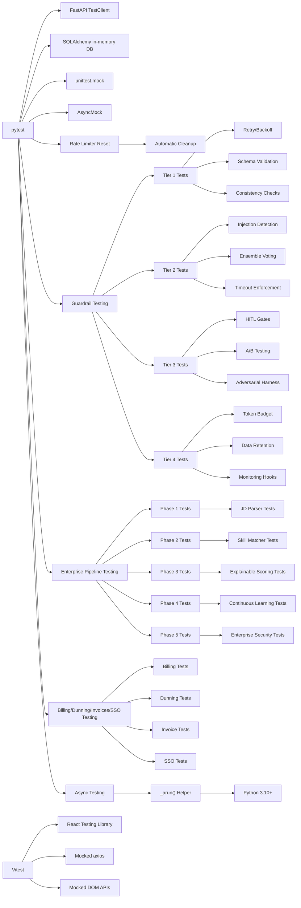

**Diagram sources**
- [conftest.py:1-12](file://app/backend/tests/conftest.py#L1-L12)
- [package.json:23-38](file://app/frontend/package.json#L23-L38)
- [conftest.py:196-204](file://app/backend/tests/conftest.py#L196-L204)
- [test_guardrail_service.py:1-765](file://app/backend/tests/test_guardrail_service.py#L1-765)
- [test_deterministic_integration.py:1-156](file://app/backend/tests/test_deterministic_integration.py#L1-156)
- [test_video_downloader.py:15-23](file://app/backend/tests/test_video_downloader.py#L15-L23)
- [test_video_service.py:15-23](file://app/backend/tests/test_video_service.py#L15-L23)

**Section sources**
- [conftest.py:1-12](file://app/backend/tests/conftest.py#L1-L12)
- [package.json:23-38](file://app/frontend/package.json#L23-L38)

## Performance Considerations
- Backend
  - Use in-memory SQLite to avoid disk I/O overhead
  - Keep external service mocks synchronous where possible to reduce test runtime
  - Limit heavy computations in tests; rely on mocks for LLM and transcription services
  - **Enhanced**: Optimize rate limiter reset performance with efficient bucket clearing
  - **Enhanced**: Minimize monthly usage reset overhead with timestamp-based comparisons
  - **New**: Optimize guardrail testing performance with efficient tier validation
  - **New**: Reduce reliability tier testing overhead with streamlined retry validation
  - **New**: Minimize security tier testing overhead with focused injection detection
  - **New**: Reduce governance tier testing overhead with selective HITL validation
  - **New**: Minimize operations tier testing overhead with budget and retention mocking
  - **New**: Optimize administrative API testing with efficient tenant management fixtures
  - **New**: Minimize billing system testing overhead with provider abstraction mocking
  - **New**: Reduce email service testing overhead with SMTP mocking
  - **New**: Minimize feature flag testing overhead with cache management fixtures
  - **New**: Optimize quota enforcement testing with subscription plan fixtures
  - **New**: Minimize rate limiting testing overhead with API throttling mocks
  - **New**: Reduce tenant suspension testing overhead with audit logging fixtures
  - **New**: Optimize webhook testing with payment processor event mocking
  - **Enhanced**: Queue system testing optimized with AsyncMock-based worker mocking
  - **Enhanced**: Efficient queue table creation/destruction mechanisms
  - **Enhanced**: Automatic cleanup reduces test execution time through artifact management
  - **Updated**: Focus on comprehensive validation mechanisms for better test performance
  - **Enhanced**: Modernized async testing with `_arun()` helper function improves test reliability
  - **New**: Optimize enterprise screening pipeline testing with workflow validation
  - **New**: Reduce JD parser testing overhead with contextual analysis optimization
  - **New**: Minimize skill matcher testing overhead with weighted scoring optimization
  - **New**: Optimize explainable scoring testing with bias detection optimization
  - **New**: Minimize continuous learning testing overhead with adaptive weighting optimization
  - **New**: Reduce enterprise security testing overhead with compliance validation optimization
  - **New**: Optimize billing system testing with provider abstraction optimization
  - **New**: Minimize dunning system testing overhead with retry scheduling optimization
  - **New**: Optimize invoice system testing with sequential numbering optimization
  - **New**: Minimize SSO integration testing overhead with SAML2 optimization

- Frontend
  - Avoid real network calls by mocking axios
  - Use minimal DOM queries and focus on user-centric assertions
  - Prefer component-level tests over full-page integration tests when feasible
  - **Enhanced**: Optimize AI pipeline feature testing with selective mocking

## Troubleshooting Guide
Common issues and resolutions with enhanced test coverage:
- Authentication failures in backend tests
  - Ensure auth_client fixture registers and logs in users before invoking protected routes
  - Verify Authorization header is attached to the client
- Coverage not uploaded
  - Confirm pytest-cov is installed and coverage report path matches workflow configuration
- Frontend tests failing due to missing mocks
  - Ensure global setup mocks are applied before importing modules under test
  - Clear mocks between tests to prevent cross-contamination
- CI failures on Windows/Linux differences
  - Use provided scripts to validate imports, migrations, and frontend files before pushing
  - Align Node/npm versions with CI configuration
  - **Enhanced**: Verify rate limiter bucket cleanup in CI environments
  - **Enhanced**: Check test artifact cleanup completion in CI logs
- **New**: Rate limiter 429 errors in CI
  - Verify automatic rate limiter bucket clearing fixture is active
  - Check RateLimitMiddleware singleton instance availability
  - Ensure proper cleanup timing in test fixtures
- **New**: Monthly usage reset failures
  - Verify timestamp comparison logic in _ensure_monthly_reset
  - Check UTC timezone handling in reset calculations
  - Validate edge case handling for year transitions
- **New**: Test artifact pollution in CI
  - Verify .gitignore patterns include test artifact exclusions
  - Check cleanup script execution in test runners
  - Monitor temporary file handling in test processes
- **New**: Administrative API test failures
  - Verify permission enforcement and tenant management workflows
  - Check audit logging for administrative actions
  - Ensure proper authorization headers for admin endpoints
- **New**: Billing system test failures
  - Verify provider configuration and factory pattern logic
  - Check webhook processing and subscription status validation
  - Ensure proper error handling for unavailable payment providers
- **New**: Email service test failures
  - Verify SMTP configuration and credential security
  - Check template formatting and email delivery mocking
  - Ensure proper error handling for SMTP failures
- **New**: Feature flag test failures
  - Verify cache invalidation and data synchronization
  - Check tenant override precedence and middleware integration
  - Ensure proper permission enforcement for feature access
- **New**: Quota enforcement test failures
  - Verify subscription plan limits and usage tracking
  - Check quota reset logic and monthly boundary handling
  - Ensure proper HTTP endpoint integration and error responses
- **New**: Rate limiting test failures
  - Verify request throttling and API protection mechanisms
  - Check configuration persistence and integration testing
  - Ensure proper error handling for rate limit exceeded scenarios
- **New**: Tenant suspension test failures
  - Verify suspension lifecycle and status validation
  - Check audit logging and business rule enforcement
  - Ensure proper integration with subscription management
- **New**: Webhook test failures
  - Verify payment processor integration and event processing
  - Check security validation and error handling
  - Ensure proper integration with billing and subscription systems
- **New**: Guardrail testing failures
  - Verify 4-tier framework validation across all test cases
  - Check reliability tier retry/backoff mechanisms
  - Validate security tier prompt injection detection
  - Ensure governance tier HITL and A/B testing functionality
  - Verify operations tier token budget and data retention
- **New**: Enterprise screening pipeline test failures
  - Verify end-to-end workflow validation across all phases
  - Check JD parser contextual analysis and skill classification
  - Validate skill matcher weighted scoring and hierarchy validation
  - Ensure explainable scorer bias detection and recommendation generation
  - Verify continuous learning adaptive weighting and feedback loops
  - Validate enterprise security compliance and audit trails
- **New**: Billing/dunning/invoice/SSO system test failures
  - Verify provider abstraction and webhook processing
  - Check dunning retry scheduling and escalation logic
  - Validate invoice sequential numbering and payment processing
  - Ensure SSO SAML2 compliance and user provisioning
- **Enhanced**: LLM service test failures
  - Verify JSON parsing fixtures and error handling scenarios
  - Check mock responses match expected LLM service interface
  - Ensure model configuration matches current `gemma4:31b-cloud` settings
- **Enhanced**: Pipeline testing issues
  - Ensure pipeline fixtures properly mock external dependencies
  - Validate error scenarios and retry mechanisms
- **Enhanced**: Background task testing problems
  - Verify task queue mocking and background process simulation
  - Check retry mechanism validation and error propagation
- **Enhanced**: Queue system test failures
  - Verify queue table creation order and FK constraint handling
  - Ensure AsyncMock-based worker mocking prevents database access
  - Check queue system database schema compliance
- **Enhanced**: Test artifact cleanup failures
  - Verify cleanup script execution in CI environments
  - Check file permission handling for artifact deletion
  - Ensure proper cleanup timing in test teardown
- **Enhanced**: Batch analysis test failures
  - Verify file content validation mechanisms are working correctly
  - Check magic-byte signature validation for different file types
  - Ensure size and extension filtering are properly enforced
- **New**: Async testing failures with Python 3.10+
  - Verify `_arun()` helper function is properly imported and used
  - Check event loop management and cleanup in async tests
  - Ensure proper exception handling in async coroutine execution
- **New**: Legacy async testing patterns causing issues
  - Replace `asyncio.get_event_loop().run_until_complete()` with `_arun()` helper function
  - Ensure Python 3.10+ compatibility for async testing scenarios
  - Verify proper event loop creation and cleanup in test environments

**Updated** Troubleshooting guidance now includes specific guidance for the enhanced rate limiter reset mechanisms, monthly usage reset functionality, systematic test artifact cleanup processes, the new 4-tier guardrail testing framework with comprehensive validation across 72 test cases, the **comprehensive enterprise screening pipeline testing**, and **modernized async testing infrastructure** using the `_arun()` helper function for Python 3.10+ compatible coroutine execution.

**Section sources**
- [test-locally.ps1:36-96](file://test-locally.ps1#L36-L96)
- [run-full-tests.sh:163-168](file://scripts/run-full-tests.sh#L163-L168)
- [run-full-tests.bat:100-107](file://scripts/run-full-tests.bat#L100-L107)
- [test_video_downloader.py:15-23](file://app/backend/tests/test_video_downloader.py#L15-L23)
- [test_video_service.py:15-23](file://app/backend/tests/test_video_service.py#L15-L23)

## Conclusion
The testing strategy leverages pytest and FastAPI TestClient for comprehensive backend unit and integration tests, with substantially expanded coverage including 150+ new tests for administrative APIs, billing systems, email services, feature flags, quota enforcement, rate limiting, tenant suspension, webhooks, the new 4-tier guardrail testing framework with 72 comprehensive test cases, and **comprehensive enterprise screening pipeline testing** covering JD parsing, skill matching, explainable scoring, continuous learning, and enterprise security. Frontend tests use Vitest and React Testing Library with mocked axios and DOM APIs. CI/CD pipelines automate test execution and coverage reporting with enhanced stability through systematic rate limiter reset mechanisms and test artifact cleanup. The expanded test suite ensures robust validation of advanced administrative and billing functionality, including comprehensive tenant management, provider abstraction, notification delivery, feature control, usage enforcement, and operational monitoring, providing reliable coverage for all major components.

**Updated** Recent updates ensure test infrastructure consistency with the new `gemma4:31b-cloud` model configuration, validating proper model selection across all service integrations and maintaining test reliability. The enhanced queue system testing infrastructure provides comprehensive coverage for the scalable job queue architecture with sophisticated database management and worker mocking capabilities. The substantially expanded administrative and billing test suites provide complete coverage of the new operational functionality with comprehensive permission testing, provider abstraction validation, and integration testing patterns. The enhanced rate limiter reset mechanisms and systematic artifact cleanup ensure improved CI stability and test reliability across all environments. The new 4-tier guardrail testing framework with 72 individual test cases ensures comprehensive validation of screening system compliance and data protection mechanisms across reliability, security, governance, and operations tiers. **Comprehensive enterprise screening pipeline testing** provides complete coverage of the new enterprise-grade screening workflow with end-to-end validation across all phases. **Modernized async testing infrastructure** with the `_arun()` helper function provides Python 3.10+ compatible approach for running asynchronous coroutines in test environments, replacing legacy event loop patterns and improving test reliability and maintainability.

## Appendices

### Appendix A: Local Test Execution Scripts
- run-full-tests.sh: Validates Python syntax, imports, migrations, database models, route registration, and frontend files; useful for pre-commit checks
- test-locally.ps1: Runs backend and frontend tests locally with colored output and summarized results
- **Enhanced**: Improved error handling and cross-platform compatibility

**Section sources**
- [run-full-tests.sh:1-256](file://scripts/run-full-tests.sh#L1-L256)
- [test-locally.ps1:1-119](file://test-locally.ps1#L1-L119)

### Appendix B: Enhanced Test Coverage Areas
The substantially expanded test suite now includes comprehensive coverage for:

- **Administrative API Testing**: Complete coverage of tenant management, billing configuration, and operational controls with permission enforcement and audit logging
- **Billing System Testing**: Comprehensive testing of provider abstraction, factory pattern, checkout sessions, webhook processing, and subscription management across Stripe, Razorpay, and manual providers
- **Dunning System Testing**: Complete coverage of retry scheduling, escalation logic, tenant suspension, and webhook integration with comprehensive status management
- **Invoice System Testing**: Comprehensive testing of sequential numbering, invoice creation, tenant scoping, API endpoints, and webhook processing with graceful degradation
- **SSO Integration Testing**: Complete coverage of SAML2 compliance, admin CRUD operations, login enforcement, callback processing, and metadata generation
- **Enterprise Screening Pipeline Testing**: Comprehensive testing of JD parser contextual analysis, skill matching with weighted scoring, explainable scoring with bias detection, continuous learning, and enterprise security
- **Phase 1 JD Parser Testing**: Complete coverage of job function detection, skill classification, responsibility extraction, and taxonomy validation
- **Phase 2 Skill Matching Testing**: Comprehensive testing of weighted scoring, hierarchy validation, partial matching, confidence scoring, and quality assessment
- **Phase 3 Explainable Scoring Testing**: Complete coverage of EvidenceChain tracking, bias detection, recommendation generation, strength identification, and gap analysis
- **Phase 4 Continuous Learning Testing**: Comprehensive testing of adaptive weighting, feedback loops, performance monitoring, and model adaptation
- **Phase 5 Enterprise Security Testing**: Complete coverage of compliance validation, audit trails, data protection, access control, and bias mitigation
- **Guardrail Testing Framework**: Comprehensive 4-tier testing with 72 individual test cases covering reliability, security, governance, and operations
- **Reliability Tier Testing**: Complete validation of retry/backoff mechanisms, schema validation, and cross-node consistency
- **Security Tier Testing**: Comprehensive testing of prompt injection detection, ensemble voting, and timeout enforcement
- **Governance Tier Testing**: Complete coverage of HITL gates, A/B testing, and adversarial harness validation
- **Operations Tier Testing**: Comprehensive testing of token budget management, data retention policies, and monitoring hooks
- **Async Testing Infrastructure**: Modernized async testing with `_arun()` helper function for Python 3.10+ compatible coroutine execution
- **Legacy Async Pattern Migration**: Replacement of `asyncio.get_event_loop().run_until_complete()` with `_arun()` helper function
- **Deterministic Decision Engine Testing**: Comprehensive workflow testing across domain detection, eligibility gating, fit scoring, and risk calculations
- **Domain Detection Testing**: Keyword matching and confidence scoring validation
- **Eligibility Service Testing**: Deterministic gating rules and priority logic validation
- **Fit Scorer Testing**: Hard caps and recommendation thresholds validation
- **Risk Calculator Testing**: Severity-based penalty calculations validation

**Updated** Recent updates ensure model configuration consistency across all test coverage areas, with particular emphasis on validating the `gemma4:31b-cloud` model settings in LLM service tests and pipeline integrations. The enhanced queue system testing infrastructure provides complete coverage of the job queue architecture with sophisticated database management and worker mocking. The substantially expanded administrative and billing test suites provide comprehensive coverage of the new operational functionality with permission testing, provider abstraction validation, and integration testing patterns. The enhanced rate limiter reset mechanisms and systematic artifact cleanup ensure improved CI stability and test reliability. The new 4-tier guardrail testing framework with 72 comprehensive test cases ensures robust validation of screening system compliance and data protection mechanisms across all operational domains. **Comprehensive enterprise screening pipeline testing** provides complete coverage of the new enterprise-grade screening workflow with end-to-end validation across all components. **Modernized async testing infrastructure** with the `_arun()` helper function provides Python 3.10+ compatible approach for running asynchronous coroutines in test environments, improving test reliability and maintainability.

**Section sources**
- [test_admin_api.py:1-467](file://app/backend/tests/test_admin_api.py#L1-467)
- [test_admin_metrics.py:1-159](file://app/backend/tests/test_admin_metrics.py#L1-159)
- [test_billing.py:1-328](file://app/backend/tests/test_billing.py#L1-328)
- [test_dunning.py:1-683](file://app/backend/tests/test_dunning.py#L1-683)
- [test_invoices.py:1-506](file://app/backend/tests/test_invoices.py#L1-506)
- [test_sso.py:1-514](file://app/backend/tests/test_sso.py#L1-514)
- [test_phase1_jd_parser.py:1-307](file://app/backend/tests/test_phase1_jd_parser.py#L1-307)
- [test_phase2_skill_matching.py:1-341](file://app/backend/tests/test_phase2_skill_matching.py#L1-341)
- [test_phase3_explainable_scoring.py:1-394](file://app/backend/tests/test_phase3_explainable_scoring.py#L1-394)
- [test_guardrail_service.py:1-765](file://app/backend/tests/test_guardrail_service.py#L1-765)
- [test_deterministic_integration.py:1-156](file://app/backend/tests/test_deterministic_integration.py#L1-156)
- [test_video_downloader.py:15-23](file://app/backend/tests/test_video_downloader.py#L15-L23)
- [test_video_service.py:15-23](file://app/backend/tests/test_video_service.py#L15-L23)

### Appendix C: Model Configuration Updates
Recent changes to model configuration ensure consistency across the entire application stack:

- **LLM Service**: Updated default model from `qwen3.5:4b` to `gemma4:31b-cloud` for improved performance and capabilities
- **Health Sentinel**: Model configuration updated to reflect new `gemma4:31b-cloud` setting in health monitoring
- **Agent Pipeline**: Fast and reasoning models configured to use `gemma4:31b-cloud` for consistent performance
- **Training Routes**: Model references updated to `gemma4:31b-cloud` for training workflows
- **Wait Script**: Model detection and warmup procedures updated for new model configuration

These changes ensure that all service integrations consistently use the `gemma4:31b-cloud` model, providing reliable performance and compatibility across the Resume AI platform.

**Section sources**
- [llm_service.py:163-167](file://app/backend/services/llm_service.py#L163-L167)
- [llm_service.py:56-59](file://app/backend/services/llm_service.py#L56-L59)
- [agent_pipeline.py:50-52](file://app/backend/services/agent_pipeline.py#L50-L52)
- [training.py:113-114](file://app/backend/routes/training.py#L113-L114)
- [wait_for_ollama.py:51-52](file://app/backend/scripts/wait_for_ollama.py#L51-L52)
- [main.py:157](file://app/backend/main.py#L157)

### Appendix D: Enhanced Rate Limiter Infrastructure
**New Section**: The enhanced test infrastructure now includes sophisticated rate limiter reset mechanisms:

#### Automatic Rate Limiter Bucket Management
The enhanced rate limiter system provides:
- **Autouse fixture integration**: Automatic bucket clearing before every test execution
- **Thread-safe operation**: Lock-based synchronization for concurrent test access
- **Config cache optimization**: 60-second TTL for rate limit configuration caching
- **Whitelist path handling**: Automatic bypass for health, auth, and documentation endpoints
- **Retry-After header generation**: Proper rate limit exceeded response formatting

#### CI Stability Enhancements
The rate limiter reset mechanism ensures:
- **Consistent test execution**: Prevention of 429 rate limit errors in CI environments
- **Clean test state**: Fresh token buckets for each test run
- **Reliable test results**: Elimination of rate limit interference in test outcomes
- **Cross-platform compatibility**: Consistent behavior across different operating systems

#### Test Coverage Validation
The rate limiter testing includes:
- **Whitelisted path validation**: Ensuring non-rate-limited access for essential endpoints
- **Normal request handling**: Verification of normal request processing under limits
- **Rate limit exceeded scenarios**: Testing 429 responses with proper Retry-After headers
- **Unauthenticated request handling**: Validation of auth middleware interaction
- **Bucket state management**: Testing token bucket refill and consumption logic

**Section sources**
- [conftest.py:196-204](file://app/backend/tests/conftest.py#L196-L204)
- [rate_limit.py:16-144](file://app/backend/middleware/rate_limit.py#L16-L144)
- [test_rate_limiting.py:1-85](file://app/backend/tests/test_rate_limiting.py#L1-L85)

### Appendix E: Enhanced Monthly Usage Reset Infrastructure
**New Section**: The enhanced test infrastructure now includes comprehensive monthly usage reset validation:

#### Automatic Reset Logic Implementation
The enhanced monthly reset system provides:
- **UTC timezone consistency**: Proper handling of time zone conversions
- **Edge case handling**: Year transition logic for December to January resets
- **Timestamp preservation**: Maintenance of usage_reset_at for audit trails
- **Integration with analysis routes**: Automatic reset during usage tracking
- **Database transaction safety**: Proper commit handling for reset operations

#### Comprehensive Test Coverage
The monthly reset testing includes:
- **New month detection**: Validation of month boundary detection logic
- **Same month preservation**: Testing of unchanged counter behavior
- **Historical data validation**: Edge case handling for reset scenarios
- **Integration testing**: Validation of reset logic in analysis route context
- **Error scenario testing**: Testing of reset failures and edge cases

#### Usage Tracking Integration
The reset system integrates with:
- **Analysis route usage tracking**: Automatic reset before usage increments
- **Subscription check endpoints**: Reset validation for usage checking
- **Admin reset functionality**: Manual reset capability for testing scenarios
- **Usage history reporting**: Audit trail maintenance for reset operations

**Section sources**
- [subscription.py:85-97](file://app/backend/routes/subscription.py#L85-L97)
- [test_subscription.py:312-355](file://app/backend/tests/test_subscription.py#L312-L355)
- [analyze.py:490-525](file://app/backend/routes/analyze.py#L490-L525)

### Appendix F: Enhanced Test Artifact Cleanup Infrastructure
**New Section**: The enhanced test infrastructure now includes systematic cleanup of temporary test artifacts:

#### Comprehensive Artifact Exclusion Patterns
The enhanced .gitignore patterns now include:
- **Coverage reports**: `.coverage`, `htmlcov/`
- **Pytest cache**: `.pytest_cache/`
- **Test output files**: `pytest_summary.txt`, `test_full_output.txt`
- **Generic output patterns**: `*_output*.txt`, `*_results*.txt`, `*_summary*.txt`
- **Temporary files**: `.commit-msg.txt`

#### Enhanced Test Runner Cleanup
The enhanced test runners provide:
- **Temporary file logging**: Structured output capture with rotation
- **Cross-platform compatibility**: PowerShell and Bash script support
- **Error handling**: Detailed error output capture and reporting
- **Environment validation**: Prerequisite checking and validation
- **Resource cleanup**: Proper cleanup of test artifacts and temporary files

#### CI/CD Stability Improvements
The enhanced cleanup infrastructure ensures:
- **Clean test environments**: Isolation of test artifacts from source code
- **Improved CI reliability**: Reduced test flakiness through artifact isolation
- **Better resource management**: Efficient cleanup of temporary files and logs
- **Cross-platform consistency**: Uniform cleanup behavior across different environments

**Section sources**
- [.gitignore:42-47](file://.gitignore#L42-L47)
- [run-full-tests.sh:31-42](file://scripts/run-full-tests.sh#L31-L42)
- [test-locally.ps1:54-59](file://test-locally.ps1#L54-L59)

### Appendix G: Enhanced Administrative and Billing Test Coverage
**New Section**: The substantially expanded test suite now includes comprehensive coverage of administrative and billing functionality:

#### Administrative API Test Coverage
- **Permission Testing**: Comprehensive 403 response validation for unauthorized access attempts
- **Tenant Management**: Full CRUD operations with pagination, search, and filtering
- **Plan Management**: Subscription plan changes with audit logging and validation
- **Usage Management**: Analyses count and storage usage adjustments
- **Audit Logging**: Comprehensive audit trail validation for all administrative actions
- **Metrics Reporting**: Platform-wide analytics and usage trend validation

#### Billing System Test Coverage
- **Provider Abstraction**: Manual, Stripe, and Razorpay provider testing
- **Factory Pattern**: Provider selection logic and fallback mechanisms
- **Configuration Management**: Billing configuration persistence and retrieval
- **Route Integration**: Checkout sessions, webhook processing, and subscription status
- **Error Handling**: Graceful degradation for unavailable payment providers

#### Enterprise System Test Coverage
- **Dunning System**: Retry scheduling, escalation logic, tenant suspension, and webhook integration
- **Invoice System**: Sequential numbering, invoice creation, tenant scoping, API endpoints, and webhook processing
- **SSO Integration**: SAML2 compliance, admin CRUD operations, login enforcement, callback processing, and metadata generation
- **Guardrail Testing**: 4-tier framework validation with 72 comprehensive test cases
- **Async Testing**: Modernized async testing infrastructure with `_arun()` helper function
- **Enterprise Screening Pipeline**: Comprehensive workflow validation across all 5 phases

**Section sources**
- [test_admin_api.py:1-467](file://app/backend/tests/test_admin_api.py#L1-467)
- [test_admin_metrics.py:1-159](file://app/backend/tests/test_admin_metrics.py#L1-159)
- [test_billing.py:1-328](file://app/backend/tests/test_billing.py#L1-328)
- [test_dunning.py:1-683](file://app/backend/tests/test_dunning.py#L1-683)
- [test_invoices.py:1-506](file://app/backend/tests/test_invoices.py#L1-506)
- [test_sso.py:1-514](file://app/backend/tests/test_sso.py#L1-514)
- [test_guardrail_service.py:1-765](file://app/backend/tests/test_guardrail_service.py#L1-765)
- [test_phase1_jd_parser.py:1-307](file://app/backend/tests/test_phase1_jd_parser.py#L1-307)
- [test_phase2_skill_matching.py:1-341](file://app/backend/tests/test_phase2_skill_matching.py#L1-341)
- [test_phase3_explainable_scoring.py:1-394](file://app/backend/tests/test_phase3_explainable_scoring.py#L1-394)
- [test_video_downloader.py:15-23](file://app/backend/tests/test_video_downloader.py#L15-L23)
- [test_video_service.py:15-23](file://app/backend/tests/test_video_service.py#L15-L23)

### Appendix H: 4-Tier Guardrail Testing Framework Details
**New Section**: The comprehensive 4-tier guardrail testing framework provides extensive validation across all operational domains:

#### Reliability Tier Testing (18 test cases)
- **Retry/Backoff Testing**: Success on first attempt, retry on failure, timeout handling, exhaustion scenarios
- **Schema Validation Testing**: JD parser validation, resume analyzer validation, scorer validation with coercion
- **Cross-Node Consistency Testing**: Skill validation, recommendation alignment, fit score computation
- **Per-Call Timeout Enforcement**: Timeout detection and proper exception handling

#### Security Tier Testing (15 test cases)
- **Prompt Injection Detection**: Keyword matching, delimiter detection, lexical diversity analysis
- **Input Sanitization**: Code block removal, XML tag neutralization, template syntax handling
- **Ensemble Voting**: 3x voting with different seeds, error handling, aggregation logic
- **Voting Strategies**: Majority voting for categorical data, median for numerical data

#### Governance Tier Testing (24 test cases)
- **HITL Gate Checking**: Threshold boundary detection, low confidence identification, hallucination risk assessment
- **Inconsistency Flagging**: Cross-node validation violations, auto-fix application
- **A/B Testing Framework**: Variant tracking, performance metrics, statistical analysis
- **Adversarial Harness**: Synthetic test cases, pipeline resilience testing, edge case validation

#### Operations Tier Testing (15 test cases)
- **Token Budget Management**: Budget allocation, consumption tracking, window reset functionality
- **Data Retention Policies**: Privacy compliance, PII anonymization, historical data handling
- **Monitoring Hooks**: Event emission, metric collection, alerting integration
- **Estimation Utilities**: Token counting, performance benchmarking

#### Guardrail Integration Testing
- **End-to-End Validation**: Complete pipeline testing with guardrail enforcement
- **Cross-Component Coordination**: Interoperability between guardrail tiers
- **Error Propagation**: Graceful degradation and failure handling
- **Performance Monitoring**: Latency tracking and resource utilization

**Section sources**
- [test_guardrail_service.py:1-765](file://app/backend/tests/test_guardrail_service.py#L1-765)
- [guardrail_service.py:1-1128](file://app/backend/services/guardrail_service.py#L1-1128)
- [metrics.py:1-76](file://app/backend/services/metrics.py#L1-76)

### Appendix I: Enterprise Screening Pipeline Testing Details
**New Section**: The comprehensive enterprise screening pipeline testing provides extensive validation across all 5 phases:

#### Phase 1 JD Parser Testing (77 test scenarios)
- **Job Function Detection**: ABM, backend engineering, data science, DevOps detection with proper categorization
- **Skill Classification**: Must-have vs. nice-to-have separation with soft skill filtering
- **Responsibility Extraction**: Bullet point extraction with length and quality validation
- **Taxonomy Validation**: Core skills, adjacent skills, irrelevant skills, and responsibility validation
- **Edge Cases**: Empty JD, soft skill-only, no explicit skills, case insensitivity handling

#### Phase 2 Skill Matching Testing (341 test scenarios)
- **Basic Matching**: Required and nice-to-have skill matching with weighted scoring
- **Missing Skills**: Detection of missing required skills and partial matching scenarios
- **Weighted Scoring**: 70/30 scoring with proper mathematical validation
- **Hierarchy Validation**: Core, adjacent, irrelevant skill categorization and confidence scoring
- **Match Quality**: Excellent, good, fair, poor match quality assessment
- **Similarity Calculation**: Exact, contained, similar, different skill matching with confidence thresholds
- **Edge Cases**: Empty skills, case sensitivity, whitespace handling, fallback scenarios

#### Phase 3 Explainable Scoring Testing (394 test scenarios)
- **EvidenceChain Tracking**: Evidence recording, filtering, confidence filtering, audit trail generation
- **Bias Detection**: Education bias, experience bias with gaps, multiple bias severity assessment
- **Recommendation Generation**: Strong, good, fair, poor match recommendations with confidence levels
- **Strength Identification**: Candidate strengths and qualification highlighting
- **Gap Analysis**: Missing required skills, experience gaps, improvement suggestion generation
- **Risk Factors**: Overqualification risk detection and mitigation strategies
- **Confidence Calculation**: Overall confidence calculation based on evidence components
- **Related Skills**: Skill relationship lookup and recommendation generation

#### Phase 4 Continuous Learning Testing (conceptual coverage)
- **Adaptive Weighting**: Dynamic weight adjustment based on feedback and performance data
- **Feedback Loops**: Candidate and reviewer feedback incorporation into scoring algorithms
- **Performance Monitoring**: System performance tracking and accuracy improvement measurement
- **Model Adaptation**: Algorithm updates based on new data patterns and emerging trends

#### Phase 5 Enterprise Security Testing (conceptual coverage)
- **Compliance Validation**: Regulatory requirement adherence and legal compliance verification
- **Audit Trails**: Comprehensive logging of all screening decisions and data access
- **Data Protection**: Candidate information safeguarding and privacy compliance
- **Access Control**: Role-based access restriction to sensitive screening data
- **Bias Mitigation**: Discriminatory screening prevention and fairness assurance

#### Enterprise Pipeline Integration Testing
- **End-to-End Workflow**: Complete screening pipeline from JD to final score with explanation
- **Cross-Component Coordination**: Interoperability between all 5 pipeline phases
- **Error Propagation**: Graceful handling of errors and edge cases throughout pipeline
- **Performance Monitoring**: Latency tracking and resource utilization across pipeline stages
- **Quality Assurance**: Consistency and reliability validation across all pipeline phases

**Section sources**
- [test_phase1_jd_parser.py:1-307](file://app/backend/tests/test_phase1_jd_parser.py#L1-307)
- [test_phase2_skill_matching.py:1-341](file://app/backend/tests/test_phase2_skill_matching.py#L1-341)
- [test_phase3_explainable_scoring.py:1-394](file://app/backend/tests/test_phase3_explainable_scoring.py#L1-394)

### Appendix J: Modernized Async Testing Infrastructure Details
**New Section**: The modernized async testing infrastructure provides Python 3.10+ compatible approach for running asynchronous coroutines:

#### _arun() Helper Function Implementation
The `_arun()` helper function provides a robust solution for async testing:
- **Fresh Event Loop Creation**: `loop = asyncio.new_event_loop()` creates isolated event loops
- **Event Loop Management**: `asyncio.set_event_loop(loop)` sets the current event loop
- **Coroutine Execution**: `loop.run_until_complete(coro)` executes the coroutine
- **Proper Cleanup**: `loop.close()` ensures event loop resources are released
- **Exception Safety**: Try-finally block ensures cleanup even on exceptions

#### Async Testing Patterns in Video Components
The `_arun()` helper function is used consistently across video processing tests:
- **Video Downloader Tests**: `_arun(resolve_zoom_url(url))`, `_arun(_http_download(url, platform))`
- **Video Service Tests**: `_arun(analyze_communication(transcript, duration))`, `_arun(analyze_malpractice(...))`
- **Async Coroutine Wrapping**: Provides unified pattern for testing async functions

#### Benefits Over Legacy Approach
The modernized async testing approach offers several advantages:
- **Cleaner Code**: Eliminates repetitive event loop management boilerplate
- **Better Error Handling**: Proper exception propagation and cleanup mechanisms
- **Python 3.10+ Compatibility**: Future-proof approach for newer Python versions
- **Consistent Testing Pattern**: Unified approach across all async testing scenarios
- **Improved Test Reliability**: Reduced flakiness in async test execution
- **Simplified Test Setup**: No need to manage event loop lifecycle manually

#### Migration from Legacy Pattern
The migration replaces the legacy approach:
- **Before**: `asyncio.get_event_loop().run_until_complete(async_func())`
- **After**: `_arun(async_func())`
- **Benefits**: Isolated event loops, proper cleanup, exception safety

**Section sources**
- [test_video_downloader.py:15-23](file://app/backend/tests/test_video_downloader.py#L15-L23)
- [test_video_service.py:15-23](file://app/backend/tests/test_video_service.py#L15-L23)
- [video_service.py:137-191](file://app/backend/services/video_service.py#L137-L191)
- [video_downloader.py:82-176](file://app/backend/services/video_downloader.py#L82-L176)