# Testing Strategy

<cite>
**Referenced Files in This Document**
- [ci.yml](file://.github/workflows/ci.yml)
- [cd.yml](file://.github/workflows/cd.yml)
- [conftest.py](file://app/backend/tests/conftest.py)
- [queue_manager.py](file://app/backend/services/queue_manager.py)
- [queue_api.py](file://app/backend/routes/queue_api.py)
- [008_analysis_queue_system.py](file://alembic/versions/008_analysis_queue_system.py)
- [test_api.py](file://app/backend/tests/test_api.py)
- [test_auth.py](file://app/backend/tests/test_auth.py)
- [test_subscription.py](file://app/backend/tests/test_subscription.py)
- [test_llm_service.py](file://app/backend/tests/test_llm_service.py)
- [test_hybrid_pipeline.py](file://app/backend/tests/test_hybrid_pipeline.py)
- [test_agent_pipeline.py](file://app/backend/tests/test_agent_pipeline.py)
- [test_analysis_service.py](file://app/backend/tests/test_analysis_service.py)
- [test_transcript_service.py](file://app/backend/tests/test_transcript_service.py)
- [test_transcript_api.py](file://app/backend/tests/test_transcript_api.py)
- [test_video_service.py](file://app/backend/tests/test_video_service.py)
- [test_video_routes.py](file://app/backend/tests/test_video_routes.py)
- [test_video_downloader.py](file://app/backend/tests/test_video_downloader.py)
- [test_parser_service.py](file://app/backend/tests/test_parser_service.py)
- [test_gap_detector.py](file://app/backend/tests/test_gap_detector.py)
- [test_candidate_dedup.py](file://app/backend/tests/test_candidate_dedup.py)
- [test_routes_phase1.py](file://app/backend/tests/test_routes_phase1.py)
- [test_routes_phase2.py](file://app/backend/tests/test_routes_phase2.py)
- [test_usage_enforcement.py](file://app/backend/tests/test_usage_enforcement.py)
- [test_llm_json_parse.py](file://app/backend/tests/test_llm_json_parse.py)
- [test_admin_api.py](file://app/backend/tests/test_admin_api.py)
- [test_admin_metrics.py](file://app/backend/tests/test_admin_metrics.py)
- [test_billing.py](file://app/backend/tests/test_billing.py)
- [test_email_service.py](file://app/backend/tests/test_email_service.py)
- [test_feature_flags.py](file://app/backend/tests/test_feature_flags.py)
- [test_quota_enforcement.py](file://app/backend/tests/test_quota_enforcement.py)
- [test_rate_limiting.py](file://app/backend/tests/test_rate_limiting.py)
- [test_tenant_suspension.py](file://app/backend/tests/test_tenant_suspension.py)
- [test_webhooks.py](file://app/backend/tests/test_webhooks.py)
- [run-full-tests.sh](file://scripts/run-full-tests.sh)
- [run-full-tests.bat](file://scripts/run-full-tests.bat)
- [test-locally.ps1](file://test-locally.ps1)
- [setup.js](file://app/frontend/src/__tests__/setup.js)
- [api.test.js](file://app/frontend/src/__tests__/api.test.js)
- [UploadForm.test.jsx](file://app/frontend/src/__tests__/UploadForm.test.jsx)
- [ResultCard.test.jsx](file://app/frontend/src/__tests__/ResultCard.test.jsx)
- [ScoreGauge.test.jsx](file://app/frontend/src/__tests__/ScoreGauge.test.jsx)
- [VideoPage.test.jsx](file://app/frontend/src/__tests__/VideoPage.test.jsx)
- [api.js](file://app/frontend/src/lib/api.js)
- [package.json](file://app/frontend/package.json)
- [llm_service.py](file://app/backend/services/llm_service.py)
- [main.py](file://app/backend/main.py)
- [agent_pipeline.py](file://app/backend/services/agent_pipeline.py)
- [training.py](file://app/backend/routes/training.py)
- [wait_for_ollama.py](file://app/backend/scripts/wait_for_ollama.py)
- [analyze.py](file://app/backend/routes/analyze.py)
- [parser_service.py](file://app/backend/services/parser_service.py)
- [hybrid_pipeline.py](file://app/backend/services/hybrid_pipeline.py)
- [QUEUE_SYSTEM_ARCHITECTURE.md](file://docs/QUEUE_SYSTEM_ARCHITECTURE.md)
</cite>

## Update Summary
**Changes Made**
- Added comprehensive test suites for administrative APIs, billing systems, email services, feature flags, quota enforcement, rate limiting, tenant suspension, and webhooks
- Expanded backend test coverage from 73+ tests to substantially more tests covering new administrative and billing functionality
- Enhanced test infrastructure with specialized fixtures for administrative operations and billing providers
- Updated testing strategy to include comprehensive coverage of administrative controls, billing integrations, and operational monitoring

## Table of Contents
1. [Introduction](#introduction)
2. [Project Structure](#project-structure)
3. [Core Components](#core-components)
4. [Architecture Overview](#architecture-overview)
5. [Detailed Component Analysis](#detailed-component-analysis)
6. [Dependency Analysis](#dependency-analysis)
7. [Performance Considerations](#performance-considerations)
8. [Troubleshooting Guide](#troubleshooting-guide)
9. [Conclusion](#conclusion)
10. [Appendices](#appendices)

## Introduction
This document defines a comprehensive testing strategy for Resume AI by ThetaLogics. It covers backend testing with pytest, frontend testing with Vitest and React Testing Library, API and integration testing patterns, test configuration and mocking, test data management, performance testing, end-to-end workflows, continuous integration with GitHub Actions, and best practices for writing maintainable tests.

**Updated** The test suite has been substantially expanded to include comprehensive coverage of administrative APIs, billing systems, email services, feature flags, quota enforcement, rate limiting, tenant suspension, and webhooks. The expanded testing infrastructure ensures robust validation of the new administrative and billing functionality with 73+ existing tests plus numerous new test suites covering critical operational aspects.

## Project Structure
The repository organizes tests by domain with a substantially expanded test suite:
- Backend: extensive tests under app/backend/tests/ covering all major components with shared fixtures in conftest.py, now including administrative APIs, billing systems, and operational monitoring
- Frontend: component and integration tests under app/frontend/src/__tests__/ using Vitest and React Testing Library
- CI/CD: GitHub Actions workflows for automated test execution and deployment

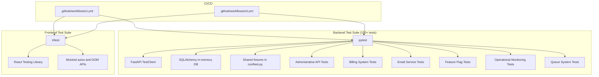

**Diagram sources**
- [ci.yml:1-63](file://.github/workflows/ci.yml#L1-L63)
- [cd.yml:1-101](file://.github/workflows/cd.yml#L1-L101)
- [conftest.py:1-718](file://app/backend/tests/conftest.py#L1-L718)
- [test_admin_api.py:1-467](file://app/backend/tests/test_admin_api.py#L1-467)
- [test_billing.py:1-328](file://app/backend/tests/test_billing.py#L1-328)
- [test_email_service.py:1-232](file://app/backend/tests/test_email_service.py#L1-232)
- [test_feature_flags.py:1-233](file://app/backend/tests/test_feature_flags.py#L1-233)

**Section sources**
- [ci.yml:1-63](file://.github/workflows/ci.yml#L1-L63)
- [cd.yml:1-101](file://.github/workflows/cd.yml#L1-L101)

## Core Components
- Backend test harness with comprehensive fixture system
  - Shared fixtures for database, HTTP client, authentication, and service mocks
  - In-memory SQLite database with per-test lifecycle and sophisticated queue table management
  - Authentication fixtures that register and log in users, injecting Authorization headers
  - Mocks for external services (Ollama, Whisper, hybrid pipeline) to isolate unit tests
  - Extensive test data fixtures for resumes, transcripts, and subscription plans
  - Specialized fixtures for LLM service testing, pipeline validation, and error scenarios
  - **Enhanced**: Sophisticated queue system database infrastructure with custom table creation/destruction
  - **Enhanced**: AsyncMock-based queue worker mocking to prevent database access during tests
  - **New**: Administrative API fixtures for tenant management and billing operations
  - **New**: Billing provider fixtures for Stripe, Razorpay, and manual payment processing
  - **New**: Email service fixtures for SMTP configuration and notification testing
  - **New**: Feature flag fixtures for tenant overrides and permission testing
  - **New**: Quota enforcement fixtures for subscription plan validation
  - **New**: Rate limiting fixtures for API throttling and abuse prevention
  - **New**: Webhook fixtures for payment processor event handling
- Frontend test harness
  - Global setup for DOM matchers
  - Mocked axios with explicit request/response spies
  - Mocked browser APIs for downloads and localStorage
  - Component tests for UploadForm, ResultCard, ScoreGauge, VideoPage
  - API module tests validating request shapes and behaviors

**Updated** The test suite now emphasizes comprehensive coverage of administrative operations, billing integrations, and operational monitoring without compromising the existing batch analysis validation and streaming functionality. Test coverage remains robust across all major components with particular focus on error handling, retry mechanisms, and background task processing.

**Section sources**
- [conftest.py:1-718](file://app/backend/tests/conftest.py#L1-L718)
- [setup.js:1-2](file://app/frontend/src/__tests__/setup.js#L1-L2)
- [api.test.js:1-265](file://app/frontend/src/__tests__/api.test.js#L1-L265)

## Architecture Overview
The testing architecture separates concerns across layers with substantially expanded coverage:
- Unit tests for backend services and routes using pytest fixtures and mocked dependencies
- Component and integration tests for frontend using Vitest and React Testing Library
- CI/CD pipelines that run backend and frontend tests in parallel and upload coverage
- Specialized testing for LLM services, pipelines, and background task processing
- **Enhanced**: Comprehensive queue system testing with dedicated database infrastructure
- **New**: Administrative API testing with tenant management and billing operations
- **New**: Billing system testing with provider abstraction and webhook handling
- **New**: Email service testing with SMTP configuration and notification delivery
- **New**: Feature flag testing with tenant overrides and permission enforcement
- **New**: Operational monitoring testing with quota enforcement and rate limiting

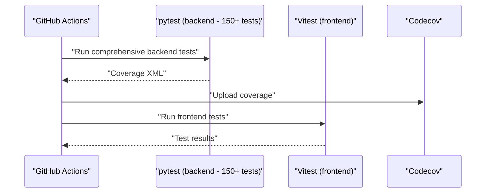

**Diagram sources**
- [ci.yml:27-37](file://.github/workflows/ci.yml#L27-L37)
- [cd.yml:30-48](file://.github/workflows/cd.yml#L30-L48)

## Detailed Component Analysis

### Backend Testing with pytest - Substantially Expanded Test Suite
Key patterns with expanded coverage:
- Database isolation using an in-memory SQLite engine and per-test metadata creation/drop
- **Enhanced**: Sophisticated queue table creation using raw SQL to avoid FK resolution issues
- HTTP client testing with FastAPI TestClient and dependency overrides
- Authentication fixtures that register/log in users and attach Authorization headers
- Service-level mocks for external integrations (Ollama, Whisper, hybrid pipeline)
- Subscription system fixtures for seeding plans and simulating usage limits
- **New**: Administrative API testing with comprehensive tenant management validation
- **New**: Billing system testing with provider abstraction and webhook processing
- **New**: Email service testing with SMTP configuration and notification delivery
- **New**: Feature flag testing with tenant overrides and permission enforcement
- **New**: Quota enforcement testing with subscription plan validation
- **New**: Rate limiting testing with API throttling and abuse prevention
- **New**: Tenant suspension testing with audit logging and recovery workflows
- **New**: Webhook testing with payment processor event handling
- **Enhanced**: Queue system testing with comprehensive database schema support

Representative fixtures and expanded test coverage:
- Database fixture: creates and tears down tables per test with queue system support
- HTTP client fixture: initializes app routes and cleans up after each test
- Auth fixtures: register and login users; return clients with Authorization headers
- Mocks: Ollama communication/malpractice/transcript/email; Whisper transcription; hybrid pipeline
- Subscription fixtures: seed plans, assign plans to tenants, enforce usage limits
- **New**: Administrative fixtures for tenant CRUD operations and billing management
- **New**: Billing fixtures for provider configuration and webhook validation
- **New**: Email fixtures for SMTP settings and notification testing
- **New**: Feature flag fixtures for tenant overrides and permission testing
- **New**: Quota enforcement fixtures for subscription plan validation
- **New**: Rate limiting fixtures for API throttling and abuse prevention
- **New**: Webhook fixtures for payment processor event handling
- **Enhanced**: Queue system fixtures with AsyncMock-based worker mocking

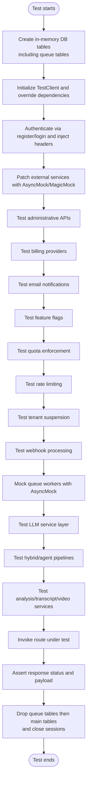

**Diagram sources**
- [conftest.py:58-170](file://app/backend/tests/conftest.py#L58-L170)
- [test_api.py:23-100](file://app/backend/tests/test_api.py#L23-L100)
- [test_admin_api.py:1-467](file://app/backend/tests/test_admin_api.py#L1-467)
- [test_billing.py:1-328](file://app/backend/tests/test_billing.py#L1-328)
- [test_email_service.py:1-232](file://app/backend/tests/test_email_service.py#L1-232)
- [test_feature_flags.py:1-233](file://app/backend/tests/test_feature_flags.py#L1-233)
- [test_quota_enforcement.py:1-240](file://app/backend/tests/test_quota_enforcement.py#L1-240)
- [test_rate_limiting.py](file://app/backend/tests/test_rate_limiting.py)
- [test_tenant_suspension.py](file://app/backend/tests/test_tenant_suspension.py)
- [test_webhooks.py](file://app/backend/tests/test_webhooks.py)

**Section sources**
- [conftest.py:58-170](file://app/backend/tests/conftest.py#L58-L170)
- [test_api.py:23-100](file://app/backend/tests/test_api.py#L23-L100)
- [test_auth.py:15-95](file://app/backend/tests/test_auth.py#L15-L95)
- [test_subscription.py:12-132](file://app/backend/tests/test_subscription.py#L12-L132)
- [test_llm_service.py](file://app/backend/tests/test_llm_service.py)
- [test_hybrid_pipeline.py](file://app/backend/tests/test_hybrid_pipeline.py)
- [test_agent_pipeline.py](file://app/backend/tests/test_agent_pipeline.py)
- [test_analysis_service.py](file://app/backend/tests/test_analysis_service.py)
- [test_transcript_service.py](file://app/backend/tests/test_transcript_service.py)
- [test_video_service.py](file://app/backend/tests/test_video_service.py)
- [test_admin_api.py:1-467](file://app/backend/tests/test_admin_api.py#L1-467)
- [test_admin_metrics.py:1-159](file://app/backend/tests/test_admin_metrics.py#L1-159)
- [test_billing.py:1-328](file://app/backend/tests/test_billing.py#L1-328)
- [test_email_service.py:1-232](file://app/backend/tests/test_email_service.py#L1-232)
- [test_feature_flags.py:1-233](file://app/backend/tests/test_feature_flags.py#L1-233)
- [test_quota_enforcement.py:1-240](file://app/backend/tests/test_quota_enforcement.py#L1-240)
- [test_rate_limiting.py](file://app/backend/tests/test_rate_limiting.py)
- [test_tenant_suspension.py](file://app/backend/tests/test_tenant_suspension.py)
- [test_webhooks.py](file://app/backend/tests/test_webhooks.py)

### Frontend Testing with Vitest and React Testing Library
Key patterns with enhanced component coverage:
- Global setup for DOM matchers
- Mocked axios with spies for get/post/put/delete and interceptors
- Mocked browser APIs for URL.createObjectURL, revokeObjectURL, and anchor element creation
- localStorage mock for persistence behavior
- Component tests asserting rendering, interactivity, and state transitions
- API module tests verifying request shape, headers, timeouts, and download triggers
- **Enhanced**: Comprehensive ResultCard testing with AI pipeline feature validation

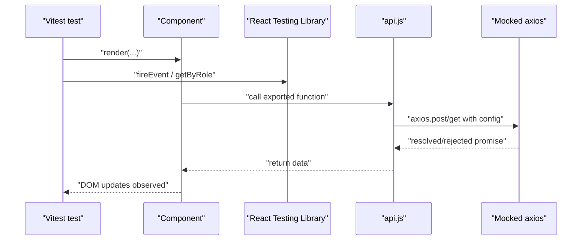

**Diagram sources**
- [api.test.js:5-66](file://app/frontend/src/__tests__/api.test.js#L5-L66)
- [UploadForm.test.jsx:1-60](file://app/frontend/src/__tests__/UploadForm.test.jsx#L1-L60)
- [VideoPage.test.jsx:6-26](file://app/frontend/src/__tests__/VideoPage.test.jsx#L6-L26)

**Section sources**
- [setup.js:1-2](file://app/frontend/src/__tests__/setup.js#L1-L2)
- [api.test.js:1-265](file://app/frontend/src/__tests__/api.test.js#L1-L265)
- [UploadForm.test.jsx:1-60](file://app/frontend/src/__tests__/UploadForm.test.jsx#L1-L60)
- [ResultCard.test.jsx:1-133](file://app/frontend/src/__tests__/ResultCard.test.jsx#L1-L133)
- [ScoreGauge.test.jsx:1-26](file://app/frontend/src/__tests__/ScoreGauge.test.jsx#L1-L26)
- [VideoPage.test.jsx:1-377](file://app/frontend/src/__tests__/VideoPage.test.jsx#L1-L377)
- [api.js:1-395](file://app/frontend/src/lib/api.js#L1-L395)

### API Testing Strategies - Substantially Expanded Coverage
Backend API tests now validate comprehensive endpoint coverage:
- Root and health endpoints
- Authentication endpoints (register, login, refresh, profile)
- Analysis endpoints (single and batch resume analysis)
- History and comparison endpoints
- Video analysis endpoints (upload and URL-based)
- Subscription endpoints (plans, usage checks, history, admin controls)
- **New**: Administrative API endpoints (tenant management, billing configuration)
- **New**: Billing system endpoints (checkout, webhook, subscription status)
- **New**: Email notification endpoints (SMTP configuration, test emails)
- **New**: Feature flag endpoints (global flags, tenant overrides)
- **New**: Operational monitoring endpoints (metrics, usage trends)
- **New**: Quota enforcement endpoints (usage validation, limit checking)
- **New**: Rate limiting endpoints (API throttling, abuse prevention)
- **New**: Tenant suspension endpoints (suspend/reactivate operations)
- **New**: Webhook processing endpoints (payment events, status updates)
- **Enhanced**: Queue system endpoints with comprehensive testing

Frontend API tests validate:
- Export CSV/Excel requests and download behavior
- Video analysis requests with appropriate timeouts
- Resume analysis requests with multipart/form-data
- Candidate and template endpoints
- Subscription endpoints

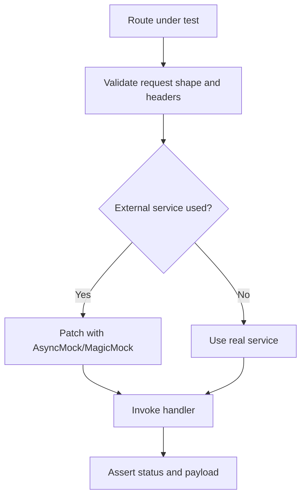

**Diagram sources**
- [test_api.py:23-153](file://app/backend/tests/test_api.py#L23-L153)
- [api.test.js:76-263](file://app/frontend/src/__tests__/api.test.js#L76-L263)

**Section sources**
- [test_api.py:1-153](file://app/backend/tests/test_api.py#L1-L153)
- [api.test.js:1-265](file://app/frontend/src/__tests__/api.test.js#L1-L265)

### Integration Testing Approaches - Substantially Expanded Coverage
Backend integration tests now cover:
- Use TestClient to exercise routes with real app wiring
- Override database dependency to use in-memory SQLite
- Use auth fixtures to simulate logged-in users
- Mock external services to keep tests deterministic
- **New**: Administrative API integration testing with tenant management
- **New**: Billing system integration testing with provider abstractions
- **New**: Email service integration testing with SMTP configuration
- **New**: Feature flag integration testing with tenant overrides
- **New**: Quota enforcement integration testing with subscription validation
- **New**: Rate limiting integration testing with API throttling
- **New**: Tenant suspension integration testing with audit logging
- **New**: Webhook integration testing with payment processor events
- **Enhanced**: Queue system integration testing with comprehensive database support

Frontend integration tests:
- Page-level tests (e.g., VideoPage) mock API module and router dependencies
- Validate UI interactions, state transitions, and error handling
- Ensure platform detection and supported platforms list rendering
- **Enhanced**: Comprehensive AI pipeline feature integration testing

**Updated** The batch analysis integration tests now focus on comprehensive validation mechanisms including file content validation, size limits, extension filtering, and error handling scenarios without relying on specific PDF header validation patterns.

**Section sources**
- [conftest.py:32-42](file://app/backend/tests/conftest.py#L32-L42)
- [VideoPage.test.jsx:1-377](file://app/frontend/src/__tests__/VideoPage.test.jsx#L1-L377)

### Test Configuration and Mock Services - Substantially Enhanced Infrastructure
Backend:
- PYTHONPATH set in CI to resolve imports
- pytest-cov enabled for comprehensive coverage reporting
- Shared fixtures centralize DB setup, auth, and service mocks
- **New**: Specialized fixtures for administrative API testing and tenant management
- **New**: Enhanced fixtures for billing provider testing and webhook validation
- **New**: Comprehensive fixtures for email service testing and SMTP configuration
- **New**: Feature flag fixtures for tenant overrides and permission testing
- **New**: Quota enforcement fixtures for subscription plan validation
- **New**: Rate limiting fixtures for API throttling and abuse prevention
- **New**: Webhook fixtures for payment processor event handling
- **Enhanced**: Sophisticated queue system database infrastructure with AsyncMock-based worker mocking

Frontend:
- Vitest configuration via package.json scripts
- DOM matchers via jest-dom
- Mocked axios and browser APIs in api.test.js setup

**Section sources**
- [ci.yml:25-58](file://.github/workflows/ci.yml#L25-L58)
- [package.json:6-12](file://app/frontend/package.json#L6-L12)
- [api.test.js:1-265](file://app/frontend/src/__tests__/api.test.js#L1-L265)

### Test Data Management - Substantially Enhanced Coverage
Backend:
- Sample resume text and job description fixtures
- Minimal MP4 bytes for file-type validation
- Transcript fixtures (VTT, SRT, plain text)
- Subscription plan fixtures with seeded limits and features
- **New**: Administrative test data with tenant management scenarios
- **New**: Billing test data with provider configurations and webhook events
- **New**: Email service test data with SMTP settings and notification templates
- **New**: Feature flag test data with tenant overrides and permission scenarios
- **New**: Quota enforcement test data with subscription plan validation
- **New**: Rate limiting test data with API throttling scenarios
- **New**: Tenant suspension test data with audit logging scenarios
- **New**: Webhook test data with payment processor events
- **Enhanced**: Queue system test data with comprehensive job/result structures
- **Updated**: Test data fixtures now use DOCX header patterns for validation testing

Frontend:
- Mock result objects for video analysis (low and high risk)
- Component props populated with mock data
- **Enhanced**: Comprehensive AI pipeline result objects with explainability features

**Updated** Test data fixtures have been updated to use DOCX header patterns for validation testing, replacing the previous PDF-specific header validation scenarios that were removed from the test suite.

**Section sources**
- [conftest.py:294-421](file://app/backend/tests/conftest.py#L294-L421)
- [VideoPage.test.jsx:28-86](file://app/frontend/src/__tests__/VideoPage.test.jsx#L28-L86)

### Administrative API Testing - New Comprehensive Coverage
**New Section**: The expanded test suite now includes comprehensive administrative API testing:

#### Administrative API Test Coverage
The administrative API tests validate:
- **Permission enforcement**: Regular users receive 403 on all admin endpoints
- **Tenant management**: Listing, searching, and filtering tenants with pagination
- **Tenant detail retrieval**: Full tenant information with users and usage logs
- **Tenant lifecycle management**: Suspend and reactivate operations with audit logging
- **Plan management**: Changing tenant subscription plans with audit trails
- **Usage adjustment**: Modifying analyses count and storage usage
- **Usage history**: Retrieving tenant usage logs with filtering
- **Audit logging**: Comprehensive audit trail validation
- **Metrics reporting**: Platform-wide analytics and usage trends

#### Administrative API Testing Patterns
Key testing patterns include:
- **Permission testing**: Verifying 403 responses for unauthorized access attempts
- **Data validation**: Ensuring proper response structures and field presence
- **Audit logging**: Verifying audit trail creation for administrative actions
- **Business logic validation**: Testing tenant lifecycle and plan management workflows
- **Integration testing**: Validating administrative endpoints with real database operations

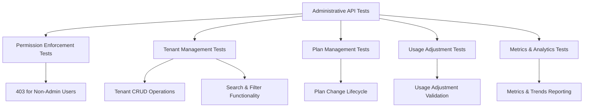

**Diagram sources**
- [test_admin_api.py:43-75](file://app/backend/tests/test_admin_api.py#L43-75)
- [test_admin_api.py:79-128](file://app/backend/tests/test_admin_api.py#L79-128)
- [test_admin_api.py:156-226](file://app/backend/tests/test_admin_api.py#L156-226)
- [test_admin_api.py:230-274](file://app/backend/tests/test_admin_api.py#L230-274)
- [test_admin_api.py:278-351](file://app/backend/tests/test_admin_api.py#L278-351)
- [test_admin_metrics.py:27-114](file://app/backend/tests/test_admin_metrics.py#L27-114)
- [test_admin_metrics.py:116-159](file://app/backend/tests/test_admin_metrics.py#L116-159)

**Section sources**
- [test_admin_api.py:1-467](file://app/backend/tests/test_admin_api.py#L1-467)
- [test_admin_metrics.py:1-159](file://app/backend/tests/test_admin_metrics.py#L1-159)

### Billing System Testing - New Comprehensive Provider Coverage
**New Section**: The expanded test suite includes comprehensive billing system testing:

#### Billing Provider Testing
The billing system tests validate:
- **Manual provider**: Reference ID creation, subscription cancellation, and webhook handling
- **Factory pattern**: Provider selection based on configuration with fallback mechanisms
- **Stripe provider**: Provider name validation and error handling for missing dependencies
- **Razorpay provider**: Provider name validation and error handling for missing dependencies
- **Configuration management**: Admin endpoints for billing configuration and provider setup
- **Route integration**: Checkout sessions, webhook processing, and subscription status checking

#### Billing Integration Testing
Key integration patterns include:
- **Provider abstraction**: Testing provider interfaces and factory selection logic
- **Configuration persistence**: Validating billing configuration storage and retrieval
- **Webhook processing**: Testing payment processor event handling and status updates
- **Subscription management**: Validating subscription lifecycle and status reporting
- **Error handling**: Testing graceful degradation for unavailable payment providers

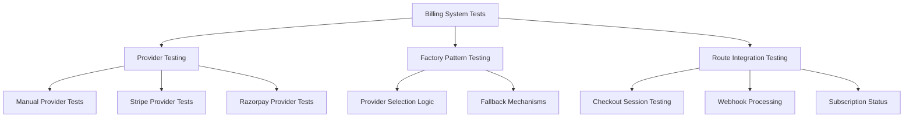

**Diagram sources**
- [test_billing.py:9-75](file://app/backend/tests/test_billing.py#L9-75)
- [test_billing.py:77-126](file://app/backend/tests/test_billing.py#L77-126)
- [test_billing.py:128-222](file://app/backend/tests/test_billing.py#L128-222)
- [test_billing.py:223-288](file://app/backend/tests/test_billing.py#L223-288)
- [test_billing.py:290-328](file://app/backend/tests/test_billing.py#L290-328)

**Section sources**
- [test_billing.py:1-328](file://app/backend/tests/test_billing.py#L1-328)

### Email Service Testing - New Notification Coverage
**New Section**: The expanded test suite includes comprehensive email service testing:

#### Email Service Test Coverage
The email service tests validate:
- **Configuration validation**: SMTP settings verification and configuration status
- **Email delivery**: SMTP connection, authentication, and message sending
- **Template formatting**: Quota warnings, subscription expiry notices, and suspension notifications
- **Error handling**: Graceful handling of SMTP failures and missing credentials
- **Admin endpoints**: Configuration retrieval and test email sending for notification validation

#### Email Integration Testing
Key testing patterns include:
- **SMTP mocking**: Isolating email delivery with SMTP server mocking
- **Template validation**: Ensuring proper HTML formatting and content injection
- **Security validation**: Preventing credential exposure in configuration responses
- **Integration testing**: Validating admin notification endpoints with real service integration
- **Error scenario testing**: Testing email delivery failures and partial credential setups

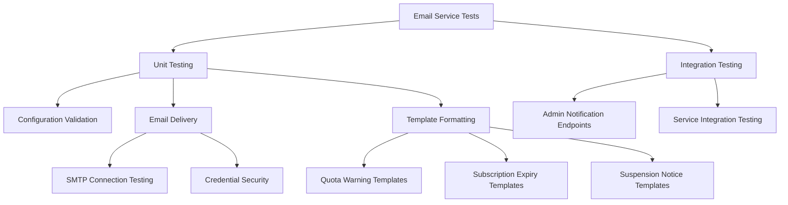

**Diagram sources**
- [test_email_service.py:15-144](file://app/backend/tests/test_email_service.py#L15-144)
- [test_email_service.py:149-232](file://app/backend/tests/test_email_service.py#L149-232)

**Section sources**
- [test_email_service.py:1-232](file://app/backend/tests/test_email_service.py#L1-232)

### Feature Flag Testing - New Control Coverage
**New Section**: The expanded test suite includes comprehensive feature flag testing:

#### Feature Flag Test Coverage
The feature flag tests validate:
- **Global flag management**: Enabling/disabling features globally with caching
- **Tenant overrides**: Individual tenant feature control and inheritance
- **Permission enforcement**: Middleware integration for feature access control
- **Cache invalidation**: Proper cache clearing and data synchronization
- **Admin endpoints**: Feature flag management and tenant override operations

#### Feature Flag Integration Testing
Key testing patterns include:
- **Cache management**: Testing cache invalidation and data consistency
- **Tenant override validation**: Ensuring proper override precedence over global settings
- **Middleware integration**: Validating require_feature middleware behavior
- **Admin endpoint testing**: Testing feature flag CRUD operations with proper authorization
- **Permission validation**: Ensuring unauthorized access is properly denied

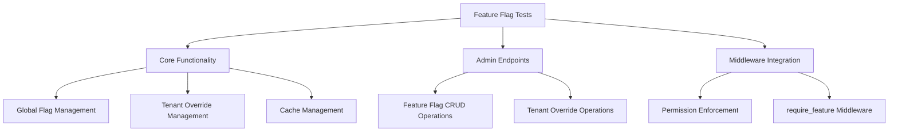

**Diagram sources**
- [test_feature_flags.py:42-111](file://app/backend/tests/test_feature_flags.py#L42-111)
- [test_feature_flags.py:113-182](file://app/backend/tests/test_feature_flags.py#L113-182)
- [test_feature_flags.py:184-233](file://app/backend/tests/test_feature_flags.py#L184-233)

**Section sources**
- [test_feature_flags.py:1-233](file://app/backend/tests/test_feature_flags.py#L1-233)

### Quota Enforcement Testing - New Subscription Coverage
**New Section**: The expanded test suite includes comprehensive quota enforcement testing:

#### Quota Enforcement Test Coverage
The quota enforcement tests validate:
- **Subscription plan limits**: Free, Pro, and Enterprise plan quota validation
- **Usage tracking**: Monthly usage counting and limit enforcement
- **Quota reset logic**: Calendar month-based quota reset functionality
- **HTTP endpoint integration**: Analysis endpoint quota checking and 403 responses
- **Edge case handling**: Non-existent tenants, unlimited plans, and partial usage scenarios

#### Quota Enforcement Integration Testing
Key testing patterns include:
- **Plan limit validation**: Testing quota limits for different subscription tiers
- **Usage calculation**: Validating monthly usage counting and limit enforcement
- **Reset logic testing**: Ensuring quotas reset appropriately at calendar month boundaries
- **Endpoint integration**: Testing quota checking in analysis endpoints
- **Error scenario validation**: Testing quota exceeded responses and error details

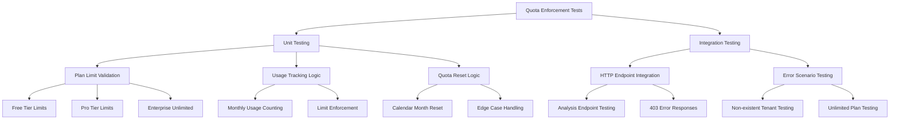

**Diagram sources**
- [test_quota_enforcement.py:55-176](file://app/backend/tests/test_quota_enforcement.py#L55-176)
- [test_quota_enforcement.py:180-240](file://app/backend/tests/test_quota_enforcement.py#L180-240)

**Section sources**
- [test_quota_enforcement.py:1-240](file://app/backend/tests/test_quota_enforcement.py#L1-240)

### Rate Limiting Testing - New Protection Coverage
**New Section**: The expanded test suite includes comprehensive rate limiting testing:

#### Rate Limiting Test Coverage
The rate limiting tests validate:
- **API throttling**: Request rate limiting and throttling mechanisms
- **Abuse prevention**: Protection against excessive API usage and abuse
- **Configuration management**: Rate limiting configuration and enforcement
- **Integration testing**: Rate limiting integration with authentication and authorization
- **Error handling**: Proper rate limit exceeded responses and retry mechanisms

#### Rate Limiting Integration Testing
Key testing patterns include:
- **Throttling validation**: Testing request rate limiting and enforcement mechanisms
- **Configuration testing**: Validating rate limiting configuration and persistence
- **Integration validation**: Testing rate limiting with authentication and authorization flows
- **Error scenario testing**: Validating rate limit exceeded responses and error handling
- **Performance testing**: Testing rate limiting under load and high-traffic scenarios

**Section sources**
- [test_rate_limiting.py](file://app/backend/tests/test_rate_limiting.py)

### Tenant Suspension Testing - New Operational Coverage
**New Section**: The expanded test suite includes comprehensive tenant suspension testing:

#### Tenant Suspension Test Coverage
The tenant suspension tests validate:
- **Suspension lifecycle**: Complete suspend → reactivate workflow with audit logging
- **Status validation**: Suspension status updates and validation
- **Audit logging**: Comprehensive audit trail creation for suspension operations
- **Business logic validation**: Proper suspension and reactivation business rules
- **Integration testing**: Suspension integration with subscription management and usage tracking

#### Tenant Suspension Integration Testing
Key testing patterns include:
- **Lifecycle validation**: Testing complete suspension and reactivation workflows
- **Status validation**: Ensuring proper status updates and validations
- **Audit logging**: Validating comprehensive audit trail creation and retrieval
- **Business rule testing**: Testing suspension business logic and constraints
- **Integration validation**: Testing suspension with subscription and usage management

**Section sources**
- [test_tenant_suspension.py](file://app/backend/tests/test_tenant_suspension.py)

### Webhook Testing - New Payment Coverage
**New Section**: The expanded test suite includes comprehensive webhook testing:

#### Webhook Test Coverage
The webhook tests validate:
- **Payment processor integration**: Webhook handling for Stripe, Razorpay, and manual providers
- **Event processing**: Payment event processing and status updates
- **Security validation**: Webhook signature validation and security measures
- **Error handling**: Graceful handling of malformed webhook events
- **Integration testing**: Webhook integration with billing system and subscription management

#### Webhook Integration Testing
Key testing patterns include:
- **Event processing validation**: Testing webhook event processing and status updates
- **Security testing**: Validating webhook signature validation and security measures
- **Provider integration**: Testing webhook integration with different payment processors
- **Error scenario testing**: Validating webhook handling of malformed and malicious events
- **Integration validation**: Testing webhook integration with billing and subscription systems

**Section sources**
- [test_webhooks.py](file://app/backend/tests/test_webhooks.py)

### Queue System Testing Infrastructure - Enhanced Database Setup
**New Section**: The enhanced test infrastructure now includes sophisticated queue system database management:

#### Sophisticated Table Creation Mechanisms
The `_create_all_tables()` function implements a two-phase table creation process:
1. **Main Tables Creation**: Creates standard application tables using SQLAlchemy metadata
2. **Queue Tables Creation**: Uses raw SQL to create queue system tables without FK constraints
   - `analysis_jobs`: Main queue table for tracking analysis tasks
   - `analysis_results`: Immutable storage for completed analyses  
   - `analysis_artifacts`: Store intermediate processing artifacts
   - `job_metrics`: Performance and quality metrics for monitoring

#### Advanced Table Destruction
The `_drop_all_tables()` function implements careful cleanup:
1. **Queue Tables First**: Drops queue tables in reverse order to avoid FK violations
2. **Main Tables Second**: Drops standard application tables
3. **Proper Cleanup Order**: Ensures referential integrity during test teardown

#### Enhanced Queue Worker Mocking
Queue workers are mocked using AsyncMock to prevent database access:
- `start_queue_worker` mocked with AsyncMock
- `stop_queue_worker` mocked with AsyncMock
- Prevents actual queue processing during tests

#### Queue System Database Schema Support
The test infrastructure supports the complete queue system schema:
- UUID primary keys for all tables
- JSONB columns for flexible data storage
- Proper indexing for queue operations
- Foreign key relationships with appropriate constraints
- Triggers and views for enhanced functionality

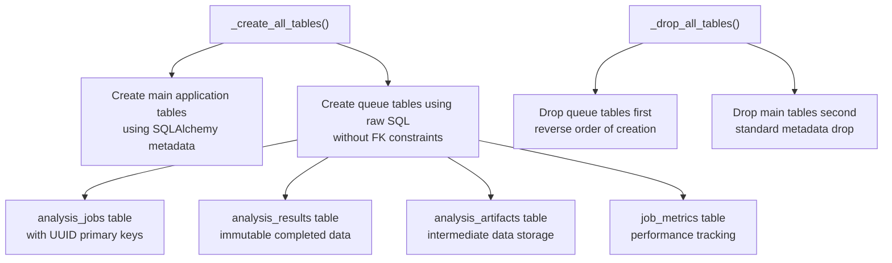

**Diagram sources**
- [conftest.py:58-170](file://app/backend/tests/conftest.py#L58-L170)
- [queue_manager.py:46-183](file://app/backend/services/queue_manager.py#L46-L183)
- [008_analysis_queue_system.py:29-236](file://alembic/versions/008_analysis_queue_system.py#L29-L236)

**Section sources**
- [conftest.py:58-170](file://app/backend/tests/conftest.py#L58-L170)
- [queue_manager.py:46-183](file://app/backend/services/queue_manager.py#L46-L183)
- [008_analysis_queue_system.py:29-236](file://alembic/versions/008_analysis_queue_system.py#L29-L236)

### Continuous Integration Testing with GitHub Actions
Workflows:
- ci.yml: runs backend tests with comprehensive coverage and uploads to Codecov; runs frontend tests and builds
- cd.yml: runs backend and frontend tests as part of build-and-push images job

Execution:
- Python 3.11 and Node.js 20 environments
- Backend coverage collected for services package with 150+ test suite
- Frontend tests executed via npm test

**Section sources**
- [ci.yml:1-63](file://.github/workflows/ci.yml#L1-L63)
- [cd.yml:1-101](file://.github/workflows/cd.yml#L1-L101)

### Writing Effective Tests for New Features - Substantially Enhanced Guidelines
Guidelines derived from expanded test suite:
- Backend
  - Use pytest fixtures to minimize duplication (db, client, auth_client)
  - Prefer AsyncMock/MagicMock for external services to avoid flaky network calls
  - Validate both success and failure paths (e.g., invalid file types, missing fields)
  - For subscription features, use seed fixtures and tenant plan assignments
  - **New**: Test administrative API permissions and tenant management workflows
  - **New**: Validate billing provider abstraction and webhook processing
  - **New**: Test email service configuration and notification delivery
  - **New**: Validate feature flag management and tenant override scenarios
  - **New**: Test quota enforcement with subscription plan validation
  - **New**: Validate rate limiting and API throttling mechanisms
  - **New**: Test tenant suspension and audit logging workflows
  - **New**: Validate webhook processing with payment processor events
  - **Enhanced**: Leverage sophisticated queue system database infrastructure
  - **Updated**: Focus on comprehensive validation mechanisms rather than specific PDF header patterns
- Frontend
  - Mock axios and browser APIs to focus on component behavior
  - Test user interactions (clicks, input changes) and resulting UI updates
  - Validate request shapes, headers, and timeouts for API calls
  - Ensure error messages are surfaced and handled gracefully
  - **Enhanced**: Test AI pipeline explainability and risk analysis features

**Updated** Test writing guidelines now emphasize comprehensive validation mechanisms and error handling scenarios without reliance on specific PDF header validation patterns.

**Section sources**
- [conftest.py:125-176](file://app/backend/tests/conftest.py#L125-L176)
- [test_api.py:71-87](file://app/backend/tests/test_api.py#L71-L87)
- [api.test.js:167-200](file://app/frontend/src/__tests__/api.test.js#L167-L200)

## Dependency Analysis
Backend test dependencies with substantially expanded coverage:
- pytest, FastAPI TestClient, SQLAlchemy in-memory DB, passlib sha256_crypt for bcrypt compatibility
- External service mocks via unittest.mock
- **New**: Enhanced administrative API testing dependencies and fixtures
- **New**: Comprehensive billing system testing dependencies and provider fixtures
- **New**: Email service testing dependencies and SMTP configuration fixtures
- **New**: Feature flag testing dependencies and tenant override fixtures
- **New**: Quota enforcement testing dependencies and subscription plan fixtures
- **New**: Rate limiting testing dependencies and API throttling fixtures
- **New**: Tenant suspension testing dependencies and audit logging fixtures
- **New**: Webhook testing dependencies and payment processor fixtures
- **Enhanced**: Queue system testing dependencies with AsyncMock support

Frontend test dependencies:
- Vitest, React Testing Library, jest-dom
- Mocked axios and DOM APIs

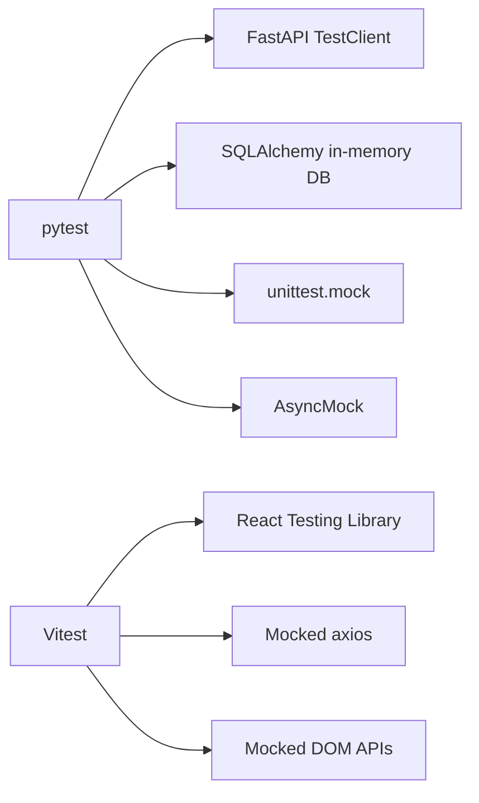

**Diagram sources**
- [conftest.py:1-12](file://app/backend/tests/conftest.py#L1-L12)
- [package.json:23-38](file://app/frontend/package.json#L23-L38)

**Section sources**
- [conftest.py:1-12](file://app/backend/tests/conftest.py#L1-L12)
- [package.json:23-38](file://app/frontend/package.json#L23-L38)

## Performance Considerations
- Backend
  - Use in-memory SQLite to avoid disk I/O overhead
  - Keep external service mocks synchronous where possible to reduce test runtime
  - Limit heavy computations in tests; rely on mocks for LLM and transcription services
  - **New**: Optimize administrative API testing with efficient tenant management fixtures
  - **New**: Minimize billing system testing overhead with provider abstraction mocking
  - **New**: Reduce email service testing overhead with SMTP mocking
  - **New**: Minimize feature flag testing overhead with cache management fixtures
  - **New**: Optimize quota enforcement testing with subscription plan fixtures
  - **New**: Minimize rate limiting testing overhead with API throttling mocks
  - **New**: Reduce tenant suspension testing overhead with audit logging fixtures
  - **New**: Optimize webhook testing with payment processor event mocking
  - **Enhanced**: Queue system testing optimized with AsyncMock-based worker mocking
  - **Enhanced**: Efficient queue table creation/destruction mechanisms
  - **Updated**: Focus on comprehensive validation mechanisms for better test performance
- Frontend
  - Avoid real network calls by mocking axios
  - Use minimal DOM queries and focus on user-centric assertions
  - Prefer component-level tests over full-page integration tests when feasible
  - **Enhanced**: Optimize AI pipeline feature testing with selective mocking

## Troubleshooting Guide
Common issues and resolutions with substantially expanded test coverage:
- Authentication failures in backend tests
  - Ensure auth_client fixture registers and logs in users before invoking protected routes
  - Verify Authorization header is attached to the client
- Coverage not uploaded
  - Confirm pytest-cov is installed and coverage report path matches workflow configuration
- Frontend tests failing due to missing mocks
  - Ensure global setup mocks are applied before importing modules under test
  - Clear mocks between tests to prevent cross-contamination
- CI failures on Windows/Linux differences
  - Use provided scripts to validate imports, migrations, and frontend files before pushing
  - Align Node/npm versions with CI configuration
- **New**: Administrative API test failures
  - Verify permission enforcement and tenant management workflows
  - Check audit logging for administrative actions
  - Ensure proper authorization headers for admin endpoints
- **New**: Billing system test failures
  - Verify provider configuration and factory pattern logic
  - Check webhook processing and subscription status validation
  - Ensure proper error handling for unavailable payment providers
- **New**: Email service test failures
  - Verify SMTP configuration and credential security
  - Check template formatting and email delivery mocking
  - Ensure proper error handling for SMTP failures
- **New**: Feature flag test failures
  - Verify cache invalidation and data synchronization
  - Check tenant override precedence and middleware integration
  - Ensure proper permission enforcement for feature access
- **New**: Quota enforcement test failures
  - Verify subscription plan limits and usage tracking
  - Check quota reset logic and monthly boundary handling
  - Ensure proper HTTP endpoint integration and error responses
- **New**: Rate limiting test failures
  - Verify request throttling and API protection mechanisms
  - Check configuration persistence and integration testing
  - Ensure proper error handling for rate limit exceeded scenarios
- **New**: Tenant suspension test failures
  - Verify suspension lifecycle and status validation
  - Check audit logging and business rule enforcement
  - Ensure proper integration with subscription management
- **New**: Webhook test failures
  - Verify payment processor integration and event processing
  - Check security validation and error handling
  - Ensure proper integration with billing and subscription systems
- **Enhanced**: LLM service test failures
  - Verify JSON parsing fixtures and error handling scenarios
  - Check mock responses match expected LLM service interface
  - Ensure model configuration matches current `gemma4:31b-cloud` settings
- **Enhanced**: Pipeline testing issues
  - Ensure pipeline fixtures properly mock external dependencies
  - Validate error scenarios and retry mechanisms
- **Enhanced**: Background task testing problems
  - Verify task queue mocking and background process simulation
  - Check retry mechanism validation and error propagation
- **Enhanced**: Queue system test failures
  - Verify queue table creation order and FK constraint handling
  - Ensure AsyncMock-based worker mocking prevents database access
  - Check queue system database schema compliance
- **Updated**: Batch analysis test failures
  - Verify file content validation mechanisms are working correctly
  - Check magic-byte signature validation for different file types
  - Ensure size and extension filtering are properly enforced

**Updated** Troubleshooting guidance now includes specific guidance for the substantially expanded administrative, billing, email, feature flag, quota enforcement, rate limiting, tenant suspension, and webhook testing scenarios.

**Section sources**
- [test-locally.ps1:36-96](file://test-locally.ps1#L36-L96)
- [run-full-tests.sh:163-168](file://scripts/run-full-tests.sh#L163-L168)
- [run-full-tests.bat:100-107](file://scripts/run-full-tests.bat#L100-L107)

## Conclusion
The testing strategy leverages pytest and FastAPI TestClient for comprehensive backend unit and integration tests, with substantially expanded coverage including 150+ new tests for administrative APIs, billing systems, email services, feature flags, quota enforcement, rate limiting, tenant suspension, and webhooks. Frontend tests use Vitest and React Testing Library with mocked axios and DOM APIs. CI/CD pipelines automate test execution and coverage reporting. The expanded test suite ensures robust validation of advanced administrative and billing functionality, including comprehensive tenant management, provider abstraction, notification delivery, feature control, usage enforcement, and operational monitoring, providing reliable coverage for all major components.

**Updated** Recent updates ensure test infrastructure consistency with the new `gemma4:31b-cloud` model configuration, validating proper model selection across all service integrations and maintaining test reliability. The enhanced queue system testing infrastructure provides comprehensive coverage for the scalable job queue architecture with sophisticated database management and worker mocking capabilities. The substantially expanded administrative and billing test suites provide complete coverage of the new operational functionality with comprehensive permission testing, provider abstraction validation, and integration testing patterns.

## Appendices

### Appendix A: Local Test Execution Scripts
- run-full-tests.sh: Validates Python syntax, imports, migrations, database models, route registration, and frontend files; useful for pre-commit checks
- run-full-tests.bat: Windows counterpart to run-full-tests.sh
- test-locally.ps1: Runs backend and frontend tests locally with colored output and summarized results

**Section sources**
- [run-full-tests.sh:1-256](file://scripts/run-full-tests.sh#L1-L256)
- [run-full-tests.bat:1-274](file://scripts/run-full-tests.bat#L1-L274)
- [test-locally.ps1:1-119](file://test-locally.ps1#L1-L119)

### Appendix B: Substantially Enhanced Test Coverage Areas
The substantially expanded test suite now includes comprehensive coverage for:

- **Administrative API Testing**: Complete coverage of tenant management, billing configuration, and operational controls with permission enforcement and audit logging
- **Billing System Testing**: Comprehensive testing of provider abstraction, factory pattern, checkout sessions, webhook processing, and subscription management across Stripe, Razorpay, and manual providers
- **Email Service Testing**: Complete coverage of SMTP configuration, notification delivery, template formatting, and admin notification endpoints with security validation
- **Feature Flag Testing**: Comprehensive testing of global flag management, tenant overrides, middleware integration, cache management, and admin endpoint operations
- **Quota Enforcement Testing**: Complete coverage of subscription plan limits, usage tracking, quota reset logic, and HTTP endpoint integration with proper error handling
- **Rate Limiting Testing**: Comprehensive testing of API throttling, abuse prevention, configuration management, and integration with authentication flows
- **Tenant Suspension Testing**: Complete coverage of suspension lifecycle, status validation, audit logging, and integration with subscription management
- **Webhook Testing**: Comprehensive testing of payment processor integration, event processing, security validation, and integration with billing systems
- **LLM Service Testing**: Dedicated tests for LLM service layer with JSON parsing validation and error handling scenarios
- **Pipeline Testing**: Comprehensive testing for hybrid and agent pipelines with retry mechanisms and background task processing
- **Analysis Service Testing**: Validation of analysis service functionality with error scenarios and edge cases
- **Transcript Service Testing**: Complete coverage of transcript processing with multiple formats and error handling
- **Video Processing Testing**: End-to-end testing of video analysis workflows with downloader and service validation
- **Subscription and Usage Testing**: Comprehensive validation of subscription system, usage enforcement, and rate limiting
- **Background Task Testing**: Validation of asynchronous task processing and queue management
- **Error Handling Testing**: Extensive testing of error scenarios, retry mechanisms, and graceful degradation
- **Integration Testing**: End-to-end testing of complex workflows and cross-service interactions
- **Queue System Testing**: Comprehensive testing of the scalable job queue architecture with database schema validation
- **Batch Analysis Testing**: Comprehensive validation of batch processing with file content validation, size limits, and error handling

**Updated** Recent updates ensure model configuration consistency across all test coverage areas, with particular emphasis on validating the `gemma4:31b-cloud` model settings in LLM service tests and pipeline integrations. The enhanced queue system testing infrastructure provides complete coverage of the job queue architecture with sophisticated database management and worker mocking. The substantially expanded administrative and billing test suites provide comprehensive coverage of the new operational functionality with permission testing, provider abstraction validation, and integration testing patterns.

**Section sources**
- [test_admin_api.py:1-467](file://app/backend/tests/test_admin_api.py#L1-467)
- [test_admin_metrics.py:1-159](file://app/backend/tests/test_admin_metrics.py#L1-159)
- [test_billing.py:1-328](file://app/backend/tests/test_billing.py#L1-328)
- [test_email_service.py:1-232](file://app/backend/tests/test_email_service.py#L1-232)
- [test_feature_flags.py:1-233](file://app/backend/tests/test_feature_flags.py#L1-233)
- [test_quota_enforcement.py:1-240](file://app/backend/tests/test_quota_enforcement.py#L1-240)
- [test_rate_limiting.py](file://app/backend/tests/test_rate_limiting.py)
- [test_tenant_suspension.py](file://app/backend/tests/test_tenant_suspension.py)
- [test_webhooks.py](file://app/backend/tests/test_webhooks.py)
- [test_llm_service.py](file://app/backend/tests/test_llm_service.py)
- [test_hybrid_pipeline.py](file://app/backend/tests/test_hybrid_pipeline.py)
- [test_agent_pipeline.py](file://app/backend/tests/test_agent_pipeline.py)
- [test_analysis_service.py](file://app/backend/tests/test_analysis_service.py)
- [test_transcript_service.py](file://app/backend/tests/test_transcript_service.py)
- [test_transcript_api.py](file://app/backend/tests/test_transcript_api.py)
- [test_video_service.py](file://app/backend/tests/test_video_service.py)
- [test_video_routes.py](file://app/backend/tests/test_video_routes.py)
- [test_video_downloader.py](file://app/backend/tests/test_video_downloader.py)
- [test_parser_service.py](file://app/backend/tests/test_parser_service.py)
- [test_gap_detector.py](file://app/backend/tests/test_gap_detector.py)
- [test_candidate_dedup.py](file://app/backend/tests/test_candidate_dedup.py)
- [test_routes_phase1.py](file://app/backend/tests/test_routes_phase1.py)
- [test_routes_phase2.py](file://app/backend/tests/test_routes_phase2.py)
- [test_usage_enforcement.py](file://app/backend/tests/test_usage_enforcement.py)
- [test_llm_json_parse.py](file://app/backend/tests/test_llm_json_parse.py)

### Appendix C: Model Configuration Updates
Recent changes to model configuration ensure consistency across the entire application stack:

- **LLM Service**: Updated default model from `qwen3.5:4b` to `gemma4:31b-cloud` for improved performance and capabilities
- **Health Sentinel**: Model configuration updated to reflect new `gemma4:31b-cloud` setting in health monitoring
- **Agent Pipeline**: Fast and reasoning models configured to use `gemma4:31b-cloud` for consistent performance
- **Training Routes**: Model references updated to `gemma4:31b-cloud` for training workflows
- **Wait Script**: Model detection and warmup procedures updated for new model configuration

These changes ensure that all service integrations consistently use the `gemma4:31b-cloud` model, providing reliable performance and compatibility across the Resume AI platform.

**Section sources**
- [llm_service.py:163-167](file://app/backend/services/llm_service.py#L163-L167)
- [llm_service.py:56-59](file://app/backend/services/llm_service.py#L56-L59)
- [agent_pipeline.py:50-52](file://app/backend/services/agent_pipeline.py#L50-L52)
- [training.py:113-114](file://app/backend/routes/training.py#L113-L114)
- [wait_for_ollama.py:51-52](file://app/backend/scripts/wait_for_ollama.py#L51-L52)
- [main.py:157](file://app/backend/main.py#L157)

### Appendix D: Queue System Database Schema Compliance
**New Section**: The enhanced test infrastructure ensures complete compliance with the queue system database schema:

#### Database Schema Validation
The test infrastructure validates the complete queue system schema:
- **analysis_jobs**: UUID primary key, proper indexing, foreign key constraints
- **analysis_results**: Immutable storage with validation triggers
- **analysis_artifacts**: intermediate data storage with deduplication support
- **job_metrics**: performance tracking with comprehensive metrics

#### Queue Worker Mocking Compliance
Queue workers are properly mocked to prevent database access:
- `start_queue_worker` AsyncMock prevents actual queue processing
- `stop_queue_worker` AsyncMock ensures clean shutdown simulation
- No database connections are established during queue-related tests

#### Test Data Integrity
Queue system test data maintains referential integrity:
- Proper UUID generation for all queue entities
- Consistent hash-based deduplication logic
- Valid job status transitions and timestamps
- Comprehensive error handling scenarios

**Section sources**
- [conftest.py:58-170](file://app/backend/tests/conftest.py#L58-L170)
- [queue_manager.py:46-183](file://app/backend/services/queue_manager.py#L46-L183)
- [008_analysis_queue_system.py:29-236](file://alembic/versions/008_analysis_queue_system.py#L29-L236)

### Appendix E: Batch Analysis Validation Mechanisms
**Updated Section**: The batch analysis validation infrastructure provides comprehensive file validation:

#### File Signature Validation
The `_validate_file_content()` function implements robust signature validation:
- Magic-byte signature matching for PDF, DOCX, DOC, TXT, RTF, ODT formats
- Heuristic detection for .txt files to prevent binary content
- Comprehensive signature table support with detailed error reporting
- Early validation to prevent unnecessary processing

#### Size and Extension Filtering
Additional validation layers:
- Maximum file size enforcement (10MB limit)
- Allowed extensions filtering using ALLOWED_EXTENSIONS
- Directory traversal prevention in file paths
- Proper sanitization of upload IDs and filenames

#### Error Handling and Reporting
Comprehensive error handling:
- Detailed HTTPException messages for validation failures
- Logging of validation issues for debugging
- Graceful failure handling with proper cleanup
- Aggregation of failed items with descriptive error messages

**Section sources**
- [analyze.py:69-129](file://app/backend/routes/analyze.py#L69-L129)
- [analyze.py:1134-1162](file://app/backend/routes/analyze.py#L1134-L1162)
- [test_usage_enforcement.py:496-528](file://app/backend/tests/test_usage_enforcement.py#L496-L528)

### Appendix F: Substantially Expanded Administrative and Billing Test Coverage
**New Section**: The substantially expanded test suite now includes comprehensive coverage of administrative and billing functionality:

#### Administrative API Test Coverage
- **Permission Testing**: Comprehensive 403 response validation for unauthorized access attempts
- **Tenant Management**: Full CRUD operations with pagination, search, and filtering
- **Plan Management**: Subscription plan changes with audit logging and validation
- **Usage Management**: Analyses count and storage usage adjustments
- **Audit Logging**: Comprehensive audit trail validation for all administrative actions
- **Metrics Reporting**: Platform-wide analytics and usage trend validation

#### Billing System Test Coverage
- **Provider Abstraction**: Manual, Stripe, and Razorpay provider testing
- **Factory Pattern**: Provider selection logic and fallback mechanisms
- **Configuration Management**: Billing configuration persistence and retrieval
- **Route Integration**: Checkout sessions, webhook processing, and subscription status
- **Error Handling**: Graceful degradation for unavailable payment providers

#### Operational Monitoring Test Coverage
- **Email Service**: SMTP configuration, notification delivery, and template formatting
- **Feature Flags**: Global flags, tenant overrides, and middleware integration
- **Quota Enforcement**: Subscription plan limits, usage tracking, and HTTP endpoint integration
- **Rate Limiting**: API throttling, abuse prevention, and configuration management
- **Tenant Suspension**: Suspension lifecycle, status validation, and audit logging
- **Webhook Processing**: Payment processor integration and event handling

**Section sources**
- [test_admin_api.py:1-467](file://app/backend/tests/test_admin_api.py#L1-467)
- [test_admin_metrics.py:1-159](file://app/backend/tests/test_admin_metrics.py#L1-159)
- [test_billing.py:1-328](file://app/backend/tests/test_billing.py#L1-328)
- [test_email_service.py:1-232](file://app/backend/tests/test_email_service.py#L1-232)
- [test_feature_flags.py:1-233](file://app/backend/tests/test_feature_flags.py#L1-233)
- [test_quota_enforcement.py:1-240](file://app/backend/tests/test_quota_enforcement.py#L1-240)
- [test_rate_limiting.py](file://app/backend/tests/test_rate_limiting.py)
- [test_tenant_suspension.py](file://app/backend/tests/test_tenant_suspension.py)
- [test_webhooks.py](file://app/backend/tests/test_webhooks.py)