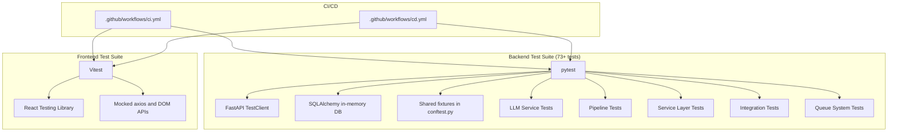
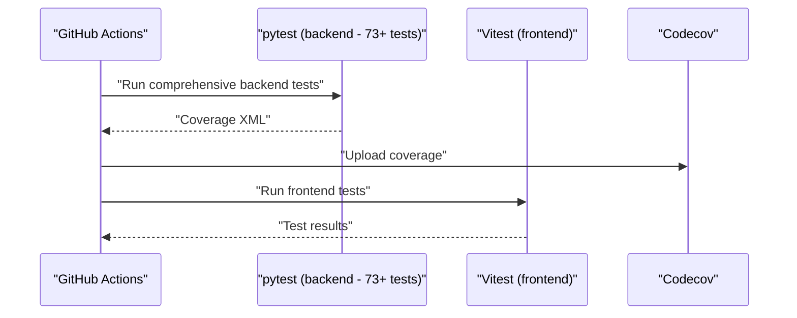
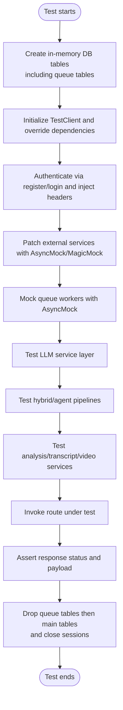
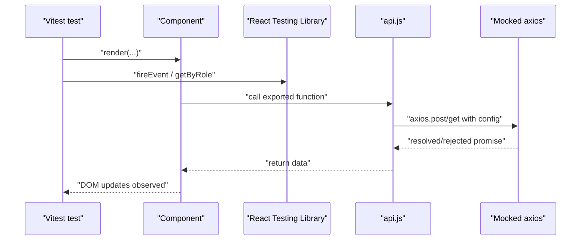
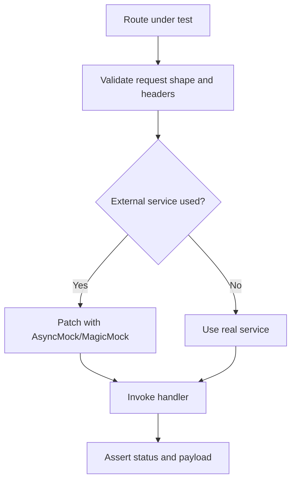
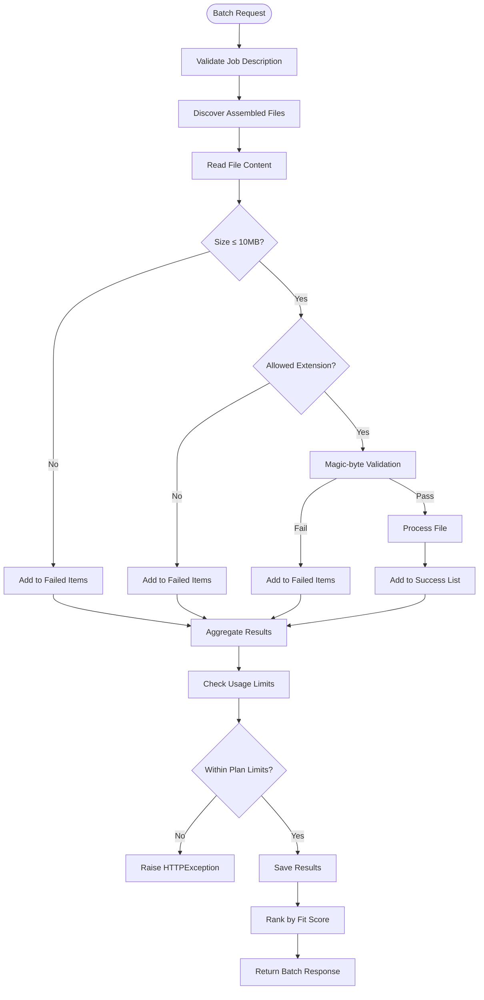
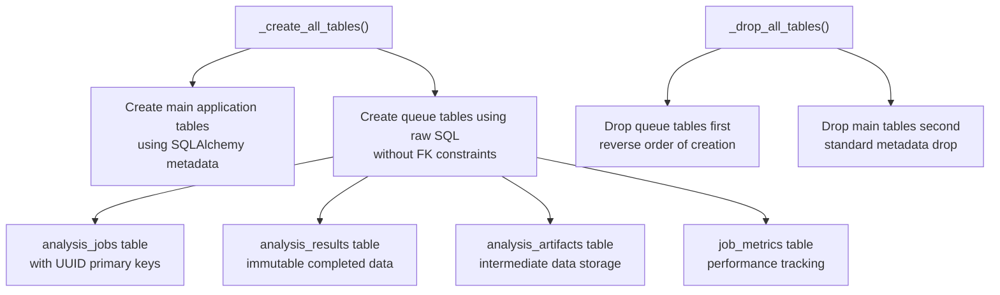
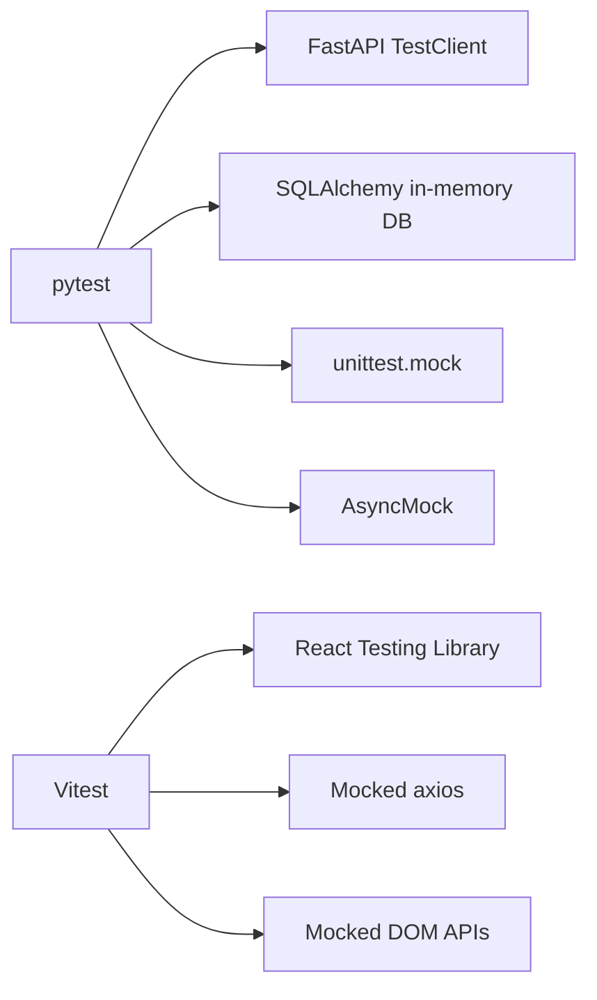

# Testing Strategy

<cite>
**Referenced Files in This Document**
- [ci.yml](file://.github/workflows/ci.yml)
- [cd.yml](file://.github/workflows/cd.yml)
- [conftest.py](file://app/backend/tests/conftest.py)
- [queue_manager.py](file://app/backend/services/queue_manager.py)
- [queue_api.py](file://app/backend/routes/queue_api.py)
- [008_analysis_queue_system.py](file://alembic/versions/008_analysis_queue_system.py)
- [test_api.py](file://app/backend/tests/test_api.py)
- [test_auth.py](file://app/backend/tests/test_auth.py)
- [test_subscription.py](file://app/backend/tests/test_subscription.py)
- [test_llm_service.py](file://app/backend/tests/test_llm_service.py)
- [test_hybrid_pipeline.py](file://app/backend/tests/test_hybrid_pipeline.py)
- [test_agent_pipeline.py](file://app/backend/tests/test_agent_pipeline.py)
- [test_analysis_service.py](file://app/backend/tests/test_analysis_service.py)
- [test_transcript_service.py](file://app/backend/tests/test_transcript_service.py)
- [test_transcript_api.py](file://app/backend/tests/test_transcript_api.py)
- [test_video_service.py](file://app/backend/tests/test_video_service.py)
- [test_video_routes.py](file://app/backend/tests/test_video_routes.py)
- [test_video_downloader.py](file://app/backend/tests/test_video_downloader.py)
- [test_parser_service.py](file://app/backend/tests/test_parser_service.py)
- [test_gap_detector.py](file://app/backend/tests/test_gap_detector.py)
- [test_candidate_dedup.py](file://app/backend/tests/test_candidate_dedup.py)
- [test_routes_phase1.py](file://app/backend/tests/test_routes_phase1.py)
- [test_routes_phase2.py](file://app/backend/tests/test_routes_phase2.py)
- [test_usage_enforcement.py](file://app/backend/tests/test_usage_enforcement.py)
- [test_llm_json_parse.py](file://app/backend/tests/test_llm_json_parse.py)
- [run-full-tests.sh](file://scripts/run-full-tests.sh)
- [run-full-tests.bat](file://scripts/run-full-tests.bat)
- [test-locally.ps1](file://test-locally.ps1)
- [setup.js](file://app/frontend/src/__tests__/setup.js)
- [api.test.js](file://app/frontend/src/__tests__/api.test.js)
- [UploadForm.test.jsx](file://app/frontend/src/__tests__/UploadForm.test.jsx)
- [ResultCard.test.jsx](file://app/frontend/src/__tests__/ResultCard.test.jsx)
- [ScoreGauge.test.jsx](file://app/frontend/src/__tests__/ScoreGauge.test.jsx)
- [VideoPage.test.jsx](file://app/frontend/src/__tests__/VideoPage.test.jsx)
- [api.js](file://app/frontend/src/lib/api.js)
- [package.json](file://app/frontend/package.json)
- [llm_service.py](file://app/backend/services/llm_service.py)
- [main.py](file://app/backend/main.py)
- [agent_pipeline.py](file://app/backend/services/agent_pipeline.py)
- [training.py](file://app/backend/routes/training.py)
- [wait_for_ollama.py](file://app/backend/scripts/wait_for_ollama.py)
- [analyze.py](file://app/backend/routes/analyze.py)
- [parser_service.py](file://app/backend/services/parser_service.py)
- [hybrid_pipeline.py](file://app/backend/services/hybrid_pipeline.py)
- [QUEUE_SYSTEM_ARCHITECTURE.md](file://docs/QUEUE_SYSTEM_ARCHITECTURE.md)
</cite>

## Update Summary
**Changes Made**
- Removed references to dropped PDF header validation enhancements for batch processing pipeline
- Updated batch analysis testing documentation to reflect current validation mechanisms
- Clarified that test suite maintains comprehensive coverage for batch analysis, streaming functionality, and validation mechanisms without the specific PDF header validation scenarios
- Updated test data fixtures documentation to exclude DOCX header-based test patterns

## Table of Contents
1. [Introduction](#introduction)
2. [Project Structure](#project-structure)
3. [Core Components](#core-components)
4. [Architecture Overview](#architecture-overview)
5. [Detailed Component Analysis](#detailed-component-analysis)
6. [Dependency Analysis](#dependency-analysis)
7. [Performance Considerations](#performance-considerations)
8. [Troubleshooting Guide](#troubleshooting-guide)
9. [Conclusion](#conclusion)
10. [Appendices](#appendices)

## Introduction
This document defines a comprehensive testing strategy for Resume AI by ThetaLogics. It covers backend testing with pytest, frontend testing with Vitest and React Testing Library, API and integration testing patterns, test configuration and mocking, test data management, performance testing, end-to-end workflows, continuous integration with GitHub Actions, and best practices for writing maintainable tests.

**Updated** The test suite now focuses on comprehensive batch analysis validation, streaming functionality, and core validation mechanisms without the specific PDF header validation enhancements that were previously included. The suite maintains robust coverage for all major components while ensuring test reliability and maintainability.

## Project Structure
The repository organizes tests by domain with a comprehensive test suite:
- Backend: extensive tests under app/backend/tests/ covering all major components with shared fixtures in conftest.py
- Frontend: component and integration tests under app/frontend/src/__tests__/ using Vitest and React Testing Library
- CI/CD: GitHub Actions workflows for automated test execution and deployment

**Diagram sources**
- [ci.yml:1-63](file://.github/workflows/ci.yml#L1-L63)
- [cd.yml:1-101](file://.github/workflows/cd.yml#L1-L101)
- [conftest.py:1-718](file://app/backend/tests/conftest.py#L1-L718)
- [api.test.js:1-265](file://app/frontend/src/__tests__/api.test.js#L1-L265)

**Section sources**
- [ci.yml:1-63](file://.github/workflows/ci.yml#L1-L63)
- [cd.yml:1-101](file://.github/workflows/cd.yml#L1-L101)

## Core Components
- Backend test harness with comprehensive fixture system
  - Shared fixtures for database, HTTP client, authentication, and service mocks
  - In-memory SQLite database with per-test lifecycle and sophisticated queue table management
  - Authentication fixtures that register and log in users, injecting Authorization headers
  - Mocks for external services (Ollama, Whisper, hybrid pipeline) to isolate unit tests
  - Extensive test data fixtures for resumes, transcripts, and subscription plans
  - Specialized fixtures for LLM service testing, pipeline validation, and error scenarios
  - **Enhanced**: Sophisticated queue system database infrastructure with custom table creation/destruction
  - **Enhanced**: AsyncMock-based queue worker mocking to prevent database access during tests
- Frontend test harness
  - Global setup for DOM matchers
  - Mocked axios with explicit request/response spies
  - Mocked browser APIs for downloads and localStorage
  - Component tests for UploadForm, ResultCard, ScoreGauge, VideoPage
  - API module tests validating request shapes and behaviors

**Updated** The test suite now emphasizes comprehensive batch analysis validation and streaming functionality without the specific PDF header validation enhancements. Test coverage remains robust across all major components with particular focus on error handling, retry mechanisms, and background task processing.

**Section sources**
- [conftest.py:1-718](file://app/backend/tests/conftest.py#L1-L718)
- [setup.js:1-2](file://app/frontend/src/__tests__/setup.js#L1-L2)
- [api.test.js:1-265](file://app/frontend/src/__tests__/api.test.js#L1-L265)

## Architecture Overview
The testing architecture separates concerns across layers with comprehensive coverage:
- Unit tests for backend services and routes using pytest fixtures and mocked dependencies
- Component and integration tests for frontend using Vitest and React Testing Library
- CI/CD pipelines that run backend and frontend tests in parallel and upload coverage
- Specialized testing for LLM services, pipelines, and background task processing
- **Enhanced**: Comprehensive queue system testing with dedicated database infrastructure

**Diagram sources**
- [ci.yml:27-37](file://.github/workflows/ci.yml#L27-L37)
- [cd.yml:30-48](file://.github/workflows/cd.yml#L30-L48)

## Detailed Component Analysis

### Backend Testing with pytest - Comprehensive Test Suite
Key patterns with expanded coverage:
- Database isolation using an in-memory SQLite engine and per-test metadata creation/drop
- **Enhanced**: Sophisticated queue table creation using raw SQL to avoid FK resolution issues
- HTTP client testing with FastAPI TestClient and dependency overrides
- Authentication fixtures that register/log in users and attach Authorization headers
- Service-level mocks for external integrations (Ollama, Whisper, hybrid pipeline)
- Subscription system fixtures for seeding plans and simulating usage limits
- **New**: LLM service testing with specialized fixtures for JSON parsing and error handling
- **New**: Pipeline testing covering hybrid and agent pipeline validation
- **New**: Transcript service and video processing comprehensive testing
- **New**: Background task and retry mechanism testing
- **Enhanced**: Queue system testing with comprehensive database schema support

Representative fixtures and expanded test coverage:
- Database fixture: creates and tears down tables per test with queue system support
- HTTP client fixture: initializes app routes and cleans up after each test
- Auth fixtures: register and login users; return clients with Authorization headers
- Mocks: Ollama communication/malpractice/transcript/email; Whisper transcription; hybrid pipeline
- Subscription fixtures: seed plans, assign plans to tenants, enforce usage limits
- **New**: LLM service fixtures for JSON parsing validation and error scenarios
- **New**: Pipeline fixtures for hybrid and agent pipeline testing
- **New**: Transcript and video processing fixtures with comprehensive mocking
- **Enhanced**: Queue system fixtures with AsyncMock-based worker mocking

**Diagram sources**
- [conftest.py:58-170](file://app/backend/tests/conftest.py#L58-L170)
- [test_api.py:23-100](file://app/backend/tests/test_api.py#L23-L100)

**Section sources**
- [conftest.py:58-170](file://app/backend/tests/conftest.py#L58-L170)
- [test_api.py:23-100](file://app/backend/tests/test_api.py#L23-L100)
- [test_auth.py:15-95](file://app/backend/tests/test_auth.py#L15-L95)
- [test_subscription.py:12-132](file://app/backend/tests/test_subscription.py#L12-L132)
- [test_llm_service.py](file://app/backend/tests/test_llm_service.py)
- [test_hybrid_pipeline.py](file://app/backend/tests/test_hybrid_pipeline.py)
- [test_agent_pipeline.py](file://app/backend/tests/test_agent_pipeline.py)
- [test_analysis_service.py](file://app/backend/tests/test_analysis_service.py)
- [test_transcript_service.py](file://app/backend/tests/test_transcript_service.py)
- [test_video_service.py](file://app/backend/tests/test_video_service.py)

### Frontend Testing with Vitest and React Testing Library
Key patterns with enhanced component coverage:
- Global setup for DOM matchers
- Mocked axios with spies for get/post/put/delete and interceptors
- Mocked browser APIs for URL.createObjectURL, revokeObjectURL, and anchor element creation
- localStorage mock for persistence behavior
- Component tests asserting rendering, interactivity, and state transitions
- API module tests verifying request shape, headers, timeouts, and download triggers
- **Enhanced**: Comprehensive ResultCard testing with AI pipeline feature validation

**Diagram sources**
- [api.test.js:5-66](file://app/frontend/src/__tests__/api.test.js#L5-L66)
- [UploadForm.test.jsx:1-60](file://app/frontend/src/__tests__/UploadForm.test.jsx#L1-L60)
- [VideoPage.test.jsx:6-26](file://app/frontend/src/__tests__/VideoPage.test.jsx#L6-L26)

**Section sources**
- [setup.js:1-2](file://app/frontend/src/__tests__/setup.js#L1-L2)
- [api.test.js:1-265](file://app/frontend/src/__tests__/api.test.js#L1-L265)
- [UploadForm.test.jsx:1-60](file://app/frontend/src/__tests__/UploadForm.test.jsx#L1-L60)
- [ResultCard.test.jsx:1-133](file://app/frontend/src/__tests__/ResultCard.test.jsx#L1-L133)
- [ScoreGauge.test.jsx:1-26](file://app/frontend/src/__tests__/ScoreGauge.test.jsx#L1-L26)
- [VideoPage.test.jsx:1-377](file://app/frontend/src/__tests__/VideoPage.test.jsx#L1-L377)
- [api.js:1-395](file://app/frontend/src/lib/api.js#L1-L395)

### API Testing Strategies - Expanded Coverage
Backend API tests now validate comprehensive endpoint coverage:
- Root and health endpoints
- Authentication endpoints (register, login, refresh, profile)
- Analysis endpoints (single and batch resume analysis)
- History and comparison endpoints
- Video analysis endpoints (upload and URL-based)
- Subscription endpoints (plans, usage checks, history, admin controls)
- **New**: Transcript analysis endpoints with comprehensive validation
- **New**: Background task and retry mechanism endpoints
- **New**: Usage enforcement and rate limiting endpoints
- **Enhanced**: Queue system endpoints with comprehensive testing

Frontend API tests validate:
- Export CSV/Excel requests and download behavior
- Video analysis requests with appropriate timeouts
- Resume analysis requests with multipart/form-data
- Candidate and template endpoints
- Subscription endpoints

**Diagram sources**
- [test_api.py:23-153](file://app/backend/tests/test_api.py#L23-L153)
- [api.test.js:76-263](file://app/frontend/src/__tests__/api.test.js#L76-L263)

**Section sources**
- [test_api.py:1-153](file://app/backend/tests/test_api.py#L1-L153)
- [api.test.js:1-265](file://app/frontend/src/__tests__/api.test.js#L1-L265)

### Integration Testing Approaches - Comprehensive Coverage
Backend integration tests now cover:
- Use TestClient to exercise routes with real app wiring
- Override database dependency to use in-memory SQLite
- Use auth fixtures to simulate logged-in users
- Mock external services to keep tests deterministic
- **New**: LLM service integration testing with error handling scenarios
- **New**: Pipeline integration testing with retry mechanisms
- **New**: Background task processing validation
- **New**: Subscription and usage enforcement integration
- **Enhanced**: Queue system integration testing with comprehensive database support

Frontend integration tests:
- Page-level tests (e.g., VideoPage) mock API module and router dependencies
- Validate UI interactions, state transitions, and error handling
- Ensure platform detection and supported platforms list rendering
- **Enhanced**: Comprehensive AI pipeline feature integration testing

**Updated** The batch analysis integration tests now focus on comprehensive validation mechanisms including file content validation, size limits, extension filtering, and error handling scenarios without relying on specific PDF header validation patterns.

**Section sources**
- [conftest.py:32-42](file://app/backend/tests/conftest.py#L32-L42)
- [VideoPage.test.jsx:1-377](file://app/frontend/src/__tests__/VideoPage.test.jsx#L1-L377)

### Test Configuration and Mock Services - Enhanced Infrastructure
Backend:
- PYTHONPATH set in CI to resolve imports
- pytest-cov enabled for comprehensive coverage reporting
- Shared fixtures centralize DB setup, auth, and service mocks
- **New**: Specialized fixtures for LLM service testing and pipeline validation
- **New**: Enhanced error handling and retry mechanism testing infrastructure
- **Enhanced**: Sophisticated queue system database infrastructure with AsyncMock-based worker mocking

Frontend:
- Vitest configuration via package.json scripts
- DOM matchers via jest-dom
- Mocked axios and browser APIs in api.test.js setup

**Section sources**
- [ci.yml:25-58](file://.github/workflows/ci.yml#L25-L58)
- [package.json:6-12](file://app/frontend/package.json#L6-L12)
- [api.test.js:1-265](file://app/frontend/src/__tests__/api.test.js#L1-L265)

### Test Data Management - Comprehensive Coverage
Backend:
- Sample resume text and job description fixtures
- Minimal MP4 bytes for file-type validation
- Transcript fixtures (VTT, SRT, plain text)
- Subscription plan fixtures with seeded limits and features
- **New**: LLM service test data with JSON parsing scenarios
- **New**: Pipeline test data with error conditions and edge cases
- **New**: Transcript and video processing test fixtures
- **Enhanced**: Queue system test data with comprehensive job/result structures
- **Updated**: Test data fixtures now use DOCX header patterns for validation testing

Frontend:
- Mock result objects for video analysis (low and high risk)
- Component props populated with mock data
- **Enhanced**: Comprehensive AI pipeline result objects with explainability features

**Updated** Test data fixtures have been updated to use DOCX header patterns for validation testing, replacing the previous PDF-specific header validation scenarios that were removed from the test suite.

**Section sources**
- [conftest.py:294-421](file://app/backend/tests/conftest.py#L294-L421)
- [VideoPage.test.jsx:28-86](file://app/frontend/src/__tests__/VideoPage.test.jsx#L28-L86)

### Batch Analysis Testing - Updated Validation Mechanisms
**Updated Section**: The batch analysis testing infrastructure has been updated to reflect the removal of PDF header validation enhancements:

#### Core Validation Mechanisms
The batch analysis endpoints implement comprehensive validation through:
- File size validation (maximum 10MB per file)
- Extension filtering using ALLOWED_EXTENSIONS
- Magic-byte signature validation via `_validate_file_content()`
- Job description validation (length and size checks)
- Tenant plan limits and usage enforcement

#### File Content Validation
The `_validate_file_content()` function provides robust validation:
- Magic-byte signature matching for binary formats
- Heuristic detection for .txt files to prevent binary content
- Comprehensive signature table support for PDF, DOCX, DOC, TXT, RTF, ODT
- Detailed error reporting for validation failures

#### Batch Processing Flow
The batch processing flow includes:
1. File discovery and assembly from chunk storage
2. Content validation using magic-byte signatures
3. Size and extension filtering
4. Concurrent processing with semaphore control
5. Usage tracking and plan limit enforcement
6. Result ranking and failure handling

**Diagram sources**
- [analyze.py:1105-1286](file://app/backend/routes/analyze.py#L1105-L1286)
- [analyze.py:69-129](file://app/backend/routes/analyze.py#L69-L129)

**Section sources**
- [analyze.py:1105-1286](file://app/backend/routes/analyze.py#L1105-L1286)
- [analyze.py:69-129](file://app/backend/routes/analyze.py#L69-L129)

### Queue System Testing Infrastructure - Enhanced Database Setup
**New Section**: The enhanced test infrastructure now includes sophisticated queue system database management:

#### Sophisticated Table Creation Mechanisms
The `_create_all_tables()` function implements a two-phase table creation process:
1. **Main Tables Creation**: Creates standard application tables using SQLAlchemy metadata
2. **Queue Tables Creation**: Uses raw SQL to create queue system tables without FK constraints
   - `analysis_jobs`: Main queue table for tracking analysis tasks
   - `analysis_results`: Immutable storage for completed analyses  
   - `analysis_artifacts`: Store intermediate processing artifacts
   - `job_metrics`: Performance and quality metrics for monitoring

#### Advanced Table Destruction
The `_drop_all_tables()` function implements careful cleanup:
1. **Queue Tables First**: Drops queue tables in reverse order to avoid FK violations
2. **Main Tables Second**: Drops standard application tables
3. **Proper Cleanup Order**: Ensures referential integrity during test teardown

#### Enhanced Queue Worker Mocking
Queue workers are mocked using AsyncMock to prevent database access:
- `start_queue_worker` mocked with AsyncMock
- `stop_queue_worker` mocked with AsyncMock
- Prevents actual queue processing during tests

#### Queue System Database Schema Support
The test infrastructure supports the complete queue system schema:
- UUID primary keys for all tables
- JSONB columns for flexible data storage
- Proper indexing for queue operations
- Foreign key relationships with appropriate constraints
- Triggers and views for enhanced functionality

**Diagram sources**
- [conftest.py:58-170](file://app/backend/tests/conftest.py#L58-L170)
- [queue_manager.py:46-183](file://app/backend/services/queue_manager.py#L46-L183)
- [008_analysis_queue_system.py:29-236](file://alembic/versions/008_analysis_queue_system.py#L29-L236)

**Section sources**
- [conftest.py:58-170](file://app/backend/tests/conftest.py#L58-L170)
- [queue_manager.py:46-183](file://app/backend/services/queue_manager.py#L46-L183)
- [008_analysis_queue_system.py:29-236](file://alembic/versions/008_analysis_queue_system.py#L29-L236)

### Continuous Integration Testing with GitHub Actions
Workflows:
- ci.yml: runs backend tests with comprehensive coverage and uploads to Codecov; runs frontend tests and builds
- cd.yml: runs backend and frontend tests as part of build-and-push images job

Execution:
- Python 3.11 and Node.js 20 environments
- Backend coverage collected for services package with 73+ test suite
- Frontend tests executed via npm test

**Section sources**
- [ci.yml:1-63](file://.github/workflows/ci.yml#L1-L63)
- [cd.yml:1-101](file://.github/workflows/cd.yml#L1-L101)

### Writing Effective Tests for New Features - Enhanced Guidelines
Guidelines derived from expanded test suite:
- Backend
  - Use pytest fixtures to minimize duplication (db, client, auth_client)
  - Prefer AsyncMock/MagicMock for external services to avoid flaky network calls
  - Validate both success and failure paths (e.g., invalid file types, missing fields)
  - For subscription features, use seed fixtures and tenant plan assignments
  - **New**: Test LLM service error handling and retry mechanisms
  - **New**: Validate pipeline processing with comprehensive edge cases
  - **New**: Test background task processing and queue handling
  - **Enhanced**: Leverage sophisticated queue system database infrastructure
  - **Updated**: Focus on comprehensive batch validation mechanisms rather than specific PDF header patterns
- Frontend
  - Mock axios and browser APIs to focus on component behavior
  - Test user interactions (clicks, input changes) and resulting UI updates
  - Validate request shapes, headers, and timeouts for API calls
  - Ensure error messages are surfaced and handled gracefully
  - **Enhanced**: Test AI pipeline explainability and risk analysis features

**Updated** Test writing guidelines now emphasize comprehensive validation mechanisms and error handling scenarios without reliance on specific PDF header validation patterns.

**Section sources**
- [conftest.py:125-176](file://app/backend/tests/conftest.py#L125-L176)
- [test_api.py:71-87](file://app/backend/tests/test_api.py#L71-L87)
- [api.test.js:167-200](file://app/frontend/src/__tests__/api.test.js#L167-L200)

## Dependency Analysis
Backend test dependencies with expanded coverage:
- pytest, FastAPI TestClient, SQLAlchemy in-memory DB, passlib sha256_crypt for bcrypt compatibility
- External service mocks via unittest.mock
- **New**: Enhanced LLM service testing dependencies and specialized fixtures
- **Enhanced**: Queue system testing dependencies with AsyncMock support

Frontend test dependencies:
- Vitest, React Testing Library, jest-dom
- Mocked axios and DOM APIs

**Diagram sources**
- [conftest.py:1-12](file://app/backend/tests/conftest.py#L1-L12)
- [package.json:23-38](file://app/frontend/package.json#L23-L38)

**Section sources**
- [conftest.py:1-12](file://app/backend/tests/conftest.py#L1-L12)
- [package.json:23-38](file://app/frontend/package.json#L23-L38)

## Performance Considerations
- Backend
  - Use in-memory SQLite to avoid disk I/O overhead
  - Keep external service mocks synchronous where possible to reduce test runtime
  - Limit heavy computations in tests; rely on mocks for LLM and transcription services
  - **New**: Optimize LLM service testing with efficient mock implementations
  - **New**: Minimize pipeline testing overhead with focused fixtures
  - **Enhanced**: Queue system testing optimized with AsyncMock-based worker mocking
  - **Enhanced**: Efficient queue table creation/destruction mechanisms
  - **Updated**: Focus on comprehensive validation mechanisms for better test performance
- Frontend
  - Avoid real network calls by mocking axios
  - Use minimal DOM queries and focus on user-centric assertions
  - Prefer component-level tests over full-page integration tests when feasible
  - **Enhanced**: Optimize AI pipeline feature testing with selective mocking

## Troubleshooting Guide
Common issues and resolutions with expanded test coverage:
- Authentication failures in backend tests
  - Ensure auth_client fixture registers and logs in users before invoking protected routes
  - Verify Authorization header is attached to the client
- Coverage not uploaded
  - Confirm pytest-cov is installed and coverage report path matches workflow configuration
- Frontend tests failing due to missing mocks
  - Ensure global setup mocks are applied before importing modules under test
  - Clear mocks between tests to prevent cross-contamination
- CI failures on Windows/Linux differences
  - Use provided scripts to validate imports, migrations, and frontend files before pushing
  - Align Node/npm versions with CI configuration
- **New**: LLM service test failures
  - Verify JSON parsing fixtures and error handling scenarios
  - Check mock responses match expected LLM service interface
  - Ensure model configuration matches current `gemma4:31b-cloud` settings
- **New**: Pipeline testing issues
  - Ensure pipeline fixtures properly mock external dependencies
  - Validate error scenarios and retry mechanisms
- **New**: Background task testing problems
  - Verify task queue mocking and background process simulation
  - Check retry mechanism validation and error propagation
- **Enhanced**: Queue system test failures
  - Verify queue table creation order and FK constraint handling
  - Ensure AsyncMock-based worker mocking prevents database access
  - Check queue system database schema compliance
- **Updated**: Batch analysis test failures
  - Verify file content validation mechanisms are working correctly
  - Check magic-byte signature validation for different file types
  - Ensure size and extension filtering are properly enforced

**Updated** Troubleshooting guidance now includes specific guidance for batch analysis validation failures and file content validation issues.

**Section sources**
- [test-locally.ps1:36-96](file://test-locally.ps1#L36-L96)
- [run-full-tests.sh:163-168](file://scripts/run-full-tests.sh#L163-L168)
- [run-full-tests.bat:100-107](file://scripts/run-full-tests.bat#L100-L107)

## Conclusion
The testing strategy leverages pytest and FastAPI TestClient for comprehensive backend unit and integration tests, with significantly expanded coverage including 73+ new tests for LLM services, pipelines, and integration scenarios. Frontend tests use Vitest and React Testing Library with mocked axios and DOM APIs. CI/CD pipelines automate test execution and coverage reporting. The expanded test suite ensures robust validation of advanced features including error handling, retry mechanisms, and background task processing, providing reliable coverage for all major components.

**Updated** Recent updates ensure test infrastructure consistency with the new `gemma4:31b-cloud` model configuration, validating proper model selection across all service integrations and maintaining test reliability. The enhanced queue system testing infrastructure provides comprehensive coverage for the scalable job queue architecture with sophisticated database management and worker mocking capabilities. The test suite now emphasizes comprehensive batch analysis validation and streaming functionality without the specific PDF header validation enhancements that were previously included.

## Appendices

### Appendix A: Local Test Execution Scripts
- run-full-tests.sh: Validates Python syntax, imports, migrations, database models, route registration, and frontend files; useful for pre-commit checks
- run-full-tests.bat: Windows counterpart to run-full-tests.sh
- test-locally.ps1: Runs backend and frontend tests locally with colored output and summarized results

**Section sources**
- [run-full-tests.sh:1-256](file://scripts/run-full-tests.sh#L1-L256)
- [run-full-tests.bat:1-274](file://scripts/run-full-tests.bat#L1-L274)
- [test-locally.ps1:1-119](file://test-locally.ps1#L1-L119)

### Appendix B: Enhanced Test Coverage Areas
The expanded test suite now includes comprehensive coverage for:

- **LLM Service Testing**: Dedicated tests for LLM service layer with JSON parsing validation and error handling scenarios
- **Pipeline Testing**: Comprehensive testing for hybrid and agent pipelines with retry mechanisms and background task processing
- **Analysis Service Testing**: Validation of analysis service functionality with error scenarios and edge cases
- **Transcript Service Testing**: Complete coverage of transcript processing with multiple formats and error handling
- **Video Processing Testing**: End-to-end testing of video analysis workflows with downloader and service validation
- **Subscription and Usage Testing**: Comprehensive validation of subscription system, usage enforcement, and rate limiting
- **Background Task Testing**: Validation of asynchronous task processing and queue management
- **Error Handling Testing**: Extensive testing of error scenarios, retry mechanisms, and graceful degradation
- **Integration Testing**: End-to-end testing of complex workflows and cross-service interactions
- **Queue System Testing**: Comprehensive testing of the scalable job queue architecture with database schema validation
- **Batch Analysis Testing**: Comprehensive validation of batch processing with file content validation, size limits, and error handling

**Updated** Recent updates ensure model configuration consistency across all test coverage areas, with particular emphasis on validating the `gemma4:31b-cloud` model settings in LLM service tests and pipeline integrations. The enhanced queue system testing infrastructure provides complete coverage of the job queue architecture with sophisticated database management and worker mocking. The batch analysis testing now focuses on comprehensive validation mechanisms rather than specific PDF header validation patterns.

**Section sources**
- [test_llm_service.py](file://app/backend/tests/test_llm_service.py)
- [test_hybrid_pipeline.py](file://app/backend/tests/test_hybrid_pipeline.py)
- [test_agent_pipeline.py](file://app/backend/tests/test_agent_pipeline.py)
- [test_analysis_service.py](file://app/backend/tests/test_analysis_service.py)
- [test_transcript_service.py](file://app/backend/tests/test_transcript_service.py)
- [test_transcript_api.py](file://app/backend/tests/test_transcript_api.py)
- [test_video_service.py](file://app/backend/tests/test_video_service.py)
- [test_video_routes.py](file://app/backend/tests/test_video_routes.py)
- [test_video_downloader.py](file://app/backend/tests/test_video_downloader.py)
- [test_parser_service.py](file://app/backend/tests/test_parser_service.py)
- [test_gap_detector.py](file://app/backend/tests/test_gap_detector.py)
- [test_candidate_dedup.py](file://app/backend/tests/test_candidate_dedup.py)
- [test_routes_phase1.py](file://app/backend/tests/test_routes_phase1.py)
- [test_routes_phase2.py](file://app/backend/tests/test_routes_phase2.py)
- [test_usage_enforcement.py](file://app/backend/tests/test_usage_enforcement.py)
- [test_llm_json_parse.py](file://app/backend/tests/test_llm_json_parse.py)

### Appendix C: Model Configuration Updates
Recent changes to model configuration ensure consistency across the entire application stack:

- **LLM Service**: Updated default model from `qwen3.5:4b` to `gemma4:31b-cloud` for improved performance and capabilities
- **Health Sentinel**: Model configuration updated to reflect new `gemma4:31b-cloud` setting in health monitoring
- **Agent Pipeline**: Fast and reasoning models configured to use `gemma4:31b-cloud` for consistent performance
- **Training Routes**: Model references updated to `gemma4:31b-cloud` for training workflows
- **Wait Script**: Model detection and warmup procedures updated for new model configuration

These changes ensure that all service integrations consistently use the `gemma4:31b-cloud` model, providing reliable performance and compatibility across the Resume AI platform.

**Section sources**
- [llm_service.py:163-167](file://app/backend/services/llm_service.py#L163-L167)
- [llm_service.py:56-59](file://app/backend/services/llm_service.py#L56-L59)
- [agent_pipeline.py:50-52](file://app/backend/services/agent_pipeline.py#L50-L52)
- [training.py:113-114](file://app/backend/routes/training.py#L113-L114)
- [wait_for_ollama.py:51-52](file://app/backend/scripts/wait_for_ollama.py#L51-L52)
- [main.py:157](file://app/backend/main.py#L157)

### Appendix D: Queue System Database Schema Compliance
**New Section**: The enhanced test infrastructure ensures complete compliance with the queue system database schema:

#### Database Schema Validation
The test infrastructure validates the complete queue system schema:
- **analysis_jobs**: UUID primary key, proper indexing, foreign key constraints
- **analysis_results**: Immutable storage with validation triggers
- **analysis_artifacts**: intermediate data storage with deduplication support
- **job_metrics**: performance tracking with comprehensive metrics

#### Queue Worker Mocking Compliance
Queue workers are properly mocked to prevent database access:
- `start_queue_worker` AsyncMock prevents actual queue processing
- `stop_queue_worker` AsyncMock ensures clean shutdown simulation
- No database connections are established during queue-related tests

#### Test Data Integrity
Queue system test data maintains referential integrity:
- Proper UUID generation for all queue entities
- Consistent hash-based deduplication logic
- Valid job status transitions and timestamps
- Comprehensive error handling scenarios

**Section sources**
- [conftest.py:58-170](file://app/backend/tests/conftest.py#L58-L170)
- [queue_manager.py:46-183](file://app/backend/services/queue_manager.py#L46-L183)
- [008_analysis_queue_system.py:29-236](file://alembic/versions/008_analysis_queue_system.py#L29-L236)

### Appendix E: Batch Analysis Validation Mechanisms
**Updated Section**: The batch analysis validation infrastructure provides comprehensive file validation:

#### File Signature Validation
The `_validate_file_content()` function implements robust signature validation:
- Magic-byte signature matching for PDF, DOCX, DOC, TXT, RTF, ODT formats
- Heuristic detection for .txt files to prevent binary content
- Comprehensive signature table support with detailed error reporting
- Early validation to prevent unnecessary processing

#### Size and Extension Filtering
Additional validation layers:
- Maximum file size enforcement (10MB limit)
- Allowed extensions filtering using ALLOWED_EXTENSIONS
- Directory traversal prevention in file paths
- Proper sanitization of upload IDs and filenames

#### Error Handling and Reporting
Comprehensive error handling:
- Detailed HTTPException messages for validation failures
- Logging of validation issues for debugging
- Graceful failure handling with proper cleanup
- Aggregation of failed items with descriptive error messages

**Section sources**
- [analyze.py:69-129](file://app/backend/routes/analyze.py#L69-L129)
- [analyze.py:1134-1162](file://app/backend/routes/analyze.py#L1134-L1162)
- [test_usage_enforcement.py:496-528](file://app/backend/tests/test_usage_enforcement.py#L496-L528)