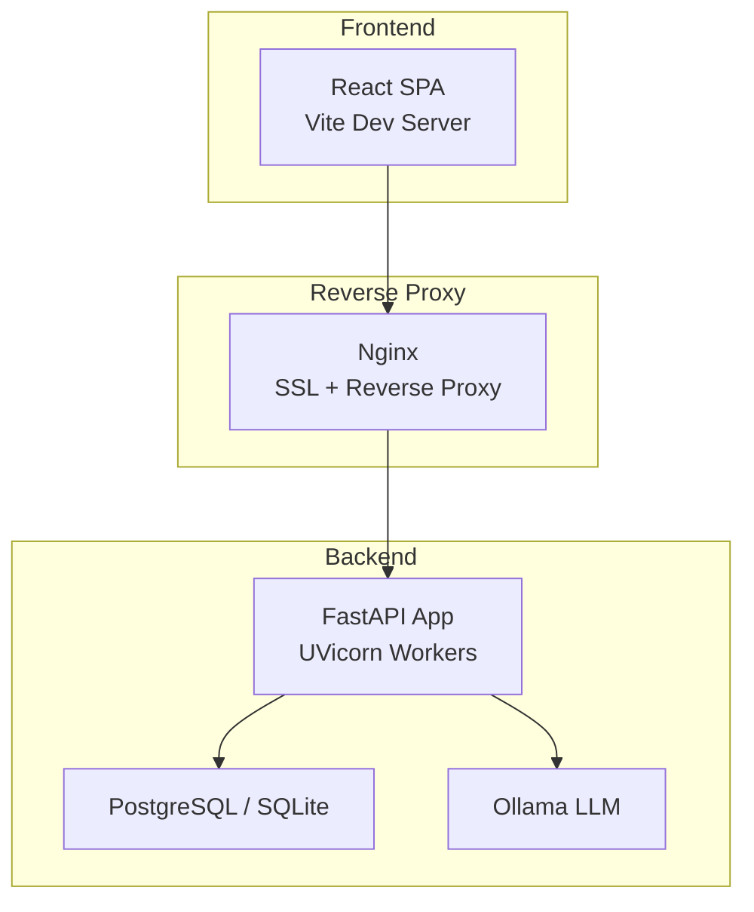
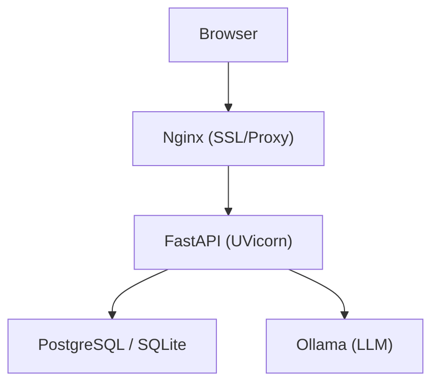
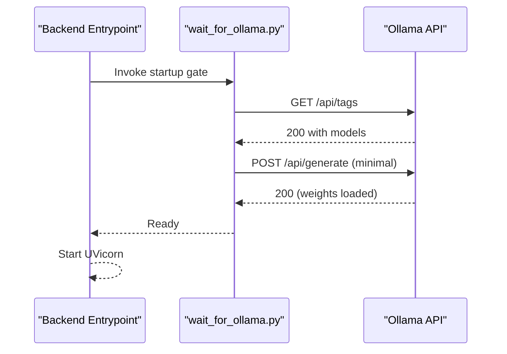
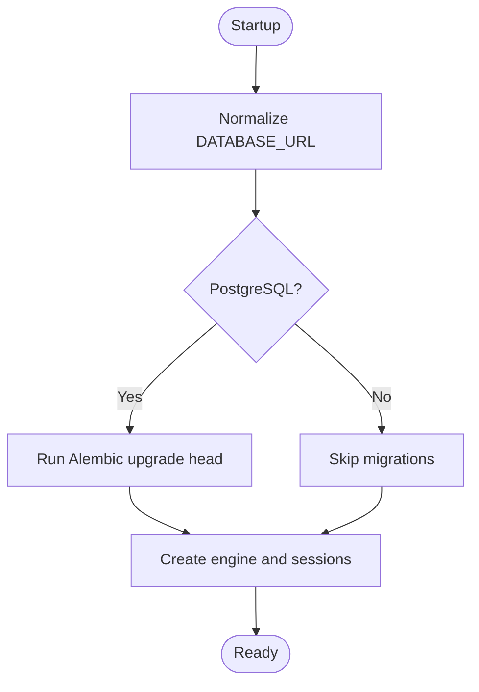
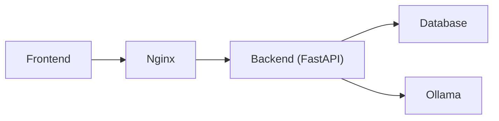

# Troubleshooting & FAQ

<cite>
**Referenced Files in This Document**
- [README.md](file://README.md)
- [docker-compose.yml](file://docker-compose.yml)
- [docker-compose.prod.yml](file://docker-compose.prod.yml)
- [app/backend/main.py](file://app/backend/main.py)
- [app/backend/db/database.py](file://app/backend/db/database.py)
- [app/backend/scripts/docker-entrypoint.sh](file://app/backend/scripts/docker-entrypoint.sh)
- [app/backend/scripts/wait_for_ollama.py](file://app/backend/scripts/wait_for_ollama.py)
- [app/backend/services/llm_service.py](file://app/backend/services/llm_service.py)
- [app/backend/middleware/auth.py](file://app/backend/middleware/auth.py)
- [app/backend/routes/analyze.py](file://app/backend/routes/analyze.py)
- [app/backend/routes/auth.py](file://app/backend/routes/auth.py)
- [app/backend/models/schemas.py](file://app/backend/models/schemas.py)
- [app/backend/models/db_models.py](file://app/backend/models/db_models.py)
- [app/frontend/package.json](file://app/frontend/package.json)
- [scripts/README.md](file://scripts/README.md)
</cite>

## Table of Contents
1. [Introduction](#introduction)
2. [Project Structure](#project-structure)
3. [Core Components](#core-components)
4. [Architecture Overview](#architecture-overview)
5. [Detailed Component Analysis](#detailed-component-analysis)
6. [Dependency Analysis](#dependency-analysis)
7. [Performance Considerations](#performance-considerations)
8. [Troubleshooting Guide](#troubleshooting-guide)
9. [Conclusion](#conclusion)
10. [Appendices](#appendices)

## Introduction
This document provides comprehensive troubleshooting and FAQ guidance for Resume AI by ThetaLogics. It focuses on resolving common issues related to Ollama model setup, database connectivity, Docker container orchestration, performance tuning, memory management, SSL/TLS, deployment failures, CI/CD pipeline issues, error resolution, log analysis, debugging procedures, model loading failures, API timeouts, and frontend rendering problems. It also includes preventive measures, monitoring recommendations, maintenance schedules, and escalation resources.

## Project Structure
The system comprises:
- Backend (FastAPI) with routes, services, middleware, and database models
- Frontend (React/Vite) with UI components and API integration
- Infrastructure orchestrated by Docker Compose (development and production)
- Nginx reverse proxy and SSL termination
- Ollama for local LLM inference
- Alembic for database migrations

**Diagram sources**
- [docker-compose.yml:1-101](file://docker-compose.yml#L1-L101)
- [docker-compose.prod.yml:1-227](file://docker-compose.prod.yml#L1-L227)
- [app/backend/main.py:174-260](file://app/backend/main.py#L174-L260)

**Section sources**
- [README.md:231-333](file://README.md#L231-L333)
- [docker-compose.yml:1-101](file://docker-compose.yml#L1-L101)
- [docker-compose.prod.yml:1-227](file://docker-compose.prod.yml#L1-L227)

## Core Components
- Health and diagnostics endpoints for runtime status
- Startup checks and warm-up gate for Ollama readiness
- Database connectivity and migration handling
- JWT authentication middleware
- Analysis pipeline with hybrid scoring and optional LLM narrative
- Streaming and batch analysis endpoints
- Subscription and usage enforcement

**Section sources**
- [app/backend/main.py:228-260](file://app/backend/main.py#L228-L260)
- [app/backend/main.py:68-149](file://app/backend/main.py#L68-L149)
- [app/backend/db/database.py:1-33](file://app/backend/db/database.py#L1-L33)
- [app/backend/middleware/auth.py:1-47](file://app/backend/middleware/auth.py#L1-L47)
- [app/backend/routes/analyze.py:354-501](file://app/backend/routes/analyze.py#L354-L501)
- [app/backend/routes/analyze.py:506-646](file://app/backend/routes/analyze.py#L506-L646)
- [app/backend/routes/analyze.py:651-758](file://app/backend/routes/analyze.py#L651-L758)

## Architecture Overview
The system integrates a React frontend served behind Nginx, a FastAPI backend with UVicorn workers, a database, and Ollama for LLM inference. Production uses resource limits and Watchtower for automated updates.

**Diagram sources**
- [docker-compose.prod.yml:75-112](file://docker-compose.prod.yml#L75-L112)
- [app/backend/main.py:174-260](file://app/backend/main.py#L174-L260)

## Detailed Component Analysis

### Ollama Model Setup and Warm-Up
- Backend waits for Ollama readiness and validates the configured model is pulled and warmed before serving requests.
- Production uses a dedicated warm-up container to preload the model into RAM.
- Environment variables control model selection, parallelism, and timeouts.

**Diagram sources**
- [app/backend/scripts/docker-entrypoint.sh:16-18](file://app/backend/scripts/docker-entrypoint.sh#L16-L18)
- [app/backend/scripts/wait_for_ollama.py:34-91](file://app/backend/scripts/wait_for_ollama.py#L34-L91)
- [docker-compose.prod.yml:151-184](file://docker-compose.prod.yml#L151-L184)

**Section sources**
- [app/backend/scripts/wait_for_ollama.py:1-96](file://app/backend/scripts/wait_for_ollama.py#L1-L96)
- [app/backend/scripts/docker-entrypoint.sh:1-20](file://app/backend/scripts/docker-entrypoint.sh#L1-L20)
- [docker-compose.prod.yml:151-184](file://docker-compose.prod.yml#L151-L184)

### Database Connectivity and Migrations
- Database URL normalization supports SQLite and PostgreSQL.
- Alembic migrations are applied on startup for PostgreSQL.
- SQLite is used by default; concurrency considerations apply.

**Diagram sources**
- [app/backend/db/database.py:5-24](file://app/backend/db/database.py#L5-L24)
- [app/backend/scripts/docker-entrypoint.sh:4-14](file://app/backend/scripts/docker-entrypoint.sh#L4-L14)

**Section sources**
- [app/backend/db/database.py:1-33](file://app/backend/db/database.py#L1-L33)
- [app/backend/scripts/docker-entrypoint.sh:1-20](file://app/backend/scripts/docker-entrypoint.sh#L1-L20)

### Authentication and Authorization
- JWT bearer authentication with role-based access.
- Secret key and algorithm are configurable.

**Section sources**
- [app/backend/middleware/auth.py:1-47](file://app/backend/middleware/auth.py#L1-L47)
- [app/backend/routes/auth.py:57-151](file://app/backend/routes/auth.py#L57-L151)

### Analysis Pipeline and Streaming
- Non-streaming and streaming endpoints with structured logging and persistence.
- Deduplication and caching improve performance and reduce redundant LLM calls.

**Section sources**
- [app/backend/routes/analyze.py:354-501](file://app/backend/routes/analyze.py#L354-L501)
- [app/backend/routes/analyze.py:506-646](file://app/backend/routes/analyze.py#L506-L646)
- [app/backend/routes/analyze.py:651-758](file://app/backend/routes/analyze.py#L651-L758)

### LLM Service and JSON Parsing
- Async LLM calls with retry and fallback behavior.
- Robust JSON parsing with multiple extraction strategies.

**Section sources**
- [app/backend/services/llm_service.py:1-156](file://app/backend/services/llm_service.py#L1-L156)

## Dependency Analysis
- Backend depends on database and Ollama; health checks and startup gates enforce readiness.
- Production adds resource limits, warm-up, and Watchtower for automated updates.

**Diagram sources**
- [docker-compose.prod.yml:75-112](file://docker-compose.prod.yml#L75-L112)
- [app/backend/main.py:68-149](file://app/backend/main.py#L68-L149)

**Section sources**
- [docker-compose.yml:52-96](file://docker-compose.yml#L52-L96)
- [docker-compose.prod.yml:75-112](file://docker-compose.prod.yml#L75-L112)

## Performance Considerations
- Resource allocation
  - Production sets CPU/memory limits for each service and enables Ollama optimizations (parallelism, KV cache quantization, flash attention).
- Concurrency and workers
  - Backend uses multiple workers to handle I/O-bound tasks efficiently.
- Caching and deduplication
  - JD cache and candidate deduplication reduce repeated processing.
- Streaming and timeouts
  - Streaming endpoints provide responsive UX; timeouts are tuned for LLM calls.

**Section sources**
- [docker-compose.prod.yml:28-64](file://docker-compose.prod.yml#L28-L64)
- [docker-compose.prod.yml:78-80](file://docker-compose.prod.yml#L78-L80)
- [app/backend/routes/analyze.py:49, 569:49-64](file://app/backend/routes/analyze.py#L49-L64)
- [app/backend/services/llm_service.py:53](file://app/backend/services/llm_service.py#L53-L57)

## Troubleshooting Guide

### Ollama Model Setup Failures
Symptoms
- Backend fails to start or reports “Ollama unreachable.”
- LLM narrative is pending or fallback occurs.

Resolutions
- Verify Ollama service health and model availability:
  - Check health status and model tags.
  - Pull the required model if missing.
  - Ensure warm-up has completed in production.
- Confirm environment variables:
  - OLLAMA_BASE_URL, OLLAMA_MODEL, OLLAMA_FAST_MODEL, LLM_NARRATIVE_TIMEOUT.
- Inspect startup logs and the warm-up container.

References
- [app/backend/scripts/wait_for_ollama.py:34-91](file://app/backend/scripts/wait_for_ollama.py#L34-L91)
- [app/backend/main.py:262-326](file://app/backend/main.py#L262-L326)
- [docker-compose.prod.yml:151-184](file://docker-compose.prod.yml#L151-L184)

**Section sources**
- [app/backend/scripts/wait_for_ollama.py:1-96](file://app/backend/scripts/wait_for_ollama.py#L1-L96)
- [app/backend/main.py:262-326](file://app/backend/main.py#L262-L326)
- [docker-compose.prod.yml:151-184](file://docker-compose.prod.yml#L151-L184)

### Database Connectivity Problems
Symptoms
- Database locked errors (SQLite).
- Health check failing for DB.

Resolutions
- For SQLite, restart the backend container to release locks.
- For PostgreSQL, verify connection string normalization and credentials.
- Ensure migrations are applied on startup for PostgreSQL.

References
- [README.md:346-348](file://README.md#L346-L348)
- [app/backend/db/database.py:5-24](file://app/backend/db/database.py#L5-L24)
- [app/backend/scripts/docker-entrypoint.sh:4-14](file://app/backend/scripts/docker-entrypoint.sh#L4-L14)

**Section sources**
- [README.md:346-348](file://README.md#L346-L348)
- [app/backend/db/database.py:1-33](file://app/backend/db/database.py#L1-L33)
- [app/backend/scripts/docker-entrypoint.sh:1-20](file://app/backend/scripts/docker-entrypoint.sh#L1-L20)

### Docker Container Issues
Symptoms
- Containers fail to start or restart loops.
- Health checks fail.

Resolutions
- Review healthchecks and restart policies.
- Validate environment variables and volume mounts.
- For production, confirm resource limits and Watchtower configuration.

References
- [docker-compose.yml:18-22, 27-31, 108-112:18-22](file://docker-compose.yml#L18-L22)
- [docker-compose.prod.yml:34-39, 66-71, 107-112:34-39](file://docker-compose.prod.yml#L34-L39)

**Section sources**
- [docker-compose.yml:1-101](file://docker-compose.yml#L1-L101)
- [docker-compose.prod.yml:1-227](file://docker-compose.prod.yml#L1-L227)

### SSL Certificate Troubleshooting
Symptoms
- TLS handshake failures or expired certificates.
- Mixed content warnings.

Resolutions
- Renew certificates manually on the VPS and restart Nginx.
- Ensure Certbot container is running and volumes are mounted.

References
- [README.md:349-355](file://README.md#L349-L355)
- [docker-compose.prod.yml:213-220](file://docker-compose.prod.yml#L213-L220)

**Section sources**
- [README.md:349-355](file://README.md#L349-L355)
- [docker-compose.prod.yml:213-220](file://docker-compose.prod.yml#L213-L220)

### Deployment Failures
Symptoms
- CI/CD pipeline fails during build or deploy.
- SSH key or secrets issues.

Resolutions
- Check GitHub Actions logs for Docker Hub token expiration, SSH key configuration, and firewall issues.
- Validate repository secrets and SSH key content.

References
- [README.md:357-362](file://README.md#L357-L362)

**Section sources**
- [README.md:357-362](file://README.md#L357-L362)

### CI/CD Pipeline Issues
Symptoms
- Pre-commit or full test validations fail.
- Missing dependencies or execution policy errors.

Resolutions
- Run pre-commit checks and full test suite locally or in Docker.
- Fix execution policy and install missing test dependencies.

References
- [scripts/README.md:131-150](file://scripts/README.md#L131-L150)
- [scripts/README.md:174-205](file://scripts/README.md#L174-L205)

**Section sources**
- [scripts/README.md:1-205](file://scripts/README.md#L1-L205)

### Error Resolution Strategies
- Use health and diagnostic endpoints to assess system status.
- Inspect structured logs emitted by the analysis pipeline.
- Validate JWT configuration and secrets.

References
- [app/backend/main.py:228-260](file://app/backend/main.py#L228-L260)
- [app/backend/main.py:262-326](file://app/backend/main.py#L262-L326)
- [app/backend/routes/analyze.py:491-500](file://app/backend/routes/analyze.py#L491-L500)
- [app/backend/middleware/auth.py:13](file://app/backend/middleware/auth.py#L13)

**Section sources**
- [app/backend/main.py:228-326](file://app/backend/main.py#L228-L326)
- [app/backend/routes/analyze.py:491-500](file://app/backend/routes/analyze.py#L491-L500)
- [app/backend/middleware/auth.py:1-47](file://app/backend/middleware/auth.py#L1-L47)

### Log Analysis Techniques
- Backend prints a startup banner with dependency checks.
- Analysis endpoint emits structured JSON logs for each run.
- Use container logs and health checks to diagnose issues.

References
- [app/backend/main.py:37-66](file://app/backend/main.py#L37-L66)
- [app/backend/routes/analyze.py:491-500](file://app/backend/routes/analyze.py#L491-L500)

**Section sources**
- [app/backend/main.py:37-66](file://app/backend/main.py#L37-L66)
- [app/backend/routes/analyze.py:491-500](file://app/backend/routes/analyze.py#L491-L500)

### Debugging Procedures
- Verify Ollama readiness and model warm-up.
- Check database connectivity and migrations.
- Validate JWT configuration and tokens.
- Use streaming endpoints to observe stage transitions.

References
- [app/backend/scripts/wait_for_ollama.py:34-91](file://app/backend/scripts/wait_for_ollama.py#L34-L91)
- [app/backend/db/database.py:5-24](file://app/backend/db/database.py#L5-L24)
- [app/backend/middleware/auth.py:19-40](file://app/backend/middleware/auth.py#L19-L40)
- [app/backend/routes/analyze.py:506-646](file://app/backend/routes/analyze.py#L506-L646)

**Section sources**
- [app/backend/scripts/wait_for_ollama.py:1-96](file://app/backend/scripts/wait_for_ollama.py#L1-L96)
- [app/backend/db/database.py:1-33](file://app/backend/db/database.py#L1-L33)
- [app/backend/middleware/auth.py:1-47](file://app/backend/middleware/auth.py#L1-L47)
- [app/backend/routes/analyze.py:506-646](file://app/backend/routes/analyze.py#L506-L646)

### Model Loading Failures
Symptoms
- Model not found or cold start delays.
- Diagnosis endpoint indicates missing model or not loaded.

Resolutions
- Pull the required model into Ollama.
- Ensure warm-up container completes successfully.
- Adjust model selection and warm-up timeouts.

References
- [app/backend/main.py:262-326](file://app/backend/main.py#L262-L326)
- [docker-compose.prod.yml:151-184](file://docker-compose.prod.yml#L151-L184)

**Section sources**
- [app/backend/main.py:262-326](file://app/backend/main.py#L262-L326)
- [docker-compose.prod.yml:151-184](file://docker-compose.prod.yml#L151-L184)

### API Timeout Issues
Symptoms
- LLM calls timeout or slow responses.
- Streaming endpoints stall.

Resolutions
- Increase LLM_NARRATIVE_TIMEOUT and tune Ollama parallelism and KV cache settings.
- Reduce payload sizes and enable caching.

References
- [docker-compose.prod.yml:93](file://docker-compose.prod.yml#L93)
- [app/backend/services/llm_service.py:53](file://app/backend/services/llm_service.py#L53-L57)

**Section sources**
- [docker-compose.prod.yml:93](file://docker-compose.prod.yml#L93)
- [app/backend/services/llm_service.py:53-57](file://app/backend/services/llm_service.py#L53-L57)

### Frontend Rendering Problems
Symptoms
- Blank page or CORS errors.
- Build or test failures.

Resolutions
- Verify development origins and production CORS configuration.
- Ensure dependencies are installed and linting passes.
- Check Vite dev server and build outputs.

References
- [app/backend/main.py:183-198](file://app/backend/main.py#L183-L198)
- [app/frontend/package.json:1-41](file://app/frontend/package.json#L1-L41)

**Section sources**
- [app/backend/main.py:183-198](file://app/backend/main.py#L183-L198)
- [app/frontend/package.json:1-41](file://app/frontend/package.json#L1-L41)

### Preventive Measures and Maintenance
- Monitor health endpoints and logs regularly.
- Rotate JWT secrets and manage CI/CD secrets securely.
- Schedule periodic certificate renewal and container updates via Watchtower.
- Maintain resource limits and monitor Ollama memory/CPU usage.

References
- [app/backend/main.py:228-260](file://app/backend/main.py#L228-L260)
- [docker-compose.prod.yml:192-211](file://docker-compose.prod.yml#L192-L211)
- [README.md:357-362](file://README.md#L357-L362)

**Section sources**
- [app/backend/main.py:228-260](file://app/backend/main.py#L228-L260)
- [docker-compose.prod.yml:192-211](file://docker-compose.prod.yml#L192-L211)
- [README.md:357-362](file://README.md#L357-L362)

### Monitoring Recommendations
- Use health endpoints for uptime checks.
- Observe structured logs for analysis timing and quality.
- Track database and Ollama resource utilization.

References
- [app/backend/main.py:228-260](file://app/backend/main.py#L228-L260)
- [app/backend/routes/analyze.py:491-500](file://app/backend/routes/analyze.py#L491-L500)

**Section sources**
- [app/backend/main.py:228-260](file://app/backend/main.py#L228-L260)
- [app/backend/routes/analyze.py:491-500](file://app/backend/routes/analyze.py#L491-L500)

### Escalation Procedures and Support Resources
- For deployment issues, validate CI/CD logs and secrets.
- For runtime issues, collect backend logs, health status, and LLM diagnostics.
- Open a GitHub issue with reproducible steps and environment details.

References
- [README.md:371-375](file://README.md#L371-L375)

**Section sources**
- [README.md:371-375](file://README.md#L371-L375)

## Conclusion
This guide consolidates practical troubleshooting steps and operational best practices for Resume AI by ThetaLogics. By validating Ollama readiness, ensuring database connectivity, managing Docker resources, and leveraging health and diagnostic endpoints, most issues can be resolved quickly. Adopt the recommended preventive measures and monitoring strategies to maintain reliability and performance.

## Appendices

### Frequently Asked Questions (FAQ)
- What models are used in development vs. production?
  - Development uses smaller fast models; production uses larger models optimized for performance and memory.
- How do I pull the required model?
  - Pull the model into the Ollama container after initial deployment.
- Why is my analysis slow?
  - Check Ollama warm-up, resource limits, and payload sizes; consider enabling caching.
- How do I renew SSL certificates?
  - Renew certificates manually on the VPS and restart Nginx.
- How do I scale the backend?
  - Increase worker count and adjust CPU/memory limits; ensure Ollama parallelism is tuned.

**Section sources**
- [docker-compose.prod.yml:86-95](file://docker-compose.prod.yml#L86-L95)
- [README.md:189-197](file://README.md#L189-L197)
- [docker-compose.prod.yml:78-80](file://docker-compose.prod.yml#L78-L80)