# Interview Analysis Workflow

<cite>
**Referenced Files in This Document**
- [video_service.py](file://app/backend/services/video_service.py)
- [video_downloader.py](file://app/backend/services/video_downloader.py)
- [transcript_service.py](file://app/backend/services/transcript_service.py)
- [video.py](file://app/backend/routes/video.py)
- [transcript.py](file://app/backend/routes/transcript.py)
- [analyze.py](file://app/backend/routes/analyze.py)
- [interview_kit.py](file://app/backend/routes/interview_kit.py)
- [agent_pipeline.py](file://app/backend/services/agent_pipeline.py)
- [hybrid_pipeline.py](file://app/backend/services/hybrid_pipeline.py)
- [main.py](file://app/backend/main.py)
- [db_models.py](file://app/backend/models/db_models.py)
- [schemas.py](file://app/backend/models/schemas.py)
- [nginx.prod.conf](file://app/nginx/nginx.prod.conf)
- [VideoPage.jsx](file://app/frontend/src/pages/VideoPage.jsx)
- [InterviewScorecard.jsx](file://app/frontend/src/components/InterviewScorecard.jsx)
- [ResultCard.jsx](file://app/frontend/src/components/ResultCard.jsx)
- [api.js](file://app/frontend/src/lib/api.js)
- [017_interview_kit_enhancement.py](file://alembic/versions/017_interview_kit_enhancement.py)
</cite>

## Update Summary
**Changes Made**
- Added Experience Deep-Dive category to expand interview kit from 12 to 15 questions
- New category includes three specialized questions for project walkthroughs, comfort zone challenges, and career evolution analysis
- Backend services enhanced with experience_deep_dive_questions schema validation and scoring framework integration
- Frontend components updated to display and handle Experience Deep-Dive evaluation dimensions

## Table of Contents
1. [Introduction](#introduction)
2. [Project Structure](#project-structure)
3. [Core Components](#core-components)
4. [Architecture Overview](#architecture-overview)
5. [Detailed Component Analysis](#detailed-component-analysis)
6. [Interview Kit Evaluation Framework](#interview-kit-evaluation-framework)
7. [Experience Deep-Dive Category Enhancement](#experience-deep-dive-category-enhancement)
8. [Dependency Analysis](#dependency-analysis)
9. [Performance Considerations](#performance-considerations)
10. [Troubleshooting Guide](#troubleshooting-guide)
11. [Conclusion](#conclusion)

## Introduction
This document describes the complete interview analysis workflow from video ingestion to insights generation. It covers the end-to-end pipeline including video preprocessing, audio extraction, transcript generation, sentiment and competency scoring, and real-time streaming updates. The workflow now includes the integrated Interview Kit Evaluation Framework that provides structured interview questions, evaluation scoring cards, and comprehensive assessment workflows that complement the existing video interview analysis capabilities. The system supports both automated AI-powered analysis and manual recruiter evaluation with real-time collaboration features.

**Updated** Added Experience Deep-Dive category with three specialized questions for deeper candidate assessment.

## Project Structure
The interview analysis spans backend services, routes, and frontend components with enhanced evaluation framework integration:
- Backend services implement video transcription, communication analysis, malpractice detection, transcript parsing/analysis, and interview evaluation management.
- Routes expose endpoints for video analysis, transcript analysis, resume analysis, and comprehensive interview kit evaluation APIs.
- Frontend components provide interactive interview scoring interfaces and real-time evaluation collaboration.
- Database models support structured interview questions, per-question evaluations, and overall assessment workflows.

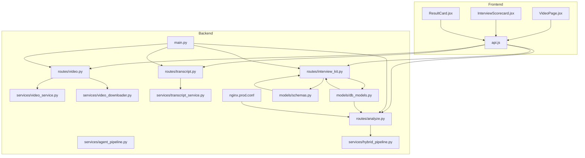

**Diagram sources**
- [video.py:1-68](file://app/backend/routes/video.py#L1-L68)
- [transcript.py:1-206](file://app/backend/routes/transcript.py#L1-L206)
- [analyze.py:1-813](file://app/backend/routes/analyze.py#L1-L813)
- [interview_kit.py:1-224](file://app/backend/routes/interview_kit.py#L1-L224)
- [video_service.py:1-398](file://app/backend/services/video_service.py#L1-L398)
- [video_downloader.py:1-263](file://app/backend/services/video_downloader.py#L1-L263)
- [transcript_service.py:1-221](file://app/backend/services/transcript_service.py#L1-L221)
- [agent_pipeline.py:724-730](file://app/backend/services/agent_pipeline.py#L724-L730)
- [hybrid_pipeline.py:1-1498](file://app/backend/services/hybrid_pipeline.py#L1-L1498)
- [main.py:1-327](file://app/backend/main.py#L1-L327)
- [db_models.py:218-257](file://app/backend/models/db_models.py#L218-L257)
- [schemas.py:441-517](file://app/backend/models/schemas.py#L441-L517)
- [nginx.prod.conf:43-102](file://app/nginx/nginx.prod.conf#L43-L102)

**Section sources**
- [video.py:1-68](file://app/backend/routes/video.py#L1-L68)
- [transcript.py:1-206](file://app/backend/routes/transcript.py#L1-L206)
- [analyze.py:1-813](file://app/backend/routes/analyze.py#L1-L813)
- [interview_kit.py:1-224](file://app/backend/routes/interview_kit.py#L1-L224)
- [video_service.py:1-398](file://app/backend/services/video_service.py#L1-L398)
- [video_downloader.py:1-263](file://app/backend/services/video_downloader.py#L1-L263)
- [transcript_service.py:1-221](file://app/backend/services/transcript_service.py#L1-L221)
- [agent_pipeline.py:724-730](file://app/backend/services/agent_pipeline.py#L724-L730)
- [hybrid_pipeline.py:1-1498](file://app/backend/services/hybrid_pipeline.py#L1-L1498)
- [main.py:1-327](file://app/backend/main.py#L1-L327)
- [db_models.py:218-257](file://app/backend/models/db_models.py#L218-L257)
- [schemas.py:441-517](file://app/backend/models/schemas.py#L441-L517)
- [nginx.prod.conf:43-102](file://app/nginx/nginx.prod.conf#L43-L102)

## Core Components
- Video ingestion and preprocessing:
  - Accepts uploaded videos or public URLs, downloads remote recordings, and runs transcription.
  - Extracts pause signals and audio anomalies to inform integrity checks.
  - Performs parallel communication quality and malpractice analysis using LLMs.
- Transcript analysis:
  - Parses plain text, WebVTT, and SRT transcripts, cleans speaker labels, and evaluates against job descriptions.
- Resume analysis pipeline (for comparison):
  - Hybrid pipeline with Python-first deterministic scoring and a single LLM call for narrative.
  - Supports streaming SSE with heartbeat pings to maintain connections.
- Interview Kit Evaluation Framework:
  - Structured interview questions generation with evaluation guidance.
  - Per-question evaluation system with rating categories (strong/adequate/weak).
  - Overall assessment and recommendation workflow for hiring managers.
  - Real-time collaborative evaluation interface with scoring cards.
  - **Updated** Experience Deep-Dive category with three specialized questions for comprehensive candidate assessment.

**Section sources**
- [video_service.py:25-398](file://app/backend/services/video_service.py#L25-L398)
- [video_downloader.py:125-263](file://app/backend/services/video_downloader.py#L125-L263)
- [transcript_service.py:21-221](file://app/backend/services/transcript_service.py#L21-L221)
- [hybrid_pipeline.py:1262-1498](file://app/backend/services/hybrid_pipeline.py#L1262-L1498)
- [interview_kit.py:38-224](file://app/backend/routes/interview_kit.py#L38-L224)

## Architecture Overview
The system integrates four major analysis paths with enhanced evaluation framework:
- Video interview analysis: transcription → communication quality + malpractice detection (parallel).
- Transcript analysis: parse → clean → LLM evaluation against job description.
- Resume analysis: Python rules → LLM narrative (streaming SSE).
- Interview Kit Evaluation: structured questions → per-question evaluation → scoring card generation.

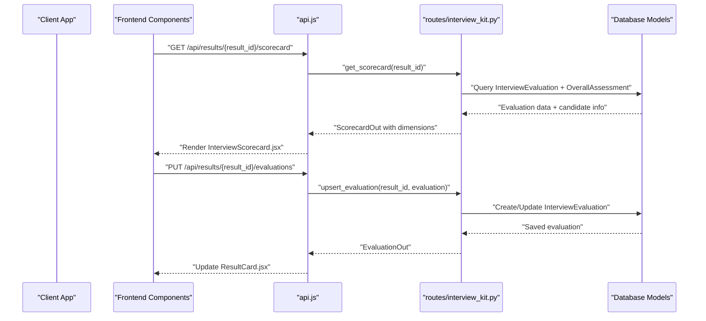

**Diagram sources**
- [interview_kit.py:142-224](file://app/backend/routes/interview_kit.py#L142-L224)
- [db_models.py:218-257](file://app/backend/models/db_models.py#L218-L257)
- [InterviewScorecard.jsx:64-231](file://app/frontend/src/components/InterviewScorecard.jsx#L64-L231)
- [ResultCard.jsx:276-306](file://app/frontend/src/components/ResultCard.jsx#L276-L306)

**Section sources**
- [video.py:1-68](file://app/backend/routes/video.py#L1-L68)
- [video_downloader.py:1-263](file://app/backend/services/video_downloader.py#L1-L263)
- [video_service.py:1-398](file://app/backend/services/video_service.py#L1-L398)
- [interview_kit.py:1-224](file://app/backend/routes/interview_kit.py#L1-L224)

## Detailed Component Analysis

### Video Interview Analysis Pipeline
End-to-end flow:
- Accepts file upload or public URL.
- Downloads remote video if needed.
- Transcribes audio to text with segment timestamps.
- Extracts pause signals and audio anomalies.
- Runs communication quality and malpractice detection in parallel using LLMs.
- Aggregates results and returns structured insights.

**Diagram sources**
- [video_service.py:25-398](file://app/backend/services/video_service.py#L25-L398)
- [video_downloader.py:125-176](file://app/backend/services/video_downloader.py#L125-L176)

**Section sources**
- [video_service.py:25-398](file://app/backend/services/video_service.py#L25-L398)
- [video_downloader.py:125-176](file://app/backend/services/video_downloader.py#L125-L176)

### Transcript Analysis Pipeline
- Parses formats: plain text, WebVTT, SRT.
- Strips headers, cues, timestamps, and speaker labels.
- Sends cleaned transcript and job description to LLM for unbiased evaluation.
- Normalizes and validates JSON output, with fallbacks on failures.

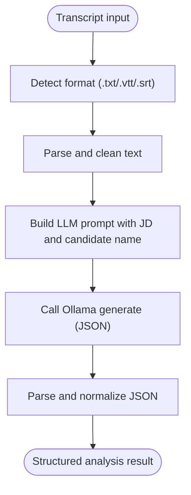

**Diagram sources**
- [transcript_service.py:21-221](file://app/backend/services/transcript_service.py#L21-L221)

**Section sources**
- [transcript_service.py:1-221](file://app/backend/services/transcript_service.py#L1-L221)

### Resume Analysis Pipeline (Streaming SSE)
- Python-first deterministic scoring: JD parsing, skills matching, education, experience, domain/architecture, risk signals.
- Single LLM call generates narrative, strengths/weaknesses, and interview questions.
- Streaming endpoint emits stages: parsing (scores), scoring (narrative), complete (merged result).
- Heartbeat pings keep connections alive across proxies.

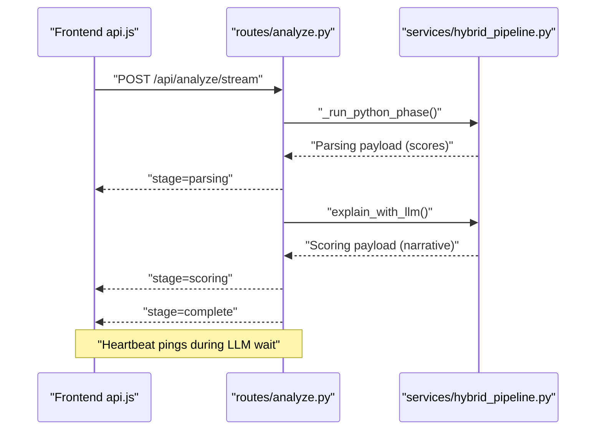

**Diagram sources**
- [analyze.py:506-646](file://app/backend/routes/analyze.py#L506-L646)
- [hybrid_pipeline.py:1410-1498](file://app/backend/services/hybrid_pipeline.py#L1410-L1498)

**Section sources**
- [analyze.py:506-646](file://app/backend/routes/analyze.py#L506-L646)
- [hybrid_pipeline.py:1410-1498](file://app/backend/services/hybrid_pipeline.py#L1410-L1498)

### Streaming Response Implementation
- SSE endpoint streams structured events with stage markers.
- Nginx disables proxy buffering for SSE to avoid 524 timeouts.
- Frontend reads chunks, parses events, and updates UI progressively.

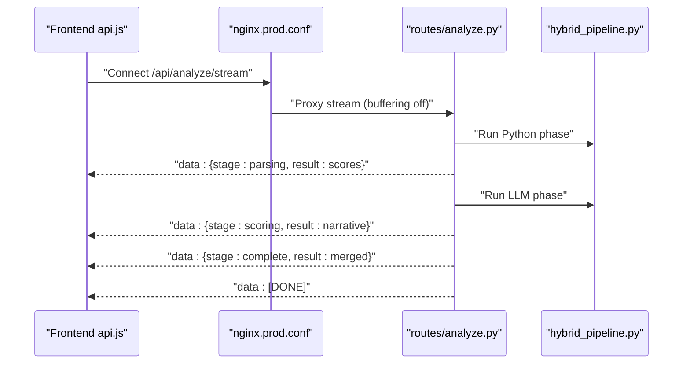

**Diagram sources**
- [nginx.prod.conf:66-95](file://app/nginx/nginx.prod.conf#L66-L95)
- [analyze.py:506-646](file://app/backend/routes/analyze.py#L506-L646)
- [api.js:93-141](file://app/frontend/src/lib/api.js#L93-L141)

**Section sources**
- [nginx.prod.conf:66-95](file://app/nginx/nginx.prod.conf#L66-L95)
- [analyze.py:506-646](file://app/backend/routes/analyze.py#L506-L646)
- [api.js:93-141](file://app/frontend/src/lib/api.js#L93-L141)

### Integration Between Video and Transcript Services
- Both services rely on LLMs for analysis and return structured JSON.
- Video service focuses on spoken content, timing, and fluency; transcript service focuses on textual alignment with job requirements.
- Results can be combined at higher levels (e.g., candidate evaluation) by aggregating scores and flags.

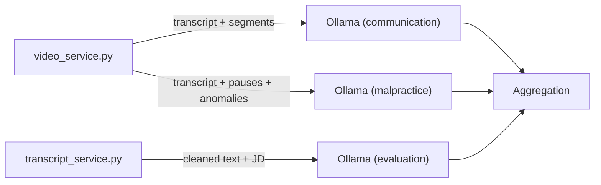

**Diagram sources**
- [video_service.py:127-297](file://app/backend/services/video_service.py#L127-L297)
- [transcript_service.py:186-221](file://app/backend/services/transcript_service.py#L186-L221)

**Section sources**
- [video_service.py:127-297](file://app/backend/services/video_service.py#L127-L297)
- [transcript_service.py:186-221](file://app/backend/services/transcript_service.py#L186-L221)

### Data Flow and Result Aggregation
- Video pipeline returns:
  - Source metadata (filename, platform, URL)
  - Transcript, language, duration
  - Segment-level timestamps and metadata
  - Communication scores and key phrases
  - Malpractice flags, risk rating, and recommendations
- Transcript pipeline returns:
  - Fit score, technical depth, communication quality
  - JD alignment indicators
  - Strengths and improvement areas
  - Recommendation (proceed/hold/reject)
- Resume pipeline returns:
  - Scores, risk signals, recommendation
  - Narrative strengths/weaknesses and interview questions
  - Explainability breakdown
- Interview Kit framework returns:
  - Structured interview questions with evaluation guidance
  - Per-question ratings and notes
  - Comprehensive scoring card with dimension summaries
  - **Updated** Experience Deep-Dive dimension with specialized questions

**Section sources**
- [video_service.py:349-357](file://app/backend/services/video_service.py#L349-L357)
- [transcript_service.py:137-183](file://app/backend/services/transcript_service.py#L137-L183)
- [hybrid_pipeline.py:1262-1333](file://app/backend/services/hybrid_pipeline.py#L1262-L1333)
- [interview_kit.py:140-224](file://app/backend/routes/interview_kit.py#L140-L224)

### AI-Powered Analysis Techniques
- Keyword extraction:
  - Video: key phrases from communication analysis.
  - Transcript: extracted from LLM output aligned with JD.
- Tone and fluency:
  - Communication analysis scores clarity and articulation.
  - Malpractice detection flags scripted reading, inconsistent fluency, and suspicious pauses.
- Competency scoring:
  - Resume pipeline computes weighted fit score from skills, experience, education, timeline, domain, architecture, and risk penalties.
  - Transcript pipeline compares candidate responses to JD requirements.
- Interview evaluation scoring:
  - Structured rating system (strong/adequate/weak) with detailed notes.
  - Dimension-based scoring cards for technical, behavioral, culture fit, and **Updated** Experience Deep-Dive categories.

**Section sources**
- [video_service.py:127-180](file://app/backend/services/video_service.py#L127-L180)
- [transcript_service.py:83-115](file://app/backend/services/transcript_service.py#L83-L115)
- [hybrid_pipeline.py:964-1058](file://app/backend/services/hybrid_pipeline.py#L964-L1058)
- [interview_kit.py:441-475](file://app/backend/models/schemas.py#L441-L475)

### Examples of Workflow Execution
- Video URL analysis:
  - Input: public Zoom/Teams/Loom/Dropbox/YouTube link.
  - Process: download, transcribe, parallel LLM analysis, merge results.
  - Output: structured JSON with communication and malpractice insights.
- Transcript file analysis:
  - Input: .txt/.vtt/.srt file or pasted text.
  - Process: parse, clean, build prompt, LLM evaluation, normalize.
  - Output: fit score, strengths, weaknesses, recommendation.
- Interview evaluation workflow:
  - Input: structured interview questions with evaluation guidance.
  - Process: recruiter rates responses, adds notes, generates scoring card.
  - Output: comprehensive evaluation report with dimension summaries.
  - **Updated** Experience Deep-Dive questions provide deeper insights into candidate experience and growth.
- Frontend experience:
  - Upload or paste URL, observe progress steps, view results with notable phrases and recommendations.
  - Access interview scoring interface, evaluate questions, generate shareable scorecards.

**Section sources**
- [video.py:52-67](file://app/backend/routes/video.py#L52-L67)
- [transcript.py:28-118](file://app/backend/routes/transcript.py#L28-L118)
- [interview_kit.py:38-138](file://app/backend/routes/interview_kit.py#L38-L138)
- [VideoPage.jsx:587-604](file://app/frontend/src/pages/VideoPage.jsx#L587-L604)
- [InterviewScorecard.jsx:64-231](file://app/frontend/src/components/InterviewScorecard.jsx#L64-L231)

## Interview Kit Evaluation Framework

### Structured Interview Questions Generation
The Interview Kit framework generates highly targeted, non-generic interview questions based on candidate profiles and job requirements:

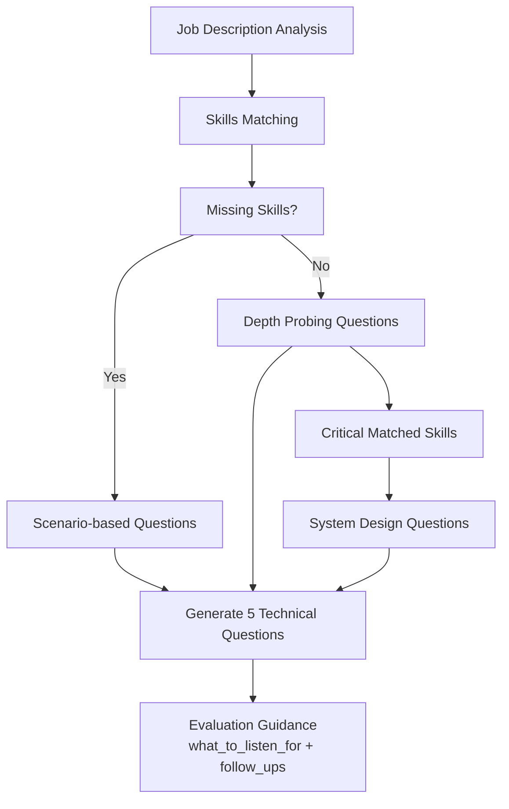

**Diagram sources**
- [agent_pipeline.py:724-730](file://app/backend/services/agent_pipeline.py#L724-L730)

**Section sources**
- [agent_pipeline.py:724-730](file://app/backend/services/agent_pipeline.py#L724-L730)

### Per-Question Evaluation System
The evaluation framework provides granular assessment capabilities:

- **Rating Categories**: strong, adequate, weak with detailed validation
- **Evaluation Tracking**: per-question, per-category, per-user persistence
- **Real-time Collaboration**: multiple recruiters can evaluate the same candidate
- **Quality Assurance**: unique constraints prevent duplicate evaluations

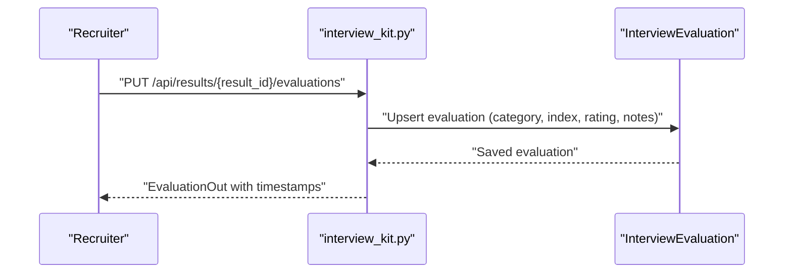

**Diagram sources**
- [interview_kit.py:38-80](file://app/backend/routes/interview_kit.py#L38-L80)
- [db_models.py:218-238](file://app/backend/models/db_models.py#L218-L238)

**Section sources**
- [interview_kit.py:38-80](file://app/backend/routes/interview_kit.py#L38-L80)
- [db_models.py:218-238](file://app/backend/models/db_models.py#L218-L238)
- [schemas.py:441-475](file://app/backend/models/schemas.py#L441-L475)

### Scoring Card Generation
The framework generates comprehensive evaluation reports:

- **Dimension Summaries**: Technical, Behavioral, Culture Fit, and **Updated** Experience Deep-Dive with counts and key notes
- **Overall Assessment**: Hiring manager's recommendation and final evaluation
- **Export Functionality**: PDF generation for sharing with stakeholders
- **Real-time Updates**: Live scoring card updates as evaluations are added

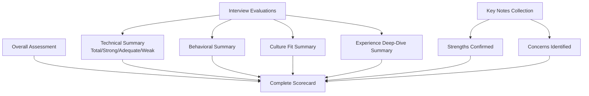

**Diagram sources**
- [interview_kit.py:140-224](file://app/backend/routes/interview_kit.py#L140-L224)

**Section sources**
- [interview_kit.py:140-224](file://app/backend/routes/interview_kit.py#L140-L224)
- [schemas.py:490-517](file://app/backend/models/schemas.py#L490-L517)

### Database Schema and Validation
The evaluation framework introduces robust data structures:

- **InterviewEvaluation Table**: per-question recruiter ratings and notes
- **OverallAssessment Table**: hiring manager's final recommendation
- **Validation Rules**: strict category and rating validation
- **Tenant Isolation**: secure multi-tenant evaluation data
- **Unique Constraints**: prevent duplicate evaluations

**Section sources**
- [017_interview_kit_enhancement.py:23-61](file://alembic/versions/017_interview_kit_enhancement.py#L23-L61)
- [db_models.py:218-257](file://app/backend/models/db_models.py#L218-L257)
- [schemas.py:441-517](file://app/backend/models/schemas.py#L441-L517)

## Experience Deep-Dive Category Enhancement

### Expanded Interview Kit Structure
The interview kit has been enhanced from 12 to 15 questions with the addition of the Experience Deep-Dive category:

- **Technical Questions (5)**: Scenario-based, depth probing, system design
- **Behavioral Questions (4)**: STAR format, situational judgment
- **Culture Fit Questions (3)**: Alignment, values assessment
- **Experience Deep-Dive Questions (3)**: **New category** for comprehensive experience assessment

### Experience Deep-Dive Question Types
The three specialized questions target different aspects of candidate experience:

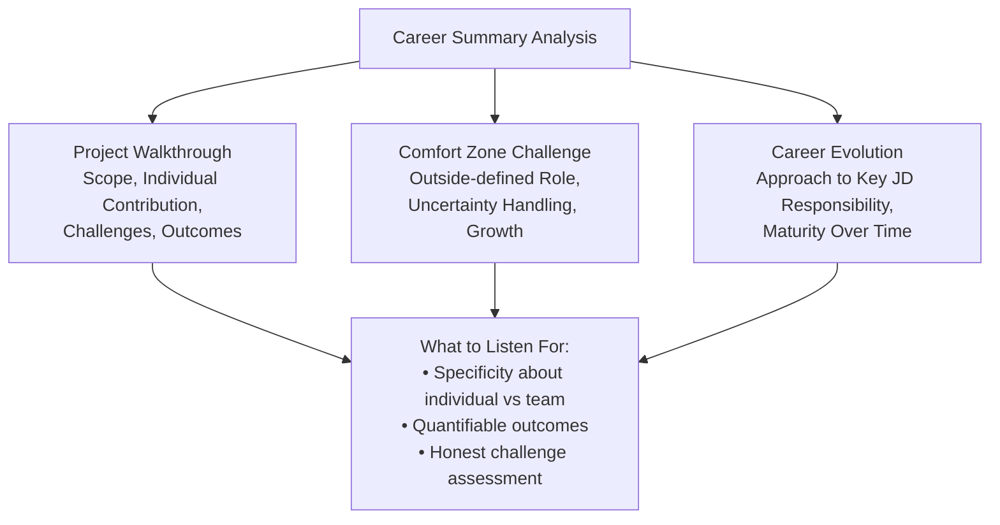

**Diagram sources**
- [agent_pipeline.py:748-752](file://app/backend/services/agent_pipeline.py#L748-L752)
- [agent_pipeline.py:991-1017](file://app/backend/services/agent_pipeline.py#L991-L1017)

### Backend Integration
The Experience Deep-Dive category is fully integrated into the backend evaluation framework:

- **Schema Validation**: New category included in allowed question categories
- **Database Storage**: Separate dimension tracking in scoring cards
- **Frontend Display**: Dedicated Experience Deep-Dive tab in evaluation interface
- **API Endpoints**: Seamless integration with existing evaluation endpoints

**Section sources**
- [agent_pipeline.py:748-752](file://app/backend/services/agent_pipeline.py#L748-L752)
- [interview_kit.py:169](file://app/backend/routes/interview_kit.py#L169)
- [schemas.py:449-455](file://app/backend/models/schemas.py#L449-L455)
- [InterviewScorecard.jsx:161](file://app/frontend/src/components/InterviewScorecard.jsx#L161)

### Frontend Implementation
The frontend components have been updated to support the new Experience Deep-Dive category:

- **Scorecard Display**: New Experience Deep-Dive dimension card with dedicated icon
- **Evaluation Interface**: Questions categorized under Experience Deep-Dive tab
- **Real-time Updates**: Live scoring card updates including Experience Deep-Dive metrics

**Section sources**
- [InterviewScorecard.jsx:161](file://app/frontend/src/components/InterviewScorecard.jsx#L161)
- [ResultCard.jsx:953](file://app/frontend/src/components/ResultCard.jsx#L953)

## Dependency Analysis
- External dependencies:
  - Ollama for LLM inference (communication, malpractice, transcript evaluation, narrative, interview question generation).
  - faster-whisper for transcription.
  - yt-dlp for YouTube downloads (optional).
- Internal dependencies:
  - Routes depend on services for processing.
  - Services depend on models for persistence and caching.
  - Streaming relies on Nginx configuration to disable buffering.
  - Interview Kit framework depends on SQLAlchemy models and Pydantic schemas.

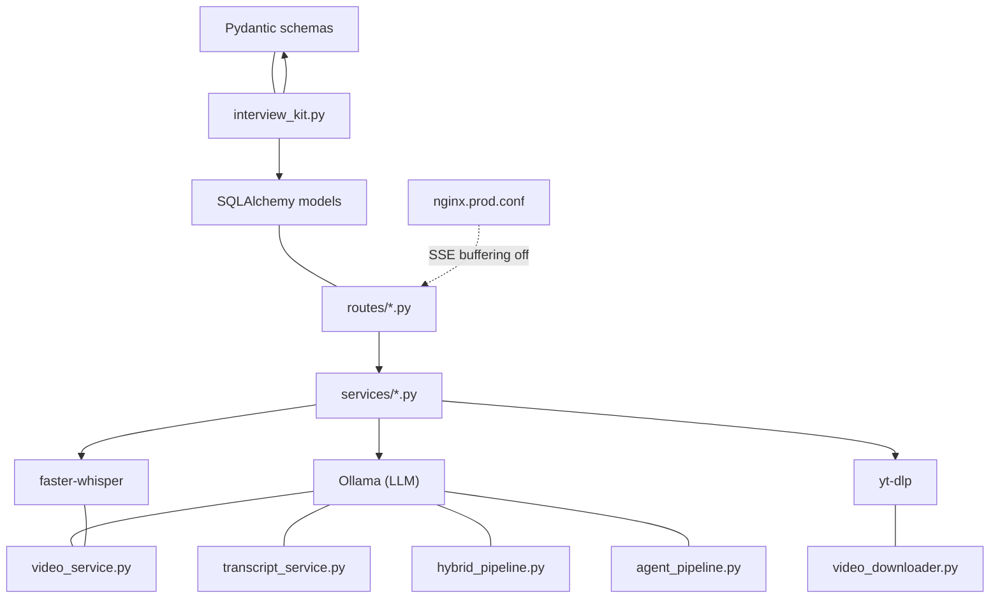

**Diagram sources**
- [video_service.py](file://app/backend/services/video_service.py#L16)
- [transcript_service.py:15-16](file://app/backend/services/transcript_service.py#L15-L16)
- [hybrid_pipeline.py:49-66](file://app/backend/services/hybrid_pipeline.py#L49-L66)
- [agent_pipeline.py:724-730](file://app/backend/services/agent_pipeline.py#L724-L730)
- [video_downloader.py:230-236](file://app/backend/services/video_downloader.py#L230-L236)
- [interview_kit.py:12-19](file://app/backend/routes/interview_kit.py#L12-L19)
- [nginx.prod.conf:81-85](file://app/nginx/nginx.prod.conf#L81-L85)

**Section sources**
- [video_service.py:1-30](file://app/backend/services/video_service.py#L1-L30)
- [transcript_service.py:1-20](file://app/backend/services/transcript_service.py#L1-L20)
- [hybrid_pipeline.py:1-66](file://app/backend/services/hybrid_pipeline.py#L1-L66)
- [agent_pipeline.py:724-730](file://app/backend/services/agent_pipeline.py#L724-L730)
- [video_downloader.py:1-20](file://app/backend/services/video_downloader.py#L1-L20)
- [interview_kit.py:1-224](file://app/backend/routes/interview_kit.py#L1-L224)
- [nginx.prod.conf:81-85](file://app/nginx/nginx.prod.conf#L81-L85)

## Performance Considerations
- Concurrency:
  - Video transcription runs in a thread pool executor; communication and malpractice analysis run concurrently.
  - Hybrid pipeline limits concurrent LLM calls with a semaphore.
  - Interview Kit evaluation queries are optimized with proper indexing.
- Model readiness:
  - Startup checks verify Ollama availability and model presence; cold models delay first requests.
  - Interview question generation uses specialized prompts for better performance.
- Streaming:
  - Nginx disables buffering for SSE to prevent 524 timeouts; heartbeat pings maintain connection.
  - Real-time evaluation updates use efficient database queries.
- Resource limits:
  - File size caps for uploads and downloads; timeouts for external services.
  - Database constraints prevent data duplication and maintain integrity.

**Section sources**
- [video_service.py:333-347](file://app/backend/services/video_service.py#L333-L347)
- [hybrid_pipeline.py:24-32](file://app/backend/services/hybrid_pipeline.py#L24-L32)
- [main.py:68-149](file://app/backend/main.py#L68-L149)
- [nginx.prod.conf:81-95](file://app/nginx/nginx.prod.conf#L81-L95)
- [interview_kit.py:28-36](file://app/backend/routes/interview_kit.py#L28-L36)

## Troubleshooting Guide
- Video analysis fails:
  - Verify Ollama availability and model readiness; check URL accessibility and file size limits.
  - Inspect temporary file cleanup and transcription errors.
- Transcript analysis fails:
  - Ensure valid JD template and candidate selection; confirm parsed text length thresholds.
  - Validate JSON parsing and fallback behavior.
- Streaming stalls:
  - Confirm Nginx SSE configuration (buffering off, heartbeat pings).
  - Check frontend event parsing and connection handling.
- Interview Kit evaluation issues:
  - Verify tenant isolation and authentication for evaluation endpoints.
  - Check validation rules for category and rating values.
  - Ensure proper database migration for evaluation tables.
  - **Updated** Verify Experience Deep-Dive category validation in schema.
- Database and usage:
  - Monitor tenant plans and usage counters; verify candidate deduplication and profile storage.
  - Check unique constraint violations for duplicate evaluations.

**Section sources**
- [video_service.py:56-63](file://app/backend/services/video_service.py#L56-L63)
- [transcript_service.py:173-183](file://app/backend/services/transcript_service.py#L173-L183)
- [analyze.py:506-646](file://app/backend/routes/analyze.py#L506-L646)
- [interview_kit.py:28-36](file://app/backend/routes/interview_kit.py#L28-L36)
- [nginx.prod.conf:81-95](file://app/nginx/nginx.prod.conf#L81-L95)
- [db_models.py:97-147](file://app/backend/models/db_models.py#L97-L147)

## Conclusion
The interview analysis workflow integrates robust video and transcript processing with AI-powered insights and comprehensive evaluation framework. The video pipeline extracts timing and fluency signals, while the transcript pipeline evaluates textual alignment with job requirements. The hybrid resume pipeline provides deterministic scoring augmented by a single LLM narrative. The new Interview Kit Evaluation Framework enhances the system with structured interview questions, per-question evaluation capabilities, and comprehensive scoring cards that enable collaborative hiring processes. 

**Updated** The Experience Deep-Dive category expansion from 12 to 15 questions provides deeper insights into candidate experience, growth potential, and professional evolution. This enhancement strengthens the evaluation framework by adding three specialized questions that assess project leadership, adaptability, and career progression. Real-time streaming SSE ensures responsive user experiences, while the evaluation framework provides detailed assessment workflows for hiring managers. Together, these components deliver actionable candidate evaluations grounded in structured data, AI analysis, and human expertise, now with enhanced experience-based assessment capabilities.