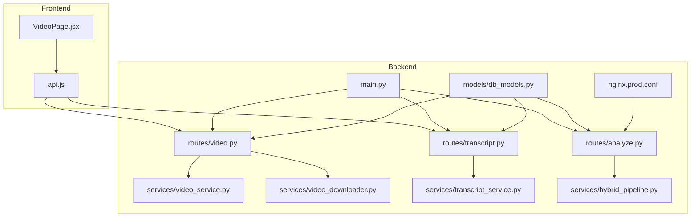
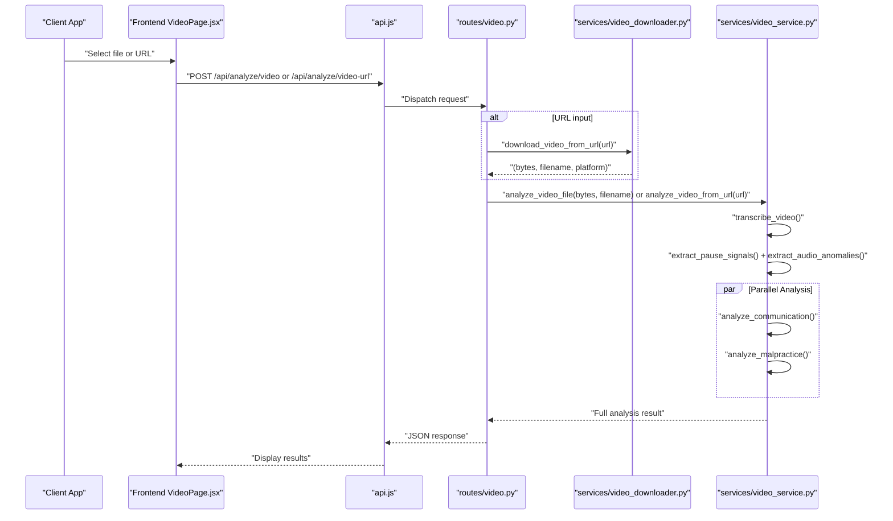
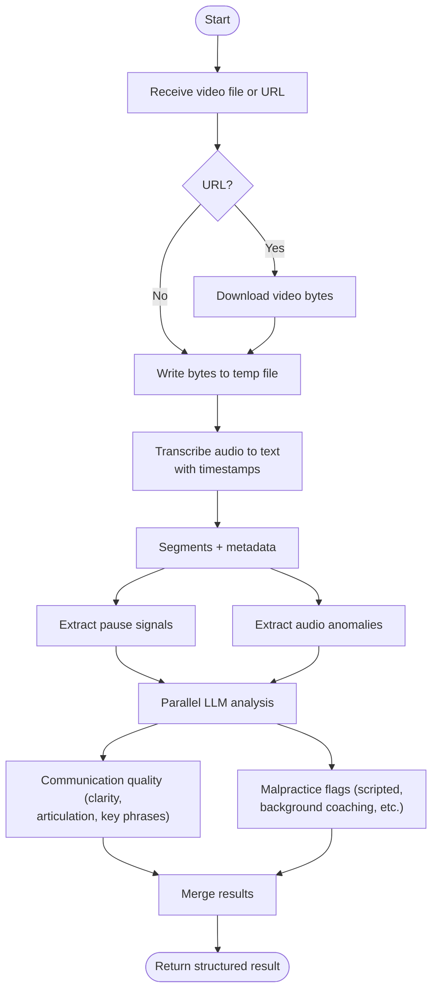
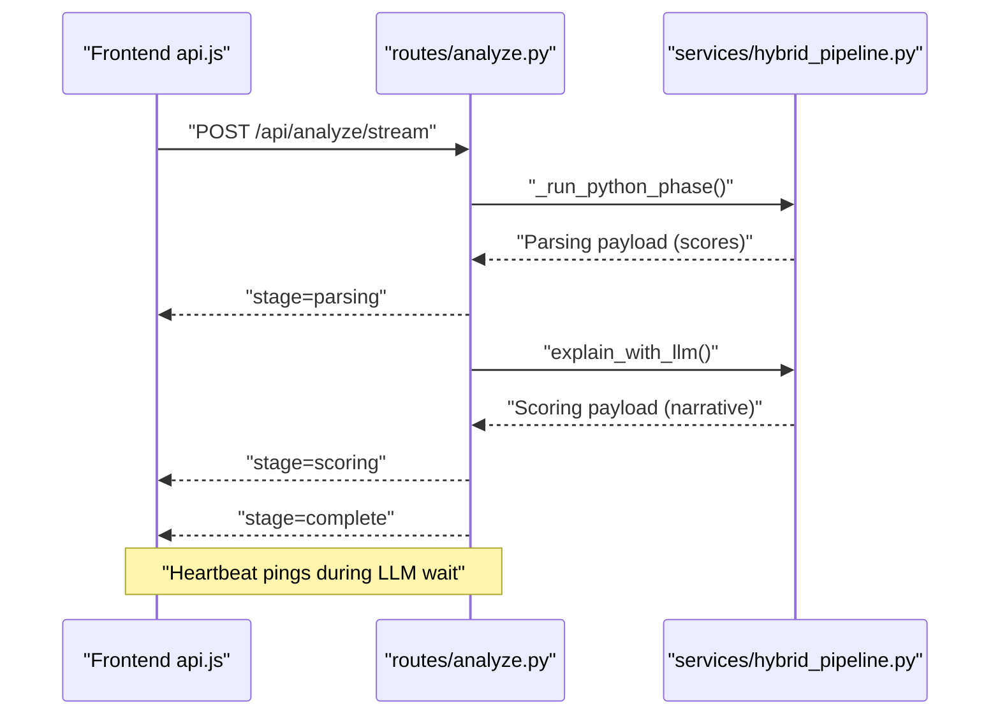
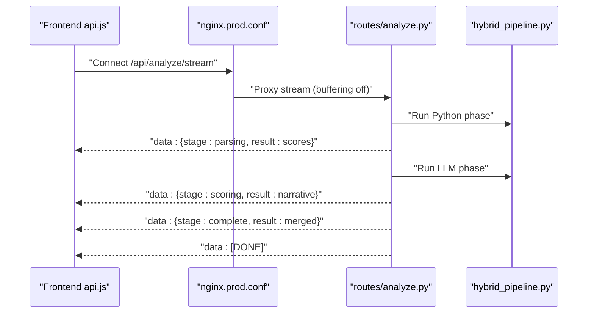
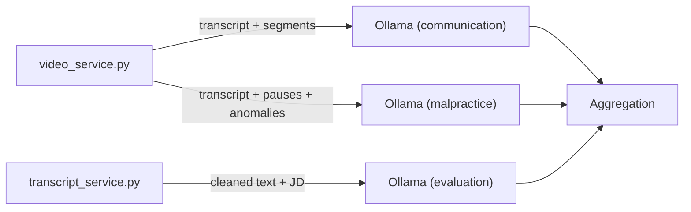
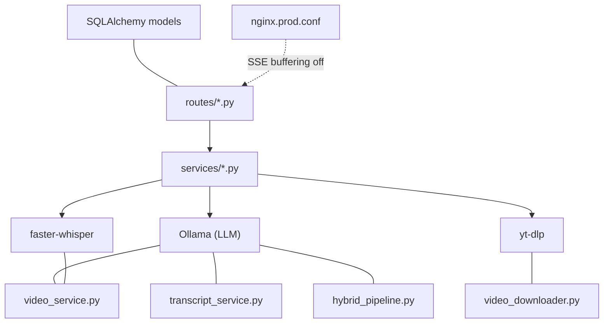

# Interview Analysis Workflow

<cite>
**Referenced Files in This Document**
- [video_service.py](file://app/backend/services/video_service.py)
- [video_downloader.py](file://app/backend/services/video_downloader.py)
- [transcript_service.py](file://app/backend/services/transcript_service.py)
- [video.py](file://app/backend/routes/video.py)
- [transcript.py](file://app/backend/routes/transcript.py)
- [analyze.py](file://app/backend/routes/analyze.py)
- [hybrid_pipeline.py](file://app/backend/services/hybrid_pipeline.py)
- [main.py](file://app/backend/main.py)
- [db_models.py](file://app/backend/models/db_models.py)
- [nginx.prod.conf](file://app/nginx/nginx.prod.conf)
- [VideoPage.jsx](file://app/frontend/src/pages/VideoPage.jsx)
- [api.js](file://app/frontend/src/lib/api.js)
</cite>

## Table of Contents
1. [Introduction](#introduction)
2. [Project Structure](#project-structure)
3. [Core Components](#core-components)
4. [Architecture Overview](#architecture-overview)
5. [Detailed Component Analysis](#detailed-component-analysis)
6. [Dependency Analysis](#dependency-analysis)
7. [Performance Considerations](#performance-considerations)
8. [Troubleshooting Guide](#troubleshooting-guide)
9. [Conclusion](#conclusion)

## Introduction
This document describes the complete interview analysis workflow from video ingestion to insights generation. It covers the end-to-end pipeline including video preprocessing, audio extraction, transcript generation, sentiment and competency scoring, and real-time streaming updates. It also explains the integration between video_service and transcript_service components, data flow between processing stages, and result aggregation. The AI-powered analysis leverages keyword extraction, tone analysis, response quality assessment, and candidate evaluation metrics. The document includes examples of workflow execution, intermediate data formats, and result interpretation, along with performance optimization, error recovery, and quality assurance measures.

## Project Structure
The interview analysis spans backend services, routes, and frontend components:
- Backend services implement video transcription, communication analysis, malpractice detection, and transcript parsing/analysis.
- Routes expose endpoints for video analysis (file upload and URL), transcript analysis, and resume analysis with streaming support.
- Frontend pages and API clients render results and manage real-time updates.

**Diagram sources**
- [video.py:1-68](file://app/backend/routes/video.py#L1-L68)
- [transcript.py:1-206](file://app/backend/routes/transcript.py#L1-L206)
- [analyze.py:1-813](file://app/backend/routes/analyze.py#L1-L813)
- [video_service.py:1-398](file://app/backend/services/video_service.py#L1-L398)
- [video_downloader.py:1-263](file://app/backend/services/video_downloader.py#L1-L263)
- [transcript_service.py:1-221](file://app/backend/services/transcript_service.py#L1-L221)
- [hybrid_pipeline.py:1-1498](file://app/backend/services/hybrid_pipeline.py#L1-L1498)
- [main.py:1-327](file://app/backend/main.py#L1-L327)
- [db_models.py:1-250](file://app/backend/models/db_models.py#L1-L250)
- [nginx.prod.conf:43-102](file://app/nginx/nginx.prod.conf#L43-L102)

**Section sources**
- [video.py:1-68](file://app/backend/routes/video.py#L1-L68)
- [transcript.py:1-206](file://app/backend/routes/transcript.py#L1-L206)
- [analyze.py:1-813](file://app/backend/routes/analyze.py#L1-L813)
- [video_service.py:1-398](file://app/backend/services/video_service.py#L1-L398)
- [video_downloader.py:1-263](file://app/backend/services/video_downloader.py#L1-L263)
- [transcript_service.py:1-221](file://app/backend/services/transcript_service.py#L1-L221)
- [hybrid_pipeline.py:1-1498](file://app/backend/services/hybrid_pipeline.py#L1-L1498)
- [main.py:1-327](file://app/backend/main.py#L1-L327)
- [db_models.py:1-250](file://app/backend/models/db_models.py#L1-L250)
- [nginx.prod.conf:43-102](file://app/nginx/nginx.prod.conf#L43-L102)

## Core Components
- Video ingestion and preprocessing:
  - Accepts uploaded videos or public URLs, downloads remote recordings, and runs transcription.
  - Extracts pause signals and audio anomalies to inform integrity checks.
  - Performs parallel communication quality and malpractice analysis using LLMs.
- Transcript analysis:
  - Parses plain text, WebVTT, and SRT transcripts, cleans speaker labels, and evaluates against job descriptions.
- Resume analysis pipeline (for comparison):
  - Hybrid pipeline with Python-first deterministic scoring and a single LLM call for narrative.
  - Supports streaming SSE with heartbeat pings to maintain connections.

**Section sources**
- [video_service.py:25-398](file://app/backend/services/video_service.py#L25-L398)
- [video_downloader.py:125-263](file://app/backend/services/video_downloader.py#L125-L263)
- [transcript_service.py:21-221](file://app/backend/services/transcript_service.py#L21-L221)
- [hybrid_pipeline.py:1262-1498](file://app/backend/services/hybrid_pipeline.py#L1262-L1498)

## Architecture Overview
The system integrates three major analysis paths:
- Video interview analysis: transcription → communication quality + malpractice detection (parallel).
- Transcript analysis: parse → clean → LLM evaluation against job description.
- Resume analysis: Python rules → LLM narrative (streaming SSE).

**Diagram sources**
- [video.py:21-67](file://app/backend/routes/video.py#L21-L67)
- [video_downloader.py:125-176](file://app/backend/services/video_downloader.py#L125-L176)
- [video_service.py:331-398](file://app/backend/services/video_service.py#L331-L398)

**Section sources**
- [video.py:1-68](file://app/backend/routes/video.py#L1-L68)
- [video_downloader.py:1-263](file://app/backend/services/video_downloader.py#L1-L263)
- [video_service.py:1-398](file://app/backend/services/video_service.py#L1-L398)

## Detailed Component Analysis

### Video Interview Analysis Pipeline
End-to-end flow:
- Accepts file upload or public URL.
- Downloads remote video if needed.
- Transcribes audio to text with segment timestamps.
- Extracts pause signals and audio anomalies.
- Runs communication quality and malpractice detection in parallel using LLMs.
- Aggregates results and returns structured insights.

**Diagram sources**
- [video_service.py:25-398](file://app/backend/services/video_service.py#L25-L398)
- [video_downloader.py:125-176](file://app/backend/services/video_downloader.py#L125-L176)

**Section sources**
- [video_service.py:25-398](file://app/backend/services/video_service.py#L25-L398)
- [video_downloader.py:125-176](file://app/backend/services/video_downloader.py#L125-L176)

### Transcript Analysis Pipeline
- Parses formats: plain text, WebVTT, SRT.
- Strips headers, cues, timestamps, and speaker labels.
- Sends cleaned transcript and job description to LLM for unbiased evaluation.
- Normalizes and validates JSON output, with fallbacks on failures.

**Diagram sources**
- [transcript_service.py:21-221](file://app/backend/services/transcript_service.py#L21-L221)

**Section sources**
- [transcript_service.py:1-221](file://app/backend/services/transcript_service.py#L1-L221)

### Resume Analysis Pipeline (Streaming SSE)
- Python-first deterministic scoring: JD parsing, skills matching, education, experience, domain/architecture, risk signals.
- Single LLM call generates narrative, strengths/weaknesses, and interview questions.
- Streaming endpoint emits stages: parsing (scores), scoring (narrative), complete (merged result).
- Heartbeat pings keep connections alive across proxies.

**Diagram sources**
- [analyze.py:506-646](file://app/backend/routes/analyze.py#L506-L646)
- [hybrid_pipeline.py:1410-1498](file://app/backend/services/hybrid_pipeline.py#L1410-L1498)

**Section sources**
- [analyze.py:506-646](file://app/backend/routes/analyze.py#L506-L646)
- [hybrid_pipeline.py:1410-1498](file://app/backend/services/hybrid_pipeline.py#L1410-L1498)

### Streaming Response Implementation
- SSE endpoint streams structured events with stage markers.
- Nginx disables proxy buffering for SSE to avoid 524 timeouts.
- Frontend reads chunks, parses events, and updates UI progressively.

**Diagram sources**
- [nginx.prod.conf:66-95](file://app/nginx/nginx.prod.conf#L66-L95)
- [analyze.py:506-646](file://app/backend/routes/analyze.py#L506-L646)
- [api.js:93-141](file://app/frontend/src/lib/api.js#L93-L141)

**Section sources**
- [nginx.prod.conf:66-95](file://app/nginx/nginx.prod.conf#L66-L95)
- [analyze.py:506-646](file://app/backend/routes/analyze.py#L506-L646)
- [api.js:93-141](file://app/frontend/src/lib/api.js#L93-L141)

### Integration Between Video and Transcript Services
- Both services rely on LLMs for analysis and return structured JSON.
- Video service focuses on spoken content, timing, and fluency; transcript service focuses on textual alignment with job requirements.
- Results can be combined at higher levels (e.g., candidate evaluation) by aggregating scores and flags.

**Diagram sources**
- [video_service.py:127-297](file://app/backend/services/video_service.py#L127-L297)
- [transcript_service.py:186-221](file://app/backend/services/transcript_service.py#L186-L221)

**Section sources**
- [video_service.py:127-297](file://app/backend/services/video_service.py#L127-L297)
- [transcript_service.py:186-221](file://app/backend/services/transcript_service.py#L186-L221)

### Data Flow and Result Aggregation
- Video pipeline returns:
  - Source metadata (filename, platform, URL)
  - Transcript, language, duration
  - Segment-level timestamps and metadata
  - Communication scores and key phrases
  - Malpractice flags, risk rating, and recommendations
- Transcript pipeline returns:
  - Fit score, technical depth, communication quality
  - JD alignment indicators
  - Strengths and improvement areas
  - Recommendation (proceed/hold/reject)
- Resume pipeline returns:
  - Scores, risk signals, recommendation
  - Narrative strengths/weaknesses and interview questions
  - Explainability breakdown

**Section sources**
- [video_service.py:349-357](file://app/backend/services/video_service.py#L349-L357)
- [transcript_service.py:137-183](file://app/backend/services/transcript_service.py#L137-L183)
- [hybrid_pipeline.py:1262-1333](file://app/backend/services/hybrid_pipeline.py#L1262-L1333)

### AI-Powered Analysis Techniques
- Keyword extraction:
  - Video: key phrases from communication analysis.
  - Transcript: extracted from LLM output aligned with JD.
- Tone and fluency:
  - Communication analysis scores clarity and articulation.
  - Malpractice detection flags scripted reading, inconsistent fluency, and suspicious pauses.
- Competency scoring:
  - Resume pipeline computes weighted fit score from skills, experience, education, timeline, domain, architecture, and risk penalties.
  - Transcript pipeline compares candidate responses to JD requirements.

**Section sources**
- [video_service.py:127-180](file://app/backend/services/video_service.py#L127-L180)
- [transcript_service.py:83-115](file://app/backend/services/transcript_service.py#L83-L115)
- [hybrid_pipeline.py:964-1058](file://app/backend/services/hybrid_pipeline.py#L964-L1058)

### Examples of Workflow Execution
- Video URL analysis:
  - Input: public Zoom/Teams/Loom/Dropbox/YouTube link.
  - Process: download, transcribe, parallel LLM analysis, merge results.
  - Output: structured JSON with communication and malpractice insights.
- Transcript file analysis:
  - Input: .txt/.vtt/.srt file or pasted text.
  - Process: parse, clean, build prompt, LLM evaluation, normalize.
  - Output: fit score, strengths, weaknesses, recommendation.
- Frontend experience:
  - Upload or paste URL, observe progress steps, view results with notable phrases and recommendations.

**Section sources**
- [video.py:52-67](file://app/backend/routes/video.py#L52-L67)
- [transcript.py:28-118](file://app/backend/routes/transcript.py#L28-L118)
- [VideoPage.jsx:587-604](file://app/frontend/src/pages/VideoPage.jsx#L587-L604)

## Dependency Analysis
- External dependencies:
  - Ollama for LLM inference (communication, malpractice, transcript evaluation, narrative).
  - faster-whisper for transcription.
  - yt-dlp for YouTube downloads (optional).
- Internal dependencies:
  - Routes depend on services for processing.
  - Services depend on models for persistence and caching.
  - Streaming relies on Nginx configuration to disable buffering.

**Diagram sources**
- [video_service.py](file://app/backend/services/video_service.py#L16)
- [transcript_service.py:15-16](file://app/backend/services/transcript_service.py#L15-L16)
- [hybrid_pipeline.py:49-66](file://app/backend/services/hybrid_pipeline.py#L49-L66)
- [video_downloader.py:230-236](file://app/backend/services/video_downloader.py#L230-L236)
- [nginx.prod.conf:81-85](file://app/nginx/nginx.prod.conf#L81-L85)

**Section sources**
- [video_service.py:1-30](file://app/backend/services/video_service.py#L1-L30)
- [transcript_service.py:1-20](file://app/backend/services/transcript_service.py#L1-L20)
- [hybrid_pipeline.py:1-66](file://app/backend/services/hybrid_pipeline.py#L1-L66)
- [video_downloader.py:1-20](file://app/backend/services/video_downloader.py#L1-L20)
- [nginx.prod.conf:81-85](file://app/nginx/nginx.prod.conf#L81-L85)

## Performance Considerations
- Concurrency:
  - Video transcription runs in a thread pool executor; communication and malpractice analysis run concurrently.
  - Hybrid pipeline limits concurrent LLM calls with a semaphore.
- Model readiness:
  - Startup checks verify Ollama reachability and model presence; cold models delay first requests.
- Streaming:
  - Nginx disables buffering for SSE to prevent 524 timeouts; heartbeat pings maintain connection.
- Resource limits:
  - File size caps for uploads and downloads; timeouts for external services.

**Section sources**
- [video_service.py:333-347](file://app/backend/services/video_service.py#L333-L347)
- [hybrid_pipeline.py:24-32](file://app/backend/services/hybrid_pipeline.py#L24-L32)
- [main.py:68-149](file://app/backend/main.py#L68-L149)
- [nginx.prod.conf:81-95](file://app/nginx/nginx.prod.conf#L81-L95)

## Troubleshooting Guide
- Video analysis fails:
  - Verify Ollama availability and model readiness; check URL accessibility and file size limits.
  - Inspect temporary file cleanup and transcription errors.
- Transcript analysis fails:
  - Ensure valid JD template and candidate selection; confirm parsed text length thresholds.
  - Validate JSON parsing and fallback behavior.
- Streaming stalls:
  - Confirm Nginx SSE configuration (buffering off, heartbeat pings).
  - Check frontend event parsing and connection handling.
- Database and usage:
  - Monitor tenant plans and usage counters; verify candidate deduplication and profile storage.

**Section sources**
- [video_service.py:56-63](file://app/backend/services/video_service.py#L56-L63)
- [transcript_service.py:173-183](file://app/backend/services/transcript_service.py#L173-L183)
- [analyze.py:506-646](file://app/backend/routes/analyze.py#L506-L646)
- [nginx.prod.conf:81-95](file://app/nginx/nginx.prod.conf#L81-L95)
- [db_models.py:97-147](file://app/backend/models/db_models.py#L97-L147)

## Conclusion
The interview analysis workflow integrates robust video and transcript processing with AI-powered insights. The video pipeline extracts timing and fluency signals, while the transcript pipeline evaluates textual alignment with job requirements. The hybrid resume pipeline provides deterministic scoring augmented by a single LLM narrative. Streaming SSE ensures responsive user experiences, and careful configuration maintains reliability under real-world conditions. Together, these components deliver actionable candidate evaluations grounded in structured data and AI analysis.