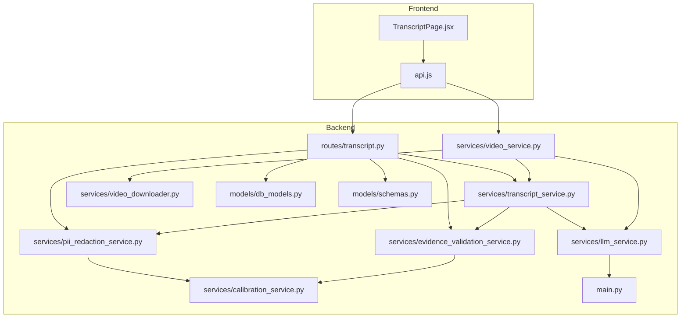
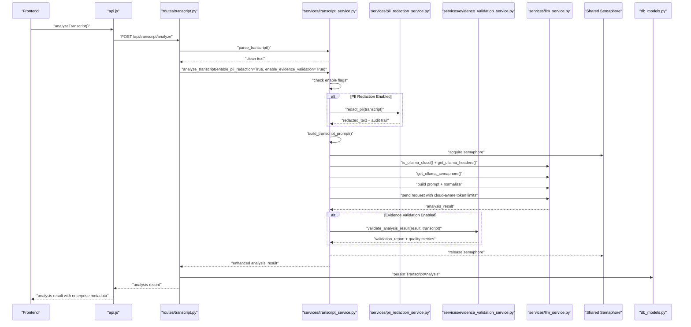
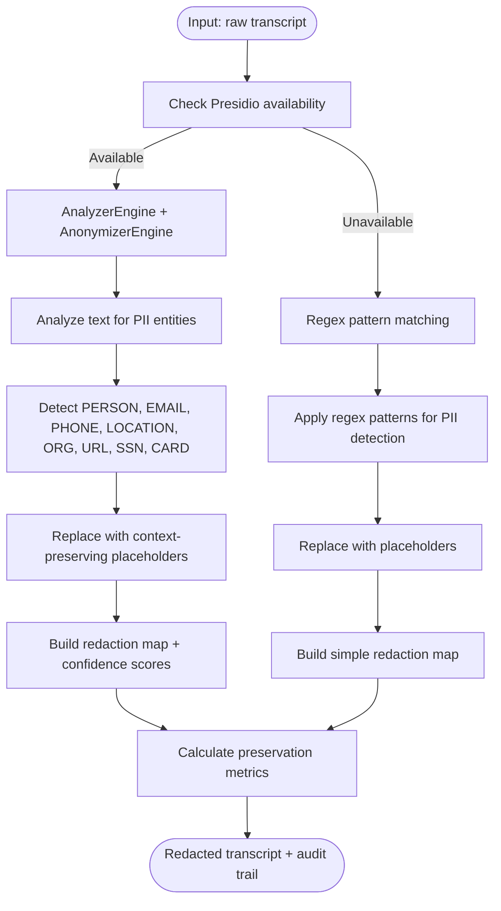
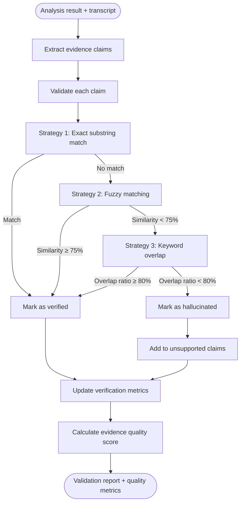
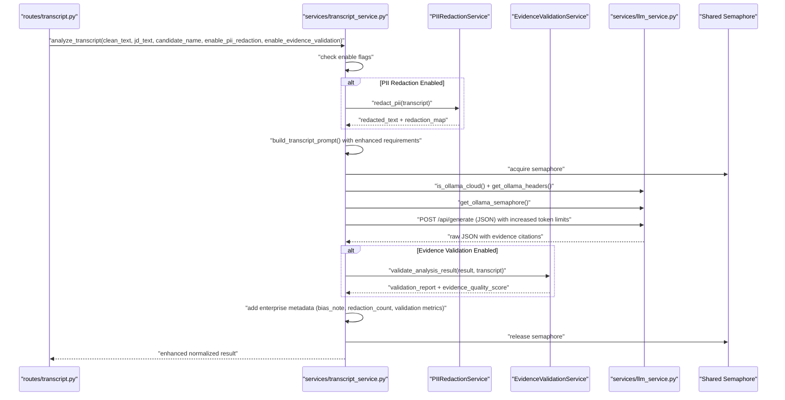
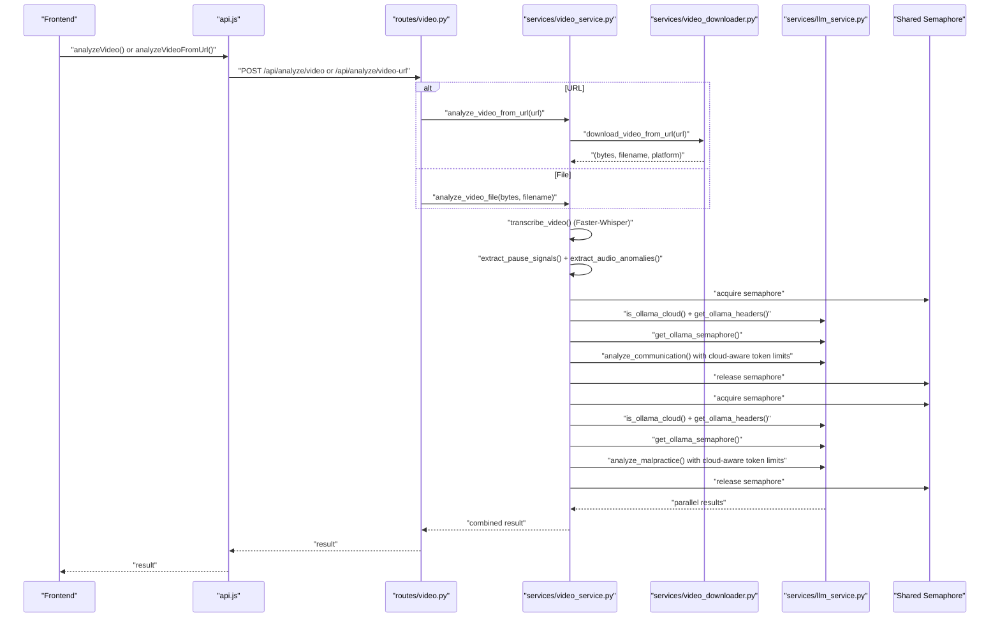
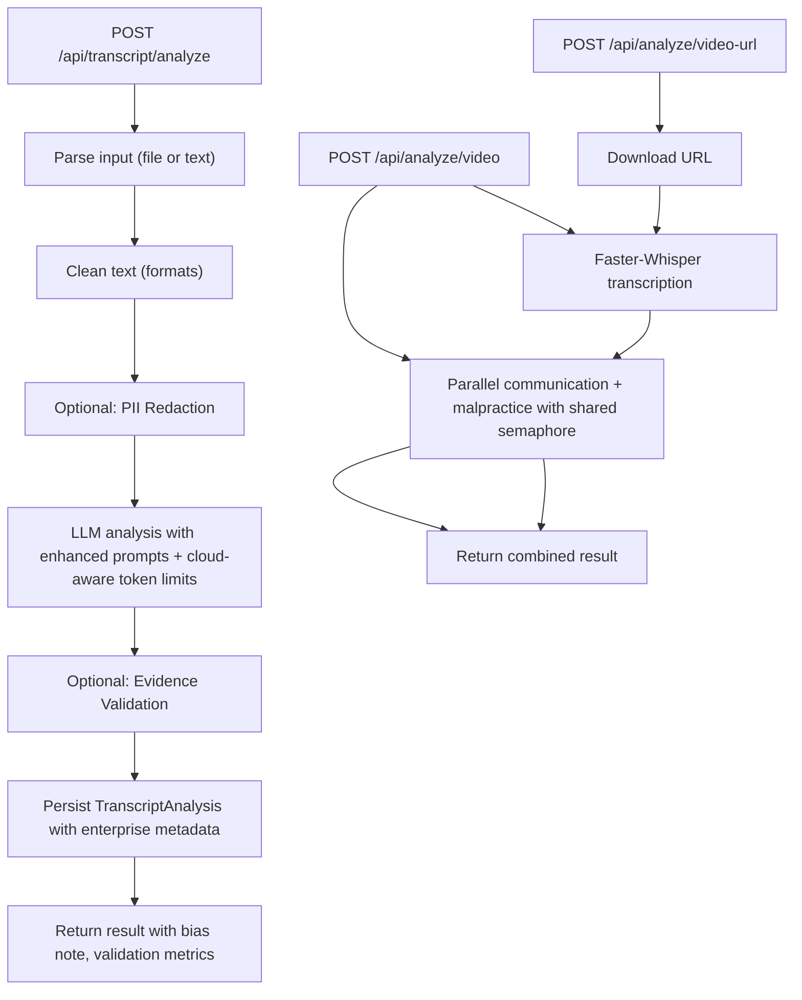
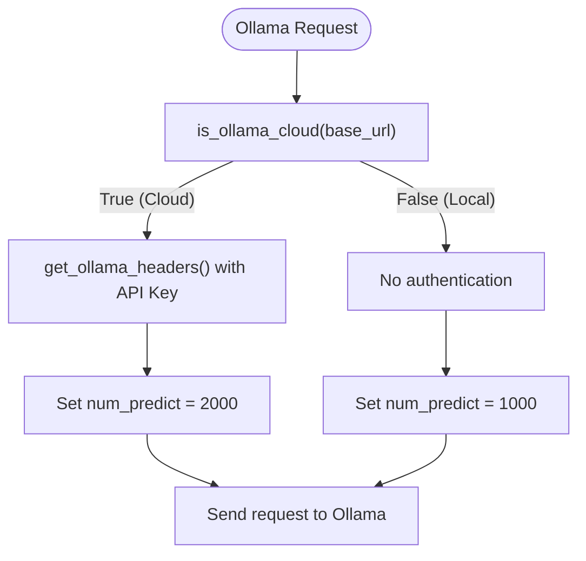
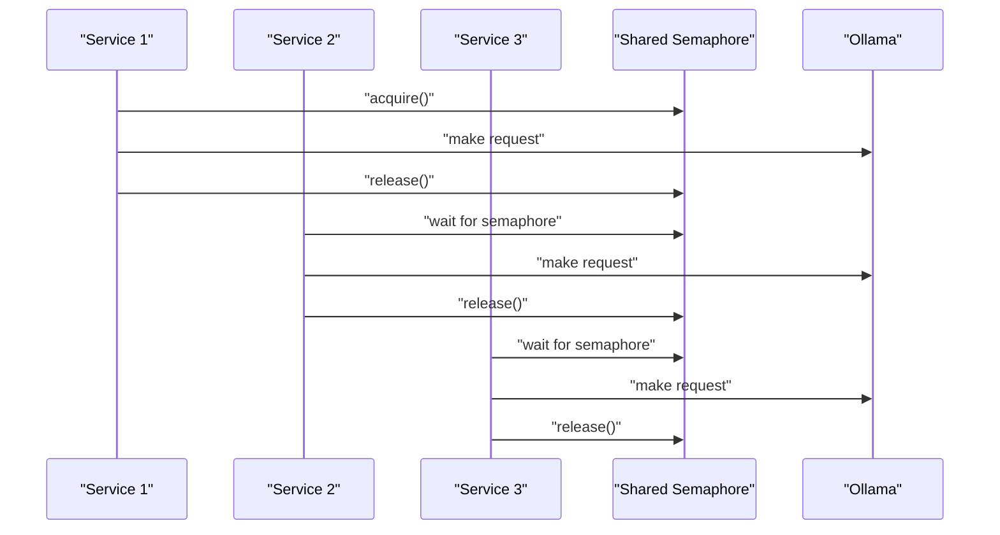
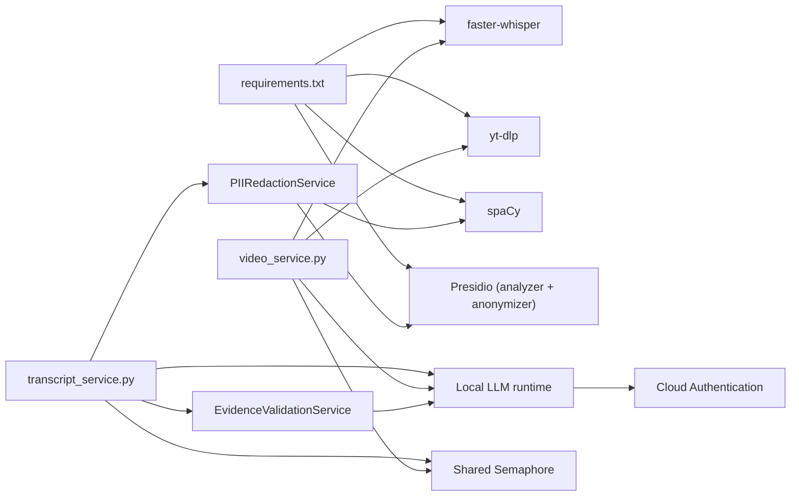

# Transcript Generation

<cite>
**Referenced Files in This Document**
- [transcript_service.py](file://app/backend/services/transcript_service.py)
- [transcript.py](file://app/backend/routes/transcript.py)
- [schemas.py](file://app/backend/models/schemas.py)
- [TranscriptPage.jsx](file://app/frontend/src/pages/TranscriptPage.jsx)
- [api.js](file://app/frontend/src/lib/api.js)
- [db_models.py](file://app/backend/models/db_models.py)
- [video_service.py](file://app/backend/services/video_service.py)
- [video.py](file://app/backend/routes/video.py)
- [video_downloader.py](file://app/backend/services/video_downloader.py)
- [llm_service.py](file://app/backend/services/llm_service.py)
- [main.py](file://app/backend/main.py)
- [requirements.txt](file://requirements.txt)
- [test_transcript_service.py](file://app/backend/tests/test_transcript_service.py)
- [test_video_service.py](file://app/backend/tests/test_video_service.py)
- [pii_redaction_service.py](file://app/backend/services/pii_redaction_service.py)
- [evidence_validation_service.py](file://app/backend/services/evidence_validation_service.py)
- [ENTERPRISE_TRANSCRIPT_ANALYSIS.md](file://ENTERPRISE_TRANSCRIPT_ANALYSIS.md)
- [IMPLEMENTATION_SUMMARY.md](file://IMPLEMENTATION_SUMMARY.md)
- [calibration_service.py](file://app/backend/services/calibration_service.py)
</cite>

## Update Summary
**Changes Made**
- Added comprehensive enterprise transcript analysis system with PII redaction service
- Integrated evidence validation service for hallucination detection and source verification
- Implemented confidence scoring capabilities for PII detection and evidence validation
- Enhanced transcript analysis pipeline with automatic bias elimination and quality assurance
- Added enterprise-grade compliance features including audit trails and validation metrics
- Updated architecture to support multi-layer quality assurance and legal defensibility

## Table of Contents
1. [Introduction](#introduction)
2. [Project Structure](#project-structure)
3. [Core Components](#core-components)
4. [Architecture Overview](#architecture-overview)
5. [Enterprise Transcript Analysis System](#enterprise-transcript-analysis-system)
6. [Detailed Component Analysis](#detailed-component-analysis)
7. [Cloud Deployment and Authentication](#cloud-deployment-and-authentication)
8. [Resource Management and Concurrency Control](#resource-management-and-concurrency-control)
9. [Dependency Analysis](#dependency-analysis)
10. [Performance Considerations](#performance-considerations)
11. [Troubleshooting Guide](#troubleshooting-guide)
12. [Conclusion](#conclusion)
13. [Appendices](#appendices)

## Introduction
This document explains the automatic transcript generation and analysis system for video interviews, now enhanced with enterprise-grade compliance and quality assurance features. The system provides:
- Faster-Whisper integration for speech-to-text conversion, language detection, and segment-level timestamps
- Transcript cleaning and parsing for multiple formats (.txt, .vtt, .srt)
- **Enterprise PII redaction service** with Presidio-based detection and regex fallback
- **Evidence validation service** for hallucination detection and source verification
- **Confidence scoring** for both PII detection and evidence validation
- Communication quality and malpractice detection using local LLM inference
- API endpoints for transcript analysis and video-based transcription
- Frontend integration for upload, paste, and viewing results
- Cloud-aware token limit configuration for optimal performance
- Shared semaphore control for coordinated resource management
- Cloud authentication support for seamless Ollama Cloud integration
- Quality improvements, performance optimization, and batch processing strategies

## Project Structure
The transcript generation system spans backend services, routes, models, and frontend pages, now enhanced with enterprise compliance features:
- Backend services implement Faster-Whisper transcription, parsing, LLM-based analysis, **PII redaction**, and **evidence validation**
- Routes expose endpoints for transcript analysis and video-based interview processing
- Models define persistence for transcript analyses with enterprise metadata
- Frontend pages enable user-driven transcript uploads and paste workflows
- Cloud detection and authentication services handle Ollama Cloud integration
- Shared semaphore control manages concurrent LLM requests across all services
- **Enterprise compliance services** provide audit trails and quality assurance

**Diagram sources**
- [TranscriptPage.jsx:1-632](file://app/frontend/src/pages/TranscriptPage.jsx#L1-L632)
- [api.js:319-351](file://app/frontend/src/lib/api.js#L319-L351)
- [transcript.py:1-220](file://app/backend/routes/transcript.py#L1-L220)
- [video_service.py:1-426](file://app/backend/services/video_service.py#L1-L426)
- [transcript_service.py:1-240](file://app/backend/services/transcript_service.py#L1-L240)
- [video_downloader.py:1-263](file://app/backend/services/video_downloader.py#L1-L263)
- [db_models.py:194-210](file://app/backend/models/db_models.py#L194-L210)
- [schemas.py:294-340](file://app/backend/models/schemas.py#L294-L340)
- [llm_service.py:1-314](file://app/backend/services/llm_service.py#L1-L314)
- [pii_redaction_service.py:1-234](file://app/backend/services/pii_redaction_service.py#L1-L234)
- [evidence_validation_service.py:1-411](file://app/backend/services/evidence_validation_service.py#L1-L411)
- [calibration_service.py:185-343](file://app/backend/services/calibration_service.py#L185-L343)
- [main.py:1-554](file://app/backend/main.py#L1-L554)

**Section sources**
- [transcript.py:1-220](file://app/backend/routes/transcript.py#L1-L220)
- [video_service.py:1-426](file://app/backend/services/video_service.py#L1-L426)
- [TranscriptPage.jsx:1-632](file://app/frontend/src/pages/TranscriptPage.jsx#L1-L632)
- [api.js:319-351](file://app/frontend/src/lib/api.js#L319-L351)

## Core Components
- Transcript parsing and cleaning for .txt, .vtt, and .srt formats
- **Enterprise PII redaction service** with Presidio-based detection and regex fallback
- **Evidence validation service** for hallucination detection and source verification
- **Confidence scoring** for both PII detection and evidence validation
- LLM-backed analysis of transcripts against job descriptions with cloud-aware token limits
- Video-based transcription using Faster-Whisper with segment timestamps
- Communication quality and malpractice detection via local LLM inference
- Shared semaphore control for coordinated resource management across all services
- Cloud authentication support for seamless Ollama Cloud integration
- API endpoints for transcript analysis and video processing
- Frontend UI for selecting context, uploading transcripts, and viewing results

**Section sources**
- [transcript_service.py:21-78](file://app/backend/services/transcript_service.py#L21-L78)
- [transcript.py:28-118](file://app/backend/routes/transcript.py#L28-L118)
- [video_service.py:25-59](file://app/backend/services/video_service.py#L25-L59)
- [video.py:21-67](file://app/backend/routes/video.py#L21-L67)
- [TranscriptPage.jsx:59-182](file://app/frontend/src/pages/TranscriptPage.jsx#L59-L182)
- [pii_redaction_service.py:26-135](file://app/backend/services/pii_redaction_service.py#L26-L135)
- [evidence_validation_service.py:37-221](file://app/backend/services/evidence_validation_service.py#L37-L221)

## Architecture Overview
The system integrates frontend upload/paste with backend services, now enhanced with enterprise compliance layers:
- Transcript analysis: parse input → clean text → **PII redaction** → **evidence validation** → cloud-aware LLM analysis → persist result
- Video analysis: download or accept file → Faster-Whisper transcription → parallel communication and malpractice analysis → return combined result
- Cloud detection: automatically detects Ollama Cloud vs local deployment and adjusts behavior accordingly
- Resource management: shared semaphore controls concurrent LLM requests across all services
- **Enterprise compliance**: automatic bias elimination and quality assurance throughout the pipeline

**Diagram sources**
- [api.js:319-341](file://app/frontend/src/lib/api.js#L319-L341)
- [transcript.py:28-118](file://app/backend/routes/transcript.py#L28-L118)
- [transcript_service.py:268-374](file://app/backend/services/transcript_service.py#L268-L374)
- [pii_redaction_service.py:53-135](file://app/backend/services/pii_redaction_service.py#L53-L135)
- [evidence_validation_service.py:56-221](file://app/backend/services/evidence_validation_service.py#L56-L221)
- [llm_service.py:15-46](file://app/backend/services/llm_service.py#L15-L46)
- [db_models.py:196-210](file://app/backend/models/db_models.py#L196-L210)

## Enterprise Transcript Analysis System

### PII Redaction Service
The PII redaction service eliminates bias by removing personally identifiable information from transcripts before analysis:

- **Presidio-based detection** (enterprise-grade): Supports PERSON, EMAIL_ADDRESS, PHONE_NUMBER, LOCATION, ORG, URL, US_SSN, CREDIT_CARD
- **Regex fallback**: Automatic fallback when Presidio is unavailable
- **Audit trail**: Complete redaction map with original values and confidence scores
- **Context preservation**: Maintains technical content while removing identifying information
- **Quality validation**: Preservation ratio and content validation metrics

**Diagram sources**
- [pii_redaction_service.py:34-135](file://app/backend/services/pii_redaction_service.py#L34-L135)

**Section sources**
- [pii_redaction_service.py:26-135](file://app/backend/services/pii_redaction_service.py#L26-L135)
- [pii_redaction_service.py:198-221](file://app/backend/services/pii_redaction_service.py#L198-L221)
- [ENTERPRISE_TRANSCRIPT_ANALYSIS.md:11-19](file://ENTERPRISE_TRANSCRIPT_ANALYSIS.md#L11-L19)

### Evidence Validation Service
The evidence validation service ensures all LLM claims are supported by actual transcript evidence:

- **Multi-strategy validation**: Exact substring match, fuzzy matching (75% threshold), keyword overlap
- **Hallucination detection**: Identifies unsupported claims and provides detailed reports
- **Quality scoring**: Evidence quality score from 0-100 based on verified claims
- **Audit trail**: Comprehensive validation details and unsupported claim tracking
- **Format compatibility**: Handles both old and new evidence formats

**Diagram sources**
- [evidence_validation_service.py:56-221](file://app/backend/services/evidence_validation_service.py#L56-L221)

**Section sources**
- [evidence_validation_service.py:37-221](file://app/backend/services/evidence_validation_service.py#L37-L221)
- [evidence_validation_service.py:283-371](file://app/backend/services/evidence_validation_service.py#L283-L371)
- [ENTERPRISE_TRANSCRIPT_ANALYSIS.md:21-29](file://ENTERPRISE_TRANSCRIPT_ANALYSIS.md#L21-L29)

### Confidence Scoring Capabilities
Both services provide confidence scoring for quality assurance:

- **PII Detection Confidence**: Average confidence scores per entity type (Presidio only)
- **Evidence Validation Confidence**: Similarity scores for fuzzy matches, overlap ratios for keyword matches
- **Quality Metrics**: Preservation ratio, evidence quality score, validation accuracy
- **Audit Trail**: Complete provenance of all transformations and validations

**Section sources**
- [pii_redaction_service.py:118-130](file://app/backend/services/pii_redaction_service.py#L118-L130)
- [evidence_validation_service.py:208-221](file://app/backend/services/evidence_validation_service.py#L208-L221)
- [ENTERPRISE_TRANSCRIPT_ANALYSIS.md:104-114](file://ENTERPRISE_TRANSCRIPT_ANALYSIS.md#L104-L114)

## Detailed Component Analysis

### Transcript Parsing and Cleaning
- Supports .vtt (Zoom/Teams), .srt, and plain .txt
- Strips headers, cues, timestamps, sequence numbers, and speaker labels
- Merges multiline cues and retains speech content

**Diagram sources**
- [transcript_service.py:21-89](file://app/backend/services/transcript_service.py#L21-L89)

**Section sources**
- [transcript_service.py:21-89](file://app/backend/services/transcript_service.py#L21-L89)
- [test_transcript_service.py:80-150](file://app/backend/tests/test_transcript_service.py#L80-L150)

### Enhanced Transcript Analysis Pipeline
The enhanced pipeline now includes enterprise compliance features:

- **PII Redaction**: Automatic removal of identifying information with audit trail
- **Evidence Validation**: Verification of all LLM claims against transcript evidence
- **Bias Elimination**: Comprehensive bias prevention through anonymization
- **Quality Assurance**: Confidence scoring and validation metrics
- **Structured Prompts**: Enhanced prompts requiring evidence citations

**Diagram sources**
- [transcript.py:93-94](file://app/backend/routes/transcript.py#L93-L94)
- [transcript_service.py:268-374](file://app/backend/services/transcript_service.py#L268-L374)
- [pii_redaction_service.py:53-135](file://app/backend/services/pii_redaction_service.py#L53-L135)
- [evidence_validation_service.py:56-221](file://app/backend/services/evidence_validation_service.py#L56-L221)
- [llm_service.py:41-46](file://app/backend/services/llm_service.py#L41-L46)

**Section sources**
- [transcript_service.py:268-374](file://app/backend/services/transcript_service.py#L268-L374)
- [schemas.py:302-324](file://app/backend/models/schemas.py#L302-L324)
- [test_transcript_service.py:174-287](file://app/backend/tests/test_transcript_service.py#L174-L287)
- [IMPLEMENTATION_SUMMARY.md:5-28](file://IMPLEMENTATION_SUMMARY.md#L5-L28)

### Video-Based Transcription and Analysis
- Uses Faster-Whisper for CPU transcription with segment timestamps
- Extracts pause signals and audio anomalies from Whisper metadata
- Runs communication quality and malpractice detection in parallel via local LLM
- Supports file upload and public URL ingestion with cloud-aware token limits
- Uses shared semaphore for coordinated resource management

**Diagram sources**
- [api.js:299-315](file://app/frontend/src/lib/api.js#L299-L315)
- [video.py:21-67](file://app/backend/routes/video.py#L21-L67)
- [video_service.py:25-426](file://app/backend/services/video_service.py#L25-L426)
- [video_downloader.py:125-175](file://app/backend/services/video_downloader.py#L125-L175)
- [llm_service.py:41-46](file://app/backend/services/llm_service.py#L41-L46)

**Section sources**
- [video_service.py:25-426](file://app/backend/services/video_service.py#L25-L426)
- [video.py:21-67](file://app/backend/routes/video.py#L21-L67)
- [video_downloader.py:125-175](file://app/backend/services/video_downloader.py#L125-L175)
- [test_video_service.py:45-100](file://app/backend/tests/test_video_service.py#L45-L100)

### API Endpoints
- Transcript analysis
  - POST /api/transcript/analyze: upload file or paste text, select candidate and job template, receive analysis with cloud-aware token limits and enterprise compliance features
  - GET /api/transcript/analyses: list all analyses for tenant
  - GET /api/transcript/analyses/{id}: retrieve a single analysis with enterprise metadata
- Video analysis
  - POST /api/analyze/video: upload video file with cloud-aware resource management
  - POST /api/analyze/video-url: public URL ingestion with cloud-aware token limits

**Diagram sources**
- [transcript.py:28-118](file://app/backend/routes/transcript.py#L28-L118)
- [video.py:21-67](file://app/backend/routes/video.py#L21-L67)

**Section sources**
- [transcript.py:28-118](file://app/backend/routes/transcript.py#L28-L118)
- [video.py:21-67](file://app/backend/routes/video.py#L21-L67)

### Frontend Integration
- TranscriptPage.jsx supports:
  - Step 1: select candidate and job template, choose interview platform
  - Step 2: upload .txt/.vtt/.srt or paste text
  - Step 3: display scores, strengths, areas for improvement, recommendation, and enterprise compliance indicators
- api.js exposes:
  - analyzeTranscript(), getTranscriptAnalyses(), getTranscriptAnalysis()
  - analyzeVideo(), analyzeVideoFromUrl()

**Section sources**
- [TranscriptPage.jsx:59-182](file://app/frontend/src/pages/TranscriptPage.jsx#L59-L182)
- [api.js:319-351](file://app/frontend/src/lib/api.js#L319-L351)

## Cloud Deployment and Authentication

### Cloud Detection and Configuration
The system automatically detects whether it's running against Ollama Cloud or a local instance and adjusts behavior accordingly:

- **Cloud Detection**: Uses `is_ollama_cloud()` function to detect cloud instances by checking for "ollama.com" in the base URL
- **Authentication**: Automatically adds Bearer token authentication when using Ollama Cloud with `OLLAMA_API_KEY` environment variable
- **Token Limits**: Applies different token limits based on deployment mode:
  - Cloud: 2000 tokens for comprehensive analysis with evidence citations
  - Local: 1000 tokens for cost-effective local processing

**Diagram sources**
- [llm_service.py:15-33](file://app/backend/services/llm_service.py#L15-L33)
- [transcript_service.py:312-313](file://app/backend/services/transcript_service.py#L312-L313)
- [video_service.py:161-163](file://app/backend/services/video_service.py#L161-L163)

**Section sources**
- [llm_service.py:15-33](file://app/backend/services/llm_service.py#L15-L33)
- [transcript_service.py:312-313](file://app/backend/services/transcript_service.py#L312-L313)
- [video_service.py:161-163](file://app/backend/services/video_service.py#L161-L163)

### Environment Configuration
Key environment variables for cloud deployment:

| Variable | Default | Description |
|----------|---------|-------------|
| `OLLAMA_BASE_URL` | `https://ollama.com` | Ollama API endpoint (cloud or local) |
| `OLLAMA_API_KEY` | *(empty)* | Bearer token for Ollama Cloud authentication |
| `OLLAMA_MODEL` | `qwen3-coder:480b-cloud` or `qwen3.5:4b` | Primary LLM model |
| `OLLAMA_FAST_MODEL` | `qwen3-coder:480b-cloud` | Fallback fast model |

**Section sources**
- [README.md:400-428](file://README.md#L400-L428)
- [llm_service.py:20-33](file://app/backend/services/llm_service.py#L20-L33)

## Resource Management and Concurrency Control

### Shared Semaphore Control
The system implements a shared semaphore to prevent LLM contention across all services:

- **Global Semaphore**: Single semaphore instance shared across resume narrative, video analysis, and transcript analysis
- **Serialization**: Ensures only one LLM request executes at a time, preventing resource conflicts
- **Coordinated Access**: All services acquire the semaphore before making LLM requests
- **Timeout Handling**: Proper timeout management for LLM requests with graceful fallbacks

**Diagram sources**
- [llm_service.py:35-46](file://app/backend/services/llm_service.py#L35-L46)
- [transcript_service.py:211-214](file://app/backend/services/transcript_service.py#L211-L214)
- [video_service.py:156-159](file://app/backend/services/video_service.py#L156-L159)

### Health Monitoring and Sentinel
The system includes comprehensive health monitoring for Ollama:

- **Health Sentinel**: Background task that monitors Ollama availability and model readiness
- **Cloud Optimization**: Skips local health checks for cloud deployments
- **Warmup Management**: Automatic model warmup for local deployments
- **Status Reporting**: Detailed status information for debugging and monitoring

**Section sources**
- [llm_service.py:56-153](file://app/backend/services/llm_service.py#L56-L153)
- [main.py:258-262](file://app/backend/main.py#L258-L262)

## Dependency Analysis
External dependencies relevant to transcript generation and enterprise compliance:
- Faster-Whisper for transcription and segment timestamps
- yt-dlp for YouTube downloads (optional)
- Local LLM runtime for analysis (via HTTP)
- **Presidio analyzers and anonymizers** for enterprise PII detection
- **spaCy** for NLP processing in PII detection
- Cloud authentication for Ollama Cloud integration
- Shared semaphore for resource coordination

**Diagram sources**
- [requirements.txt:35-39](file://requirements.txt#L35-L39)
- [video_service.py:31-32](file://app/backend/services/video_service.py#L31-L32)
- [transcript_service.py:15-16](file://app/backend/services/transcript_service.py#L15-L16)
- [llm_service.py:35-46](file://app/backend/services/llm_service.py#L35-L46)
- [app/backend/requirements.txt:34-36](file://app/backend/requirements.txt#L34-L36)

**Section sources**
- [requirements.txt:35-39](file://requirements.txt#L35-L39)
- [video_service.py:31-32](file://app/backend/services/video_service.py#L31-L32)
- [transcript_service.py:15-16](file://app/backend/services/transcript_service.py#L15-L16)
- [app/backend/requirements.txt:34-36](file://app/backend/requirements.txt#L34-L36)

## Performance Considerations
- Faster-Whisper transcription runs on CPU with quantized model for speed
- Parallel processing: communication and malpractice analysis run concurrently
- Memory management:
  - Temporary files are written and deleted after processing
  - Streaming downloads for URLs with size and timeout limits
- Cloud optimization:
  - Automatic cloud detection reduces overhead for cloud deployments
  - Different token limits optimize cost vs quality trade-offs
- Resource coordination:
  - Shared semaphore prevents resource contention across services
  - Health monitoring ensures optimal resource utilization
- **Enterprise compliance overhead**:
  - PII redaction adds minimal processing time with significant bias elimination benefits
  - Evidence validation provides quality assurance with configurable performance impact
  - Confidence scoring adds computational overhead but improves trustworthiness
- Frontend timeouts configured for long-running operations (video analysis, transcript analysis)
- Recommendations:
  - Prefer shorter videos or trimmed clips for faster turnaround
  - Use batch processing for multiple videos (implement at route/service level)
  - Monitor local LLM resource usage and adjust concurrency
  - Leverage cloud deployment for improved performance and reliability
  - Enable enterprise features selectively based on compliance requirements

## Troubleshooting Guide
Common issues and resolutions:
- Transcript parsing
  - Unsupported format or extension: ensure .txt/.vtt/.srt
  - Large files (>5 MB): reduce size or paste text
- **PII Redaction Issues**
  - Presidio not available: system automatically falls back to regex patterns
  - Incomplete redaction: check regex patterns and consider installing Presidio for better accuracy
  - Quality concerns: review preservation ratio metrics and adjust redaction thresholds
- **Evidence Validation Problems**
  - High hallucination rate: review fuzzy matching threshold and evidence quality scoring
  - Unsupported claims: examine validation details and improve transcript clarity
  - Performance issues: consider disabling evidence validation for high-volume processing
- LLM analysis failures
  - Network errors or invalid JSON: fallback result returned
  - Short input (< threshold): fallback result returned
  - Cloud authentication failures: check `OLLAMA_API_KEY` environment variable
- Video analysis
  - Faster-Whisper not installed: empty transcription returned
  - URL access denied/unavailable: user-friendly error messages
  - Timeout downloading large files: retry with direct upload
- Cloud deployment issues
  - Cloud detection failures: verify `OLLAMA_BASE_URL` configuration
  - Token limit issues: adjust cloud vs local token limits based on requirements
  - Semaphore deadlocks: monitor health sentinel status and resource utilization

**Section sources**
- [transcript.py:42-60](file://app/backend/routes/transcript.py#L42-L60)
- [transcript_service.py:56-59](file://app/backend/services/transcript_service.py#L56-L59)
- [video_downloader.py:187-225](file://app/backend/services/video_downloader.py#L187-L225)
- [test_transcript_service.py:248-287](file://app/backend/tests/test_transcript_service.py#L248-L287)
- [test_video_service.py:184-197](file://app/backend/tests/test_video_service.py#L184-L197)

## Conclusion
The system provides robust, cloud-aware, and enterprise-compliant transcript generation and analysis:
- Faster-Whisper delivers accurate, segment-aware transcripts
- Cleaning and parsing support multiple common formats
- **Enterprise PII redaction** eliminates bias through comprehensive anonymization with audit trails
- **Evidence validation** prevents hallucinations and ensures source-of-truth analysis with quality scoring
- **Confidence scoring** provides measurable quality metrics for both PII detection and evidence validation
- LLM-based analysis evaluates fit, technical depth, and communication quality with cloud-aware optimizations
- Shared semaphore control ensures efficient resource utilization across all services
- Cloud authentication enables seamless integration with Ollama Cloud
- Video analysis adds malpractice detection and communication insights
- APIs and frontend enable seamless user workflows with clear error handling and cloud optimization
- **Enterprise compliance features** provide legal defensibility and quality assurance for sensitive applications

## Appendices

### Transcript Processing Workflows
- Transcript analysis workflow
  - Input: file or text, candidate, job template
  - Process: parse → clean → **PII redaction** → **evidence validation** → cloud-aware LLM analysis → persist
  - Output: normalized result with scores, recommendation, and enterprise metadata
- Video analysis workflow
  - Input: file or public URL
  - Process: download → Faster-Whisper → parallel analysis with shared semaphore → combine
  - Output: transcript, segments, language, durations, and analysis

**Section sources**
- [transcript.py:28-118](file://app/backend/routes/transcript.py#L28-L118)
- [video.py:21-67](file://app/backend/routes/video.py#L21-L67)
- [video_service.py:359-385](file://app/backend/services/video_service.py#L359-L385)

### Quality Improvement Techniques
- Preprocessing
  - Normalize speaker labels and remove artifacts
  - Trim silence and stabilize audio before transcription
  - **Enable PII redaction** to eliminate bias from identifying information
- Prompt engineering
  - Provide concise job descriptions and candidate context
  - Encourage JSON structure adherence in LLM prompts
  - **Require evidence citations** in prompts for validation
  - Leverage cloud-aware token limits for comprehensive analysis
- Post-processing
  - Clamp scores to valid ranges
  - Limit lists to recommended sizes for readability
  - Use shared semaphore for consistent resource management
  - **Review evidence validation reports** for quality assurance
  - **Monitor confidence scores** for trustworthiness assessment

**Section sources**
- [transcript_service.py:147-184](file://app/backend/services/transcript_service.py#L147-L184)
- [video_service.py:127-172](file://app/backend/services/video_service.py#L127-L172)
- [evidence_validation_service.py:373-398](file://app/backend/services/evidence_validation_service.py#L373-L398)

### Handling Different Audio Formats
- Supported video formats for upload: .mp4, .webm, .avi, .mov, .mkv, .m4v
- URL ingestion supports Zoom, Teams, Google Drive, Loom, Dropbox, YouTube, and direct URLs
- For audio-only sources, convert to supported video containers or use direct file upload

**Section sources**
- [video.py:15-16](file://app/backend/routes/video.py#L15-L16)
- [video_downloader.py:28-45](file://app/backend/services/video_downloader.py#L28-L45)

### Persistence Model
- TranscriptAnalysis stores cleaned transcript text, source platform, and JSON result
- **Enterprise metadata**: PII redaction count, evidence validation metrics, confidence scores
- Related entities: Candidate and RoleTemplate for context

**Section sources**
- [db_models.py:196-210](file://app/backend/models/db_models.py#L196-L210)

### Cloud Deployment Configuration
- **Cloud Mode**: Set `OLLAMA_BASE_URL=https://ollama.com` and provide `OLLAMA_API_KEY`
- **Local Mode**: Set `OLLAMA_BASE_URL=http://ollama:11434` for self-hosted deployment
- **Token Limits**: Cloud uses 2000 tokens (enhanced for evidence citations), local uses 1000 tokens for optimal cost/performance balance
- **Health Monitoring**: Cloud deployments skip local health checks, improving startup performance

**Section sources**
- [README.md:400-428](file://README.md#L400-L428)
- [llm_service.py:15-33](file://app/backend/services/llm_service.py#L15-L33)
- [transcript_service.py:312-313](file://app/backend/services/transcript_service.py#L312-L313)

### Enterprise Compliance Features
- **PII Redaction**: Automatic removal of sensitive information with audit trail
- **Evidence Validation**: Comprehensive claim verification with quality scoring
- **Bias Elimination**: Complete anonymization for fair assessment
- **Quality Assurance**: Confidence scoring and validation metrics
- **Legal Defensibility**: Complete audit trail for compliance requirements
- **Configuration Options**: Enable/disable enterprise features based on requirements

**Section sources**
- [ENTERPRISE_TRANSCRIPT_ANALYSIS.md:3-40](file://ENTERPRISE_TRANSCRIPT_ANALYSIS.md#L3-L40)
- [IMPLEMENTATION_SUMMARY.md:5-51](file://IMPLEMENTATION_SUMMARY.md#L5-L51)
- [pii_redaction_service.py:26-135](file://app/backend/services/pii_redaction_service.py#L26-L135)
- [evidence_validation_service.py:37-221](file://app/backend/services/evidence_validation_service.py#L37-L221)