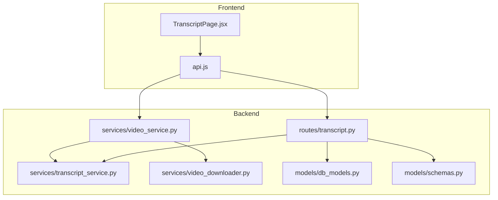
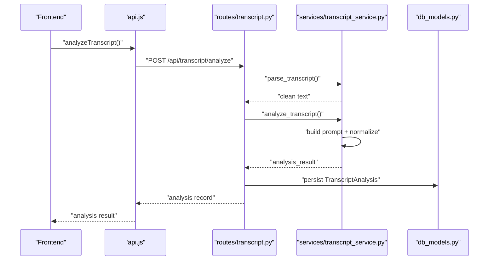
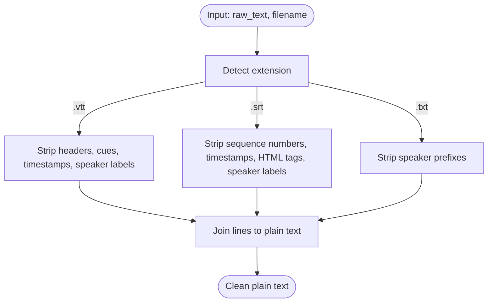
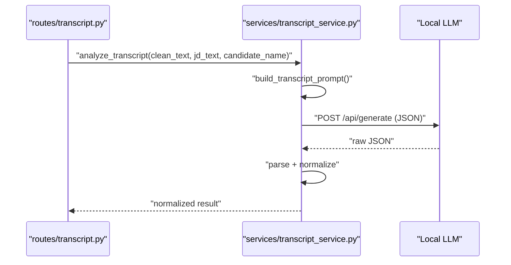
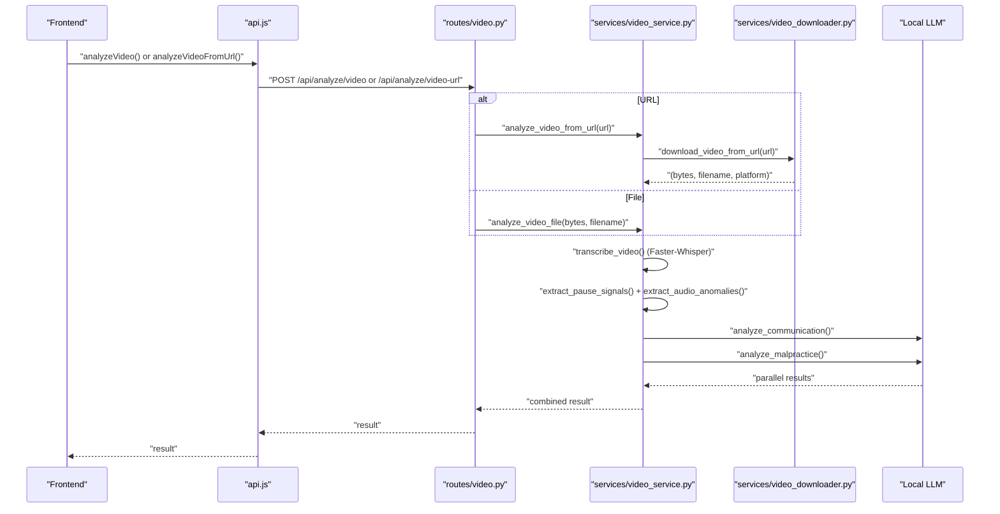
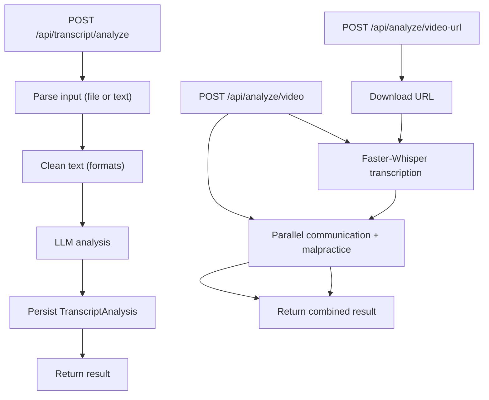
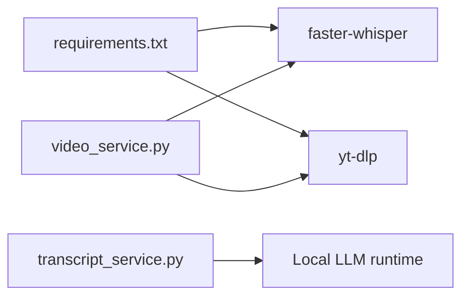

# Transcript Generation

<cite>
**Referenced Files in This Document**
- [transcript_service.py](file://app/backend/services/transcript_service.py)
- [transcript.py](file://app/backend/routes/transcript.py)
- [schemas.py](file://app/backend/models/schemas.py)
- [TranscriptPage.jsx](file://app/frontend/src/pages/TranscriptPage.jsx)
- [api.js](file://app/frontend/src/lib/api.js)
- [db_models.py](file://app/backend/models/db_models.py)
- [video_service.py](file://app/backend/services/video_service.py)
- [video.py](file://app/backend/routes/video.py)
- [video_downloader.py](file://app/backend/services/video_downloader.py)
- [requirements.txt](file://requirements.txt)
- [test_transcript_service.py](file://app/backend/tests/test_transcript_service.py)
- [test_video_service.py](file://app/backend/tests/test_video_service.py)
</cite>

## Table of Contents
1. [Introduction](#introduction)
2. [Project Structure](#project-structure)
3. [Core Components](#core-components)
4. [Architecture Overview](#architecture-overview)
5. [Detailed Component Analysis](#detailed-component-analysis)
6. [Dependency Analysis](#dependency-analysis)
7. [Performance Considerations](#performance-considerations)
8. [Troubleshooting Guide](#troubleshooting-guide)
9. [Conclusion](#conclusion)
10. [Appendices](#appendices)

## Introduction
This document explains the automatic transcript generation and analysis system for video interviews. It covers:
- Faster-Whisper integration for speech-to-text conversion, language detection, and segment-level timestamps
- Transcript cleaning and parsing for multiple formats (.txt, .vtt, .srt)
- Communication quality and malpractice detection using local LLM inference
- API endpoints for transcript analysis and video-based transcription
- Frontend integration for upload, paste, and viewing results
- Quality improvements, performance optimization, and batch processing strategies

## Project Structure
The transcript generation system spans backend services, routes, models, and frontend pages:
- Backend services implement Faster-Whisper transcription, parsing, and LLM-based analysis
- Routes expose endpoints for transcript analysis and video-based interview processing
- Models define persistence for transcript analyses
- Frontend pages enable user-driven transcript uploads and paste workflows

**Diagram sources**
- [TranscriptPage.jsx:1-632](file://app/frontend/src/pages/TranscriptPage.jsx#L1-L632)
- [api.js:319-351](file://app/frontend/src/lib/api.js#L319-L351)
- [transcript.py:1-206](file://app/backend/routes/transcript.py#L1-L206)
- [video_service.py:1-398](file://app/backend/services/video_service.py#L1-L398)
- [transcript_service.py:1-221](file://app/backend/services/transcript_service.py#L1-L221)
- [video_downloader.py:1-263](file://app/backend/services/video_downloader.py#L1-L263)
- [db_models.py:194-210](file://app/backend/models/db_models.py#L194-L210)
- [schemas.py:294-340](file://app/backend/models/schemas.py#L294-L340)

**Section sources**
- [transcript.py:1-206](file://app/backend/routes/transcript.py#L1-L206)
- [video_service.py:1-398](file://app/backend/services/video_service.py#L1-L398)
- [TranscriptPage.jsx:1-632](file://app/frontend/src/pages/TranscriptPage.jsx#L1-L632)
- [api.js:319-351](file://app/frontend/src/lib/api.js#L319-L351)

## Core Components
- Transcript parsing and cleaning for .txt, .vtt, and .srt formats
- LLM-backed analysis of transcripts against job descriptions
- Video-based transcription using Faster-Whisper with segment timestamps
- Communication quality and malpractice detection via local LLM inference
- API endpoints for transcript analysis and video processing
- Frontend UI for selecting context, uploading transcripts, and viewing results

**Section sources**
- [transcript_service.py:21-78](file://app/backend/services/transcript_service.py#L21-L78)
- [transcript.py:28-118](file://app/backend/routes/transcript.py#L28-L118)
- [video_service.py:25-59](file://app/backend/services/video_service.py#L25-L59)
- [video.py:21-67](file://app/backend/routes/video.py#L21-L67)
- [TranscriptPage.jsx:59-182](file://app/frontend/src/pages/TranscriptPage.jsx#L59-L182)

## Architecture Overview
The system integrates frontend upload/paste with backend services:
- Transcript analysis: parse input → clean text → LLM analysis → persist result
- Video analysis: download or accept file → Faster-Whisper transcription → parallel communication and malpractice analysis → return combined result

**Diagram sources**
- [api.js:319-341](file://app/frontend/src/lib/api.js#L319-L341)
- [transcript.py:28-118](file://app/backend/routes/transcript.py#L28-L118)
- [transcript_service.py:62-184](file://app/backend/services/transcript_service.py#L62-L184)
- [db_models.py:196-210](file://app/backend/models/db_models.py#L196-L210)

## Detailed Component Analysis

### Transcript Parsing and Cleaning
- Supports .vtt (Zoom/Teams), .srt, and plain .txt
- Strips headers, cues, timestamps, sequence numbers, and speaker labels
- Merges multiline cues and retains speech content

**Diagram sources**
- [transcript_service.py:21-78](file://app/backend/services/transcript_service.py#L21-L78)

**Section sources**
- [transcript_service.py:21-78](file://app/backend/services/transcript_service.py#L21-L78)
- [test_transcript_service.py:80-150](file://app/backend/tests/test_transcript_service.py#L80-L150)

### Transcript Analysis Pipeline
- Builds a structured prompt with job description and transcript
- Calls local LLM via HTTP to get JSON result
- Normalizes scores and recommendations, with fallback on errors or short input

**Diagram sources**
- [transcript.py:93-94](file://app/backend/routes/transcript.py#L93-L94)
- [transcript_service.py:83-184](file://app/backend/services/transcript_service.py#L83-L184)

**Section sources**
- [transcript_service.py:83-184](file://app/backend/services/transcript_service.py#L83-L184)
- [schemas.py:302-324](file://app/backend/models/schemas.py#L302-L324)
- [test_transcript_service.py:174-287](file://app/backend/tests/test_transcript_service.py#L174-L287)

### Video-Based Transcription and Analysis
- Uses Faster-Whisper for CPU transcription with segment timestamps
- Extracts pause signals and audio anomalies from Whisper metadata
- Runs communication quality and malpractice detection in parallel via local LLM
- Supports file upload and public URL ingestion

**Diagram sources**
- [api.js:299-315](file://app/frontend/src/lib/api.js#L299-L315)
- [video.py:21-67](file://app/backend/routes/video.py#L21-L67)
- [video_service.py:25-398](file://app/backend/services/video_service.py#L25-L398)
- [video_downloader.py:125-175](file://app/backend/services/video_downloader.py#L125-L175)

**Section sources**
- [video_service.py:25-398](file://app/backend/services/video_service.py#L25-L398)
- [video.py:21-67](file://app/backend/routes/video.py#L21-L67)
- [video_downloader.py:125-175](file://app/backend/services/video_downloader.py#L125-L175)
- [test_video_service.py:45-100](file://app/backend/tests/test_video_service.py#L45-L100)

### API Endpoints
- Transcript analysis
  - POST /api/transcript/analyze: upload file or paste text, select candidate and job template, receive analysis
  - GET /api/transcript/analyses: list all analyses for tenant
  - GET /api/transcript/analyses/{id}: retrieve a single analysis
- Video analysis
  - POST /api/analyze/video: upload video file
  - POST /api/analyze/video-url: public URL ingestion

**Diagram sources**
- [transcript.py:28-118](file://app/backend/routes/transcript.py#L28-L118)
- [video.py:21-67](file://app/backend/routes/video.py#L21-L67)

**Section sources**
- [transcript.py:28-118](file://app/backend/routes/transcript.py#L28-L118)
- [video.py:21-67](file://app/backend/routes/video.py#L21-L67)

### Frontend Integration
- TranscriptPage.jsx supports:
  - Step 1: select candidate and job template, choose interview platform
  - Step 2: upload .txt/.vtt/.srt or paste text
  - Step 3: display scores, strengths, areas for improvement, and recommendation
- api.js exposes:
  - analyzeTranscript(), getTranscriptAnalyses(), getTranscriptAnalysis()
  - analyzeVideo(), analyzeVideoFromUrl()

**Section sources**
- [TranscriptPage.jsx:59-182](file://app/frontend/src/pages/TranscriptPage.jsx#L59-L182)
- [api.js:319-351](file://app/frontend/src/lib/api.js#L319-L351)

## Dependency Analysis
External dependencies relevant to transcript generation:
- Faster-Whisper for transcription and segment timestamps
- yt-dlp for YouTube downloads (optional)
- Local LLM runtime for analysis (via HTTP)

**Diagram sources**
- [requirements.txt:35-36](file://requirements.txt#L35-L36)
- [video_service.py:31-32](file://app/backend/services/video_service.py#L31-L32)
- [transcript_service.py:15-16](file://app/backend/services/transcript_service.py#L15-L16)

**Section sources**
- [requirements.txt:35-36](file://requirements.txt#L35-L36)
- [video_service.py:31-32](file://app/backend/services/video_service.py#L31-L32)
- [transcript_service.py:15-16](file://app/backend/services/transcript_service.py#L15-L16)

## Performance Considerations
- Faster-Whisper transcription runs on CPU with quantized model for speed
- Parallel processing: communication and malpractice analysis run concurrently
- Memory management:
  - Temporary files are written and deleted after processing
  - Streaming downloads for URLs with size and timeout limits
- Frontend timeouts configured for long-running operations (video analysis, transcript analysis)
- Recommendations:
  - Prefer shorter videos or trimmed clips for faster turnaround
  - Use batch processing for multiple videos (implement at route/service level)
  - Monitor local LLM resource usage and adjust concurrency

[No sources needed since this section provides general guidance]

## Troubleshooting Guide
Common issues and resolutions:
- Transcript parsing
  - Unsupported format or extension: ensure .txt/.vtt/.srt
  - Large files (>5 MB): reduce size or paste text
- LLM analysis failures
  - Network errors or invalid JSON: fallback result returned
  - Short input (< threshold): fallback result returned
- Video analysis
  - Faster-Whisper not installed: empty transcription returned
  - URL access denied/unavailable: user-friendly error messages
  - Timeout downloading large files: retry with direct upload

**Section sources**
- [transcript.py:42-60](file://app/backend/routes/transcript.py#L42-L60)
- [transcript_service.py:56-59](file://app/backend/services/transcript_service.py#L56-L59)
- [video_downloader.py:187-225](file://app/backend/services/video_downloader.py#L187-L225)
- [test_transcript_service.py:248-287](file://app/backend/tests/test_transcript_service.py#L248-L287)
- [test_video_service.py:184-197](file://app/backend/tests/test_video_service.py#L184-L197)

## Conclusion
The system provides robust, locally powered transcript generation and analysis:
- Faster-Whisper delivers accurate, segment-aware transcripts
- Cleaning and parsing support multiple common formats
- LLM-based analysis evaluates fit, technical depth, and communication quality
- Video analysis adds malpractice detection and communication insights
- APIs and frontend enable seamless user workflows with clear error handling

[No sources needed since this section summarizes without analyzing specific files]

## Appendices

### Transcript Processing Workflows
- Transcript analysis workflow
  - Input: file or text, candidate, job template
  - Process: parse → clean → LLM analysis → persist
  - Output: normalized result with scores and recommendation
- Video analysis workflow
  - Input: file or public URL
  - Process: download → Faster-Whisper → parallel analysis → combine
  - Output: transcript, segments, language, durations, and analysis

**Section sources**
- [transcript.py:28-118](file://app/backend/routes/transcript.py#L28-L118)
- [video.py:21-67](file://app/backend/routes/video.py#L21-L67)
- [video_service.py:331-357](file://app/backend/services/video_service.py#L331-L357)

### Quality Improvement Techniques
- Preprocessing
  - Normalize speaker labels and remove artifacts
  - Trim silence and stabilize audio before transcription
- Prompt engineering
  - Provide concise job descriptions and candidate context
  - Encourage JSON structure adherence in LLM prompts
- Post-processing
  - Clamp scores to valid ranges
  - Limit lists to recommended sizes for readability

**Section sources**
- [transcript_service.py:137-184](file://app/backend/services/transcript_service.py#L137-L184)
- [video_service.py:127-172](file://app/backend/services/video_service.py#L127-L172)

### Handling Different Audio Formats
- Supported video formats for upload: .mp4, .webm, .avi, .mov, .mkv, .m4v
- URL ingestion supports Zoom, Teams, Google Drive, Loom, Dropbox, YouTube, and direct URLs
- For audio-only sources, convert to supported video containers or use direct file upload

**Section sources**
- [video.py:15-16](file://app/backend/routes/video.py#L15-L16)
- [video_downloader.py:28-45](file://app/backend/services/video_downloader.py#L28-L45)

### Persistence Model
- TranscriptAnalysis stores cleaned transcript text, source platform, and JSON result
- Related entities: Candidate and RoleTemplate for context

**Section sources**
- [db_models.py:196-210](file://app/backend/models/db_models.py#L196-L210)