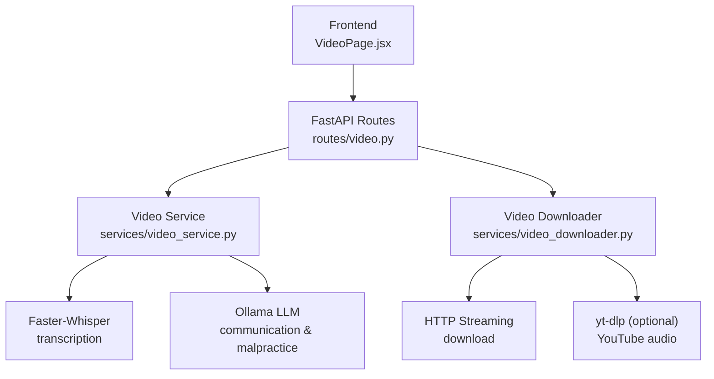
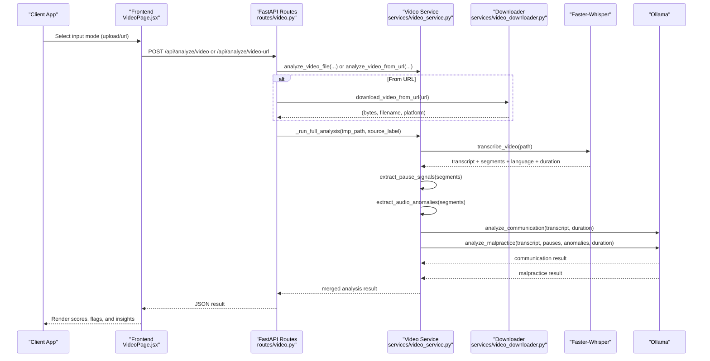
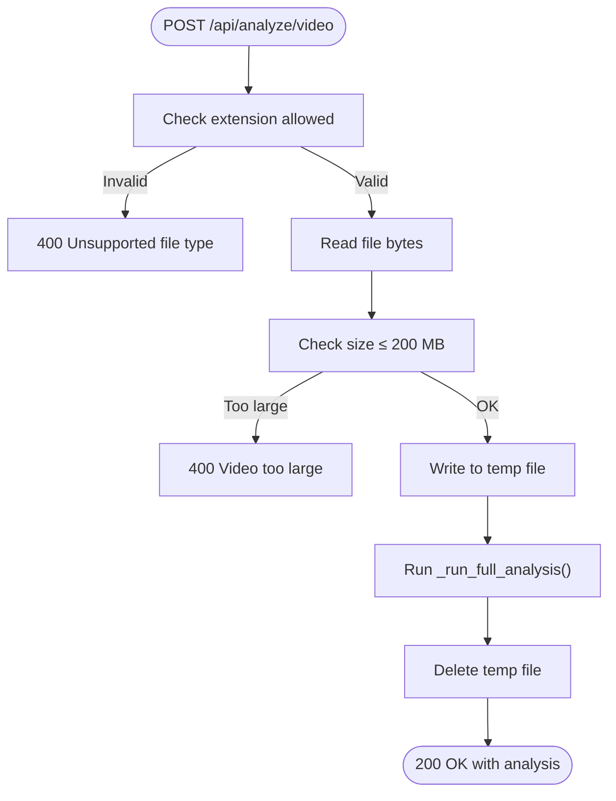
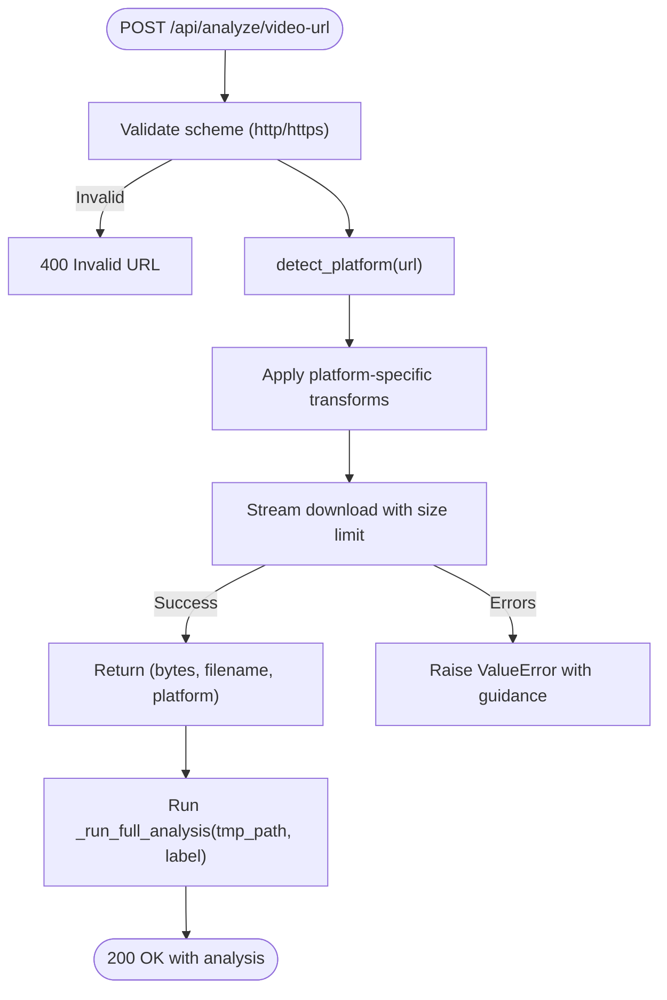
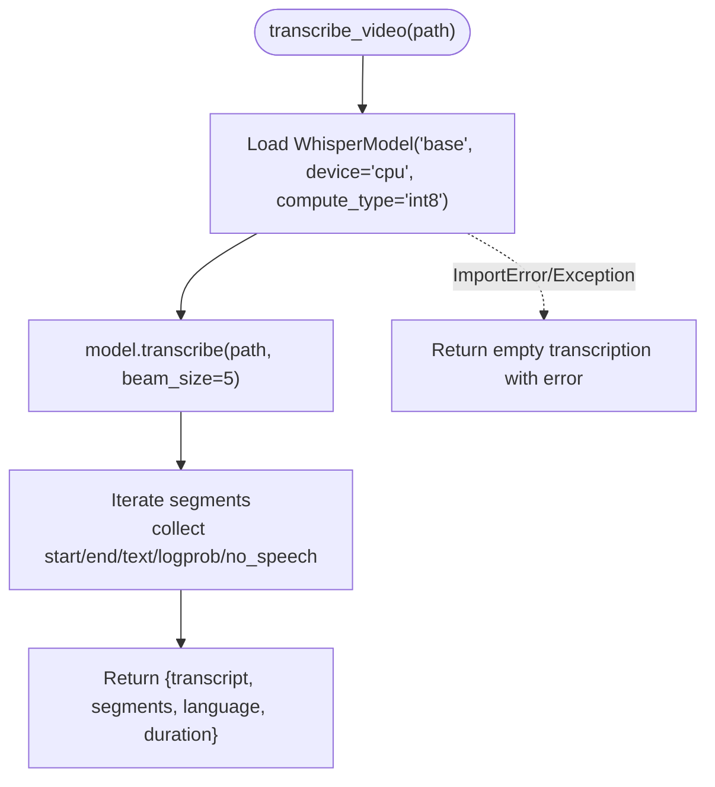
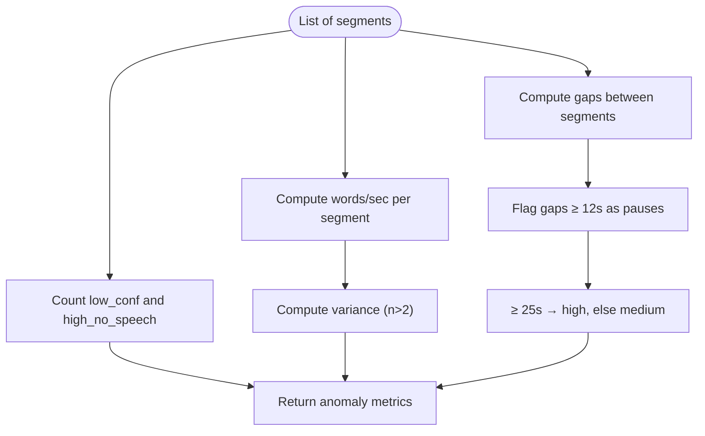
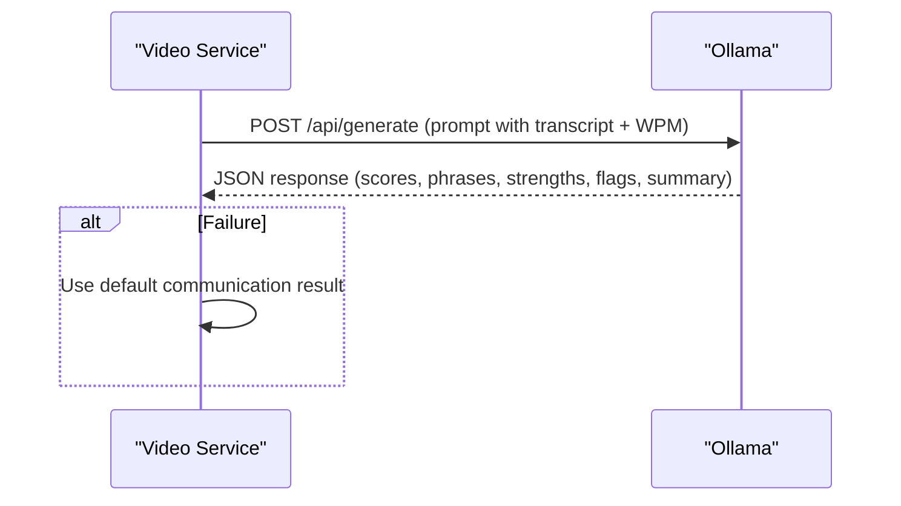
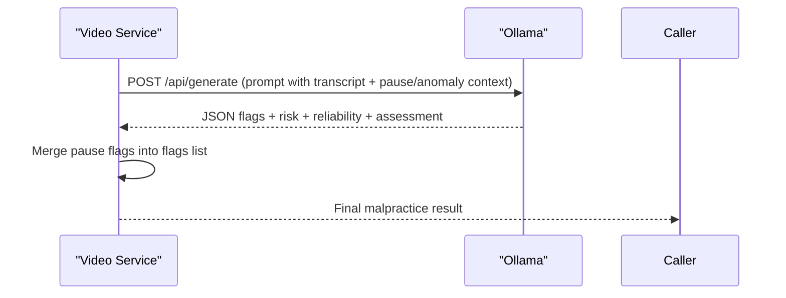
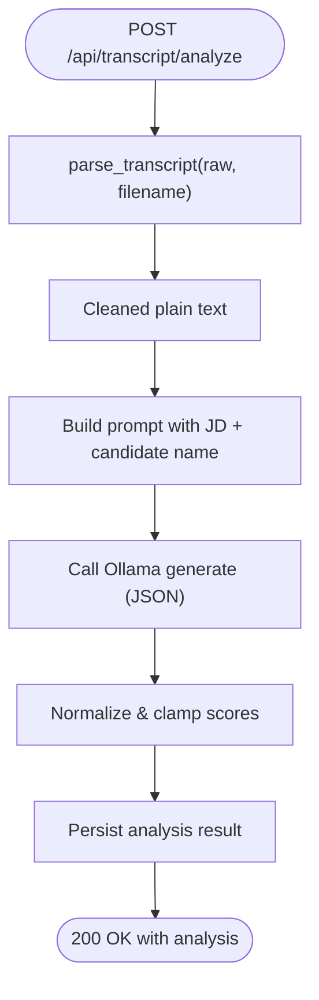
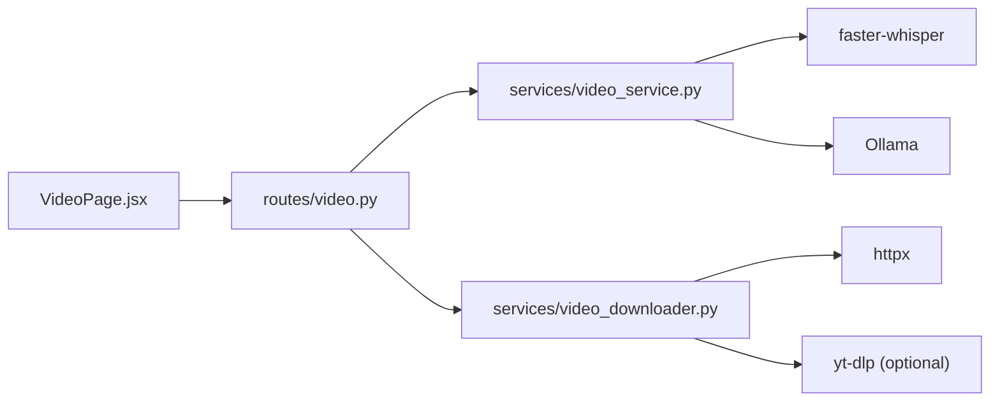

# Video Analysis

<cite>
**Referenced Files in This Document**
- [video_service.py](file://app/backend/services/video_service.py)
- [video_downloader.py](file://app/backend/services/video_downloader.py)
- [video.py](file://app/backend/routes/video.py)
- [transcript_service.py](file://app/backend/services/transcript_service.py)
- [transcript.py](file://app/backend/routes/transcript.py)
- [test_video_service.py](file://app/backend/tests/test_video_service.py)
- [test_video_downloader.py](file://app/backend/tests/test_video_downloader.py)
- [test_video_routes.py](file://app/backend/tests/test_video_routes.py)
- [VideoPage.jsx](file://app/frontend/src/pages/VideoPage.jsx)
</cite>

## Table of Contents
1. [Introduction](#introduction)
2. [Project Structure](#project-structure)
3. [Core Components](#core-components)
4. [Architecture Overview](#architecture-overview)
5. [Detailed Component Analysis](#detailed-component-analysis)
6. [Dependency Analysis](#dependency-analysis)
7. [Performance Considerations](#performance-considerations)
8. [Troubleshooting Guide](#troubleshooting-guide)
9. [Conclusion](#conclusion)
10. [Appendices](#appendices)

## Introduction
This document explains the video analysis capabilities in Resume AI by ThetaLogics. It covers how videos are uploaded and processed, how YouTube and Zoom recordings are integrated, how audio is transcribed and analyzed, and how interview insights are generated. It also documents error handling, performance characteristics, and extension points for supporting additional video sources.

## Project Structure
The video analysis feature spans backend services and routes, with frontend integration for user input and progress indication:
- Backend services implement transcription, audio anomaly detection, communication analysis, malpractice detection, and platform-specific video downloading.
- Routes expose endpoints for file uploads and public URL analysis.
- Frontend provides a user interface for selecting input mode (upload or URL), drag-and-drop file handling, and displaying results.

**Diagram sources**
- [video.py:1-68](file://app/backend/routes/video.py#L1-L68)
- [video_service.py:1-398](file://app/backend/services/video_service.py#L1-L398)
- [video_downloader.py:1-263](file://app/backend/services/video_downloader.py#L1-L263)
- [VideoPage.jsx:1-200](file://app/frontend/src/pages/VideoPage.jsx#L1-L200)

**Section sources**
- [video.py:1-68](file://app/backend/routes/video.py#L1-L68)
- [video_service.py:1-398](file://app/backend/services/video_service.py#L1-L398)
- [video_downloader.py:1-263](file://app/backend/services/video_downloader.py#L1-L263)
- [VideoPage.jsx:1-200](file://app/frontend/src/pages/VideoPage.jsx#L1-L200)

## Core Components
- Video upload handling: Accepts multipart file uploads with size limits and validates allowed extensions.
- Public URL analysis: Resolves platform-specific URLs, downloads media, and runs the same analysis pipeline.
- Transcription engine: Uses Faster-Whisper to produce word-level timestamps and language metadata.
- Audio anomaly detection: Computes counts of low-confidence segments and high-no-speech probability segments; estimates speech rate variance.
- Communication analysis: Sends transcript and derived metrics to Ollama to produce communication scores and insights.
- Malpractice detection: Identifies suspicious pauses, scripted reading, inconsistent fluency, and other flags; merges pause signals into a unified risk assessment.
- Interview question generation: Derived from malpractice analysis flags and pause events to guide follow-up interviews.
- Error handling: Graceful fallbacks when external services fail, timeouts, or unsupported formats occur.

**Section sources**
- [video.py:15-42](file://app/backend/routes/video.py#L15-L42)
- [video_downloader.py:13-263](file://app/backend/services/video_downloader.py#L13-L263)
- [video_service.py:25-398](file://app/backend/services/video_service.py#L25-L398)

## Architecture Overview
End-to-end flow for video analysis:

**Diagram sources**
- [video.py:21-67](file://app/backend/routes/video.py#L21-L67)
- [video_service.py:331-398](file://app/backend/services/video_service.py#L331-L398)
- [video_downloader.py:125-175](file://app/backend/services/video_downloader.py#L125-L175)

## Detailed Component Analysis

### Video Upload Handling
- Supported file types: .mp4, .webm, .avi, .mov, .mkv, .m4v.
- Size limit: 200 MB.
- Validation: Rejects unsupported extensions and oversized files; returns HTTP 400 with descriptive messages.
- Processing: Reads file bytes, writes to a temporary file, runs transcription and analysis, then cleans up.

**Diagram sources**
- [video.py:21-42](file://app/backend/routes/video.py#L21-L42)
- [video_service.py:360-374](file://app/backend/services/video_service.py#L360-L374)

**Section sources**
- [video.py:15-42](file://app/backend/routes/video.py#L15-L42)
- [test_video_routes.py:43-127](file://app/backend/tests/test_video_routes.py#L43-L127)

### Public URL Analysis and Platform Integration
- Supported platforms: Zoom, Microsoft Teams/SharePoint/OneDrive, Google Drive, Loom, Dropbox, YouTube, and generic direct video URLs.
- URL detection and transformations:
  - Zoom: Attempts to extract a direct MP4 URL from the recording page.
  - Google Drive: Converts share/view URL to a direct download URL.
  - Dropbox: Ensures dl=1 parameter is present.
  - Loom: Resolves a transcoded URL endpoint.
  - YouTube: Uses yt-dlp to download best audio track (optional dependency).
- Download constraints: Enforces a 5-minute timeout and a 500 MB maximum download size; rejects unauthorized, forbidden, or not-found responses; detects HTML responses and raises helpful errors.

**Diagram sources**
- [video.py:52-67](file://app/backend/routes/video.py#L52-L67)
- [video_downloader.py:125-263](file://app/backend/services/video_downloader.py#L125-L263)

**Section sources**
- [video_downloader.py:28-175](file://app/backend/services/video_downloader.py#L28-L175)
- [test_video_downloader.py:27-292](file://app/backend/tests/test_video_downloader.py#L27-L292)

### Transcription Engine (Faster-Whisper)
- Model: Whisper base on CPU with int8 compute type.
- Output: Full transcript, per-segment timestamps, language, and duration.
- Robustness: Gracefully falls back to an empty transcription with an error field when dependencies are missing or exceptions occur.

**Diagram sources**
- [video_service.py:25-63](file://app/backend/services/video_service.py#L25-L63)

**Section sources**
- [video_service.py:25-63](file://app/backend/services/video_service.py#L25-L63)

### Audio Anomaly Detection
- Suspicious pauses: Any gap ≥ 12 seconds between consecutive segments is flagged; ≥ 25 seconds is high severity.
- Anomaly metrics:
  - Low confidence count: segments with avg_logprob < -1.0.
  - High no-speech count: segments with no_speech_prob > 0.6.
  - Speech rate variance: computed from words per second per segment (variance over rates).
- Pause context: includes surrounding text excerpts and formatted timestamps.

**Diagram sources**
- [video_service.py:68-116](file://app/backend/services/video_service.py#L68-L116)

**Section sources**
- [video_service.py:68-116](file://app/backend/services/video_service.py#L68-L116)
- [test_video_service.py:45-100](file://app/backend/tests/test_video_service.py#L45-L100)

### Communication Analysis (Ollama)
- Input: Transcript and duration (WPM computed).
- Prompt: Requests communication scores (overall, clarity, articulation), key phrases, strengths, red flags, and a summary.
- Fallback: Returns default scores and summary when Ollama is unreachable or returns unexpected data.

**Diagram sources**
- [video_service.py:127-180](file://app/backend/services/video_service.py#L127-L180)

**Section sources**
- [video_service.py:127-180](file://app/backend/services/video_service.py#L127-L180)
- [test_video_service.py:140-221](file://app/backend/tests/test_video_service.py#L140-L221)

### Malpractice Detection (Ollama)
- Input: Transcript, pause events, anomaly metrics, duration (WPM).
- Prompt: Evaluates six malpractice categories and returns a structured JSON with risk, reliability rating, flags, positive signals, and overall assessment.
- Merging: Pause signals are merged into the flags list with severity and recommendations.
- Fallback: If insufficient transcript length, uses pause-based defaults; on failure, returns a default result with pause-derived flags.

**Diagram sources**
- [video_service.py:185-297](file://app/backend/services/video_service.py#L185-L297)

**Section sources**
- [video_service.py:185-297](file://app/backend/services/video_service.py#L185-L297)
- [test_video_service.py:225-325](file://app/backend/tests/test_video_service.py#L225-L325)

### Interview Question Generation
- Derived from malpractice flags and suspicious pauses:
  - Suspicious pause flags include evidence and recommendations to probe timing and interruptions.
  - Malpractice categories inform follow-up questions to verify authenticity and detect coached answers.
- The system returns a curated list of targeted questions to validate candidate responses in subsequent interviews.

**Section sources**
- [video_service.py:266-294](file://app/backend/services/video_service.py#L266-L294)

### Transcript Analysis (Alternative Path)
While focused on video, the system also supports transcript analysis from files or text:
- Supported formats: .txt, .vtt, .srt.
- Parsing: Strips headers, cues, timestamps, and speaker labels; normalizes plain text.
- LLM evaluation: Sends cleaned transcript and job description to Ollama for a structured, unbiased fit analysis.

**Diagram sources**
- [transcript.py:28-118](file://app/backend/routes/transcript.py#L28-L118)
- [transcript_service.py:62-221](file://app/backend/services/transcript_service.py#L62-L221)

**Section sources**
- [transcript.py:24-118](file://app/backend/routes/transcript.py#L24-L118)
- [transcript_service.py:19-221](file://app/backend/services/transcript_service.py#L19-L221)

## Dependency Analysis
Key dependencies and relationships:
- Routes depend on services for video analysis and downloading.
- Video service depends on Faster-Whisper for transcription and Ollama for LLM analysis.
- Video downloader depends on httpx for streaming and optional yt-dlp for YouTube.
- Frontend integrates with routes and displays results.

**Diagram sources**
- [video.py:1-68](file://app/backend/routes/video.py#L1-L68)
- [video_service.py:1-398](file://app/backend/services/video_service.py#L1-L398)
- [video_downloader.py:1-263](file://app/backend/services/video_downloader.py#L1-L263)
- [VideoPage.jsx:1-200](file://app/frontend/src/pages/VideoPage.jsx#L1-L200)

**Section sources**
- [video.py:1-68](file://app/backend/routes/video.py#L1-L68)
- [video_service.py:1-398](file://app/backend/services/video_service.py#L1-L398)
- [video_downloader.py:1-263](file://app/backend/services/video_downloader.py#L1-L263)

## Performance Considerations
- Transcription cost: Faster-Whisper base model runs on CPU with int8 quantization; performance scales with video duration.
- Concurrency: The pipeline uses asyncio.gather to run communication and malpractice analysis in parallel after transcription completes.
- Streaming downloads: The downloader streams bytes and enforces a 5-minute timeout and 500 MB cap to prevent resource exhaustion.
- Frontend UX: Progress indicators and step-by-step feedback improve perceived responsiveness during long downloads and processing.

[No sources needed since this section provides general guidance]

## Troubleshooting Guide
Common issues and resolutions:
- Unsupported file type or size:
  - Symptom: HTTP 400 on upload.
  - Resolution: Ensure file extension is in the allowed list and size ≤ 200 MB.
- Invalid or inaccessible URL:
  - Symptom: HTTP 422 with ValueError on URL analysis.
  - Causes: Authentication required, forbidden access, not found, or HTML returned instead of a video file.
  - Resolution: Share the recording publicly without login requirements; verify the URL points to a direct media resource.
- Missing dependencies:
  - Symptom: Empty transcription or ImportError during Faster-Whisper usage.
  - Resolution: Install the required dependency; the system gracefully returns an empty transcription with an error note.
- YouTube downloads:
  - Symptom: ValueError indicating yt-dlp is required.
  - Resolution: Add yt-dlp to requirements and rebuild the container.
- Network timeouts:
  - Symptom: Download timeout or RequestError.
  - Resolution: Retry with a faster server or upload the file directly.

**Section sources**
- [video.py:27-35](file://app/backend/routes/video.py#L27-L35)
- [video_downloader.py:187-225](file://app/backend/services/video_downloader.py#L187-L225)
- [test_video_routes.py:59-67](file://app/backend/tests/test_video_routes.py#L59-L67)
- [test_video_downloader.py:219-271](file://app/backend/tests/test_video_downloader.py#L219-L271)

## Conclusion
Resume AI’s video analysis pipeline provides robust, extensible capabilities for extracting insights from interview recordings. It supports multiple input modes, integrates with popular platforms, and leverages transcription and LLM-based analysis to evaluate communication quality and detect potential malpractices. The system includes strong error handling, performance-conscious design, and clear extension points for additional video sources.

[No sources needed since this section summarizes without analyzing specific files]

## Appendices

### Extending Video Processing Capabilities
- Adding a new platform:
  - Extend platform detection and add a resolver or transformer.
  - Implement a download strategy and enforce size/timeouts.
  - Integrate into the main analysis pipeline by passing platform metadata.
- Supporting additional audio formats:
  - Ensure Faster-Whisper supports the target codec; otherwise, transcode to a compatible format before analysis.
- Scaling concurrent processing:
  - Use asyncio.gather for independent tasks (transcription, LLM calls).
  - Consider worker pools and rate limiting for external services.

[No sources needed since this section provides general guidance]